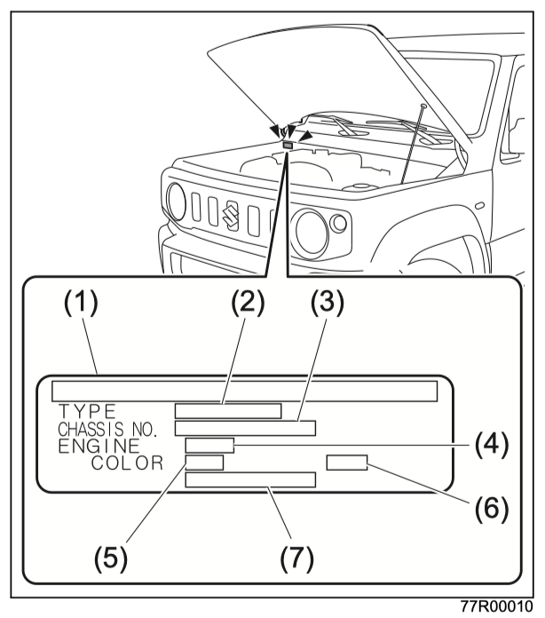

# Введение

Благодарим вас за покупку **Suzuki Jimny / Jimny Sierra**.

Перед началом эксплуатации обязательно прочитайте это руководство.
Неправильное обращение с автомобилем может стать причиной аварии или неисправности.
Внимательно прочитайте руководство и наслаждайтесь комфортной ездой как можно дольше.

- В этом руководстве описаны правила эксплуатации автомобиля и действия в экстренных ситуациях.
- Раздел **[«Обязательно к прочтению: безопасность вождения»](02-safety.md)** содержит особенно важные пункты. Обязательно внимательно прочитайте его.
- В руководстве используются следующие обозначения.

!!! danger "Внимание"
    Неправильное обращение может привести к смерти или тяжёлым травмам.

!!! warning "Осторожно"
    Неправильное обращение может привести к травмам.

!!! info "Примечание"
    Неправильное обращение может привести к материальному ущербу.

!!! tip "Подсказка"
    Полезная информация, которую стоит знать для удобной эксплуатации автомобиля.

Если в иллюстрации используется символ `×` или `⊘`, это означает запрет на показанное действие.

- Информация о гарантии и техническом обслуживании приведена в отдельной сервисной книжке. Читайте её вместе с этим руководством.
- Это руководство и сервисную книжку всегда храните в автомобиле.
- При передаче автомобиля новому владельцу передайте ему это руководство и сервисную книжку вместе с автомобилем.
- Для ограниченных серий, а также для аксессуаров, установленных дилером Suzuki или представителем Suzuki, читайте инструкции, приложенные к этим аксессуарам.
- Из-за изменений в спецификациях автомобиля содержание книги и иллюстрации могут не совпадать с фактическим автомобилем.
- Если есть вопросы, обратитесь к продавцу Suzuki.

## Как читать это руководство

На этой странице на примере объясняется базовый порядок чтения руководства.

В бумажном руководстве информация разбита на несколько элементов. В этой электронной версии навигация находится в левом меню:

- крупные пункты слева — это разделы руководства;
- вложенные пункты под открытым разделом — это заголовки внутри текущей страницы.

| Бумажное руководство | Электронное руководство |
| --- | --- |
| Заголовок вверху страницы | Крупный пункт раздела в левом меню и заголовок на странице |
| Название темы | Вложенный пункт под открытым разделом в левом меню |
| Оборудование по типу автомобиля | Зелёная плашка с иконкой ключа: функция зависит от модели, комплектации или установленного оборудования |
| Номер главы | Номер крупного раздела в левом меню |
| Ссылки | Внутренние ссылки на другие разделы |
| Внимание / Осторожно / Примечание / Подсказка | Цветные блоки с важными пояснениями |

## Как найти нужную информацию

Если вы ищете нужную информацию, быстрее всего воспользоваться одним из следующих способов.

### Если вы знаете примерное название раздела

- [Общее оглавление](index.md)
- Крупные разделы и вложенные заголовки в левом меню

Ссылки вида `1-23` адаптированы для электронной версии: `1` — это крупный раздел в левом меню, а `23` — заголовок внутри этого раздела. В левом меню он отображается как вложенный пункт под открытой страницей.

### Если знаете расположение элемента в автомобиле или ищете значение лампы на панели

- Иллюстрированное оглавление: [1-2](01-quick-guide.md)

### Если хотите распознать сигнал предупреждающего зуммера

- Если звучит предупреждающий зуммер: [1-23](01-quick-guide.md)

### Если знаете название компонента

- Указатель: [9-1](09-index.md)

### Если нужна техническая информация по маслам или запчастям

- Уход за автомобилем: [6-1](06-care.md)
- В экстренной ситуации: [7-1](07-emergency.md)
- Сервисные данные: [8-1](08-service-data.md)

### Искать через Q&A

- Часто задаваемые вопросы (Q&A): [1-33](01-quick-guide.md)

## Общее оглавление

Ниже перечислены основные главы руководства. Чтобы перейти к материалам конкретной главы, выберите её в левом меню или нажмите на название главы в списке.

### 1. [Краткое руководство](01-quick-guide.md)

- Иллюстрированное оглавление
- Если звучит предупреждающий зуммер
- Часто задаваемые вопросы (Q&A)

### 2. [Обязательно к прочтению: безопасность вождения](02-safety.md)

- Обязательно к прочтению: безопасность вождения

### 3. [Перед началом движения](03-before-driving.md)

- Открывание и закрывание дверей
- Охранная система
- Открывание и закрывание окон
- Регулировка различных элементов
- Регулировка сидений
- Ремни безопасности
- Подушки безопасности SRS
- Детские удерживающие устройства
- Комбинация приборов
- Использование переключателей

### 4. [Во время движения](04-driving.md)

- Запуск и остановка двигателя
- Бензиновый сажевый фильтр GPF
- Система автоматической остановки двигателя на холостом ходу
- Стояночный тормоз
- Рычаг переключения передач
- Автомобиль с автоматической коробкой передач
- Автомобиль с приводом 4WD
- ESP
- Suzuki Safety Support
- Камера заднего вида

### 5. [Использование оборудования](05-equipment.md)

- Основное оборудование
- Кондиционер и отопитель
- Аудиосистема

### 6. [Уход за автомобилем](06-care.md)

- Уход и обслуживание
- Эксплуатация в холодную погоду

### 7. [В экстренной ситуации](07-emergency.md)

- Что делать при возникновении неисправности
- Прокол колеса
- Разряд аккумулятора
- Перегрев двигателя
- Перегоревший предохранитель
- Перегоревшая лампа

### 8. [Сервисные данные](08-service-data.md)

- Сервисные данные

### 9. [Указатель](09-index.md)

- Указатель

## Где найти идентификационные данные автомобиля

Идентификационные данные автомобиля можно найти в свидетельстве о регистрации и на ID-табличке. ID-табличка расположена под капотом.

{ align=center }

| Номер на схеме | Обозначение |
| --- | --- |
| (1) | ID-табличка |
| (2) | Модель автомобиля |
| (3) | Номер шасси |
| (4) | Модель двигателя |
| (5) | Код цвета кузова |
| (6) | Код сочетания цвета кузова и цвета салона |
| (7) | Код модели / комплектации |

## Запись данных автомобиля

В автомобиле установлен компьютер, который записывает данные, связанные с управлением и работой автомобиля.

### Какие данные записываются { #recorded-data-types }

- Состояние двигателя, например частота вращения двигателя.
- Состояние автомобиля: скорость, пробег, средний расход топлива, средняя скорость, время движения, суммарный расход топлива, время работы системы автоматической остановки двигателя и другие параметры.
- Состояние трансмиссии, например положение передачи.
- Состояние органов управления: положение педали акселератора, тормоза, угол поворота рулевого колеса, положение рычага переключения передач.
- Информация о неисправностях различных компьютерных систем.
- Информация о срабатывании подушек безопасности SRS, записываемая в регистраторе событий `EDR`.
  См. также: [Подушки безопасности SRS](03-before-driving.md).
- Состояние работы систем помощи водителю.
- Изображения с передней камеры.
- Информация о местоположении автомобиля.

!!! tip "Подсказка"
    - В зависимости от типа автомобиля состав записываемых данных может отличаться.
    - Голос в салоне и разговоры не записываются.
    - В зависимости от условий эксплуатации некоторые данные могут не записываться.
    - Переднюю камеру можно настроить так, чтобы она не записывала изображения. Для этого обратитесь к дилеру Suzuki или представителю Suzuki.
    - Если отключить запись изображений передней камеры, данные во время работы системы также не будут сохраняться.

### Раскрытие данных

Suzuki, дилеры и представители Suzuki, а также организации, которым Suzuki поручила обработку данных, могут получать и использовать записанные компьютером данные для анализа аварий, диагностики неисправностей, исследований и повышения качества.

Suzuki, дилеры и представители Suzuki, а также организации, которым Suzuki поручила обработку данных, не раскрывают и не передают полученные данные третьим лицам, кроме следующих случаев:

- если владелец автомобиля дал согласие;
- если раскрытие требуется по закону, судебному распоряжению или иному обязательному законному требованию;
- если данные предоставляются исследовательским организациям и обработаны так, что по ним нельзя определить пользователя или конкретный автомобиль, например для статистической обработки.

### Удаление данных

Данные, перечисленные в разделе [«Какие данные записываются»](#recorded-data-types), могут быть удалены дилером Suzuki или представителем Suzuki, за исключением данных, необходимых для обслуживания автомобиля или соблюдения требований законодательства.

Если вы передаёте автомобиль другому владельцу или утилизируете его, обратитесь к дилеру Suzuki или представителю Suzuki для удаления данных. Если данные не будут удалены и попадут третьим лицам, Suzuki не несёт за это ответственности.

### Регистратор событий SRS Airbag `EDR`

`EDR` — сокращение от `Event Data Recorder`, регистратор событий. Он записывает данные при авариях, в которых срабатывает система подушек безопасности SRS.

См. также: [Подушки безопасности SRS](03-before-driving.md).

### Обработка данных через Suzuki Connect

Если вы пользуетесь Suzuki Connect, для предоставления сервиса информация о местоположении автомобиля и данные автомобиля сохраняются в бортовом коммуникационном устройстве.

Подробности см. в условиях использования Suzuki Connect.

При передаче автомобиля другому владельцу или утилизации автомобиля выполните процедуру отключения Suzuki Connect самостоятельно. После отключения персональная и приватная информация, сохранённая в бортовом коммуникационном устройстве, будет удалена.

Подробности см. в руководстве пользователя приложения Suzuki Connect.

!!! warning "Осторожно"
    Suzuki не несёт ответственности за утечку персональной или приватной информации, если процедура отключения Suzuki Connect не была выполнена.

## Лицензии программного обеспечения контроллера двигателя

### Jimny

Программное обеспечение, используемое в контроллере двигателя, включает открытое программное обеспечение.

Используемая лицензия: [Apache License 2.0](https://www.apache.org/licenses/LICENSE-2.0).

### Изменения исходного кода

При использовании открытого программного обеспечения были внесены изменения в следующие исходные файлы.

#### Файлы в `include/mbedtls/`

- Адаптация к правилам кодирования `MISRA C` / `CERT C`.
- Исправление ошибки сборки, возникавшей при встраивании `Mbed TLS`.
- Изменение настроек `Mbed TLS`: включение используемых функций и отключение неиспользуемых.

#### Файлы в `library/`

- Адаптация к правилам кодирования `MISRA C` / `CERT C`.
- Исправление ошибки сборки, возникавшей при встраивании `Mbed TLS`.
