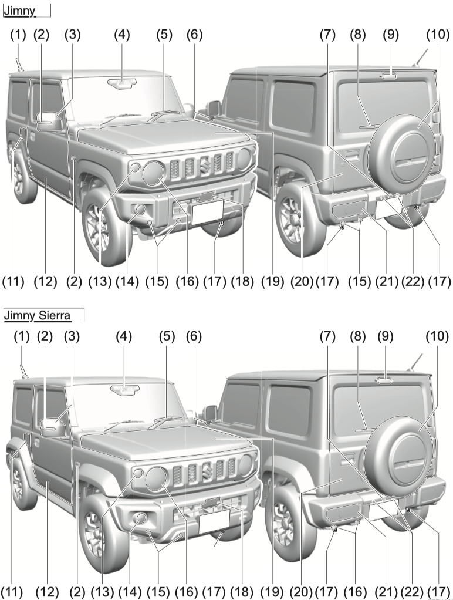
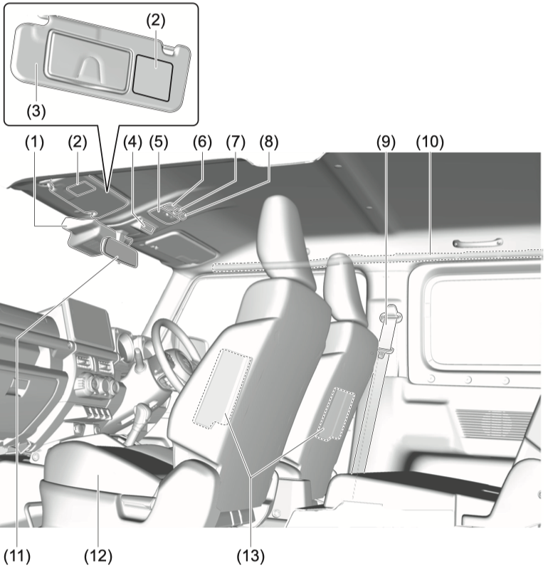
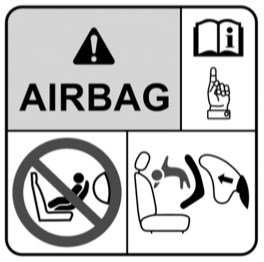
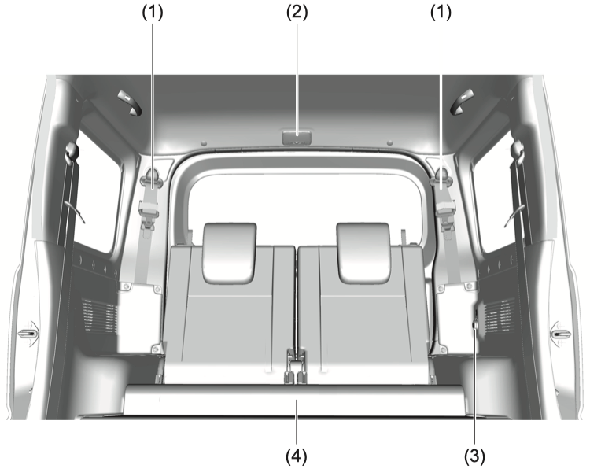
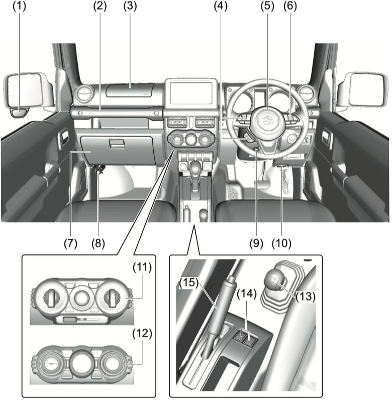
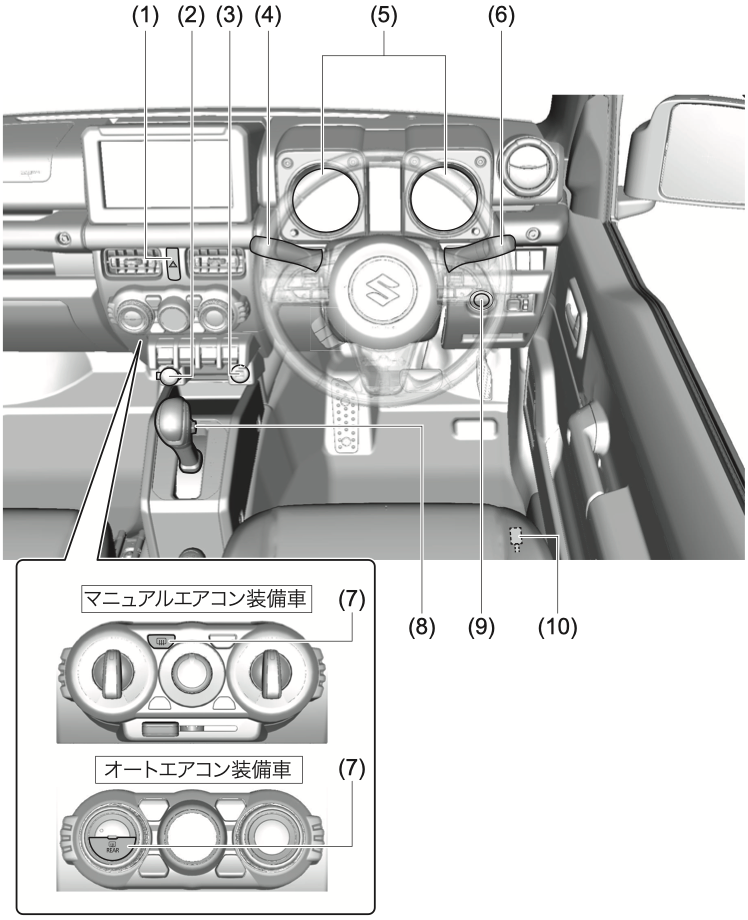

# 1. Краткое руководство

## Иллюстрированное оглавление

### Внешний вид

{ .center-image }

!!! tip "Оборудование по типу автомобиля"
    В зависимости от типа автомобиля часть оборудования может отличаться.

| № | Элемент | Где смотреть |
| --- | --- | --- |
| (1) | Антенна на крыше | [5-35](05-equipment.md) |
| (2) | Указатель поворота / аварийная сигнализация на крыле или двери | [7-43](07-emergency.md) |
| (3) | Боковое зеркало | [3-23](03-before-driving.md) |
| (4) | Передняя камера `DSBS II` | [4-64](04-driving.md) |
| (5) | Передний стеклоочиститель | [6-13](06-care.md) |
| (6) | Боковой повторитель указателя поворота | [3-24](03-before-driving.md) |
| (7) | Камера заднего вида | [4-141](04-driving.md) |
| (8) | Задний стеклоочиститель | [6-15](06-care.md) |
| (9) | Верхний стоп-сигнал | [7-43](07-emergency.md) |
| (10) | Запасное колесо | [7-18](07-emergency.md) |
| (11) | Заливная горловина топливного бака | [5-2](05-equipment.md) |
| (12) | Дверь | [3-13](03-before-driving.md) |
| (13) | Передний указатель поворота / аварийная сигнализация | [7-46](07-emergency.md) |
| (14) | Передняя противотуманная фара | [7-44](07-emergency.md) |
| (15) | Ультразвуковой датчик | [4-127](04-driving.md) |
| (16) | Фара | [7-43](07-emergency.md) |
| (17) | Буксировочный крюк | [7-5](07-emergency.md) |
| (18) | Передний радар `DSBS II` | [4-64](04-driving.md) |
| (19) | Капот | [5-3](05-equipment.md) |
| (20) | Задняя дверь | [3-14](03-before-driving.md) |
| (21) | Задний комбинированный фонарь | [7-47](07-emergency.md) |
| (22) | Подсветка номерного знака | [7-48](07-emergency.md) |

### Интерьер 1

{ .center-image }

!!! tip "Оборудование по типу автомобиля"
    В зависимости от типа автомобиля часть оборудования может отличаться.

| № | Элемент | Где смотреть |
| --- | --- | --- |
| (1) | Передняя камера `DSBS II` | [4-64](04-driving.md) |
| (2) | Предупреждающая наклейка о подушке безопасности SRS переднего пассажира | [2-36](02-safety.md) |
| (3) | Солнцезащитный козырёк | [5-5](05-equipment.md) |
| (4) | Контрольная лампа ремня безопасности заднего сиденья | [3-77](03-before-driving.md) |
| (5) | Передний плафон освещения салона | [5-7](05-equipment.md) |
| (6) | Микрофон Suzuki Emergency Call `Help Net` | [7-11](07-emergency.md) |
| (7) | Кнопка `SOS` | [7-11](07-emergency.md) |
| (8) | Микрофон hands-free | [5-36](05-equipment.md) |
| (9) | Ремень безопасности переднего сиденья | [3-38](03-before-driving.md) |
| (10) | Шторка безопасности SRS | [3-47](03-before-driving.md) |
| (11) | Внутреннее зеркало заднего вида | [3-23](03-before-driving.md) |
| (12) | Переднее сиденье | [3-29](03-before-driving.md) |
| (13) | Боковая подушка безопасности SRS | [3-47](03-before-driving.md) |

!!! warning "Осторожно"
    { width="125" align=left }

    Перед использованием детского сиденья обязательно прочитайте соответствующий раздел руководства.

    На сиденье, защищённом активной фронтальной подушкой безопасности, не устанавливайте детское удерживающее устройство спиной вперёд. Это может привести к смерти или тяжёлым травмам ребёнка.

### Интерьер 2

{ .center-image }

!!! tip "Оборудование по типу автомобиля"
    В зависимости от типа автомобиля часть оборудования может отличаться.

| № | Элемент | Где смотреть |
| --- | --- | --- |
| (1) | Ремень безопасности заднего сиденья | [3-40](03-before-driving.md) |
| (2) | Плафон освещения багажного отделения | [5-7](05-equipment.md) |
| (3) | Розетка электропитания | [5-12](05-equipment.md) |
| (4) | Заднее сиденье | [3-32](03-before-driving.md) |

### Интерьер 3

{ .center-image }

!!! tip "Оборудование по типу автомобиля"
    В зависимости от типа автомобиля часть оборудования может отличаться.

| № | Элемент | Где смотреть |
| --- | --- | --- |
| (1) | Боковой дефлектор | [3-24](03-before-driving.md) |
| (2) | Ручка посадки пассажира | [5-16](05-equipment.md) |
| (3) | Подушка безопасности SRS переднего пассажира | [3-46](03-before-driving.md) |
| (4) | Переключатели аудиосистемы на рулевом колесе | [5-36](05-equipment.md) |
| (5) | Подушка безопасности SRS водителя | [3-46](03-before-driving.md) |
| (5) | Выключатель звукового сигнала | [3-139](03-before-driving.md) |
| (6) | Переключатель адаптивного круиз-контроля | [4-107](04-driving.md), [4-117](04-driving.md) |
| (7) | Перчаточный ящик | [5-10](05-equipment.md) |
| (8) | Огнетушитель | [7-5](07-emergency.md) |
| (9) | Рычаг регулировки наклона рулевой колонки | [3-28](03-before-driving.md) |
| (10) | Ручка открывания капота | [5-3](05-equipment.md) |
| (11) | Кондиционер и отопитель, ручное управление | [5-19](05-equipment.md) |
| (12) | Кондиционер и отопитель, автоматическое управление | [5-24](05-equipment.md) |
| (13) | Рычаг раздаточной коробки | [4-42](04-driving.md) |
| (14) | Переключатель обогрева сиденья | [3-31](03-before-driving.md) |
| (15) | Стояночный тормоз | [4-27](04-driving.md) |

### Вокруг водительского места 1

{ .center-image }

!!! tip "Оборудование по типу автомобиля"
    В зависимости от типа автомобиля часть оборудования может отличаться.

| № | Элемент | Где смотреть |
| --- | --- | --- |
| (1) | Выключатель аварийной сигнализации | [3-136](03-before-driving.md) |
| (2) | Розетка электропитания | [5-12](05-equipment.md) |
| (3) | USB-разъём | [5-13](05-equipment.md) |
| (4) | Переключатель стеклоочистителя и омывателя | [3-137](03-before-driving.md) |
| (5) | Приборная панель | [3-72](03-before-driving.md) |
| (6) | Переключатель света | [3-129](03-before-driving.md) |
| (6) | Переключатель указателей поворота | [3-136](03-before-driving.md) |
| (6) | Переключатель противотуманных фар | [3-134](03-before-driving.md) |
| (7) | Переключатель обогрева заднего стекла | [5-31](05-equipment.md) |
| (8) | Рычаг переключения передач, автомобили с МКПП | [4-28](04-driving.md) |
| (8) | Система запуска с педалью сцепления, автомобили с МКПП | [4-11](04-driving.md) |
| (8) | Селектор передач, автомобили с АКПП | [4-30](04-driving.md) |
| (9) | Выключатель двигателя | [4-2](04-driving.md) |
| (10) | Рычаг открывания лючка топливного бака | [5-2](05-equipment.md) |
