# 1. Краткое руководство

## Иллюстрированное оглавление

!!! tip "Оборудование по типу автомобиля"
    В зависимости от типа автомобиля часть оборудования может отличаться.

### Внешний вид

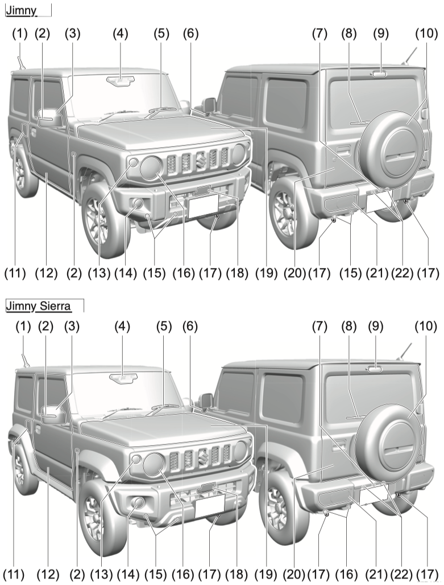{ .center-image }

| №    | Элемент                                                                  | Где смотреть                 |
|------|--------------------------------------------------------------------------|------------------------------|
| (1)  | Антенна на крыше                                                         | [Антенна на крыше](05-equipment.md#крышная-антенна)      |
| (2)  | Указатель поворота / аварийная световая сигнализация на крыле или дверном зеркале | [Указатель поворота / аварийная световая сигнализация на крыле или дверном зеркале](07-emergency.md#неразборные-световые-приборы)      |
| (3)  | Дверное зеркало                                                          | [Дверное зеркало](03-before-driving.md#наружные-зеркала) |
| (4)  | Передняя камера DSBS II                                                  | [Передняя камера DSBS II](04-driving.md#передняя-камера-передний-радар-и-ультразвуковые-датчики)        |
| (5)  | Передний стеклоочиститель                                                | [Передний стеклоочиститель](06-care.md#передние-стеклоочистители)           |
| (6)  | Боковое зеркало нижнего обзора                                           | [Боковое зеркало нижнего обзора](03-before-driving.md#дополнительные-зеркала-нижнего-бокового-обзора) |
| (7)  | Камера заднего вида                                                      | [Камера заднего вида](04-driving.md#камера-заднего-вида)       |
| (8)  | Задний стеклоочиститель                                                  | [Задний стеклоочиститель](06-care.md#задний-стеклоочиститель)           |
| (9)  | Верхний стоп-сигнал                                                      | [Верхний стоп-сигнал](07-emergency.md#мощность-ламп)      |
| (10) | Запасное колесо                                                          | [Запасное колесо](07-emergency.md#запасное-колесо)      |
| (11) | Заливная горловина топливного бака                                       | [Заливная горловина топливного бака](05-equipment.md#крышка-топливного-бака)       |
| (12) | Дверь                                                                    | [Дверь](03-before-driving.md#двери) |
| (13) | Передний указатель поворота / аварийная световая сигнализация                     | [Передний указатель поворота / аварийная световая сигнализация](07-emergency.md#передний-указатель-поворота-аварийная-сигнализация)      |
| (14) | Передняя противотуманная фара                                            | [Передняя противотуманная фара](07-emergency.md#передняя-противотуманная-фара)      |
| (15) | Ультразвуковой датчик                                                    | [Ультразвуковой датчик](04-driving.md#передняя-камера-передний-радар-и-ультразвуковые-датчики)       |
| (16) | Фара                                                                     | [Фара](07-emergency.md#при-замене-лампы)      |
| (17) | Буксировочный крюк                                                       | [Буксировочный крюк](07-emergency.md#куда-крепить-трос)       |
| (18) | Передний радар DSBS II                                                   | [Передний радар DSBS II](04-driving.md#передняя-камера-передний-радар-и-ультразвуковые-датчики)        |
| (19) | Капот                                                                    | [Капот](05-equipment.md#капот)       |
| (20) | Задняя дверь                                                             | [Задняя дверь](03-before-driving.md#дверь-багажного-отделения) |
| (21) | Задний комбинированный фонарь                                            | [Задний комбинированный фонарь](07-emergency.md#задний-комбинированный-фонарь)      |
| (22) | Подсветка номерного знака                                                | [Фонарь освещения номерного знака](07-emergency.md#фонарь-освещения-номерного-знака)      |

### Интерьер 1

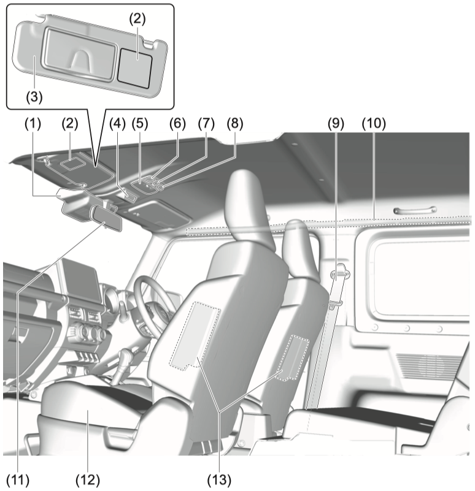{ .center-image }

| №    | Элемент                                                                 | Где смотреть                 |
|------|-------------------------------------------------------------------------|------------------------------|
| (1)  | Передняя камера DSBS II                                                 | [Передняя камера DSBS II](04-driving.md#передняя-камера-передний-радар-и-ультразвуковые-датчики)        |
| (2)  | Предупреждающая наклейка о подушке безопасности SRS переднего пассажира ([※1](#quick-guide-passenger-airbag-note-1), [※2](#quick-guide-passenger-airbag-note-2)) | [Предупреждающая наклейка о подушке безопасности SRS переднего пассажира](02-safety.md#предупреждающая-наклейка-о-подушке-безопасности-srs-переднего-пассажира) |
| (3)  | Солнцезащитный козырёк                                                  | [Солнцезащитный козырёк](05-equipment.md#солнцезащитные-козырьки)       |
| (4)  | Контрольная лампа ремня безопасности заднего сиденья                    | [Контрольная лампа ремня безопасности заднего сиденья](03-before-driving.md#контрольная-лампа-задних-ремней-безопасности) |
| (5)  | Передний плафон освещения салона                                        | [Передний плафон освещения салона](05-equipment.md#передний-плафон-освещения-салона)       |
| (6)  | Микрофон системы экстренного вызова Suzuki Helpnet®                    | [Микрофон системы экстренного вызова Suzuki Helpnet®](07-emergency.md#система-экстренного-вызова-suzuki-helpnet)      |
| (7)  | Кнопка SOS                                                              | [Кнопка SOS](07-emergency.md#кнопка-sos-ручной-вызов)      |
| (8)  | Микрофон громкой связи                                                 | [Микрофон громкой связи](05-equipment.md#переключатели-аудиосистемы-на-рулевом-колесе)      |
| (9)  | Ремень безопасности переднего сиденья                                   | [Ремень безопасности переднего сиденья](03-before-driving.md#передние-ремни-безопасности) |
| (10) | Шторка безопасности SRS                                                 | [Шторка безопасности SRS](03-before-driving.md#система-шторок-безопасности-srs) |
| (11) | Внутреннее зеркало заднего вида                                         | [Внутреннее зеркало заднего вида](03-before-driving.md#внутреннее-зеркало-заднего-вида) |
| (12) | Переднее сиденье                                                        | [Переднее сиденье](03-before-driving.md#передние-сиденья) |
| (13) | Боковая подушка безопасности SRS                                        | [Боковая подушка безопасности SRS](03-before-driving.md#боковые-подушки-безопасности-srs) |

!!! warning "Осторожно"
    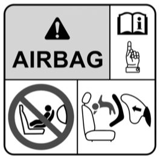{ width="125" align=left }

    ※1 Перед использованием детского удерживающего устройства обязательно прочитайте соответствующий раздел руководства.

    ※2 На сиденье, защищённом активной фронтальной подушкой безопасности, не устанавливайте детское удерживающее устройство спиной вперёд. Это может привести к смерти или тяжёлым травмам ребёнка.

### Интерьер 2

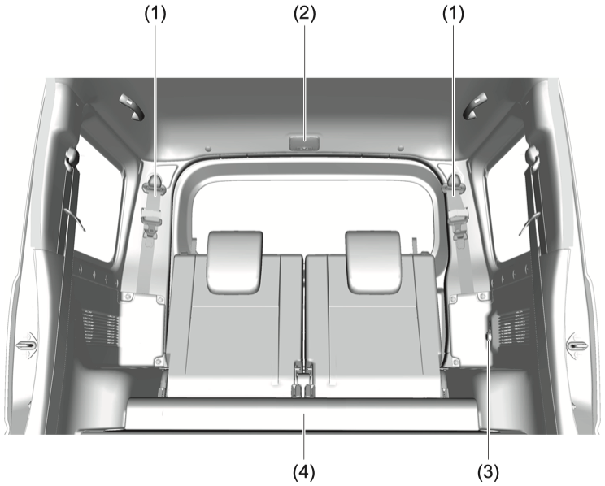{ .center-image }

| №   | Элемент                             | Где смотреть                 |
|-----|-------------------------------------|------------------------------|
| (1) | Ремень безопасности заднего сиденья | [Ремень безопасности заднего сиденья](03-before-driving.md#задние-ремни-безопасности) |
| (2) | Лампа освещения багажного отделения | [Плафон освещения багажного отделения](05-equipment.md#плафон-освещения-багажного-отделения)       |
| (3) | Розетка электропитания              | [Розетка электропитания](05-equipment.md#розетки-питания-12-в)      |
| (4) | Заднее сиденье                      | [Заднее сиденье](03-before-driving.md#задние-сиденья) |

### Интерьер 3

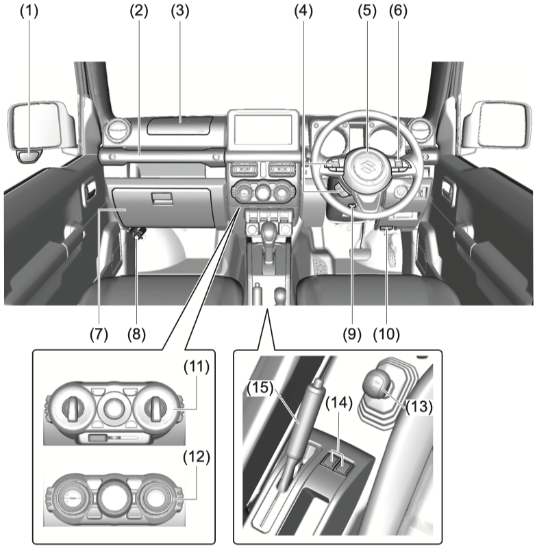{ .center-image }

| №    | Элемент                                            | Где смотреть                                   |
|------|----------------------------------------------------|------------------------------------------------|
| (1)  | Боковое зеркало нижнего обзора                     | [Боковое зеркало нижнего обзора](03-before-driving.md#дополнительные-зеркала-нижнего-бокового-обзора)                   |
| (2)  | Поручень для посадки и высадки переднего пассажира | [Поручень для посадки и высадки переднего пассажира](05-equipment.md#поручень-для-посадки-и-высадки-переднего-пассажира)                        |
| (3)  | Подушка безопасности SRS переднего пассажира       | [Подушка безопасности SRS переднего пассажира](03-before-driving.md#фронтальная-подушка-безопасности-srs-переднего-пассажира)                   |
| (4)  | Переключатели аудиосистемы на рулевом колесе       | [Переключатели аудиосистемы на рулевом колесе](05-equipment.md#переключатели-аудиосистемы-на-рулевом-колесе)                        |
| (5)  | Подушка безопасности SRS водителя                  | [Подушка безопасности SRS водителя](03-before-driving.md#фронтальная-подушка-безопасности-srs-водителя)                   |
| (5)  | Выключатель звукового сигнала                      | [Выключатель звукового сигнала](03-before-driving.md#выключатель-звукового-сигнала)                  |
| (6)  | Переключатель адаптивного круиз-контроля           | [Адаптивный круиз-контроль](04-driving.md#адаптивный-круиз-контроль), [адаптивный круиз-контроль с функцией следования во всём диапазоне скоростей](04-driving.md#адаптивный-круиз-контроль-с-функцией-следования-во-всём-диапазоне-скоростей) |
| (7)  | Перчаточный ящик                                   | [Перчаточный ящик](05-equipment.md#перчаточный-ящик)                        |
| (8)  | Сигнальный факел                                   | [Сигнальный факел](07-emergency.md#сигнальный-факел)                         |
| (9)  | Рычаг регулировки наклона рулевой колонки          | [Рычаг регулировки наклона рулевой колонки](03-before-driving.md#регулировка-рулевой-колонки-по-высоте)                   |
| (10) | Ручка открывания капота                            | [Ручка открывания капота](05-equipment.md#капот)                         |
| (11) | Кондиционер и отопитель, ручное управление         | [Кондиционер с ручным управлением](05-equipment.md#кондиционер-с-ручным-управлением)                        |
| (12) | Кондиционер и отопитель, автоматическое управление | [Автоматическая климатическая система](05-equipment.md#автоматическая-климатическая-система)                        |
| (13) | Рычаг раздаточной коробки                          | [Рычаг раздаточной коробки](04-driving.md#переключение-2wd4wd)                          |
| (14) | Переключатель обогрева сиденья                     | [Переключатель обогрева сиденья](03-before-driving.md#выключатели-подогрева-сидений)                   |
| (15) | Стояночный тормоз                                  | [Стояночный тормоз](04-driving.md#стояночный-тормоз)                          |

### Вокруг водительского места 1

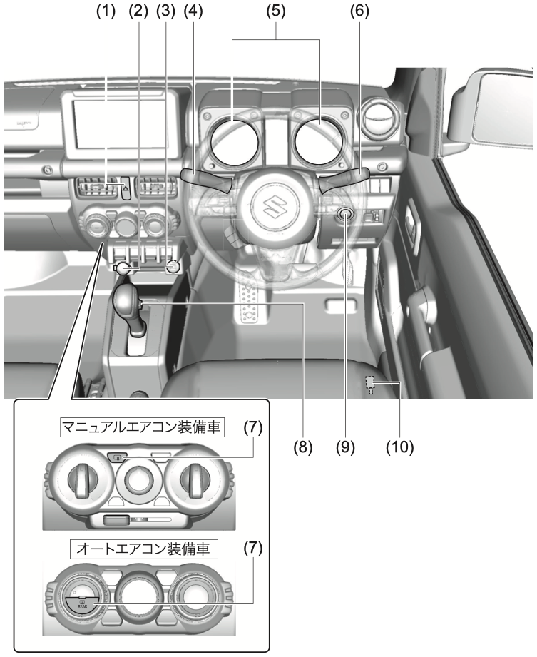{ .center-image }

| №    | Элемент                                                 | Где смотреть                  |
|------|---------------------------------------------------------|-------------------------------|
| (1)  | Выключатель аварийной световой сигнализации             | [Выключатель аварийной световой сигнализации](03-before-driving.md#выключатель-аварийной-сигнализации) |
| (2)  | Розетка электропитания                                  | [Розетка электропитания](05-equipment.md#розетки-питания-12-в)       |
| (3)  | USB-разъём                                              | [USB-разъём](05-equipment.md#usb-разъём)       |
| (4)  | Переключатель стеклоочистителя и омывателя              | [Переключатель стеклоочистителя и омывателя](03-before-driving.md#переключатель-стеклоочистителя-и-омывателя) |
| (5)  | Приборная панель                                        | [Приборная панель](03-before-driving.md#как-читать-показания-приборов)  |
| (6)  | Переключатель света                                     | [Переключатель света](03-before-driving.md#переключатель-освещения) |
| (6)  | Переключатель указателей поворота                       | [Переключатель указателей поворота](03-before-driving.md#переключатель-указателей-поворота) |
| (6)  | Переключатель противотуманных фар                       | [Переключатель противотуманных фар](03-before-driving.md#переключатель-передних-противотуманных-фар) |
| (7)  | Переключатель обогрева заднего стекла                   | [Выключатель обогрева заднего стекла](05-equipment.md#выключатель-обогрева-заднего-стекла)       |
| (8)  | Рычаг переключения передач, автомобили с МКПП           | [Рычаг переключения передач, автомобили с МКПП](04-driving.md#рычаг-переключения-передач)         |
| (8)  | Система запуска с выжатым сцеплением, автомобили с МКПП | [Система запуска с выжатым сцеплением, автомобили с МКПП](04-driving.md#система-запуска-с-выжатым-сцеплением)         |
| (8)  | Селектор передач, автомобили с АКПП                     | [Селектор передач, автомобили с АКПП](04-driving.md#управление-селектором-передач)         |
| (9)  | Выключатель двигателя                                   | [Выключатель двигателя](04-driving.md#работа-выключателя-двигателя)          |
| (10) | Рычаг открывания лючка топливного бака                  | [Рычаг открывания лючка топливного бака](05-equipment.md#лючок-топливного-бака)        |

### Вокруг водительского места 2

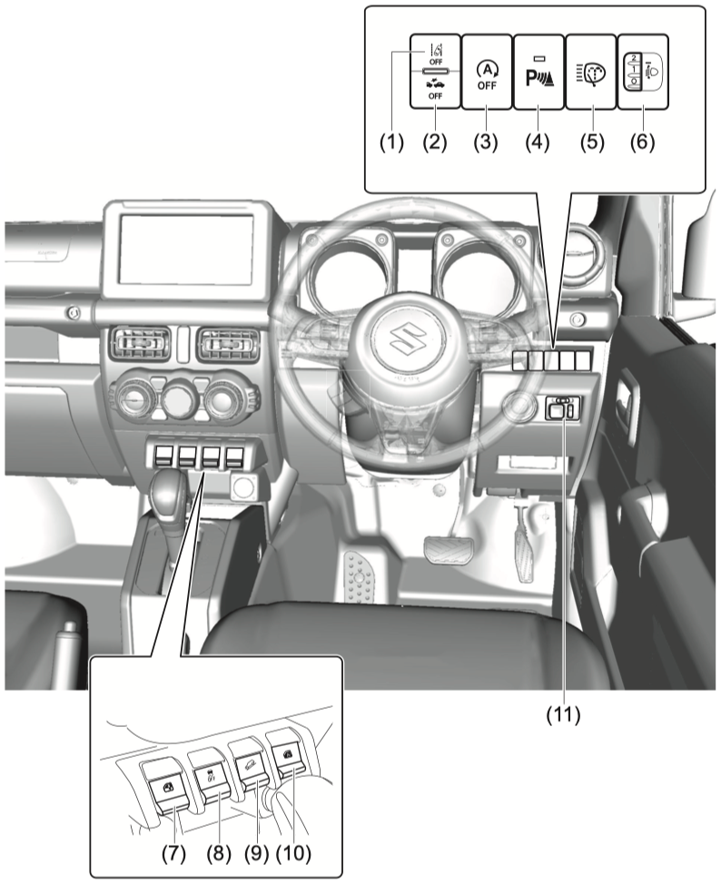{ .center-image }

| №    | Элемент                                                        | Где смотреть                  |
|------|----------------------------------------------------------------|-------------------------------|
| (1)  | Выключатель OFF функции предотвращения схода с полосы           | [Выключатель OFF функции предотвращения схода с полосы](04-driving.md#выключатель-off-предотвращения-схода-с-полосы)         |
| (2)  | Выключатель отключения системы DSBS II                         | [Выключатель OFF системы поддержки торможения с двумя датчиками DSBS II](04-driving.md#выключатель-off-системы-поддержки-торможения-с-двумя-датчиками-dsbs-ii)         |
| (3)  | Выключатель отключения системы автоматической остановки двигателя | [Выключатель OFF системы автоматической остановки двигателя](04-driving.md#выключатель-off-системы-автоматической-остановки-двигателя)       |
| (4)  | Выключатель отключения зуммера парковочных датчиков            | [Выключатель отключения зуммера парковочных датчиков](04-driving.md#выключатель-отключения-зуммера-парковочных-датчиков)        |
| (5)  | Выключатель омывателя фар                                      | [Выключатель омывателя фар](03-before-driving.md#выключатель-омывателя-фар) |
| (6)  | Регулятор высоты светового пучка фар                           | [Регулятор высоты светового пучка фар](03-before-driving.md#корректор-фар) |
| (7)  | Переключатель стеклоподъёмника, сторона пассажира              | [Переключатель стеклоподъёмника, сторона пассажира](03-before-driving.md#электростеклоподъёмники)  |
| (8)  | Выключатель отключения ESP®                                    | [Выключатель ESP® OFF](04-driving.md#выключатель-esp-off)         |
| (9)  | Переключатель системы помощи при спуске                        | [Выключатель системы помощи при спуске](04-driving.md#система-помощи-при-спуске)         |
| (10) | Переключатель стеклоподъёмника, сторона водителя               | [Переключатель стеклоподъёмника, сторона водителя](03-before-driving.md#электростеклоподъёмники)  |
| (11) | Переключатель регулировки угла боковых зеркал                  | [Переключатель регулировки угла боковых зеркал](03-before-driving.md#наружные-зеркала)  |
| (11) | Переключатель складывания боковых зеркал                       | [Переключатель складывания боковых зеркал](03-before-driving.md#наружные-зеркала)  |

### Багажное отделение

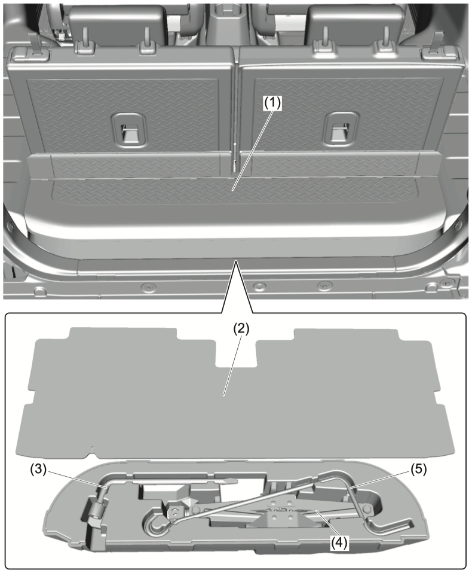{ .center-image }

| №   | Элемент                    | Где смотреть            |
|-----|----------------------------|-------------------------|
| (1) | Багажный ящик              | [Багажный ящик](05-equipment.md#багажный-ящик) |
| (2) | Коврик багажного отделения | [Коврик багажного отделения](07-emergency.md#место-хранения-инструмента-и-домкрата) |
| (3) | Колёсный ключ             | [Колёсный ключ](07-emergency.md#место-хранения-инструмента-и-домкрата) |
| (4) | Домкрат                    | [Домкрат](07-emergency.md#место-хранения-инструмента-и-домкрата) |
| (5) | Рукоятка домкрата          | [Рукоятка домкрата](07-emergency.md#место-хранения-инструмента-и-домкрата) |

### Ключи

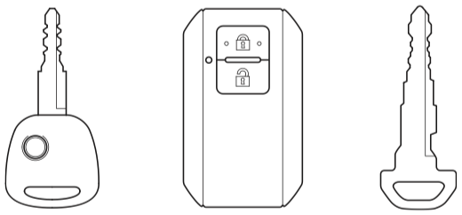{ .center-image }

| Тема                              | Где смотреть                 |
|-----------------------------------|------------------------------|
| Ключи                             | [Ключи](03-before-driving.md#ключи)  |
| Двери                             | [Двери](03-before-driving.md#двери) |
| Система бесключевого доступа      | [Система бесключевого доступа](03-before-driving.md#система-бесключевого-доступа)  |
| Пульт дистанционного управления   | [Пульт дистанционного управления](03-before-driving.md#пульт-дистанционного-управления)  |
| Система бесключевого запуска кнопкой | [Система бесключевого запуска кнопкой](04-driving.md#система-бесключевого-запуска-кнопкой)         |
| Запуск двигателя                  | [Запуск двигателя](04-driving.md#запуск-двигателя)        |

### Предупреждающие лампы

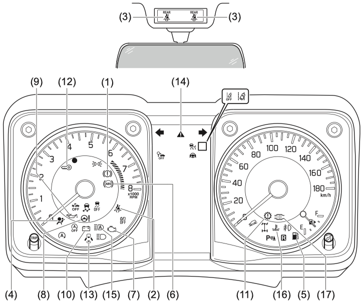{ .center-image }

- Если предупреждающая лампа загорелась или продолжает мигать, возможна неисправность автомобиля или системы. Ознакомьтесь с указанным разделом и обратитесь для проверки к дилеру Suzuki или в авторизованный сервис Suzuki.
- При включении предупреждающей или контрольной лампы на многофункциональном дисплее приборной панели может появляться сообщение. См. также: [сообщения многофункционального дисплея](03-before-driving.md#сообщения-многофункционального-информационного-дисплея).
- Лампы с отметкой ※ должны кратковременно загораться при переводе выключателя двигателя в положение `ON`. Если такая лампа не загорается, обратитесь для проверки к дилеру Suzuki или в авторизованный сервис Suzuki.
- Система автоматического дальнего света и индикатор работы системы автоматического дальнего света отображаются одним символом, но отличаются цветом включения.
- Температура охлаждающей жидкости и индикатор низкой температуры охлаждающей жидкости отображаются одним символом, но отличаются цветом включения.

| №    |                                             Символ                                             | Самопроверка | Цвет | Название                               | Где смотреть                 |
|------|:----------------------------------------------------------------------------------------------:|--------------|:----:|----------------------------------------|------------------------------|
| (1)  |        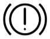{ width="48" }         | ※            |  🔴  | Тормозная система                      | [Тормозная система](03-before-driving.md#контрольная-лампа-тормозной-системы-красная) |
| (2)  |   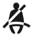{ width="48" }   |              |  🔴  | Ремень безопасности передних сидений   | [Ремень безопасности передних сидений](03-before-driving.md#контрольная-лампа-передних-ремней-безопасности) |
| (3)  |    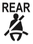{ width="48" }    |              |  🔴  | Ремень безопасности задних сидений     | [Ремень безопасности задних сидений](03-before-driving.md#контрольная-лампа-задних-ремней-безопасности) |
| (4)  |   { width="48" }       | ※            |  🔴  | Подушки безопасности SRS              | [Подушки безопасности SRS](03-before-driving.md#контрольная-лампа-подушек-безопасности-srs) |
| (5)  |             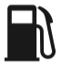{ width="48" }              |              |  🟡  | Низкий уровень топлива                 | [Низкий уровень топлива](03-before-driving.md#контрольная-лампа-низкого-уровня-топлива) |
| (6)  |               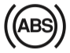{ width="48" }                | ※            |  🟡  | ABS                                    | [ABS](03-before-driving.md#контрольная-лампа-abs) |
| (7)  |            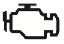{ width="48" }             | ※            |  🟡  | Двигатель                              | [Двигатель](03-before-driving.md#контрольная-лампа-двигателя) |
| (8)  |  { width="48" }   | ※            |  🟡  | Усилитель рулевого управления          | [Усилитель рулевого управления](03-before-driving.md#контрольная-лампа-электроусилителя-рулевого-управления) |
| (9)  |          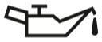{ width="48" }          | ※            |  🔴  | Давление масла                         | [Давление масла](03-before-driving.md#контрольная-лампа-давления-масла) |
| (10) |             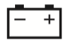{ width="48" }              | ※            |  🔴  | Зарядка                                | [Зарядка](03-before-driving.md#контрольная-лампа-зарядки) |
| (11) |           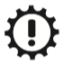{ width="48" }            | ※            |  🟡  | Трансмиссия, автомобили с АКПП         | [Трансмиссия, автомобили с АКПП](03-before-driving.md#контрольная-лампа-трансмиссии) |
| (12) |           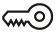{ width="48" }           | ※            |  🟡  | Иммобилайзер                           | [Иммобилайзер](03-before-driving.md#контрольная-лампа-иммобилайзера) |
| (13) |          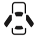{ width="48" }           |              |  🔴  | Открытая дверь                         | [Открытая дверь](03-before-driving.md#контрольная-лампа-открытой-двери-или-капота) |
| (14) |          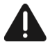{ width="48" }          | ※            |  🟡  | Главная предупреждающая лампа                | [Главная предупреждающая лампа](03-before-driving.md#главная-предупреждающая-лампа) |
| (15) |   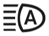{ width="48" }    | ※            |  🟡  | Система автоматического дальнего света | [Система автоматического дальнего света](03-before-driving.md#контрольная-лампа-системы-автоматического-дальнего-света) |
| (16) | 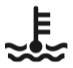{ width="48" } | ※            |  🔴  | Температура охлаждающей жидкости       | [Температура охлаждающей жидкости](03-before-driving.md#контрольная-лампа-температуры-охлаждающей-жидкости-красная) |
| (17) |               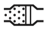{ width="48" }                |              |  🟡  | Бензиновый сажевый фильтр GPF          | [Бензиновый сажевый фильтр GPF](03-before-driving.md#контрольная-лампа-бензинового-сажевого-фильтра-gpf) |

### Контрольные лампы и индикаторы

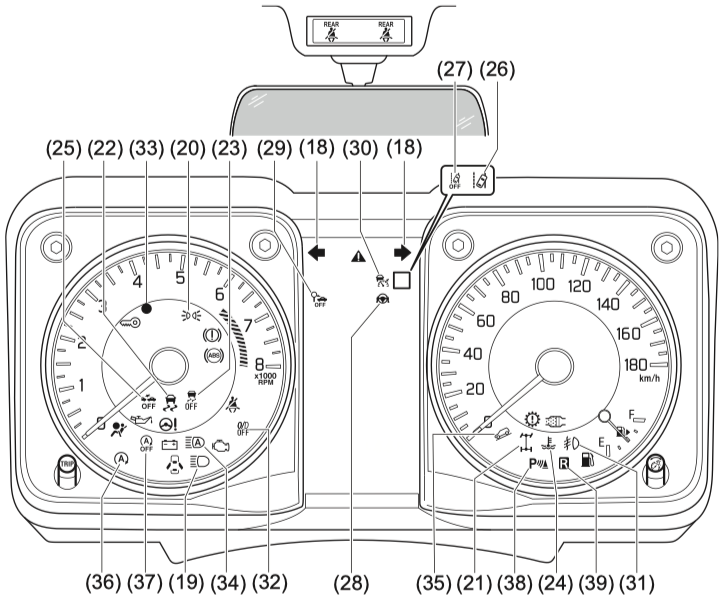{ .center-image }

- Индикаторы с отметкой ※ должны кратковременно загораться при переводе выключателя двигателя в положение `ON`. Если такой индикатор не загорается, обратитесь для проверки к дилеру Suzuki или в авторизованный сервис Suzuki.
- У индикатора системы автоматической остановки двигателя есть особые условия включения. См. также: [система автоматической остановки двигателя](04-driving.md#система-автоматической-остановки-двигателя-на-холостом-ходу).

| №    |                                                Символ                                                 | Самопроверка | Цвет  | Название                                      | Где смотреть                 |
|------|:-----------------------------------------------------------------------------------------------------:|--------------|:-----:|-----------------------------------------------|------------------------------|
| (18) |           { width="48" }            |              |  🟢   | Указатель поворота                            | [Указатель поворота](03-before-driving.md#индикатор-указателей-поворота) |
| (19) |              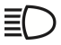{ width="48" }               |              |  🔵   | Дальний свет фар                              | [Дальний свет фар](03-before-driving.md#индикатор-дальнего-света-фар) |
| (20) |             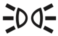{ width="48" } |              |  🟢   | Включённое наружное освещение                 | [Включённое наружное освещение](03-before-driving.md#индикатор-включённого-наружного-освещения) |
| (21) |                   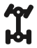{ width="48" }                   | ※            |  🟢   | 4WD                                           | [4WD](03-before-driving.md#индикатор-4wd) |
| (22) |                   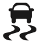{ width="48" }                   | ※            |  🟡   | ESP®                                          | [ESP®](03-before-driving.md#индикатор-работы-esp) |
| (23) |        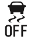{ width="48" }                   | ※            |  🟡   | ESP® отключена                                | [ESP® отключена](03-before-driving.md#индикатор-esp-off) |
| (24) | 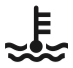{ width="48" } |              |  🔵   | Низкая температура охлаждающей жидкости       | [Низкая температура охлаждающей жидкости](03-before-driving.md#индикатор-низкой-температуры-охлаждающей-жидкости-синий) |
| (25) |       { width="48" }                | ※            |  🟡   | DSBS II отключена                             | [DSBS II отключена](03-before-driving.md#индикатор-отключения-системы-поддержки-торможения-с-двумя-датчиками-dsbs-ii) |
| (26) |        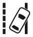{ width="48" }        | ※            | 🟡🟢  | Функция предотвращения схода с полосы                     | [Функция предотвращения схода с полосы](03-before-driving.md#индикатор-работы-предотвращения-схода-с-полосы) |
| (27) |      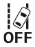{ width="48" } | ※          |  🟡   | Функция предотвращения схода с полосы отключена            | [Функция предотвращения схода с полосы отключена](03-before-driving.md#индикатор-отключения-предотвращения-схода-с-полосы) |
| (28) |      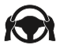{ width="48" }        | ※            |  ⚪🟢  | Автоматическое подруливание                   | [Автоматическое подруливание](03-before-driving.md#индикатор-работы-автоматического-подруливания) |
| (29) |    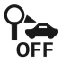{ width="48" } | ※        |  🟡   | Распознавание дорожных знаков отключено       | [Распознавание дорожных знаков отключено](03-before-driving.md#индикатор-отключения-распознавания-дорожных-знаков) |
| (30) |        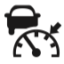{ width="48" }        |              | 🟡🟢⚪ | Адаптивный круиз-контроль                     | [Адаптивный круиз-контроль](03-before-driving.md#индикатор-адаптивного-круиз-контроля) |
| (31) |      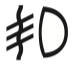{ width="48" }      |              |  🟢   | Передние противотуманные фары                 | [Передние противотуманные фары](03-before-driving.md#индикатор-передних-противотуманных-фар) |
| (32) |        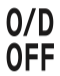{ width="48" }   |              |  🟡   | Повышающая передача отключена, автомобили с АКПП | [Повышающая передача отключена, автомобили с АКПП](03-before-driving.md#индикатор-отключения-повышающей-передачи-od) |
| (33) |          { width="48" } |              |  🔴   | Индикатор охранной сигнализации               | [Индикатор охранной сигнализации](03-before-driving.md#индикатор-охранной-сигнализации) |
| (34) |  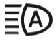{ width="48" }  |              |  🟢   | Работа системы автоматического дальнего света | [Работа системы автоматического дальнего света](03-before-driving.md#индикатор-работы-системы-автоматического-дальнего-света) |
| (35) |     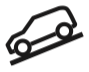{ width="48" }     | ※            |  🟢   | Система помощи при спуске               | [Система помощи при спуске](03-before-driving.md#индикатор-системы-помощи-при-спуске) |
| (36) |               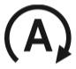{ width="48" }                | ※            |  🟢   | Система автоматической остановки двигателя                          | [Система автоматической остановки двигателя](03-before-driving.md#индикатор-системы-автоматической-остановки-двигателя) |
| (37) |       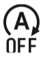{ width="48" }     | ※            |  🟡   | Система автоматической остановки двигателя отключена                | [Система автоматической остановки двигателя отключена](03-before-driving.md#индикатор-отключения-системы-автоматической-остановки-двигателя) |
| (38) |           { width="48" }            | ※            |  🟡   | Парковочные датчики                           | [Парковочные датчики](03-before-driving.md#индикатор-работы-парковочных-датчиков) |
| (39) |                { width="48" }                |              |  🟡   | R, задний ход, автомобили с МКПП              | [R, задний ход, автомобили с МКПП](03-before-driving.md#индикатор-r-задний-ход) |

### Предупреждающий зуммер

- ※1 Если вместе со звуком зуммера мигает { width="20" } главная предупреждающая лампа, на многофункциональном дисплее отображается сообщение о состоянии автомобиля или способе устранения.
- ※2 Если на многофункциональном дисплее отображается сообщение, см. также: [сообщения многофункционального дисплея](03-before-driving.md#сообщения-многофункционального-информационного-дисплея).

#### Для всех автомобилей

| Когда                                                 | Звук зуммера                                                                           |                                                            Лампа или индикатор                                                             | Причина и что делать                                                                                                                                                                                                                                                                                                      |
|-------------------------------------------------------|----------------------------------------------------------------------------------------|:------------------------------------------------------------------------------------------------------------------------------------------:|---------------------------------------------------------------------------------------------------------------------------------------------------------------------------------------------------------------------------------------------------------------------------------------------------------------------------|
| Открыта любая дверь или капот                         | Зуммер в салоне: непрерывный сигнал                                                    |    { width="32" } Мигает с интервалом около 2 секунд     | Сработала охранная сигнализация. Остановить сигнализацию можно одним из способов: перевести выключатель двигателя в положение `ON`; разблокировать автомобиль с пульта дистанционного управления или кнопки запроса. См. также: [охранная сигнализация](03-before-driving.md#охранная-сигнализация).                                         |
| Выключатель двигателя переведён в положение `ON`      | Зуммер в салоне: длинные прерывистые сигналы                                           | { width="32" } Мигает мелкими интервалами около 8 секунд | Охранная сигнализация срабатывала во время стоянки. Убедитесь, что автомобиль не повреждён и не подвергался попытке угона. См. также: [охранная сигнализация](03-before-driving.md#охранная-сигнализация).                                                                                                                                   |
| Выключатель двигателя переведён в положение `ON`      | Зуммер в салоне: одиночный сигнал и голосовое сообщение                                |                                                            [※1](#buzzer-note-1)                                                            | Рулевая колонка не разблокирована. Поверните рулевое колесо влево или вправо, чтобы снять нагрузку с замка, затем повторите запуск. См. также: [предупреждение о неразблокированной рулевой колонке](04-driving.md#предупреждение-о-неразблокированной-рулевой-колонке).                                                                                                                 |
| Выключатель двигателя находится в положении `ON`      | Зуммер в салоне: одиночный сигнал и голосовое сообщение                                |           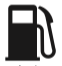{ width="32" } Горит [※2](#buzzer-note-2)            | Низкий уровень топлива. Как можно скорее заправьте автомобиль. См. также: [лампа низкого уровня топлива](03-before-driving.md#контрольная-лампа-низкого-уровня-топлива).                                                                                                                                                                                        |
| Во время движения                                     | Зуммер в салоне: длинные прерывистые сигналы                                           |                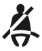{ width="32" } Мигает                | Водитель или пассажир переднего сиденья не пристёгнут ремнём безопасности. Остановитесь в безопасном месте и пристегните ремень. Если на переднем пассажирском сиденье лежит багаж, датчик может определить его как пассажира и включить предупреждение. См. также: [зуммер ремня безопасности](03-before-driving.md#сигнализатор-непристёгнутого-ремня-безопасности). |
| Во время движения                                     | Зуммер в салоне: длинные прерывистые сигналы                                           |                 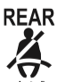{ width="32" } Мигает                 | Пассажир заднего сиденья не пристёгнут ремнём безопасности. Пристегните ремень. Если на заднем сиденье лежит багаж, датчик может определить его как пассажира и включить предупреждение. См. также: [зуммер ремня безопасности](03-before-driving.md#сигнализатор-непристёгнутого-ремня-безопасности).                                                                 |
| Во время движения                                     | Зуммер в салоне: короткие прерывистые сигналы и голосовое сообщение                    |              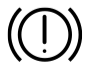{ width="32" } Горит [※1](#buzzer-note-1)              | Стояночный тормоз не отпущен. Отпустите стояночный тормоз. См. также: [зуммер предупреждения о неотпущенном стояночном тормозе](04-driving.md#зуммер-предупреждения-о-неотпущенном-стояночном-тормозе).                                                                                                                                                                                            |
| Во время движения                                     | Зуммер в салоне: длинные прерывистые сигналы и голосовое сообщение                     |               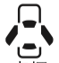{ width="32" } Горит [※1](#buzzer-note-1)                | Одна из дверей или капот закрыты не полностью. Остановитесь в безопасном месте и закройте их полностью. См. также: [предупреждение об открытой двери](03-before-driving.md#контрольная-лампа-открытой-двери-или-капота).                                                                                                                                           |
| Открыта дверь водителя                                | Зуммер в салоне: непрерывный сигнал и голосовое сообщение                              |               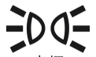{ width="32" } Горит [※1](#buzzer-note-1)               | Фары или габаритные огни оставлены включёнными. Выключите освещение. См. также: [зуммер невыключенного освещения](03-before-driving.md#зуммер-предупреждения-о-невыключенном-освещении).                                                                                                                                                                               |
| Во время движения                                     | Короткие прерывистые сигналы                                                           |                                                            [※2](#buzzer-note-2)                                                            | Сработала система экстренного торможения DSBS II. Сильно нажмите педаль тормоза. См. также: [система поддержки торможения с двумя датчиками DSBS II](04-driving.md#система-поддержки-торможения-с-двумя-датчиками-dsbs-ii).                                                                                                                                                                                              |
| Во время движения                                     | Короткие прерывистые сигналы                                                           |                                                            [※2](#buzzer-note-2)                                                            | Сработало предупреждение о вилянии автомобиля. Проверьте дорожную обстановку, аккуратно управляйте рулём и вернитесь ближе к центру полосы. См. также: [функция предотвращения схода с полосы](04-driving.md#предотвращение-схода-с-полосы).                                                                                                                     |
| Во время движения                                     | Непрерывный сигнал                                                                     |                                                            [※2](#buzzer-note-2)                                                            | Сработало предупреждение о сходе с полосы. Проверьте дорожную обстановку, аккуратно управляйте рулём и вернитесь ближе к центру полосы. Если в режиме настроек выбран вибросигнал, зуммер не звучит. См. также: [функция предотвращения схода с полосы](04-driving.md#предотвращение-схода-с-полосы), [режим настроек](08-service-data.md#режим-настроек).                    |
| Во время движения                                     | Непрерывный сигнал                                                                     |                                                            [※2](#buzzer-note-2)                                                            | Сработало предупреждение о необходимости управлять рулевым колесом. Крепко держите рулевое колесо. См. также: [функция предотвращения схода с полосы](04-driving.md#предотвращение-схода-с-полосы).                                                                                                                                                                              |
| Во время движения                                     | Непрерывный сигнал                                                                     |                                                            [※2](#buzzer-note-2)                                                            | Функция предотвращения схода с полосы продолжает работать. Проверьте дорожную обстановку, аккуратно управляйте рулём и вернитесь ближе к центру полосы. См. также: [функция предотвращения схода с полосы](04-driving.md#предотвращение-схода-с-полосы).                                                                                                                     |
| Во время движения                                     | Зуммер в салоне: одиночный сигнал                                                      |                                                            [※2](#buzzer-note-2)                                                            | Сработало предупреждение о превышении скорости. Проверьте фактические дорожные знаки и двигайтесь с соблюдением правил. См. также: [распознавание дорожных знаков](04-driving.md#распознавание-дорожных-знаков).                                                                                                                                    |
| Во время движения                                     | Зуммер в салоне: непрерывный сигнал                                                    |                                                            [※2](#buzzer-note-2)                                                            | Сработало предупреждение о запрете въезда. Проверьте фактические дорожные знаки и двигайтесь с соблюдением правил. См. также: [распознавание дорожных знаков](04-driving.md#распознавание-дорожных-знаков).                                                                                                                                         |
| Во время движения                                     | Зуммер в салоне: непрерывный сигнал                                                    |                                                            [※2](#buzzer-note-2)                                                            | Сработало предупреждение о красном сигнале светофора. Проверьте фактический сигнал светофора и двигайтесь с соблюдением правил. См. также: [распознавание дорожных знаков](04-driving.md#распознавание-дорожных-знаков).                                                                                                                            |
| Во время движения                                     | Зуммер в салоне: непрерывный сигнал                                                    |                                                            [※2](#buzzer-note-2)                                                            | Во время работы адаптивного круиз-контроля расстояние до автомобиля впереди стало слишком малым. Нажмите тормоз и восстановите безопасную дистанцию. См. также: [адаптивный круиз-контроль](04-driving.md#адаптивный-круиз-контроль), [адаптивный круиз-контроль с функцией следования во всём диапазоне скоростей](04-driving.md#адаптивный-круиз-контроль-с-функцией-следования-во-всём-диапазоне-скоростей). |
| Во время движения                                     | Зуммер в салоне: непрерывный сигнал                                                    |                                                            [※2](#buzzer-note-2)                                                            | После автоматического торможения адаптивным круиз-контролем или системой помощи при остановке торможение было отменено. Нажмите педаль тормоза. См. также: [адаптивный круиз-контроль](04-driving.md#адаптивный-круиз-контроль), [адаптивный круиз-контроль с функцией следования во всём диапазоне скоростей](04-driving.md#адаптивный-круиз-контроль-с-функцией-следования-во-всём-диапазоне-скоростей). |
| Во время движения                                     | Зуммер в салоне: короткие прерывистые сигналы                                          |                                                            [※2](#buzzer-note-2)                                                            | Адаптивный круиз-контроль не удалось включить. Проверьте состояние автомобиля и настройте систему заново. См. также: [адаптивный круиз-контроль](04-driving.md#адаптивный-круиз-контроль), [адаптивный круиз-контроль с функцией следования во всём диапазоне скоростей](04-driving.md#адаптивный-круиз-контроль-с-функцией-следования-во-всём-диапазоне-скоростей). |
| Движение с малой скоростью                            | Короткие прерывистые сигналы                                                           |                                                            [※2](#buzzer-note-2)                                                            | Сработала система помощи при торможении на малой скорости при движении вперёд. Сильно нажмите педаль тормоза. См. также: [система помощи при торможении на малой скорости](04-driving.md#поддержка-торможения-на-малой-скорости-при-движении-вперёд-и-назад).                                                                                                                                                                             |
| Стоянка                                               | Короткие прерывистые сигналы                                                           |                                                            [※2](#buzzer-note-2)                                                            | Сработала функция напоминания о начале движения автомобиля впереди. Проверьте дорожную обстановку и начните движение. См. также: [уведомление о начале движения](04-driving.md#уведомление-о-начале-движения).                                                                                                                                       |
| Движение задним ходом                                 | Короткие прерывистые сигналы                                                           |                                                            [※2](#buzzer-note-2)                                                            | Сработала помощь при торможении при движении назад на малой скорости. Сильно нажмите педаль тормоза. См. также: [система помощи при торможении на малой скорости](04-driving.md#поддержка-торможения-на-малой-скорости-при-движении-вперёд-и-назад).                                                                                                                                                           |
| Движение с малой скоростью, стоянка или движение задним ходом | Длинные прерывистые, непрерывные, короткие прерывистые или обычные прерывистые сигналы |                        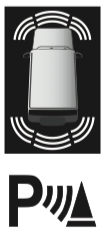{ width="72" } Мигает                         | Парковочные датчики обнаружили препятствие спереди или сзади автомобиля. Проверьте окружающую обстановку напрямую и по зеркалам, затем медленно продолжайте движение вперёд или назад. См. также: [парковочные датчики](04-driving.md#парковочные-датчики).                                                                                |

#### Только автомобили с МКПП

| Когда                                                    | Звук зуммера                                  |                                                                               Лампа или индикатор                                                                                | Причина и что делать                                                                                                                                                                                                                              |
|----------------------------------------------------------|-----------------------------------------------|:--------------------------------------------------------------------------------------------------------------------------------------------------------------------------------:|---------------------------------------------------------------------------------------------------------------------------------------------------------------------------------------------------------------------------------------------------|
| Двигатель автоматически остановлен системой автоматической остановки двигателя | Зуммер в салоне: непрерывный сигнал           |                                                                                        -                                                                                         | Капот открыт, поэтому двигатель заглох ([※](#quick-guide-stall-note-mt)). Надёжно затяните стояночный тормоз, переведите рычаг переключения передач в нейтральное положение, полностью закройте капот и снова запустите двигатель. См. также: [запуск двигателя](04-driving.md#запуск-двигателя). |
| Двигатель автоматически остановлен системой автоматической остановки двигателя | Зуммер в салоне: короткие прерывистые сигналы |                                                                                        -                                                                                         | Рычаг переключения передач находится не в нейтральном положении. Переведите его в нейтральное положение. См. также: [система автоматической остановки двигателя](04-driving.md#система-автоматической-остановки-двигателя-на-холостом-ходу).                                                                                     |
| Двигатель автоматически остановлен системой автоматической остановки двигателя | Зуммер в салоне: непрерывный сигнал           | { width="32" } { width="32" } Горит | Ремень безопасности водителя отстёгнут или открыта дверь водителя, поэтому двигатель заглох ([※](#quick-guide-stall-note-mt)). Закройте дверь, пристегните ремень безопасности и снова запустите двигатель.                                                                         |
| Двигатель автоматически остановлен системой автоматической остановки двигателя | Зуммер в салоне: короткие прерывистые сигналы |                                       { width="32" } Горит                                        | Ремень безопасности водителя отстёгнут. Пристегните ремень, после этого двигатель можно снова запустить нажатием педали сцепления.                                                                                                                |

!!! info "Примечание"
    ※ Если двигатель заглох, помимо указанных выше могут загореться лампы двигателя, электроусилителя руля, давления масла и зарядки. См. также: [предупреждающие лампы](#предупреждающие-лампы).

#### Только автомобили с АКПП

| Когда                                                    | Звук зуммера                                                        |                                                                                         Лампа или индикатор                                                                                          | Причина и что делать                                                                                                                                                                                                                                                                                                                                             |
|----------------------------------------------------------|---------------------------------------------------------------------|:----------------------------------------------------------------------------------------------------------------------------------------------------------------------------------------------------:|------------------------------------------------------------------------------------------------------------------------------------------------------------------------------------------------------------------------------------------------------------------------------------------------------------------------------------------------------------------|
| Стоянка или движение задним ходом                        | Зуммер в салоне: длинные прерывистые сигналы и голосовое сообщение ([※3](#quick-guide-r-position-voice-note)) |                                                     { width="48" } Отображается                                                      | Селектор находится в положении `R`. Проверьте положение селектора. См. также: [зуммер предупреждения о положении R](04-driving.md#зуммер-предупреждения-о-положении-r).                                                                                                                                                                                                                            |
| Двигатель автоматически остановлен системой автоматической остановки двигателя | Зуммер в салоне: непрерывный сигнал                                 |                                                                                                  -                                                                                                   | Капот открыт, поэтому двигатель заглох ([※](#quick-guide-stall-note-at)). Надёжно затяните стояночный тормоз, переведите селектор в положение `P`, полностью закройте капот и снова запустите двигатель. См. также: [запуск двигателя](04-driving.md#запуск-двигателя).                                                                                                                                          |
| Двигатель автоматически остановлен системой автоматической остановки двигателя | Зуммер в салоне: непрерывный сигнал                                 | { width="32" } { width="32" } Горит один из индикаторов | Из-за отстёгнутого ремня водителя или открытой двери двигатель автоматически перезапустился. Перед началом движения закройте дверь и пристегните ремень. Перед выходом из автомобиля надёжно затяните стояночный тормоз, переведите селектор в положение `P`, а при длительной стоянке остановите двигатель. См. также: [остановка двигателя](04-driving.md#остановка-двигателя). |
| Селектор переведён при нажатой педали тормоза            | Зуммер в салоне: короткие прерывистые сигналы и голосовое сообщение |                                                                                                  -                                                                                                   | Передача не переключилась в выбранное положение. Удерживая педаль тормоза, переведите селектор в положение `P`, затем повторите переключение. См. также: [управление селектором](04-driving.md#управление-селектором-передач).                                                                                                                                                              |
| Селектор переведён без нажатия педали тормоза            | Зуммер в салоне: непрерывный сигнал                                 |                                                                                                  -                                                                                                   | Передача не переключилась в выбранное положение. Удерживая педаль тормоза, переведите селектор в положение `P`, затем повторите переключение. См. также: [управление селектором](04-driving.md#управление-селектором-передач).                                                                                                                                                              |
| Стоянка или движение с малой скоростью                    | Короткие прерывистые сигналы                                        |                                                                                         [※2](#buzzer-note-2)                                                                                         | Сработала функция предотвращения ошибочного начала движения. Сразу уберите ногу с педали акселератора. См. также: [предотвращение ошибочного начала движения](04-driving.md#предотвращение-ошибочного-начала-движения).                                                                                                                                                                                              |
| Стоянка или движение задним ходом                        | Короткие прерывистые сигналы                                        |                                                                                         [※2](#buzzer-note-2)                                                                                         | Сработала функция предотвращения ошибочного начала движения назад. Сразу уберите ногу с педали акселератора. См. также: [предотвращение ошибочного начала движения назад](04-driving.md#предотвращение-ошибочного-начала-движения-назад).                                                                                                                                                                                  |

В дополнение к указанным случаям зуммер может прозвучать и двигатель может автоматически перезапуститься. См. также: [система автоматической остановки двигателя](04-driving.md#система-автоматической-остановки-двигателя-на-холостом-ходу).

!!! info "Примечание"
    ※ Если двигатель заглох, помимо указанных выше могут загореться лампы двигателя, электроусилителя руля, давления масла и зарядки. См. также: [предупреждающие лампы](#предупреждающие-лампы).

!!! info "Примечание"
    ※3 В режиме настроек можно включить или отключить голосовое предупреждение при переключении селектора в положение `R`. См. также: [режим настроек](08-service-data.md#режим-настроек).

#### Только автомобили без системы бесключевого запуска кнопкой

| Когда                  | Звук зуммера                        | Лампа или индикатор | Причина и что делать                                                                                      |
|------------------------|-------------------------------------|:-------------------:|-----------------------------------------------------------------------------------------------------------|
| Открыта дверь водителя | Зуммер в салоне: непрерывный сигнал |          -          | Ключ оставлен в выключателе зажигания. Выньте ключ. См. также: [зуммер предупреждения о забытом ключе](04-driving.md#зуммер-предупреждения-о-забытом-ключе). |

#### Только автомобили с системой бесключевого запуска кнопкой

| Когда                                                      | Звук зуммера                                                                  |                                                                     Лампа или индикатор                                                                      | Причина и что делать                                                                                                                                                                                                                                                         |
|------------------------------------------------------------|-------------------------------------------------------------------------------|:------------------------------------------------------------------------------------------------------------------------------------------------------------:|------------------------------------------------------------------------------------------------------------------------------------------------------------------------------------------------------------------------------------------------------------------------------|
| Выполнена операция выключателем двигателя                  | Зуммер в салоне: одиночный сигнал и голосовое сообщение                       |                         { width="32" } Горит [※1](#buzzer-note-1)                          | Пульт дистанционного управления не обнаружен или его элемент питания разряжен. Поместите пульт в зону обнаружения внутри автомобиля или приложите его к выключателю двигателя. См. также: [зона обнаружения пульта в салоне](04-driving.md#зона-обнаружения-пульта-в-салоне), [запуск двигателя](04-driving.md#запуск-двигателя). |
| Открыта любая дверь                                        | Зуммер в салоне и наружный зуммер: короткие прерывистые сигналы и голосовое сообщение |                         { width="32" } Мигает [※1](#buzzer-note-1)                         | Пульт дистанционного управления больше не обнаруживается в автомобиле. Верните пульт в зону обнаружения внутри автомобиля. См. также: [предупреждение о выносе пульта из автомобиля](04-driving.md#предупреждение-о-выносе-пульта-дистанционного-управления-из-автомобиля).                                                                                       |
| Выключатель двигателя находится в положении `ON`           | Зуммер в салоне: одиночный сигнал                                             | { width="32" } Мигает с интервалом около 1 секунды [※1](#buzzer-note-1) | Возможна неисправность системы бесключевого запуска кнопкой. Обратитесь для проверки к дилеру Suzuki или в авторизованный сервис Suzuki. См. также: [индикатор охранной сигнализации](03-before-driving.md#индикатор-охранной-сигнализации).                                                                                      |
| Открыта дверь водителя                                     | Зуммер в салоне: одиночный сигнал                                             |                                                                              -                                                                               | Из-за неисправности выключатель двигателя не вернулся в положение `LOCK` (OFF), хотя все двери закрыты и заблокированы. Обратитесь для проверки к дилеру Suzuki или в авторизованный сервис Suzuki. См. также: [предупреждение о несработавшей блокировке рулевой колонки](04-driving.md#зуммер-предупреждения-о-несработавшей-блокировке-рулевой-колонки).       |
| Нажат кнопочный выключатель на двери                       | Наружный зуммер: непрерывный сигнал                                            |                                                                              -                                                                               | Пульт дистанционного управления находится внутри автомобиля. Вынесите пульт из автомобиля.                                                                                                                                                                                   |
| Нажат кнопочный выключатель на двери                       | Наружный зуммер: непрерывный сигнал                                            |                        { width="32" } Горит [※2](#buzzer-note-2)                         | Одна из дверей закрыта не полностью. Закройте все двери.                                                                                                                                                                                                                     |
| Нажата кнопка блокировки на пульте                         | Наружный зуммер: непрерывный сигнал                                            |                        { width="32" } Горит [※2](#buzzer-note-2)                         | Одна из дверей закрыта не полностью. Закройте все двери. См. также: [бесключевой доступ](03-before-driving.md#система-бесключевого-доступа).                                                                                                                                                           |
| Выключатель двигателя переводится в положение `LOCK` (OFF) | Зуммер в салоне: одиночный сигнал                                             |                                                                     [※1](#buzzer-note-1)                                                                     | На автомобилях с АКПП из-за неисправности селектора выключатель двигателя может не вернуться в положение `LOCK` (OFF). Обратитесь для проверки к дилеру Suzuki или в авторизованный сервис Suzuki. См. также: [возврат выключателя двигателя](04-driving.md#когда-переводите-выключатель-двигателя-в-lock).                           |

## Частые вопросы

Здесь собраны вопросы, которые чаще всего возникают при эксплуатации автомобиля.

### Двери

#### Ключ бесключевого доступа не срабатывает

Возможна ситуация, в которой система бесключевого доступа не может сработать.
→ [бесключевой доступ](03-before-driving.md#система-бесключевого-доступа)

Если элемент питания пульта дистанционного управления разряжен, замените его.
→ [замена элемента питания пульта](06-care.md#замена-элемента-питания-пульта-дистанционного-управления)

#### После открытия двери сработала сигнализация

Сработала охранная сигнализация. Остановить сигнализацию можно одним из способов:

- Перевести выключатель двигателя в положение `ON`.
- Разблокировать автомобиль системой бесключевого доступа или кнопкой запроса.

Правильное обращение с системой и изменение настроек описаны в разделе:
→ [охранная сигнализация](03-before-driving.md#охранная-сигнализация)

### Стёкла

#### Нужно удалить запотевание с внутренней стороны ветрового или боковых стёкол

На автомобилях с ручным кондиционером переключите регулятор выбора режима обдува в положение удаления запотевания.
→ [кондиционер с ручным управлением](05-equipment.md#кондиционер-с-ручным-управлением)

На автомобилях с автоматическим кондиционером используйте выключатель обдува ветрового стекла.
→ [автоматическая климатическая система](05-equipment.md#автоматическая-климатическая-система)

#### Нужно удалить запотевание с внутренней стороны стекла задней двери

Используйте выключатель обогрева заднего стекла.
→ [обогрев заднего стекла](05-equipment.md#выключатель-обогрева-заднего-стекла)

### Шины

#### Прокололась шина

Замените колесо на запасное.
→ [прокол шины](07-emergency.md#прокол-шины)

### Разряженный аккумулятор

#### Аккумулятор разряжен, двигатель не запускается

Подключите аккумулятор автомобиля-донора с помощью пусковых проводов и запустите двигатель.
→ [запуск от внешнего источника](07-emergency.md#если-аккумуляторная-батарея-разряжена)

### Система автоматической остановки двигателя

#### Система автоматической остановки двигателя не срабатывает

Проверьте условия работы системы.
→ [система автоматической остановки двигателя](04-driving.md#система-автоматической-остановки-двигателя-на-холостом-ходу)

### Системы помощи водителю Suzuki Safety Support

#### Нужно узнать, когда системы помощи водителю Suzuki Safety Support срабатывают или не срабатывают

→ [системы помощи водителю Suzuki Safety Support](04-driving.md#системы-помощи-водителю-suzuki-safety-support)

### Моторное масло

#### Нужно заменить моторное масло

См. также:

- [замена моторного масла](02-safety.md#при-замене-моторного-масла)
- [сервисные данные](08-service-data.md#сервисные-данные)

### Электрооборудование

#### Не включается фара или стоп-сигнал

Проверьте лампы. См. также:

- [проверка ламп](07-emergency.md#проверка-ламп)
- [замена ламп](07-emergency.md#при-замене-лампы)
- [мощность ламп](07-emergency.md#мощность-ламп)

#### Перестало работать электрооборудование

Проверьте предохранители.
→ [перегоревший предохранитель](07-emergency.md#перегоревший-предохранитель)

#### Стекло водителя перестало автоматически полностью открываться или закрываться

Нужно выполнить инициализацию защиты от защемления стеклом.
→ [инициализация стеклоподъёмника](03-before-driving.md#электростеклоподъёмники)
