# 2. Обязательно к прочтению: безопасность вождения

Этот раздел содержит особенно важные правила и предупреждения. Перед началом эксплуатации автомобиля внимательно прочитайте его.

## Безопасное вождение прежде всего

Системы безопасности автомобиля, включая ремни безопасности, подушки безопасности SRS и ABS, имеют пределы возможностей. Чтобы обеспечить безопасность пассажиров, строго соблюдайте разрешённую скорость, выбирайте безопасный темп движения и ведите автомобиль осторожно.

## Содержание главы

| Раздел | Страница |
| --- | --- |
| [Подготовка перед выездом: проверка автомобиля](#подготовка-перед-выездом-проверка-автомобиля) | 2-2 |
| [Если перевозите багаж](#если-перевозите-багаж) | 2-5 |
| [Если перевозите детей](#если-перевозите-детей) | 2-6 |
| [Для пользователей имплантированных кардиостимуляторов и других медицинских устройств](#для-пользователей-имплантированных-кардиостимуляторов-и-других-медицинских-устройств) | 2-13 |
| [Правильная посадка на водительском месте](#правильная-посадка-на-водительском-месте) | 2-14 |
| [Во время движения](#во-время-движения) | 2-19 |
| [Во время стоянки](#во-время-стоянки) | 2-27 |
| [При заправке](#при-заправке) | 2-30 |
| [Если управляете автомобилем с автоматической коробкой передач](#если-управляете-автомобилем-с-автоматической-коробкой-передач) | 2-32 |
| [Если автомобиль оснащён подушками безопасности SRS](#если-автомобиль-оснащён-подушками-безопасности-srs) | 2-34 |
| [Если управляете автомобилем 4WD](#если-управляете-автомобилем-4wd) | 2-37 |
| [Если управляете автомобилем с турбонаддувом](#если-управляете-автомобилем-с-турбонаддувом) | 2-40 |
| [Другие меры предосторожности](#другие-меры-предосторожности) | 2-41 |
| [Экологичное вождение](#экологичное-вождение) | 2-46 |

## Подготовка перед выездом: проверка автомобиля

!!! danger "Внимание"
    Если автомобиль повреждён, загорелась предупреждающая лампа или предупреждающий зуммер указывает на неисправность, перед началом движения обратитесь к дилеру Suzuki или представителю Suzuki и как можно скорее проведите проверку и ремонт.

    Если продолжать движение в таком состоянии, это может привести к возгоранию автомобиля или серьёзной неисправности.

### Регулярно выполняйте ежедневный осмотр

Проводите ежедневный осмотр с учётом пробега автомобиля и условий эксплуатации.

См. также: сервисная книжка, раздел «Ежедневный осмотр».

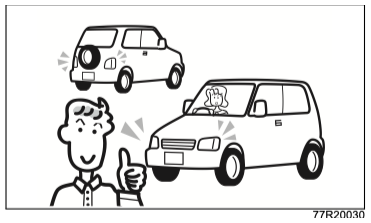{ .center-image }

### Проверяйте пространство под капотом и в моторном отсеке

!!! danger "Внимание"
    Если автомобиль долго не использовался, убедитесь, что под капотом и в моторном отсеке нет гнёзд, веток и других предметов, которые могли занести мелкие животные. Такие предметы могут быть горючими или мешать работе вентилятора.

    Если их не убрать, это может привести к возгоранию автомобиля или серьёзной неисправности.

### Если заметили необычные симптомы

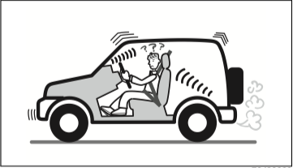{ .center-image }

!!! warning "Осторожно"
    В следующих случаях обратитесь к дилеру Suzuki или представителю Suzuki для проверки автомобиля:

    - на земле остаются следы утечки масла или другой жидкости;
    - уровень тормозной жидкости недостаточен;
    - появился необычный запах, звук или вибрация;
    - ощущения при работе рулевого колеса или тормозов отличаются от обычных.

### Проверяйте давление воздуха в шинах

Регулярно проверяйте и регулируйте давление воздуха в шинах.

Рекомендуемое давление для этого автомобиля указано на табличке давления воздуха в шинах (1), расположенной в проёме двери водителя.

См. также: сервисная книжка, раздел «Ежедневный осмотр».

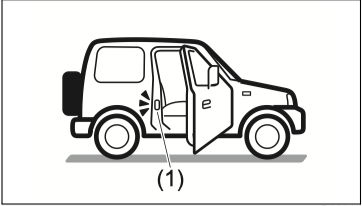{ .center-image }

Если ездить с недостаточным давлением воздуха, края шин будут изнашиваться быстрее, а расход топлива увеличится.

!!! danger "Внимание"
    Если продолжать движение с крайне низким давлением воздуха, шина может лопнуть, что способно привести к неожиданной аварии.

    Если не поддерживать рекомендованное давление, автомобиль не сможет полностью проявлять свои характеристики. Это может привести к следующим последствиям:

    - ухудшится устойчивость при движении;
    - увеличится тормозной путь;
    - система не сможет корректно определять скорость вращения колёс, из-за чего могут работать неправильно:
        - ESP®;
        - ABS;
        - аварийная сигнализация при экстренном торможении ESS;
        - часть функций систем помощи водителю Suzuki Safety Support.

    См. также: [если корректная скорость вращения шин не определяется](04-driving.md#если-точная-скорость-вращения-шин-не-определяется).

    На автомобилях 4WD несоблюдение рекомендованного давления может не только снизить характеристики автомобиля, но и повредить детали привода.

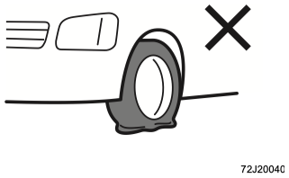{ .center-image }

### Проверяйте уровень электролита аккумуляторной батареи

Если уровень жидкости находится между верхней меткой (1) и нижней меткой (2), аккумулятор можно использовать в таком состоянии.

Если уровень жидкости ниже отметки (3), долейте дистиллированную воду до верхней метки (1). Недостаток жидкости может сократить срок службы аккумулятора.

См. также: сервисная книжка, раздел «Ежедневный осмотр».

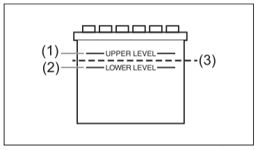{ .center-image }

!!! danger "Внимание"
    Если жидкости в аккумуляторе недостаточно, аккумулятор может нагреться и взорваться.

    Не используйте и не заряжайте аккумулятор, если уровень жидкости ниже нижней метки.

    Если клеммы аккумулятора затянуты слабо, это может привести к пожару или неисправности. После снятия и повторного подключения клемм аккумулятора надёжно затяните их.

!!! info "Примечание"
    Если долить жидкость выше верхней метки (1), она может вытечь или выплеснуться и вызвать коррозию соседних деталей. При доливке не превышайте верхнюю метку (1).

    Автомобили с системой автоматической остановки двигателя оснащены специальным высокопроизводительным свинцово-кислотным аккумулятором. Соблюдайте следующие правила, иначе система может перестать работать нормально или срок службы аккумулятора может сократиться:

    - при замене аккумулятора используйте только аккумулятор указанного типа;
    - не используйте аккумулятор неподходящего типа;
    - не подключайте питание электрических устройств напрямую к клеммам аккумулятора.

    См. также: [сервисные данные](08-service-data.md#сервисные-данные).

### Проверяйте выхлопную трубу

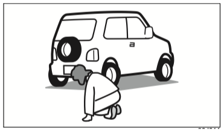{ .center-image }

Периодически проверяйте, нет ли в выхлопной трубе отверстий или трещин.

!!! danger "Внимание"
    Если в выхлопной трубе есть утечка, выхлопные газы могут попасть в салон и вызвать отравление угарным газом.

    Если заметили неисправность, обратитесь к дилеру Suzuki или представителю Suzuki для проверки автомобиля.

## Если перевозите багаж

Перегрузка автомобиля плохо влияет на кузов и ходовые качества.

!!! danger "Внимание"
    Не перевозите в салоне ёмкости с топливом, лекарственные препараты, аэрозольные баллоны и другие подобные предметы. Это может привести к возгоранию или взрыву.

    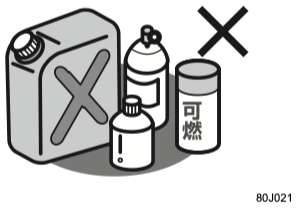{ .center-image }

    Не кладите предметы на панель приборов. Они могут закрыть обзор, сместиться при трогании или во время движения и помешать безопасному управлению.

    При аварии такие предметы также могут нарушить работу фронтальной подушки безопасности SRS переднего пассажира или быть отброшены при её раскрытии и причинить травмы.

    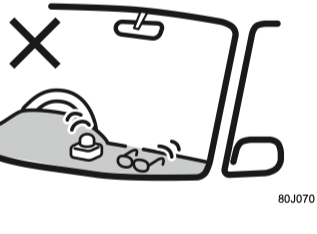{ .center-image }

    Не вешайте предметы на рычаг переключения передач или селектор и не используйте рычаг или селектор вместо подставки для руки. Из-за этого рычаг может перестать нормально работать, что может привести к неисправности или неожиданной аварии.

!!! warning "Осторожно"
    Не складывайте багаж в салоне высокой стопкой. Это ухудшает обзор, а при резком торможении багаж может полететь вперёд и привести к неожиданной аварии.

    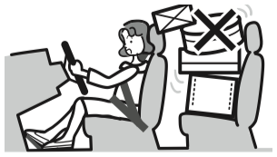{ .center-image }

    Если перевозите животных, следите, чтобы они не перемещались по салону. Они могут помешать управлению автомобилем или стать причиной неожиданной аварии, например при резком торможении.

## Если перевозите детей

Если в автомобиле едут дети, особенно внимательно обеспечьте безопасность и двигайтесь с умеренной скоростью.

### Дети должны ехать на заднем сиденье

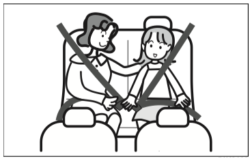{ .center-image }

- По возможности посадите рядом с ребёнком взрослого пассажира, чтобы он присматривал за ним.
- Если ребёнок сидит на переднем пассажирском сиденье, его неожиданное движение может отвлечь водителя или помешать управлению автомобилем.
- Выбирайте детское удерживающее устройство, подходящее возрасту и телосложению ребёнка.

См. также: разделы об использовании и выборе детских удерживающих устройств.

!!! danger "Внимание"
    Если ребёнка, которому уже не требуется детское удерживающее устройство, всё же приходится посадить на переднее пассажирское сиденье, соблюдайте следующие правила:

    - сдвиньте переднее пассажирское сиденье максимально назад. Если сиденье выдвинуто вперёд, сильный удар при раскрытии фронтальной подушки безопасности SRS переднего пассажира может привести к тяжёлым травмам;
    - при срабатывании боковой подушки безопасности SRS или шторки безопасности SRS сильный удар также может привести к тяжёлым травмам. Следите, чтобы ребёнок не высовывался из окна и не прислонялся к двери;
    - следите, чтобы ребёнок не касался направляющих под сиденьем и других движущихся частей в салоне. Он может защемить руку или ногу и получить травму.

    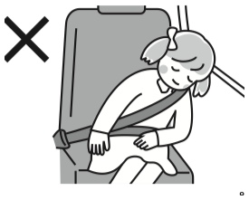{ .center-image }

### Дети тоже должны пристёгиваться ремнём безопасности

!!! danger "Внимание"
    Даже если крепко держать ребёнка на руках, при столкновении удержать его достаточно надёжно невозможно. Ребёнок может получить тяжёлые травмы.

    Не держите ребёнка на коленях.

    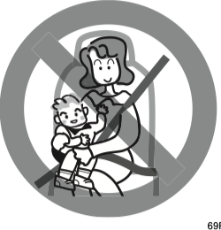{ .center-image }

    Если ребёнок не пристёгнут ремнём безопасности, при резком торможении или столкновении он может получить тяжёлые травмы. Обязательно пристёгивайте ребёнка ремнём безопасности.

    Если одним ремнём безопасности пристёгнуты два человека или больше, при резком торможении или столкновении ремень не сможет работать должным образом. Это может привести к тяжёлым травмам.

    Не используйте один ремень безопасности для двух и более человек.

!!! danger "Внимание"
    Ремни безопасности этого автомобиля рассчитаны на пассажиров взрослого размера. Если ребёнок пользуется ремнём неправильно, он может получить тяжёлые травмы.

    Если ремень проходит по шее или подбородку ребёнка либо не фиксирует его в области таза, используйте детское удерживающее устройство или детское сиденье-подкладку и перевозите ребёнка на заднем сиденье.

    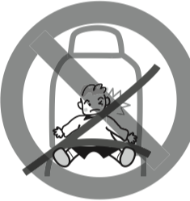{ .center-image }

    Без детского удерживающего устройства ребёнок может получить тяжёлые травмы. Если ребёнок ещё не может уверенно сидеть самостоятельно или его шея недостаточно окрепла, используйте детское удерживающее устройство и перевозите ребёнка на заднем сиденье.

### Не позволяйте детям играть с ремнём безопасности

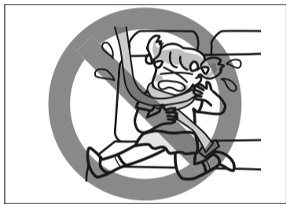{ .center-image }

!!! danger "Внимание"
    Не позволяйте ребёнку играть с ремнём безопасности. Если ребёнок намотает ремень на тело, это может привести к удушью или тяжёлым травмам.

    В экстренной ситуации разрежьте ремень ножницами.

### Использование детских удерживающих устройств

- Заднее детское удерживающее устройство, например люльку, нельзя использовать на переднем пассажирском сиденье. Устанавливайте его на заднем сиденье.
- Для безопасности устанавливайте детские удерживающие устройства и детские сиденья-подкладки на заднем сиденье.
- Выбирайте детское удерживающее устройство, подходящее возрасту и телосложению ребёнка.

См. также: [детские удерживающие устройства](03-before-driving.md#детские-удерживающие-устройства).

- На обеих сторонах солнцезащитного козырька пассажира наклеены предупреждения о запрете установки детского удерживающего устройства на переднее пассажирское сиденье в автомобилях с подушкой безопасности SRS переднего пассажира. Перед использованием детского удерживающего устройства обязательно прочитайте раздел о предупреждающей наклейке о подушке безопасности SRS переднего пассажира.
- В этот автомобиль можно установить следующие типы детских удерживающих устройств:
    - устройства, фиксируемые ремнём безопасности;
    - устройства ISOFIX;
    - устройства с верхним страховочным ремнём.
- Некоторые детские удерживающие устройства невозможно правильно установить в этот автомобиль. Перед использованием внимательно прочитайте руководство, приложенное к детскому удерживающему устройству, и проверьте порядок установки и правила эксплуатации.
- Даже при использовании детского удерживающего устройства возможности защиты ребёнка ограничены. Двигайтесь с умеренной скоростью и управляйте автомобилем безопасно.

!!! danger "Внимание"
    Никогда не устанавливайте детское удерживающее устройство против хода движения на сиденье, защищённое активной фронтальной подушкой безопасности. Это может привести к смерти или тяжёлым травмам ребёнка.

    Если детское удерживающее устройство или детское сиденье-подкладку всё же приходится установить на переднем пассажирском сиденье, сдвиньте сиденье максимально назад и устанавливайте устройство по ходу движения.

    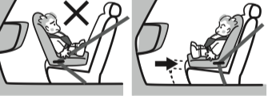{ .center-image }

    При срабатывании боковой подушки безопасности SRS или шторки безопасности SRS ребёнок может получить тяжёлые травмы. Следите, чтобы ребёнок не высовывал руки из окна и не прислонялся к двери.

    Если детское удерживающее устройство установлено неправильно, при аварии ребёнок или другие пассажиры могут получить тяжёлые травмы. Устанавливайте устройство строго по этому руководству и инструкции, приложенной к детскому удерживающему устройству.

    Если ребёнок закреплён неправильно, при аварии он может получить тяжёлые травмы. Перед использованием внимательно прочитайте инструкцию к детскому удерживающему устройству и правильно фиксируйте ребёнка.

    Перед началом движения убедитесь, что детское удерживающее устройство надёжно закреплено, не шатается и не имеет ослабленных креплений.

    Не откидывайте спинку сиденья, на котором установлено детское удерживающее устройство. Иначе устройство может быть закреплено неправильно, а при столкновении тело ребёнка может проскользнуть под ремень безопасности, что приведёт к тяжёлым травмам.

    Если детское удерживающее устройство установлено на заднем сиденье, проверьте, не мешает ли ему переднее сиденье или ноги ребёнка. При необходимости отрегулируйте переднее сиденье.

    Если детское удерживающее устройство получило сильный удар при аварии, не используйте его повторно, даже если снаружи оно выглядит исправным. В нужный момент оно может не обеспечить должную защиту.

!!! warning "Осторожно"
    Если детское удерживающее устройство не используется, надёжно закрепите его на сиденье или уберите в багажное отделение.

    Если оставить его в салоне незакреплённым, при торможении оно может ударить пассажиров или предметы.

### Двери, окна и регулировку сидений должны выполнять взрослые

Открывайте и закрывайте двери и окна, а также регулируйте сиденья сами, чтобы ребёнок не защемил руки, ноги или шею.

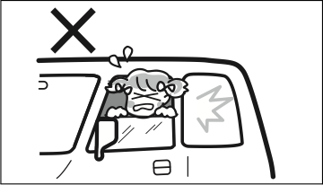{ .center-image }

!!! danger "Внимание"
    Если окна не заблокированы, ребёнок может по ошибке управлять стеклоподъёмником и защемить себя или другого пассажира.

    Если оставить электростеклоподъёмники включёнными, ребёнок может случайно нажать переключатель и вызвать неожиданную аварию.

    Когда выходите из автомобиля, выключите двигатель, заберите ключ с собой и уходите вместе с ребёнком, чтобы он не мог управлять электростеклоподъёмниками.

### Не позволяйте детям высовывать лицо или руки из окна

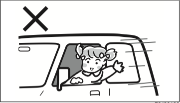{ .center-image }

!!! danger "Внимание"
    Следите, чтобы ребёнок не высовывал лицо, руки и другие части тела из окна. При резком торможении он может получить тяжёлые травмы или выпасть из автомобиля.

    Также ребёнок может удариться о предметы снаружи автомобиля и получить тяжёлые травмы.

### Если выходите из автомобиля

!!! danger "Внимание"
    Не оставляйте ребёнка одного в автомобиле.

    Оставшись без присмотра, ребёнок может случайно тронуть автомобиль с места или вызвать пожар.

    В жаркую погоду салон быстро нагревается, и ребёнок может получить тепловой удар. Не оставляйте ребёнка одного в салоне даже при включённом кондиционере.

    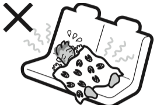{ .center-image }

### Не перевозите детей в багажном отделении

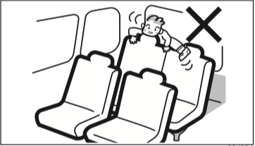{ .center-image }

!!! danger "Внимание"
    Багажное отделение не предназначено для перевозки людей. Не перевозите в нём детей.

    При резком торможении это может привести к неожиданной аварии.

    Даже во время остановки на дороге не позволяйте детям играть в багажном отделении.

## Для пользователей имплантированных кардиостимуляторов и других медицинских устройств

!!! danger "Внимание"
    Если вы используете имплантированный кардиостимулятор или имплантируемый кардиовертер-дефибриллятор (ICD), следите, чтобы устройство не находилось ближе примерно 22 см к передатчикам системы запуска двигателя кнопкой, показанным на схеме ниже. Радиоволны могут повлиять на работу кардиостимулятора или ICD.

    Если вы используете другое медицинское электрическое устройство, уточните у производителя медицинского устройства, может ли радиосигнал системы запуска двигателя кнопкой повлиять на его работу.

    За дополнительной информацией обратитесь к дилеру Suzuki или представителю Suzuki.

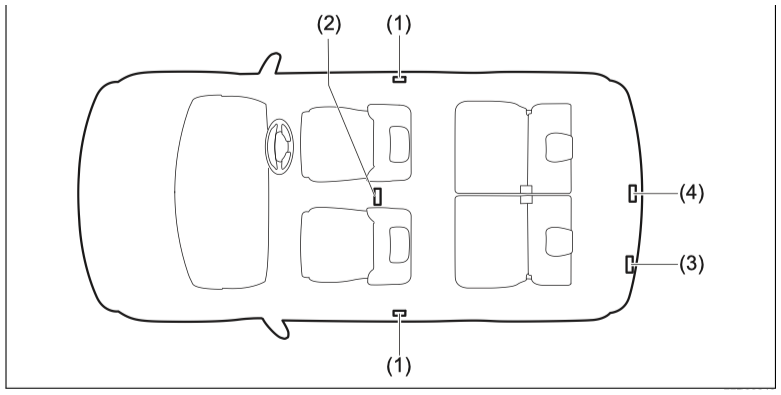{ .center-image }

| № | Передатчик |
| --- | --- |
| (1) | Передатчик снаружи передней двери |
| (2) | Передатчик в салоне |
| (3) | Передатчик снаружи задней двери |
| (4) | Передатчик в багажном отделении |

## Правильная посадка на водительском месте

### Регулируйте рулевое колесо, сиденье и зеркала до начала движения

См. также:

- [регулировка рулевой колонки](03-before-driving.md#регулировка-рулевой-колонки-по-высоте);
- [передние сиденья](03-before-driving.md#передние-сиденья);
- [внутреннее зеркало и дверные зеркала](03-before-driving.md#регулировка-элементов).

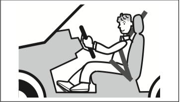{ .center-image }

!!! danger "Внимание"
    Не регулируйте рулевое колесо, сиденье, внутреннее зеркало или дверные зеркала во время движения.

    Во время регулировки можно ошибиться в управлении рулём или отвлечься от дороги, что может привести к неожиданной аварии.

    Не откидывайте спинку сиденья больше, чем необходимо. Иначе подголовник и ремень безопасности не смогут работать должным образом.

### Сохраняйте правильную посадку

Чтобы принять правильную посадку за рулём, отрегулируйте сиденье следующим образом:

- сядьте глубоко в сиденье, чтобы между спиной и спинкой сиденья не было зазора;
- отрегулируйте сиденье вперёд или назад так, чтобы при нажатии на педали колени оставались слегка согнутыми и было достаточно запаса хода;
- слегка прислоните спину к спинке и отрегулируйте её угол так, чтобы при удержании рулевого колеса локти были немного согнуты.

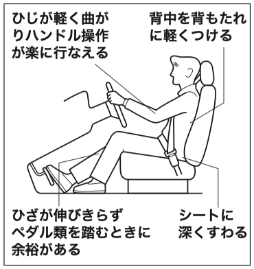{ .center-image }

!!! danger "Внимание"
    Не кладите подушку или похожий предмет между спиной и спинкой сиденья.

    Это может помешать правильной посадке, а ремень безопасности и подголовник могут не сработать с полной эффективностью.

### Правильно пристёгивайтесь ремнём безопасности

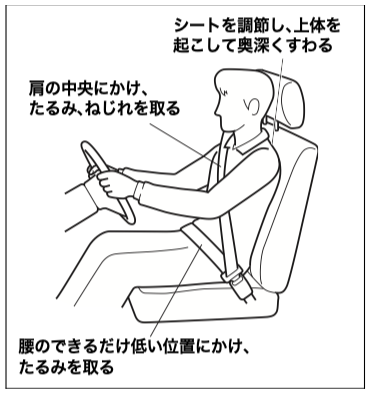{ .center-image }

- Отрегулируйте сиденье в правильное положение, выпрямите верхнюю часть тела и сядьте глубоко.
- Наденьте ремень так, чтобы он не перекручивался.
- Поясная часть ремня должна проходить как можно ниже по тазу.
- Плечевая часть ремня должна проходить между шеей и краем плеча.
- Убедитесь, что ремень не перекручен, и уберите слабину.

См. также: [правильная посадка](#сохраняйте-правильную-посадку).

!!! danger "Внимание"
    Перед запуском двигателя правильно пристегните ремень безопасности.

    Не откидывайте спинку сиденья больше, чем необходимо. Не ослабляйте ремень прищепками, зажимами или другими предметами. Иначе ремень безопасности не сможет работать должным образом.

    Следите, чтобы все пассажиры на переднем и заднем сиденьях были пристёгнуты ремнями безопасности.

    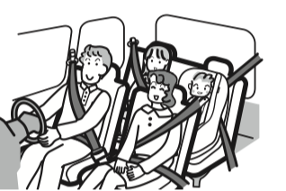{ .center-image }

### Не кладите предметы у ног водителя

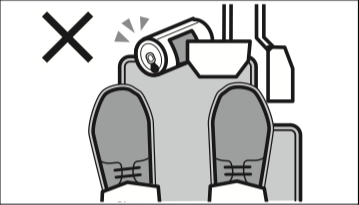{ .center-image }

!!! danger "Внимание"
    Не оставляйте у ног водителя пустые банки и другие предметы.

    Они могут помешать нажатию педалей и привести к неожиданной аварии.

### Используйте подходящий напольный коврик

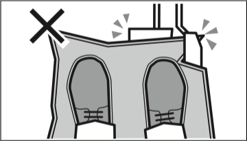{ .center-image }

!!! danger "Внимание"
    Если коврик сместится и помешает педалям, это может привести к неожиданной аварии. Соблюдайте следующие правила:

    - не используйте коврик, который не подходит к форме пространства у ног;
    - не кладите несколько ковриков друг на друга;
    - надёжно фиксируйте коврик штатными креплениями.

    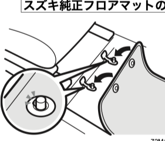{ .center-image }

    На полу со стороны водителя под ковролином есть отверстия для креплений, прилагаемых к оригинальному напольному коврику Suzuki.

!!! tip "Подсказка"
    Рекомендуется использовать оригинальный напольный коврик Suzuki, предназначенный для этого автомобиля.

### При запуске двигателя

#### Не оставляйте двигатель работающим в плохо проветриваемом месте

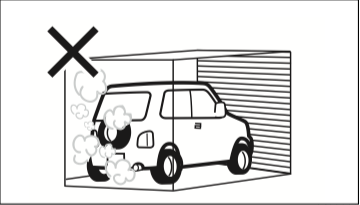{ .center-image }

!!! danger "Внимание"
    Если оставить двигатель работающим в плохо проветриваемом месте, например в гараже, есть опасность отравления угарным газом.

    Не оставляйте двигатель работающим при открытой задней двери: выхлопные газы могут попасть в салон.

    Если в салоне ощущается запах выхлопных газов, полностью откройте все окна, переведите кондиционер или отопитель в режим подачи наружного воздуха и включите вентилятор на высокую скорость. Если запах не исчезает даже после проветривания, как можно скорее обратитесь к дилеру Suzuki или представителю Suzuki для проверки автомобиля.

#### Не запускайте двигатель через окно

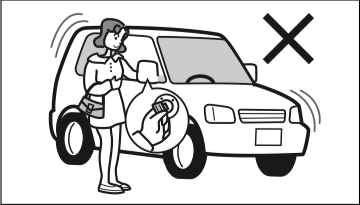{ .center-image }

Сядьте на водительское сиденье, нажмите педаль тормоза и только после этого запускайте двигатель.

!!! danger "Внимание"
    Не управляйте выключателем двигателя, наклоняясь в автомобиль через окно. Это может привести к неожиданной аварии.

    См. также: [запуск двигателя](04-driving.md#запуск-двигателя).

#### Дистанционное управление кондиционером

!!! tip "Оборудование по типу автомобиля"
    В зависимости от комплектации автомобиль может поддерживать дистанционный запуск двигателя и включение кондиционера со смартфона через специальное приложение.

Перед использованием дистанционного управления внимательно прочитайте правила эксплуатации и соблюдайте их.

!!! danger "Внимание"
    Не запускайте двигатель дистанционно в гараже, закрытом помещении или на крытой парковке. Выхлопные газы могут накопиться и вызвать отравление угарным газом, вплоть до смерти.

    Не запускайте двигатель дистанционно, если в автомобиле находятся пассажиры или животные. Стеклоподъёмники могут внезапно начать работать, что может привести к серьёзной аварии.

    Используйте дистанционный запуск двигателя только снаружи автомобиля и только там, где можно хорошо проверить безопасность вокруг машины. Использование из салона может привести к неожиданной аварии.

    Не запускайте двигатель дистанционно, если на автомобиль надет чехол. Нагретая выхлопная система и выхлопные газы могут вызвать пожар.

    Радиосигнал дистанционного управления может быть нестабильным в зависимости от окружающих условий. Если система не сработала, не нажимайте выключатель двигателя без необходимости. Используйте дистанционный запуск только там, где можно хорошо проверить безопасность вокруг автомобиля.

    Не запускайте двигатель дистанционно на крутом уклоне. Вибрация при запуске может привести к самопроизвольному движению автомобиля.

    В выхлопных газах содержится бесцветный и не имеющий запаха угарный газ. Вдыхание угарного газа может привести к тяжёлому вреду здоровью или смерти. Перед использованием убедитесь, что в автомобиле нет пассажиров и животных, а вокруг достаточно безопасно.

    Не используйте дистанционное управление в закрытых и плохо проветриваемых местах, например в гараже или на многоэтажной парковке.

    Перед использованием убедитесь, что воздухозаборники и глушитель не забиты.

    Используйте дистанционный запуск только после проверки, что рядом с автомобилем нет легко воспламеняющихся предметов, например масла или сухих листьев.

    Не используйте дистанционное управление на дорогах общего пользования. Это может нарушать правила дорожного движения.

    В некоторых регионах холостой ход запрещён или ограничен местными правилами. Используйте функцию только после проверки местных требований.

    Для безопасного обслуживания соблюдайте следующие правила:

    - не используйте дистанционное управление, пока автомобиль находится у дилера Suzuki, представителя Suzuki, на заправке или в другом месте для осмотра и обслуживания. Если двигатель неожиданно запустится во время работ, можно получить травму;
    - при осмотре или обслуживании снимайте отрицательную клемму аккумулятора;
    - не выполняйте работы, удерживая выключатель капота нажатым.

    Чтобы предотвратить неожиданный запуск двигателя, при парковке проверьте следующее:

    - выключатель стеклоочистителей находится в положении `OFF`;
    - все окна закрыты, двери заперты;
    - селектор находится в положении `P`;
    - автомобиль не может начать движение из-за стояночного тормоза, противооткатного упора или другого средства фиксации.

!!! tip "Подсказка"
    Используйте дистанционное управление кондиционером только при необходимости и учитывайте влияние на окружающих и окружающую среду.

##### Когда дистанционное управление кондиционером может не сработать

В следующих случаях дистанционное управление кондиционером может не работать:

- температура в салоне автомобиля очень высокая;
- модуль связи дистанционного управления не может связаться с автомобилем;
- напряжение свинцово-кислотного аккумулятора снижено;
- открыта дверь, капот или задняя дверь;
- брелок находится в автомобиле;
- выключатель двигателя находится в положении `ON` или автомобиль движется;
- нажата педаль тормоза;
- селектор находится не в положении `P`;
- есть неисправность кондиционера;
- нажали выключатель двигателя;
- двигатель заглох.

!!! tip "Подсказка"
    Нельзя использовать дистанционное управление кондиционером одновременно с оригинальным дистанционным стартером двигателя Suzuki.

##### Ограничение времени и количества включений

За одно включение система работает 10 минут. Допускается до двух последовательных включений.

Если запустить двигатель выключателем двигателя в автомобиле и затем остановить его примерно через минуту, счётчик включений сбрасывается.

## Во время движения

### Перед началом движения убедитесь в безопасности вокруг

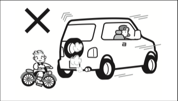{ .center-image }

!!! warning "Осторожно"
    Перед началом движения внимательно убедитесь, что вокруг автомобиля безопасно.

    Нельзя полагаться только на камеру заднего вида. При движении вперёд или назад выйдите из автомобиля и проверьте окружающую обстановку своими глазами.

### Не повышайте обороты и не ускоряйтесь резко сразу после запуска двигателя

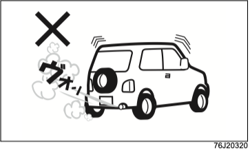{ .center-image }

Для экологичного вождения не повышайте обороты двигателя без необходимости, не трогайтесь резко и не ускоряйтесь резко.

См. также: [экологичное вождение](#экологичное-вождение).

!!! info "Примечание"
    Сразу после запуска двигателя узлы автомобиля ещё не прогреты. Прогазовка, резкий старт и резкое ускорение в это время могут привести к неисправности.

### Не отвлекайтесь на телефон и навигацию

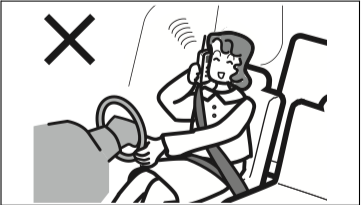{ .center-image }

!!! danger "Внимание"
    Водителю нельзя пользоваться автомобильным телефоном, мобильным телефоном и другими устройствами во время движения. Отвлечение на телефон может привести к неожиданной аварии.

    Водителю нельзя смотреть телевизор, пользоваться навигацией, аудиосистемой и другими устройствами во время движения. Невнимательность к дороге может привести к неожиданной аварии.

### Не просовывайте руки внутрь рулевого колеса

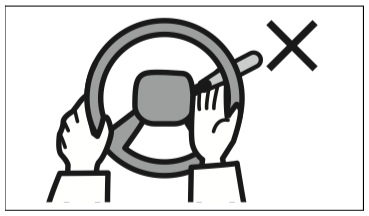{ .center-image }

!!! danger "Внимание"
    Это мешает управлению рулевым колесом и может привести к неожиданной аварии.

### Не держите ногу на педали тормоза во время движения

!!! warning "Осторожно"
    Если держать ногу на педали тормоза во время движения, тормозные механизмы могут быстрее изнашиваться или перегреваться, а эффективность торможения может снизиться.

### Не держите ногу на педали сцепления во время движения

!!! tip "Оборудование по типу автомобиля"
    Автомобили с механической коробкой передач.

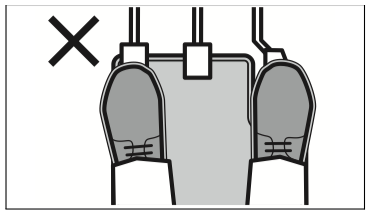{ .center-image }

!!! warning "Осторожно"
    Если держать ногу на педали сцепления во время движения, сцепление может быстрее изнашиваться или перегреваться, что может привести к неожиданной аварии.

Не используйте полувыжатое сцепление дольше, чем необходимо.

### Если одновременно нажаты педали акселератора и тормоза

!!! tip "Подсказка"
    Если во время движения одновременно нажаты педали акселератора и тормоза, система приоритета торможения может ограничить мощность двигателя, чтобы сохранить эффективность торможения.

### Не переводите рычаг или селектор в нейтраль во время движения

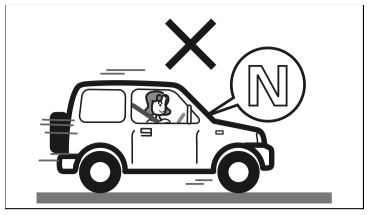{ .center-image }

!!! warning "Осторожно"
    Не переводите рычаг переключения передач или селектор в нейтраль во время движения, кроме экстренных случаев. В нейтрали двигатель не помогает торможению, что может привести к неожиданной аварии.

### На длинном спуске используйте торможение двигателем

На длинном спуске используйте торможение двигателем вместе с рабочим тормозом. Уберите ногу с педали акселератора и переключайтесь на пониженную передачу в соответствии со скоростью движения.

!!! tip "Оборудование по типу автомобиля"
    Для автомобиля с механической коробкой передач понижайте передачу на одну ступень за раз. Для автомобиля с автоматической коробкой передач отключите повышающую передачу `O/D` или переведите селектор в положение `2` либо `L`.

См. также: [рычаг переключения передач](04-driving.md#рычаг-переключения-передач) и [селектор передач](04-driving.md#управление-селектором-передач).

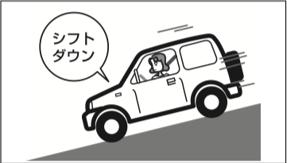{ .center-image }

!!! danger "Внимание"
    Если долго удерживать педаль тормоза нажатой, тормоза могут перегреться и перестать эффективно работать.

### Если сильный боковой ветер

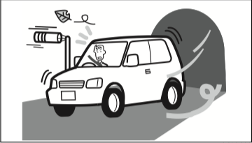{ .center-image }

На выезде из тоннеля, на мосту, при обгоне крупного грузовика и в других местах автомобиль может резко сместиться в сторону из-за бокового ветра. Сохраняйте спокойствие, крепко держите рулевое колесо, постепенно снижайте скорость и выровняйте автомобиль.

### Не двигайтесь по густой траве

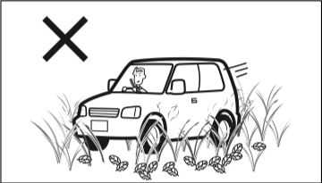{ .center-image }

!!! danger "Внимание"
    Если трава или другие материалы намотаются на элементы привода или выхлопную трубу, это может повредить привод или привести к пожару.

### На скользкой дороге двигайтесь медленно

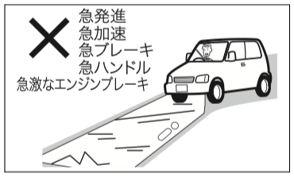{ .center-image }

!!! warning "Осторожно"
    На мокрой, обледеневшей или заснеженной дороге не выполняйте резкие действия: резкий старт, резкое ускорение, резкое торможение, резкие повороты и резкое торможение двигателем.

    Это может привести к заносу.

### Не проезжайте лужи на высокой скорости

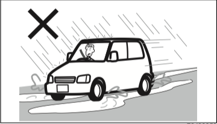{ .center-image }

!!! warning "Осторожно"
    При движении по лужам или мокрой дороге на высокой скорости между шиной и дорогой может образоваться водяная плёнка. Это явление называется аквапланированием: рулевое управление и тормоза могут перестать нормально работать, что может привести к неожиданной аварии.

### После движения по воде или мойки проверьте тормоза

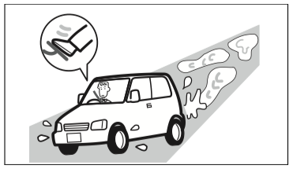{ .center-image }

- Убедитесь, что вокруг безопасно, затем на низкой скорости несколько раз нажмите педаль тормоза и проверьте эффективность торможения.
- Если тормоза работают плохо, продолжайте движение на низкой скорости и несколько раз слегка нажмите педаль тормоза, пока тормозные механизмы не просохнут и эффективность не восстановится.

### Не ездите по затопленным местам и глубоким лужам

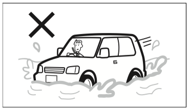{ .center-image }

!!! info "Примечание"
    Движение по затопленным местам и глубоким лужам может привести к неисправности двигателя, электрооборудования, трансмиссии и других узлов.

    Если всё же приходится ехать по воде:

    - не въезжайте туда, где глубина воды больше 30 см;
    - двигайтесь очень медленно, не быстрее 5 км/ч, не поднимая волну;
    - избегайте переключения селектора или рычага передач;
    - после проезда убедитесь в безопасности вокруг, несколько раз нажмите педаль тормоза на низкой скорости и проверьте эффективность торможения.

    Если автомобиль уже проехал затопленное место или глубокую лужу, остановитесь в безопасном месте, обратитесь к дилеру Suzuki или представителю Suzuki и проверьте:

    - работу тормозов;
    - состояние масла в двигателе, трансмиссии и дифференциалах; если масло стало белёсым, в него попала вода и требуется замена;
    - смазку подшипников, шарниров и других узлов.

    При движении по затопленному месту автоматическая остановка двигателя может привести к повреждению двигателя. Перед таким движением отключите систему.

См. также: [система автоматической остановки двигателя](04-driving.md#система-автоматической-остановки-двигателя-на-холостом-ходу) и [если автомобиль был затоплен](07-emergency.md#если-автомобиль-оказался-в-воде).

### Если автомобиль застрял

Если ведущие колёса буксуют и автомобиль не может выехать из грязи, песка или другого покрытия, это называется застреванием.

1. Уберите землю, снег и другие препятствия перед застрявшими шинами и за ними.
2. Подложите под шины камни, ветки или другой твёрдый материал.
3. Переведите рычаг раздаточной коробки в положение `4H` или `4L`.
4. Плавно нажмите педаль акселератора и начните движение.

См. также: [переключение 2WD/4WD](04-driving.md#переключение-2wd4wd).

!!! danger "Внимание"
    Перед попыткой выехать убедитесь, что вокруг безопасно. Если начать движение резко, можно вызвать аварию.

!!! info "Примечание"
    Не допускайте быстрого вращения шин на месте. Шины могут перегреться и повредиться, а детали привода могут выйти из строя.

    Если долго поддерживать высокие обороты двигателя, двигатель и выхлопная система могут перегреться, что создаёт риск пожара.

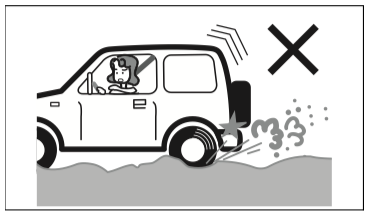{ .center-image }

!!! tip "Подсказка"
    Если автомобиль застрял в режиме 2WD, переключение на 4WD облегчает выезд.

    При раскачивании автомобиля вперёд и назад есть риск повредить привод. Соблюдайте следующие правила:

    - на автомобиле с автоматической коробкой передач сначала надёжно переведите селектор в нужное положение, затем слегка нажимайте педаль акселератора;
    - если после нескольких попыток выехать не удаётся, прекратите попытки и обратитесь за помощью к спасательной службе или специалистам.

    Если ESP® мешает выезду, отключите антипробуксовочную функцию выключателем отключения ESP®.

См. также: [переключение 2WD/4WD](04-driving.md#переключение-2wd4wd) и [ESP®](04-driving.md#esp).

### Что делать в таких случаях

#### Если загорелась предупреждающая лампа или появилось предупреждающее сообщение

Сразу остановитесь в безопасном месте и примите необходимые меры.

См. также: [предупреждающие лампы](01-quick-guide.md#предупреждающие-лампы) и [сообщения многофункционального дисплея](03-before-driving.md#сообщения-многофункционального-информационного-дисплея).

#### Если днище получило сильный удар

Сразу остановитесь в безопасном месте и проверьте, нет ли утечки тормозной жидкости или топлива, а также повреждений выхлопной трубы.

Если нашли неисправность, обратитесь к дилеру Suzuki или представителю Suzuki.

#### Если внезапно лопнула шина

Крепко держите рулевое колесо, плавно нажимайте тормоз, постепенно снижайте скорость и остановитесь в безопасном месте.

См. также: [прокол колеса](07-emergency.md#прокол-шины).

#### Если педаль тормоза кажется тяжёлой

В автомобиле есть вакуумный усилитель тормозов, который снижает усилие на педали. Если вакуум двигателя уменьшился, педаль может стать тяжелее, но это не является неисправностью. Нажмите педаль сильнее.

#### Если слышен металлический звук от тормозов

Как можно скорее обратитесь к дилеру Suzuki или представителю Suzuki для проверки.

!!! danger "Внимание"
    Не продолжайте движение, если слышен металлический звук от тормозов. Тормоза могут перестать работать, что может привести к аварии.

#### Если ощущение от тормоза изменилось

!!! warning "Осторожно"
    Если тормоза стали работать хуже, торможение справа и слева стало неравномерным, ход педали увеличился или тормоз стал подклинивать, как можно скорее обратитесь к дилеру Suzuki или представителю Suzuki для проверки.

## Во время стоянки

### Надёжно включайте стояночный тормоз

#### На ровной поверхности

1. Удерживая педаль тормоза нажатой, надёжно включите стояночный тормоз.

    См. также: [стояночный тормоз](04-driving.md#стояночный-тормоз).

    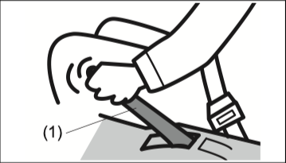{ .center-image }

2. На автомобиле с механической коробкой передач включите передачу `R` или `1`. На автомобиле с автоматической коробкой передач переведите селектор в положение `P`.

    Медленно отпустите педаль тормоза и убедитесь, что автомобиль не начинает двигаться.

    См. также: [рычаг переключения передач](04-driving.md#рычаг-переключения-передач) и [селектор передач](04-driving.md#управление-селектором-передач).

!!! warning "Осторожно"
    Даже при кратковременной стоянке на ровной поверхности для безопасности включайте передачу `R` или `1` на автомобиле с механической коробкой передач либо переводите селектор в положение `P` на автомобиле с автоматической коробкой передач.

    В холодную погоду стояночный тормоз может замёрзнуть и не отпуститься. По возможности избегайте стоянки на уклоне и выбирайте ровное место.

    См. также: [стояночный тормоз](06-care.md#стояночный-тормоз).

#### На уклоне

Действия 1 и 2 такие же, как при стоянке на ровной поверхности.

!!! tip "Оборудование по типу автомобиля"
    На автомобиле с механической коробкой передач при стоянке на спуске включите передачу `R`, а при стоянке на подъёме - `1`.

3. Зафиксируйте шины противооткатным упором, камнем или другим подходящим предметом, чтобы автомобиль не начал двигаться.

!!! danger "Внимание"
    Не паркуйтесь на крутых уклонах. Автомобиль может самопроизвольно начать движение и привести к неожиданной аварии.

### Охлаждающий вентилятор может внезапно включиться во время работы двигателя

Охлаждающий вентилятор в моторном отсеке автоматически включается и выключается в зависимости от температуры охлаждающей жидкости двигателя.

!!! danger "Внимание"
    Даже если охлаждающий вентилятор остановлен, он может автоматически начать вращаться во время работы двигателя. Не приближайтесь к нему. Если в вентилятор попадут руки, волосы или одежда, можно получить травму.

### Охлаждающий вентилятор может вращаться после остановки двигателя

!!! tip "Оборудование по типу автомобиля"
    Jimny.

Если температура охлаждающей жидкости высокая, охлаждающий вентилятор может продолжать вращаться после остановки двигателя. Это не является неисправностью; вентилятор автоматически остановится, когда температура охлаждающей жидкости снизится.

!!! danger "Внимание"
    Не приближайтесь к вращающемуся охлаждающему вентилятору. Если в него попадут руки, волосы или одежда, можно получить травму.

### При перемещении автомобиля запускайте двигатель

!!! warning "Осторожно"
    Не перемещайте автомобиль по инерции, используя уклон. При выключенном двигателе руль и тормоза требуют большего усилия, что может привести к неожиданной аварии.

### Не спите в автомобиле с работающим двигателем

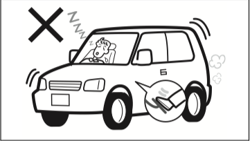{ .center-image }

!!! danger "Внимание"
    В зависимости от окружающих условий и направления ветра выхлопные газы могут попасть в салон и вызвать отравление угарным газом.

    Во сне можно случайно переместить рычаг или селектор либо нажать педаль акселератора, что может привести к неожиданной аварии.

    Если долго удерживать педаль акселератора нажатой во сне, двигатель и выхлопная система могут перегреться и вызвать пожар.

### Не паркуйтесь рядом с горючими материалами

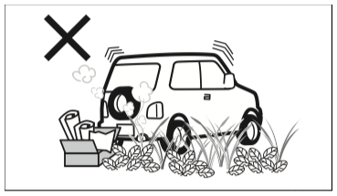{ .center-image }

!!! danger "Внимание"
    Не останавливайте автомобиль рядом с сухой травой, бумажным мусором, фанерой и другими горючими материалами. Выхлопная труба и выхлопные газы сильно нагреваются, что может привести к пожару.

### Когда выходите из автомобиля, остановите двигатель и заприте двери

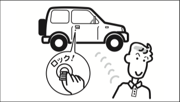{ .center-image }

Даже если выходите ненадолго, не оставляйте в автомобиле деньги и ценные вещи. Есть риск кражи.

!!! danger "Внимание"
    Не уходите от автомобиля с работающим двигателем. Это может привести к пожару, угону или другой неожиданной аварии.

### Не оставляйте в салоне ноутбук, телефон и похожие устройства

Не оставляйте в автомобиле ноутбуки, мобильные телефоны и другие устройства. Они могут быть украдены, повредиться из-за влаги или перепада температуры.

### Не оставляйте в салоне зажигалки и очки

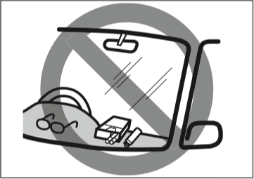{ .center-image }

!!! danger "Внимание"
    При стоянке под солнцем не оставляйте в салоне зажигалки, аэрозольные баллоны, пластиковые изделия, например очки, карты и футляры для CD, а также газированные напитки.

    Из-за высокой температуры в салоне это может привести к возгоранию или взрыву зажигалки и аэрозольного баллона, деформации или растрескиванию пластиковых изделий, а также разрыву банки с газированным напитком.

    Не кладите зажигалки и аэрозольные баллоны с открытой рабочей частью в перчаточный ящик, ящик для мелочей, под сиденье или в другие щели. При прижатии багажом или перемещении сиденья газ может выйти и привести к пожару.

## При заправке

См. также: [лючок топливного бака](05-equipment.md#лючок-топливного-бака).

### Соблюдайте осторожность с огнём

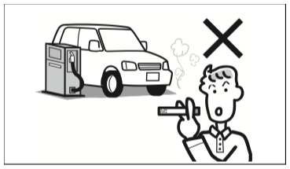{ .center-image }

!!! danger "Внимание"
    Соблюдайте следующие правила:

    - остановите двигатель;
    - во время заправки закройте двери и окна;
    - бензин легко воспламеняется, поэтому курение и любой открытый огонь запрещены.

### При заправке на колонке самообслуживания

!!! danger "Внимание"
    Перед открытием крышки топливного бака коснитесь кузова автомобиля или металлической части заправочной колонки, чтобы снять статическое электричество. Если на теле накоплен статический заряд, искра может воспламенить топливо и вызвать ожог.

    Во время заправки не возвращайтесь в салон: тело может снова накопить статический заряд.

    Не подпускайте к заливной горловине людей, которые не сняли статический заряд.

    Открывайте крышку топливного бака медленно. Если услышите выход воздуха, дождитесь прекращения звука и только потом снимайте крышку. При резком открытии давление в баке может быстро выйти, и топливо может выплеснуться.

    Вставляйте заправочный пистолет в горловину до упора. Если вставить его недостаточно глубоко, топливо может выплеснуться.

    Нажимайте рычаг пистолета до упора.

    Если сработала автоматическая остановка пистолета, завершите заправку. Не доливайте топливо после автоматической остановки: топливо может перелиться.

    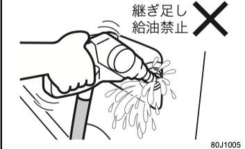{ .center-image }

    Если топливо пролилось, сразу вытрите его мягкой тканью. Иначе возможен пожар, а также повреждение лакокрасочного покрытия, изменение цвета или растрескивание.

    После заправки верните крышку на место и закрутите её до двух и более щелчков. Если крышка закрыта неплотно, топливо может вытечь или возникнуть пожар.

    Не вдыхайте пары топлива: топливо содержит вредные для организма вещества.

    Также соблюдайте предупреждения, указанные на заправочной станции.

### Используйте только неэтилированный бензин

!!! info "Примечание"
    Не используйте этилированный бензин, низкокачественный бензин и другие виды топлива, например спиртовое или лёгкое топливо. Это может повредить двигатель и топливную систему.

## Если управляете автомобилем с автоматической коробкой передач

Автомобиль с автоматической коробкой передач имеет особые правила эксплуатации.

См. также: [автомобиль с автоматической коробкой передач](04-driving.md#автомобиль-с-автоматической-коробкой-передач).

### Остерегайтесь ползучего хода

Если двигатель работает и селектор находится не в положении `P` или `N`, автомобиль может медленно двигаться даже без нажатия педали акселератора. Это называется ползучим ходом.

!!! warning "Осторожно"
    Если селектор находится не в положении `P` или `N`, надёжно удерживайте педаль тормоза нажатой.

    Сразу после запуска двигателя или при работе кондиционера ползучий ход может усиливаться. В такие моменты особенно надёжно удерживайте педаль тормоза нажатой.

### Предупреждающий зуммер положения `R`

Если перевести селектор в положение `R`, в салоне звучит предупреждающий зуммер. Он сообщает водителю, что выбран задний ход.

!!! tip "Подсказка"
    Предупреждающий зуммер положения `R` не предназначен для предупреждения людей снаружи автомобиля о движении задним ходом.

### Остерегайтесь перепутывания педалей

!!! danger "Внимание"
    Если перепутать педали акселератора и тормоза, это может привести к неожиданной аварии.

Перед запуском двигателя правой ногой поочерёдно нажмите педаль акселератора и педаль тормоза, чтобы убедиться в их расположении.

### Нажимайте педаль тормоза правой ногой

{ .center-image }

| № | Педаль |
| --- | --- |
| (1) | Педаль тормоза |
| (2) | Педаль акселератора |

Левой ногой трудно выполнять точное торможение. Привыкайте нажимать педаль тормоза правой ногой.

### При переключении селектора

- Если нужно несколько раз переключаться между движением вперёд и назад, например при развороте, не забывайте, что селектор переводился в положение `R`. После движения назад сразу переводите селектор из `R` в `N`.
- При повторном переключении между движением вперёд и назад полностью останавливайте автомобиль перед переводом селектора.

!!! danger "Внимание"
    Не переключайте селектор при нажатой педали акселератора. Автомобиль может резко тронуться и вызвать аварию.

### Проверяйте положение селектора и индикацию на приборной панели

При запуске и стоянке выбирайте `P`, при движении вперёд - `D`, при движении назад - `R`. Перед движением визуально убедитесь, что индикатор передачи на приборной панели показывает `P`, `D` или `R`.

### Когда выходите из автомобиля

{ .center-image }

!!! danger "Внимание"
    Не выходите из автомобиля с работающим двигателем.

    Если селектор находится не в положении `P`, автомобиль может самопроизвольно начать движение. При посадке можно случайно переместить селектор или нажать педаль акселератора, что может вызвать резкое трогание.

## Если автомобиль оснащён подушками безопасности SRS

Чтобы система подушек безопасности SRS могла работать эффективно, прочитайте также раздел [подушки безопасности SRS](03-before-driving.md#подушки-безопасности-srs) и соблюдайте правила эксплуатации.

### Обязательно пристёгивайтесь ремнём безопасности

{ .center-image }

!!! danger "Внимание"
    Система подушек безопасности SRS не заменяет ремни безопасности. Она дополняет ремни, помогая удерживать пассажиров. Даже если автомобиль оснащён подушками безопасности SRS, обязательно пристёгивайтесь ремнём безопасности.

### Посадка

Водитель и пассажир переднего сиденья должны сидеть глубоко в сиденье и слегка прижимать спину к спинке. Не выдвигайте сиденье слишком далеко вперёд.

{ .center-image }

!!! danger "Внимание"
    Не приближайте лицо или грудь к рулевому колесу или панели приборов и не кладите туда ноги. При срабатывании подушки безопасности SRS сильный удар может привести к тяжёлым травмам.

    При срабатывании боковой подушки безопасности SRS или шторки безопасности SRS сильный удар может привести к тяжёлым травмам. Не высовывайте руки из окна, не прислоняйтесь к двери. Пассажирам заднего сиденья не следует обхватывать спинку переднего сиденья.

{ .center-image }

### Чтобы система подушек безопасности SRS работала правильно

{ .center-image }

!!! danger "Внимание"
    Не заменяйте рулевое колесо, не наклеивайте наклейки на крышку подушки безопасности, не окрашивайте её, не закрывайте чехлом и не выполняйте другие подобные изменения.

    Не наклеивайте наклейки и не окрашивайте места установки подушек безопасности и область вокруг них. Не устанавливайте и не кладите аксессуары, ароматизаторы, устройства электронной оплаты проезда ETC, портативные навигаторы и другие предметы в зоне раскрытия подушек безопасности.

    Не устанавливайте аксессуары на лобовое стекло и внутреннее зеркало, кроме оригинальных аксессуаров Suzuki.

    Если устанавливаете чехлы на передние сиденья, используйте специальные оригинальные чехлы Suzuki. Неоригинальные чехлы могут помешать нормальной работе боковых подушек безопасности SRS и привести к тяжёлым травмам.

    При срабатывании боковой подушки безопасности SRS или шторки безопасности SRS предметы могут отлететь или помешать нормальному раскрытию, что может привести к тяжёлым травмам. Не устанавливайте держатели стаканов, крючки, вешалки и другие аксессуары рядом с дверями и не ставьте зонты в этой зоне.

{ .center-image }

### Предупреждающая наклейка о подушке безопасности SRS переднего пассажира

На обеих сторонах солнцезащитного козырька пассажира есть предупреждающая наклейка. Она предупреждает о влиянии фронтальной подушки безопасности SRS переднего пассажира на детское удерживающее устройство и о запретах при установке детского удерживающего устройства.

Перед установкой детского удерживающего устройства на переднее пассажирское сиденье внимательно прочитайте предупреждающую наклейку и соответствующие разделы руководства.

{ .center-image }

!!! danger "Внимание"
    Никогда не устанавливайте детское удерживающее устройство против хода движения на сиденье, защищённое активной фронтальной подушкой безопасности. Ребёнок может погибнуть или получить тяжёлые травмы.

| Символ | Значение |
| --- | --- |
| Запрещающий символ детского удерживающего устройства | Запрещено устанавливать на переднее пассажирское сиденье, оснащённое подушкой безопасности SRS, детское удерживающее устройство против хода движения и перевозить в нём ребёнка. |
| Символ раскрытия подушки безопасности SRS | Показывает, что при раскрытии подушки безопасности SRS переднего пассажира на детское удерживающее устройство против хода движения и ребёнка действует сильный удар. |
| Символ руководства | Прочитайте это руководство. См. [использование детского удерживающего устройства](#использование-детских-удерживающих-устройств) и [выбор детского удерживающего устройства](03-before-driving.md#выбор-детского-удерживающего-устройства). |

## Если управляете автомобилем 4WD

Автомобиль 4WD имеет особые правила эксплуатации.

См. также: [переключение 2WD/4WD](04-driving.md#переключение-2wd4wd).

### Учитывайте состояние дороги

Автомобиль 4WD не рассчитан на движение по любой дороге. Не переоценивайте его возможности: внимательно учитывайте состояние дороги и безопасность вокруг.

!!! warning "Осторожно"
    4WD улучшает движение по снегу, крутым подъёмам, песку, грязи и другим покрытиям, где шины легко буксуют, но не делает автомобиль всепроходимым. Это не специализированный автомобиль для бездорожья или ралли.

    Соблюдайте следующие правила:

    - не двигайтесь непрерывно по песку, грязи и другим покрытиям, где шины легко вращаются вхолостую;
    - тормозные характеристики почти не отличаются от автомобиля 2WD. На скользких дорогах сохраняйте достаточную дистанцию и плавно работайте педалью акселератора, рулём и тормозом так же, как на 2WD.

### Не используйте 4WD на сухой асфальтированной дороге

На сухой асфальтированной дороге двигайтесь в режиме 2WD.

{ .center-image }

!!! warning "Осторожно"
    По возможности избегайте движения в 4WD даже на мокрой асфальтированной дороге. На покрытии, где шины плохо проскальзывают, разница вращения передних и задних колёс не поглощается, из-за чего могут возникнуть следующие проблемы:

    - чрезмерная нагрузка и повреждение деталей привода;
    - ускоренный износ шин;
    - тяжёлое рулевое управление;
    - ощущение, будто автомобиль тормозит в повороте.

### Не выполняйте резкие развороты в 4WD

{ .center-image }

!!! warning "Осторожно"
    Если в режиме 4WD резко разворачивать автомобиль на крутом повороте, в узком проезде или на парковке, усилие на рулевом колесе увеличится. Кроме того, может возникнуть эффект торможения в крутом повороте, из-за чего возможна неожиданная авария или повреждение привода.

    Эффект торможения в крутом повороте возникает при резком повороте в режиме полного привода, когда разница вращения передних и задних колёс не поглощается. По ощущениям это похоже на торможение.

### По возможности избегайте движения через водные преграды

Автомобиль 4WD не является полностью защищённым от воды. По возможности избегайте движения через водные преграды.

{ .center-image }

!!! info "Примечание"
    Движение через водные преграды может привести к остановке двигателя, неисправности электрооборудования, повреждению двигателя и другим проблемам.

    Если всё же приходится преодолеть водную преграду, соблюдайте следующие правила:

    - заранее проверьте глубину и рельеф реки;
    - выбирайте место глубиной не более 30 см и двигайтесь перпендикулярно течению или вниз по течению;
    - двигайтесь очень медленно, не быстрее 5 км/ч, не поднимая волну, не переключайте селектор или рычаг передач и преодолевайте водную преграду без остановки;
    - после проезда убедитесь в безопасности вокруг, несколько раз нажмите педаль тормоза на низкой скорости и проверьте эффективность торможения.

!!! info "Примечание"
    Если тормоза работают плохо, продолжайте движение на низкой скорости и несколько раз слегка нажмите педаль тормоза, пока тормозные механизмы не просохнут и эффективность не восстановится.

    Если автомобиль всё же проехал водную преграду, остановитесь в безопасном месте, проверьте эффективность тормозов и обратитесь к дилеру Suzuki или представителю Suzuki для проверки следующих узлов:

    - работа тормозов;
    - состояние масла в двигателе, трансмиссии и дифференциалах; если масло стало белёсым или изменило свойства, в него попала вода и требуется замена;
    - смазка подшипников, шарниров и других узлов.

### Проверяйте автомобиль после движения вне дорог

!!! info "Примечание"
    После движения вне дорог удалите насекомых, сухую траву и другие посторонние предметы, если они попали в отверстия решётки или бампера в передней части автомобиля. Иначе возможен перегрев.

    Обратитесь к дилеру Suzuki или представителю Suzuki в следующих случаях:

    - есть повреждения нижней части автомобиля;
    - изменился уровень масла, масло или смазка стали белёсыми.

!!! tip "Подсказка"
    После движения по морскому побережью или по дороге, обработанной противогололёдным реагентом, тщательно вымойте автомобиль, особенно нижнюю часть кузова и область колёс. Это поможет избежать ржавчины и изменения цвета покрытия.

    См. также: [уход за кузовом](06-care.md#уход-за-кузовом).

## Если управляете автомобилем с турбонаддувом

!!! tip "Оборудование по типу автомобиля"
    Jimny.

Автомобили с турбонаддувом требуют особого обращения. Внимательно прочитайте этот раздел и соблюдайте правила эксплуатации.

### Обращение с турбонаддувом

Турбонагнетатель - это точный механизм, который создаёт большую мощность, чем обычный двигатель. Турбина внутри турбонагнетателя вращается потоком выхлопных газов с очень высокой скоростью и подаёт в двигатель большое количество сжатого воздуха.

Узел турбины нагревается до температуры выше 700 °C. Его смазка и охлаждение выполняются моторным маслом.

Чтобы предотвратить повреждение турбонагнетателя, соблюдайте следующие правила:

- регулярно заменяйте моторное масло и масляный фильтр. Если продолжать ездить со старым маслом, смазка и охлаждение турбонагнетателя ухудшатся, вал турбины может заклинить или появится посторонний шум;

См. также: [при замене моторного масла](#при-замене-моторного-масла).

- после движения на высокой скорости или сразу после подъёма не останавливайте двигатель сразу. Дайте двигателю поработать на холостом ходу по таблице ниже, чтобы охладить нагретый турбонагнетатель.

| Условия движения перед остановкой двигателя | Примерное время работы на холостом ходу |
| --- | --- |
| Движение на высокой скорости, подъём | Около 1 минуты |
| Обычное движение в городе или за городом | Не требуется |

- Если двигатель холодный, не повышайте обороты резко и не ускоряйтесь резко.

!!! info "Примечание"
    Если не соблюдать эти правила, турбонагнетатель может выйти из строя или получить повреждения.

## Другие меры предосторожности

### При прохождении технического осмотра

Если автомобиль проверяют на стенде, с помощью выключателя отключения ESP® отключите следующие функции.

См. также: [выключатель отключения ESP®](04-driving.md#выключатель-esp-off).

- противобуксовочная система и система стабилизации;
- системы помощи водителю Suzuki Safety Support.

См. также: [системы помощи водителю Suzuki Safety Support](04-driving.md#системы-помощи-водителю-suzuki-safety-support).

За подробностями обратитесь к дилеру Suzuki или представителю Suzuki.

!!! tip "Подсказка"
    Выключатель отключения DSBS II не отключает ESP®.

### Не прикладывайте чрезмерное усилие к наружным элементам

!!! info "Примечание"
    Не прикладывайте большое усилие к бамперам и другим наружным элементам. Это может привести к их повреждению.

### Будьте осторожны на неровностях

!!! info "Примечание"
    В следующих случаях бампер или нижняя часть кузова могут быть повреждены:

    - въезд на бордюр, ступеньку или другое место с перепадом высоты;
    - движение по дорогам с колеёй, выбоинами и другими неровностями.

### Не модифицируйте автомобиль самостоятельно

!!! danger "Внимание"
    Самостоятельные модификации могут привести к пожару или аварии. Они также могут ухудшить управляемость, характеристики и долговечность автомобиля либо привести к нарушению требований законодательства.

    Не устанавливайте детали, не предназначенные для этого автомобиля, не выполняйте самостоятельные регулировки и не переделывайте электропроводку.

    Такие модификации могут повлиять на системы помощи водителю Suzuki Safety Support и другие системы активной безопасности: они могут работать некорректно или сработать в ситуации, где срабатывание не требуется.

{ .center-image }

### При установке или снятии электрооборудования и колёс

!!! info "Примечание"
    Перед установкой или снятием радиостанции, аудиосистемы, устройства электронной оплаты проезда ETC и другого электрооборудования обратитесь к дилеру Suzuki или представителю Suzuki.

    Не берите питание для электрооборудования напрямую с клемм аккумулятора и не подключайте массу напрямую. Это может нарушить работу электроники, привести к пожару, неисправности или разряду аккумулятора.

    Использование колёс или колёсных гаек, не относящихся к оригинальным деталям Suzuki, может привести к ослаблению гаек во время движения и отсоединению колеса. Кроме того, это может ухудшить расход топлива, устойчивость автомобиля и стать причиной неисправности.

    Используйте только оригинальные колёса и колёсные гайки Suzuki указанного типа.

!!! info "Примечание"
    Перед установкой радиостанции рекомендуется проконсультироваться с дилером Suzuki или представителем Suzuki по частоте, максимальной выходной мощности, месту установки антенны и другим условиям установки и эксплуатации.

    Если радиостанция установлена неправильно или не подходит этому автомобилю, электронные системы автомобиля могут работать некорректно.

    Не подключайте к диагностическому разъёму автомобиля посторонние устройства. Это может нарушить работу электроники или привести к разряду аккумулятора.

    К диагностическому разъёму автомобиля подключайте только предусмотренное диагностическое оборудование для проверки и обслуживания.

### Риски установки неоригинального электрооборудования

!!! info "Примечание"
    Установка электрооборудования, не относящегося к оригинальным деталям Suzuki, может нарушить работу штатного электрооборудования, привести к серьёзной неисправности или утечке персональных данных.

    Suzuki не несёт ответственности за неисправности и другие повреждения, вызванные установкой неоригинального электрооборудования.

### При установке, снятии или ремонте деталей

!!! danger "Внимание"
    Если вмешиваться в детали, влияющие на работу системы подушек безопасности SRS или преднатяжителей ремней безопасности, система может сработать непреднамеренно или не сработать в нужный момент.

    Перечисленные ниже работы могут повлиять на работу системы. Перед их выполнением проконсультируйтесь с дилером Suzuki или представителем Suzuki:

    - снятие рулевого колеса, ремонт в зоне рулевого колеса;
    - ремонт в зоне панели приборов и центральной консоли, ремонт электропроводки;
    - установка аудиосистемы и других аксессуаров;
    - окраска или ремонт элементов вокруг панели приборов;
    - замена передних сидений, ремонт в зоне сидений;
    - ремонт в зоне передних стоек, задних стоек и боковых частей крыши;
    - ремонт в зоне центральных стоек.

### При установке аксессуаров

{ .center-image }

!!! danger "Внимание"
    Не устанавливайте аксессуары на оконные стёкла. Аксессуары или их присоски могут закрывать обзор, а присоска может сфокусировать солнечный свет и вызвать пожар.

    При срабатывании подушки безопасности SRS аксессуар может отлететь и причинить травму.

### Если пролили напиток или другую жидкость

!!! danger "Внимание"
    Не заливайте салон водой и не проливайте в салоне напитки. Жидкость может попасть в перечисленные ниже узлы и вызвать неисправность или пожар:

    - система подушек безопасности SRS;
    - аудиосистема, выключатели, электропроводка и другое электрооборудование;
    - подвижные механизмы, например рычаг переключения передач, селектор и замки ремней безопасности.

    Если жидкость всё же попала в салон, как можно скорее обратитесь к дилеру Suzuki или представителю Suzuki для проверки автомобиля.

!!! info "Примечание"
    В подушках переднего пассажирского и задних сидений могут быть встроены датчики напоминания о ремнях безопасности. Если на подушку сиденья пролился сладкий напиток, сок или другая жидкость, сразу вытрите её мягкой тканью.

    Иначе датчик напоминания о ремне безопасности может быть повреждён.

### При замене моторного масла

#### Заменяйте моторное масло регулярно

- Для Jimny при обычных условиях эксплуатации заменяйте моторное масло каждые 5 000 км или каждые 6 месяцев, в зависимости от того, что наступит раньше. Масляный фильтр заменяйте каждые 10 000 км.
- Для Jimny Sierra при обычных условиях эксплуатации заменяйте моторное масло каждые 15 000 км или каждые 12 месяцев, в зависимости от того, что наступит раньше. Масляный фильтр заменяйте каждые 15 000 км.
- При тяжёлых условиях эксплуатации замену нужно выполнять раньше стандартного интервала.

См. также: сервисная книжка, раздел «Техническое обслуживание».

!!! info "Примечание"
    Соблюдайте интервалы замены. Старое масло и засорённый масляный фильтр могут стать причиной неисправности двигателя или постороннего шума.

    Для замены масла и фильтра обратитесь к дилеру Suzuki или представителю Suzuki.

{ .center-image }

#### Спецификация и вязкость моторного масла

Характеристики автомобиля, включая расход топлива, зависят от используемого моторного масла. Используйте моторное масло, соответствующее таблицам ниже. Рекомендуется использовать оригинальное моторное масло Suzuki.

См. также: [сервисные данные](08-service-data.md#сервисные-данные).

| API | ILSAC | Эксплуатационные свойства масла |
| --- | --- | --- |
| SP или эквивалент | GF-6 или эквивалент | Самые высокие |
| SN или эквивалент | - | Высокие |
| SM или эквивалент | - | Стандартные |
| SL или эквивалент | - | Базовые |

| Автомобиль | Вязкость SAE |
| --- | --- |
| Jimny | 5W-30 |
| Jimny Sierra | 0W-16, 0W-20, 5W-30 |

Примечания к таблицам:

- API: класс качества моторного масла по системе Американского института нефти.
- ILSAC: спецификация Международного консультативного комитета по смазочным материалам для автомобильных моторных масел. Она основана на спецификации API и указывает, что масло также имеет улучшенные характеристики по расходу топлива, долговечности и другим параметрам.
- SAE: классификация вязкости моторного масла. Число слева от `W` обозначает вязкость при низкой температуре: чем оно меньше, тем лучше пуск двигателя в холодную погоду. Число справа обозначает вязкость при высокой температуре: чем оно больше, тем выше стойкость масла к нагреву и защитные свойства.

!!! tip "Подсказка"
    Для Jimny Sierra масло 0W-16 имеет лучшие показатели по расходу топлива.

## Экологичное вождение

### Поддерживайте правильное давление в шинах

- При низком давлении в шинах расход топлива увеличивается. Поддерживайте правильное давление.
- Давление, указанное для этого автомобиля, приведено на табличке давления воздуха в шинах (1) в проёме двери водителя. Проверяйте давление по этой табличке и регулируйте его при необходимости.

{ .center-image }

### Не перевозите лишний груз

Лишний груз ухудшает расход топлива, ускоряет износ шин и в целом неблагоприятно влияет на автомобиль.

### Правильно прогревайте двигатель

В следующих случаях перед началом движения прогрейте двигатель на холостом ходу от нескольких десятков секунд до нескольких минут:

- автомобиль долго не использовался;
- температура окружающего воздуха очень низкая, примерно −10 °C или ниже.

Во всех остальных случаях для экономии топлива начинайте движение вскоре после запуска двигателя.

!!! info "Примечание"
    Сразу после запуска двигатель ещё не прогрет. Резкое повышение оборотов, резкое трогание и резкое ускорение могут привести к неисправности двигателя.

!!! tip "Подсказка"
    Расход зависит от условий, но обычно за 5 минут прогрева двигатель расходует около 160 мл топлива.

### Избегайте резкого старта, ускорения и торможения

{ .center-image }

### Не повышайте обороты двигателя без нагрузки

{ .center-image }

Это только расходует топливо и не даёт практической пользы.

### Выбирайте передачу по скорости движения

Движение на низкой передаче с высокими оборотами двигателя ухудшает расход топлива. Выбирайте передачу, соответствующую скорости движения.
