# 3. Перед началом движения

## Содержание главы

| Раздел | Тема | Страница |
| --- | --- | --- |
| Открывание и закрывание дверей | [Ключи](#ключи) | 3-2 |
| Открывание и закрывание дверей | [Система бесключевого доступа](#система-бесключевого-доступа) | 3-5 |
| Открывание и закрывание дверей | [Пульт дистанционного управления](#пульт-дистанционного-управления) | 3-8 |
| Открывание и закрывание дверей | [Двери](#двери) | 3-13 |
| Охранная система | [Охранная сигнализация](#охранная-сигнализация) | 3-17 |
| Открывание и закрывание окон | [Электростеклоподъёмники](#электростеклоподъёмники) | 3-20 |
| Регулировка элементов | [Внутреннее зеркало заднего вида](#внутреннее-зеркало-заднего-вида) | 3-23 |
| Регулировка элементов | [Наружные зеркала](#наружные-зеркала) | 3-23 |
| Регулировка элементов | [Регулировка рулевой колонки по высоте](#регулировка-рулевой-колонки-по-высоте) | 3-28 |
| Регулировка сидений | [Передние сиденья](#передние-сиденья) | 3-29 |
| Регулировка сидений | [Задние сиденья](#задние-сиденья) | 3-32 |
| Регулировка сидений | [Удобное использование сидений](#удобное-использование-сидений) | 3-34 |
| Ремни безопасности | [Ремни безопасности](#ремни-безопасности) | 3-37 |
| Ремни безопасности | [Как пристегнуть ремень безопасности](#как-пристегнуть-ремень-безопасности) | 3-38 |
| Ремни безопасности | [Обращение с ремнями безопасности и уход](#обращение-с-ремнями-безопасности-и-уход) | 3-43 |
| Ремни безопасности | [Преднатяжители ремней безопасности (передние сиденья)](#преднатяжители-ремней-безопасности-передние-сиденья) | 3-44 |
| Ремни безопасности | [Ограничители усилия ремней безопасности](#ограничители-усилия-ремней-безопасности-передние-сиденья-и-боковые-места-заднего-сиденья) | 3-45 |
| Подушки безопасности SRS | [Если автомобиль оснащён подушками безопасности SRS](#если-автомобиль-оснащён-подушками-безопасности-srs) | 3-46 |
| Подушки безопасности SRS | [Обращение с системой подушек безопасности SRS](#обращение-с-системой-подушек-безопасности-srs) | 3-50 |
| Подушки безопасности SRS | [Работа системы подушек безопасности SRS](#работа-системы-подушек-безопасности-srs) | 3-53 |
| Подушки безопасности SRS | [Контрольная лампа подушек безопасности SRS](#контрольная-лампа-подушек-безопасности-srs) | 3-58 |
| Подушки безопасности SRS | [Утилизация и списание автомобиля](#утилизация-и-списание-автомобиля) | 3-59 |
| Детские удерживающие устройства | [Выбор детского удерживающего устройства](#выбор-детского-удерживающего-устройства) | 3-59 |
| Детские удерживающие устройства | [Крепление детского удерживающего устройства ремнём безопасности](#крепление-детского-удерживающего-устройства-ремнём-безопасности) | 3-66 |
| Детские удерживающие устройства | [Крепление детского удерживающего устройства ISOFIX](#крепление-детского-удерживающего-устройства-isofix) | 3-68 |
| Комбинация приборов | [Как читать показания приборов](#как-читать-показания-приборов) | 3-72 |
| Комбинация приборов | [Контрольные лампы и индикаторы](#контрольные-лампы-и-индикаторы) | 3-75 |
| Комбинация приборов | [Многофункциональный информационный дисплей](#многофункциональный-информационный-дисплей) | 3-97 |
| Использование переключателей | [Переключатель освещения](#переключатель-освещения) | 3-129 |
| Использование переключателей | [Переключатель передних противотуманных фар](#переключатель-передних-противотуманных-фар) | 3-134 |
| Использование переключателей | [Корректор фар](#корректор-фар) | 3-134 |
| Использование переключателей | [Переключатель указателей поворота](#переключатель-указателей-поворота) | 3-136 |
| Использование переключателей | [Выключатель аварийной световой сигнализации](#выключатель-аварийной-сигнализации) | 3-136 |
| Использование переключателей | [Переключатель стеклоочистителя и омывателя](#переключатель-стеклоочистителя-и-омывателя) | 3-137 |
| Использование переключателей | [Выключатель звукового сигнала](#выключатель-звукового-сигнала) | 3-139 |
| Использование переключателей | [Выключатель омывателя фар](#выключатель-омывателя-фар) | 3-140 |

## Открывание и закрывание дверей

### Ключи

Следите, чтобы ключи не потерялись и не оказались запертыми в автомобиле.

!!! danger "Внимание"
    Если берёте ключ с дистанционным управлением в самолёт, не нажимайте его кнопки на борту. Если кладёте ключ в сумку, уберите его так, чтобы кнопки не могли нажаться случайно.

    При нажатии кнопки ключ передаёт радиосигнал, который может создать помехи работе авиационного оборудования.

    ※ Ключ с дистанционным управлением относится к электронным устройствам, использование которых в самолёте ограничено.

!!! tip "Подсказка"
    Чтобы снизить риск угона, при потере ключа сразу обратитесь к дилеру Suzuki или в авторизованный сервис Suzuki.

#### Автомобили без системы бесключевого запуска кнопкой

!!! tip "Оборудование по типу автомобиля"
    Автомобили без системы бесключевого запуска кнопкой.

- В комплект входят два ключа.
- Ключ используется для запуска и остановки двигателя, а также для запирания и отпирания дверей.
- Во все ключи встроен иммобилайзер, защищающий автомобиль от угона.

См. также: [иммобилайзер](04-driving.md#система-иммобилайзера).

{ .center-image }

!!! warning "Осторожно"
    Не вешайте на ключ лишние аксессуары. Если на ключе много аксессуаров или они тяжёлые, во время движения от вибрации ключ в замке зажигания может повернуться.

    Кроме того, крупный аксессуар может задеть колено или руку и повернуть ключ.

    См. также: [замок зажигания](04-driving.md#работа-выключателя-двигателя).

!!! info "Примечание"
    В ключ встроены чувствительные электронные компоненты. Чтобы не повредить электронику, соблюдайте следующие правила:

    - не оставляйте ключ в местах, где он может сильно нагреться, например на панели приборов;
    - не роняйте ключ и не подвергайте его сильным ударам;
    - не мойте ключ и не погружайте его в воду;
    - не крепите к ключу держатели и другие предметы с магнитами;
    - не оставляйте ключ рядом с устройствами, создающими магнитное поле, например телевизором или аудиосистемой;
    - не кладите ключ рядом с медицинским электрооборудованием, например аппаратами микроволновой или низкочастотной терапии, и не проходите процедуры с ключом при себе.

!!! tip "Подсказка"
    Дубликат ключа, изготовленный в обычной мастерской, не имеет иммобилайзера. Таким ключом можно запирать и отпирать двери, но нельзя запустить двигатель.

    Для запуска двигателя нужно зарегистрировать код в оригинальном ключе Suzuki с иммобилайзером. Можно зарегистрировать до четырёх ключей.

    Для покупки ключа и регистрации кода обратитесь к дилеру Suzuki или в авторизованный сервис Suzuki.

#### Автомобили с системой бесключевого запуска кнопкой

!!! tip "Оборудование по типу автомобиля"
    Автомобили с системой бесключевого запуска кнопкой.

- Ключ можно использовать для запирания и отпирания дверей, но запустить или остановить им двигатель нельзя. Для запуска и остановки двигателя возьмите с собой пульт дистанционного управления и используйте кнопку запуска/остановки двигателя.

См. также: [запуск двигателя](04-driving.md#запуск-двигателя).

- В комплект входят два пульта дистанционного управления (1) и два механических ключа (2), которые хранятся внутри пультов.

См. также: [пульт дистанционного управления](#пульт-дистанционного-управления).

{ .center-image }

| Обозначение | Элемент |
| --- | --- |
| (3) | Индикатор работы |

- Чтобы вынуть механический ключ (2) из пульта, сдвиньте фиксатор (4) в направлении стрелки и потяните ключ.

{ .center-image }

!!! tip "Подсказка"
    Храните механический ключ внутри пульта дистанционного управления. Если элемент питания пульта разрядится или пульт выйдет из строя, запирание и отпирание дверей может стать невозможным.

    Для покупки ключа обратитесь к дилеру Suzuki или в авторизованный сервис Suzuki.

#### Номерная пластина ключа

На номерной пластине (2) выбит номер ключа (1), который нужен для изготовления нового ключа.

{ .center-image }

!!! tip "Подсказка"
    Чтобы номер ключа не стал известен посторонним, храните номерную пластину в надёжном месте вне автомобиля. Если ключ потерян, сообщите номер ключа при обращении к дилеру Suzuki или в авторизованный сервис Suzuki.

    При продаже автомобиля передайте номерную пластину новому владельцу вместе с ключами.

### Система бесключевого доступа

Если нажать кнопку на ключе с дистанционным управлением на расстоянии примерно до 2 м от автомобиля, все двери запираются или отпираются.

- После запирания потяните наружную ручку двери и убедитесь, что дверь действительно заперта.

!!! danger "Внимание"
    Чтобы снизить риск пожара, угона и других происшествий, когда отходите от автомобиля, остановите двигатель и заприте двери.

!!! info "Примечание"
    В ключ с дистанционным управлением встроены чувствительные электронные компоненты. Чтобы не повредить электронику, соблюдайте следующие правила:

    - не оставляйте ключ в местах, где он может сильно нагреться, например на панели приборов;
    - не роняйте ключ и не подвергайте его сильным ударам;
    - не мойте ключ и не погружайте его в воду.

!!! tip "Подсказка"
    Дальность действия системы бесключевого доступа может меняться под влиянием окружающих условий. В местах с сильными радиопомехами система может не работать.

    Даже если отходите от автомобиля ненадолго, не оставляйте в салоне деньги и ценные вещи. Это повышает риск кражи.

    Если ключ с дистанционным управлением не запирает и не отпирает двери, используйте механический ключ.

    Если система бесключевого доступа работает только с очень близкого расстояния, возможно, разрядился элемент питания ключа.

    См. также: [замена элемента питания ключа с дистанционным управлением](06-care.md#замена-элемента-питания-пульта-дистанционного-управления).

    Чем чаще пользоваться ключом с дистанционным управлением, тем быстрее разряжается элемент питания.

    Для покупки ключа и регистрации кода обратитесь к дилеру Suzuki или в авторизованный сервис Suzuki.

#### Автомобили без системы бесключевого запуска кнопкой

!!! tip "Оборудование по типу автомобиля"
    Автомобили без системы бесключевого запуска кнопкой.

{ .center-image }

| Обозначение | Элемент |
| --- | --- |
| (1) | Ключ с дистанционным управлением |
| (2) | Кнопка управления |

!!! tip "Подсказка"
    Система бесключевого доступа не работает в следующих случаях:

    - открыта одна из дверей; при этом запирание невозможно, но отпирание возможно;
    - ключ вставлен в выключатель двигателя.

    На один автомобиль можно зарегистрировать до четырёх ключей с дистанционным управлением.

#### Автомобили с системой бесключевого запуска кнопкой

!!! tip "Оборудование по типу автомобиля"
    Автомобили с системой бесключевого запуска кнопкой.

{ .center-image }

| Обозначение | Элемент |
| --- | --- |
| (1) | Пульт дистанционного управления |
| (2) | Кнопка запирания |
| (3) | Кнопка отпирания |
| (4) | Индикатор работы |

!!! tip "Подсказка"
    При нажатии кнопки загорается индикатор работы.

    Система бесключевого доступа не работает в следующих случаях:

    - открыта одна из дверей; при этом запирание невозможно, но отпирание возможно. Наружный зуммер прозвучит около 2 секунд;
    - кнопка запуска/остановки двигателя находится в положении `ACC` или `ON`.

    На один автомобиль можно зарегистрировать до четырёх пультов дистанционного управления.

#### Подтверждение запирания и отпирания

Эта функция показывает, что двери были заперты или отперты с помощью системы бесключевого доступа.

| Сигнал | Заводская настройка: запирание | Заводская настройка: отпирание | После изменения настройки: запирание | После изменения настройки: отпирание |
| --- | --- | --- | --- | --- |
| Аварийная световая сигнализация | 1 мигание | 2 мигания | - | - |
| Салонное освещение, если переключатель в положении `DOOR` | - | Горит около 15 секунд | 2 мигания | Горит около 15 секунд |

- Если нужно, чтобы при срабатывании системы бесключевого доступа салонное освещение загоралось или мигало, установите переключатель салонного освещения в положение `DOOR`.
- После включения примерно на 15 секунд салонное освещение плавно гаснет.

См. также: [салонное освещение](05-equipment.md#освещение-салона).

- На автомобилях с системой бесключевого запуска кнопкой также срабатывает наружный зуммер.

| Сигнал | Заводская настройка: запирание | Заводская настройка: отпирание | После изменения настройки: запирание | После изменения настройки: отпирание |
| --- | --- | --- | --- | --- |
| Наружный зуммер | 1 сигнал | 2 сигнала | - | - |

!!! tip "Подсказка"
    Для изменения настройки функции подтверждения обратитесь к дилеру Suzuki или в авторизованный сервис Suzuki.

    На автомобилях с системой бесключевого запуска кнопкой подтверждение также работает при запирании и отпирании наружной кнопкой на двери. Мигание аварийной световой сигнализации и салонного освещения, а также сигналы наружного зуммера можно настраивать независимо.

    В режиме настроек многофункционального информационного дисплея можно отключить подтверждение наружным зуммером.

    См. также: [режим настроек](08-service-data.md#режим-настроек).

#### Автоматическое повторное запирание

Эта функция автоматически запирает двери для защиты от угона.

- Если после отпирания системой бесключевого доступа в течение примерно 30 секунд не открыть ни одну дверь, двери снова запираются автоматически.
- При срабатывании автоматического повторного запирания охранная сигнализация включается автоматически.

См. также: [охранная сигнализация](#охранная-сигнализация).

- Если в момент автоматического повторного запирания открыт капот, охранная сигнализация не включается. Если капот закрыть после этого, охранная сигнализация включится примерно через 20 секунд.

!!! tip "Подсказка"
    На автомобилях с системой бесключевого запуска кнопкой автоматическое повторное запирание также работает после отпирания наружной кнопкой на двери.

### Пульт дистанционного управления

!!! tip "Оборудование по типу автомобиля"
    Комплектация зависит от типа автомобиля.

Когда все двери закрыты, нажмите наружную кнопку на передней двери или двери багажного отделения. Если пульт дистанционного управления находится при вас, он связывается с автомобилем по радиоканалу. После проверки кода двери можно запереть или отпереть.

Кроме того, пульт дистанционного управления используется для следующих функций:

- система бесключевого доступа;

См. также: [система бесключевого доступа](#система-бесключевого-доступа).

- запуск двигателя и переключение режимов питания кнопкой запуска/остановки двигателя;

См. также: [система бесключевого запуска кнопкой](04-driving.md#система-бесключевого-запуска-кнопкой).

- иммобилайзер.

См. также: [иммобилайзер](04-driving.md#система-иммобилайзера).

!!! info "Примечание"
    Радиосигнал пульта дистанционного управления может влиять на мобильные телефоны и другие устройства радиосвязи. Не нажимайте кнопки пульта, наружные кнопки на дверях и кнопку запуска/остановки двигателя без необходимости.

!!! tip "Подсказка"
    Пульт дистанционного управления должен находиться у водителя. Не оставляйте его в автомобиле.

    Чтобы снизить риск угона, при потере пульта сразу обратитесь к дилеру Suzuki или в авторизованный сервис Suzuki.

    Пульт обменивается с автомобилем слабым радиосигналом, поэтому при внешних помехах может работать нестабильно. Возможные причины:

    - рядом находятся телебашня, электростанция, радиостанция или другое оборудование, создающее сильные радиосигналы либо помехи;
    - пульт лежит рядом с мобильным телефоном, радиостанцией, ноутбуком или другим устройством радиосвязи;
    - пульт соприкасается с металлическим предметом или закрыт металлическим предметом;
    - рядом используется система бесключевого доступа другого автомобиля;
    - автомобиль стоит на платной парковке с датчиками обнаружения автомобиля.

В комплект входят два пульта дистанционного управления (1) и два механических ключа (2), которые хранятся внутри пультов.

{ .center-image }

| Обозначение | Элемент |
| --- | --- |
| (3) | Индикатор работы |

Чтобы вынуть механический ключ (2) из пульта, сдвиньте фиксатор (4) в направлении стрелки и потяните ключ.

{ .center-image }

!!! warning "Осторожно"
    Не разбирайте пульт дистанционного управления, не ремонтируйте и не модифицируйте его, кроме замены элемента питания. Это может привести к возгоранию, поражению электрическим током или травме. Кроме того, такие действия могут повлечь ответственность по закону.

!!! info "Примечание"
    В пульт дистанционного управления встроены чувствительные электронные компоненты. Чтобы не повредить электронику, соблюдайте следующие правила:

    - не оставляйте пульт в местах, где он может сильно нагреться, например на панели приборов;
    - не роняйте пульт и не подвергайте его сильным ударам;
    - не мойте пульт и не погружайте его в воду;
    - не крепите к пульту держатели и другие предметы с магнитами;
    - не оставляйте пульт рядом с устройствами, создающими магнитное поле, например телевизором или аудиосистемой;
    - не кладите пульт рядом с медицинским электрооборудованием, например аппаратами микроволновой или низкочастотной терапии, и не проходите процедуры с пультом при себе.

!!! tip "Подсказка"
    Храните механический ключ внутри пульта дистанционного управления. Если элемент питания пульта разрядится или пульт выйдет из строя, запирание и отпирание дверей может стать невозможным.

    На один автомобиль можно зарегистрировать до четырёх пультов дистанционного управления.

    Срок службы элемента питания зависит от условий использования и обычно составляет около 2 лет.

    См. также: [замена элемента питания ключа с дистанционным управлением](06-care.md#замена-элемента-питания-пульта-дистанционного-управления).

    Пульт постоянно находится в режиме приёма для связи с автомобилем. Если он длительное время принимает сильные радиосигналы, элемент питания может разрядиться значительно быстрее, например рядом с телевизором или ноутбуком.

    Для покупки пульта и регистрации кода обратитесь к дилеру Suzuki или в авторизованный сервис Suzuki.

#### Запирание и отпирание дверей наружной кнопкой

Если все двери закрыты и пульт дистанционного управления находится в зоне действия наружной кнопки, при каждом нажатии этой кнопки все двери запираются или отпираются.

После запирания потяните наружную ручку двери и убедитесь, что дверь действительно заперта.

{ .center-image }

| Обозначение | Элемент |
| --- | --- |
| (1) | Наружная кнопка на передней двери |
| (2) | Наружная кнопка на двери багажного отделения |

!!! danger "Внимание"
    Чтобы снизить риск пожара, угона и других происшествий, когда отходите от автомобиля, остановите двигатель и заприте двери.

!!! tip "Подсказка"
    Наружная кнопка не работает в следующих случаях:

    - открыта одна из дверей;
    - питание автомобиля находится в режиме `ACC` или `ON`.

    При запирании и отпирании наружной кнопкой работают функции подтверждения и автоматического повторного запирания.

    См. также: [подтверждение запирания и отпирания](#подтверждение-запирания-и-отпирания).
    См. также: [автоматическое повторное запирание](#автоматическое-повторное-запирание).

    Даже если отходите от автомобиля ненадолго, не оставляйте в салоне деньги и ценные вещи. Это повышает риск кражи.

#### Зона действия наружной кнопки снаружи автомобиля

Зона действия находится примерно в пределах полусферы радиусом 80 см вокруг наружной кнопки на передней двери или двери багажного отделения.

{ .center-image }

!!! tip "Подсказка"
    Даже если пульт находится в зоне действия наружной кнопки, он может не распознаваться и кнопка может не работать в следующих случаях:

    - элемент питания пульта разряжен;
    - пульт находится под воздействием сильных радиосигналов или помех;
    - пульт соприкасается с металлическим предметом или закрыт металлическим предметом;
    - пульт находится слишком близко к двери;
    - пульт лежит близко к земле, находится слишком высоко или, например, лежит в заднем кармане и удалён от наружной кнопки.

    Если пульт находится в салоне в перечисленных ниже местах, при определённых условиях он может распознаваться как находящийся снаружи. В этом случае наружная кнопка может сработать, и пульт может оказаться запертым в автомобиле:

    - на панели приборов;
    - на полу;
    - в багажном отделении;
    - в глубине салона, например в нише или вещевом отделении.

    Наружная кнопка работает только на той двери, рядом с которой находится пульт. Например, если пульт находится в зоне действия двери водителя, кнопка на двери водителя работает, а кнопки на двери переднего пассажира и двери багажного отделения не работают.

    Если в автомобиле находится запасной пульт, он может быть распознан системой, из-за чего наружная кнопка может работать некорректно.

#### Предупреждающий зуммер наружной кнопки

В следующих случаях наружный зуммер звучит около 2 секунд и предупреждает, что наружная кнопка не сработала:

- питание автомобиля находится в режиме `ACC` или `ON`, все двери закрыты и нажата наружная кнопка;
- после перевода питания в режим `LOCK` (`OFF`) наружная кнопка нажата при одном из следующих условий:
    - пульт дистанционного управления оставлен в автомобиле;
    - открыта одна из дверей.

См. также: [контрольная лампа открытой двери или капота](#контрольная-лампа-открытой-двери-или-капота).

Переведите питание автомобиля в режим `LOCK` (`OFF`), вынесите пульт из салона, убедитесь, что все двери полностью закрыты, затем снова нажмите наружную кнопку.

#### Защита от запирания пульта в автомобиле

Эта функция предотвращает запирание пульта дистанционного управления в автомобиле при [запирании без ключа](#запирание-без-ключа).

- Если пульт оставлен в салоне и вы пытаетесь запереть все двери без ключа, все двери автоматически отпираются.

!!! tip "Подсказка"
    Перед запиранием без ключа убедитесь, что пульт дистанционного управления у вас в руках. Иначе пульт можно случайно запереть в автомобиле.

    Если питание автомобиля находится в режиме `ACC` или `ON`, защита от запирания пульта в автомобиле работает независимо от местоположения пульта.

    Если свинцово-кислотный аккумулятор полностью разряжен или отключён, защита от запирания пульта в автомобиле не работает.

#### Зона обнаружения пульта в салоне

Зона обнаружения пульта в салоне (1) - это салон автомобиля, кроме панели приборов и багажного отделения.

{ .center-image }

!!! tip "Подсказка"
    Даже если пульт находится в зоне обнаружения салона, он может не распознаваться. В этом случае предупреждающий зуммер наружной кнопки и защита от запирания пульта в автомобиле могут не сработать. Возможные причины:

    - элемент питания пульта разряжен;
    - пульт находится под воздействием сильных радиосигналов или помех;
    - пульт соприкасается с металлическим предметом или закрыт металлическим предметом;
    - пульт находится в глубине салона, в нише или вещевом отделении.

    См. также: [вещевые отделения панели приборов](05-equipment.md#места-для-хранения-в-панели-приборов).
    См. также: [подстаканник и держатель бутылки](05-equipment.md#подстаканники-центральной-консоли).
    См. также: [прочее оборудование](05-equipment.md#другое-оборудование).

    Пульт также может не распознаваться, если находится перед комбинацией приборов, у солнцезащитного козырька или на полу.

    Даже если пульта нет в зоне обнаружения салона, он может быть распознан как находящийся внутри автомобиля. Тогда предупреждающий зуммер наружной кнопки и защита от запирания пульта в автомобиле могут сработать. Возможные причины:

    - пульт находится снаружи автомобиля, но слишком близко к двери;
    - пульт лежит на панели приборов или в багажном отделении.

### Двери

!!! danger "Внимание"
    Перед закрыванием двери убедитесь, что ремень безопасности или багаж не попали в проём. Иначе дверь может закрыться не полностью и открыться во время движения.

    Перед открыванием двери проверьте автомобили и пешеходов сзади. Будьте особенно осторожны в сильный ветер.

    Не оставляйте дверь багажного отделения открытой при работающем двигателе. В салон могут попасть отработавшие газы, что создаёт риск отравления угарным газом.

    Чтобы снизить риск пожара, угона и других происшествий, когда отходите от автомобиля, остановите двигатель и заприте двери.

!!! warning "Осторожно"
    Двери должны открывать и закрывать взрослые. Следите, чтобы дети не открывали и не закрывали двери, а также чтобы в проём не попали руки, ноги или голова.

    Открывая дверь багажного отделения, откройте её полностью. Если дверь открыта не до конца, она может неожиданно закрыться и причинить травму.

    После отпирания потяните ручку на себя: дверь багажного отделения продолжит открываться до полного положения за счёт демпферного упора. Убедитесь, что рядом нет предметов, которые могут мешать полному открыванию.

    При работающем двигателе не открывайте и не закрывайте дверь багажного отделения прямо за выхлопной трубой. Есть риск ожога.

!!! tip "Подсказка"
    Даже если отходите от автомобиля ненадолго, не оставляйте в салоне деньги и ценные вещи. Это повышает риск кражи.

    В зависимости от состояния охранной сигнализации и способа открывания двери может сработать тревога.

    См. также: [охранная сигнализация](#охранная-сигнализация).

#### Запирание и отпирание снаружи ключом

См. также: [система бесключевого доступа](#система-бесключевого-доступа).
См. также: [пульт дистанционного управления](#пульт-дистанционного-управления).

##### Передняя дверь

Вставьте ключ в цилиндр замка. Поверните ключ к передней части автомобиля, чтобы запереть дверь, и к задней части автомобиля, чтобы отпереть.

{ .center-image }

##### Дверь багажного отделения

Вставьте ключ в цилиндр замка двери водителя. Поверните ключ к передней части автомобиля, чтобы запереть дверь багажного отделения, и к задней части автомобиля, чтобы отпереть.

- Чтобы открыть дверь багажного отделения, после отпирания потяните ручку (1) на себя.

{ .center-image }

##### Закрывание двери багажного отделения

Закрывая дверь багажного отделения, с небольшим усилием прижмите её рукой снаружи, чтобы она надёжно закрылась.

{ .center-image }

#### Запирание и отпирание из салона

##### Передняя дверь

Закройте дверь. Если сдвинуть рычажок блокировки (1) к передней части автомобиля, дверь запирается; если сдвинуть его к задней части автомобиля, дверь отпирается.

{ .center-image }

(a) Передняя часть автомобиля.

!!! tip "Подсказка"
    При отпирании на рычажке блокировки видна красная метка. Используйте её как ориентир.

##### Дверь багажного отделения

Если из-за неисправности или разряда свинцово-кислотной аккумуляторной батареи дверь багажного отделения не отпирается, обратитесь к дилеру Suzuki или в авторизованный сервис Suzuki для проверки автомобиля.

В экстренной ситуации дверь багажного отделения можно отпереть следующим способом.

1. Сложите спинки задних сидений и освободите рабочее пространство.

См. также: [регулировка угла наклона спинки заднего сиденья](#регулировка-угла-наклона-спинки-заднего-сиденья).

2. Снимите багажный ящик.

См. также: [багажный ящик](05-equipment.md#багажный-ящик).

3. Снимите облицовку двери багажного отделения (1). Для этого подденьте её край плоской отвёрткой, предварительно обернув жало тканью.

{ .center-image }

4. С нижней стороны замка двери багажного отделения переместите рычаг (2) в направлении стрелки, чтобы отпереть дверь.

{ .center-image }

!!! warning "Осторожно"
    При перемещении рычага будьте осторожны с краями отверстия вокруг замка двери багажного отделения. Можно пораниться.

5. Потяните ручку двери (3) на себя и откройте дверь багажного отделения.

{ .center-image }

#### Запирание без ключа

!!! tip "Подсказка"
    Перед запиранием без ключа убедитесь, что ключ или пульт дистанционного управления у вас в руках. Иначе их можно случайно запереть в автомобиле.

    На автомобилях с системой бесключевого запуска кнопкой запирание без ключа может не сработать в следующих случаях:

    - пульт дистанционного управления находится в автомобиле;
    - питание автомобиля находится в режиме `ACC` или `ON`.

    См. также: [защита от запирания пульта в автомобиле](#защита-от-запирания-пульта-в-автомобиле).

##### Передняя дверь

Переведите рычажок блокировки (1) в положение запирания, к передней части автомобиля. Затем потяните наружную ручку двери (2) и, удерживая её, закройте дверь.

{ .center-image }

#### Центральный замок при управлении ключом или рычажком блокировки

См. также: [система бесключевого доступа](#система-бесключевого-доступа).
См. также: [пульт дистанционного управления](#пульт-дистанционного-управления).

Если запереть или отпереть дверь водителя ключом (1) либо рычажком блокировки (2), одновременно запираются или отпираются дверь переднего пассажира и дверь багажного отделения.

{ .center-image }

{ .center-image }

!!! tip "Подсказка"
    На автомобилях с системой бесключевого запуска кнопкой, если открыта хотя бы одна дверь, запирание ключом или рычажком блокировки двери водителя может не сработать.

    См. также: [защита от запирания пульта в автомобиле](#защита-от-запирания-пульта-в-автомобиле).

#### Автоматическое отпирание дверей при срабатывании подушек безопасности SRS

При столкновении, когда срабатывают подушки безопасности SRS, все двери автоматически отпираются.

- Если срабатывают боковые подушки безопасности SRS или шторки безопасности SRS, эта функция также отпирает двери.

!!! tip "Подсказка"
    Даже если подушки безопасности сработали, функция автоматического отпирания дверей может не сработать, если повреждены проводка электроприводов замков или сами электроприводы.

## Охранная система

### Охранная сигнализация

Если капот закрыт и двери заперты системой бесключевого доступа или наружной кнопкой автомобиля с системой бесключевого запуска кнопкой, охранная сигнализация включается примерно через 20 секунд.

Если капот открыт и двери заперты системой бесключевого доступа или наружной кнопкой, охранная сигнализация включится примерно через 20 секунд после закрытия капота.

Когда охранная сигнализация включена, при отпирании автомобиля любым способом [※](#security-alarm-unlock-method-note), кроме системы бесключевого доступа или наружной кнопки, и последующем открывании любой двери или капота сработает тревога. Сигнализация предупредит окружающих о нештатной ситуации.

※ К таким способам отпирания относятся ключ и рычажок блокировки.

Если тревога сработала по ошибке, см. [как остановить тревогу](#как-остановить-тревогу).

!!! info "Примечание"
    Если модифицировать или демонтировать охранную сигнализацию, система может работать неправильно.

    Не модифицируйте и не демонтируйте охранную сигнализацию.

!!! tip "Подсказка"
    Охранная сигнализация не требует технического обслуживания.

!!! tip "Подсказка"
    Охранная сигнализация подаёт предупреждение при выполнении определённых условий. Она не предотвращает проникновение в автомобиль.

    Когда охранная сигнализация включена, отпирайте двери только системой бесключевого доступа или наружной кнопкой. Если отпереть дверь ключом, сработает тревога.

    Если передаёте автомобиль другому человеку или автомобилем будет управлять человек, который не знаком с охранной сигнализацией, объясните ему, как она работает. Случайное срабатывание тревоги может создать неудобства окружающим.

    Даже если охранная сигнализация включена, не оставляйте в салоне деньги и ценные вещи. Это повышает риск кражи.

#### Как включить охранную сигнализацию

Заприте двери системой бесключевого доступа или наружной кнопкой. Индикатор охранной сигнализации (1) начнёт часто мигать, и примерно через 20 секунд сигнализация включится.

После включения сигнализации индикатор мигает с интервалом около 2 секунд.

{ .center-image }

На рисунке показан пример. В зависимости от типа автомобиля расположение может отличаться.

!!! tip "Подсказка"
    Чтобы не вызвать ложное срабатывание, не включайте охранную сигнализацию, если в автомобиле остаются люди. Если человек в салоне отопрёт дверь рычажком блокировки и откроет её, сработает тревога.

    Если запереть все двери ключом или рычажком блокировки, охранная сигнализация не включится.

    При автоматическом повторном запирании охранная сигнализация включается автоматически.

    См. также: [автоматическое повторное запирание](#автоматическое-повторное-запирание).

#### Как отключить охранную сигнализацию

Отоприте двери системой бесключевого доступа или наружной кнопкой. Охранная сигнализация отключится, а индикатор охранной сигнализации погаснет.

#### Как остановить тревогу

Если тревога сработала случайно, остановите её одним из следующих способов:

- переведите питание автомобиля в режим `ON`;
- отоприте двери системой бесключевого доступа или наружной кнопкой.

!!! tip "Подсказка"
    Даже если остановить тревогу, при последующем запирании дверей системой бесключевого доступа или наружной кнопкой охранная сигнализация снова включится примерно через 20 секунд.

    Если при включённой охранной сигнализации или во время тревоги отсоединить клемму свинцово-кислотной аккумуляторной батареи, тревога остановится. Однако после повторного подключения клеммы тревога снова сработает.

    Даже после завершения тревоги, если не отключить охранную сигнализацию и открыть одну из дверей, тревога сработает снова.

#### Если тревога сработала во время стоянки

Если тревога сработала из-за попытки угона или другой причины, при переводе питания автомобиля в режим `ON` индикатор охранной сигнализации часто мигает около 8 секунд, а зуммер в салоне звучит 4 раза.

Проверьте, не было ли попытки проникновения в автомобиль.

#### Как работает охранная сигнализация

При тревоге аварийная световая сигнализация мигает около 40 секунд, а зуммер в салоне прерывисто звучит около 10 секунд. После этого звуковой сигнал автомобиля прерывисто звучит около 30 секунд.

Во время тревоги мигает и индикатор охранной сигнализации.

#### Индикатор охранной сигнализации

{ .center-image }

- Если запереть двери системой бесключевого доступа или наружной кнопкой, индикатор часто мигает, и примерно через 20 секунд охранная сигнализация включается. После включения индикатор мигает с интервалом 2 секунды.
- Если тревога сработала во время стоянки, при переводе питания автомобиля в режим `ON` индикатор часто мигает около 8 секунд.
- Если в электронной системе управления кузовом есть неисправность, при режиме питания `ON` индикатор мигает с интервалом 1 секунда. Обратитесь к дилеру Suzuki или в авторизованный сервис Suzuki для проверки автомобиля.

## Открывание и закрывание окон

### Электростеклоподъёмники

Когда питание автомобиля находится в режиме `ON`, окна можно открывать и закрывать переключателями электростеклоподъёмников.

{ .center-image }

| Обозначение | Элемент |
| --- | --- |
| (1) | Переключатель стеклоподъёмника двери водителя с автоматическим режимом |
| (2) | Переключатель стеклоподъёмника двери переднего пассажира |

!!! danger "Внимание"
    При открывании и закрывании окон можно случайно зажать руку, шею или другую часть тела. Это может привести к неожиданной аварии.

    При управлении окнами соблюдайте следующие правила:

    - водитель должен следить за окнами не только со своей стороны, но и со стороны пассажиров;
    - не позволяйте детям пользоваться переключателями стеклоподъёмников;
    - когда выходите из автомобиля, обязательно переведите питание автомобиля в режим `OFF`, возьмите ключ с собой и выходите вместе с детьми;
    - прежде чем открыть или закрыть окно пассажира с места водителя, убедитесь, что пассажиры и дети не высунули руки или лицо, и предупредите их.

    Не просовывайте руку в окно снаружи автомобиля, чтобы нажать переключатель стеклоподъёмника. Можно зажать руку или шею, что может привести к неожиданной аварии.

!!! warning "Осторожно"
    Не касайтесь стекла при открывании или закрывании окна. Стекло может затянуть руку и травмировать.

!!! info "Примечание"
    Если открывать и закрывать окна при остановленном двигателе, свинцово-кислотный аккумулятор может разрядиться.

    Чтобы не разряжать аккумулятор, пользуйтесь стеклоподъёмниками при работающем двигателе.

#### Управление с места водителя

С места водителя можно открывать и закрывать окно водителя и окно переднего пассажира.

- Окно движется только пока удерживается переключатель. Если отпустить переключатель, окно остановится в текущем положении. Исключение - автоматический режим стеклоподъёмника двери водителя.

{ .center-image }

| Обозначение | Элемент |
| --- | --- |
| (1) | Переключатель стеклоподъёмника двери водителя с автоматическим режимом |
| (2) | Переключатель стеклоподъёмника двери переднего пассажира |

#### Автоматический режим стеклоподъёмника двери водителя

Если сильнее нажать или потянуть переключатель стеклоподъёмника двери водителя, автоматический режим полностью откроет или полностью закроет окно даже после отпускания переключателя.

Чтобы остановить стекло в промежуточном положении, кратко нажмите переключатель в противоположном направлении.

#### Работа стеклоподъёмника двери водителя после выключения питания

После перевода питания автомобиля из режима `ON` в режим `ACC` или `LOCK` (`OFF`) стеклоподъёмником двери водителя можно пользоваться ещё примерно 30 секунд.

!!! tip "Подсказка"
    Даже в течение этих 30 секунд стеклоподъёмник двери водителя не работает, если открыть дверь водителя или переднего пассажира.

#### Защита от защемления

На стеклоподъёмнике двери водителя предусмотрена защита от защемления.

Если при автоматическом закрывании стекло встречает нагрузку выше заданной, направление движения стекла меняется: оно немного опускается и останавливается.

!!! danger "Внимание"
    В зависимости от формы и твёрдости предмета защита от защемления может не распознать препятствие и не сработать.

    Будьте особенно внимательны при закрывании окна: существует риск тяжёлой травмы.

!!! warning "Осторожно"
    Защита от защемления не работает, если продолжать удерживать переключатель в положении закрывания.

    Кроме того, непосредственно перед полным закрытием есть зона, где защита от защемления не успевает распознать препятствие. Следите, чтобы пальцы и другие предметы не попали в проём окна.

!!! tip "Подсказка"
    При неисправности стеклоподъёмника защита от защемления может сработать и не дать автоматически закрыть окно. В этом случае продолжайте удерживать переключатель стеклоподъёмника двери водителя в положении закрывания, чтобы полностью закрыть окно.

    Если закрывать окно в автоматическом режиме во время движения по плохой дороге, из-за ударной нагрузки защита от защемления может сработать.

#### Когда требуется инициализация защиты от защемления

В перечисленных ниже случаях стеклоподъёмник двери водителя может перестать автоматически открываться или закрываться, а защита от защемления может не работать. Выполните инициализацию по процедуре ниже:

- отсоединяли клемму свинцово-кислотной аккумуляторной батареи;
- свинцово-кислотный аккумулятор разряжался;
- заменяли свинцово-кислотный аккумулятор;
- проверяли или заменяли предохранители.

См. также: [если перегорел предохранитель](07-emergency.md#если-перегорел-предохранитель).

!!! danger "Внимание"
    Обязательно выполните инициализацию защиты от защемления. Пока инициализация не завершена, защита от защемления не работает.

!!! tip "Подсказка"
    Если стеклоподъёмник двери водителя перестал автоматически открывать или закрывать окно, также выполните инициализацию.

#### Инициализация защиты от защемления

1. Переведите питание автомобиля в режим `ON`.
2. Нажмите и удерживайте переключатель стеклоподъёмника двери водителя, пока окно полностью не откроется.
3. Потяните и удерживайте переключатель стеклоподъёмника двери водителя, пока окно полностью не закроется.
4. После полного закрытия продолжайте удерживать переключатель в положении закрывания не менее 2 секунд.
5. Убедитесь, что стеклоподъёмник двери водителя снова открывает и закрывает окно автоматически.

Если после нескольких повторений шагов 1-4 автоматический режим не восстанавливается, возможна неисправность системы. Обратитесь к дилеру Suzuki или в авторизованный сервис Suzuki для проверки автомобиля.

#### Управление с места переднего пассажира

С места переднего пассажира можно открывать и закрывать окно переднего пассажира.

- Окно движется только пока удерживается переключатель. Если отпустить переключатель, окно остановится в текущем положении.

{ .center-image }

## Регулировка элементов

### Внутреннее зеркало заднего вида

Отрегулируйте угол, перемещая корпус зеркала.

!!! danger "Внимание"
    Обязательно регулируйте зеркало до начала движения. Если регулировать зеркало во время движения, можно ошибиться в управлении или отвлечься от дороги, что может привести к неожиданной аварии.

#### Зеркало с противоослепляющим режимом

!!! tip "Оборудование по типу автомобиля"
    Jimny Sierra.

В обычных условиях используйте зеркало с рычажком (1), переведённым к передней части автомобиля. Угол зеркала также регулируйте в этом положении.

Если сзади едет автомобиль с яркими фарами, потяните рычажок на себя, чтобы ослабить отражённый свет.

{ .center-image }

### Наружные зеркала

#### Регулировка угла

!!! danger "Внимание"
    Обязательно регулируйте зеркала до начала движения. Если регулировать зеркала во время движения, можно ошибиться в управлении или отвлечься от дороги, что может привести к неожиданной аварии.

##### Ручная регулировка

!!! tip "Оборудование по типу автомобиля"
    Комплектация зависит от типа автомобиля.

Отрегулируйте угол, перемещая корпус зеркала.

{ .center-image }

##### Переключатель регулировки наружных зеркал

!!! tip "Оборудование по типу автомобиля"
    Комплектация зависит от типа автомобиля.

Переключатель работает, когда питание автомобиля находится в режиме `ACC` или `ON`.

1. Сдвиньте переключатель выбора стороны (1) к зеркалу, которое нужно отрегулировать.
2. Нажимайте переключатель регулировки (2), чтобы переместить зеркало вверх, вниз, влево или вправо.

{ .center-image }

!!! tip "Подсказка"
    После регулировки верните переключатель выбора стороны в среднее положение.

#### Дополнительные зеркала нижнего бокового обзора

На наружном зеркале со стороны переднего пассажира установлены дополнительные зеркала нижнего бокового обзора. Они помогают контролировать левую боковую зону автомобиля при остановке или движении на очень малой скорости.

{ .center-image }

| Обозначение | Элемент |
| --- | --- |
| (1) | Основное зеркало |
| (2) | Дополнительное зеркало нижнего бокового обзора 1 |
| (3) | Дополнительное зеркало нижнего бокового обзора 2 |

!!! warning "Осторожно"
    Видимая через эти зеркала зона ограничена. Обстановку сзади проверяйте по наружным зеркалам, внутреннему зеркалу заднего вида или камере заднего вида, если она установлена.

    Перед началом движения не полагайтесь только на зеркала. При необходимости выйдите из автомобиля и проверьте обстановку вокруг своими глазами.

- Примерная зона, видимая в зеркалах:

{ .center-image }

!!! tip "Подсказка"
    Зеркальные элементы дополнительных зеркал нижнего бокового обзора закреплены неподвижно. Их угол не регулируется.

    Зона обзора зависит от роста водителя и положения сиденья.

#### Складывание наружных зеркал

В узких местах, например на парковке, наружные зеркала можно сложить назад, к кузову автомобиля.

Если зеркала складываются электроприводом, см. раздел про переключатель складывания наружных зеркал.

{ .center-image }

!!! warning "Осторожно"
    Не двигайтесь со сложенными наружными зеркалами. Обзор назад будет ограничен, что может привести к аварии.

    В разложенном положении наружные зеркала выступают за габарит кузова. Следите, чтобы не задеть зеркалом людей или предметы.

!!! info "Примечание"
    На автомобилях с электроприводом складывания зеркал не складывайте и не раскладывайте зеркала рукой, когда питание автомобиля находится в режиме `ACC` или `ON`. Это может привести к неисправности.

##### Переключатель складывания наружных зеркал

!!! tip "Оборудование по типу автомобиля"
    Комплектация зависит от типа автомобиля.

Переключатель работает, когда питание автомобиля находится в режиме `ACC` или `ON`.

При каждом нажатии переключателя зеркала переключаются между обычным и сложенным положением.

{ .center-image }

{ .center-image }

- Если переключатель находится в обычном положении, а зеркало вручную отведено вперёд, при переводе питания в режим `ACC` или `ON` зеркало может ещё сильнее отклониться вперёд. Чтобы вернуть зеркало в нормальное положение, выполните складывание переключателем один раз.

!!! warning "Осторожно"
    При перемещении наружных зеркал соблюдайте осторожность:

    - убедитесь, что рядом с зеркалами нет людей и предметов;
    - не касайтесь зеркал во время их движения.

    Если зеркала сложены переключателем, не возвращайте их в обычное положение вручную. Зеркала могут не зафиксироваться полностью и во время движения сместиться из-за вибрации или встречного потока воздуха.

    В этом случае нажмите переключатель в обычное положение и убедитесь, что зеркала надёжно зафиксированы.

!!! info "Примечание"
    В сильный мороз, когда наружные зеркала могут примёрзнуть, сначала убедитесь, что их можно переместить рукой, и только после этого используйте переключатель складывания. Повторные попытки двигать примёрзшие зеркала могут привести к неисправности.

    См. также: [если наружные зеркала замёрзли](06-care.md#если-наружные-зеркала-замёрзли).

!!! tip "Подсказка"
    Если переместить зеркало вручную, при переводе питания автомобиля в режим `ACC` или `ON` зеркало может начать двигаться.

#### Дистанционное складывание наружных зеркал

!!! tip "Оборудование по типу автомобиля"
    Комплектация зависит от типа автомобиля.

Если переключатель складывания наружных зеркал находится в обычном положении, зеркала автоматически складываются при запирании дверей системой бесключевого доступа или наружной кнопкой и автоматически возвращаются в обычное положение при включении питания.

- Если запереть двери системой бесключевого доступа или наружной кнопкой, наружные зеркала складываются автоматически.

См. также: [система бесключевого доступа](#система-бесключевого-доступа).
См. также: [пульт дистанционного управления](#пульт-дистанционного-управления).

- Чтобы вернуть зеркала в обычное положение, переведите питание автомобиля в режим `ACC` или `ON`.
- На заводе функция включена. При необходимости её можно отключить.

См. также: [переключение режима дистанционного складывания наружных зеркал](#переключение-режима-дистанционного-складывания-наружных-зеркал).

!!! info "Примечание"
    В сильный мороз, когда наружные зеркала могут примёрзнуть, отключите дистанционное складывание. Повторные попытки двигать примёрзшие зеркала могут привести к неисправности.

    См. также: [если наружные зеркала замёрзли](06-care.md#если-наружные-зеркала-замёрзли).

!!! tip "Подсказка"
    Если запереть двери ключом, рычажком блокировки или переключателем центрального замка, наружные зеркала автоматически не складываются.

    Если переключатель складывания наружных зеркал находится в сложенном положении, при переводе питания в режим `ACC` или `ON` зеркала автоматически не возвращаются в обычное положение.

    При автоматическом повторном запирании наружные зеркала складываются автоматически.

    См. также: [автоматическое повторное запирание](#автоматическое-повторное-запирание).

#### Переключение режима дистанционного складывания наружных зеркал

Когда питание автомобиля выключено (`LOCK`/`OFF`), режим дистанционного складывания переключают так:

1. Сядьте на место водителя и убедитесь, что все двери закрыты.

    Если какая-либо дверь открыта, загорится контрольная лампа незакрытой двери.

    См. также: [контрольная лампа открытой двери или капота](#контрольная-лампа-открытой-двери-или-капота).

2. Переведите рычажок блокировки двери (1) в положение отпирания.

{ .center-image }

※ Шаги 3 и 4 выполните в течение 15 секунд.

3. Переведите рычажок блокировки двери (1) в положение запирания, затем обратно в положение отпирания. Повторите это 4 раза.

{ .center-image }

4. Нажмите кнопку на пульте дистанционного управления 3 раза.

    Можно нажимать кнопку запирания или отпирания.

    Во время переключения режима двери не запираются и не отпираются.

{ .center-image }

| Обозначение | Элемент |
| --- | --- |
| (2) | Кнопка запирания |
| (3) | Кнопка отпирания |

После выполнения этой процедуры режим дистанционного складывания переключается в следующем порядке:

| Режим дистанционного складывания | Подтверждающий зуммер |
| --- | --- |
| Отключено | 1 сигнал |
| Включено | 1 сигнал |

Если шаги 3 и 4 выполнены неправильно или не уложились в 15 секунд, режим не изменится и подтверждающий зуммер не прозвучит. Повторите процедуру с начала.

#### Выключатель обогрева наружных зеркал

!!! tip "Оборудование по типу автомобиля"
    Комплектация зависит от типа автомобиля.

Обогрев наружных зеркал работает вместе с обогревом заднего стекла.

См. также: [выключатель обогрева заднего стекла](05-equipment.md#выключатель-обогрева-заднего-стекла).

### Регулировка рулевой колонки по высоте

#### Регулировка высоты рулевого колеса

!!! danger "Внимание"
    Обязательно отрегулируйте рулевое колесо до начала движения. Если регулировать его во время движения, можно ошибиться в управлении или отвлечься от дороги, что может привести к неожиданной аварии.

1. Освободите фиксатор рулевой колонки.

    Удерживая рулевое колесо одной рукой, другой рукой опустите рычаг фиксатора под рулевой колонкой.

2. Переместите рулевое колесо вверх или вниз и установите его на удобной высоте.
3. Зафиксируйте рулевую колонку.

    Удерживая рулевое колесо в выбранном положении, верните рычаг фиксатора в исходное положение до упора.

{ .center-image }

!!! warning "Осторожно"
    После регулировки слегка покачайте рулевое колесо вверх и вниз и убедитесь, что оно надёжно зафиксировано.

## Регулировка сидений

### Передние сиденья

!!! warning "Осторожно"
    При регулировке сиденья следите, чтобы не защемить руки или ноги и не удариться о детали сиденья.

    См. также: [рулевое колесо, сиденья и зеркала регулируйте до начала движения](02-safety.md#регулируйте-рулевое-колесо-сиденье-и-зеркала-до-начала-движения).

    После регулировки подвигайте сиденье вперёд и назад и убедитесь, что оно надёжно зафиксировано.

!!! danger "Внимание"
    Не кладите предметы под сиденье. Они могут попасть в механизм и помешать фиксации сиденья.

#### Продольная регулировка

!!! danger "Внимание"
    Обязательно отрегулируйте сиденье до начала движения. Если регулировать его во время движения, можно ошибиться в управлении или отвлечься от дороги, что может привести к неожиданной аварии.

Поднимите рычаг салазок и, удерживая его, переместите сиденье вперёд или назад.

{ .center-image }

#### Регулировка угла наклона спинки

- Чтобы откинуть спинку назад, потяните рычаг регулировки наклона и слегка надавите на спинку спиной.
- Чтобы поднять спинку, немного отведите спину от спинки и потяните рычаг регулировки наклона.

{ .center-image }

!!! danger "Внимание"
    Не откидывайте спинку больше необходимого. Иначе ремень безопасности и подушки безопасности SRS не смогут обеспечить расчётную защиту.

!!! warning "Осторожно"
    Если потянуть рычаг регулировки наклона, не придерживая спинку, она может резко подняться и наклониться вперёд. Придерживайте спинку рукой во время регулировки.

#### Регулировка высоты, снятие и установка подголовника

##### Регулировка высоты

Перед началом движения отрегулируйте подголовник так, чтобы его середина была примерно на уровне ушей, и убедитесь, что он надёжно зафиксирован. Если из-за роста это невозможно, установите подголовник в самое высокое положение, в котором он фиксируется.

- Чтобы поднять подголовник, потяните его вверх рукой.
- Чтобы опустить подголовник, нажмите кнопку фиксатора (1) и, удерживая её, опустите подголовник.

{ .center-image }

##### Снятие

Нажмите кнопку фиксатора и, удерживая её, вытяните подголовник вверх.

!!! danger "Внимание"
    Не двигайтесь со снятым подголовником. При ударе сзади голова и шея пассажира будут защищены хуже, а при резком торможении или столкновении подголовник не сможет смягчить удар головы. Это может привести к тяжёлым травмам.

##### Установка

Не перепутайте переднюю и заднюю сторону подголовника. Вставьте стойки в направляющие до положения фиксации и отрегулируйте высоту.

!!! danger "Внимание"
    Если установить подголовник задом наперёд или не зафиксировать его надёжно, при аварии он не сможет работать как положено, что может привести к тяжёлым травмам.

    Если подголовник установлен задом наперёд, его нельзя отрегулировать по высоте и зафиксировать. Установите подголовник правильной стороной и надёжно зафиксируйте.

#### Выключатели подогрева сидений

!!! tip "Оборудование по типу автомобиля"
    Комплектация зависит от типа автомобиля.

В сиденья встроены нагреватели, которые подогревают подушку сиденья.

- Когда питание автомобиля находится в режиме `ON`, нажмите выключатель: подогрев включится, а индикатор (1) в выключателе загорится. При повторном нажатии подогрев выключится.
- Когда сиденье прогреется до комфортной температуры, выключите подогрев.

{ .center-image }

| Обозначение | Элемент |
| --- | --- |
| (2) | Выключатель подогрева сиденья водителя |
| (3) | Выключатель подогрева сиденья переднего пассажира |

- Следите, чтобы на выключатель не попали вода, напитки и другие жидкости.

См. также: [если пролили напиток или другую жидкость](02-safety.md#если-пролили-напиток-или-другую-жидкость).

!!! warning "Осторожно"
    Длительное использование подогрева может привести к низкотемпературным ожогам.

    Не кладите на сиденье пледы, подушки и другие теплоизолирующие предметы. Это может привести к перегреву.

!!! info "Примечание"
    Не кладите на сиденье тяжёлый багаж и не втыкайте в сиденье иглы, гвозди и другие острые предметы.

    При уходе за сиденьем не используйте чистящие жидкости с бензином, растворителями, спиртом и похожими веществами. Они могут повредить поверхность сиденья и нагреватель.

    См. также: [уход за салоном](06-care.md#уход-за-салоном).

    Если на сиденье пролилась вода, сок или другая жидкость, вытрите её мягкой тканью и дайте сиденью полностью высохнуть перед использованием.

    Для защиты свинцово-кислотной аккумуляторной батареи используйте подогрев только при работающем двигателе.

!!! tip "Подсказка"
    Подогрев сиденья не выключается автоматически. Если не выключить его выключателем, он продолжит работать.

### Задние сиденья

#### Регулировка угла наклона спинки

!!! tip "Оборудование по типу автомобиля"
    Комплектация зависит от типа автомобиля.

1. Одной рукой придерживайте спинку, другой рукой полностью потяните вверх ремешок (1) на верхней части спинки.

    Выполняйте эту операцию, выйдя с сиденья. Если тянуть ремешок, сидя на сиденье, спинка может резко откинуться до максимального угла.

    Потяните ремешок до конца. Если пытаться наклонить спинку до полного разблокирования, механизм будет двигаться туго.

2. Удерживая ремешок, наклоните спинку немного не доходя до нужного угла.

{ .center-image }

3. Отпустите ремешок и доведите спинку до положения фиксации.

!!! danger "Внимание"
    Не откидывайте спинку больше необходимого. Иначе ремень безопасности не сможет обеспечить расчётную защиту.

#### Подголовники задних сидений

!!! tip "Оборудование по типу автомобиля"
    Комплектация зависит от типа автомобиля.

##### Положение при использовании

Перед поездкой поднимите подголовник рукой и убедитесь, что он надёжно зафиксирован.

{ .center-image }

##### Положение при складывании

Чтобы убрать подголовник, нажмите кнопку фиксатора (1) и, удерживая её, опустите подголовник до нижнего положения.

{ .center-image }

##### Снятие

Нажмите кнопку фиксатора (1) и, удерживая её, вытяните подголовник вверх.

!!! danger "Внимание"
    Не двигайтесь со снятым подголовником. При ударе сзади голова и шея пассажира будут защищены хуже, а при резком торможении или столкновении подголовник не сможет смягчить удар головы. Это может привести к тяжёлым травмам.

    Перед поездкой обязательно установите подголовник правильно.

!!! warning "Осторожно"
    Не оставляйте снятый подголовник в салоне. При резком торможении он может попасть в пассажира или другой предмет и стать причиной травмы или повреждения.

##### Установка

Не перепутайте переднюю и заднюю сторону подголовника. Вставьте стойки в направляющие до положения фиксации и отрегулируйте высоту.

!!! danger "Внимание"
    Если установить подголовник задом наперёд или не зафиксировать его надёжно, при аварии он не сможет работать как положено, что может привести к тяжёлым травмам.

    Если подголовник установлен задом наперёд, его нельзя отрегулировать по высоте и зафиксировать. Установите подголовник правильной стороной и надёжно зафиксируйте.

    Если детское удерживающее устройство упирается в подголовник, его нельзя надёжно закрепить. При установке детского удерживающего устройства поднимите подголовник в самое высокое положение, в котором он фиксируется, или снимите его.

### Удобное использование сидений

#### Увеличение багажного пространства (задние сиденья)

Если сложить спинки задних сидений вперёд, багажное пространство можно увеличить.

!!! danger "Внимание"
    Не перевозите людей вне посадочных мест. При торможении, разгоне или столкновении их может отбросить, что приведёт к травмам.

!!! warning "Осторожно"
    Перед складыванием спинки уберите багаж и другие предметы с подушки сиденья. Иначе можно повредить сиденье; кроме того, на некоторых автомобилях может сработать предупреждение о непристёгнутом заднем ремне безопасности.

    При складывании спинки следите, чтобы не защемить руки или ноги и не удариться о детали сиденья.

##### Складывание

1. Закрепите ремни безопасности задних сидений в держателях.

    См. также: [как убрать задний ремень безопасности](#как-убрать-задний-ремень-безопасности).

2. Опустите подголовники в самое нижнее положение.

    См. также: [подголовники задних сидений](#подголовники-задних-сидений).

3. Сложите спинку вперёд.

    На цельной спинке потяните ремешки (1) у обоих плечевых участков спинки и, удерживая их, сложите спинку вперёд.

{ .center-image }

На раздельной спинке потяните ремешок (1) со стороны нужной секции и, удерживая его, сложите эту секцию вперёд.

{ .center-image }

!!! tip "Подсказка"
    Если при складывании подголовник упирается в переднее сиденье, отрегулируйте продольное положение переднего сиденья или угол наклона его спинки.

##### Возврат в исходное положение

Поднимите спинку и нажмите на неё назад до положения фиксации.

{ .center-image }

Изображение приведено как пример. В зависимости от типа автомобиля детали могут отличаться.

!!! warning "Осторожно"
    После возврата спинки убедитесь, что она надёжно зафиксирована. Для проверки слегка покачайте спинку вперёд и назад.

    Если спинка не зафиксирована, во время движения она может неожиданно упасть вперёд и стать причиной травмы.

#### Полностью разложенные сиденья

Если откинуть назад спинки передних и задних сидений, в салоне можно получить непрерывную ровную поверхность.

!!! danger "Внимание"
    Не перевозите людей на полностью разложенных сиденьях. Если перевозите багаж, надёжно закрепите его.

    При торможении, разгоне или столкновении пассажира или багаж может отбросить, что приведёт к тяжёлым травмам.

!!! warning "Осторожно"
    Не ходите по полностью разложенным сиденьям. Если нога соскользнёт с сиденья, можно получить травму.

    Когда возвращаете сиденья в обычное положение, подвигайте подушки и спинки и убедитесь, что они надёжно зафиксированы. Если сиденье не зафиксировано, во время движения оно может неожиданно сместиться или спинка может упасть вперёд, что приведёт к травме.

!!! info "Примечание"
    Не подвергайте сиденья сильным ударам. Это может повредить сиденье.

##### Как полностью разложить сиденья

1. Снимите подголовники передних сидений (1) и сдвиньте передние сиденья до упора вперёд.

{ .center-image }

2. На автомобилях с раздельной спинкой заднего сиденья откиньте спинку назад до упора.

    Заднее сиденье не становится полностью ровным.

{ .center-image }

3. Откиньте спинку переднего сиденья назад до упора.

{ .center-image }

Изображение приведено как пример. В зависимости от типа автомобиля детали могут отличаться.

4. Сдвиньте переднее сиденье назад до соприкосновения с задним сиденьем.

{ .center-image }

Изображение приведено как пример. В зависимости от типа автомобиля детали могут отличаться.

##### Возврат в обычное положение

Выполните операции в обратном порядке.

## Ремни безопасности

Ремни безопасности удерживают тело на сиденье и помогают обеспечить безопасность.

Пристёгивайтесь правильно сами и следите, чтобы все пассажиры также были пристёгнуты.

### Дети также должны пристёгиваться ремнями безопасности

См. также: [если в автомобиле едет ребёнок](02-safety.md#если-перевозите-детей).

!!! danger "Внимание"
    Не разрешайте детям играть с ремнём безопасности. Если ремень обмотается вокруг тела, ребёнок может задохнуться или получить тяжёлые травмы.

    В экстренной ситуации перережьте ремень ножницами.

{ .center-image }

### Беременным и людям с заболеваниями

!!! danger "Внимание"
    Беременным и людям с заболеваниями также следует пристёгиваться ремнём безопасности. Однако при столкновении ремень может сильно сдавить отдельные участки тела, поэтому заранее проконсультируйтесь с врачом.

    Беременным следует располагать поясную часть ремня как можно ниже на бёдрах, не на животе. Плечевая часть должна проходить через грудь, между шеей и плечом, также не по животу.

{ .center-image }

### Предупреждающий зуммер ремня безопасности

!!! tip "Оборудование по типу автомобиля"
    Комплектация зависит от типа автомобиля.

Зуммер напоминает о непристёгнутом ремне безопасности.

Если после запуска двигателя и начала движения автомобиль впервые достигает скорости примерно 15 км/ч или выше, а ремень не пристёгнут, контрольная лампа переднего ремня безопасности на панели приборов или контрольная лампа заднего ремня безопасности над внутренним зеркалом переходит из постоянного свечения в мигание. Одновременно периодически звучит предупреждающий зуммер.

См. также: [контрольная лампа передних ремней безопасности](#контрольная-лампа-передних-ремней-безопасности).
См. также: [контрольная лампа задних ремней безопасности](#контрольная-лампа-задних-ремней-безопасности).

!!! tip "Подсказка"
    Если пристегнуть ремень, контрольная лампа погаснет, а зуммер остановится.

    Даже если ремень не пристегнуть, зуммер остановится примерно через 95 секунд. При этом контрольная лампа останется гореть после мигания и погаснет только после перевода питания автомобиля в режим `ACC` или `LOCK` (`OFF`).

    Для переднего пассажирского и задних сидений зуммер не звучит, если на сиденье никого нет. Однако он может сработать, если на сиденье лежит багаж.

    Контрольная лампа на панели приборов общая для места водителя и переднего пассажира.

### Регулировка длины ремня безопасности

Длина ремня безопасности не требует ручной регулировки. Ремень вытягивается и втягивается в соответствии с движениями тела, а при сильном ударе или резком вытягивании автоматически блокируется и удерживает тело.

### Как пристегнуть ремень безопасности

#### Передние ремни безопасности

##### Пристёгивание

1. Возьмите язычок ремня (1) и медленно вытяните ремень. Убедитесь, что ремень не перекручен.

{ .center-image }

!!! tip "Подсказка"
    Если ремень заблокировался и не вытягивается, немного отпустите его и снова медленно потяните.

    Если ремень всё равно не вытягивается, один раз сильно потяните его, затем отпустите и снова медленно вытяните.

2. Совместите язычок ремня (1) с прорезью замка (2) и вставьте его до щелчка.

{ .center-image }

3. Потяните ремень и убедитесь, что язычок надёжно зафиксирован в замке.
4. Расположите поясную часть ремня как можно ниже на бёдрах.
5. Проведите плечевую часть ремня по центру между шеей и плечом.
6. Убедитесь, что ремень не перекручен, и уберите слабину.

##### Отстёгивание

Нажмите кнопку замка (3). Ремень автоматически втянется, поэтому придерживайте ремень и язычок рукой и медленно направляйте их назад.

{ .center-image }

!!! tip "Подсказка"
    Если ремень перекручен, после отстёгивания он может не втянуться. Следите, чтобы ремень втягивался без перекручивания и слабины.

#### Задние ремни безопасности

##### Пристёгивание

1. Снимите ремень с фиксирующего ремешка, возьмите пластину на конце ремня (1) вместе с ремнём и медленно вытяните ремень.

{ .center-image }

2. Убедитесь, что ремень не зацеплен за направляющую (2).

{ .center-image }

При пристёгивании заднего ремня безопасности снимите ремень с направляющей.

3. Убедитесь, что ремень не перекручен. Совместите пластину на конце ремня (1) с наружным замком заднего сиденья (3) и вставьте её до щелчка.

{ .center-image }

{ .center-image }

4. Совместите язычок ремня (4) с прорезью замка (5) в центре заднего сиденья и вставьте его до щелчка.
5. Потяните ремень и убедитесь, что язычок надёжно зафиксирован в замке.
6. Расположите поясную часть ремня как можно ниже на бёдрах.
7. Проведите плечевую часть ремня по центру между шеей и плечом.
8. Убедитесь, что ремень не перекручен, и уберите слабину.

!!! danger "Внимание"
    Чтобы снизить риск тяжёлых травм, задний ремень безопасности нужно пристёгивать в указанном порядке, используя наружный и центральный замки.

    Не используйте только язычок ремня и центральный замок. В этом случае ремень безопасности не сможет работать как положено.

{ .center-image }

Пример неправильного пристёгивания:

{ .center-image }

!!! danger "Внимание"
    Если по ошибке использовать замок соседнего сиденья, ремень безопасности не сможет работать как положено.

    При пристёгивании заднего ремня используйте замок, расположенный ближе всего к вашему месту.

{ .center-image }

##### Отстёгивание

Нажмите кнопку центрального замка. Ремень начнёт автоматически втягиваться, поэтому придерживайте ремень и пластину рукой и медленно направляйте их назад. Ремень втянется автоматически до положения, показанного на рисунке.

{ .center-image }

##### Как убрать задний ремень безопасности

1. Вставьте ключ в кнопку разблокировки (1) наружного замка и снимите пластину на конце ремня (2).

    Ремень начнёт автоматически втягиваться, поэтому придерживайте ремень и пластину рукой и медленно направляйте их назад.

{ .center-image }

!!! warning "Осторожно"
    При нажатии кнопки разблокировки придерживайте ремень рукой. Автоматически втягивающаяся пластина может ударить по телу и травмировать.

2. Закрепите ремень (3) фиксирующим ремешком (4), как показано на рисунке.

{ .center-image }

### Правильное использование ремня безопасности

!!! danger "Внимание"
    Пристёгивайтесь правильно. Если ремень надет неправильно, при резком торможении или столкновении тело не будет удержано, что может привести к тяжёлым травмам.

    Следите, чтобы ремень не был перекручен и не провисал. Иначе при ударе отдельные участки тела могут быть сильно сдавлены.

    Поясная часть ремня должна проходить как можно ниже на бёдрах, а не по животу. Иначе при ударе внутренние органы могут быть сильно сдавлены.

    Плечевая часть ремня должна плотно проходить по плечу. Если она не прилегает к плечу, при ударе вас может отбросить вперёд.

### Обращение с ремнями безопасности и уход

#### Обращение

Если на заднем сиденье никто не сидит, закрепите ремень (1) фиксирующим ремешком (2), как показано на рисунке.

См. также: [как убрать задний ремень безопасности](#как-убрать-задний-ремень-безопасности).

Перед использованием заднего ремня снимите его с фиксирующего ремешка.

См. также: [пристёгивание заднего ремня безопасности](#задние-ремни-безопасности).

{ .center-image }

!!! danger "Внимание"
    Если на ремне есть распущенные нити, потёртости или надрезы, замените ремень.

    Если замок работает неправильно, обратитесь к дилеру Suzuki или в авторизованный сервис Suzuki для проверки.

    Если при столкновении на ремень пришлась большая нагрузка, его функции могут быть нарушены даже без заметных внешних повреждений. Замените ремень.

    Чтобы ремень при необходимости работал правильно, соблюдайте следующие правила:

    - если внутрь замка попал посторонний предмет или вы пролили в замок напиток, обратитесь к дилеру Suzuki или в авторизованный сервис Suzuki для проверки;
    - не допускайте зажатия ремня дверью. Перед закрыванием двери убедитесь, что ремень втянулся без слабины;
    - не модифицируйте и не снимайте ремни безопасности.

#### Уход

Уход за ремнями безопасности выполняется так же, как уход за тканевыми материалами салона.

См. также: [уход за тканью, искусственной кожей и пластиковыми деталями](06-care.md#уход-за-тканью-искусственной-кожей-и-пластиковыми-деталями).

!!! danger "Внимание"
    Не используйте отбеливатели, растворители и красители. Они могут вызвать пятна, изменение цвета или снижение прочности, и ремень безопасности может не сработать как положено.

### Преднатяжители ремней безопасности (передние сиденья)

#### Что такое преднатяжитель ремня безопасности

Когда питание автомобиля находится в режиме `ON`, преднатяжитель мгновенно втягивает плечевую часть ремня в следующих ситуациях:

- при сильном фронтальном ударе: работает вместе с фронтальными подушками безопасности SRS водителя и переднего пассажира;
- при сильном боковом ударе в зоне передних сидений: работает вместе с боковыми подушками безопасности SRS и шторками безопасности SRS, если они установлены.

См. также: [работа системы подушек безопасности SRS](#работа-системы-подушек-безопасности-srs).

{ .center-image }

!!! danger "Внимание"
    Сработавшие преднатяжители и подушки безопасности SRS нельзя использовать повторно. Обратитесь к дилеру Suzuki или в авторизованный сервис Suzuki для замены.

#### Чтобы преднатяжители работали правильно

Не воздействуйте на детали, влияющие на работу преднатяжителей ремней безопасности. Иначе ремень может втянуться неожиданно или, наоборот, не втянуться тогда, когда это необходимо.

См. также: [при установке, снятии или ремонте деталей](02-safety.md#при-установке-снятии-или-ремонте-деталей).

#### Контрольная лампа подушек безопасности SRS

{ .center-image }

Контрольная лампа находится на панели приборов.

Она загорается при питании автомобиля в режиме `ON`, если сработали преднатяжители ремней безопасности или подушки безопасности SRS либо если в электронной системе управления обнаружена неисправность.

См. также: [предупреждающие лампы](01-quick-guide.md#предупреждающие-лампы).

#### Утилизация и списание автомобиля

Преднатяжители ремней безопасности, которые не сработали, перед утилизацией необходимо привести в действие по установленной процедуре.

!!! warning "Осторожно"
    Перед утилизацией преднатяжителей или списанием автомобиля обратитесь к дилеру Suzuki или в авторизованный сервис Suzuki.

### Ограничители усилия ремней безопасности (передние сиденья и боковые места заднего сиденья)

При аварии, когда ремень безопасности подвергается сильному натяжению, ограничитель усилия снижает нагрузку на грудную клетку пассажира.

{ .center-image }

!!! danger "Внимание"
    После сильного удара пластиковые элементы в зоне плечевого крепления ремня (1) и язычка ремня (2) могут оплавиться от сильного трения и прилипнуть к ремню, из-за чего ремень будет хуже скользить. В этом случае ремень безопасности не сможет работать как положено, что может привести к тяжёлым травмам.

    Обратитесь к дилеру Suzuki или в авторизованный сервис Suzuki для замены ремня безопасности.

{ .center-image }

## Подушки безопасности SRS

### Если автомобиль оснащён подушками безопасности SRS

#### Что такое система подушек безопасности SRS

SRS — это сокращение от Supplemental Restraint System, то есть дополнительная удерживающая система.

!!! tip "Подсказка"
    Автомобиль оснащён регистратором событий EDR. Если срабатывают подушки безопасности SRS, система записывает и сохраняет данные о событии.

    См. также: [запись данных автомобиля](00-introduction.md#запись-данных-автомобиля).

#### Фронтальные подушки безопасности SRS водителя и переднего пассажира

Когда питание автомобиля находится в режиме `ON`, при сильном фронтальном столкновении фронтальные подушки безопасности SRS водителя и переднего пассажира мгновенно раскрываются, если удар достаточно силён, чтобы водитель или передний пассажир могли удариться лицом о рулевое колесо или панель приборов даже при пристёгнутом ремне безопасности.

Фронтальные подушки безопасности SRS помогают смягчить удар по лицу водителя и переднего пассажира, пристёгнутых ремнями безопасности. Ремни безопасности обязательно должны быть пристёгнуты.

См. также: [как пристегнуть ремень безопасности](#как-пристегнуть-ремень-безопасности).

{ .center-image }

#### Боковые подушки безопасности SRS

Когда питание автомобиля находится в режиме `ON`, при сильном боковом ударе в зоне передних сидений боковая подушка безопасности SRS на стороне удара мгновенно раскрывается вместе со шторкой безопасности SRS, если она установлена. Это происходит, когда дверь или другие детали могут ударить в грудную клетку водителя или переднего пассажира.

Боковая подушка безопасности SRS помогает смягчить удар по грудной клетке водителя или переднего пассажира, пристёгнутого ремнём безопасности. Ремень безопасности обязательно должен быть пристёгнут.

См. также: [как пристегнуть ремень безопасности](#как-пристегнуть-ремень-безопасности).

{ .center-image }

| Обозначение | Элемент |
| --- | --- |
| (1) | Боковая подушка безопасности SRS |

На рисунке показано срабатывание со стороны водителя.

#### Система шторок безопасности SRS

Когда питание автомобиля находится в режиме `ON`, при сильном боковом ударе в зоне передних сидений шторка безопасности SRS на стороне удара мгновенно раскрывается вместе с боковой подушкой безопасности SRS, если она установлена. Это происходит, когда дверь или другие детали могут ударить в голову водителя, переднего пассажира или пассажира на боковом месте заднего сиденья.

Шторка безопасности SRS помогает смягчить удар по голове водителя, переднего пассажира или пассажира на боковом месте заднего сиденья, пристёгнутого ремнём безопасности. Ремень безопасности обязательно должен быть пристёгнут.

См. также: [как пристегнуть ремень безопасности](#как-пристегнуть-ремень-безопасности).

{ .center-image }

| Обозначение | Элемент |
| --- | --- |
| (2) | Шторка безопасности SRS |

На рисунке показано срабатывание со стороны водителя.

!!! danger "Внимание"
    Система подушек безопасности SRS не заменяет ремни безопасности. Она дополняет ремни безопасности и работает эффективно только вместе с ними. Даже если автомобиль оснащён подушками безопасности SRS, обязательно пристёгивайтесь ремнём безопасности.

    Сидите в правильной позе и правильно располагайте ремень безопасности. Если ремень безопасности расположен неправильно, подушки безопасности SRS не смогут обеспечить расчётную защиту.

{ .center-image }

!!! tip "Подсказка"
    Фронтальная подушка безопасности SRS переднего пассажира раскрывается одновременно с фронтальной подушкой безопасности SRS водителя, даже если на переднем пассажирском сиденье никого нет.

    Боковые подушки безопасности SRS и шторки безопасности SRS раскрываются на стороне удара независимо от того, заняты ли сиденья.

#### Маркировка и места установки

Подушки безопасности SRS установлены рядом с местами, где есть надпись `SRS AIRBAG`.

##### Фронтальная подушка безопасности SRS водителя

{ .center-image }

##### Фронтальная подушка безопасности SRS переднего пассажира

{ .center-image }

##### Боковая подушка безопасности SRS

Боковые подушки безопасности SRS размещены со стороны дверей в спинках передних сидений. На передних сиденьях есть бирки, как показано на рисунке.

{ .center-image }

| Обозначение | Элемент |
| --- | --- |
| (1) | Боковая подушка безопасности SRS |

##### Шторка безопасности SRS

Шторки безопасности SRS размещены вдоль боковых частей крыши со стороны водителя и переднего пассажира. На стойках есть маркировка, как показано на рисунке.

{ .center-image }

| Обозначение | Элемент |
| --- | --- |
| (2) | Шторка безопасности SRS |

!!! danger "Внимание"
    Если в месте установки подушки безопасности есть повреждения или трещины, обратитесь к дилеру Suzuki или в авторизованный сервис Suzuki для замены деталей. Иначе подушка безопасности может сработать неправильно.

    Не ударяйте и не подвергайте сильным ударам места установки подушек безопасности. Не закрывайте переднюю дверь с такой силой, чтобы могло разбиться стекло. Подушка безопасности может сработать неправильно или раскрыться случайно, что приведёт к травме.

#### Посадка

Водитель и передний пассажир должны сидеть глубоко на сиденье, слегка опираясь спиной на спинку. Отрегулируйте положение сиденья так, чтобы оно не было сдвинуто слишком далеко вперёд.

Передний пассажир должен отодвинуть сиденье назад настолько, чтобы не мешать пассажиру заднего сиденья, и сидеть как можно дальше от фронтальной подушки безопасности SRS переднего пассажира.

См. также: [правильная посадка](02-safety.md#сохраняйте-правильную-посадку).

!!! danger "Внимание"
    При срабатывании боковой подушки безопасности SRS или шторки безопасности SRS можно получить сильный удар, что может привести к тяжёлой травме. Не высовывайте руки из окна и не прислоняйтесь к двери.

    Пассажирам заднего сиденья не следует обхватывать спинку переднего сиденья. Особенно следите за детьми.

{ .center-image }

{ .center-image }

#### Установка детского удерживающего устройства

См. также:

- [использование детского удерживающего устройства](02-safety.md#использование-детских-удерживающих-устройств);
- [выбор детского удерживающего устройства](#выбор-детского-удерживающего-устройства);
- [крепление детского удерживающего устройства ремнём безопасности](#крепление-детского-удерживающего-устройства-ремнём-безопасности).

### Обращение с системой подушек безопасности SRS

#### Чтобы система подушек безопасности SRS работала правильно

Если в зоне раскрытия подушки безопасности SRS находятся предметы, они могут отлететь при срабатывании подушки. Кроме того, подушка может раскрыться неправильно.

!!! danger "Внимание"
    Не изменяйте подвеску. Если изменится высота автомобиля или жёсткость подвески, это может привести к неправильному срабатыванию подушек безопасности SRS.

    Не устанавливайте на переднюю часть автомобиля детали, не относящиеся к оригинальным деталям Suzuki. Изменения передней части автомобиля могут нарушить работу подушек безопасности SRS.

    Перед установкой радиостанции и другого электрооборудования обратитесь к дилеру Suzuki или в авторизованный сервис Suzuki. Радиопомехи от такого оборудования могут повлиять на блок управления подушками безопасности SRS.

    Даже при слабом столкновении, при котором подушки безопасности SRS не сработали, после аварии обратитесь к дилеру Suzuki или в авторизованный сервис Suzuki для проверки. Если функции системы нарушены, подушки безопасности SRS могут не обеспечить расчётную защиту при следующей аварии.

    Если воздействовать на детали, влияющие на работу подушек безопасности SRS, система может сработать случайно или не сработать тогда, когда это необходимо. В следующих случаях возможное вмешательство может повлиять на работу системы. Заранее проконсультируйтесь с дилером Suzuki или с авторизованным сервисом Suzuki:

    - снятие рулевого колеса, ремонт вокруг рулевого колеса;
    - ремонт вокруг панели приборов, центральной консоли и ремонт электропроводки;
    - установка аудиосистемы и похожих устройств;
    - окраска или ремонт панелей вокруг панели приборов;
    - замена передних сидений и ремонт вокруг сидений;
    - ремонт вокруг передних стоек, задних стоек и боковых частей крыши;
    - ремонт вокруг центральных стоек.

#### Фронтальная подушка безопасности SRS водителя

!!! danger "Внимание"
    Не наклоняйтесь к рулевому колесу и не приближайте руки, лицо или грудь к месту установки подушки безопасности SRS. При срабатывании подушки безопасности SRS сильный удар может привести к тяжёлой травме.

    Не заменяйте рулевое колесо, не наклеивайте наклейки на его центральную накладку, не окрашивайте её и не закрывайте чехлом. Такие изменения могут помешать нормальному раскрытию подушки безопасности SRS.

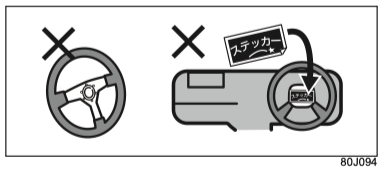{ .center-image }

#### Фронтальная подушка безопасности SRS переднего пассажира

!!! danger "Внимание"
    Если на переднем пассажирском сиденье сидит пассажир или ребёнок, соблюдайте следующие правила. При срабатывании подушки безопасности SRS сильный удар может привести к тяжёлой травме.

    - не кладите руки или ноги на место установки подушки безопасности SRS в панели приборов и не приближайте к нему лицо или грудь;
    - не ставьте ребёнка перед местом установки подушки безопасности SRS и не держите ребёнка на коленях. Перевозите детей на заднем сиденье и пристёгивайте их ремнём безопасности;
    - если ребёнок не может правильно пользоваться ремнём безопасности, используйте детское удерживающее устройство и перевозите ребёнка на заднем сиденье.

    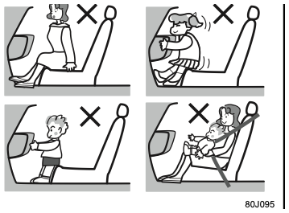{ .center-image }

    См. также:

    - [использование детского удерживающего устройства](02-safety.md#использование-детских-удерживающих-устройств);
    - [выбор детского удерживающего устройства](#выбор-детского-удерживающего-устройства).

    Не наклеивайте наклейки, не окрашивайте и не устанавливайте аксессуары вокруг места установки подушки безопасности SRS. Не устанавливайте в этой зоне ароматизаторы, устройства ETC, переносные навигаторы и другие предметы, а также не ставьте зонты.

    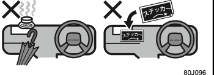{ .center-image }

    Не устанавливайте аксессуары на ветровое стекло или внутреннее зеркало, кроме оригинальных аксессуаров Suzuki.

#### Боковые подушки безопасности SRS и шторки безопасности SRS

!!! danger "Внимание"
    Если на передние сиденья устанавливаются чехлы, используйте специальные оригинальные чехлы Suzuki для автомобилей с боковыми подушками безопасности SRS и внимательно прочитайте инструкцию к чехлам. Если чехол установлен в неправильном положении или неправильной стороной, боковая подушка безопасности SRS может сработать неправильно, что может привести к тяжёлым травмам. Неоригинальные чехлы также могут нарушить работу боковых подушек безопасности SRS.

    Не устанавливайте возле дверей держатели стаканов, вешалки и другие аксессуары и не прислоняйте в этой зоне зонт. При срабатывании боковой подушки безопасности SRS или шторки безопасности SRS такие предметы могут отлететь или помешать раскрытию подушки, что может привести к тяжёлым травмам.

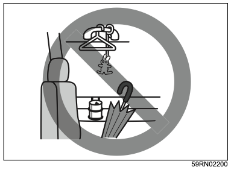{ .center-image }

### Работа системы подушек безопасности SRS

#### При срабатывании

- Подушки безопасности мгновенно наполняются горячим газом. В зависимости от обстоятельств аварии и позы пассажиров возможны ссадины, ушибы или ожоги.
- После раскрытия подушка безопасности сразу начинает сдуваться.

!!! danger "Внимание"
    После срабатывания подушки безопасности не прикасайтесь к её компонентам. Сразу после срабатывания они горячие, можно получить ожог.

!!! warning "Осторожно"
    При срабатывании подушки безопасности слышен громкий хлопок и выходит белый дымообразный газ, но это не пожар. На организм он не влияет.

    Если продукты срабатывания попали в глаза или на кожу, как можно скорее смойте их водой. У людей с чувствительной кожей возможно раздражение.

!!! danger "Внимание"
    Сработавшие преднатяжители и подушки безопасности SRS нельзя использовать повторно. Обратитесь к дилеру Suzuki или в авторизованный сервис Suzuki для замены.

#### Фронтальные подушки безопасности SRS водителя и переднего пассажира

##### Когда срабатывают

Фронтальные подушки безопасности SRS срабатывают в следующих случаях:

- автомобиль сталкивается лобовой частью с твёрдым препятствием, которое не деформируется и не смещается, например бетонной стеной, на скорости примерно 25 км/ч или выше;

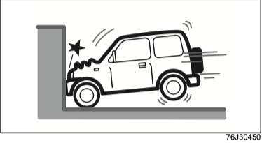{ .center-image }

- автомобиль получает удар спереди слева или справа в пределах примерно 30° от продольной оси, сопоставимый по силе с указанным выше фронтальным ударом.

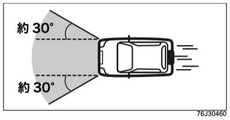{ .center-image }

##### Когда могут сработать

Фронтальные подушки безопасности SRS могут сработать, если нижняя часть кузова получит сильный удар.

- автомобиль столкнулся с бордюром, разделительной полосой и похожим препятствием;

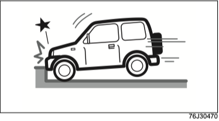{ .center-image }

- автомобиль упал в глубокую яму или канаву;

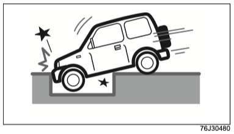{ .center-image }

- автомобиль подпрыгнул и ударился о землю или упал с дороги.

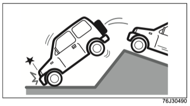{ .center-image }

##### Когда могут не сработать

Фронтальные подушки безопасности SRS могут не сработать, если объект столкновения легко деформируется или смещается, либо если деформируется зона удара самого автомобиля и сильного замедления не возникает.

Кроме того, при ударе под углом более примерно 30° от продольной оси автомобиля они во многих случаях не срабатывают.

- автомобиль столкнулся лобовой частью со стоящим автомобилем примерно такой же массы на скорости около 50 км/ч или ниже;

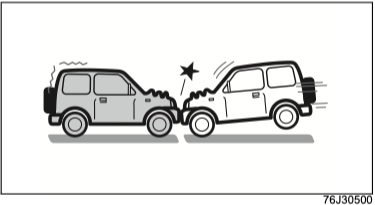{ .center-image }

- автомобиль заехал под грузовую платформу грузовика;

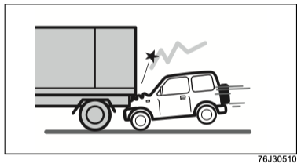{ .center-image }

- автомобиль столкнулся со столбом, деревом и похожим узким препятствием;

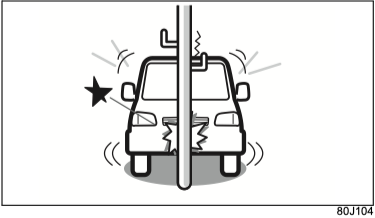{ .center-image }

- автомобиль столкнулся с бетонной стеной, ограждением и похожим препятствием под углом более примерно 30° от продольной оси;

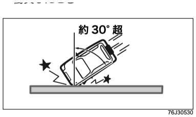{ .center-image }

- автомобиль столкнулся лобовой частью с твёрдой стеной, которая не деформируется и не смещается, но скорость столкновения была ниже примерно 25 км/ч.

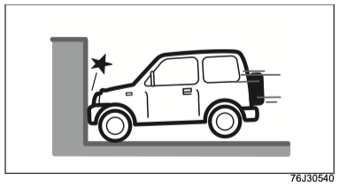{ .center-image }

##### Когда не срабатывают

При ударе сзади, боковом ударе или опрокидывании фронтальные подушки безопасности SRS не срабатывают. При очень сильном ударе они в редких случаях могут сработать.

- удар сзади;

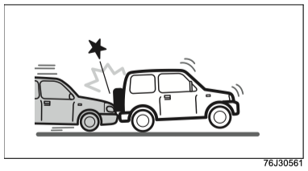{ .center-image }

- боковой удар;

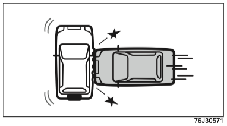{ .center-image }

- переворот или опрокидывание.

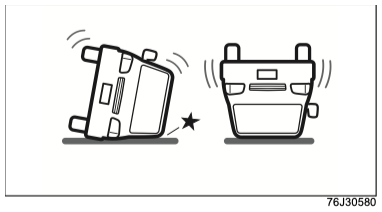{ .center-image }

#### Боковые подушки безопасности SRS и шторки безопасности SRS

##### Когда срабатывают

Боковые подушки безопасности SRS и шторки безопасности SRS срабатывают, если обычный легковой автомобиль ударяет автомобиль сбоку в зону салона на скорости примерно 30 км/ч или выше, либо если автомобиль получает сопоставимый или более сильный удар.

{ .center-image }

##### Когда могут сработать

Они могут сработать и при фронтальном столкновении, если боковая составляющая удара достаточно сильная.

Также они могут сработать, если нижняя часть автомобиля получает сильный удар.

- фронтальное столкновение;

{ .center-image }

- столкновение с бордюром или выступом на дороге;

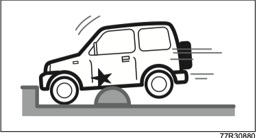{ .center-image }

- падение в глубокую яму или канаву;

{ .center-image }

- автомобиль подпрыгнул и ударился о землю или упал с дороги.

{ .center-image }

##### Когда могут не сработать

Боковые подушки безопасности SRS и шторки безопасности SRS могут не сработать в следующих случаях:

- боковой удар пришёлся не в зону салона, а, например, в моторный отсек или багажную часть;

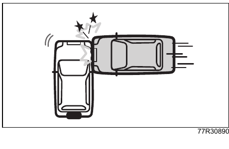{ .center-image }

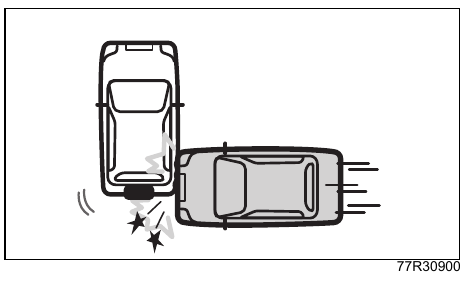{ .center-image }

- удар пришёлся сбоку под углом;

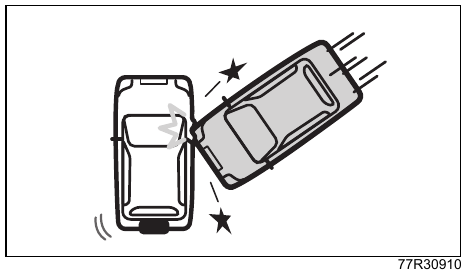{ .center-image }

- автомобиль получил боковой удар от автомобиля с высокой посадкой;

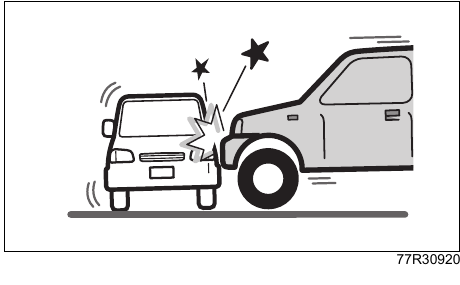{ .center-image }

- автомобиль получил боковой удар от мотоцикла;

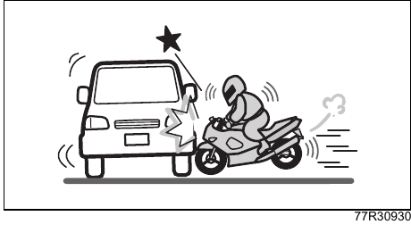{ .center-image }

- автомобиль столкнулся со столбом, деревом и похожим узким препятствием.

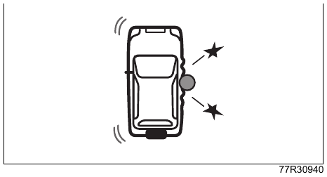{ .center-image }

##### Когда не срабатывают

Боковые подушки безопасности SRS и шторки безопасности SRS не срабатывают в следующих случаях:

- удар сзади;

{ .center-image }

- переворот или опрокидывание.

{ .center-image }

### Контрольная лампа подушек безопасности SRS

{ .center-image }

Контрольная лампа находится на панели приборов.

Она загорается при питании автомобиля в режиме `ON`, если сработали подушки безопасности SRS или преднатяжители ремней безопасности либо если в электронной системе управления обнаружена неисправность.

См. также: [предупреждающие лампы](01-quick-guide.md#предупреждающие-лампы).

### Утилизация и списание автомобиля

Подушки безопасности SRS, которые не сработали, перед утилизацией необходимо привести в действие по установленной процедуре.

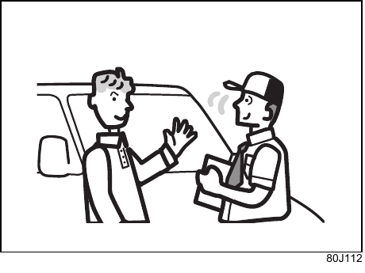{ .center-image }

!!! warning "Осторожно"
    Перед утилизацией подушек безопасности SRS или списанием автомобиля, оборудованного подушками безопасности SRS, обратитесь к дилеру Suzuki или в авторизованный сервис Suzuki. При неправильном обращении подушки безопасности SRS могут неожиданно раскрыться и причинить травму.

## Детские удерживающие устройства

### Выбор детского удерживающего устройства

Выбирайте детское удерживающее устройство после прочтения этого раздела, с учётом возраста и телосложения ребёнка.

- Также прочитайте раздел [если в автомобиле едет ребёнок](02-safety.md#если-перевозите-детей).
- Автомобиль оснащён креплениями ISOFIX для детских удерживающих устройств, соответствующими новым требованиям безопасности, действующим в Японии с 1 октября 2006 года: анкерами ISOFIX и верхними страховочными анкерами.

См. также: [крепление детского удерживающего устройства ISOFIX](#крепление-детского-удерживающего-устройства-isofix).

#### Сертификационные марки детских удерживающих устройств UN R44 и UN R129

На детских удерживающих устройствах, соответствующих стандартам UN R44 и UN R129 ([※1](#child-seat-cert-note-1)), указывается сертификационная маркировка примерно такого вида:

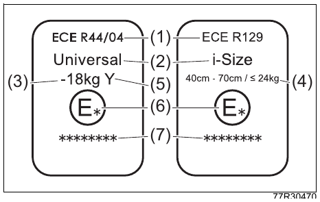{ .center-image }

| Обозначение | Расшифровка |
| --- | --- |
| (1) | Номер нормативного документа ([※2](#child-seat-cert-note-2)). |
| (2) | Категория детского удерживающего устройства ([※3](#child-seat-cert-note-3)). |
| (3) | Допустимый диапазон массы ребёнка. |
| (4) | Допустимый диапазон роста ребёнка и масса, при которой устройство можно использовать. |
| (5) | Характеристика устройства. |
| (6) | Код страны, выдавшей одобрение детского удерживающего устройства. |
| (7) | Номер одобрения детского удерживающего устройства. |

- На рисунке показан пример сертификационной маркировки.

**※1** UN R44 и UN R129: международные нормативы для детских удерживающих устройств.

**※2** На самой маркировке может быть указано `ECE`, но по содержанию это соответствует `UN`.

**※3** Надпись `Universal` означает одобрение универсальной категории.

!!! tip "Подсказка"
    Оригинальные детские удерживающие устройства Suzuki для этого автомобиля соответствуют стандартам UN R44 или UN R129.

#### Виды детских удерживающих устройств

Ниже приведены типичные виды детских удерживающих устройств.

##### Автолюлька

Это детское удерживающее устройство для младенца, которое устанавливается против хода движения или боком. Оно предназначено для детей, которые ещё не держат голову или не могут сидеть самостоятельно.

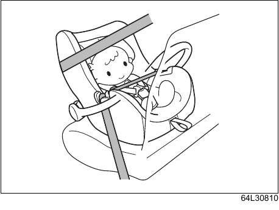{ .center-image }

##### Детское кресло

Это детское удерживающее устройство, которое устанавливается по ходу движения. Оно используется, если штатный ремень безопасности проходит у ребёнка по шее или подбородку либо не ложится на тазовые кости.

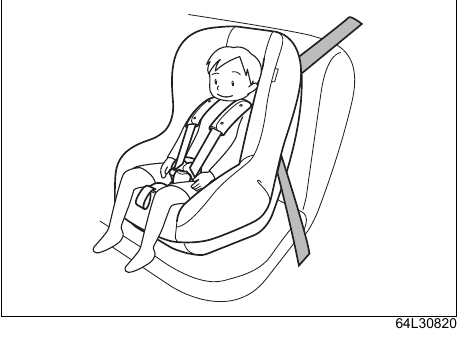{ .center-image }

##### Бустер

Это детское удерживающее устройство, которое устанавливается по ходу движения. Оно используется, если штатный ремень безопасности проходит у ребёнка по шее или подбородку либо не ложится на тазовые кости.

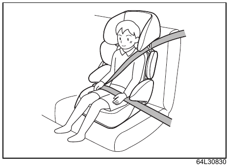{ .center-image }

#### Пригодность детских удерживающих устройств по местам

##### Общая пригодность по местам

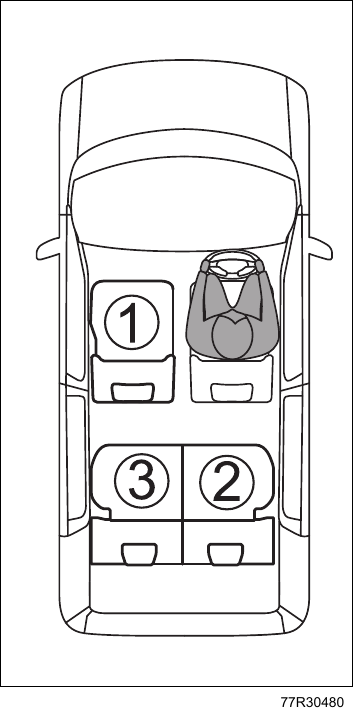{ .center-image }

| Номер места | Символы | Примечания |
| --- | --- | --- |
| 1 | { width="44" } 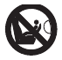{ width="44" } | [※1](#child-seat-position-note-1), [※2](#child-seat-position-note-2), [※3](#child-seat-position-note-3). |
| 2 | { width="44" } 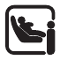{ width="44" } { width="44" } | [※2](#child-seat-position-note-2), [※3](#child-seat-position-note-3). |
| 3 | { width="44" } { width="44" } { width="44" } | [※2](#child-seat-position-note-2), [※3](#child-seat-position-note-3). |

Расшифровка символов:

| Символ | Значение |
| --- | --- |
| { width="48" } | Место подходит для детского удерживающего устройства универсальной категории, закрепляемого ремнём безопасности автомобиля. |
| { width="48" } | Место подходит для детских удерживающих устройств i-Size и ISOFIX. |
| { width="48" } | На месте предусмотрен верхний страховочный анкер. |
| { width="48" } | На сиденье, защищённом активной фронтальной подушкой безопасности, запрещено использовать автолюльку и другие детские удерживающие устройства, устанавливаемые против хода движения. |

Примечания:

**※1** Если детское удерживающее устройство всё же приходится установить на переднее пассажирское сиденье, сдвиньте сиденье в самое заднее положение.

**※2** При установке детского удерживающего устройства по ходу движения отрегулируйте угол наклона спинки так, чтобы между детским удерживающим устройством и спинкой было как можно меньше зазора. Если угол спинки на автомобиле не регулируется и между устройством и спинкой остаётся зазор, заполните его, например, подушкой.

**※3** Если подголовник мешает детскому удерживающему устройству, отрегулируйте высоту подголовника так, чтобы он не касался устройства, или снимите подголовник.

##### Подробная пригодность по местам

| Параметр | Место 1 | Место 2 | Место 3 |
| --- | --- | --- | --- |
| Подходит для универсального детского удерживающего устройства, закрепляемого ремнём безопасности | Да, только по ходу движения ([※1](#child-seat-detail-note-1)) | Да | Да |
| Подходит для детского удерживающего устройства i-Size | Нет | Да | Да |
| Подходит для переносной люльки боковой установки, шаблон `L1`/`L2` | Нет | `X` | `X` |
| Подходит для устройства против хода движения, шаблон `R1`/`R2X`/`R2`/`R3` | Нет | `R1`, `R2` ([※2](#child-seat-detail-note-2)) | `R1`, `R2` ([※2](#child-seat-detail-note-2)) |
| Подходит для устройства по ходу движения, шаблон `F2X`/`F2`/`F3` | Нет | `F2X`, `F2`, `F3` ([※2](#child-seat-detail-note-2)) | `F2X`, `F2`, `F3` ([※2](#child-seat-detail-note-2)) |
| Подходит для бустера, шаблон `B2`/`B3` | `B2`, `B3` | `B2`, `B3` | `B2`, `B3` |

**※1** На переднее пассажирское сиденье можно устанавливать только детское удерживающее устройство по ходу движения.

**※2** Для мест 2 и 3 при использовании шаблонов `R1`, `R2`, `F2X`, `F2` и `F3` поднимите подголовник в самое высокое положение.

Обозначения в таблице:

| Обозначение | Значение |
| --- | --- |
| Да | Детское удерживающее устройство можно установить. |
| Нет | Детское удерживающее устройство нельзя установить. |
| `X` | Место не подходит для установки детского удерживающего устройства ISOFIX, соответствующего этому шаблону. |

Детские удерживающие устройства ISOFIX делятся на несколько шаблонов и размерных классов. Устройство можно использовать на местах, указанных в таблице для соответствующего шаблона.

Чтобы определить размерный класс детского удерживающего устройства, прочитайте инструкцию к нему. Если у вашего устройства нет размерного класса или нужной информации нет в таблице, проверьте таблицу применимости по моделям автомобиля либо уточните совместимость у изготовителя или продавца устройства.

##### Размерные классы и шаблоны детских удерживающих устройств ISOFIX

Размерный класс - это классификационное обозначение, указанное на детском удерживающем устройстве. Соответствие размерных классов и шаблонов приведено ниже.

| Группа по массе ребёнка | Размерный класс | Шаблон | Описание |
| --- | --- | --- | --- |
| 0, до 10 кг | `F` | `L1` | Детское удерживающее устройство боковой установки влево, переносная люлька. |
| 0, до 10 кг | `G` | `L2` | Детское удерживающее устройство боковой установки вправо, переносная люлька. |
| 0, до 10 кг | `E` | `R1` | Детское удерживающее устройство для младенца, устанавливаемое против хода движения. |
| 0+, до 13 кг | `E` | `R1` | Детское удерживающее устройство для младенца, устанавливаемое против хода движения. |
| 0+, до 13 кг | `D` | `R2` | Компактное детское удерживающее устройство для маленького ребёнка, устанавливаемое против хода движения. |
| 0+, до 13 кг | - | `R2X` | Компактное детское удерживающее устройство для маленького ребёнка, устанавливаемое против хода движения; форма отличается от `R2`. |
| 0+, до 13 кг | `C` | `R3` | Крупное детское удерживающее устройство для маленького ребёнка, устанавливаемое против хода движения. |
| I, 9-18 кг | `D` | `R2` | Компактное детское удерживающее устройство для маленького ребёнка, устанавливаемое против хода движения. |
| I, 9-18 кг | - | `R2X` | Компактное детское удерживающее устройство для маленького ребёнка, устанавливаемое против хода движения; форма отличается от `R2`. |
| I, 9-18 кг | `C` | `R3` | Крупное детское удерживающее устройство для маленького ребёнка, устанавливаемое против хода движения. |
| I, 9-18 кг | `B` | `F2` | Низкое детское удерживающее устройство для маленького ребёнка, устанавливаемое по ходу движения. |
| I, 9-18 кг | `B1` | `F2X` | Низкое детское удерживающее устройство для маленького ребёнка, устанавливаемое по ходу движения; форма отличается от `F2`. |
| I, 9-18 кг | `A` | `F3` | Высокое детское удерживающее устройство для маленького ребёнка, устанавливаемое по ходу движения. |
| II, 15-25 кг | - | - | - |
| III, 22-36 кг | - | - | - |

Переносная люлька - это один из видов автолюльки: ребёнок перевозится лёжа, а устройство устанавливается боком. Подробности уточняйте у изготовителя или продавца детского удерживающего устройства.

##### Шаблоны для детских удерживающих устройств типа бустера

| Шаблон | Описание |
| --- | --- |
| `B2` | Бустер шириной 440 мм. |
| `B3` | Бустер шириной 520 мм. |

#### Рекомендуемые детские удерживающие устройства

Для автомобиля рекомендуется использовать оригинальные детские удерживающие устройства Suzuki. Подробности уточняйте у дилера Suzuki или в авторизованном сервисе Suzuki.

| Телосложение ребёнка | Направление установки | Рекомендуемое устройство | Место 1 | Место 2 | Место 3 |
| --- | --- | --- | --- | --- | --- |
| Рост до 100 см, масса до 18 кг | Против хода движения | Оригинальное детское кресло Suzuki i-Size | `×` | `○` | `○` |
| Рост 76-100 см, возраст от 15 месяцев, масса до 18 кг | По ходу движения | Оригинальное детское кресло Suzuki i-Size | `×` | `○` | `○` |
| Рост 100-150 см, масса 15-36 кг, возраст 3-12 лет | По ходу движения | Оригинальный бустер Suzuki | `×` | `○` | `○` |

### Крепление детского удерживающего устройства ремнём безопасности

- Выбирайте детское удерживающее устройство, подходящее ребёнку по возрасту и телосложению.

См. также: [выбор детского удерживающего устройства](#выбор-детского-удерживающего-устройства).

- При установке детского удерживающего устройства ISOFIX, приобретаемого отдельно, см. раздел [крепление детского удерживающего устройства ISOFIX](#крепление-детского-удерживающего-устройства-isofix).

!!! danger "Внимание"
    Не устанавливайте на переднее пассажирское сиденье автолюльку и другие детские удерживающие устройства, устанавливаемые против хода движения. При срабатывании фронтальной подушки безопасности SRS переднего пассажира сильный удар придётся по задней части детского удерживающего устройства, что может привести к смертельным или тяжёлым травмам ребёнка.

    Если детское кресло или бустер всё же приходится установить на переднее пассажирское сиденье, сдвиньте сиденье в самое заднее положение и устанавливайте устройство только по ходу движения.

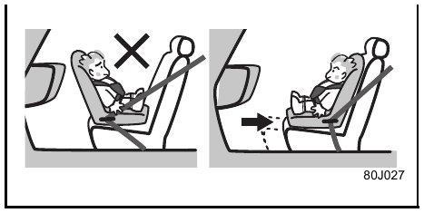{ .center-image }

#### Порядок крепления

!!! danger "Внимание"
    Если детское удерживающее устройство установлено неправильно, при аварии ребёнок или другие пассажиры могут получить тяжёлые травмы.

    Обязательно устанавливайте детское удерживающее устройство по этому руководству и по инструкции, приложенной к самому устройству.

В этом разделе описана установка детского удерживающего устройства на заднее сиденье. Если устанавливаете его на переднее пассажирское сиденье, дополнительно проверьте следующее:

- переднее пассажирское сиденье должно быть сдвинуто в самое заднее положение.

1. Отрегулируйте высоту подголовника (1) так, чтобы он не касался детского удерживающего устройства, или снимите подголовник.

    См. также: [регулировка высоты, снятие и установка подголовника](#подголовники-задних-сидений).

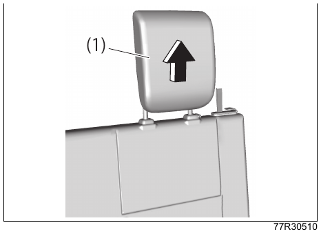{ .center-image }

!!! danger "Внимание"
    Если подголовник всё равно касается детского удерживающего устройства, снимите подголовник. Если детское удерживающее устройство упирается в подголовник, его нельзя надёжно закрепить, и при столкновении ребёнок может получить тяжёлые травмы.

    Если устанавливаете бустер без собственного подголовника, используйте его с установленным подголовником сиденья автомобиля. Иначе при столкновении ребёнок может получить тяжёлые травмы.

2. Отрегулируйте угол наклона спинки так, чтобы между детским удерживающим устройством и спинкой не было зазора.

!!! tip "Подсказка"
    Если угол спинки на автомобиле не регулируется и между детским удерживающим устройством и спинкой остаётся зазор, заполните его, например, подушкой.

3. Убедитесь, что сиденье надёжно зафиксировано.
4. При использовании заднего ремня безопасности снимите ремень с направляющей (2).

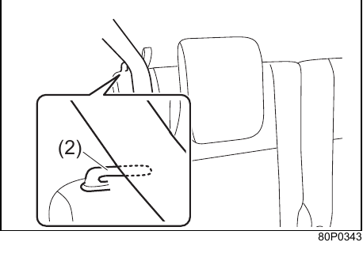{ .center-image }

5. Следуя инструкции к детскому удерживающему устройству, пропустите ремень безопасности через предусмотренные места.

    См. также: [пристёгивание заднего ремня безопасности](#задние-ремни-безопасности).

6. Вставьте язычок ремня (3) в замок (4) до щелчка.

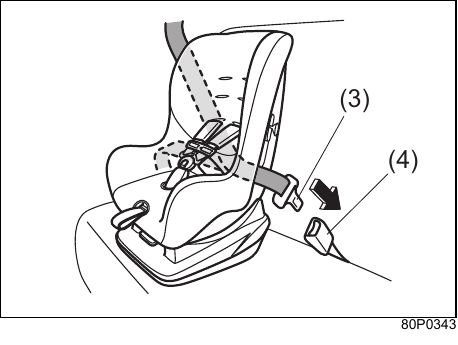{ .center-image }

На рисунке показан пример детского удерживающего устройства.

7. Следуя инструкции к детскому удерживающему устройству, убедитесь, что оно установлено правильно.

    Если установить устройство правильно не получается, обратитесь к продавцу, у которого оно было приобретено.

### Крепление детского удерживающего устройства ISOFIX

#### Крепления для детских удерживающих устройств ISOFIX и i-Size

Задние сиденья, левое и правое, оснащены креплениями для детских удерживающих устройств ISOFIX ([※1](#isofix-note-1)) или i-Size ([※2](#isofix-note-2)), соответствующих стандартам UN R44 или UN R129. Детские удерживающие устройства приобретаются отдельно.

- Металлические скобы между подушкой и спинкой сиденья - это анкеры ISOFIX.

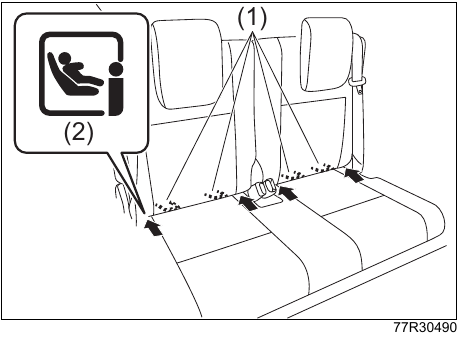{ .center-image }

| Обозначение | Расшифровка |
| --- | --- |
| (1) | Анкер ISOFIX. |
| (2) | Маркировка анкера ISOFIX. |

!!! tip "Подсказка"
    Рядом с анкерами ISOFIX находится маркировка, показанная на рисунке.

- Металлические скобы на задней стороне спинки - это верхние страховочные анкеры для детского удерживающего устройства.

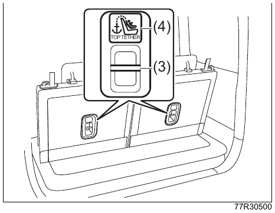{ .center-image }

| Обозначение | Расшифровка |
| --- | --- |
| (3) | Верхний страховочный анкер. |
| (4) | Маркировка верхнего страховочного анкера. |

!!! tip "Подсказка"
    Рядом с верхними страховочными анкерами находится маркировка, показанная на рисунке.

**※1** ISOFIX: международный стандарт ISO ([※3](#isofix-note-3)), который унифицирует размеры и способы крепления детских удерживающих устройств.

**※2** i-Size: стандарт безопасности для детских удерживающих устройств, рассчитанный на использование ISOFIX. Такие устройства имеют конструкцию, которая надёжно защищает голову и шею ребёнка. Группы определяются не по массе, как раньше, а по росту ребёнка.

**※3** ISO: сокращение от International Organization for Standardization, Международной организации по стандартизации.

- Выбирайте детское удерживающее устройство, подходящее ребёнку по возрасту и телосложению.

См. также: [выбор детского удерживающего устройства](#выбор-детского-удерживающего-устройства).

- Детское удерживающее устройство ISOFIX не нужно закреплять ремнём безопасности.
- Если устанавливаете детское удерживающее устройство, закрепляемое ремнём безопасности, см. раздел [крепление детского удерживающего устройства ремнём безопасности](#крепление-детского-удерживающего-устройства-ремнём-безопасности).

#### Порядок крепления

!!! danger "Внимание"
    Если детское удерживающее устройство установлено неправильно, при аварии ребёнок или другие пассажиры могут получить тяжёлые травмы. Обязательно устанавливайте детское удерживающее устройство по этому руководству и по инструкции, приложенной к самому устройству.

    Если ремень безопасности или другой предмет попадёт между креплением и детским удерживающим устройством, устройство может быть закреплено неправильно. При установке проверьте, что вокруг анкеров ISOFIX и верхних страховочных анкеров нет посторонних предметов и ремней безопасности.

    Не используйте анкеры ISOFIX и верхние страховочные анкеры для крепления багажа. Анкеры могут погнуться или повредиться, и детское удерживающее устройство не будет закрепляться как положено. При столкновении ребёнок может получить тяжёлые травмы.

#### Крепление к анкерам ISOFIX

1. Найдите анкеры ISOFIX (1).

    Они находятся в зазоре между подушкой и спинкой сиденья.

{ .center-image }

| Обозначение | Расшифровка |
| --- | --- |
| (1) | Анкер ISOFIX. |
| (2) | Маркировка анкера ISOFIX. |

!!! tip "Подсказка"
    Рядом с анкерами ISOFIX находится маркировка, показанная на рисунке.

2. Если задний подголовник (3) касается детского удерживающего устройства, отрегулируйте высоту подголовника или снимите его.

    См. также: [подголовники задних сидений](#подголовники-задних-сидений).

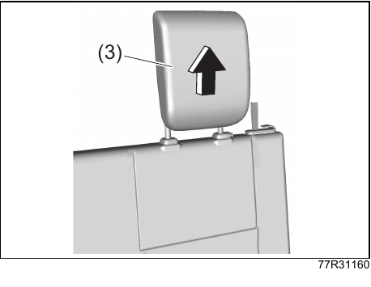{ .center-image }

!!! danger "Внимание"
    Если подголовник касается детского удерживающего устройства, устройство нельзя надёжно закрепить, и при столкновении ребёнок может получить тяжёлые травмы.

    При установке детского удерживающего устройства поднимите подголовник в самое высокое положение фиксации или снимите его.

    Если устанавливаете бустер без спинки, используйте его с установленным подголовником сиденья автомобиля. Иначе при столкновении ребёнок может получить тяжёлые травмы.

3. Отрегулируйте угол наклона спинки так, чтобы между детским удерживающим устройством и спинкой не было зазора.
4. Убедитесь, что сиденье надёжно зафиксировано.
5. Вставьте соединители детского удерживающего устройства (4) в анкеры ISOFIX (1).

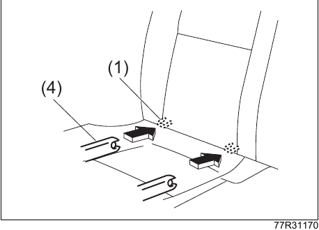{ .center-image }

| Обозначение | Расшифровка |
| --- | --- |
| (1) | Анкер ISOFIX. |
| (4) | Соединитель детского удерживающего устройства. |

6. Покачайте детское удерживающее устройство вперёд-назад и из стороны в сторону, чтобы убедиться, что оно надёжно закреплено.
7. Следуя инструкции к детскому удерживающему устройству, убедитесь, что оно установлено правильно.

    Если установить устройство правильно не получается, обратитесь к продавцу, у которого оно было приобретено.

#### Крепление к верхнему страховочному анкеру

1. Убедитесь, что детское удерживающее устройство надёжно закреплено на анкерах ISOFIX.

    См. также: [крепление к анкерам ISOFIX](#крепление-к-анкерам-isofix).

2. Присоедините верхний страховочный ремень к верхнему страховочному анкеру.

    Если подголовник установлен, пропустите верхний страховочный ремень (5) между поднятым подголовником и спинкой так, чтобы ремень не перекрутился.

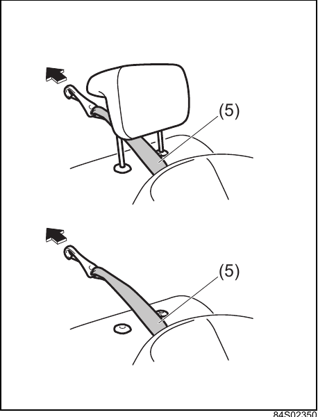{ .center-image }

Присоедините верхний страховочный ремень к верхнему страховочному анкеру (6) на задней стороне спинки.

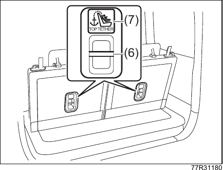{ .center-image }

| Обозначение | Расшифровка |
| --- | --- |
| (6) | Верхний страховочный анкер. |
| (7) | Маркировка верхнего страховочного анкера. |

!!! tip "Подсказка"
    Рядом с верхним страховочным анкером находится маркировка, показанная на рисунке.

3. Убедитесь, что верхний страховочный ремень не перекручен, не провисает и надёжно закреплён.
4. Следуя инструкции к детскому удерживающему устройству, убедитесь, что оно установлено правильно.

    Если установить устройство правильно не получается, обратитесь к продавцу, у которого оно было приобретено.

## Комбинация приборов

### Как читать показания приборов

На рисунке показан пример. В зависимости от типа автомобиля комбинация приборов может отличаться.

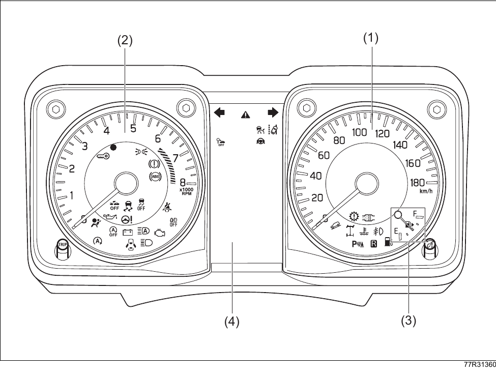{ .center-image }

| Обозначение | Расшифровка |
| --- | --- |
| (1) | Спидометр. |
| (2) | Тахометр. |
| (3) | Указатель уровня топлива. |
| (4) | Многофункциональный информационный дисплей. |

См. также: [многофункциональный информационный дисплей](#многофункциональный-информационный-дисплей).

#### Спидометр

Показывает скорость движения в км/ч.

#### Тахометр

Показывает частоту вращения двигателя в оборотах в минуту.

!!! info "Примечание"
    Чтобы защитить двигатель, не допускайте захода стрелки в красную зону ([※](#tachometer-red-zone-note)).

    ※ Красная зона показывает диапазон, превышающий допустимые обороты двигателя.

    При переключении на пониженную передачу обороты двигателя повышаются. Будьте особенно внимательны.

#### Указатель уровня топлива

Когда питание автомобиля находится в режиме `ON`, указатель показывает примерный остаток топлива.

- Если загорелась контрольная лампа низкого уровня топлива, как можно скорее заправьте автомобиль.

См. также: [контрольные лампы и индикаторы](#контрольные-лампы-и-индикаторы).

!!! tip "Подсказка"
    После заправки и перевода питания в режим `ON` указателю может потребоваться некоторое время, чтобы показать правильный уровень.

    На уклонах и в поворотах показания могут меняться из-за перемещения топлива в баке.

    Стрелка рядом с символом заправки показывает, что лючок топливного бака находится сзади со стороны водителя.

#### Регулировка яркости

Подсветка приборов включается при переводе питания автомобиля в режим `ON` и выключается при переводе в режим `ACC` или `LOCK` (`OFF`).

##### Настройка яркости

Когда питание автомобиля находится в режиме `ON`, поверните рукоятку переключателя освещения в положение фар, габаритных огней или `AUTO`. После этого поверните ручку переключения отображения (1) справа от комбинации приборов влево или вправо, чтобы открыть экран регулировки яркости.

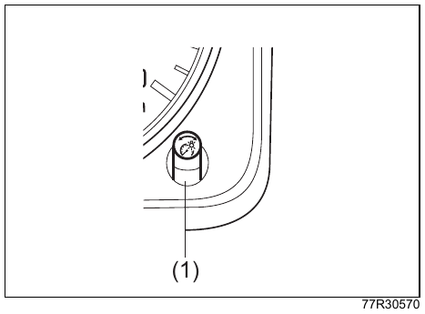{ .center-image }

Поверните ручку переключения отображения влево или вправо и установите нужную яркость. Яркость приборов регулируется по 7 уровням.

- Чтобы регулировать яркость непрерывно, удерживайте ручку повернутой.
- Подсветка переключателей кондиционера регулируется одновременно.

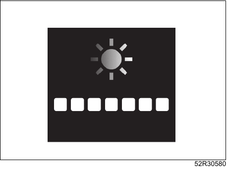{ .center-image }

!!! danger "Внимание"
    Не переключайте отображение во время движения. Можно отвлечься от управления, что может привести к неожиданной аварии.

!!! tip "Подсказка"
    Если во время регулировки некоторое время не выполнять действий, экран вернётся к прежнему отображению.

    Если отсоединить свинцово-кислотный аккумулятор, сохранённая настройка сбросится, и яркость нужно будет настроить заново.

    На автомобилях с аудиосистемой заводской опции при установке максимальной яркости приборов экран аудиосистемы переходит в дневной режим, то есть в яркое оформление.

#### Информационный переключатель

!!! tip "Оборудование по типу автомобиля"
    Комплектация зависит от типа автомобиля.

Информационный переключатель (1) используется для переключения отображения в комбинации приборов.

- Им можно пользоваться на стоящем автомобиле, когда питание находится в режиме `ON`.

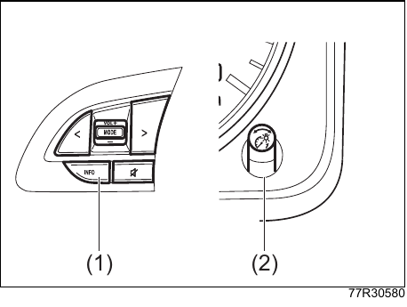{ .center-image }

| Обозначение | Расшифровка |
| --- | --- |
| (1) | Информационный переключатель. |
| (2) | Ручка переключения отображения. |

##### Переход в режим настроек

См. также: [режим настроек](08-service-data.md#режим-настроек).

### Контрольные лампы и индикаторы

О расположении указанных ниже контрольных ламп и индикаторов в комбинации приборов см. раздел [предупреждающие лампы](01-quick-guide.md#предупреждающие-лампы).

#### Контрольные лампы

##### Контрольная лампа тормозной системы (красная)

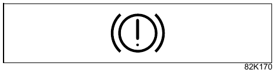{ .center-image }

Когда выключатель двигателя находится в положении `ON`, лампа загорается в следующих случаях:

- уровень тормозной жидкости недостаточен;
- включён стояночный тормоз;
- в тормозной системе есть неисправность.

Если система исправна и стояночный тормоз полностью отпущен, при переводе выключателя двигателя в положение `ON` лампа загорается примерно на 2 секунды, затем гаснет.

Если во время движения лампа кратковременно загорелась, затем погасла и больше не загорается, это не является неисправностью.

!!! danger "Внимание"
    В следующих случаях немедленно остановитесь в безопасном месте и обратитесь к дилеру Suzuki или в авторизованный сервис Suzuki:

    - лампа не гаснет после полного отпускания стояночного тормоза или загорается во время движения. Тормоза могут работать хуже обычного. Нажимайте педаль тормоза сильнее и остановите автомобиль;
    - контрольная лампа тормозной системы и контрольная лампа ABS одновременно продолжают гореть. При сильном нажатии на педаль тормоза автомобиль может стать неустойчивым. Крепко держите рулевое колесо, нажимайте педаль тормоза осторожно, постепенно снижайте скорость и остановитесь.

    Следите, чтобы стояночный тормоз был полностью отпущен. Если ехать с включённым стояночным тормозом, тормозные механизмы могут перегреться, и тормоза могут перестать работать. Кроме того, в салоне будет продолжать звучать зуммер.

    См. также: [предупреждающий зуммер неотпущенного стояночного тормоза](04-driving.md#зуммер-предупреждения-о-неотпущенном-стояночном-тормозе).

##### Контрольная лампа передних ремней безопасности

!!! tip "Оборудование по типу автомобиля"
    Для сиденья переднего пассажира комплектация зависит от типа автомобиля.

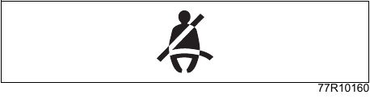{ .center-image }

Если водитель или пассажир переднего сиденья не пристёгнут ремнём безопасности, при положении выключателя двигателя `ON` лампа горит.

После запуска двигателя и начала движения, когда скорость впервые достигает примерно 15 км/ч, если водитель или пассажир переднего сиденья не пристёгнут ремнём безопасности, прерывисто звучит предупреждающий зуммер, а лампа переходит из постоянного горения в мигание.

- Если после пристёгивания ремня лампа продолжает гореть или мигать, возможна неисправность системы. Обратитесь для проверки к дилеру Suzuki или в авторизованный сервис Suzuki.
- Не проливайте воду, напитки и другие жидкости на сиденье.

См. также: [если пролили напиток или другую жидкость](02-safety.md#если-пролили-напиток-или-другую-жидкость).

!!! tip "Подсказка"
    После пристёгивания ремня лампа гаснет. Если в это время звучит предупреждающий зуммер, он также прекращается.

    Даже если ремень не пристёгнут, предупреждающий зуммер прекращается примерно через 95 секунд. При этом лампа после мигания остаётся гореть постоянно и не гаснет, пока выключатель двигателя не будет переведён в положение `ACC` или `LOCK` (`OFF`).

    Если на сиденье переднего пассажира лежит багаж, датчик может определить его массу, и лампа начнёт мигать, а предупреждающий зуммер начнёт звучать даже без пассажира.

    Лампа общая для стороны водителя и стороны переднего пассажира.

##### Контрольная лампа задних ремней безопасности

!!! tip "Оборудование по типу автомобиля"
    Комплектация зависит от типа автомобиля.

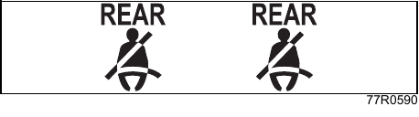{ .center-image }

Если пассажир на заднем сиденье не пристёгнут ремнём безопасности, при положении выключателя двигателя `ON` лампа горит.

После запуска двигателя и начала движения, когда скорость впервые достигает примерно 15 км/ч, если пассажир на заднем сиденье не пристёгнут ремнём безопасности, прерывисто звучит предупреждающий зуммер, а лампа переходит из постоянного горения в мигание.

- Если после пристёгивания ремня лампа продолжает гореть или мигать, возможна неисправность системы. Обратитесь для проверки к дилеру Suzuki или в авторизованный сервис Suzuki.
- Не проливайте воду, напитки и другие жидкости на сиденье.

См. также: [если пролили напиток или другую жидкость](02-safety.md#если-пролили-напиток-или-другую-жидкость).

!!! tip "Подсказка"
    Контрольная лампа задних ремней безопасности находится над внутрисалонным зеркалом.

    После пристёгивания ремня лампа гаснет. Если в это время звучит предупреждающий зуммер, он также прекращается.

    Даже если ремень не пристёгнут, предупреждающий зуммер прекращается примерно через 95 секунд. При этом лампа после мигания остаётся гореть постоянно и не гаснет, пока выключатель двигателя не будет переведён в положение `ACC` или `LOCK` (`OFF`).

    Если на заднем сиденье лежит багаж, датчик может определить его массу, и лампа начнёт мигать, а предупреждающий зуммер начнёт звучать даже без пассажира.

##### Контрольная лампа подушек безопасности SRS

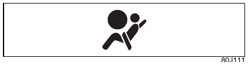{ .center-image }

При переводе выключателя двигателя в положение `ON` лампа загорается в следующих случаях:

- сработали подушки безопасности SRS или преднатяжители ремней безопасности;
- в электронной системе управления подушками безопасности SRS или преднатяжителями ремней безопасности есть неисправность.

Если система исправна, при переводе выключателя двигателя в положение `ON` лампа загорается примерно на 6 секунд, затем гаснет.

!!! danger "Внимание"
    В следующих случаях немедленно прекратите эксплуатацию автомобиля и обратитесь к дилеру Suzuki или в авторизованный сервис Suzuki. При столкновении подушки безопасности SRS или преднатяжители ремней безопасности могут не сработать нормально, что может привести к тяжёлым травмам.

    - лампа не загорается при переводе выключателя двигателя в положение `ON`;
    - лампа не гаснет примерно через 6 секунд после перевода выключателя двигателя в положение `ON`;
    - лампа загорается во время движения.

##### Контрольная лампа низкого уровня топлива

{ .center-image }

Когда остаток топлива становится малым, при положении выключателя двигателя `ON` загорается контрольная лампа. Как можно скорее заправьте автомобиль.

- При включении лампы предупреждающий зуммер подаёт один сигнал. Если после этого не заправить автомобиль, зуммер будет звучать при каждом переводе выключателя двигателя в положение `ON`.
- Если в системе есть неисправность, при положении выключателя двигателя `ON` лампа мигает. Обратитесь для проверки к дилеру Suzuki или в авторизованный сервис Suzuki.

См. также: [указатель уровня топлива](#указатель-уровня-топлива).

!!! tip "Подсказка"
    После заправки и перевода выключателя двигателя в положение `ON` указателю может потребоваться некоторое время, чтобы показать правильный уровень топлива.

    На уклонах и в поворотах лампа может загореться раньше из-за перемещения топлива в баке.

    В зависимости от характера движения лампа может периодически загораться и гаснуть.

##### Контрольная лампа ABS

{ .center-image }

Если в электронной системе управления ABS (антиблокировочной системой тормозов) есть неисправность, при положении выключателя двигателя `ON` загорается контрольная лампа. Пока лампа горит, ABS не работает. Обратитесь для проверки к дилеру Suzuki или в авторизованный сервис Suzuki.

- Если система исправна, при переводе выключателя двигателя в положение `ON` лампа загорается примерно на 2 секунды, затем гаснет.

!!! danger "Внимание"
    Если контрольная лампа ABS и контрольная лампа тормозной системы одновременно продолжают гореть, немедленно остановитесь в безопасном месте и обратитесь к дилеру Suzuki или в авторизованный сервис Suzuki.

    При сильном нажатии на педаль тормоза автомобиль может стать неустойчивым. Крепко держите рулевое колесо, нажимайте педаль тормоза осторожно, постепенно снижайте скорость и остановитесь.

!!! tip "Подсказка"
    Пока лампа горит, ABS не работает, но обычное торможение остаётся доступным.

##### Контрольная лампа двигателя

{ .center-image }

- Если в электронной системе управления двигателем есть неисправность, лампа загорается при работающем двигателе.
- Если система обнаруживает пропуски воспламенения в двигателе, лампа загорается или мигает при работающем двигателе.
- Если система исправна, при переводе выключателя двигателя в положение `ON` лампа загорается, а после запуска двигателя гаснет.
- Если лампа загорается или мигает при работающем двигателе, обратитесь для проверки к дилеру Suzuki или в авторизованный сервис Suzuki.

!!! danger "Внимание"
    Если лампа мигает, как можно скорее остановитесь и заглушите двигатель. Есть риск оплавления каталитического нейтрализатора, поэтому соблюдайте следующие меры:

    - остановитесь в безопасном месте, где нет сухой травы и других легковоспламеняющихся материалов;
    - если движение необходимо продолжить, двигайтесь с малой скоростью и не нажимайте резко на педаль акселератора.

##### Контрольная лампа электроусилителя рулевого управления

{ .center-image }

Если в системе электроусилителя рулевого управления есть неисправность, лампа загорается при работающем двигателе. Обратитесь для проверки к дилеру Suzuki или в авторизованный сервис Suzuki.

- Если система исправна, при переводе выключателя двигателя в положение `ON` лампа загорается, а после запуска двигателя гаснет.

!!! warning "Осторожно"
    При неисправности электроусилителя рулевого управления его функция отключается, и рулевое колесо становится тяжелее. Управлять автомобилем можно, прикладывая большее усилие, но как можно скорее обратитесь для проверки к дилеру Suzuki или в авторизованный сервис Suzuki.

!!! tip "Подсказка"
    При парковке или во время стоянки, если многократно поворачивать рулевое колесо либо долго удерживать его в крайнем положении, усилие на руле может постепенно увеличиться. Это защитная функция от перегрева, а не неисправность. Если некоторое время не поворачивать рулевое колесо, температура системы снизится и усилие вернётся к норме. Однако повторение таких действий может привести к неисправности.

    При быстром повороте рулевого колеса около рулевого колеса может быть слышен звук трения. Это не является неисправностью.

##### Контрольная лампа давления масла

{ .center-image }

Лампа загорается при работающем двигателе, если давление моторного масла, смазывающего внутренние детали двигателя, снижается.

- Если система исправна, при переводе выключателя двигателя в положение `ON` лампа загорается, а после запуска двигателя гаснет.
- Уровень моторного масла проверяйте масляным щупом. Порядок проверки см. в сервисной книжке.
- Если лампа загорается при работающем двигателе, немедленно остановитесь в безопасном месте, заглушите двигатель и обратитесь к дилеру Suzuki или в авторизованный сервис Suzuki.

!!! info "Примечание"
    Не продолжайте движение с горящей лампой. Это может привести к повреждению двигателя.

##### Контрольная лампа зарядки

{ .center-image }

Если в системе зарядки есть неисправность, лампа загорается при работающем двигателе.

- Если система исправна, при переводе выключателя двигателя в положение `ON` лампа загорается, а после запуска двигателя гаснет.
- Если лампа загорается при работающем двигателе, возможен обрыв ремня или другая неисправность. Немедленно остановитесь в безопасном месте, заглушите двигатель для защиты аккумулятора и обратитесь к дилеру Suzuki или в авторизованный сервис Suzuki.

##### Контрольная лампа трансмиссии

!!! tip "Оборудование по типу автомобиля"
    Автомобили с автоматической коробкой передач.

{ .center-image }

Если в системе автоматической коробки передач есть неисправность, при положении выключателя двигателя `ON` загорается контрольная лампа. Если лампа продолжает гореть или мигать, спокойно остановитесь в безопасном месте и обратитесь к дилеру Suzuki или в авторизованный сервис Suzuki.

Если после погасания лампа снова загорелась или начала мигать, обратитесь для проверки к дилеру Suzuki или в авторизованный сервис Suzuki.

- Если система исправна, при переводе выключателя двигателя в положение `ON` лампа загорается примерно на 2 секунды, затем гаснет.

##### Контрольная лампа иммобилайзера

{ .center-image }

Если в электронной системе управления кузовом есть неисправность, при положении выключателя двигателя `ON` эта лампа может загореться. Обратитесь для проверки к дилеру Suzuki или в авторизованный сервис Suzuki.

См. также: [система иммобилайзера](04-driving.md#система-иммобилайзера).

- Когда эта лампа загорается, возможна неисправность электронной системы управления кузовом или низкое напряжение свинцово-кислотной аккумуляторной батареи. Если лампа загорается даже при нормальном напряжении аккумулятора, обратитесь для проверки к дилеру Suzuki или в авторизованный сервис Suzuki.

##### Контрольная лампа открытой двери или капота

{ .center-image }

Лампа загорается, если какая-либо дверь или капот закрыты не полностью.

- Если лампа остаётся гореть, при каждом начале движения будет звучать предупреждающий зуммер с длинными прерывистыми сигналами и голосовое сообщение.

!!! danger "Внимание"
    Не продолжайте движение с горящей лампой. Если дверь или капот закрыты не полностью, во время движения они могут открыться и привести к неожиданной аварии.

!!! tip "Подсказка"
    Для защиты свинцово-кислотной аккумуляторной батареи контрольная лампа открытой двери или капота автоматически гаснет, если выполнены все условия ниже. Это функция энергосбережения аккумулятора.

    - выключатель двигателя находится в положении `LOCK` (`OFF`);
    - с момента включения лампы прошло 15 минут.

##### Главная предупреждающая лампа

{ .center-image }

Если на многофункциональном информационном дисплее комбинации приборов есть сообщение, эта лампа может мигать одновременно с ним.

См. также: [если звучит предупреждающий зуммер](01-quick-guide.md#предупреждающий-зуммер).

См. также: [сообщения многофункционального информационного дисплея](#сообщения-многофункционального-информационного-дисплея).

- Если система исправна, при переводе выключателя двигателя в положение `ON` лампа загорается примерно на 2 секунды, затем гаснет.

##### Контрольная лампа системы автоматического дальнего света

{ .center-image }

Если в системе автоматического дальнего света есть неисправность, при положении выключателя двигателя `ON` лампа загорается жёлтым. Обратитесь для проверки к дилеру Suzuki или в авторизованный сервис Suzuki.

- Когда системы помощи водителю Suzuki Safety Support временно приостановлены, эта лампа загорается одновременно с другими предупреждающими лампами. При этом мигает главная предупреждающая лампа.

См. также: [временная остановка и неисправность передней камеры, переднего радара и ультразвуковых датчиков](04-driving.md#временная-остановка-или-неисправность-передней-камеры-переднего-радара-и-ультразвуковых-датчиков).

Если система исправна, при переводе выключателя двигателя в положение `ON` лампа загорается на несколько секунд, затем гаснет.

##### Контрольная лампа температуры охлаждающей жидкости (красная)

{ .center-image }

При работающем двигателе, если температура охлаждающей жидкости двигателя повышается, лампа мигает красным. Если температура охлаждающей жидкости становится чрезмерно высокой, лампа горит красным постоянно.

- Если система исправна, при переводе выключателя двигателя в положение `ON` лампа горит красным примерно 2 секунды, затем гаснет ([※](#coolant-temperature-warning-note)).

※ Если температура охлаждающей жидкости двигателя низкая, после красной индикации лампа загорается синим.

- Если лампа мигает или горит красным, возможен перегрев. Немедленно остановитесь в безопасном месте.

См. также: [если двигатель перегрелся](07-emergency.md#если-двигатель-перегрелся).

##### Контрольная лампа бензинового сажевого фильтра GPF

!!! tip "Оборудование по типу автомобиля"
    Комплектация зависит от типа автомобиля.

{ .center-image }

Лампа загорается, когда в бензиновом сажевом фильтре GPF ([※](#gpf-note)) накопилось определённое количество сажи. Чтобы лампа погасла, необходимо продолжать движение до завершения выжигания и удаления сажи, накопившейся в GPF.

※ GPF: Gasoline Particulate Filter, бензиновый сажевый фильтр.

См. также: [бензиновый сажевый фильтр GPF](04-driving.md#бензиновый-сажевый-фильтр-gpf).

#### Индикаторы

##### Индикатор указателей поворота

{ .center-image }

- Индикатор мигает при включении указателей поворота или аварийной световой сигнализации.
- Если мигание стало необычно быстрым, возможен перегоревший фонарь указателя поворота или аварийной световой сигнализации.

См. также: [замена ламп](07-emergency.md#при-замене-лампы).

##### Индикатор дальнего света фар

{ .center-image }

Индикатор горит, когда фары включены в режиме дальнего света.

##### Индикатор включённого наружного освещения

{ .center-image }

Индикатор горит, пока включены фары или габаритные огни.

##### Индикатор 4WD

{ .center-image }

- Индикатор горит, когда выбран режим привода `4H` или `4L`.
- При переводе выключателя двигателя в положение `ON` индикатор загорается примерно на 2 секунды, затем загорается или гаснет в зависимости от выбранного режима привода. Если режим привода переключали при остановленном двигателе или при выключателе двигателя в положении `LOCK` (`OFF`), либо двигатель был остановлен во время переключения режима привода, после запуска двигателя и завершения переключения индикатор загорится или погаснет.
- Если индикатор 4WD продолжает мигать, возможна неисправность системы. В этом случае переключить режим привода нельзя, и сохраняется текущий режим привода. Обратитесь для проверки к дилеру Suzuki или в авторизованный сервис Suzuki.

См. также: [рычаг раздаточной коробки и индикаторы](04-driving.md#работа-рычага-раздаточной-коробки-и-индикатор).

##### Индикатор работы ESP

{ .center-image }

- Индикатор часто мигает, когда работает противобуксовочная система или система стабилизации.
- Индикатор горит, если в системе ESP есть неисправность.
- Если система исправна, при переводе выключателя двигателя в положение `ON` индикатор загорается примерно на 2 секунды, затем гаснет.

См. также: [система ESP](04-driving.md#esp).

- Если режим привода `2H` или `4H`, ESP отключена выключателем `ESP OFF`, и скорость автомобиля превысила 30 км/ч, ESP автоматически возвращается в рабочее состояние.
- При переключении рычага раздаточной коробки из `4H` в `4L` загорается индикатор `ESP OFF`.

##### Индикатор ESP OFF

{ .center-image }

- Индикатор загорается при длительном нажатии выключателя `ESP OFF`.
- Если система исправна, при переводе выключателя двигателя в положение `ON` индикатор загорается примерно на 2 секунды, затем гаснет.

См. также: [система ESP](04-driving.md#esp).

##### Индикатор низкой температуры охлаждающей жидкости (синий)

{ .center-image }

Когда выключатель двигателя находится в положении `ON`, индикатор горит синим, если температура охлаждающей жидкости двигателя низкая. После прогрева двигателя индикатор гаснет.

Если после достаточного прогрева индикатор продолжает гореть синим, возможна неисправность датчика. Если индикатор мигает синим, возможна неисправность системы. Обратитесь для проверки к дилеру Suzuki или в авторизованный сервис Suzuki.

##### Индикатор отключения системы поддержки торможения с двумя датчиками DSBS II

{ .center-image }

- Индикатор загорается при длительном нажатии выключателя отключения системы поддержки торможения с двумя датчиками DSBS II.

См. также: [выключатель отключения системы поддержки торможения с двумя датчиками DSBS II](04-driving.md#выключатель-off-системы-поддержки-торможения-с-двумя-датчиками-dsbs-ii).

- Индикатор загорается, когда система переднего радара, передней камеры или ультразвуковых датчиков временно приостановлена.

См. также: [временная остановка и неисправность передней камеры, переднего радара и ультразвуковых датчиков](04-driving.md#временная-остановка-или-неисправность-передней-камеры-переднего-радара-и-ультразвуковых-датчиков).

- При переключении рычага раздаточной коробки в положение `4L` загорается индикатор отключения системы поддержки торможения с двумя датчиками DSBS II.

См. также: [рычаг раздаточной коробки и индикаторы](04-driving.md#работа-рычага-раздаточной-коробки-и-индикатор).

- Если система исправна, при переводе выключателя двигателя в положение `ON` индикатор загорается на несколько секунд, затем гаснет.
- Если в одной из перечисленных ниже электронных систем управления есть неисправность, при положении выключателя двигателя `ON` индикатор загорается. Обратитесь для проверки к дилеру Suzuki или в авторизованный сервис Suzuki:
    - система поддержки торможения с двумя датчиками DSBS II;
    - функция предотвращения ошибочного начала движения (оборудование по типу автомобиля);
    - помощь при торможении при движении вперёд на малой скорости;
    - помощь при торможении при движении назад;
    - функция предотвращения ошибочного начала движения назад (оборудование по типу автомобиля).

См. также: [система поддержки торможения с двумя датчиками DSBS II](04-driving.md#система-поддержки-торможения-с-двумя-датчиками-dsbs-ii), [предотвращение ошибочного начала движения](04-driving.md#предотвращение-ошибочного-начала-движения), [система помощи при торможении на малой скорости](04-driving.md#поддержка-торможения-на-малой-скорости-при-движении-вперёд-и-назад), [предотвращение ошибочного начала движения назад](04-driving.md#предотвращение-ошибочного-начала-движения-назад).

##### Индикатор работы функции предотвращения схода с полосы

{ .center-image }

Индикатор горит или мигает во время работы предупреждения о сходе с полосы или функции предотвращения схода с полосы. Цвет и режим индикации меняются в зависимости от состояния системы.

- Когда работает функция предотвращения схода с полосы, индикатор горит зелёным.
- Когда работает предупреждение о сходе с полосы, индикатор мигает жёлтым.
- Если в одной из перечисленных ниже систем есть неисправность, индикатор горит жёлтым. Обратитесь для проверки к дилеру Suzuki или в авторизованный сервис Suzuki:
    - предупреждение о сходе с полосы;
    - функция предотвращения схода с полосы;
    - предупреждение о вилянии автомобиля.

См. также: [предупреждение о сходе с полосы](04-driving.md#предупреждение-о-сходе-с-полосы), [функция предотвращения схода с полосы](04-driving.md#предотвращение-схода-с-полосы), [предупреждение о вилянии автомобиля](04-driving.md#предупреждение-о-вилянии).

- Если система исправна, при переводе выключателя двигателя в положение `ON` индикатор загорается жёлтым на несколько секунд, затем гаснет.

##### Индикатор отключения предотвращения схода с полосы

{ .center-image }

- Индикатор загорается при длительном нажатии выключателя `OFF` функции предотвращения схода с полосы.

См. также: [выключатель OFF функции предотвращения схода с полосы](04-driving.md#выключатель-off-предотвращения-схода-с-полосы).

- Если система исправна и функция предотвращения схода с полосы отключена, при переводе выключателя двигателя в положение `ON` индикатор продолжает гореть жёлтым.

##### Индикатор работы автоматического подруливания

{ .center-image }

Индикатор горит, когда работает функция предотвращения схода с полосы. Цвет и режим индикации меняются в зависимости от состояния системы.

- Когда работает функция предотвращения схода с полосы, индикатор горит зелёным.

См. также: [функция предотвращения схода с полосы](04-driving.md#предотвращение-схода-с-полосы).

- Если система исправна, при переводе выключателя двигателя в положение `ON` индикатор горит белым несколько секунд, затем гаснет.

##### Индикатор отключения распознавания дорожных знаков

{ .center-image }

- Если в системе есть неисправность, при положении выключателя двигателя `ON` индикатор загорается. Обратитесь для проверки к дилеру Suzuki или в авторизованный сервис Suzuki.
- Если система исправна, при переводе выключателя двигателя в положение `ON` индикатор загорается на несколько секунд, затем гаснет.

##### Индикатор адаптивного круиз-контроля

{ .center-image }

Цвет и состояние индикатора меняются в зависимости от состояния системы.

- Когда система находится в режиме ожидания, индикатор горит белым.
- Когда система работает, индикатор горит зелёным.
- Если в системе есть неисправность, индикатор горит жёлтым. Обратитесь для проверки к дилеру Suzuki или в авторизованный сервис Suzuki.

См. также: [адаптивный круиз-контроль](04-driving.md#адаптивный-круиз-контроль), [адаптивный круиз-контроль с функцией следования во всём диапазоне скоростей](04-driving.md#адаптивный-круиз-контроль-с-функцией-следования-во-всём-диапазоне-скоростей).

##### Индикатор передних противотуманных фар

!!! tip "Оборудование по типу автомобиля"
    Комплектация зависит от типа автомобиля.

{ .center-image }

Индикатор горит, пока включены передние противотуманные фары.

##### Индикатор отключения повышающей передачи O/D

!!! tip "Оборудование по типу автомобиля"
    Автомобили с автоматической коробкой передач.

{ .center-image }

Индикатор отображается, когда выключатель повышающей передачи `O/D` находится в положении `OFF`.

См. также: [выключатель повышающей передачи O/D](04-driving.md#выключатель-повышающей-передачи-od).

##### Индикатор охранной сигнализации

{ .center-image }

- Если запереть двери наружной кнопкой или системой дистанционного управления, индикатор начинает часто мигать, и примерно через 20 секунд охранная сигнализация становится на охрану.
- Если во время стоянки сработала охранная сигнализация, при переводе выключателя двигателя в положение `ON` индикатор часто мигает примерно 8 секунд.

См. также: [охранная сигнализация](#охранная-сигнализация).

- Если в электронной системе управления кузовом есть неисправность, при положении выключателя двигателя `ON` индикатор мигает с интервалом 1 секунда примерно 15 секунд. Обратитесь для проверки к дилеру Suzuki или в авторизованный сервис Suzuki.

##### Индикатор работы системы автоматического дальнего света

{ .center-image }

Индикатор горит зелёным, когда работает система автоматического дальнего света.

##### Индикатор системы помощи при спуске

{ .center-image }

- При положении выключателя двигателя `ON`, если нажать выключатель системы помощи при спуске и система перейдёт в рабочее состояние, индикатор загорится.
- Если система исправна, при переводе выключателя двигателя в положение `ON` индикатор загорается примерно на 2 секунды, затем гаснет.
- Если индикатор мигает, система помощи при спуске не работает. Проверьте, выполнены ли условия работы системы.

См. также: [индикатор системы помощи при спуске](04-driving.md#индикатор-системы-контроля-спуска-с-холма).

##### Индикатор системы автоматической остановки двигателя

{ .center-image }

- Индикатор загорается, когда при остановке автомобиля выполнены условия автоматической остановки двигателя.

См. также: [условия автоматической остановки двигателя](04-driving.md#условия-автоматической-остановки-двигателя).

- Если система исправна, при переводе выключателя двигателя в положение `ON` индикатор загорается примерно на 2 секунды, затем гаснет.

##### Индикатор отключения системы автоматической остановки двигателя

{ .center-image }

- Индикатор загорается при нажатии выключателя отключения системы автоматической остановки двигателя.

См. также: [выключатель отключения системы автоматической остановки двигателя](04-driving.md#выключатель-off-системы-автоматической-остановки-двигателя).

- Индикатор мигает в следующих случаях:
    - в системе автоматической остановки двигателя есть неисправность;
    - наступил срок замены детали системы запуска двигателя или аккумулятора.

См. также: [система автоматической остановки двигателя](04-driving.md#система-автоматической-остановки-двигателя-на-холостом-ходу).

- Если индикатор отключения системы автоматической остановки двигателя мигает, как можно скорее обратитесь для проверки к дилеру Suzuki или в авторизованный сервис Suzuki.
- Если система исправна, при переводе выключателя двигателя в положение `ON` индикатор загорается примерно на 2 секунды, затем гаснет.

##### Индикатор работы парковочных датчиков

{ .center-image }

- Индикатор мигает, когда парковочные датчики во время работы обнаруживают препятствие.

См. также: [парковочные датчики](04-driving.md#парковочные-датчики).

- Индикатор горит, когда система парковочных датчиков временно приостановлена.

См. также: [временная остановка и неисправность передней камеры, переднего радара и ультразвуковых датчиков](04-driving.md#временная-остановка-или-неисправность-передней-камеры-переднего-радара-и-ультразвуковых-датчиков).

- Если в парковочных датчиках есть неисправность, при положении выключателя двигателя `ON` индикатор горит. Обратитесь для проверки к дилеру Suzuki или в авторизованный сервис Suzuki.
- Если система исправна, при переводе выключателя двигателя в положение `ON` индикатор загорается на несколько секунд, затем гаснет.

##### Индикатор R (задний ход)

!!! tip "Оборудование по типу автомобиля"
    Комплектация зависит от типа автомобиля.

{ .center-image }

- Индикатор горит, когда рычаг переключения передач находится в положении `R` (задний ход).
- Если при включении передачи `R` индикатор `R` не загорается, обратитесь для проверки к дилеру Suzuki или в авторизованный сервис Suzuki.

### Многофункциональный информационный дисплей

{ .center-image }

{ .center-image }

| Обозначение | Элемент |
| --- | --- |
| (1) | Многофункциональный информационный дисплей |
| (2) | Ручка `TRIP` |
| (3) | Ручка переключения отображения |

При переводе выключателя двигателя в положение `ON` на многофункциональном информационном дисплее на короткое время появляется начальный экран. Одновременно с ним звучит сигнал запуска. После этого в каждой зоне дисплея отображается один из пунктов, приведённых ниже.

!!! tip "Подсказка"
    Настройку сигнала запуска можно изменить в режиме настроек.

    См. также: [режим настроек](08-service-data.md#режим-настроек).

| Зона дисплея | Что отображается |
| --- | --- |
| (A) | [Часы](#часы) |
| (B) | [Сообщения многофункционального информационного дисплея](#сообщения-многофункционального-информационного-дисплея) [Дата и календарь](#дата-и-календарь) [Мгновенный расход топлива](#мгновенный-расход-топлива) [Средний расход топлива, средний расход за 5 минут и средний расход за одну поездку](#средний-расход-топлива) [Запас хода](#запас-хода) [Средняя скорость и средняя скорость за 5 минут](#средняя-скорость) [Суммарное время движения](#суммарное-время-движения) [Суммарное время автоматической остановки двигателя и сэкономленное топливо](#суммарное-время-автоматической-остановки-двигателя-и-сэкономленное-топливо) [Отображение движения](#отображение-движения) [Мощность и крутящий момент](#мощность-и-крутящий-момент) [Отображение работы педали акселератора и тормоза](#отображение-работы-педали-акселератора-и-тормоза) Цифровой спидометр [Подсказки проезда перекрёстков](#подсказки-проезда-перекрёстков) для автомобилей с мультимедийной системой с дисплеем [Информация о системах помощи водителю Suzuki Safety Support](04-driving.md#о-suzuki-safety-support) |
| (C) | [Положение селектора](#положение-селектора) |
| (D) | [Температура наружного воздуха](#температура-наружного-воздуха) |
| (E) | [Счётчик поездки и одометр](#счётчик-поездки-и-одометр) |

!!! tip "Подсказка"
    В зависимости от вида сообщения оно может отображаться даже при положении выключателя двигателя `ACC` или `LOCK` (`OFF`).

#### Часы

Когда выключатель двигателя находится в положении `ON`, отображаются часы.

{ .center-image }

{ .center-image }

| Обозначение | Элемент |
| --- | --- |
| (1) | Информационный переключатель |
| (2) | Ручка переключения отображения |

##### Настройка времени

!!! tip "Оборудование по типу автомобиля"
    Автомобили без мультимедийной системы с дисплеем.

1. Удерживайте информационный переключатель (1) или ручку переключения отображения (2) с правой стороны комбинации приборов, чтобы перейти в режим настроек. Затем короткими нажатиями ручки переключения отображения (2) выберите `Настройка часов`, затем `Настройка времени`.
2. Когда мигает индикация часов, поворачивайте ручку переключения отображения (2) вправо или влево, чтобы установить часы. После настройки коротко нажмите ручку переключения отображения (2): часы будут подтверждены, и дисплей перейдёт к настройке минут.
3. Когда мигает индикация минут, поворачивайте ручку переключения отображения (2) вправо или влево, чтобы установить минуты. После настройки коротко нажмите ручку переключения отображения (2): минуты будут подтверждены, и настройка времени завершится.

!!! danger "Внимание"
    Не настраивайте время во время движения. Вы можете отвлечься от управления, что может привести к неожиданной аварии.

!!! tip "Подсказка"
    Если отсоединить свинцово-кислотную аккумуляторную батарею, сохранённые настройки будут удалены и вернутся к исходному состоянию. В этом случае настройку нужно выполнить заново.

    Часы в верхней части многофункционального информационного дисплея настраиваются одновременно.

#### Дата и календарь

Когда выключатель двигателя находится в положении `ON`, под часами отображается календарь.

{ .center-image }

##### Настройка даты

!!! tip "Оборудование по типу автомобиля"
    Автомобили без мультимедийной системы с дисплеем.

1. Удерживайте информационный переключатель (1) или ручку переключения отображения (2) с правой стороны комбинации приборов, чтобы перейти в режим настроек. Затем короткими нажатиями ручки переключения отображения (2) выберите `Настройка часов`, затем `Настройка даты`.

{ .center-image }

2. Когда появится экран настройки даты, поворачивайте ручку переключения отображения (2) вправо или влево, чтобы установить `YYYY` (год по западному календарю). После настройки коротко нажмите ручку переключения отображения (2): год будет подтверждён, и дисплей перейдёт к настройке `MM` (месяц).

{ .center-image }

3. Когда мигает индикация `MM` (месяц), поворачивайте ручку переключения отображения (2) вправо или влево, чтобы установить месяц. После настройки коротко нажмите ручку переключения отображения (2): месяц будет подтверждён, и дисплей перейдёт к настройке `DD` (день).
4. Когда мигает индикация `DD` (день), поворачивайте ручку переключения отображения (2) вправо или влево, чтобы установить день. После настройки коротко нажмите ручку переключения отображения (2): день будет подтверждён, дисплей вернётся к экрану `Настройка даты`, и настройка даты завершится. Затем поверните ручку переключения отображения (2), выберите `Назад` и коротко нажмите ручку: дисплей перейдёт к пункту `Выбор часов` в режиме настроек.
5. На экране режима настроек выберите `Назад`, чтобы вернуться к исходному экрану.

##### Отображение календаря

1. Удерживайте информационный переключатель (1) или ручку переключения отображения (2) с правой стороны комбинации приборов, чтобы перейти в режим настроек. Затем короткими нажатиями ручки переключения отображения (2) выберите `Отображение дисплея`, затем `Отображение календаря`.

{ .center-image }

2. Когда появится экран выбора формата календаря, выберите нужный формат.

{ .center-image }

| Формат | Пример | Примечание |
| --- | --- | --- |
| `DD.MM.YYYY` | `28.12.2023` | День, месяц, год по западному календарю |
| `YYYY.MM.DD` | `2023.12.28` | Год по западному календарю, месяц, день ([※](#calendar-display-note)) |
| `MM.DD.YYYY` | `12.28.2023` | Месяц, день, год по западному календарю |

※ Исходная заводская настройка.

После выбора нужного формата коротко нажмите ручку переключения отображения (2): переключение формата календаря завершится. После этого дисплей вернётся к пункту `Отображение календаря` в разделе `Отображение дисплея`. Поверните ручку переключения отображения (2) вправо или влево и выберите `Назад`.

3. На экране режима настроек выберите `Назад`, чтобы вернуться к исходному экрану.

#### Температура наружного воздуха

Когда выключатель двигателя находится в положении `ON`, температура наружного воздуха отображается в градусах Цельсия.

Если температура наружного воздуха становится близкой к нулю, отображается предупреждение о возможном обледенении дороги. Двигайтесь особенно осторожно.

См. также: [движение по снегу](06-care.md#на-снегу-и-льду-двигайтесь-медленно).

{ .center-image }

Сообщение: `Осторожно: возможно обледенение дороги`.

!!! warning "Осторожно"
    Символ предупреждения о гололёде служит только ориентиром. В зависимости от погодных условий дорога может быть обледеневшей даже без отображения этого символа, и автомобиль может занести, что приведёт к неожиданной аварии.

    Если температура наружного воздуха близка к нулю, двигайтесь осторожно.

!!! tip "Подсказка"
    Температура наружного воздуха отображается по температуре в месте установки датчика, поэтому она может отличаться от фактической температуры воздуха.

    В следующих случаях температура может отображаться неточно или обновляться с задержкой. Это не является неисправностью:

    - автомобиль стоит или движется с малой скоростью;
    - температура наружного воздуха резко изменилась, например рядом с въездом или выездом из гаража либо тоннеля.

#### Режим настроек

В режиме настроек можно менять настройки отдельных функций автомобиля.

См. также: [режим настроек](08-service-data.md#режим-настроек).

#### Переключение отображения

Если сообщений нет, при положении выключателя двигателя `ON` на дисплее отображается один из приведённых ниже экранов. Короткое нажатие информационного переключателя переключает экраны по кругу.

{ .center-image }

| Обозначение | Отображение |
| --- | --- |
| (a) | Средний расход топлива и запас хода |
| (b) | Мгновенный расход топлива, средний расход топлива, средний расход за 5 минут или средний расход за одну поездку |
| (c) | Средняя скорость, средняя скорость за 5 минут или суммарное время движения |
| (d) | Суммарное время автоматической остановки двигателя и сэкономленное топливо |
| (e) | Дата и календарь |
| (f) | Отображение движения |
| (g) | Мощность и крутящий момент |
| (h) | Отображение работы педали акселератора и тормоза |
| (i) | Цифровой спидометр |
| (j) | Подсказки проезда перекрёстков |
| (k) | Информация о системах помощи водителю Suzuki Safety Support |

!!! danger "Внимание"
    Если переключать отображение во время движения, можно отвлечься от управления, что может привести к неожиданной аварии.

    Не переключайте отображение во время движения.

!!! tip "Подсказка"
    Отображение переключается в момент, когда вы отпускаете переключатель.

    Показанные значения являются ориентировочными и могут отличаться от фактических.

    Если во время движения на комбинации приборов загорается контрольная лампа двигателя, расход топлива и запас хода могут отображаться неправильно.

    См. также: [контрольная лампа двигателя](#контрольная-лампа-двигателя).

    Отдельные экраны многофункционального информационного дисплея можно скрыть через изменение настроек.

    См. также: [режим настроек](08-service-data.md#режим-настроек).

#### Мгновенный расход топлива

Во время движения отображается текущий мгновенный расход топлива.

{ .center-image }

!!! tip "Подсказка"
    Когда автомобиль стоит, значение не отображается.

    Максимальное отображаемое значение составляет `50 km/L`. Даже если при движении под уклон работает отсечка подачи топлива, значение выше этого не отображается.

    При движении с резкими изменениями расхода топлива показания могут обновляться с задержкой.

#### Средний расход топлива

Средний расход топлива отображается числом, а также меткой на графике.

{ .center-image }

После сброса отображаются средний расход топлива, средний расход за 5 минут в интервалах от 15 до 10 минут назад и от 5 минут назад до текущего момента, а также средний расход за одну поездку. При сбросе среднего расхода топлива эти значения тоже сбрасываются.

{ .center-image }

{ .center-image }

!!! tip "Подсказка"
    Некоторое время после сброса значение не отображается.

    Если отсоединить свинцово-кислотную аккумуляторную батарею, отображение среднего расхода топлива сбрасывается.

    Переключение между средним расходом за 5 минут и средним расходом за одну поездку можно выбрать в режиме настроек.

    См. также: [режим настроек](08-service-data.md#режим-настроек).

Способ сброса среднего расхода выбирается в режиме настроек из трёх вариантов.

См. также: [режим настроек](08-service-data.md#режим-настроек).

##### Сброс при заправке

Средний расход автоматически сбрасывается при каждой заправке.

!!! tip "Подсказка"
    Если заправлено мало топлива, автоматический сброс может не выполниться.

##### Сброс вместе с TRIP A

Средний расход сбрасывается вместе со сбросом счётчика поездки `TRIP A`.

См. также: [счётчик поездки и одометр](#счётчик-поездки-и-одометр).

##### Ручной сброс

Когда отображается средний расход топлива, удерживайте информационный переключатель, чтобы сбросить значение.

#### Запас хода

{ .center-image }

Отображается приблизительное расстояние, которое можно проехать на текущем остатке топлива.

- Запас хода рассчитывается по прошлому среднему расходу топлива и является ориентировочным. Отображаемое расстояние не гарантирует, что автомобиль действительно сможет проехать именно столько.
- После заправки отображение обновляется. Если заправлено мало топлива, отображение может не обновиться.

!!! tip "Подсказка"
    Прошлый средний расход топлива, используемый для расчёта, отличается от среднего расхода, отображаемого на дисплее.

    Если отсоединить свинцово-кислотную аккумуляторную батарею, память прошлого среднего расхода топлива стирается. После этого отображаемое значение может отличаться от значения до отсоединения батареи.

    Если заправлять автомобиль при положении выключателя двигателя `ON`, правильное значение может не отображаться.

    В следующих случаях значение не отображается:

    - некоторое время после подключения аккумуляторной батареи;
    - пока горит контрольная лампа низкого уровня топлива.

    См. также: [контрольная лампа низкого уровня топлива](#контрольная-лампа-низкого-уровня-топлива).

#### Средняя скорость

Отображается средняя скорость после сброса, а также средняя скорость за 5 минут в интервалах по 5 минут за последние 10 минут движения.

- Чтобы сбросить значение, удерживайте информационный переключатель во время отображения средней скорости.
- Отображаемые значения являются ориентировочными и могут отличаться от фактических.

{ .center-image }

{ .center-image }

!!! tip "Подсказка"
    Некоторое время после сброса значение не отображается.

    Если отсоединить свинцово-кислотную аккумуляторную батарею, отображение средней скорости сбрасывается.

#### Суммарное время движения

Отображается время движения после сброса.

Чтобы сбросить значение, удерживайте информационный переключатель во время отображения времени движения.

{ .center-image }

!!! tip "Подсказка"
    Максимальное значение времени движения составляет `99:59:59` (часы/минуты/секунды). После достижения этого значения оно фиксируется до сброса.

    Некоторое время после сброса значение не отображается.

    Если отсоединить свинцово-кислотную аккумуляторную батарею, отображение суммарного времени движения сбрасывается.

#### Суммарное время автоматической остановки двигателя и сэкономленное топливо

Отображается суммарное время автоматической остановки двигателя после сброса: в часах, минутах и секундах. Одновременно отображается суммарное количество топлива, сэкономленного системой автоматической остановки двигателя, в миллилитрах.

Чтобы сбросить значение, удерживайте информационный переключатель во время отображения суммарного времени автоматической остановки двигателя.

{ .center-image }

!!! tip "Подсказка"
    Максимальное значение суммарного времени автоматической остановки двигателя составляет `99:59:59` (часы/минуты/секунды). После достижения этого значения оно фиксируется до сброса.

    Если отсоединить свинцово-кислотную аккумуляторную батарею, отображение суммарного времени автоматической остановки двигателя и сэкономленного топлива сбрасывается.

#### Отображение движения

На экране в реальном времени показано условное смещение центра тяжести автомобиля. При регистрации максимального ускорения или замедления на экране появляется индикатор перегрузки `G` в виде шарика (1).

После остановки автомобиля историю перемещения индикатора перегрузки `G`, записанную во время движения, можно просмотреть на графике (2).

- Отображаемый экран является ориентировочным и может отличаться от фактических значений.

{ .center-image }

| Обозначение | Элемент |
| --- | --- |
| (1) | Индикатор перегрузки `G` |
| (2) | График истории |

!!! danger "Внимание"
    Если пристально смотреть на экран во время движения, можно отвлечься от управления, что может привести к неожиданной аварии.

    Не смотрите пристально на экран во время движения.

!!! tip "Подсказка"
    Даже если отображение истории движения выключено, сам экран движения продолжает отображаться.

    Отображение движения и историю движения можно скрыть через изменение настроек.

    См. также: [режим настроек](08-service-data.md#режим-настроек).

#### Мощность и крутящий момент

Отображаются текущий крутящий момент двигателя и мощность двигателя.

- Отображаемый экран является ориентировочным и может отличаться от фактических значений.

{ .center-image }

!!! danger "Внимание"
    Не смотрите пристально на экран во время движения. Вы можете отвлечься от управления, что может привести к неожиданной аварии.

!!! tip "Подсказка"
    Отображение мощности и крутящего момента может зависеть от состояния движения автомобиля.

#### Отображение работы педали акселератора и тормоза

Отображается текущее управление педалями: степень нажатия педали акселератора и педали тормоза показывается отдельными столбиковыми индикаторами.

- Отображаемый экран является ориентировочным и может отличаться от фактических значений.

{ .center-image }

!!! danger "Внимание"
    Не смотрите пристально на экран во время движения. Вы можете отвлечься от управления, что может привести к неожиданной аварии.

!!! tip "Подсказка"
    Во время работы адаптивного круиз-контроля этот экран не отображается.

    Отображение работы педали акселератора и тормоза можно скрыть через изменение настроек.

    См. также: [режим настроек](08-service-data.md#режим-настроек).

#### Экран завершения поездки

При переводе выключателя двигателя в положение `ACC` или `LOCK` (`OFF`) на несколько секунд отображаются данные за одну поездку: время движения, пройденное расстояние, запас хода, время автоматической остановки двигателя и сэкономленное топливо. После этого на несколько секунд отображается история движения.

{ .center-image }

!!! tip "Подсказка"
    Время автоматической остановки двигателя, сэкономленное топливо и историю движения можно скрыть через изменение настроек.

    См. также: [режим настроек](08-service-data.md#режим-настроек).

    Даже если отображение истории движения выключено, сам экран движения продолжает отображаться.

#### Подсказки проезда перекрёстков

!!! tip "Оборудование по типу автомобиля"
    Автомобили с мультимедийной системой с дисплеем.

При совместной работе с навигацией отображаются направление следующего движения и расстояние до него.

{ .center-image }

※ На автомобилях с мультимедийной системой с дисплеем подсказка отображается при использовании Android Auto™ или Apple CarPlay.

Подробную информацию об Android Auto™ и Apple CarPlay смотрите на официальных сайтах:

- [Android Auto](https://www.android.com/auto/)
- [Apple CarPlay](https://www.apple.com/jp/ios/carplay/)

!!! tip "Подсказка"
    Между подсказкой проезда перекрёстка на многофункциональном информационном дисплее и подсказкой навигации может быть небольшое расхождение.

    Когда отображается функция подсказок навигации, подсказки проезда перекрёстков можно включать и выключать:

    - между состоянием `ON`/`OFF` подсказки проезда перекрёстка и подсказкой, показанной навигацией, может быть расхождение;
    - функции и порядок работы самой мультимедийной системы с дисплеем смотрите в прилагаемом руководстве.

    Подсказки проезда перекрёстков можно скрыть через изменение настроек. Также можно выбрать приоритет отображения между подсказками проезда перекрёстков и индикацией распознавания дорожных знаков.

    См. также: [режим настроек](08-service-data.md#режим-настроек).

#### Положение селектора

!!! tip "Оборудование по типу автомобиля"
    Комплектация зависит от типа автомобиля.

Когда выключатель двигателя находится в положении `ON`, положение селектора отображается в соответствии с состоянием движения.

{ .center-image }

!!! tip "Подсказка"
    При переводе выключателя двигателя в положение `ON` или при изменении положения селектора отображение может переключиться не сразу. Это не является неисправностью.

#### Счётчик поездки и одометр

Когда выключатель двигателя находится в положении `ON`, счётчик поездки или одометр отображается в километрах.

- Измерение расстояния счётчиком поездки продолжается до следующего сброса.

##### Переключение отображения

Короткое нажатие ручки одометра и счётчика поездки (1) переключает отображение.

{ .center-image }

| Обозначение | Элемент |
| --- | --- |
| (1) | Ручка одометра и счётчика поездки |

{ .center-image }

##### Одометр

Когда выключатель двигателя находится в положении `ON`, отображается суммарный пробег с момента выпуска нового автомобиля или замены комбинации приборов. Пробег отображается в километрах и не сбрасывается.

##### Счётчик поездки

Счётчики `A` и `B` позволяют одновременно измерять два разных расстояния.

| Счётчик | Пример использования |
| --- | --- |
| `A` | Сбросить при отправлении и измерять расстояние после отправления |
| `B` | Сбросить при заправке и измерять расстояние после заправки |

Чтобы сбросить счётчик, удерживайте ручку одометра и счётчика поездки (1), пока отображение не станет `0.0`.

!!! tip "Подсказка"
    Максимальное значение счётчика поездки — `9999.9`. После этого отображение возвращается к `0.0`, а измерение расстояния продолжается.

### Сообщения многофункционального информационного дисплея

Если есть информация, которую нужно сообщить водителю, например неисправность какой-либо системы, на дисплее отображается сообщение. В зависимости от типа сообщения одновременно может звучать зуммер в салоне или наружный зуммер.

- Когда отображается сообщение, следуйте его указаниям. Подробности смотрите в следующем разделе со списком сообщений многофункционального информационного дисплея, а также на страницах, указанных в этом списке.
- В зависимости от типа сообщения главная предупреждающая лампа (1) на комбинации приборов может мигать одновременно с сообщением.

{ .center-image }

| Обозначение | Элемент |
| --- | --- |
| (1) | Главная предупреждающая лампа |

!!! tip "Подсказка"
    Когда причина сообщения устранена, сообщение исчезает.

    Если во время отображения одного сообщения появляется другое, новое сообщение показывается с приоритетом. После этого сообщения переключаются через определённые интервалы времени.

    Если во время отображения сообщения удерживать ручку переключения отображения или информационный переключатель, дисплей вернётся к исходному экрану. Однако в зависимости от типа сообщения оно может появиться снова, пока причина не устранена.

#### Список сообщений многофункционального информационного дисплея

Содержание сообщений зависит от типа автомобиля.

##### Когда выключатель двигателя находится в положении ACC или LOCK (OFF)

| Сообщение | Главная предупреждающая лампа | Зуммер | Что означает и что делать |
| --- | --- | --- | --- |
|  При остановке автомобиля ([※1](#multi-info-message-acc-note-1)) | Не горит | Нет | Какая-либо дверь или капот закрыты не полностью. Остановитесь в безопасном месте и полностью закройте дверь или капот. См. также: [контрольная лампа открытой двери или капота](#контрольная-лампа-открытой-двери-или-капота). |
|  «Состояние питания: ACC» ([※1](#multi-info-message-acc-note-1)) | Не горит | Нет | Отображается, когда питание находится в режиме `ACC`. См. также: [переключение режима питания](04-driving.md#переключение-питания). |
|  «Нажмите выключатель двигателя» | Не горит | Нет | Автомобиль с механической коробкой передач: нажата педаль сцепления. Автомобиль с автоматической коробкой передач: нажата педаль тормоза. Чтобы запустить двигатель, нажмите выключатель двигателя. См. также: [запуск двигателя](04-driving.md#запуск-двигателя). |
|  «Переведите селектор в `P` и нажмите педаль тормоза» | Не горит | Зуммер в салоне: одиночный сигнал, короткий прерывистый сигнал или непрерывный сигнал; также голосовая подсказка | Селектор находится не в положении `P` или `N`, либо выключатель двигателя нажат без нажатия педали тормоза. Следуйте указанию сообщения. См. также: [запуск двигателя](04-driving.md#запуск-двигателя). |
|  «Нажмите тормоз и сцепление» | Не горит | Зуммер в салоне: одиночный сигнал | Выключатель двигателя нажат без нажатия педали тормоза и педали сцепления. Следуйте указанию сообщения. См. также: [запуск двигателя](04-driving.md#запуск-двигателя). |
|  «Переведите селектор в `P`» | Не горит | Нет | Вы нажали выключатель двигателя при следующих условиях: селектор не в положении `P`; педаль тормоза не нажата. Чтобы запустить двигатель, следуйте указанию сообщения. См. также: [запуск двигателя](04-driving.md#запуск-двигателя). |
|  «Проверьте блокировку рулевого колеса» | Мигает | Зуммер в салоне: одиночный сигнал | Возможна неисправность блокировки рулевого колеса. Обратитесь для проверки к дилеру Suzuki или в авторизованный сервис Suzuki. См. также: [возврат выключателя двигателя](04-driving.md#когда-переводите-выключатель-двигателя-в-lock). |
|  «Проверьте систему запуска» | Мигает | Зуммер в салоне: одиночный сигнал | Возможна неисправность иммобилайзера или системы бесключевого запуска кнопкой, либо низкое напряжение свинцово-кислотной аккумуляторной батареи. Если сообщение отображается при нормальном напряжении батареи, обратитесь для проверки к дилеру Suzuki или в авторизованный сервис Suzuki. См. также: [иммобилайзер](04-driving.md#система-иммобилайзера), [система бесключевого запуска кнопкой](04-driving.md#система-бесключевого-запуска-кнопкой). |
|  «Пульт не обнаружен»   «Поднесите пульт к выключателю двигателя» | Мигает | Зуммер в салоне: одиночный сигнал; также голосовая подсказка | Вы управляете выключателем двигателя, когда пульт дистанционного управления не обнаружен или элемент питания пульта разряжен. Разместите пульт в зоне обнаружения в салоне или приложите пульт к выключателю двигателя. См. также: [рабочая зона в салоне](03-before-driving.md#зона-обнаружения-пульта-в-салоне), [запуск двигателя](04-driving.md#запуск-двигателя). |
|  «Поднесите пульт к выключателю двигателя»   «Пульт не обнаружен» | Мигает | Сначала зуммер в салоне и наружный зуммер: прерывистый сигнал; затем зуммер в салоне: одиночный сигнал | Когда выключатель двигателя был переведён в положение `ACC` или `ON`, пульт обнаруживался, но при запуске перестал обнаруживаться. Разместите пульт в зоне обнаружения в салоне и управляйте выключателем двигателя. См. также: [рабочая зона в салоне](03-before-driving.md#зона-обнаружения-пульта-в-салоне), [запуск двигателя](04-driving.md#запуск-двигателя). |
|  «Пульт не обнаружен» | Мигает | Зуммер в салоне и наружный зуммер: короткий прерывистый сигнал; также голосовая подсказка | При работающем двигателе либо при положении выключателя двигателя `ACC` или `ON` была открыта или закрыта дверь, и пульт дистанционного управления перестал обнаруживаться, например оказался вне автомобиля. Верните пульт в зону обнаружения в салоне. См. также: [предупреждение о выносе пульта из автомобиля](04-driving.md#предупреждение-о-выносе-пульта-дистанционного-управления-из-автомобиля). |
|  «Освещение включено» | Мигает | Зуммер в салоне: непрерывный сигнал; также голосовая подсказка | Включены фары или габаритные огни. Выключите их. См. также: [зуммер предупреждения о невыключенном освещении](#зуммер-предупреждения-о-невыключенном-освещении). |

※1 Сообщения с этой отметкой исчезают через определённое время, даже если причина сообщения не устранена.

##### Когда выключатель двигателя находится в положении ON

| Сообщение | Главная предупреждающая лампа | Зуммер | Что означает и что делать |
| --- | --- | --- | --- |
|  При остановке автомобиля ([※1](#multi-info-message-on-note-1)) | Мигает только во время движения | Во время движения: зуммер в салоне, длинный прерывистый сигнал; также голосовая подсказка | Какая-либо дверь или капот закрыты не полностью. Остановитесь в безопасном месте и полностью закройте дверь или капот. См. также: [контрольная лампа открытой двери или капота](#контрольная-лампа-открытой-двери-или-капота). |
|  «Состояние питания: ON» ([※1](#multi-info-message-on-note-1)) | Не горит | Нет | Отображается, когда питание находится в режиме `ON`. См. также: [переключение режима питания](04-driving.md#переключение-питания). |
|  «Заправьте автомобиль» ([※1](#multi-info-message-on-note-1)) | Не горит | Зуммер в салоне: одиночный сигнал; также голосовая подсказка | Остаток топлива мал. Как можно скорее заправьте автомобиль. См. также: [контрольная лампа низкого уровня топлива](#контрольная-лампа-низкого-уровня-топлива). |
|  «Нажмите выключатель двигателя» | Не горит | Нет | Автомобиль с механической коробкой передач: нажата педаль сцепления. Автомобиль с автоматической коробкой передач: нажата педаль тормоза. Чтобы запустить двигатель, нажмите выключатель двигателя. См. также: [запуск двигателя](04-driving.md#запуск-двигателя). |
|  «Переведите селектор в `P` и нажмите педаль тормоза» | Не горит | Зуммер в салоне: одиночный сигнал, короткий прерывистый сигнал или непрерывный сигнал; также голосовая подсказка | Селектор находится не в положении `P` или `N`, и выключатель двигателя нажат при нажатой педали тормоза. Следуйте указанию сообщения. См. также: [запуск двигателя](04-driving.md#запуск-двигателя).  Также сообщение отображается, если при перемещении селектора не включилась нужная передача. Нажмите педаль тормоза, переведите селектор в `P`, затем снова выполните переключение. См. также: [управление селектором](04-driving.md#управление-селектором-передач). |
|  «Нажмите тормоз и сцепление» | Не горит | Зуммер в салоне: одиночный сигнал | Выключатель двигателя нажат без нажатия педали тормоза и педали сцепления. Следуйте указанию сообщения. См. также: [запуск двигателя](04-driving.md#запуск-двигателя). |
|  «Проверьте блокировку рулевого колеса» | Мигает | Зуммер в салоне: одиночный сигнал | Возможна неисправность блокировки рулевого колеса. Обратитесь для проверки к дилеру Suzuki или в авторизованный сервис Suzuki. См. также: [возврат выключателя двигателя](04-driving.md#когда-переводите-выключатель-двигателя-в-lock). |
|  «Поворачивая рулевое колесо вправо-влево, нажмите выключатель двигателя» ([※1](#multi-info-message-on-note-1)) | Мигает | Зуммер в салоне: одиночный сигнал; также голосовая подсказка | Блокировка рулевого колеса не снята. Поворачивая рулевое колесо вправо-влево, повторите операцию с выключателем двигателя. См. также: [если блокировка рулевого колеса не снимается](04-driving.md#если-блокировка-рулевой-колонки-не-снимается). |
|  «Проверьте систему запуска» | Мигает | Зуммер в салоне: одиночный сигнал | Возможна неисправность иммобилайзера или системы бесключевого запуска кнопкой, либо низкое напряжение свинцово-кислотной аккумуляторной батареи. Если сообщение отображается при нормальном напряжении батареи, обратитесь для проверки к дилеру Suzuki или в авторизованный сервис Suzuki. См. также: [иммобилайзер](04-driving.md#система-иммобилайзера), [система бесключевого запуска кнопкой](04-driving.md#система-бесключевого-запуска-кнопкой). |
|  «Замените элемент питания пульта» ([※1](#multi-info-message-on-settings-note)) | Не горит | Зуммер в салоне: одиночный сигнал; также голосовая подсказка | Элемент питания пульта дистанционного управления почти разряжен. Замените элемент питания. См. также: [замена элемента питания пульта](06-care.md#замена-элемента-питания-пульта-дистанционного-управления). |
|  «Пульт не обнаружен»   «Поднесите пульт к выключателю двигателя» | Мигает | Зуммер в салоне и наружный зуммер: короткий прерывистый сигнал; также голосовая подсказка или зуммер в салоне: одиночный сигнал; также голосовая подсказка | Пульт дистанционного управления не находится в салоне или его элемент питания разряжен. Верните пульт в салон или приложите пульт к выключателю двигателя. См. также: [предупреждение о выносе пульта из автомобиля](04-driving.md#предупреждение-о-выносе-пульта-дистанционного-управления-из-автомобиля), [запуск двигателя](04-driving.md#запуск-двигателя). |
|  «Пристегните ремень безопасности пассажира» | Мигает | Зуммер в салоне: длинный прерывистый сигнал | Пассажир на переднем сиденье не пристёгнут ремнём безопасности. Пристегните ремень. См. также: [предупреждающий зуммер ремня безопасности](#предупреждающий-зуммер-ремня-безопасности). |
|  «Пристегните ремень безопасности» | Мигает | Зуммер в салоне: длинный прерывистый сигнал | Водитель не пристёгнут ремнём безопасности. Остановитесь в безопасном месте и пристегните ремень. См. также: [предупреждающий зуммер ремня безопасности](#предупреждающий-зуммер-ремня-безопасности). |
|  «Проверьте систему ESP» | Мигает | Зуммер в салоне: одиночный сигнал | Возможна неисправность системы ESP. Обратитесь для проверки к дилеру Suzuki или в авторизованный сервис Suzuki. См. также: [система ESP](04-driving.md#esp). |
|  «Функция удержания на подъёме остановлена» | Мигает | Зуммер в салоне: одиночный сигнал | Если это сообщение отображается, когда система удержания на подъёме не отключалась, возможна неисправность системы. Обратитесь для проверки к дилеру Suzuki или в авторизованный сервис Suzuki. См. также: [система удержания на подъёме](04-driving.md#система-удержания-на-подъёме). |
|  «Внимание: виляние автомобиля» ([※1](#multi-info-message-on-note-1)) | Не горит | Зуммер в салоне: короткий прерывистый сигнал | Работает функция предупреждения о вилянии автомобиля. См. также: [предупреждение о вилянии автомобиля](04-driving.md#предупреждение-о-вилянии). |
|  «Впереди стоящий автомобиль тронулся»   «Сигнал светофора изменился» | Не горит | Зуммер в салоне: короткий прерывистый сигнал | Работает функция напоминания о начале движения. См. также: [напоминание о начале движения](04-driving.md#уведомление-о-начале-движения). |
| «Система поддержки торможения с двумя датчиками DSBS II выключена» | Мигает | Зуммер в салоне: одиночный сигнал | Система поддержки торможения с двумя датчиками DSBS II, функция предотвращения ошибочного начала движения, система помощи при торможении на малой скорости при движении вперёд и назад и функция предотвращения ошибочного начала движения назад остановлены. См. также: [выключатель отключения системы поддержки торможения с двумя датчиками DSBS II](04-driving.md#выключатель-off-системы-поддержки-торможения-с-двумя-датчиками-dsbs-ii). |
| «Из-за отключения ESP система поддержки торможения с двумя датчиками DSBS II тоже остановится» | Мигает | Зуммер в салоне: одиночный сигнал | Система поддержки торможения с двумя датчиками DSBS II остановлена. См. также: [выключатель ESP OFF](04-driving.md#выключатель-esp-off). |
|  «Система LDP недоступна на текущей скорости» ([※1](#multi-info-message-on-note-1)) | Не горит | Нет | Скорость автомобиля находится вне верхнего диапазона работы функции предотвращения схода с полосы, поэтому функция не работает. См. также: [функция предотвращения схода с полосы](04-driving.md#предотвращение-схода-с-полосы). |
|  «Повторяющийся сход с полосы. Управляйте рулевым колесом» | Мигает | Зуммер в салоне: прерывистый сигнал | Водитель не держит рулевое колесо или не выполняет руление. Держите рулевое колесо и управляйте автомобилем. См. также: [функция предотвращения схода с полосы](04-driving.md#предотвращение-схода-с-полосы). |
| «Проверьте систему DSBS II» | Мигает | Зуммер в салоне: одиночный сигнал | Возможна неисправность системы поддержки торможения с двумя датчиками DSBS II. Обратитесь для проверки к дилеру Suzuki или в авторизованный сервис Suzuki. См. также: [система поддержки торможения с двумя датчиками DSBS II](04-driving.md#система-поддержки-торможения-с-двумя-датчиками-dsbs-ii). |
|  «Нажата педаль акселератора. Нажмите педаль тормоза» | Мигает | Зуммер в салоне: короткий прерывистый сигнал | Автомобиль удерживается остановленным после срабатывания торможения для снижения тяжести последствий столкновения, когда нажата педаль акселератора. См. также: [торможение для снижения последствий столкновения](04-driving.md#торможение-для-снижения-последствий-столкновения). |
|  «Нажата педаль акселератора» | Мигает | Зуммер в салоне: короткий прерывистый сигнал | Работает функция предотвращения ошибочного начала движения. См. также: [предотвращение ошибочного начала движения](04-driving.md#предотвращение-ошибочного-начала-движения). |
|  «Нажата педаль акселератора. Нажмите педаль тормоза» | Мигает | Зуммер в салоне: короткий прерывистый сигнал | Автомобиль удерживается остановленным после срабатывания помощи при торможении при движении вперёд на малой скорости, когда нажата педаль акселератора. См. также: [система помощи при торможении на малой скорости](04-driving.md#поддержка-торможения-на-малой-скорости-при-движении-вперёд-и-назад). |
|  «Нажмите педаль тормоза» | Мигает | Зуммер в салоне: короткий прерывистый сигнал | Автомобиль удерживается остановленным после срабатывания помощи при торможении при движении вперёд на малой скорости, когда педаль акселератора не нажата. См. также: [система помощи при торможении на малой скорости](04-driving.md#поддержка-торможения-на-малой-скорости-при-движении-вперёд-и-назад). |
|  «Нажата педаль акселератора. Нажмите педаль тормоза» | Мигает | Зуммер в салоне: короткий прерывистый сигнал | Автомобиль удерживается остановленным после срабатывания помощи при торможении при движении назад, когда нажата педаль акселератора. См. также: [система помощи при торможении на малой скорости](04-driving.md#поддержка-торможения-на-малой-скорости-при-движении-вперёд-и-назад). |
|  «Нажмите педаль тормоза» | Мигает | Зуммер в салоне: короткий прерывистый сигнал | Автомобиль удерживается остановленным после срабатывания помощи при торможении при движении назад, когда педаль акселератора не нажата. См. также: [система помощи при торможении на малой скорости](04-driving.md#поддержка-торможения-на-малой-скорости-при-движении-вперёд-и-назад). |
|  «Нажата педаль акселератора» | Мигает | Зуммер в салоне: короткий прерывистый сигнал | Работает функция предотвращения ошибочного начала движения назад. См. также: [предотвращение ошибочного начала движения назад](04-driving.md#предотвращение-ошибочного-начала-движения-назад). |
| «Система DSBS II временно остановлена» ([※1](#multi-info-message-on-note-1)) | Не горит | Нет | Работа переднего радара и передней камеры временно приостановлена. См. также: [временная остановка и неисправность передней камеры, переднего радара и ультразвуковых датчиков](04-driving.md#временная-остановка-или-неисправность-передней-камеры-переднего-радара-и-ультразвуковых-датчиков). |
| «Передняя камера временно остановлена (вне диапазона температуры)» | Мигает | Зуммер в салоне: одиночный сигнал | Работа передней камеры временно приостановлена из-за слишком низкой или слишком высокой температуры камеры. См. также: [временная остановка и неисправность передней камеры, переднего радара и ультразвуковых датчиков](04-driving.md#временная-остановка-или-неисправность-передней-камеры-переднего-радара-и-ультразвуковых-датчиков). |
| «Передняя камера временно остановлена (плохая видимость)» ([※1](#multi-info-message-on-note-1)) | Не горит | Нет | Работа передней камеры временно приостановлена из-за плохой видимости. См. также: [временная остановка и неисправность передней камеры, переднего радара и ультразвуковых датчиков](04-driving.md#временная-остановка-или-неисправность-передней-камеры-переднего-радара-и-ультразвуковых-датчиков). |
| «Передний радар временно остановлен (загрязнение)» ([※1](#multi-info-message-on-note-1)) | Не горит | Нет | Работа переднего радара временно приостановлена из-за загрязнения переднего радара. См. также: [временная остановка и неисправность передней камеры, переднего радара и ультразвуковых датчиков](04-driving.md#временная-остановка-или-неисправность-передней-камеры-переднего-радара-и-ультразвуковых-датчиков). |
| «Передний радар временно остановлен (вне диапазона температуры)» | Мигает | Зуммер в салоне: одиночный сигнал | Работа переднего радара временно приостановлена из-за слишком низкой или слишком высокой температуры блока радара. См. также: [временная остановка и неисправность передней камеры, переднего радара и ультразвуковых датчиков](04-driving.md#временная-остановка-или-неисправность-передней-камеры-переднего-радара-и-ультразвуковых-датчиков). |
| «Передний радар временно остановлен (настройка направления)» ([※1](#multi-info-message-on-note-1)) | Не горит | Нет | Работа переднего радара временно приостановлена из-за смещения направления переднего радара относительно автомобиля. См. также: [временная остановка и неисправность передней камеры, переднего радара и ультразвуковых датчиков](04-driving.md#временная-остановка-или-неисправность-передней-камеры-переднего-радара-и-ультразвуковых-датчиков). |
| «Ультразвуковые датчики временно остановлены» | Мигает | Зуммер в салоне: одиночный сигнал | Работа ультразвуковых датчиков временно приостановлена. См. также: [когда ультразвуковые датчики могут работать неправильно](04-driving.md#когда-ультразвуковые-датчики-могут-работать-неправильно). |
| «Проверьте ультразвуковые датчики» | Мигает | Зуммер в салоне: одиночный сигнал | Возможна неисправность ультразвуковых датчиков. Если после перезапуска двигателя сообщение отображается снова, обратитесь к дилеру Suzuki или в авторизованный сервис Suzuki. См. также: [когда ультразвуковые датчики могут работать неправильно](04-driving.md#когда-ультразвуковые-датчики-могут-работать-неправильно). |
|  «Система поддержки торможения с двумя датчиками DSBS II» | Мигает | Зуммер в салоне: короткий прерывистый сигнал | Работает предупреждение о фронтальном столкновении, помощь при торможении для снижения последствий фронтального столкновения или торможение для снижения последствий столкновения. См. также: [предупреждение о фронтальном столкновении](04-driving.md#предупреждение-о-фронтальном-столкновении), [помощь при торможении для снижения последствий фронтального столкновения](04-driving.md#помощь-при-торможении-для-снижения-последствий-фронтального-столкновения), [торможение для снижения последствий столкновения](04-driving.md#торможение-для-снижения-последствий-столкновения). |
|  | Не горит | Зуммер в салоне: короткий прерывистый сигнал | Работает помощь при торможении при движении вперёд на малой скорости. См. также: [система помощи при торможении на малой скорости](04-driving.md#поддержка-торможения-на-малой-скорости-при-движении-вперёд-и-назад). |
|  | Не горит | Зуммер в салоне: короткий прерывистый сигнал | Работает помощь при торможении при движении назад на малой скорости. См. также: [система помощи при торможении на малой скорости](04-driving.md#поддержка-торможения-на-малой-скорости-при-движении-вперёд-и-назад). |
|  «Проверьте систему парковочных датчиков» | Мигает | Зуммер в салоне: одиночный сигнал | Возможна неисправность ультразвуковых датчиков. Если после перезапуска двигателя сообщение отображается снова, обратитесь к дилеру Suzuki или в авторизованный сервис Suzuki. См. также: [временная остановка и неисправность передней камеры, переднего радара и ультразвуковых датчиков](04-driving.md#временная-остановка-или-неисправность-передней-камеры-переднего-радара-и-ультразвуковых-датчиков). |
|  «Очистите парковочные датчики» | Не горит | Нет | Ультразвуковые датчики загрязнены или по другой причине не могут нормально обнаруживать препятствия. См. также: [временная остановка и неисправность передней камеры, переднего радара и ультразвуковых датчиков](04-driving.md#временная-остановка-или-неисправность-передней-камеры-переднего-радара-и-ультразвуковых-датчиков). |
|  | Не горит | Зуммер в салоне: длинный прерывистый сигнал или прерывистый сигнал | Ультразвуковые датчики обнаруживают препятствие. См. также: [парковочные датчики](04-driving.md#парковочные-датчики). |
|  | Не горит | Зуммер в салоне: короткий прерывистый сигнал | Ультразвуковые датчики обнаруживают препятствие. См. также: [парковочные датчики](04-driving.md#парковочные-датчики). |
|  | Не горит | Зуммер в салоне: непрерывный сигнал | Ультразвуковые датчики обнаруживают препятствие. См. также: [парковочные датчики](04-driving.md#парковочные-датчики). |
|  «Проверьте систему GPF» | Мигает | Зуммер в салоне: одиночный сигнал | Возможна неисправность бензинового сажевого фильтра GPF ([※](#gpf-note)). Обратитесь для проверки к дилеру Suzuki или в авторизованный сервис Suzuki. |
|  «Выполните поездку для регенерации GPF» | Мигает | Зуммер в салоне: одиночный сигнал | Чтобы сжечь и удалить сажу, накопившуюся в GPF, необходимо проехать на автомобиле. См. также: [бензиновый сажевый фильтр GPF](04-driving.md#бензиновый-сажевый-фильтр-gpf). |
|  «Проверьте систему экстренного вызова» | Мигает | Нет | Возможна неисправность системы экстренного вызова Suzuki. Обратитесь для проверки к дилеру Suzuki или в авторизованный сервис Suzuki. См. также: [система экстренного вызова Suzuki Helpnet®](07-emergency.md#система-экстренного-вызова-suzuki-helpnet). |

※1 Сообщения с этой отметкой исчезают через определённое время, даже если причина сообщения не устранена.

※1 Отображение этого сообщения можно изменить в режиме настроек. См. также: [режим настроек](08-service-data.md#режим-настроек).

## Использование переключателей

### Переключатель освещения

#### Включение и выключение освещения

Фары и другие наружные световые приборы могут включаться и выключаться автоматически. Если освещение включено или выключено автоматически, его также можно включить или выключить вручную.

Автомобили без передних противотуманных фар:

{ .center-image }

Автомобили с передними противотуманными фарами:

{ .center-image }

| Обозначение | Элемент |
| --- | --- |
| (1) | Ручка переключателя освещения |

##### Положение включения фар

При переводе ручки переключателя освещения (1) в это положение включаются фары, габаритные огни, задние фонари и фонарь освещения номерного знака.

- Если выключатель двигателя перевести из положения `ON` в положение `ACC` или `LOCK (OFF)`, освещение останется включённым.
- Освещение можно включить и при положении выключателя двигателя `ACC` или `LOCK (OFF)`.

##### Положение габаритных огней

При переводе ручки переключателя освещения (1) в это положение включаются габаритные огни, задние фонари и фонарь освещения номерного знака.

- Если выключатель двигателя перевести из положения `ON` в положение `ACC` или `LOCK (OFF)`, освещение останется включённым.
- Освещение можно включить и при положении выключателя двигателя `ACC` или `LOCK (OFF)`.
- Когда выключатель двигателя находится в положении `ON`, а снаружи достаточно темно для автоматического включения фар:
    - на автомобилях с механической коробкой передач фары также включаются, если стояночный тормоз отпущен;
    - на автомобилях с автоматической коробкой передач фары также включаются, если селектор находится не в положении `P` и стояночный тормоз отпущен;
    - даже в этих условиях, если автомобиль остановлен, можно выключить только фары. См. [※1](#примечание-1-к-переключателю-освещения).

##### Положение AUTO

Система автоматического освещения включает и выключает фары, габаритные огни, задние фонари и фонарь освещения номерного знака в зависимости от наружной освещённости.

- Система работает, когда ручка переключателя освещения (1) находится в положении `AUTO`, а выключатель двигателя — в положении `ON`.
- Фары, габаритные огни, задние фонари и фонарь освещения номерного знака включаются и выключаются одновременно.
- Освещение автоматически включается в сумерках, в тоннеле и в других местах, где снаружи быстро становится темно.

Когда освещение включено автоматически:

- во время движения выключить его нельзя;
- при переводе выключателя двигателя в положение `ACC` или `LOCK (OFF)` освещение выключается.

!!! tip "Подсказка"
    Когда включены фары или габаритные огни, в комбинации приборов горит индикатор включённого наружного освещения.

    См. также: [индикатор включённого наружного освещения](#индикатор-включённого-наружного-освещения).

    Система автоматического дальнего света может автоматически переключать фары между дальним и ближним светом.

    См. также: [система автоматического дальнего света](04-driving.md#система-автоматического-дальнего-света).

!!! tip "Подсказка"
    Не кладите предметы на датчик автоматического освещения (2) и рядом с ним, а также не оставляйте на датчике брызги очистителя стекла. Чувствительность датчика может снизиться, и освещение перестанет правильно включаться и выключаться.

{ .center-image }

| Обозначение | Элемент |
| --- | --- |
| (2) | Датчик автоматического освещения на панели приборов со стороны пассажира |

##### Положение OFF

Когда выключатель двигателя находится в положении `ON`, поверните ручку переключателя освещения (1) до положения `OFF`, чтобы выключить включённое освещение.

- При положении выключателя двигателя `ACC` или `LOCK (OFF)` освещение выключается.

Автомобили с механической коробкой передач:

- Когда выключатель двигателя находится в положении `ON`, а снаружи достаточно темно для автоматического включения фар:
    - если стояночный тормоз включён, поворот ручки переключателя освещения (1) до положения `OFF` выключает включённое освещение;
    - при отпускании стояночного тормоза всё выключенное освещение снова включается;
    - даже при отпущенном стояночном тормозе, если автомобиль остановлен, можно выключить только фары. См. [※1](#примечание-1-к-переключателю-освещения).

Автомобили с автоматической коробкой передач:

- Когда выключатель двигателя находится в положении `ON`, а снаружи достаточно темно для автоматического включения фар:
    - если селектор находится в положении `P` или включён стояночный тормоз, поворот ручки переключателя освещения (1) до положения `OFF` выключает включённое освещение;
    - если селектор находится не в положении `P` и стояночный тормоз отпущен, всё выключенное освещение снова включается;
    - даже если селектор находится не в положении `P` и стояночный тормоз отпущен, но автомобиль остановлен, можно выключить только фары. См. [※1](#примечание-1-к-переключателю-освещения).

※1 Если автомобиль остановлен, даже в перечисленных ниже условиях можно выключить только фары: верните ручку переключателя освещения (1) из положения `OFF` в положение `AUTO`, затем быстро переведите её в положение габаритных огней.

- Автомобиль с механической коробкой передач: стояночный тормоз отпущен.
- Автомобиль с автоматической коробкой передач: стояночный тормоз отпущен, а селектор находится не в положении `P`.

После такой операции фары можно оставить выключенными, пока автомобиль продолжает двигаться с очень малой скоростью.

!!! info "Примечание"
    Если долго оставлять освещение включённым при неработающем двигателе, свинцово-кислотная аккумуляторная батарея может разрядиться. Не оставляйте освещение включённым надолго при неработающем двигателе.

    Если ручка переключателя освещения остаётся в положении `AUTO`, а выключатель двигателя находится в положении `ON`, то при наступлении темноты фары и габаритные огни включатся даже при неработающем двигателе. Длительное включение освещения в таком состоянии может привести к разряду свинцово-кислотной аккумуляторной батареи.

#### Система автоматического выключения освещения

Чтобы предотвратить разряд свинцово-кислотной аккумуляторной батареи, включённое освещение автоматически выключается в следующих случаях.

- Если при переводе выключателя двигателя в положение `ACC` или `LOCK (OFF)` были включены фары, габаритные огни, задние фонари или фонарь освещения номерного знака, освещение автоматически выключится при открывании двери водителя или примерно через 10 минут.
- Если при положении выключателя двигателя `ACC` или `LOCK (OFF)` включить фары, габаритные огни, задние фонари или фонарь освещения номерного знака, освещение автоматически выключится примерно через 10 минут.

Если после автоматического выключения фар ручка переключателя освещения (1) остаётся в положении включения фар и открыть дверь водителя, фары и другие световые приборы снова включатся.

Чтобы снова включить освещение после автоматического выключения, переведите ручку переключателя освещения (1) в положение `AUTO`, затем в [положение включения фар](#положение-включения-фар), либо переключите её между [положением включения фар](#положение-включения-фар) и [положением габаритных огней](#положение-габаритных-огней).

Система автоматического выключения освещения прекращает работу, когда выключатель двигателя переводится в положение `ON`; после этого освещение включается и выключается автоматически или вручную.

#### Зуммер предупреждения о невыключенном освещении

Чтобы не забыть выключить фары или габаритные огни, зуммер в салоне непрерывно звучит при открывании двери водителя в следующих случаях.

Автомобили без системы бесключевого запуска кнопкой:

- после извлечения ключа включены фары или габаритные огни.

Автомобили с системой бесключевого запуска кнопкой:

- после перевода выключателя двигателя в положение `LOCK (OFF)` включены фары или габаритные огни.

Зуммер в салоне прекращает звучать, когда фары и габаритные огни выключены.

!!! tip "Подсказка"
    Во время работы предупреждающего зуммера на многофункциональном информационном дисплее комбинации приборов отображается сообщение.

    См. также: [сообщения многофункционального информационного дисплея](#сообщения-многофункционального-информационного-дисплея).

#### Переключение дальнего и ближнего света

При переключении фар на дальний свет можно освещать дорогу дальше впереди автомобиля.

Когда включён ближний свет, нажмите рычаг (3) вперёд по направлению движения автомобиля, чтобы включить дальний свет. Верните рычаг в исходное положение, чтобы снова включить ближний свет.

{ .center-image }

| Обозначение | Элемент |
| --- | --- |
| (3) | Рычаг переключателя освещения |

- На рисунке показан типовой переключатель. В зависимости от типа автомобиля внешний вид может отличаться.
- Независимо от положения ручки переключателя освещения, если потянуть рычаг (3) на себя, дальний свет будет включён, пока рычаг удерживается в этом положении.
- При включении дальнего света в комбинации приборов загорается индикатор дальнего света фар.

См. также: [индикатор дальнего света фар](#индикатор-дальнего-света-фар).

{ .center-image }

!!! tip "Подсказка"
    При встречном автомобиле или автомобиле впереди переключайте фары на ближний свет.

    Если ручка переключателя освещения находится в положении `AUTO`, фары включены, а рычаг переведён в положение ближнего света, работает система автоматического дальнего света.

    См. также: [система автоматического дальнего света](04-driving.md#система-автоматического-дальнего-света).

### Переключатель передних противотуманных фар

!!! tip "Оборудование по типу автомобиля"
    Передние противотуманные фары устанавливаются в зависимости от типа автомобиля.

Используйте передние противотуманные фары при плохой видимости, например в дождь или туман.

- Передние противотуманные фары можно использовать, когда включены фары или габаритные огни. Поверните кольцо переключателя освещения (1) в положение передних противотуманных фар: передние противотуманные фары включатся, а в комбинации приборов загорится зелёный индикатор передних противотуманных фар. Чтобы выключить противотуманные фары, верните кольцо в исходное положение.

См. также: [индикатор передних противотуманных фар](#индикатор-передних-противотуманных-фар).

{ .center-image }

| Обозначение | Элемент |
| --- | --- |
| (1) | Кольцо переключателя освещения |

- На рисунке показан типовой переключатель. В зависимости от типа автомобиля внешний вид может отличаться.

!!! info "Примечание"
    Чтобы защитить свинцово-кислотную аккумуляторную батарею, выключайте передние противотуманные фары сразу после улучшения видимости.

### Корректор фар

Когда освещение включено, вращением регулятора корректора фар можно изменять направление светового пучка.

Если из-за груза или пассажиров свет фар направлен слишком высоко, он может мешать водителям встречных автомобилей и автомобилей впереди. Отрегулируйте направление светового пучка вниз.

- Выполняйте регулировку, когда включён ближний свет фар. Когда включён дальний свет или фары выключены, невозможно понять, правильно ли отрегулировано направление светового пучка.
- Шкала регулятора имеет значения от `0` до `5`; направление светового пучка регулируется в 11 положениях с шагом `0,5`.
- Чем больше значение на шкале, тем ниже направлен световой пучок.

{ .center-image }

#### Ориентировочные положения регулятора

Положение зависит от размещения груза и пассажиров. Используйте значения в таблицах как ориентир и выбирайте подходящее положение.

Автомобили с галогенными фарами:

| Условие | Положение регулятора |
| --- | --- |
| В автомобиле только водитель | `0` |
| В автомобиле водитель и пассажир на переднем сиденье | `0,5` |
| В автомобиле 4 человека | `2,0` |
| В автомобиле 4 человека и полностью загруженное багажное отделение | `3,0` |
| В автомобиле только водитель и полностью загруженное багажное отделение | `4,5` |

Автомобили со светодиодными фарами:

| Условие | Положение регулятора |
| --- | --- |
| В автомобиле только водитель | `0` |
| В автомобиле водитель и пассажир на переднем сиденье | `0,5` |
| В автомобиле 4 человека | `2,0` |
| В автомобиле 4 человека и полностью загруженное багажное отделение | `2,5` |
| В автомобиле только водитель и полностью загруженное багажное отделение | `4,0` |

!!! tip "Подсказка"
    При вращении регулятора одновременно изменяется направление светового пучка ближнего и дальнего света.

!!! danger "Внимание"
    Не регулируйте корректор фар во время движения. Можно отвлечься от управления автомобилем и попасть в аварию.

!!! warning "Осторожно"
    При базовой регулировке фар, например во время техосмотра, установите регулятор в положение `0`. Если выполнить базовую регулировку в другом положении, световой пучок может оказаться направлен выше нормы, что создаст опасность.

### Переключатель указателей поворота

Переключатель можно использовать, когда выключатель двигателя находится в положении `ON`.

#### При повороте направо или налево

- При повороте налево нажмите рычаг (1) вверх.
- При повороте направо нажмите рычаг вниз.

При этом мигают указатели поворота и индикатор указателей поворота в комбинации приборов. Когда рулевое колесо возвращается в исходное положение, рычаг возвращается автоматически, а указатели поворота и индикатор выключаются.

{ .center-image }

| Обозначение | Элемент |
| --- | --- |
| (1) | Рычаг указателей поворота |

- На рисунке показан типовой переключатель. В зависимости от типа автомобиля внешний вид может отличаться.

!!! tip "Подсказка"
    Если угол поворота рулевого колеса небольшой, рычаг может не вернуться автоматически. Верните его вручную.

#### При перестроении

Слегка нажмите рычаг в сторону перестроения.

- Указатели поворота и индикатор будут мигать только пока рычаг удерживается.

### Выключатель аварийной световой сигнализации {#выключатель-аварийной-сигнализации}

Выключатель можно использовать независимо от положения выключателя двигателя. Используйте аварийную световую сигнализацию при вынужденной остановке на дороге из-за неисправности и в других аварийных ситуациях.

- При нажатии выключателя мигают все указатели поворота и индикаторы указателей поворота в комбинации приборов.
- При повторном нажатии аварийная световая сигнализация выключается.

{ .center-image }

!!! info "Примечание"
    Не оставляйте аварийную световую сигнализацию включённой надолго при неработающем двигателе. Это может привести к разряду свинцово-кислотной аккумуляторной батареи.

### Переключатель стеклоочистителя и омывателя

Переключатель можно использовать, когда выключатель двигателя находится в положении `ON`.

!!! warning "Осторожно"
    В холодную погоду жидкость омывателя, нанесённая на стекло, может замёрзнуть и ухудшить обзор. Перед подачей жидкости включите обдув стекла и прогрейте его.

    См. также: [обдув ветрового стекла](05-equipment.md#выключатель-обдува-ветрового-стекла).

!!! info "Примечание"
    Если стекло сухое, перед включением стеклоочистителя смочите его жидкостью омывателя. Работа по сухому стеклу может поцарапать стекло или резиновые кромки щёток.

    Если щётки примерзли или прилипли к стеклу, не включайте стеклоочиститель. Можно повредить резиновые кромки щёток или сам стеклоочиститель.

    Если жидкость омывателя подаётся недостаточно, выключите омыватель. Иначе может выйти из строя насос омывателя.

#### Если стеклоочиститель остановился во время работы

Если стеклоочиститель долго работает под большой нагрузкой, например из-за снега, температура электродвигателя стеклоочистителя повышается. Для защиты электродвигателя срабатывает автоматический выключатель, и стеклоочиститель останавливается. Действуйте следующим образом.

1. Остановитесь в безопасном месте и переведите выключатель двигателя в положение `ACC` или `LOCK (OFF)`.
2. Переведите переключатель стеклоочистителя в положение `OFF`.
3. Уберите снег или другие препятствия, мешающие работе стеклоочистителя.
4. Подождите, пока температура электродвигателя стеклоочистителя снизится. После этого автоматический выключатель вернётся в исходное состояние, и стеклоочиститель можно будет использовать снова.

Если стеклоочиститель не работает даже после ожидания, возможна другая причина неисправности. Обратитесь для проверки к дилеру Suzuki или в авторизованный сервис Suzuki.

#### Переключатель переднего стеклоочистителя

Перемещайте рычаг (1) вверх или вниз.

{ .center-image }

| Обозначение | Элемент |
| --- | --- |
| (1) | Рычаг стеклоочистителя и омывателя |

- На рисунке показан типовой переключатель. В зависимости от типа автомобиля внешний вид может отличаться.

| Положение | Работа |
| --- | --- |
| `MIST` | Работает, пока рычаг удерживается вверх |
| `OFF` | Остановлен |
| `INT` | Прерывистая работа |
| `LO` | Низкая скорость |
| `HI` | Высокая скорость |

#### Переключатель переднего омывателя

Потяните рычаг (1) на себя: жидкость омывателя подастся на стекло, а стеклоочиститель сработает несколько раз.

{ .center-image }

#### Переключатель заднего стеклоочистителя

Поверните ручку (2).

{ .center-image }

| Обозначение | Элемент |
| --- | --- |
| (2) | Ручка заднего стеклоочистителя и омывателя |

| Положение | Работа |
| --- | --- |
| `ON` | Работает |
| `OFF` | Остановлен |

#### Переключатель заднего омывателя

- Поверните ручку (2) в направлении вверх, показанном на рисунке, и совместите её с обозначением омывателя над положением `ON`. Жидкость омывателя будет подаваться, а задний стеклоочиститель будет работать одновременно. Когда вы отпустите ручку, она вернётся в положение `ON`.
- Поверните ручку (2) в направлении вниз, показанном на рисунке, и совместите её с обозначением омывателя под положением `OFF`. Жидкость омывателя будет подаваться. Когда вы отпустите ручку, она вернётся в положение `OFF`.

{ .center-image }

### Выключатель звукового сигнала

Выключатель можно использовать независимо от положения выключателя двигателя. Нажмите область рулевого колеса с маркировкой звукового сигнала: прозвучит звуковой сигнал.

{ .center-image }

### Выключатель омывателя фар

!!! tip "Оборудование по типу автомобиля"
    Омыватель фар устанавливается в зависимости от типа автомобиля.

Выключатель можно использовать, когда выключатель двигателя находится в положении `ON` и фары включены.

- При нажатии выключателя жидкость омывателя подаётся на фары один раз примерно в течение 1 секунды. Чтобы снова включить омыватель после остановки, нажмите выключатель ещё раз.

{ .center-image }

!!! tip "Подсказка"
    Если при включённых фарах использовать передний омыватель, при первом срабатывании вместе с ним один раз примерно на 1 секунду включится омыватель фар.

    См. также: [переключатель переднего омывателя](#переключатель-переднего-омывателя).
