# 3. Перед началом движения

## Структура главы

| Раздел | Тема | Страница |
| --- | --- | --- |
| Открывание и закрывание дверей | Ключи | 3-2 |
| Открывание и закрывание дверей | Система бесключевого доступа | 3-5 |
| Открывание и закрывание дверей | Пульт дистанционного управления | 3-8 |
| Открывание и закрывание дверей | Двери | 3-13 |
| Охранная система | Охранная сигнализация | 3-17 |
| Открывание и закрывание окон | Электростеклоподъёмники | 3-20 |
| Регулировка элементов | Внутреннее зеркало заднего вида | 3-23 |
| Регулировка элементов | Наружные зеркала | 3-23 |
| Регулировка элементов | Регулировка рулевого колеса по наклону | 3-28 |
| Регулировка сидений | Передние сиденья | 3-29 |
| Регулировка сидений | Задние сиденья | 3-32 |
| Регулировка сидений | Удобные функции сидений | 3-34 |
| Ремни безопасности | Ремни безопасности | 3-37 |
| Ремни безопасности | Как правильно пристёгиваться ремнём безопасности | 3-38 |
| Ремни безопасности | Обращение с ремнями безопасности и уход за ними | 3-43 |
| Ремни безопасности | Преднатяжители ремней безопасности передних сидений | 3-44 |
| Ремни безопасности | Ограничители усилия ремней безопасности передних и задних боковых сидений | 3-45 |
| Подушки безопасности SRS | Управление автомобилем с подушками безопасности SRS | 3-46 |
| Подушки безопасности SRS | Обращение с системой подушек безопасности SRS | 3-50 |
| Подушки безопасности SRS | Работа системы подушек безопасности SRS | 3-53 |
| Подушки безопасности SRS | Контрольная лампа подушек безопасности SRS | 3-58 |
| Подушки безопасности SRS | Утилизация и списание автомобиля | 3-59 |
| Детские удерживающие устройства | Выбор детского удерживающего устройства | 3-59 |
| Детские удерживающие устройства | Крепление детского удерживающего устройства ремнём безопасности | 3-66 |
| Детские удерживающие устройства | Крепление детского удерживающего устройства ISOFIX | 3-68 |
| Комбинация приборов | Как читать показания приборов | 3-72 |
| Комбинация приборов | Контрольные лампы и индикаторы | 3-75 |
| Комбинация приборов | Многофункциональный информационный дисплей | 3-97 |
| Использование переключателей | Переключатель освещения | 3-129 |
| Использование переключателей | Переключатель противотуманных фар | 3-134 |
| Использование переключателей | Корректор фар | 3-134 |
| Использование переключателей | Переключатель указателей поворота | 3-136 |
| Использование переключателей | Выключатель аварийной сигнализации | 3-136 |
| Использование переключателей | Переключатель стеклоочистителей и омывателей | 3-137 |
| Использование переключателей | Звуковой сигнал | 3-139 |
| Использование переключателей | Переключатель омывателя фар | 3-140 |

## Открывание и закрывание дверей

### Ключи

Следите, чтобы ключи не потерялись и не оказались запертыми в автомобиле.

!!! danger "Внимание"
    Если берёте ключ с дистанционным управлением в самолёт, не нажимайте его кнопки на борту. Если кладёте ключ в сумку, уберите его так, чтобы кнопки не могли нажаться случайно.

    При нажатии кнопки ключ передаёт радиосигнал, который может создать помехи работе авиационного оборудования.

    Ключ с дистанционным управлением относится к электронным устройствам, использование которых в самолёте ограничено.

!!! tip "Подсказка"
    Чтобы снизить риск угона, при потере ключа сразу обратитесь к дилеру Suzuki или представителю Suzuki.

#### Автомобили без системы бесключевого запуска кнопкой

!!! tip "Оборудование по типу автомобиля"
    Автомобили без системы бесключевого запуска кнопкой.

- В комплект входят два ключа.
- Ключ используется для запуска и остановки двигателя, а также для запирания и отпирания дверей.
- Во все ключи встроен иммобилайзер, защищающий автомобиль от угона.

См. также: [4-4: иммобилайзер](04-driving.md#4-4-иммобилайзер).

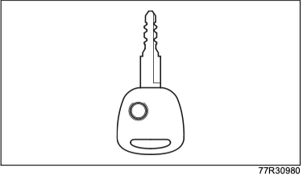{ .center-image }

!!! warning "Осторожно"
    Не вешайте на ключ лишние аксессуары. Если на ключе много аксессуаров или они тяжёлые, во время движения от вибрации ключ в замке зажигания может повернуться.

    Кроме того, крупный аксессуар может задеть колено или руку и повернуть ключ.

    См. также: [4-2: замок зажигания](04-driving.md#4-2-замок-зажигания).

!!! info "Примечание"
    В ключ встроены чувствительные электронные компоненты. Чтобы не повредить электронику, соблюдайте следующие правила:

    - не оставляйте ключ в местах, где он может сильно нагреться, например на панели приборов;
    - не роняйте ключ и не подвергайте его сильным ударам;
    - не мойте ключ и не погружайте его в воду;
    - не крепите к ключу держатели и другие предметы с магнитами;
    - не оставляйте ключ рядом с устройствами, создающими магнитное поле, например телевизором или аудиосистемой;
    - не кладите ключ рядом с медицинским электрооборудованием, например аппаратами микроволновой или низкочастотной терапии, и не проходите процедуры с ключом при себе.

!!! tip "Подсказка"
    Дубликат ключа, изготовленный в обычной мастерской, не имеет иммобилайзера. Таким ключом можно запирать и отпирать двери, но нельзя запустить двигатель.

    Для запуска двигателя нужно зарегистрировать код в оригинальном ключе Suzuki с иммобилайзером. Можно зарегистрировать до четырёх ключей.

    Для покупки ключа и регистрации кода обратитесь к дилеру Suzuki или представителю Suzuki.

#### Автомобили с системой бесключевого запуска кнопкой

!!! tip "Оборудование по типу автомобиля"
    Автомобили с системой бесключевого запуска кнопкой.

- Ключ можно использовать для запирания и отпирания дверей, но запустить или остановить им двигатель нельзя. Для запуска и остановки двигателя возьмите с собой пульт дистанционного управления и используйте кнопку запуска/остановки двигателя.

См. также: [4-10: запуск двигателя](04-driving.md#4-10-запуск-двигателя).

- В комплект входят два пульта дистанционного управления (1) и два механических ключа (2), которые хранятся внутри пультов.

См. также: [3-8: пульт дистанционного управления](#пульт-дистанционного-управления).

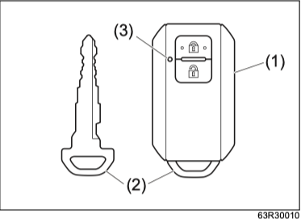{ .center-image }

(3) Индикатор работы.

- Чтобы вынуть механический ключ (2) из пульта, сдвиньте фиксатор (4) в направлении стрелки и потяните ключ.

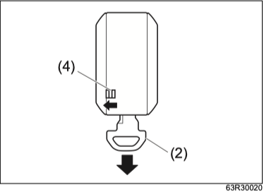{ .center-image }

!!! tip "Подсказка"
    Храните механический ключ внутри пульта дистанционного управления. Если батарейка пульта разрядится или пульт выйдет из строя, запирание и отпирание дверей может стать невозможным.

    Для покупки ключа обратитесь к дилеру Suzuki или представителю Suzuki.

#### Номерная пластина ключа

На номерной пластине (2) выбит номер ключа (1), который нужен для изготовления нового ключа.

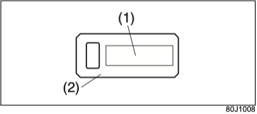{ .center-image }

!!! tip "Подсказка"
    Чтобы номер ключа не стал известен посторонним, храните номерную пластину в надёжном месте вне автомобиля. Если ключ потерян, сообщите номер ключа дилеру Suzuki или представителю Suzuki.

    При продаже автомобиля передайте номерную пластину новому владельцу вместе с ключами.

### Система бесключевого доступа

Если нажать кнопку на ключе с дистанционным управлением на расстоянии примерно до 2 м от автомобиля, все двери запираются или отпираются.

- После запирания потяните наружную ручку двери и убедитесь, что дверь действительно заперта.

!!! danger "Внимание"
    Чтобы снизить риск пожара, угона и других происшествий, когда отходите от автомобиля, остановите двигатель и заприте двери.

!!! info "Примечание"
    В ключ с дистанционным управлением встроены чувствительные электронные компоненты. Чтобы не повредить электронику, соблюдайте следующие правила:

    - не оставляйте ключ в местах, где он может сильно нагреться, например на панели приборов;
    - не роняйте ключ и не подвергайте его сильным ударам;
    - не мойте ключ и не погружайте его в воду.

!!! tip "Подсказка"
    Дальность действия системы бесключевого доступа может меняться под влиянием окружающих условий. В местах с сильными радиопомехами система может не работать.

    Даже если отходите от автомобиля ненадолго, не оставляйте в салоне деньги и ценные вещи. Это повышает риск кражи.

    Если ключ с дистанционным управлением не запирает и не отпирает двери, используйте механический ключ.

    Если система бесключевого доступа работает только с очень близкого расстояния, возможно, разрядилась батарейка ключа.

    См. также: [6-9: замена батарейки ключа с дистанционным управлением](06-care.md#6-9-замена-батарейки-ключа-с-дистанционным-управлением).

    Чем чаще пользоваться ключом с дистанционным управлением, тем быстрее разряжается батарейка.

    Для покупки ключа и регистрации кода обратитесь к дилеру Suzuki или представителю Suzuki.

#### Автомобили без системы бесключевого запуска кнопкой

!!! tip "Оборудование по типу автомобиля"
    Автомобили без системы бесключевого запуска кнопкой.

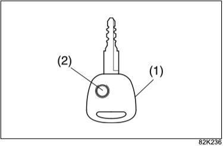{ .center-image }

(1) Ключ с дистанционным управлением.  
(2) Кнопка управления.

!!! tip "Подсказка"
    Система бесключевого доступа не работает в следующих случаях:

    - открыта одна из дверей; при этом запирание невозможно, но отпирание возможно;
    - ключ вставлен в замок зажигания.

    На один автомобиль можно зарегистрировать до четырёх ключей с дистанционным управлением.

#### Автомобили с системой бесключевого запуска кнопкой

!!! tip "Оборудование по типу автомобиля"
    Автомобили с системой бесключевого запуска кнопкой.

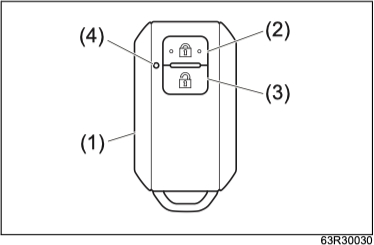{ .center-image }

(1) Пульт дистанционного управления.  
(2) Кнопка запирания.  
(3) Кнопка отпирания.  
(4) Индикатор работы.

!!! tip "Подсказка"
    При нажатии кнопки загорается индикатор работы.

    Система бесключевого доступа не работает в следующих случаях:

    - открыта одна из дверей; при этом запирание невозможно, но отпирание возможно. Внешний зуммер прозвучит около 2 секунд;
    - кнопка запуска/остановки двигателя находится в положении `ACC` или `ON`.

    На один автомобиль можно зарегистрировать до четырёх пультов дистанционного управления.

#### Подтверждение запирания и отпирания

Эта функция показывает, что двери были заперты или отперты с помощью системы бесключевого доступа.

| Сигнал | Заводская настройка: запирание | Заводская настройка: отпирание | После изменения настройки: запирание | После изменения настройки: отпирание |
| --- | --- | --- | --- | --- |
| Аварийная сигнализация | 1 мигание | 2 мигания | - | - |
| Салонное освещение, если переключатель в положении `DOOR` | - | Горит около 15 секунд | 2 мигания | Горит около 15 секунд |

- Если нужно, чтобы при срабатывании системы бесключевого доступа салонное освещение загоралось или мигало, установите переключатель салонного освещения в положение `DOOR`.
- После включения примерно на 15 секунд салонное освещение плавно гаснет.

См. также: [5-7: салонное освещение](05-equipment.md#5-7-салонное-освещение).

- На автомобилях с системой бесключевого запуска кнопкой также срабатывает внешний зуммер.

| Сигнал | Заводская настройка: запирание | Заводская настройка: отпирание | После изменения настройки: запирание | После изменения настройки: отпирание |
| --- | --- | --- | --- | --- |
| Внешний зуммер | 1 сигнал | 2 сигнала | - | - |

!!! tip "Подсказка"
    Для изменения настройки функции подтверждения обратитесь к дилеру Suzuki или представителю Suzuki.

    На автомобилях с системой бесключевого запуска кнопкой подтверждение также работает при запирании и отпирании наружной кнопкой на двери. Мигание аварийной сигнализации и салонного освещения, а также сигналы внешнего зуммера можно настраивать независимо.

    В режиме настроек многофункционального информационного дисплея можно отключить подтверждение внешним зуммером.

    См. также: [8-9: режим настроек](08-service-data.md#8-9-режим-настроек).

#### Автоматическое повторное запирание

Эта функция автоматически запирает двери для защиты от угона.

- Если после отпирания системой бесключевого доступа в течение примерно 30 секунд не открыть ни одну дверь, двери снова запираются автоматически.
- При срабатывании автоматического повторного запирания охранная сигнализация включается автоматически.

См. также: [3-17: охранная сигнализация](#охранная-сигнализация).

- Если в момент автоматического повторного запирания открыт капот, охранная сигнализация не включается. Если капот закрыть после этого, охранная сигнализация включится примерно через 20 секунд.

!!! tip "Подсказка"
    На автомобилях с системой бесключевого запуска кнопкой автоматическое повторное запирание также работает после отпирания наружной кнопкой на двери.

### Пульт дистанционного управления

!!! tip "Оборудование по типу автомобиля"
    Комплектация зависит от типа автомобиля.

Когда все двери закрыты, нажмите наружную кнопку на передней двери или двери багажного отделения. Если пульт дистанционного управления находится при вас, он связывается с автомобилем по радиоканалу. После проверки кода двери можно запереть или отпереть.

Кроме того, пульт дистанционного управления используется для следующих функций:

- система бесключевого доступа;

См. также: [3-5: система бесключевого доступа](#система-бесключевого-доступа).

- запуск двигателя и переключение режимов питания кнопкой запуска/остановки двигателя;

См. также: [4-6: система бесключевого запуска кнопкой](04-driving.md#4-6-система-бесключевого-запуска-кнопкой).

- иммобилайзер.

См. также: [4-4: иммобилайзер](04-driving.md#4-4-иммобилайзер).

!!! info "Примечание"
    Радиосигнал пульта дистанционного управления может влиять на мобильные телефоны и другие устройства радиосвязи. Не нажимайте кнопки пульта, наружные кнопки на дверях и кнопку запуска/остановки двигателя без необходимости.

!!! tip "Подсказка"
    Пульт дистанционного управления должен находиться у водителя. Не оставляйте его в автомобиле.

    Чтобы снизить риск угона, при потере пульта сразу обратитесь к дилеру Suzuki или представителю Suzuki.

    Пульт обменивается с автомобилем слабым радиосигналом, поэтому при внешних помехах может работать нестабильно. Возможные причины:

    - рядом находятся телебашня, электростанция, радиостанция или другое оборудование, создающее сильные радиосигналы либо помехи;
    - пульт лежит рядом с мобильным телефоном, радиостанцией, ноутбуком или другим устройством радиосвязи;
    - пульт соприкасается с металлическим предметом или закрыт металлическим предметом;
    - рядом используется система бесключевого доступа другого автомобиля;
    - автомобиль стоит на платной парковке с датчиками обнаружения автомобиля.

В комплект входят два пульта дистанционного управления (1) и два механических ключа (2), которые хранятся внутри пультов.

{ .center-image }

(3) Индикатор работы.

Чтобы вынуть механический ключ (2) из пульта, сдвиньте фиксатор (4) в направлении стрелки и потяните ключ.

{ .center-image }

!!! warning "Осторожно"
    Не разбирайте пульт дистанционного управления, не ремонтируйте и не модифицируйте его, кроме замены батарейки. Это может привести к возгоранию, поражению электрическим током или травме. Кроме того, такие действия могут повлечь ответственность по закону.

!!! info "Примечание"
    В пульт дистанционного управления встроены чувствительные электронные компоненты. Чтобы не повредить электронику, соблюдайте следующие правила:

    - не оставляйте пульт в местах, где он может сильно нагреться, например на панели приборов;
    - не роняйте пульт и не подвергайте его сильным ударам;
    - не мойте пульт и не погружайте его в воду;
    - не крепите к пульту держатели и другие предметы с магнитами;
    - не оставляйте пульт рядом с устройствами, создающими магнитное поле, например телевизором или аудиосистемой;
    - не кладите пульт рядом с медицинским электрооборудованием, например аппаратами микроволновой или низкочастотной терапии, и не проходите процедуры с пультом при себе.

!!! tip "Подсказка"
    Храните механический ключ внутри пульта дистанционного управления. Если батарейка пульта разрядится или пульт выйдет из строя, запирание и отпирание дверей может стать невозможным.

    На один автомобиль можно зарегистрировать до четырёх пультов дистанционного управления.

    Срок службы батарейки зависит от условий использования и обычно составляет около 2 лет.

    См. также: [6-9: замена батарейки ключа с дистанционным управлением](06-care.md#6-9-замена-батарейки-ключа-с-дистанционным-управлением).

    Пульт постоянно находится в режиме приёма для связи с автомобилем. Если он длительное время принимает сильные радиосигналы, батарейка может разрядиться значительно быстрее, например рядом с телевизором или ноутбуком.

    Для покупки пульта и регистрации кода обратитесь к дилеру Suzuki или представителю Suzuki.

#### Запирание и отпирание дверей наружной кнопкой

Если все двери закрыты и пульт дистанционного управления находится в зоне действия наружной кнопки, при каждом нажатии этой кнопки все двери запираются или отпираются.

После запирания потяните наружную ручку двери и убедитесь, что дверь действительно заперта.

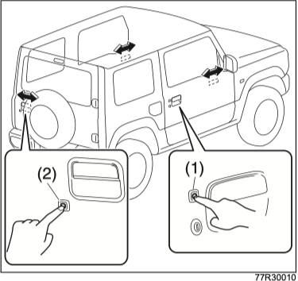{ .center-image }

(1) Наружная кнопка на передней двери.  
(2) Наружная кнопка на двери багажного отделения.

!!! danger "Внимание"
    Чтобы снизить риск пожара, угона и других происшествий, когда отходите от автомобиля, остановите двигатель и заприте двери.

!!! tip "Подсказка"
    Наружная кнопка не работает в следующих случаях:

    - открыта одна из дверей;
    - питание автомобиля находится в режиме `ACC` или `ON`.

    При запирании и отпирании наружной кнопкой работают функции подтверждения и автоматического повторного запирания.

    См. также: [3-7: подтверждение запирания и отпирания](#подтверждение-запирания-и-отпирания).  
    См. также: [3-8: автоматическое повторное запирание](#автоматическое-повторное-запирание).

    Даже если отходите от автомобиля ненадолго, не оставляйте в салоне деньги и ценные вещи. Это повышает риск кражи.

#### Зона действия наружной кнопки снаружи автомобиля

Зона действия находится примерно в пределах полусферы радиусом 80 см вокруг наружной кнопки на передней двери или двери багажного отделения.

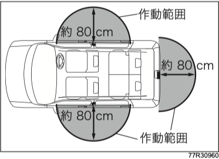{ .center-image }

!!! tip "Подсказка"
    Даже если пульт находится в зоне действия наружной кнопки, он может не распознаваться и кнопка может не работать в следующих случаях:

    - батарейка пульта разряжена;
    - пульт находится под воздействием сильных радиосигналов или помех;
    - пульт соприкасается с металлическим предметом или закрыт металлическим предметом;
    - пульт находится слишком близко к двери;
    - пульт лежит близко к земле, находится слишком высоко или, например, лежит в заднем кармане и удалён от наружной кнопки.

    Если пульт находится в салоне в перечисленных ниже местах, при определённых условиях он может распознаваться как находящийся снаружи. В этом случае наружная кнопка может сработать, и пульт может оказаться запертым в автомобиле:

    - на панели приборов;
    - на полу;
    - в багажном отделении;
    - в глубине салона, например в нише или вещевом отделении.

    Наружная кнопка работает только на той двери, рядом с которой находится пульт. Например, если пульт находится в зоне действия двери водителя, кнопка на двери водителя работает, а кнопки на двери переднего пассажира и двери багажного отделения не работают.

    Если в автомобиле находится запасной пульт, он может быть распознан системой, из-за чего наружная кнопка может работать некорректно.

#### Предупреждающий зуммер наружной кнопки

В следующих случаях внешний зуммер звучит около 2 секунд и предупреждает, что наружная кнопка не сработала:

- питание автомобиля находится в режиме `ACC` или `ON`, все двери закрыты и нажата наружная кнопка;
- после перевода питания в режим `LOCK` (`OFF`) наружная кнопка нажата при одном из следующих условий:
    - пульт дистанционного управления оставлен в автомобиле;
    - открыта одна из дверей.

См. также: [3-84: контрольная лампа незакрытой двери](#контрольная-лампа-незакрытой-двери).

Переведите питание автомобиля в режим `LOCK` (`OFF`), вынесите пульт из салона, убедитесь, что все двери полностью закрыты, затем снова нажмите наружную кнопку.

#### Защита от запирания пульта в автомобиле

Эта функция предотвращает запирание пульта дистанционного управления в автомобиле при [3-16: запирании без ключа](#запирание-без-ключа).

- Если пульт оставлен в салоне и вы пытаетесь запереть все двери без ключа, все двери автоматически отпираются.

!!! tip "Подсказка"
    Перед запиранием без ключа убедитесь, что пульт дистанционного управления у вас в руках. Иначе пульт можно случайно запереть в автомобиле.

    Если питание автомобиля находится в режиме `ACC` или `ON`, защита от запирания пульта в автомобиле работает независимо от местоположения пульта.

    Если свинцово-кислотный аккумулятор полностью разряжен или отключён, защита от запирания пульта в автомобиле не работает.

#### Зона обнаружения пульта в салоне

Зона обнаружения пульта в салоне (1) - это салон автомобиля, кроме панели приборов и багажного отделения.

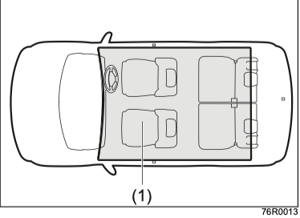{ .center-image }

!!! tip "Подсказка"
    Даже если пульт находится в зоне обнаружения салона, он может не распознаваться. В этом случае предупреждающий зуммер наружной кнопки и защита от запирания пульта в автомобиле могут не сработать. Возможные причины:

    - батарейка пульта разряжена;
    - пульт находится под воздействием сильных радиосигналов или помех;
    - пульт соприкасается с металлическим предметом или закрыт металлическим предметом;
    - пульт находится в глубине салона, в нише или вещевом отделении.

    См. также: [5-9: вещевые отделения панели приборов](05-equipment.md#5-9-вещевые-отделения-панели-приборов).  
    См. также: [5-10: подстаканник и держатель бутылки](05-equipment.md#5-10-подстаканник-и-держатель-бутылки).  
    См. также: [5-11: прочее оборудование](05-equipment.md#5-11-прочее-оборудование).

    Пульт также может не распознаваться, если находится перед комбинацией приборов, у солнцезащитного козырька или на полу.

    Даже если пульта нет в зоне обнаружения салона, он может быть распознан как находящийся внутри автомобиля. Тогда предупреждающий зуммер наружной кнопки и защита от запирания пульта в автомобиле могут сработать. Возможные причины:

    - пульт находится снаружи автомобиля, но слишком близко к двери;
    - пульт лежит на панели приборов или в багажном отделении.

### Двери

!!! danger "Внимание"
    Перед закрыванием двери убедитесь, что ремень безопасности или багаж не попали в проём. Иначе дверь может закрыться не полностью и открыться во время движения.

    Перед открыванием двери проверьте автомобили и пешеходов сзади. Будьте особенно осторожны в сильный ветер.

    Не оставляйте дверь багажного отделения открытой при работающем двигателе. В салон могут попасть отработавшие газы, что создаёт риск отравления угарным газом.

    Чтобы снизить риск пожара, угона и других происшествий, когда отходите от автомобиля, остановите двигатель и заприте двери.

!!! warning "Осторожно"
    Двери должны открывать и закрывать взрослые. Следите, чтобы дети не открывали и не закрывали двери, а также чтобы в проём не попали руки, ноги или голова.

    Открывая дверь багажного отделения, откройте её полностью. Если дверь открыта не до конца, она может неожиданно закрыться и причинить травму.

    После отпирания потяните ручку на себя: дверь багажного отделения продолжит открываться до полного положения за счёт демпферного упора. Убедитесь, что рядом нет предметов, которые могут мешать полному открыванию.

    При работающем двигателе не открывайте и не закрывайте дверь багажного отделения прямо за выхлопной трубой. Есть риск ожога.

!!! tip "Подсказка"
    Даже если отходите от автомобиля ненадолго, не оставляйте в салоне деньги и ценные вещи. Это повышает риск кражи.

    В зависимости от состояния охранной сигнализации и способа открывания двери может сработать тревога.

    См. также: [3-17: охранная сигнализация](#охранная-сигнализация).

#### Запирание и отпирание снаружи ключом

См. также: [3-5: система бесключевого доступа](#система-бесключевого-доступа).  
См. также: [3-8: пульт дистанционного управления](#пульт-дистанционного-управления).

##### Передняя дверь

Вставьте ключ в цилиндр замка. Поверните ключ к передней части автомобиля, чтобы запереть дверь, и к задней части автомобиля, чтобы отпереть.

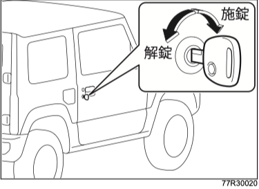{ .center-image }

##### Дверь багажного отделения

Вставьте ключ в цилиндр замка двери водителя. Поверните ключ к передней части автомобиля, чтобы запереть дверь багажного отделения, и к задней части автомобиля, чтобы отпереть.

- Чтобы открыть дверь багажного отделения, после отпирания потяните ручку (1) на себя.

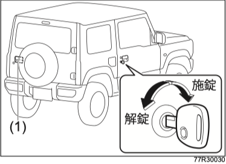{ .center-image }

##### Открывание двери багажного отделения

Слегка толкните дверь багажного отделения рукой снаружи, помогая ей открыться.

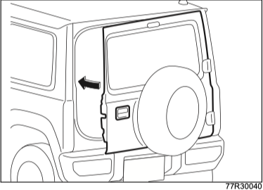{ .center-image }

#### Запирание и отпирание из салона

##### Передняя дверь

Закройте дверь. Если сдвинуть рычажок блокировки (1) к передней части автомобиля, дверь запирается; если сдвинуть его к задней части автомобиля, дверь отпирается.

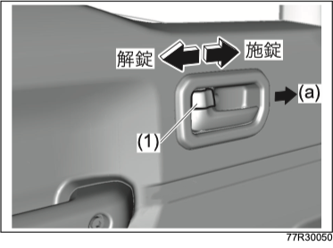{ .center-image }

(a) Передняя часть автомобиля.

!!! tip "Подсказка"
    При отпирании на рычажке блокировки видна красная метка. Используйте её как ориентир.

##### Дверь багажного отделения

Если из-за неисправности или разряда свинцово-кислотного аккумулятора дверь багажного отделения не отпирается, обратитесь к дилеру Suzuki или представителю Suzuki для проверки автомобиля.

В экстренной ситуации дверь багажного отделения можно отпереть следующим способом.

1. Сложите спинки задних сидений и освободите рабочее пространство.

См. также: [3-32: регулировка угла наклона спинки](#3-32-регулировка-угла-наклона-спинки).

2. Снимите багажный ящик.

См. также: [5-14: багажный ящик](05-equipment.md#5-14-багажный-ящик).

3. Снимите облицовку двери багажного отделения (1). Для этого подденьте её край плоской отвёрткой, предварительно обернув жало тканью.

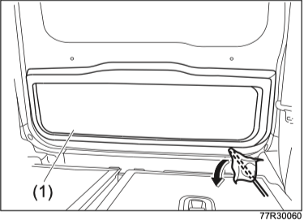{ .center-image }

4. С нижней стороны замка двери багажного отделения переместите рычаг (2) в направлении стрелки, чтобы отпереть дверь.

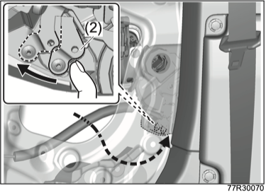{ .center-image }

!!! warning "Осторожно"
    При перемещении рычага будьте осторожны с краями отверстия вокруг замка двери багажного отделения. Можно пораниться.

5. Потяните ручку двери (3) на себя и откройте дверь багажного отделения.

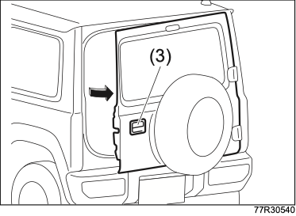{ .center-image }

#### Запирание без ключа

!!! tip "Подсказка"
    Перед запиранием без ключа убедитесь, что ключ или пульт дистанционного управления у вас в руках. Иначе их можно случайно запереть в автомобиле.

    На автомобилях с системой бесключевого запуска кнопкой запирание без ключа может не сработать в следующих случаях:

    - пульт дистанционного управления находится в автомобиле;
    - питание автомобиля находится в режиме `ACC` или `ON`.

    См. также: [3-12: защита от запирания пульта в автомобиле](#защита-от-запирания-пульта-в-автомобиле).

##### Передняя дверь

Переведите рычажок блокировки (1) в положение запирания, к передней части автомобиля. Затем потяните наружную ручку двери (2) и, удерживая её, закройте дверь.

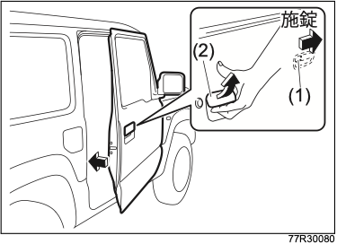{ .center-image }

#### Центральный замок при управлении ключом или рычажком блокировки

См. также: [3-5: система бесключевого доступа](#система-бесключевого-доступа).  
См. также: [3-8: пульт дистанционного управления](#пульт-дистанционного-управления).

Если запереть или отпереть дверь водителя ключом (1) либо рычажком блокировки (2), одновременно запираются или отпираются дверь переднего пассажира, задние двери и дверь багажного отделения.

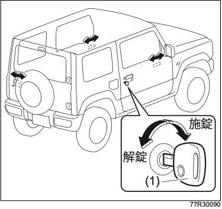{ .center-image }

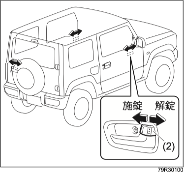{ .center-image }

!!! tip "Подсказка"
    На автомобилях с системой бесключевого запуска кнопкой, если открыта хотя бы одна дверь, запирание ключом или рычажком блокировки двери водителя может не сработать.

    См. также: [3-12: защита от запирания пульта в автомобиле](#защита-от-запирания-пульта-в-автомобиле).

#### Автоматическое отпирание дверей при срабатывании SRS

При столкновении, когда срабатывают подушки безопасности SRS, все двери автоматически отпираются.

- Если срабатывает боковая подушка безопасности SRS или шторка безопасности SRS, эта функция также отпирает двери.

!!! tip "Подсказка"
    Даже если подушки безопасности сработали, функция автоматического отпирания дверей может не сработать, если повреждены проводка электроприводов замков или сами электроприводы.

## Охранная система

### Охранная сигнализация

Если капот закрыт и двери заперты системой бесключевого доступа или наружной кнопкой автомобиля с системой бесключевого запуска кнопкой, охранная сигнализация включается примерно через 20 секунд.

Если капот открыт и двери заперты системой бесключевого доступа или наружной кнопкой, охранная сигнализация включится примерно через 20 секунд после закрытия капота.

Когда охранная сигнализация включена, при отпирании автомобиля любым способом, кроме системы бесключевого доступа или наружной кнопки, и последующем открывании любой двери или капота сработает тревога. Сигнализация предупредит окружающих о нештатной ситуации.

К таким способам отпирания относятся в том числе ключ и рычажок блокировки.

Если тревога сработала по ошибке, см. [3-18: как остановить тревогу](#3-18-как-остановить-тревогу).

!!! info "Примечание"
    Если модифицировать или демонтировать охранную сигнализацию, система может работать неправильно.

    Не модифицируйте и не демонтируйте охранную сигнализацию.

!!! tip "Подсказка"
    Охранная сигнализация не требует технического обслуживания.

!!! tip "Подсказка"
    Охранная сигнализация подаёт предупреждение при выполнении определённых условий. Она не предотвращает проникновение в автомобиль.

    Когда охранная сигнализация включена, отпирайте двери только системой бесключевого доступа или наружной кнопкой. Если отпереть дверь ключом, сработает тревога.

    Если передаёте автомобиль другому человеку или автомобилем будет управлять человек, который не знаком с охранной сигнализацией, объясните ему, как она работает. Случайное срабатывание тревоги может создать неудобства окружающим.

    Даже если охранная сигнализация включена, не оставляйте в салоне деньги и ценные вещи. Это повышает риск кражи.

#### Как включить охранную сигнализацию

Заприте двери системой бесключевого доступа или наружной кнопкой. Индикатор охранной сигнализации (1) начнёт часто мигать, и примерно через 20 секунд сигнализация включится.

После включения сигнализации индикатор мигает с интервалом около 2 секунд.

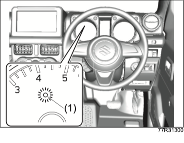{ .center-image }

На рисунке показан пример. В зависимости от типа автомобиля расположение может отличаться.

!!! tip "Подсказка"
    Чтобы не вызвать ложное срабатывание, не включайте охранную сигнализацию, если в автомобиле остаются люди. Если человек в салоне отопрёт дверь рычажком блокировки и откроет её, сработает тревога.

    Если запереть все двери ключом или рычажком блокировки, охранная сигнализация не включится.

    При автоматическом повторном запирании охранная сигнализация включается автоматически.

    См. также: [3-8: автоматическое повторное запирание](#автоматическое-повторное-запирание).

#### Как отключить охранную сигнализацию

Отоприте двери системой бесключевого доступа или наружной кнопкой. Охранная сигнализация отключится, а индикатор охранной сигнализации погаснет.

#### Как остановить тревогу

Если тревога сработала случайно, остановите её одним из следующих способов:

- переведите питание автомобиля в режим `ON`;
- отоприте двери системой бесключевого доступа или наружной кнопкой.

!!! tip "Подсказка"
    Даже если остановить тревогу, при последующем запирании дверей системой бесключевого доступа или наружной кнопкой охранная сигнализация снова включится примерно через 20 секунд.

    Если при включённой охранной сигнализации или во время тревоги отсоединить клемму свинцово-кислотного аккумулятора, тревога остановится. Однако после повторного подключения клеммы тревога снова сработает.

    Даже после завершения тревоги, если не отключить охранную сигнализацию и открыть одну из дверей, тревога сработает снова.

#### Если тревога сработала во время стоянки

Если тревога сработала из-за попытки угона или другой причины, при переводе питания автомобиля в режим `ON` индикатор охранной сигнализации часто мигает около 8 секунд, а зуммер в салоне звучит 4 раза.

Проверьте, не было ли попытки проникновения в автомобиль.

#### Как работает охранная сигнализация

При тревоге аварийная сигнализация мигает около 40 секунд, а зуммер в салоне прерывисто звучит около 10 секунд. После этого звуковой сигнал автомобиля прерывисто звучит около 30 секунд.

Во время тревоги мигает и индикатор охранной сигнализации.

#### Индикатор охранной сигнализации

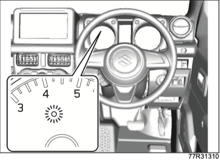{ .center-image }

- Если запереть двери системой бесключевого доступа или наружной кнопкой, индикатор часто мигает, и примерно через 20 секунд охранная сигнализация включается. После включения индикатор мигает с интервалом 2 секунды.
- Если тревога сработала во время стоянки, при переводе питания автомобиля в режим `ON` индикатор часто мигает около 8 секунд.
- Если в противоугонной системе автомобиля есть неисправность, при режиме питания `ON` индикатор мигает с интервалом 1 секунда. Обратитесь к дилеру Suzuki или представителю Suzuki для проверки автомобиля.

## Открывание и закрывание окон

### Электростеклоподъёмники

Когда питание автомобиля находится в режиме `ON`, окна можно открывать и закрывать переключателями электростеклоподъёмников.

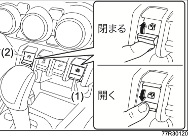{ .center-image }

(1) Переключатель стеклоподъёмника двери водителя с автоматическим режимом.  
(2) Переключатель стеклоподъёмника двери переднего пассажира.

!!! danger "Внимание"
    При открывании и закрывании окон можно случайно зажать руку, шею или другую часть тела. Это может привести к неожиданной аварии.

    При управлении окнами соблюдайте следующие правила:

    - водитель должен следить за окнами не только со своей стороны, но и со стороны пассажиров;
    - не позволяйте детям пользоваться переключателями стеклоподъёмников;
    - когда выходите из автомобиля, обязательно переведите питание автомобиля в режим `OFF`, возьмите ключ с собой и выходите вместе с детьми;
    - прежде чем открыть или закрыть окно пассажира с места водителя, убедитесь, что пассажиры и дети не высунули руки или лицо, и предупредите их.

    Не просовывайте руку в окно снаружи автомобиля, чтобы нажать переключатель стеклоподъёмника. Можно зажать руку или шею, что может привести к неожиданной аварии.

!!! warning "Осторожно"
    Не касайтесь стекла при открывании или закрывании окна. Стекло может затянуть руку и травмировать.

!!! info "Примечание"
    Если открывать и закрывать окна при остановленном двигателе, свинцово-кислотный аккумулятор может разрядиться.

    Чтобы не разряжать аккумулятор, пользуйтесь стеклоподъёмниками при работающем двигателе.

#### Управление с места водителя

С места водителя можно открывать и закрывать окно водителя и окно переднего пассажира.

- Окно движется только пока удерживается переключатель. Если отпустить переключатель, окно остановится в текущем положении. Исключение - автоматический режим стеклоподъёмника двери водителя.

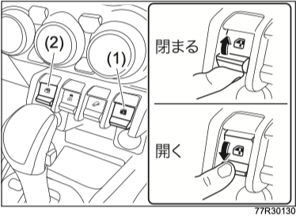{ .center-image }

(1) Переключатель стеклоподъёмника двери водителя с автоматическим режимом.  
(2) Переключатель стеклоподъёмника двери переднего пассажира.

#### Автоматический режим стеклоподъёмника двери водителя

Если сильнее нажать или потянуть переключатель стеклоподъёмника двери водителя, автоматический режим полностью откроет или полностью закроет окно даже после отпускания переключателя.

Чтобы остановить стекло в промежуточном положении, кратко нажмите переключатель в противоположном направлении.

#### Работа стеклоподъёмника двери водителя после выключения питания

После перевода питания автомобиля из режима `ON` в режим `ACC` или `LOCK` (`OFF`) стеклоподъёмником двери водителя можно пользоваться ещё примерно 30 секунд.

!!! tip "Подсказка"
    Даже в течение этих 30 секунд стеклоподъёмник двери водителя не работает, если открыть дверь водителя или переднего пассажира.

#### Защита от защемления

На стеклоподъёмнике двери водителя предусмотрена защита от защемления.

Если при автоматическом закрывании стекло встречает нагрузку выше заданной, направление движения стекла меняется: оно немного опускается и останавливается.

!!! danger "Внимание"
    В зависимости от формы и твёрдости предмета защита от защемления может не распознать препятствие и не сработать.

    Будьте особенно внимательны при закрывании окна: существует риск тяжёлой травмы.

!!! warning "Осторожно"
    Защита от защемления не работает, если продолжать удерживать переключатель в положении закрывания.

    Кроме того, непосредственно перед полным закрытием есть зона, где защита от защемления не успевает распознать препятствие. Следите, чтобы пальцы и другие предметы не попали в проём окна.

!!! tip "Подсказка"
    При неисправности стеклоподъёмника защита от защемления может сработать и не дать автоматически закрыть окно. В этом случае продолжайте удерживать переключатель стеклоподъёмника двери водителя в положении закрывания, чтобы полностью закрыть окно.

    При движении по плохой дороге стекло может автоматически закрываться с рывками; из-за ударной нагрузки защита от защемления может сработать.

#### Когда требуется инициализация защиты от защемления

В перечисленных ниже случаях стеклоподъёмник двери водителя может перестать автоматически открываться или закрываться, а защита от защемления может не работать. Выполните инициализацию по процедуре ниже:

- отсоединяли клемму свинцово-кислотного аккумулятора;
- свинцово-кислотный аккумулятор разряжался;
- заменяли свинцово-кислотный аккумулятор;
- проверяли или заменяли предохранители.

См. также: [7-35: если перегорел предохранитель](07-emergency.md#7-35-если-перегорел-предохранитель).

!!! danger "Внимание"
    Обязательно выполните инициализацию защиты от защемления. Пока инициализация не завершена, защита от защемления не работает.

!!! tip "Подсказка"
    Если стеклоподъёмник двери водителя перестал автоматически открывать или закрывать окно, также выполните инициализацию.

#### Инициализация защиты от защемления

1. Переведите питание автомобиля в режим `ON`.
2. Нажмите и удерживайте переключатель стеклоподъёмника двери водителя, пока окно полностью не откроется.
3. Потяните и удерживайте переключатель стеклоподъёмника двери водителя, пока окно полностью не закроется.
4. После полного закрытия продолжайте удерживать переключатель в положении закрывания не менее 2 секунд.
5. Убедитесь, что стеклоподъёмник двери водителя снова открывает и закрывает окно автоматически.

Если после нескольких повторений шагов 1-4 автоматический режим не восстанавливается, возможна неисправность системы. Обратитесь к дилеру Suzuki или представителю Suzuki для проверки автомобиля.

#### Управление с места переднего пассажира

С места переднего пассажира можно открывать и закрывать окно переднего пассажира.

- Окно движется только пока удерживается переключатель. Если отпустить переключатель, окно остановится в текущем положении.

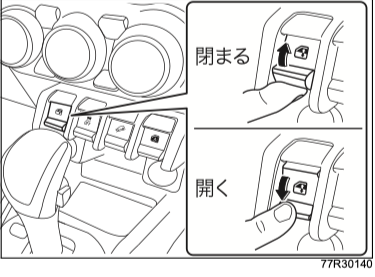{ .center-image }

## Регулировка элементов

### Внутреннее зеркало заднего вида

Отрегулируйте угол, перемещая корпус зеркала.

!!! danger "Внимание"
    Обязательно регулируйте зеркало до начала движения. Если регулировать зеркало во время движения, можно ошибиться в управлении или отвлечься от дороги, что может привести к неожиданной аварии.

#### Зеркало с противоослепляющим режимом

!!! tip "Оборудование по типу автомобиля"
    Jimny Sierra.

В обычных условиях используйте зеркало с рычажком (1), переведённым к передней части автомобиля. Угол зеркала также регулируйте в этом положении.

Если сзади едет автомобиль с яркими фарами, потяните рычажок на себя, чтобы ослабить отражённый свет.

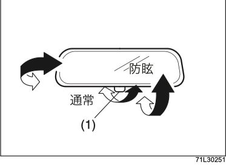{ .center-image }

### Наружные зеркала

#### Регулировка угла

!!! danger "Внимание"
    Обязательно регулируйте зеркала до начала движения. Если регулировать зеркала во время движения, можно ошибиться в управлении или отвлечься от дороги, что может привести к неожиданной аварии.

##### Ручная регулировка

!!! tip "Оборудование по типу автомобиля"
    Комплектация зависит от типа автомобиля.

Отрегулируйте угол, перемещая корпус зеркала.

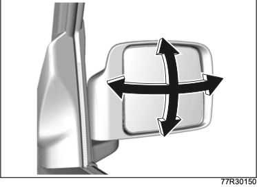{ .center-image }

##### Переключатель регулировки наружных зеркал

!!! tip "Оборудование по типу автомобиля"
    Комплектация зависит от типа автомобиля.

Переключатель работает, когда питание автомобиля находится в режиме `ACC` или `ON`.

1. Сдвиньте переключатель выбора стороны (1) к зеркалу, которое нужно отрегулировать.
2. Нажимайте переключатель регулировки (2), чтобы переместить зеркало вверх, вниз, влево или вправо.

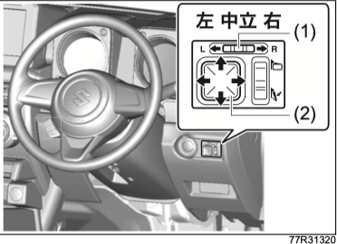{ .center-image }

!!! tip "Подсказка"
    После регулировки верните переключатель выбора стороны в среднее положение.

#### Дополнительные зеркала нижнего бокового обзора

На наружном зеркале со стороны переднего пассажира установлены дополнительные зеркала нижнего бокового обзора. Они помогают контролировать левую боковую зону автомобиля при парковке и движении на очень малой скорости.

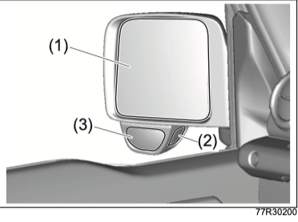{ .center-image }

(1) Основное зеркало.  
(2) Дополнительное зеркало нижнего бокового обзора 1.  
(3) Дополнительное зеркало нижнего бокового обзора 2.

!!! warning "Осторожно"
    Видимая через эти зеркала зона ограничена. Обстановку сзади проверяйте по наружным зеркалам, внутреннему зеркалу заднего вида или камере заднего вида, если она установлена.

    Перед началом движения не полагайтесь только на зеркала. Повернитесь и визуально проверьте обстановку вокруг автомобиля.

- Примерная зона, видимая в зеркалах:

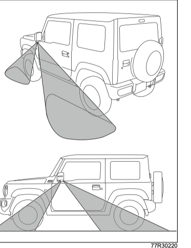{ .center-image }

!!! tip "Подсказка"
    Зеркальные элементы дополнительных зеркал нижнего бокового обзора закреплены неподвижно. Их угол не регулируется.

    Зона обзора зависит от роста водителя и положения сиденья.

#### Складывание наружных зеркал

В узких местах, например на парковке, наружные зеркала можно сложить назад, к кузову автомобиля.

Если зеркала складываются электроприводом, см. раздел про переключатель складывания наружных зеркал.

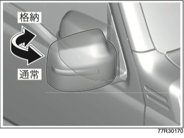{ .center-image }

!!! warning "Осторожно"
    Не двигайтесь со сложенными наружными зеркалами. Обзор назад будет ограничен, что может привести к аварии.

    В разложенном положении наружные зеркала выступают за габарит кузова. Следите, чтобы не задеть зеркалом людей или предметы.

!!! info "Примечание"
    На автомобилях с электроприводом складывания зеркал не складывайте и не раскладывайте зеркала рукой, когда питание автомобиля находится в режиме `ACC` или `ON`. Это может привести к неисправности.

##### Переключатель складывания наружных зеркал

!!! tip "Оборудование по типу автомобиля"
    Комплектация зависит от типа автомобиля.

Переключатель работает, когда питание автомобиля находится в режиме `ACC` или `ON`.

При каждом нажатии переключателя зеркала переключаются между обычным и сложенным положением.

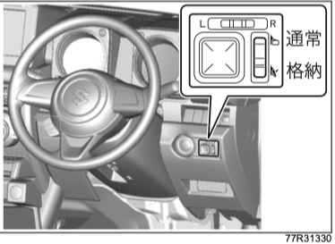{ .center-image }

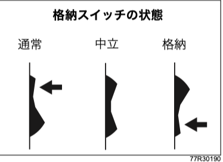{ .center-image }

- Если переключатель находится в обычном положении, а зеркало вручную отведено вперёд, при переводе питания в режим `ACC` или `ON` зеркало может ещё сильнее отклониться вперёд. Чтобы вернуть зеркало в нормальное положение, выполните складывание переключателем один раз.

!!! warning "Осторожно"
    При перемещении наружных зеркал соблюдайте осторожность:

    - убедитесь, что рядом с зеркалами нет людей и предметов;
    - не касайтесь зеркал во время их движения.

    Если зеркала сложены переключателем, не возвращайте их в обычное положение вручную. Зеркала могут не зафиксироваться полностью и во время движения сместиться из-за вибрации или встречного потока воздуха.

    В этом случае нажмите переключатель в обычное положение и убедитесь, что зеркала надёжно зафиксированы.

!!! info "Примечание"
    В сильный мороз, когда наружные зеркала могут примёрзнуть, сначала убедитесь, что их можно переместить рукой, и только после этого используйте переключатель складывания. Повторные попытки двигать примёрзшие зеркала могут привести к неисправности.

    См. также: [6-19: если наружные зеркала замёрзли](06-care.md#6-19-если-наружные-зеркала-замёрзли).

!!! tip "Подсказка"
    Если переместить зеркало вручную, при переводе питания автомобиля в режим `ACC` или `ON` зеркало может начать двигаться.

#### Дистанционное складывание наружных зеркал

!!! tip "Оборудование по типу автомобиля"
    Комплектация зависит от типа автомобиля.

Если переключатель складывания наружных зеркал находится в обычном положении, зеркала автоматически складываются при запирании дверей системой бесключевого доступа или наружной кнопкой и автоматически возвращаются в обычное положение при включении питания.

- Если запереть двери системой бесключевого доступа или наружной кнопкой, наружные зеркала складываются автоматически.

См. также: [3-5: система бесключевого доступа](#система-бесключевого-доступа).  
См. также: [3-8: пульт дистанционного управления](#пульт-дистанционного-управления).

- Чтобы вернуть зеркала в обычное положение, переведите питание автомобиля в режим `ACC` или `ON`.
- На заводе функция включена. При необходимости её можно отключить.

См. также: [3-27: переключение режима дистанционного складывания наружных зеркал](#переключение-режима-дистанционного-складывания-наружных-зеркал).

!!! info "Примечание"
    В сильный мороз, когда наружные зеркала могут примёрзнуть, отключите дистанционное складывание. Повторные попытки двигать примёрзшие зеркала могут привести к неисправности.

    См. также: [6-19: если наружные зеркала замёрзли](06-care.md#6-19-если-наружные-зеркала-замёрзли).

!!! tip "Подсказка"
    Если запереть двери ключом, рычажком блокировки или переключателем центрального замка, наружные зеркала автоматически не складываются.

    Если переключатель складывания наружных зеркал находится в сложенном положении, при переводе питания в режим `ACC` или `ON` зеркала автоматически не возвращаются в обычное положение.

    При автоматическом повторном запирании наружные зеркала складываются автоматически.

    См. также: [3-8: автоматическое повторное запирание](#автоматическое-повторное-запирание).

#### Переключение режима дистанционного складывания наружных зеркал

Когда питание автомобиля выключено (`LOCK`/`OFF`), режим дистанционного складывания переключают так:

1. Сядьте на место водителя и убедитесь, что все двери закрыты.

    Если какая-либо дверь открыта, загорится контрольная лампа незакрытой двери.

    См. также: [3-84: контрольная лампа незакрытой двери](#контрольная-лампа-незакрытой-двери).

2. Переведите рычажок блокировки двери (1) в положение отпирания.

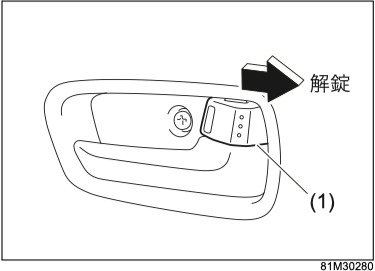{ .center-image }

Шаги 3 и 4 выполните в течение 15 секунд.

3. Переведите рычажок блокировки двери (1) в положение запирания, затем обратно в положение отпирания. Повторите это 4 раза.

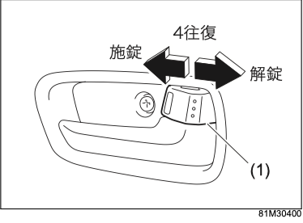{ .center-image }

4. Нажмите кнопку на пульте дистанционного управления 3 раза.

    Можно нажимать кнопку запирания или отпирания.

    Во время переключения режима двери не отпираются.

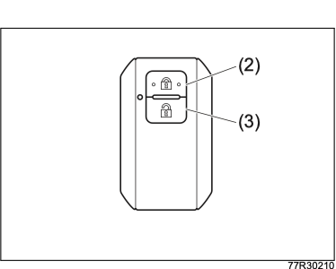{ .center-image }

(2) Кнопка запирания.  
(3) Кнопка отпирания.

После выполнения этой процедуры режим дистанционного складывания переключается в следующем порядке:

| Режим дистанционного складывания | Подтверждающий зуммер |
| --- | --- |
| Отключено | 1 сигнал |
| Включено | 1 сигнал |

Если шаги 3 и 4 выполнены неправильно или не уложились в 15 секунд, режим не изменится и подтверждающий зуммер не прозвучит. Повторите процедуру с начала.

#### Выключатель обогрева наружных зеркал

!!! tip "Оборудование по типу автомобиля"
    Комплектация зависит от типа автомобиля.

Обогрев наружных зеркал работает вместе с обогревом заднего стекла.

См. также: [5-31: выключатель обогрева заднего стекла](05-equipment.md#5-31-выключатель-обогрева-заднего-стекла).

### Регулировка рулевой колонки по высоте

#### Регулировка высоты рулевого колеса

!!! danger "Внимание"
    Обязательно отрегулируйте рулевое колесо до начала движения. Если регулировать его во время движения, можно ошибиться в управлении или отвлечься от дороги, что может привести к неожиданной аварии.

1. Освободите фиксатор рулевой колонки.

    Удерживая рулевое колесо одной рукой, другой рукой опустите рычаг фиксатора под рулевой колонкой.

2. Переместите рулевое колесо вверх или вниз и установите его на удобной высоте.
3. Зафиксируйте рулевую колонку.

    Удерживая рулевое колесо в выбранном положении, верните рычаг фиксатора в исходное положение до упора.

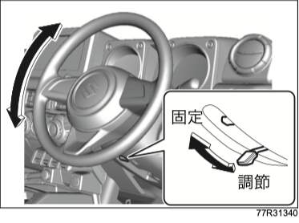{ .center-image }

!!! warning "Осторожно"
    После регулировки слегка покачайте рулевое колесо вверх и вниз и убедитесь, что оно надёжно зафиксировано.

## Регулировка сидений

### Передние сиденья

!!! warning "Осторожно"
    При регулировке сиденья следите, чтобы не защемить руки или ноги и не удариться о детали сиденья.

    См. также: [2-14: рулевое колесо, сиденья и зеркала регулируйте до начала движения](02-safety.md#регулируйте-рулевое-колесо-сиденье-и-зеркала-до-начала-движения).

    После регулировки подвигайте сиденье вперёд и назад и убедитесь, что оно надёжно зафиксировано.

!!! danger "Внимание"
    Не кладите предметы под сиденье. Они могут попасть в механизм и помешать фиксации сиденья.

#### Продольная регулировка

!!! danger "Внимание"
    Обязательно отрегулируйте сиденье до начала движения. Если регулировать его во время движения, можно ошибиться в управлении или отвлечься от дороги, что может привести к неожиданной аварии.

Поднимите рычаг салазок и, удерживая его, переместите сиденье вперёд или назад.

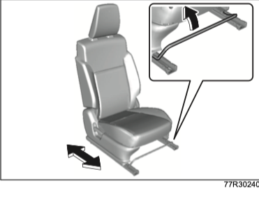{ .center-image }

#### Регулировка угла наклона спинки

- Чтобы откинуть спинку назад, потяните рычаг регулировки наклона и слегка надавите на спинку спиной.
- Чтобы поднять спинку, немного отведите спину от спинки и потяните рычаг регулировки наклона.

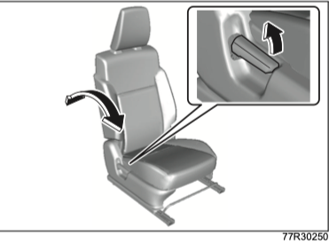{ .center-image }

!!! danger "Внимание"
    Не откидывайте спинку больше необходимого. Иначе ремень безопасности и подушки безопасности SRS не смогут обеспечить расчётную защиту.

!!! warning "Осторожно"
    Если потянуть рычаг регулировки наклона, не придерживая спинку, она может резко подняться и наклониться вперёд. Придерживайте спинку рукой во время регулировки.

#### Регулировка высоты, снятие и установка подголовника

##### Регулировка высоты

Перед началом движения отрегулируйте подголовник так, чтобы его середина была примерно на уровне ушей, и убедитесь, что он надёжно зафиксирован. Если из-за роста это невозможно, установите подголовник в самое высокое фиксируемое положение.

- Чтобы поднять подголовник, потяните его вверх рукой.
- Чтобы опустить подголовник, нажмите кнопку фиксатора (1) и, удерживая её, опустите подголовник.

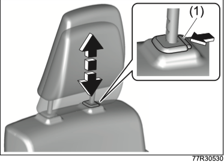{ .center-image }

##### Снятие

Нажмите кнопку фиксатора и, удерживая её, вытяните подголовник вверх.

!!! danger "Внимание"
    Не двигайтесь со снятым подголовником. При ударе сзади голова и шея пассажира будут защищены хуже, а при резком торможении или столкновении подголовник не сможет смягчить удар головы. Это может привести к тяжёлым травмам.

##### Установка

Не перепутайте переднюю и заднюю сторону подголовника. Вставьте стойки в направляющие до фиксируемого положения и отрегулируйте высоту.

!!! danger "Внимание"
    Если установить подголовник задом наперёд или не зафиксировать его надёжно, при аварии он не сможет работать как положено, что может привести к тяжёлым травмам.

    Если подголовник установлен задом наперёд, его нельзя отрегулировать по высоте и зафиксировать. Установите подголовник правильной стороной и надёжно зафиксируйте.

#### Выключатели подогрева сидений

!!! tip "Оборудование по типу автомобиля"
    Комплектация зависит от типа автомобиля.

В сиденья встроены нагреватели, которые подогревают подушку сиденья.

- Когда питание автомобиля находится в режиме `ON`, нажмите выключатель: подогрев включится, а индикатор (1) в выключателе загорится. При повторном нажатии подогрев выключится.
- Когда сиденье прогреется до комфортной температуры, выключите подогрев.

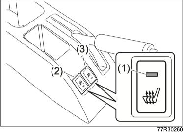{ .center-image }

(2) Выключатель подогрева сиденья водителя.  
(3) Выключатель подогрева сиденья переднего пассажира.

- Следите, чтобы на выключатель не попали вода, напитки и другие жидкости.

См. также: [2-44: если пролили напиток или другую жидкость](02-safety.md#если-пролили-напиток-или-другую-жидкость).

!!! warning "Осторожно"
    Длительное использование подогрева может привести к низкотемпературным ожогам.

    Не кладите на сиденье пледы, подушки и другие теплоизолирующие предметы. Это может привести к перегреву.

!!! info "Примечание"
    Не кладите на сиденье тяжёлый багаж и не втыкайте в сиденье иглы, гвозди и другие острые предметы.

    При уходе за сиденьем не используйте чистящие жидкости с бензином, растворителями, спиртом и похожими веществами. Они могут повредить поверхность сиденья и нагреватель.

    См. также: [6-5: уход за салоном](06-care.md#6-5-уход-за-салоном).

    Если на сиденье пролилась вода, сок или другая жидкость, вытрите её мягкой тканью и дайте сиденью полностью высохнуть перед использованием.

    Для защиты свинцово-кислотного аккумулятора используйте подогрев только при работающем двигателе.

!!! tip "Подсказка"
    Подогрев сиденья не выключается автоматически. Если не выключить его выключателем, он продолжит работать.

### Задние сиденья

#### Регулировка угла наклона спинки

!!! tip "Оборудование по типу автомобиля"
    Комплектация зависит от типа автомобиля.

1. Одной рукой придерживайте спинку, другой рукой полностью потяните вверх ремешок (1) на верхней части спинки.

    Выполняйте эту операцию, выйдя с сиденья. Если тянуть ремешок, сидя на сиденье, спинка может резко сложиться до максимального угла.

    Потяните ремешок до конца. Если пытаться наклонить спинку до полного разблокирования, механизм будет двигаться туго.

2. Удерживая ремешок, наклоните спинку немного дальше нужного положения.

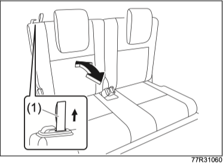{ .center-image }

3. Отпустите ремешок и верните спинку к фиксируемому положению.

!!! danger "Внимание"
    Не откидывайте спинку больше необходимого. Иначе ремень безопасности не сможет обеспечить расчётную защиту.

#### Подголовники задних сидений

!!! tip "Оборудование по типу автомобиля"
    Комплектация зависит от типа автомобиля.

##### Положение при использовании

Перед поездкой поднимите подголовник рукой и убедитесь, что он надёжно зафиксирован.

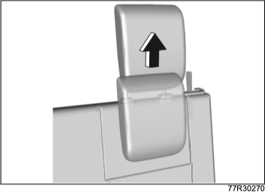{ .center-image }

##### Положение при складывании

Чтобы убрать подголовник, нажмите кнопку фиксатора (1) и, удерживая её, опустите подголовник до нижнего положения.

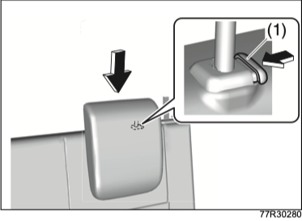{ .center-image }

##### Снятие

Нажмите кнопку фиксатора (1) и, удерживая её, вытяните подголовник вверх.

!!! danger "Внимание"
    Не двигайтесь со снятым подголовником. При ударе сзади голова и шея пассажира будут защищены хуже, а при резком торможении или столкновении подголовник не сможет смягчить удар головы. Это может привести к тяжёлым травмам.

    Перед поездкой обязательно установите подголовник правильно.

!!! warning "Осторожно"
    Не оставляйте снятый подголовник в салоне. При резком торможении он может попасть в пассажира или другой предмет и стать причиной травмы или повреждения.

##### Установка

Не перепутайте переднюю и заднюю сторону подголовника. Вставьте стойки в направляющие до фиксируемого положения и отрегулируйте высоту.

!!! danger "Внимание"
    Если установить подголовник задом наперёд или не зафиксировать его надёжно, при аварии он не сможет работать как положено, что может привести к тяжёлым травмам.

    Если подголовник установлен задом наперёд, его нельзя отрегулировать по высоте и зафиксировать. Установите подголовник правильной стороной и надёжно зафиксируйте.

    Если детское удерживающее устройство упирается в подголовник, его нельзя надёжно закрепить. При установке детского удерживающего устройства поднимите подголовник в самое высокое фиксируемое положение или снимите его.

### Удобное использование сидений

#### Увеличение багажного пространства (задние сиденья)

Если сложить спинки задних сидений вперёд, багажное пространство можно увеличить.

!!! danger "Внимание"
    Не перевозите людей вне посадочных мест. При торможении, разгоне или столкновении их может отбросить, что приведёт к травмам.

!!! warning "Осторожно"
    Перед складыванием спинки уберите багаж и другие предметы с подушки сиденья. Иначе можно повредить сиденье; кроме того, на некоторых автомобилях может сработать предупреждение о непристёгнутом заднем ремне безопасности.

    При складывании спинки следите, чтобы не защемить руки или ноги и не удариться о детали сиденья.

##### Складывание

1. Закрепите ремни безопасности задних сидений в держателях.

    См. также: [3-42: закрепление заднего ремня безопасности в держателе](#закрепление-заднего-ремня-безопасности-в-держателе).

2. Опустите подголовники в самое нижнее положение.

    См. также: [3-32: подголовники задних сидений](#подголовники-задних-сидений).

3. Сложите спинку вперёд.

    На цельной спинке потяните ремешки (1) у обоих плечевых участков спинки и, удерживая их, сложите спинку вперёд.

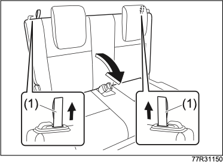{ .center-image }

На раздельной спинке потяните ремешок (1) со стороны нужной секции и, удерживая его, сложите эту секцию вперёд.

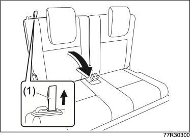{ .center-image }

!!! tip "Подсказка"
    Если при складывании подголовник упирается в переднее сиденье, отрегулируйте продольное положение переднего сиденья или угол наклона его спинки.

##### Возврат в исходное положение

Поднимите спинку и нажмите на неё назад до фиксируемого положения.

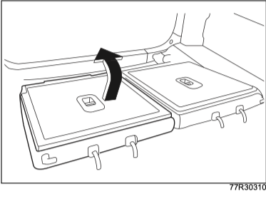{ .center-image }

Изображение приведено как пример. В зависимости от типа автомобиля детали могут отличаться.

!!! warning "Осторожно"
    После возврата спинки убедитесь, что она надёжно зафиксирована. Для проверки слегка покачайте спинку вперёд и назад.

#### Полностью разложенные сиденья

Если откинуть назад спинки передних и задних сидений, в салоне можно получить непрерывную ровную поверхность.

!!! danger "Внимание"
    Не перевозите людей на полностью разложенных сиденьях. Если перевозите багаж, надёжно закрепите его.

    При торможении, разгоне или столкновении пассажира или багаж может отбросить, что приведёт к тяжёлым травмам.

!!! warning "Осторожно"
    Не ходите по полностью разложенным сиденьям. Если нога соскользнёт с сиденья, можно получить травму.

    Когда возвращаете сиденья в обычное положение, подвигайте подушки и спинки и убедитесь, что они надёжно зафиксированы. Если сиденье не зафиксировано, во время движения оно может неожиданно сместиться или спинка может упасть вперёд, что приведёт к травме.

!!! info "Примечание"
    Не подвергайте сиденья сильным ударам. Это может повредить сиденье.

##### Как полностью разложить сиденья

1. Снимите подголовники передних сидений (1) и сдвиньте передние сиденья до упора вперёд.

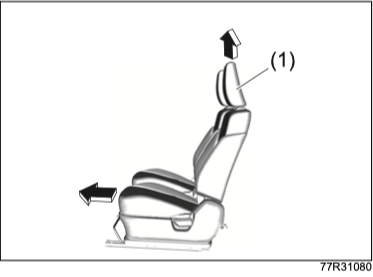{ .center-image }

2. На автомобилях с раздельной спинкой заднего сиденья откиньте спинку назад до упора.

    Заднее сиденье не становится полностью ровным.

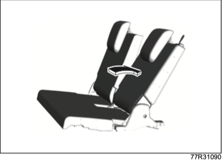{ .center-image }

3. Откиньте спинку переднего сиденья назад до упора.

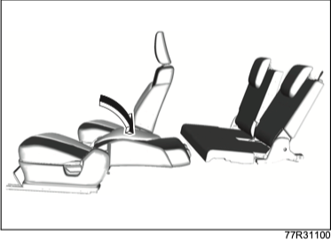{ .center-image }

Изображение приведено как пример. В зависимости от типа автомобиля детали могут отличаться.

4. Сдвиньте переднее сиденье назад до соприкосновения с задним сиденьем.

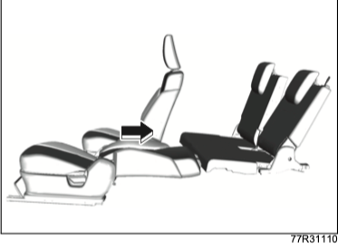{ .center-image }

Изображение приведено как пример. В зависимости от типа автомобиля детали могут отличаться.

##### Возврат в обычное положение

Выполните операции в обратном порядке.

## Ремни безопасности

Ремни безопасности удерживают тело на сиденье и помогают обеспечить безопасность.

Пристёгивайтесь правильно сами и следите, чтобы все пассажиры также были пристёгнуты.

### Дети также должны пристёгиваться ремнями безопасности

См. также: [2-6: если в автомобиле едет ребёнок](02-safety.md#если-в-автомобиле-едет-ребёнок).

!!! danger "Внимание"
    Не разрешайте детям играть с ремнём безопасности. Если ремень обмотается вокруг тела, ребёнок может задохнуться или получить тяжёлые травмы.

    В экстренной ситуации перережьте ремень ножницами.

{ .center-image }

### Беременным и людям с заболеваниями

!!! danger "Внимание"
    Беременным и людям с заболеваниями также следует пристёгиваться ремнём безопасности. Однако при столкновении ремень может сильно сдавить отдельные участки тела, поэтому заранее проконсультируйтесь с врачом.

    Беременным следует располагать поясную часть ремня как можно ниже на бёдрах, не на животе. Плечевая часть должна проходить через грудь, между шеей и плечом, также не по животу.

{ .center-image }

### Сигнализатор непристёгнутого ремня безопасности

!!! tip "Оборудование по типу автомобиля"
    Комплектация зависит от типа автомобиля.

Сигнализатор напоминает о непристёгнутом ремне безопасности.

Если после запуска двигателя и начала движения автомобиль впервые достигает скорости примерно 15 км/ч или выше, а ремень не пристёгнут, контрольная лампа переднего ремня безопасности на панели приборов или контрольная лампа заднего ремня безопасности над внутренним зеркалом переходит из постоянного свечения в мигание. Одновременно периодически звучит предупреждающий зуммер.

См. также: [3-76: контрольная лампа передних ремней безопасности](#3-76-контрольная-лампа-передних-ремней-безопасности).  
См. также: [3-77: контрольная лампа задних ремней безопасности](#3-77-контрольная-лампа-задних-ремней-безопасности).

!!! tip "Подсказка"
    Если пристегнуть ремень, контрольная лампа погаснет, а зуммер остановится.

    Даже если ремень не пристегнуть, зуммер остановится примерно через 95 секунд. При этом контрольная лампа останется гореть после мигания и погаснет только после перевода питания автомобиля в режим `ACC` или `LOCK` (`OFF`).

    Для переднего пассажирского и задних сидений зуммер не звучит, если на сиденье никого нет. Однако он может сработать, если на сиденье лежит багаж.

    Контрольная лампа на панели приборов общая для места водителя и переднего пассажира.

### Регулировка длины ремня безопасности

Длина ремня безопасности не требует ручной регулировки. Ремень вытягивается и втягивается в соответствии с движениями тела, а при сильном ударе или резком вытягивании автоматически блокируется и удерживает тело.

### Как пристегнуть ремень безопасности

#### Передние ремни безопасности

##### Пристёгивание

1. Возьмите язычок ремня (1) и медленно вытяните ремень. Убедитесь, что ремень не перекручен.

{ .center-image }

!!! tip "Подсказка"
    Если ремень заблокировался и не вытягивается, немного отпустите его и снова медленно потяните.

    Если ремень всё равно не вытягивается, один раз сильно потяните его, затем отпустите и снова медленно вытяните.

2. Совместите язычок ремня (1) с прорезью замка (2) и вставьте его до щелчка.

{ .center-image }

3. Потяните ремень и убедитесь, что язычок надёжно зафиксирован в замке.
4. Расположите поясную часть ремня как можно ниже на бёдрах.
5. Проведите плечевую часть ремня по центру между шеей и плечом.
6. Убедитесь, что ремень не перекручен, и уберите слабину.

##### Отстёгивание

Нажмите кнопку замка (3). Ремень автоматически втянется, поэтому придерживайте ремень и язычок рукой и медленно направляйте их назад, чтобы они не ударили по стеклу или отделке.

{ .center-image }

!!! tip "Подсказка"
    Если ремень перекручен, он может плохо отстёгиваться или втягиваться. Следите, чтобы ремень втягивался без перекручивания и слабины.

#### Задние ремни безопасности

##### Пристёгивание

1. Снимите ремень с держателя, возьмите пластину на конце ремня (1) вместе с ремнём и медленно вытяните ремень.

{ .center-image }

2. Убедитесь, что ремень не зацеплен за направляющую (2).

{ .center-image }

При пристёгивании заднего ремня безопасности снимите ремень с направляющей.

3. Убедитесь, что ремень не перекручен. Совместите пластину на конце ремня (1) с наружным замком заднего сиденья (3) и вставьте её до щелчка.

{ .center-image }

{ .center-image }

4. Совместите язычок ремня (4) с прорезью замка (5) в центре заднего сиденья и вставьте его до щелчка.
5. Потяните ремень и убедитесь, что язычок надёжно зафиксирован в замке.
6. Расположите поясную часть ремня как можно ниже на бёдрах.
7. Проведите плечевую часть ремня по центру между шеей и плечом.
8. Убедитесь, что ремень не перекручен, и уберите слабину.

!!! danger "Внимание"
    Чтобы снизить риск тяжёлых травм, задний ремень безопасности нужно пристёгивать в указанном порядке, используя оба замка слева и справа.

    Не используйте только язычок ремня и центральный замок. В этом случае ремень безопасности не сможет работать как положено.

{ .center-image }

{ .center-image }

!!! danger "Внимание"
    Если по ошибке использовать замок соседнего сиденья, ремень безопасности не сможет работать как положено.

    При пристёгивании заднего ремня используйте замок, расположенный ближе всего к вашему месту.

{ .center-image }

##### Отстёгивание

Нажмите кнопку центрального замка. Ремень начнёт автоматически втягиваться, поэтому придерживайте ремень и пластину рукой и медленно направляйте их назад. Ремень втянется автоматически до положения, показанного на рисунке.

{ .center-image }

##### Закрепление заднего ремня безопасности в держателе

1. Вставьте ключ в кнопку разблокировки (1) наружного замка и снимите пластину на конце ремня (2).

    Ремень начнёт автоматически втягиваться, поэтому придерживайте ремень и пластину рукой и медленно направляйте их назад.

{ .center-image }

!!! warning "Осторожно"
    При нажатии кнопки разблокировки придерживайте ремень рукой. Автоматически втягивающаяся пластина может ударить по телу и травмировать.

2. Закрепите ремень (3) на держателе (4), как показано на рисунке.

{ .center-image }

### Правильное использование ремня безопасности

!!! danger "Внимание"
    Пристёгивайтесь правильно. Если ремень надет неправильно, при резком торможении или столкновении тело не будет удержано, что может привести к тяжёлым травмам.

    Следите, чтобы ремень не был перекручен и не провисал. Иначе при ударе отдельные участки тела могут быть сильно сдавлены.

    Поясная часть ремня должна проходить как можно ниже на бёдрах, а не по животу. Иначе при ударе внутренние органы могут быть сильно сдавлены.

    Плечевая часть ремня должна плотно проходить по плечу. Если она не прилегает к плечу, при ударе вас может отбросить вперёд.

### Обращение с ремнями безопасности и уход

#### Обращение

Если на заднем сиденье никто не сидит, закрепите ремень (1) на держателе (2), как показано на рисунке.

См. также: [3-42: закрепление заднего ремня безопасности в держателе](#закрепление-заднего-ремня-безопасности-в-держателе).

Перед использованием заднего ремня снимите его с держателя.

См. также: [3-40: пристёгивание заднего ремня безопасности](#задние-ремни-безопасности).

{ .center-image }

!!! danger "Внимание"
    Если на ремне есть бахрома, потёртости или надрезы, замените ремень.

    Если замок работает неправильно, обратитесь к дилеру Suzuki или представителю Suzuki для проверки.

    Если при столкновении на ремень пришлась большая нагрузка, его функции могут быть нарушены даже без заметных внешних повреждений. Замените ремень.

    Чтобы ремень при необходимости работал правильно, соблюдайте следующие правила:

    - если внутрь замка попал посторонний предмет или вы пролили в замок напиток, обратитесь к дилеру Suzuki или представителю Suzuki для проверки;
    - не допускайте зажатия ремня дверью. Перед закрыванием двери убедитесь, что ремень втянулся без слабины;
    - не модифицируйте и не снимайте ремни безопасности.

#### Уход

Уход за ремнями безопасности выполняется так же, как уход за тканевыми материалами салона.

См. также: [6-5: уход за тканью, искусственной кожей и пластиковыми деталями](06-care.md#6-5-уход-за-тканью-искусственной-кожей-и-пластиковыми-деталями).

!!! danger "Внимание"
    Не используйте отбеливатели, растворители и красители. Они могут вызвать пятна, изменение цвета или снижение прочности, и ремень безопасности может не сработать как положено.

### Преднатяжители ремней безопасности (передние сиденья)

#### Что такое преднатяжитель ремня безопасности

Когда питание автомобиля находится в режиме `ON`, преднатяжитель мгновенно втягивает плечевую часть ремня в следующих ситуациях:

- при сильном фронтальном ударе: работает вместе с фронтальными подушками безопасности SRS водителя и переднего пассажира;
- при сильном боковом ударе в зоне переднего пассажира: работает вместе с боковыми подушками безопасности SRS и шторками безопасности SRS, если они установлены.

См. также: [3-53: работа системы подушек безопасности SRS](#3-53-работа-системы-srs-airbag).

{ .center-image }

!!! danger "Внимание"
    Сработавшие преднатяжители и подушки безопасности нельзя использовать повторно. Обратитесь к дилеру Suzuki или на сервисную станцию Suzuki для замены.

#### Чтобы преднатяжители работали правильно

Не воздействуйте на детали, влияющие на работу преднатяжителей ремней безопасности. Иначе ремень может втянуться неожиданно или, наоборот, не втянуться тогда, когда это необходимо.

См. также: [2-43: при установке, снятии или ремонте деталей](02-safety.md#при-установке-снятии-или-ремонте-деталей).

#### Контрольная лампа подушек безопасности SRS

{ .center-image }

Контрольная лампа находится на панели приборов.

Она загорается при питании автомобиля в режиме `ON`, если сработали преднатяжители ремней безопасности или подушки безопасности SRS либо если в электронной системе управления обнаружена неисправность.

См. также: [1-17: предупреждающие лампы](01-quick-guide.md#предупреждающие-лампы).

#### Утилизация и списание автомобиля

Преднатяжители ремней безопасности, которые не сработали, перед утилизацией необходимо активировать в установленном порядке.

!!! warning "Осторожно"
    Перед утилизацией преднатяжителей или списанием автомобиля обратитесь к дилеру Suzuki или представителю Suzuki.

### Ограничители усилия ремней безопасности (передние сиденья и боковые места заднего сиденья)

При аварии, когда ремень безопасности подвергается сильному натяжению, ограничитель усилия снижает нагрузку на грудную клетку пассажира.

{ .center-image }

!!! danger "Внимание"
    После сильного удара пластиковые элементы в зоне плечевого крепления ремня (1) и язычка ремня (2) могут оплавиться от сильного трения, а сам ремень может начать проскальзывать. В этом случае ремень безопасности не сможет работать как положено, что может привести к тяжёлым травмам.

    Обратитесь к дилеру Suzuki или представителю Suzuki для замены ремня безопасности.

{ .center-image }

## Подушки безопасности SRS

### Если автомобиль оснащён подушками безопасности SRS

#### Что такое система подушек безопасности SRS

SRS — сокращение от Supplemental Restraint System, дополнительной удерживающей системы.

!!! tip "Подсказка"
    Автомобиль оснащён регистратором событий EDR. Если срабатывают подушки безопасности SRS, система записывает и сохраняет данные о событии.

    См. также: [запись данных автомобиля](00-introduction.md#запись-данных-автомобиля).

#### Фронтальные подушки безопасности SRS водителя и переднего пассажира

Когда питание автомобиля находится в режиме `ON`, при сильном фронтальном столкновении фронтальные подушки безопасности SRS водителя и переднего пассажира мгновенно раскрываются, если удар достаточно силён, чтобы водитель или передний пассажир могли удариться лицом о рулевое колесо или панель приборов даже при пристёгнутом ремне безопасности.

Фронтальные подушки безопасности SRS работают как амортизирующая подушка и помогают снизить удар по лицу водителя и переднего пассажира, пристёгнутых ремнями безопасности. Ремни безопасности обязательно должны быть пристёгнуты.

См. также: [3-38: как пристегнуть ремень безопасности](#как-пристегнуть-ремень-безопасности).

{ .center-image }

#### Боковые подушки безопасности SRS

Когда питание автомобиля находится в режиме `ON`, при сильном боковом ударе в зоне передних сидений боковая подушка безопасности SRS на стороне удара мгновенно раскрывается вместе со шторкой безопасности SRS, если она установлена. Это происходит, когда дверь или другие детали могут ударить в грудную клетку водителя или переднего пассажира.

Боковая подушка безопасности SRS работает как амортизирующая подушка и помогает снизить удар по грудной клетке водителя или переднего пассажира, пристёгнутого ремнём безопасности. Ремень безопасности обязательно должен быть пристёгнут.

См. также: [3-38: как пристегнуть ремень безопасности](#как-пристегнуть-ремень-безопасности).

{ .center-image }

(1) Боковая подушка безопасности SRS.

На рисунке показано срабатывание со стороны водителя.

#### Система шторок безопасности SRS

Когда питание автомобиля находится в режиме `ON`, при сильном боковом ударе в зоне передних сидений шторка безопасности SRS на стороне удара мгновенно раскрывается вместе с боковой подушкой безопасности SRS, если она установлена. Это происходит, когда дверь или другие детали могут ударить в голову водителя, переднего пассажира или бокового пассажира заднего сиденья.

Шторка безопасности SRS работает как амортизирующая подушка и помогает снизить удар по голове водителя, переднего пассажира или бокового пассажира заднего сиденья, пристёгнутого ремнём безопасности. Ремень безопасности обязательно должен быть пристёгнут.

См. также: [3-38: как пристегнуть ремень безопасности](#как-пристегнуть-ремень-безопасности).

{ .center-image }

(2) Шторка безопасности SRS.

На рисунке показано срабатывание со стороны водителя.

!!! danger "Внимание"
    Система подушек безопасности SRS не заменяет ремни безопасности. Она дополняет ремни безопасности и работает эффективно только вместе с ними. Даже если автомобиль оснащён подушками безопасности SRS, обязательно пристегивайтесь ремнём безопасности.

    Сидите в правильной позе и правильно располагайте ремень безопасности. Если ремень безопасности расположен неправильно, подушки безопасности SRS не смогут обеспечить расчётную защиту.

{ .center-image }

!!! tip "Подсказка"
    Фронтальная подушка безопасности SRS переднего пассажира раскрывается одновременно с фронтальной подушкой безопасности SRS водителя, даже если на переднем пассажирском сиденье никого нет.

    Боковые подушки безопасности SRS и шторки безопасности SRS раскрываются на стороне удара независимо от того, заняты ли сиденья.

#### Маркировка и места установки

Подушки безопасности SRS установлены рядом с местами, где есть надпись `SRS AIRBAG`.

##### Фронтальная подушка безопасности SRS водителя

{ .center-image }

##### Фронтальная подушка безопасности SRS переднего пассажира

{ .center-image }

##### Боковая подушка безопасности SRS

Боковые подушки безопасности SRS размещены со стороны дверей в спинках передних сидений. На передних сиденьях есть бирки, как показано на рисунке.

{ .center-image }

(1) Боковая подушка безопасности SRS.

##### Шторка безопасности SRS

Шторки безопасности SRS размещены вдоль боковых частей крыши со стороны водителя и переднего пассажира. На стойках есть маркировка, как показано на рисунке.

{ .center-image }

(2) Шторка безопасности SRS.

!!! danger "Внимание"
    Если в месте установки подушки безопасности есть повреждения или трещины, обратитесь к дилеру Suzuki или представителю Suzuki для замены деталей. Иначе подушка безопасности может сработать неправильно.

    Не ударяйте и не подвергайте сильным ударам места установки подушек безопасности. Не закрывайте переднюю дверь с такой силой, чтобы могло разбиться стекло. Подушка безопасности может сработать неправильно или раскрыться случайно, что приведёт к травме.

#### Посадка

Водитель и передний пассажир должны сидеть глубоко на сиденье, слегка опираясь спиной на спинку. Отрегулируйте положение сиденья так, чтобы оно не было сдвинуто слишком далеко вперёд.

Передний пассажир должен отодвинуть сиденье назад настолько, чтобы не мешать пассажиру заднего сиденья, и сидеть на достаточном расстоянии от фронтальной подушки безопасности SRS переднего пассажира.

См. также: [2-14: правильная посадка](02-safety.md#сохраняйте-правильную-посадку).

!!! danger "Внимание"
    При срабатывании боковой подушки безопасности SRS или шторки безопасности SRS можно получить сильный удар, что может привести к тяжёлой травме. Не высовывайте руки из окна и не прислоняйтесь к двери.

    Пассажирам заднего сиденья не следует обхватывать спинку переднего сиденья. Особенно следите за детьми.

{ .center-image }

{ .center-image }

#### Установка детского удерживающего устройства

См. также:

- [2-8: использование детского удерживающего устройства](02-safety.md#использование-детских-удерживающих-устройств);
- [3-59: выбор детского удерживающего устройства](#выбор-детского-удерживающего-устройства);
- [3-66: крепление детского удерживающего устройства ремнём безопасности](#крепление-детского-удерживающего-устройства-ремнем-безопасности).

### Обращение с системой подушек безопасности SRS

#### Чтобы система подушек безопасности SRS работала правильно

Если в зоне раскрытия подушки безопасности SRS находятся предметы, они могут отлететь при срабатывании подушки. Кроме того, подушка может раскрыться неправильно.

!!! danger "Внимание"
    Не изменяйте подвеску. Если изменится высота автомобиля или жёсткость подвески, это может привести к неправильному срабатыванию подушек безопасности SRS.

    Не устанавливайте на переднюю часть автомобиля детали, не относящиеся к оригинальным деталям Suzuki. Изменения передней части автомобиля могут нарушить работу подушек безопасности SRS.

    Перед установкой радиостанции и другого электрооборудования обратитесь к дилеру Suzuki или представителю Suzuki. Радиопомехи от такого оборудования могут повлиять на блок управления подушками безопасности SRS.

    Даже при слабом столкновении, при котором подушки безопасности SRS не сработали, после аварии обратитесь к дилеру Suzuki или представителю Suzuki для проверки. Если функции системы нарушены, подушки безопасности SRS могут не обеспечить расчётную защиту при следующей аварии.
