# 4. Во время движения

## Содержание главы

| Раздел | Подраздел | Страница |
| --- | --- | --- |
| Запуск и остановка двигателя | [Работа выключателя двигателя](#работа-выключателя-двигателя) | 4-2 |
| Запуск и остановка двигателя | [Система иммобилайзера](#система-иммобилайзера) | 4-4 |
| Запуск и остановка двигателя | [Система бесключевого запуска кнопкой](#система-бесключевого-запуска-кнопкой) | 4-6 |
| Запуск и остановка двигателя | [Запуск двигателя](#запуск-двигателя) | 4-10 |
| Запуск и остановка двигателя | [Остановка двигателя](#остановка-двигателя) | 4-13 |
| Бензиновый сажевый фильтр GPF | [Бензиновый сажевый фильтр GPF](#бензиновый-сажевый-фильтр-gpf) | 4-16 |
| Система автоматической остановки двигателя | [Система автоматической остановки двигателя](#система-автоматической-остановки-двигателя-на-холостом-ходу) | 4-17 |
| Система автоматической остановки двигателя | [Настройка климатической системы при автоматической остановке двигателя](#настройка-климатической-системы-при-автоматической-остановке-двигателя) | 4-27 |
| Стояночный тормоз | [Управление стояночным тормозом](#управление-стояночным-тормозом) | 4-27 |
| Рычаг переключения передач | [Управление рычагом переключения передач](#управление-рычагом-переключения-передач) | 4-28 |
| Автомобиль с автоматической коробкой передач | [Управление селектором передач](#управление-селектором-передач) | 4-30 |
| Автомобиль с автоматической коробкой передач | [Особенности автомобиля с автоматической коробкой передач](#особенности-автомобиля-с-автоматической-коробкой-передач) | 4-33 |
| Автомобиль с автоматической коробкой передач | [При движении на автомобиле с автоматической коробкой передач](#при-движении-на-автомобиле-с-автоматической-коробкой-передач) | 4-35 |
| Автомобиль с автоматической коробкой передач | [Как управлять автомобилем с автоматической коробкой передач](#как-управлять-автомобилем-с-автоматической-коробкой-передач) | 4-37 |
| Автомобиль с приводом 4WD | [Переключение 2WD/4WD](#переключение-2wd4wd) | 4-42 |
| ESP® | [Эксплуатация ESP®](#эксплуатация-esp) | 4-48 |
| ESP® | [ABS](#abs) | 4-53 |
| ESP® | [Система удержания на подъёме](#система-удержания-на-подъёме) | 4-57 |
| ESP® | [Система помощи при спуске](#система-помощи-при-спуске) | 4-59 |
| Системы помощи водителю Suzuki Safety Support | [Системы помощи водителю Suzuki Safety Support](#системы-помощи-водителю-suzuki-safety-support) | 4-62 |
| Системы помощи водителю Suzuki Safety Support | [Система поддержки торможения с двумя датчиками DSBS II](#система-поддержки-торможения-с-двумя-датчиками-dsbs-ii) | 4-78 |
| Системы помощи водителю Suzuki Safety Support | [Предотвращение ошибочного начала движения](#предотвращение-ошибочного-начала-движения) | 4-87 |
| Системы помощи водителю Suzuki Safety Support | [Предотвращение схода с полосы](#предотвращение-схода-с-полосы) | 4-91 |
| Системы помощи водителю Suzuki Safety Support | [Уведомление о начале движения](#уведомление-о-начале-движения) | 4-97 |
| Системы помощи водителю Suzuki Safety Support | [Система автоматического дальнего света](#система-автоматического-дальнего-света) | 4-99 |
| Системы помощи водителю Suzuki Safety Support | [Распознавание дорожных знаков](#распознавание-дорожных-знаков) | 4-103 |
| Системы помощи водителю Suzuki Safety Support | [Адаптивный круиз-контроль](#адаптивный-круиз-контроль) | 4-107 |
| Системы помощи водителю Suzuki Safety Support | [Адаптивный круиз-контроль с функцией следования во всём диапазоне скоростей](#адаптивный-круиз-контроль-с-функцией-следования-во-всём-диапазоне-скоростей) | 4-117 |
| Системы помощи водителю Suzuki Safety Support | [Датчики парковки](#парковочные-датчики) | 4-127 |
| Системы помощи водителю Suzuki Safety Support | [Система помощи при торможении на малой скорости при движении вперёд и назад](#система-помощи-при-торможении-на-малой-скорости-при-движении-вперёд-и-назад) | 4-131 |
| Системы помощи водителю Suzuki Safety Support | [Предотвращение ошибочного начала движения назад](#предотвращение-ошибочного-начала-движения-назад) | 4-137 |
| Камера заднего вида | [Камера заднего вида](#камера-заднего-вида) | 4-141 |

## Запуск и остановка двигателя

### Работа выключателя двигателя

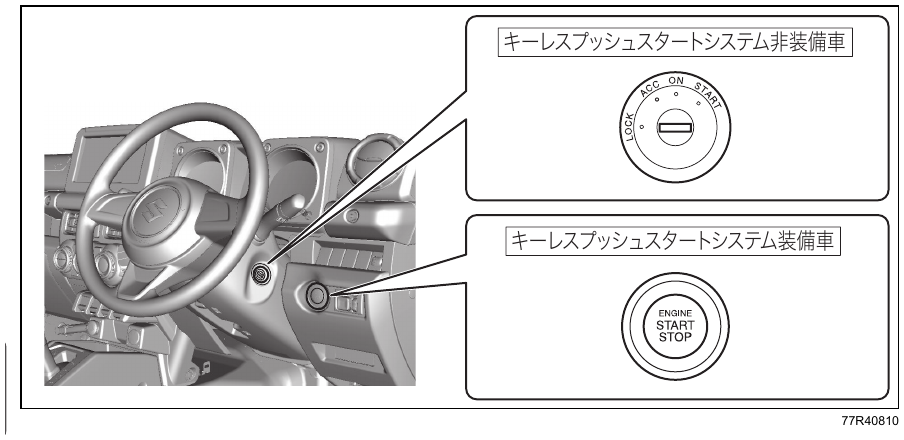{ .center-image }

- Иллюстрация приведена как пример. Фактический вид зависит от комплектации автомобиля.
- Перед запуском двигателя прочитайте раздел [запуск двигателя](#запуск-двигателя).

#### Автомобили без системы бесключевого запуска кнопкой

| Положение выключателя двигателя | Состояние двигателя | Назначение |
| --- | --- | --- |
| `LOCK` (`OFF`) | Остановлен | Положение для стоянки и для вставления или извлечения ключа. Когда ключ вынут, рулевая колонка блокируется. |
| `ACC` | Остановлен | Положение для использования дверных зеркал, аудиосистемы, розетки электропитания и другого электрооборудования без запуска двигателя. |
| `ON` | Остановлен | Положение для использования электростеклоподъёмников, стеклоочистителей и другого электрооборудования без запуска двигателя. Загорается комбинация приборов. |
| `ON` | Работает | Можно пользоваться всем электрооборудованием. Это обычное положение во время движения. |
| `START` | Запуск | Положение для запуска двигателя. После запуска отпустите ключ. Ключ автоматически вернётся в положение `ON`. |

#### Автомобили с системой бесключевого запуска кнопкой

| Положение выключателя двигателя | Состояние двигателя | Назначение |
| --- | --- | --- |
| `LOCK` (`OFF`) | Остановлен | Положение для стоянки. Если вернуть выключатель двигателя в положение `LOCK` (`OFF`) и открыть или закрыть любую дверь, рулевая колонка блокируется. |
| `ACC` | Остановлен | Положение для использования дверных зеркал, аудиосистемы, розетки электропитания и другого электрооборудования без запуска двигателя. |
| `ON` | Остановлен | Положение для использования электростеклоподъёмников, стеклоочистителей и другого электрооборудования без запуска двигателя. Загорается комбинация приборов. |
| `ON` | Работает | Можно пользоваться всем электрооборудованием. Это обычное положение во время движения. |
| `START` | Запуск | Положение для запуска двигателя. См. [запуск двигателя](#запуск-двигателя). |

О переключении положений выключателя двигателя см. раздел [система бесключевого запуска кнопкой](#система-бесключевого-запуска-кнопкой).

- В зависимости от положения выключателя двигателя на комбинации приборов загораются контрольные лампы и индикаторы. Подробнее см. [предупреждающие лампы и индикаторы](03-before-driving.md#контрольные-лампы-и-индикаторы).
- В зависимости от положения выключателя двигателя на многофункциональном информационном дисплее отображаются сообщения. Подробнее см. [сообщения многофункционального информационного дисплея](03-before-driving.md#сообщения-многофункционального-информационного-дисплея).

!!! info "Примечание"
    Когда двигатель остановлен, не оставляйте выключатель двигателя в положении `ACC` или `ON`. Также не пользуйтесь в этом состоянии аудиосистемой и другим электрооборудованием длительное время. Это может привести к разряду свинцово-кислотной аккумуляторной батареи.

!!! tip "Подсказка"
    Обычно блокировка рулевой колонки снимается при переводе выключателя двигателя из положения `LOCK` (`OFF`) в положение `ACC` или `ON`.

    На автомобилях с системой бесключевого запуска кнопкой под воздействием сильных радиоволн или электрических помех на многофункциональном информационном дисплее может появиться сообщение, а переключение питания или запуск двигателя могут оказаться невозможными.

#### Если блокировка рулевой колонки не снимается

На многофункциональном информационном дисплее появляется сообщение, и двигатель не запускается. Слегка покачайте рулевое колесо влево и вправо, одновременно нажимая выключатель двигателя.

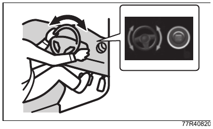{ .center-image }

Сообщение: «Рулевая колонка не разблокирована».

#### Предупреждение о неразблокированной рулевой колонке

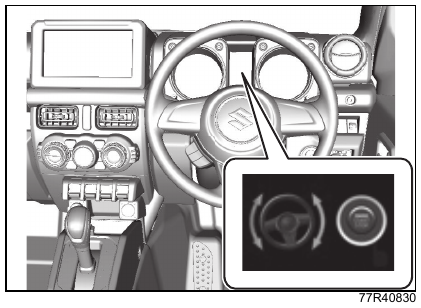{ .center-image }

Сообщение: «Рулевая колонка не разблокирована».

Это сообщение отображается на комбинации приборов.

Когда выключатель двигателя находится в положении `ON`, сообщение появляется на многофункциональном информационном дисплее. Подробнее см. [сообщения многофункционального информационного дисплея](03-before-driving.md#сообщения-многофункционального-информационного-дисплея).

### Система иммобилайзера

Система иммобилайзера предназначена для защиты от угона. Она позволяет запустить двигатель только зарегистрированным ключом дистанционного управления или пультом дистанционного управления, который обменивается с автомобилем радиосигналами.

- Если запуск двигателя разрешён, при наличии пульта дистанционного управления и переводе выключателя двигателя в положение `ON` система иммобилайзера отключается. Контрольная лампа иммобилайзера на комбинации приборов загорается примерно на 2 секунды, затем гаснет.
- Когда выключатель двигателя переводится в положение `LOCK` (`OFF`), система иммобилайзера включается.

!!! info "Примечание"
    Не изменяйте и не снимайте систему иммобилайзера. После изменения или снятия система может работать неправильно.

!!! tip "Подсказка"
    Система иммобилайзера не требует технического обслуживания.

#### Контрольная лампа иммобилайзера

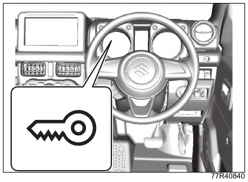{ .center-image }

Лампа расположена на комбинации приборов.

Если в системе иммобилайзера или системе бесключевого запуска кнопкой есть неисправность, при положении выключателя двигателя `ON` лампа загорается.

См. также: [предупреждающие лампы](01-quick-guide.md#предупреждающие-лампы) и [предупреждающая лампа иммобилайзера](03-before-driving.md#контрольная-лампа-иммобилайзера).

##### Автомобили без системы бесключевого запуска кнопкой

Если лампа мигает, двигатель запустить нельзя.

- Если лампа мигает, верните выключатель двигателя в исходное положение, затем снова переведите его в положение `ON`.
- Если лампа продолжает мигать, возможна неисправность системы. Обратитесь к дилеру Suzuki или в авторизованный сервис Suzuki.

!!! tip "Подсказка"
    В следующих случаях автомобиль может не получить сигнал от ключа дистанционного управления, и запуск двигателя может оказаться невозможным:

    - головка ключа соприкасается с металлическим предметом;
    - ключ дистанционного управления находится рядом с другим ключом дистанционного управления или наложен на него.

    См. также: [ключи](03-before-driving.md#ключи).

##### Автомобили с системой бесключевого запуска кнопкой

- Если лампа мигает или горит примерно 5 секунд, двигатель может не запуститься. Проверьте расположение пульта дистанционного управления, верните выключатель двигателя в положение `LOCK` (`OFF`) и повторите операцию.
  См. также: [если главная предупреждающая лампа мигает и двигатель не запускается](#если-главная-предупреждающая-лампа-мигает-и-двигатель-не-запускается).
- Лампа также мигает при срабатывании предупреждения о выносе пульта дистанционного управления из автомобиля.
  См. также: [предупреждение о выносе пульта дистанционного управления из автомобиля](#предупреждение-о-выносе-пульта-дистанционного-управления-из-автомобиля).

!!! tip "Подсказка"
    Когда лампа горит или мигает, на многофункциональном информационном дисплее может отображаться сообщение.

    См. также: [сообщения многофункционального информационного дисплея](03-before-driving.md#сообщения-многофункционального-информационного-дисплея).

### Система бесключевого запуска кнопкой

Если пульт дистанционного управления находится у водителя и попадает в зону действия внутри салона, кроме верхней части панели приборов и багажного отделения, выключатель двигателя позволяет запустить двигатель и переключать питание автомобиля.

См. также: [запуск двигателя](#запуск-двигателя) и [переключение питания](#переключение-питания).

Кроме того, система выполняет следующие функции:

- бесключевой доступ;
  см. [система бесключевого доступа](03-before-driving.md#система-бесключевого-доступа);
- запирание и отпирание дверей наружной кнопкой;
  см. [пульт дистанционного управления](03-before-driving.md#пульт-дистанционного-управления);
- иммобилайзер;
  см. [система иммобилайзера](#система-иммобилайзера).

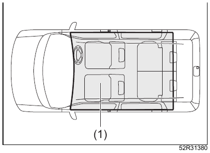{ .center-image }

| Обозначение | Описание |
| --- | --- |
| (1) | Зона действия внутри салона |

!!! tip "Подсказка"
    Даже если пульт дистанционного управления находится в зоне действия внутри салона, он может не распознаваться. В этом случае запуск двигателя или переключение питания могут оказаться невозможными, а также может сработать предупреждение о выносе пульта дистанционного управления из автомобиля.

    Возможные причины:

    - элемент питания пульта дистанционного управления разряжен;
    - пульт находится под воздействием сильных радиосигналов или помех;
    - пульт соприкасается с металлическим предметом или закрыт металлическим предметом;
    - пульт находится в глубине салона или в вещевом отделении.

    См. также: [места для хранения в панели приборов](05-equipment.md#места-для-хранения-в-панели-приборов), [подстаканники центральной консоли](05-equipment.md#подстаканники-центральной-консоли) и [другое оборудование](05-equipment.md#другое-оборудование).

    Пульт также может не распознаваться, если он находится перед комбинацией приборов, на солнцезащитном козырьке, на полу или в багажном отделении, включая полку багажника.

    Даже если пульт дистанционного управления находится вне зоны действия внутри салона, он может быть распознан. В этом случае запуск двигателя или переключение питания могут стать возможными, а предупреждение о выносе пульта из автомобиля может не сработать.

    Возможные причины:

    - пульт находится снаружи автомобиля, но слишком близко к двери;
    - пульт лежит на панели приборов.

#### Переключение питания

Если нужно использовать электрооборудование или проверить комбинацию приборов без запуска двигателя, переключайте положение выключателя двигателя следующим образом. Эта операция называется переключением питания.

При переключении питания на многофункциональном информационном дисплее отображается сообщение.

См. также: [сообщения многофункционального информационного дисплея](03-before-driving.md#сообщения-многофункционального-информационного-дисплея).

1. Возьмите пульт дистанционного управления с собой и сядьте на водительское сиденье.
2. Для автомобиля с механической коробкой передач нажмите выключатель двигателя (1), не нажимая педаль сцепления.

   Для автомобиля с автоматической коробкой передач нажмите выключатель двигателя (1), не нажимая педаль тормоза.

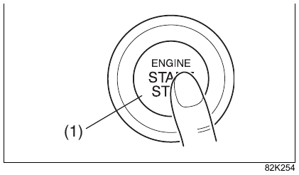{ .center-image }

| Обозначение | Описание |
| --- | --- |
| (1) | Выключатель двигателя |

При каждом нажатии положение выключателя двигателя переключается, как показано ниже.

| Автомобиль | Схема переключения |
| --- | --- |
| С механической коробкой передач | 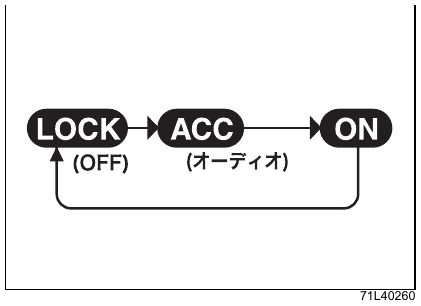 |
| С автоматической коробкой передач | 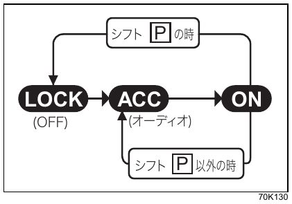 |

!!! tip "Подсказка"
    На автомобиле с автоматической коробкой передач выключатель двигателя нельзя вернуть в положение `LOCK` (`OFF`), если селектор находится не в положении `P`.

    Из-за неисправности селектора или другой причины выключатель двигателя может не вернуться в положение `LOCK` (`OFF`).

    См. также: [возврат выключателя двигателя](#когда-переводите-выключатель-двигателя-в-lock).

#### Если главная предупреждающая лампа мигает и питание не переключается

Возможная причина: пульт дистанционного управления не распознаётся в [зоне действия внутри салона](#зона-обнаружения-пульта-в-салоне). Возьмите пульт при себе и повторите операцию.

Если питание всё равно не переключается, возможно, разрядился элемент питания пульта. Выполните переключение следующим способом.

1. Для автомобиля с механической коробкой передач нажмите выключатель двигателя (1), не нажимая педаль сцепления.

   Для автомобиля с автоматической коробкой передач нажмите выключатель двигателя (1), не нажимая педаль тормоза.

2. В течение примерно 10 секунд, пока на комбинации приборов мигает главная предупреждающая лампа, приложите переднюю часть пульта дистанционного управления (2) со стороны кнопки блокировки к выключателю двигателя примерно на 2 секунды.

   Во время мигания главной предупреждающей лампы предупреждающая лампа иммобилайзера загорается примерно на 5 секунд.

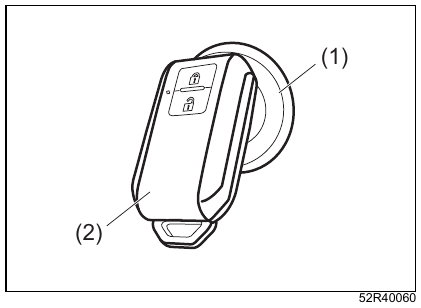{ .center-image }

| Обозначение | Описание |
| --- | --- |
| (1) | Выключатель двигателя |
| (2) | Пульт дистанционного управления |

Если питание не переключается даже после этой операции, возможна другая причина, например разряд свинцово-кислотной аккумуляторной батареи. Обратитесь к дилеру Suzuki или в авторизованный сервис Suzuki.

!!! tip "Подсказка"
    С помощью настройки можно включить однократный сигнал зуммера в салоне для предупреждения о том, что пульт дистанционного управления находится вне зоны обнаружения. Для изменения настройки обратитесь к дилеру Suzuki или в авторизованный сервис Suzuki.

    Когда элемент питания пульта дистанционного управления близок к разряду, при переводе выключателя двигателя в положение `ON` на многофункциональном информационном дисплее появляется сообщение.

    См. также: [сообщения многофункционального информационного дисплея](03-before-driving.md#список-сообщений-многофункционального-информационного-дисплея) и [замена элемента питания пульта дистанционного управления](06-care.md#замена-элемента-питания-пульта-дистанционного-управления).

#### Предупреждение о выносе пульта дистанционного управления из автомобиля

Если во время работы двигателя или при управлении выключателем двигателя пульт дистанционного управления не распознаётся, автомобиль предупреждает об этом следующими способами:

- предупреждающая лампа иммобилайзера;
- главная предупреждающая лампа;
- зуммер в салоне или наружный зуммер;
  см. [предупреждающий зуммер](01-quick-guide.md#предупреждающий-зуммер);
- сообщение на многофункциональном информационном дисплее;
  см. [сообщения многофункционального информационного дисплея](03-before-driving.md#сообщения-многофункционального-информационного-дисплея).

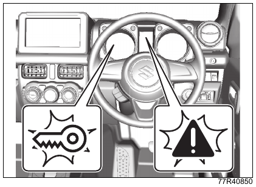{ .center-image }

Когда предупреждение сработало, сразу верните пульт дистанционного управления в салон.

- Пока предупреждение активно, двигатель нельзя запустить повторно.
- Мигание предупреждающей лампы иммобилайзера и главной предупреждающей лампы обычно прекращается вскоре после того, как пульт вернули в салон. Если мигание не прекращается, верните выключатель двигателя в положение `LOCK` (`OFF`) и повторите операцию.

!!! tip "Подсказка"
    Пульт дистанционного управления должен находиться у водителя. Следите за ним самостоятельно.

#### Подсветка выключателя двигателя

- Когда двигатель остановлен, подсветка загорается при открывании двери водителя. После закрывания двери водителя подсветка горит около 15 секунд, затем постепенно гаснет.
- Подсветка горит, пока включены фары или габаритные огни. После выключения наружного освещения подсветка гаснет.

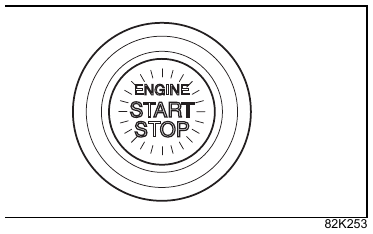{ .center-image }

!!! tip "Подсказка"
    Для защиты свинцово-кислотной аккумуляторной батареи подсветка выключателя двигателя автоматически гаснет при одновременном выполнении следующих условий:

    - фары и габаритные огни выключены;
    - дверь водителя остаётся открытой около 15 минут.

### Запуск двигателя

Также прочитайте раздел [при запуске двигателя](02-safety.md#при-запуске-двигателя).

!!! tip "Подсказка"
    Двигатель запускается легче, если выключить фары, кондиционер и другое электрооборудование.

    Если блокировка рулевой колонки не снята, запуск двигателя может оказаться невозможным.

    См. также: [если блокировка рулевой колонки не снимается](#если-блокировка-рулевой-колонки-не-снимается).

#### Автомобили без системы бесключевого запуска кнопкой

1. Убедитесь, что стояночный тормоз (1) надёжно включён.

   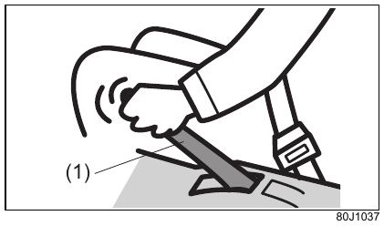{ .center-image }

   | Обозначение | Описание |
   | --- | --- |
   | (1) | Стояночный тормоз |

2. Для автомобиля с механической коробкой передач убедитесь, что рычаг переключения передач находится в положении `N` (нейтраль).

   Для автомобиля с автоматической коробкой передач убедитесь, что селектор находится в положении `P`.

   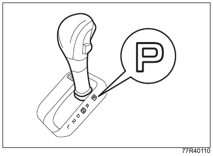{ .center-image }

3. Правой ногой твёрдо нажмите педаль тормоза (2) и продолжайте удерживать её.

   Не нажимайте педаль акселератора (3).

   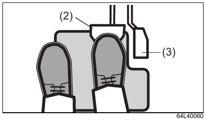{ .center-image }

   | Обозначение | Описание |
   | --- | --- |
   | (2) | Педаль тормоза |
   | (3) | Педаль акселератора |

4. Для автомобиля с механической коробкой передач левой ногой полностью нажмите педаль сцепления (4).

   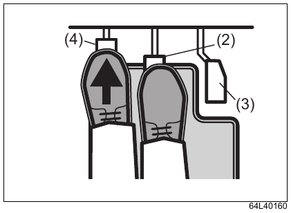{ .center-image }

   | Обозначение | Описание |
   | --- | --- |
   | (2) | Педаль тормоза |
   | (3) | Педаль акселератора |
   | (4) | Педаль сцепления |

##### Система запуска с выжатым сцеплением

На автомобиле с механической коробкой передач стартер не включится и двигатель нельзя будет запустить, если педаль сцепления не нажата полностью.

5. Поверните ключ в положение `START`.

   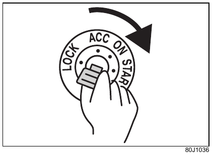{ .center-image }

   Когда двигатель запустится, сразу отпустите ключ.

!!! info "Примечание"
    Для защиты свинцово-кислотной аккумуляторной батареи и стартера не удерживайте ключ в положении `START` дольше 12 секунд. Если двигатель не запускается, верните ключ в положение `LOCK` (`OFF`), подождите не менее 30 секунд и повторите запуск. Если двигатель не запускается после нескольких повторов, обратитесь к дилеру Suzuki или в авторизованный сервис Suzuki.

#### Автомобили с системой бесключевого запуска кнопкой

Пункты 1-4 выполняются так же, как для автомобиля без системы бесключевого запуска кнопкой.

5. Когда на многофункциональном информационном дисплее появится сообщение «Нажмите выключатель двигателя», нажмите выключатель двигателя (1). После запуска двигателя стартер остановится автоматически.

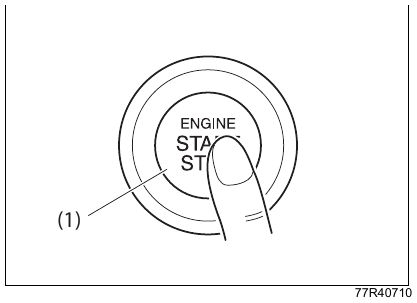{ .center-image }

| Обозначение | Описание |
| --- | --- |
| (1) | Выключатель двигателя |

- Даже если двигатель не запустился, через некоторое время стартер автоматически остановится. После автоматической остановки верните выключатель двигателя в положение `LOCK` (`OFF`), подождите не менее 30 секунд и повторите запуск.
- Если в системе есть неисправность, двигатель может не запускаться автоматически при нажатии выключателя двигателя. В этом случае удерживайте выключатель двигателя, пока двигатель не запустится, но не дольше 12 секунд.

!!! info "Примечание"
    Для защиты свинцово-кислотной аккумуляторной батареи и стартера, если двигатель не запускается, верните выключатель двигателя в положение `LOCK` (`OFF`), подождите не менее 30 секунд и повторите запуск. Если двигатель не запускается после нескольких повторов, обратитесь к дилеру Suzuki или в авторизованный сервис Suzuki.

#### Если главная предупреждающая лампа мигает и двигатель не запускается

Возможная причина: пульт дистанционного управления не распознаётся в [зоне действия внутри салона](#зона-обнаружения-пульта-в-салоне). Возьмите пульт при себе и повторите операцию.

Если двигатель всё равно не запускается, возможно, разрядился элемент питания пульта. Выполните запуск следующим способом.

1. Для автомобиля с автоматической коробкой передач ещё раз убедитесь, что селектор находится в положении `P`, и продолжайте твёрдо нажимать педаль тормоза.
2. Когда на многофункциональном информационном дисплее появится сообщение «Нажмите выключатель двигателя», нажмите выключатель двигателя (1).
3. В течение примерно 10 секунд, пока на комбинации приборов мигает главная предупреждающая лампа, приложите переднюю часть пульта дистанционного управления (2) со стороны кнопки блокировки к выключателю двигателя (1) примерно на 2 секунды.

   Во время мигания главной предупреждающей лампы предупреждающая лампа иммобилайзера загорается примерно на 5 секунд.

{ .center-image }

| Обозначение | Описание |
| --- | --- |
| (1) | Выключатель двигателя |
| (2) | Пульт дистанционного управления |

Если двигатель не запускается даже после этой операции, возможна другая причина, например разряд свинцово-кислотной аккумуляторной батареи. Обратитесь к дилеру Suzuki или в авторизованный сервис Suzuki.

!!! tip "Подсказка"
    С помощью настройки можно включить однократный сигнал зуммера в салоне для предупреждения о том, что пульт дистанционного управления находится вне зоны обнаружения. Для изменения настройки обратитесь к дилеру Suzuki или в авторизованный сервис Suzuki.

    Когда элемент питания пульта дистанционного управления близок к разряду, при переводе выключателя двигателя в положение `ON` на многофункциональном информационном дисплее появляется сообщение.

    См. также: [сообщения многофункционального информационного дисплея](03-before-driving.md#список-сообщений-многофункционального-информационного-дисплея) и [замена элемента питания пульта дистанционного управления](06-care.md#замена-элемента-питания-пульта-дистанционного-управления).

### Остановка двигателя

#### При остановке двигателя

!!! danger "Внимание"
    Не останавливайте двигатель во время движения, кроме экстренных случаев.

    - Вакуумный усилитель тормозов перестанет работать, поэтому для нажатия педали тормоза потребуется большее усилие.
    - Усилитель рулевого управления перестанет работать, поэтому рулевое колесо станет тяжелее.
    - Следующие функции не будут работать:
        - ABS;
        - сигнал экстренного торможения ESS;
        - ESP®;
        - системы помощи водителю Suzuki Safety Support.

!!! info "Примечание"
    Если остановить двигатель во время движения, автоматическая коробка передач, если установлена, может быть повреждена.

##### Автомобили без системы бесключевого запуска кнопкой

Верните выключатель двигателя в положение `ACC`.

!!! danger "Внимание"
    На автомобиле с механической коробкой передач во время движения ни в коем случае не возвращайте выключатель двигателя в положение `LOCK`. Если ключ случайно вынется, рулевая колонка заблокируется, рулевое колесо нельзя будет повернуть, и это может привести к неожиданной аварии.

##### Автомобили с системой бесключевого запуска кнопкой

| Состояние автомобиля | Как остановить двигатель |
| --- | --- |
| Автомобиль остановлен | Нажмите выключатель двигателя. |
| Автомобиль движется, экстренный случай | Нажмите выключатель двигателя не менее 3 раз подряд или удерживайте его не менее 2 секунд. |

Если двигатель не удаётся остановить на стоянке, нажмите выключатель двигателя не менее 3 раз подряд или удерживайте его не менее 2 секунд. В этом случае возможна неисправность системы, поэтому обратитесь для проверки к дилеру Suzuki или в авторизованный сервис Suzuki.

#### Когда вынимаете ключ

!!! tip "Оборудование по типу автомобиля"
    Автомобили без системы бесключевого запуска кнопкой.

Когда ключ вынут, рулевая колонка блокируется.

1. Для автомобиля с автоматической коробкой передач переведите селектор в положение `P` и отпустите кнопку селектора.

   Чтобы предотвратить ошибочные действия, ключ можно вынуть только при выполнении следующих условий:

   - селектор находится в положении `P`;
   - кнопка селектора отпущена.

   Для автомобиля с автоматической коробкой передач см. также: [блокировка ключа](#блокировка-извлечения-ключа) и [парковка](#при-парковке).

2. Верните ключ в положение `LOCK` (`OFF`) и выньте его.

   На автомобиле с механической коробкой передач при переводе из положения `ACC` в `LOCK` (`OFF`) нажмите ключ внутрь и поверните его.

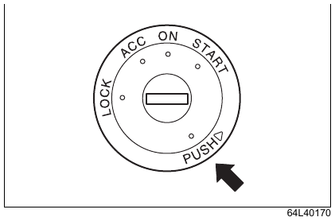{ .center-image }

##### Зуммер предупреждения о забытом ключе

Этот зуммер помогает не оставить ключ в замке зажигания.

- Если открыть дверь водителя, когда ключ находится в положении `ACC` или `LOCK` (`OFF`), зуммер в салоне будет звучать прерывисто.
- Когда ключ вынут, зуммер в салоне выключается.

#### Когда переводите выключатель двигателя в LOCK

!!! tip "Оборудование по типу автомобиля"
    Автомобили с системой бесключевого запуска кнопкой.

1. На автомобиле с автоматической коробкой передач переведите селектор в положение `P` и отпустите кнопку селектора.

   См. также: [управление селектором передач](#управление-селектором-передач).

2. Нажмите выключатель двигателя и верните его в положение `LOCK` (`OFF`).

!!! tip "Подсказка"
    При возврате выключателя двигателя на многофункциональном информационном дисплее может отображаться сообщение.

    См. также: [сообщения многофункционального информационного дисплея](03-before-driving.md#сообщения-многофункционального-информационного-дисплея).

- Если вернуть выключатель двигателя в положение `LOCK` (`OFF`) и открыть или закрыть любую дверь, рулевая колонка заблокируется.
- Для защиты от ошибочных действий выключатель двигателя нельзя вернуть в положение `LOCK` (`OFF`) в следующих случаях:
    - селектор находится не в положении `P`;
    - селектор находится в положении `P`, но нажата кнопка селектора.

  См. также: [парковка](#при-парковке).

- На автомобиле с автоматической коробкой передач из-за неисправности селектора и других причин выключатель двигателя может не возвращаться в положение `LOCK` (`OFF`). Обратитесь для проверки к дилеру Suzuki или в авторизованный сервис Suzuki. До проверки выполните следующие действия:
    - чтобы предотвратить угон, заприте двери ключом. Кнопкой запроса или системой дистанционного управления запереть двери в этом случае нельзя;
    - чтобы предотвратить разряд свинцово-кислотной аккумуляторной батареи, отсоедините её отрицательную клемму. Для этого потребуется обычный инструмент, например ключ на 10 мм.

#### Зуммер предупреждения о выключателе двигателя, оставленном в ACC

Этот зуммер помогает не оставить выключатель двигателя в неправильном положении.

- Если открыть дверь водителя, когда выключатель двигателя находится в положении `ACC`, зуммер в салоне будет звучать прерывисто.
- На автомобиле с автоматической коробкой передач, если селектор находится не в положении `P`, переведите селектор в положение `P` и отпустите кнопку селектора. Дважды нажмите выключатель двигателя, чтобы вернуть его в положение `LOCK` (`OFF`), после этого зуммер в салоне выключится.
- Если выключатель двигателя не вернуть в положение `LOCK` (`OFF`), двери нельзя запереть кнопкой запроса или системой дистанционного управления.

#### Зуммер предупреждения о несработавшей блокировке рулевой колонки

Если из-за неисправности или другой причины рулевая колонка не блокируется даже после возврата выключателя двигателя в положение `LOCK` (`OFF`) и открывания или закрывания любой двери, при открытии двери водителя зуммер в салоне будет звучать прерывисто. Обратитесь для проверки к дилеру Suzuki или в авторизованный сервис Suzuki.

## Бензиновый сажевый фильтр

### Бензиновый сажевый фильтр GPF

!!! tip "Оборудование по типу автомобиля"
    Jimny Sierra.

Бензиновый сажевый фильтр GPF ([※](#gpf-abbreviation-note)) улавливает частицы сажи из отработавших газов, поэтому в зависимости от условий эксплуатации он может засоряться. Во время движения GPF очищается за счёт регенерации: температура отработавших газов повышается, и накопившиеся в фильтре частицы сажи сгорают.

※ GPF: Gasoline Particulate Filter, бензиновый сажевый фильтр.

!!! info "Примечание"
    При частых коротких поездках и других режимах, когда температура отработавших газов не повышается, сажа легче накапливается в GPF.

    Чтобы удалить сажу, накопившуюся в GPF, периодически двигайтесь со скоростью не менее 60 км/ч в течение продолжительного времени, не менее 20 минут.

#### Контрольная лампа GPF

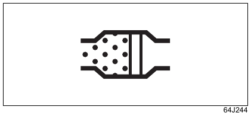{ .center-image }

Если во время движения загорается контрольная лампа GPF, это означает, что фильтр засорён. Когда лампа загорелась, необходимо выполнить прожиг фильтра и удалить накопившуюся в GPF сажу. Чтобы лампа погасла, продолжайте движение до завершения прожига. Обычно этот процесс занимает более 20 минут.

Оптимальные условия для завершения процесса: движение со скоростью не менее 60 км/ч. Соблюдайте ограничения скорости, учитывайте дорожную обстановку и ведите автомобиль осторожно. Если продолжать движение до выключения предупреждающей лампы, прожиг фильтра завершится и сажа будет удалена из GPF.

!!! tip "Подсказка"
    Если загорелась контрольная лампа GPF, обязательно выполните прожиг и удаление сажи, накопившейся в фильтре. Если этого не сделать, засорение фильтра может привести к нарушению работы автомобиля.

## Система автоматической остановки двигателя

Система автоматической остановки двигателя автоматически останавливает и снова запускает двигатель при временной остановке, например на светофоре. Она помогает снизить выбросы, расход топлива и шум двигателя.

- Система временно останавливает двигатель только при выполнении определённых условий. При длительной остановке или когда выходите из автомобиля, надёжно затяните стояночный тормоз и остановите двигатель выключателем двигателя.

  См. также: [остановка двигателя](#остановка-двигателя).

!!! danger "Внимание"
    - Если выйти из автомобиля, когда двигатель автоматически остановлен системой автоматической остановки двигателя, автомобиль может начать движение и стать причиной неожиданной аварии. Не выходите из автомобиля во время автоматической остановки двигателя.
    - Если автомобиль начинает двигаться, а двигатель не запускается повторно, для поворота рулевого колеса и нажатия педали тормоза потребуется большое усилие. Это может привести к неожиданной аварии. Если после автоматической остановки двигатель не запускается сам, запустите двигатель выключателем двигателя.

!!! info "Примечание"
    В системе автоматической остановки двигателя используется специальная высокопроизводительная свинцово-кислотная аккумуляторная батарея. Соблюдайте следующие правила, иначе система может работать неправильно, а срок службы аккумуляторной батареи может сократиться:

    - при замене аккумуляторной батареи используйте батарею предписанного типа, не устанавливайте батарею другого типа;
      см. [сервисные данные](08-service-data.md#сервисные-данные);
    - не подключайте электроприборы напрямую к клеммам аккумуляторной батареи.

!!! tip "Подсказка"
    На автомобиле с автоматической коробкой передач, если во время автоматической остановки двигателя отстегнуть ремень безопасности водителя или открыть дверь водителя даже при нажатой педали тормоза, двигатель перезапустится. Так система сообщает, что двигатель был автоматически остановлен системой автоматической остановки двигателя.

    На автомобиле с механической коробкой передач, если отстегнуть ремень безопасности водителя и открыть дверь водителя, двигатель будет остановлен как при заглохании.

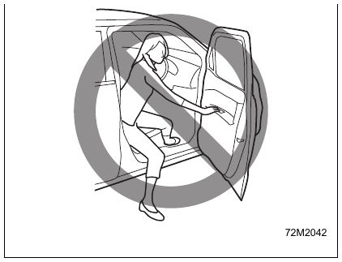{ .center-image }

### Как выполняется автоматическая остановка и повторный запуск двигателя

#### Автомобиль с механической коробкой передач

1. Переведите рычаг переключения передач в положение `N` (нейтраль) и уберите ногу с педали сцепления. Двигатель автоматически остановится. При автоматической остановке двигателя загорится зелёный индикатор автоматической остановки двигателя.

!!! info "Примечание"
    Во время автоматической остановки двигателя система может для обеспечения безопасности включить зуммер в салоне, остановить двигатель как при заглохании или повторно запустить двигатель.

    См. также: [меры предосторожности во время автоматической остановки двигателя](#меры-предосторожности-во-время-автоматической-остановки-двигателя).

Если при остановке или начале движения двигатель заглох не по описанной выше процедуре, двигатель может повторно запуститься, если перевести рычаг переключения передач в положение `N` (нейтраль) и нажать педаль сцепления.

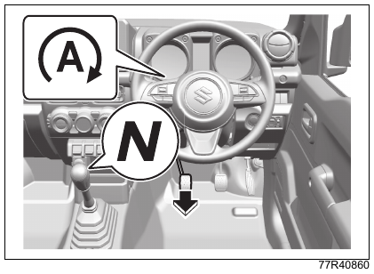{ .center-image }

!!! tip "Подсказка"
    Во время автоматической остановки двигателя можно пользоваться аудиосистемой и другим электрооборудованием, но кондиционер переключается в режим вентиляции.

    На автомобиле с автоматической климатической системой во время автоматической остановки двигателя скорость вентилятора ограничивается, если она управляется автоматически. Это помогает дольше сохранять охлаждение или обогрев.

2. Ещё раз полностью нажмите педаль сцепления. Двигатель повторно запустится, а зелёный индикатор автоматической остановки двигателя погаснет.

   - Даже если педаль сцепления не нажимать, двигатель автоматически запустится при выполнении условий автоматического повторного запуска.

     См. также: [условия автоматического повторного запуска двигателя](#условия-автоматического-повторного-запуска-двигателя).

   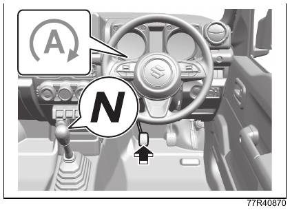{ .center-image }

!!! tip "Подсказка"
    Если громкость аудиосистемы высокая, при повторном запуске двигателя звук может кратковременно прерываться. Это не является неисправностью.

#### Автомобиль с автоматической коробкой передач

1. Если остановить автомобиль нажатием педали тормоза, когда селектор остаётся в положении `D` или `N`, при остановке двигатель автоматически остановится. При автоматической остановке двигателя загорится зелёный индикатор автоматической остановки двигателя.

!!! info "Примечание"
    Во время автоматической остановки двигателя система может для обеспечения безопасности включить зуммер в салоне, остановить двигатель как при заглохании или повторно запустить двигатель.

    См. также: [меры предосторожности во время автоматической остановки двигателя](#меры-предосторожности-во-время-автоматической-остановки-двигателя).

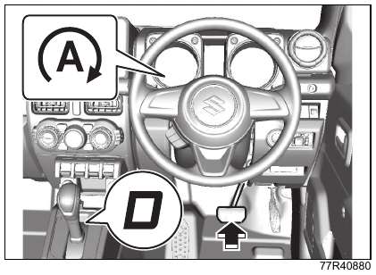{ .center-image }

- Если остановить автомобиль без нажатия педали тормоза, например используя торможение двигателем, двигатель автоматически не остановится.

!!! tip "Подсказка"
    Во время автоматической остановки двигателя можно пользоваться аудиосистемой и другим электрооборудованием, но кондиционер переключается в режим вентиляции.

    На автомобиле с автоматической климатической системой во время автоматической остановки двигателя скорость вентилятора ограничивается, если она управляется автоматически. Это помогает дольше сохранять охлаждение или обогрев.

2. Когда автомобиль остановлен, уберите ногу с педали тормоза. Двигатель повторно запустится, а зелёный индикатор автоматической остановки двигателя погаснет.

   - Даже при нажатой педали тормоза двигатель автоматически запустится при выполнении условий автоматического повторного запуска.

     См. также: [условия автоматического повторного запуска двигателя](#условия-автоматического-повторного-запуска-двигателя).

   - При повторном запуске двигателя тормозное усилие временно удерживается, чтобы автомобиль не дёрнулся вперёд из-за ползучего хода и не откатился назад на подъёме.

     См. также: [система удержания на подъёме](#система-удержания-на-подъёме).

   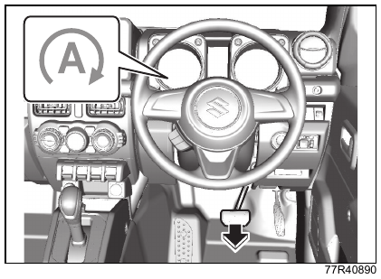{ .center-image }

!!! tip "Подсказка"
    При автоматическом повторном запуске двигателя срабатывает система удержания на подъёме.

    См. также: [система удержания на подъёме](#система-удержания-на-подъёме).

    Если громкость аудиосистемы высокая, при повторном запуске двигателя звук может кратковременно прерываться. Это не является неисправностью.

### Меры предосторожности во время автоматической остановки двигателя

!!! danger "Внимание"
    Во время автоматической остановки двигателя не выполняйте действия, перечисленные ниже. Это может привести к неожиданной аварии.

| Автомобиль | Действие или состояние автомобиля | Что делать |
| --- | --- | --- |
| Все автомобили | Открыт капот.  Зуммер в салоне звучит непрерывно. Автоматическая остановка двигателя отменяется, и двигатель переходит в состояние, как при заглохании. Зелёный индикатор автоматической остановки двигателя гаснет. | Перед началом движения закройте дверь и пристегните ремень безопасности.  Если выходите из автомобиля, заранее выполните следующие действия: 1. На автомобиле с механической коробкой передач надёжно затяните стояночный тормоз и верните рычаг переключения передач в положение `N` (нейтраль). На автомобиле с автоматической коробкой передач надёжно затяните стояночный тормоз и переведите селектор в положение `P`. 2. Полностью закройте капот. 3. Запустите двигатель выключателем двигателя.  См. также: [запуск двигателя](#запуск-двигателя). |
| Все автомобили | Отстёгнут ремень безопасности водителя и открыта дверь водителя.  Зуммер в салоне звучит непрерывно. Автоматическая остановка двигателя отменяется, и двигатель переходит в состояние, как при заглохании. Зелёный индикатор автоматической остановки двигателя гаснет. | Перед началом движения закройте дверь и пристегните ремень безопасности. Если выходите из автомобиля, выполните те же действия, что указаны выше. |
| Автомобиль с механической коробкой передач | Без нажатия педали сцепления рычаг переключения передач переведён из положения `N` (нейтраль) в другое положение.  Зуммер в салоне звучит прерывисто. Автоматическая остановка двигателя продолжается. Зелёный индикатор автоматической остановки двигателя остаётся включённым. | Верните рычаг переключения передач в положение `N` (нейтраль). |
| Автомобиль с автоматической коробкой передач | Отстёгнут ремень безопасности водителя или открыта дверь водителя.  Зуммер в салоне звучит непрерывно примерно 5 секунд. Двигатель автоматически запускается. Зелёный индикатор автоматической остановки двигателя мигает примерно 5 секунд, затем гаснет. | Перед началом движения закройте дверь и пристегните ремень безопасности.  Если выходите из автомобиля, заранее выполните следующие действия: 1. Надёжно затяните стояночный тормоз и переведите селектор в положение `P`. 2. При длительной остановке или когда выходите из автомобиля, остановите двигатель выключателем двигателя.  См. также: [остановка двигателя](#остановка-двигателя). |

!!! info "Примечание"
    Во время автоматической остановки двигателя следующие контрольные лампы на комбинации приборов не загораются, но при остановке двигателя как при заглохании они включаются:

    - контрольная лампа двигателя;
    - контрольная лампа электроусилителя рулевого управления;
    - контрольная лампа давления масла;
    - контрольная лампа зарядки.

    См. также: [предупреждающие лампы](01-quick-guide.md#предупреждающие-лампы).

### Условия работы системы автоматической остановки двигателя

#### Условия готовности

Когда выполнены все условия ниже, при остановке автомобиля возможна автоматическая остановка двигателя.

##### При запуске двигателя

| Автомобиль | Условие |
| --- | --- |
| Все автомобили | Двигатель запущен при полностью закрытом капоте ([※](#idling-stop-standby-start-note)). |

!!! info "Примечание"
    ※

    Если двигатель запущен по процедуре для разряженной свинцово-кислотной аккумуляторной батареи, условия готовности не выполняются.

    См. также: [если разрядилась свинцово-кислотная аккумуляторная батарея](07-emergency.md#если-аккумуляторная-батарея-разряжена).

##### Во время движения

| Автомобиль | Условия |
| --- | --- |
| Все автомобили | Система автоматической остановки двигателя не выключена. См. [выключатель OFF системы автоматической остановки двигателя](#выключатель-off-системы-автоматической-остановки-двигателя).  Свинцово-кислотная аккумуляторная батарея достаточно заряжена, а её внутренняя температура находится в установленном диапазоне ([※1](#idling-stop-standby-drive-note-1)).  Температура охлаждающей жидкости находится в установленном диапазоне.  Ремень безопасности водителя пристёгнут.  Дверь водителя полностью закрыта.  Капот полностью закрыт.  От других электронных систем управления, кроме системы автоматической остановки двигателя, не поступает сигнал, запрещающий остановку двигателя ([※2](#idling-stop-standby-drive-note-2)).  Рычаг раздаточной коробки находится в положении `2H`.  Для автомобилей с автоматической климатической системой: температура воздуха из дефлекторов достаточно низкая при охлаждении или достаточно высокая при отоплении; выключатель обдува ветрового стекла находится в положении `OFF`. См. [автоматическая климатическая система](05-equipment.md#автоматическая-климатическая-система). |
| Автомобиль с механической коробкой передач | Рычаг переключения передач не находится в положении `R` (задний ход). |
| Автомобиль с автоматической коробкой передач | Селектор находится в положении `D` или `N`.  Выключатель повышающей передачи `O/D` не находится в положении `OFF`. |

!!! tip "Подсказка"
    ※1

    Если автомобиль долго не использовался или при остановленном двигателе долго работали аудиосистема и другие электроприборы, аккумуляторная батарея может быть разряжена. В таком случае переход системы в состояние готовности может занять больше времени.

    ※2

    Если загорается какая-либо предупреждающая лампа или индикатор, влияющие на систему автоматической остановки двигателя, двигатель автоматически не остановится.

#### Условия автоматической остановки двигателя

Когда при остановке автомобиля выполнены все условия ниже, зелёный индикатор автоматической остановки двигателя загорается, и двигатель автоматически останавливается.

| Автомобиль | Условия при остановке |
| --- | --- |
| Все автомобили | ABS и ESP® не срабатывают.  Разрежение в вакуумном усилителе тормозов находится в норме. |
| Автомобиль с механической коробкой передач | Рычаг переключения передач находится в положении `N` (нейтраль).  Нога убрана с педали сцепления. |
| Автомобиль с автоматической коробкой передач | Педаль тормоза нажата надлежащим усилием ([※](#idling-stop-auto-stop-note)).  Педаль акселератора не нажата.  Автомобиль не остановлен на крутом уклоне. |

!!! info "Примечание"
    ※

    Если педаль тормоза нажата слишком слабо или слишком сильно, автоматическая остановка двигателя может не сработать. Настройка позволяет водителю управлять срабатыванием системы усилием на педали: при слабом нажатии автоматическая остановка не выполняется, а при дополнительном нажатии педали двигатель автоматически останавливается.

#### Условия автоматического повторного запуска двигателя

Если во время автоматической остановки выполнить любое из следующих действий или автомобиль перейдёт в любое из перечисленных состояний, двигатель автоматически запустится, а зелёный индикатор автоматической остановки двигателя погаснет.

| Автомобиль | Условия |
| --- | --- |
| Все автомобили | Система автоматической остановки двигателя выключена. См. [выключатель OFF системы автоматической остановки двигателя](#выключатель-off-системы-автоматической-остановки-двигателя).  Аккумуляторная батарея разрядилась сильнее установленного уровня.  Обнаружена неисправность, связанная с этой системой.  Разрежение в вакуумном усилителе тормозов снизилось.  Автомобиль начал двигаться, например на уклоне.  С момента автоматической остановки прошло некоторое время, примерно 2 минуты.  Рычаг раздаточной коробки переведён в положение `4H` или `4L`.  Для автомобилей с автоматической климатической системой: после автоматической остановки температура воздуха из дефлекторов заметно изменилась, и охлаждение или отопление стало недостаточным; регулятор температуры резко повернули в сторону `COOL` при охлаждении или в сторону `HOT` при отоплении; включён обдув ветрового стекла. См. [автоматическая климатическая система](05-equipment.md#автоматическая-климатическая-система). |
| Автомобиль с механической коробкой передач | Нажата педаль сцепления. |
| Автомобиль с автоматической коробкой передач | Отстёгнут ремень безопасности водителя ([※1](#idling-stop-auto-restart-note-1)).  Открыта дверь водителя ([※1](#idling-stop-auto-restart-note-1)).  Нога убрана с педали тормоза ([※2](#idling-stop-auto-restart-note-2)).  Нажата педаль акселератора.  Селектор переведён в положение `P`, `R`, `L` или `2`, либо выключатель повышающей передачи `O/D` переведён в положение `OFF`.  Селектор после положения `N` возвращён в положение `D`. |

!!! info "Примечание"
    ※1

    Если отстегнуть ремень безопасности водителя или открыть дверь водителя, зуммер в салоне прозвучит 5 раз.

    ※2

    Если педаль тормоза нажата слабо, двигатель может автоматически запуститься. Настройка позволяет водителю управлять срабатыванием системы усилием на педали: при слабом нажатии автоматическая остановка не выполняется, а при дополнительном нажатии педали двигатель автоматически останавливается.

### Выключатель OFF системы автоматической остановки двигателя

Выключатель позволяет выключить систему автоматической остановки двигателя.

- Чтобы выключить систему, удерживайте выключатель `OFF` системы автоматической остановки двигателя (1), пока на комбинации приборов не загорится индикатор `OFF` системы автоматической остановки двигателя (2).
- Чтобы снова перевести систему в состояние готовности, удерживайте выключатель (1), пока индикатор не погаснет.
- Каждый раз при остановке двигателя вручную система возвращается в состояние готовности, а индикатор `OFF` системы автоматической остановки двигателя гаснет.

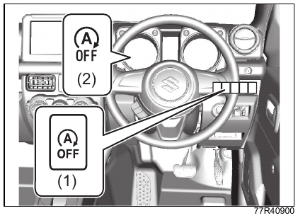{ .center-image }

| Обозначение | Описание |
| --- | --- |
| (1) | Выключатель `OFF` системы автоматической остановки двигателя |
| (2) | Индикатор `OFF` системы автоматической остановки двигателя |

- Иллюстрация приведена как пример. Фактический вид зависит от комплектации автомобиля.

!!! tip "Подсказка"
    Если во время автоматической остановки двигателя нажать выключатель `OFF` системы автоматической остановки двигателя (1), двигатель автоматически запустится, а индикатор `OFF` системы автоматической остановки двигателя (2) загорится.

Индикатор `OFF` системы автоматической остановки двигателя на комбинации приборов сообщает не только о том, что система выключена. В следующих случаях он загорается или мигает. Если индикатор мигает, обратитесь для проверки к дилеру Suzuki или в авторизованный сервис Suzuki.

- Если система исправна, при переводе выключателя двигателя в положение `ON` индикатор загорается примерно на 2 секунды, затем гаснет.
- Если в системе есть неисправность либо пришёл срок замены стартера или аккумуляторной батареи, при переводе выключателя двигателя в положение `ON` индикатор загорается примерно на 2 секунды, затем мигает. В этом случае система автоматической остановки двигателя не работает нормально.

См. также: [индикатор OFF системы автоматической остановки двигателя](03-before-driving.md#индикатор-отключения-системы-автоматической-остановки-двигателя).

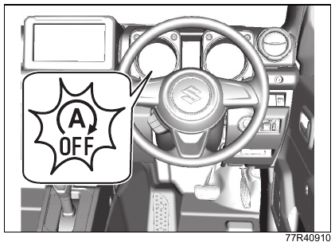{ .center-image }

- Иллюстрация приведена как пример. Фактический вид зависит от комплектации автомобиля.

!!! tip "Подсказка"
    Если индикатор мигает во время автоматической остановки двигателя, двигатель может остановиться как при заглохании.

### Настройка климатической системы при автоматической остановке двигателя

Для работы климатической системы во время автоматической остановки двигателя можно выбрать один из режимов: «Приоритет экономии топлива», «Стандартный» или «Приоритет комфорта».

См. также: [режим настроек](08-service-data.md#режим-настроек).

- Если выбрать «Приоритет экономии топлива», условия автоматической остановки двигателя, связанные с климатической системой, становятся мягче по сравнению со «Стандартным» режимом. Двигатель будет чаще автоматически останавливаться, а время автоматической остановки станет дольше. Это снижает расход топлива.
- Если выбрать «Приоритет комфорта», условия автоматической остановки двигателя, связанные с климатической системой, становятся строже по сравнению со «Стандартным» режимом. Двигатель будет реже автоматически останавливаться, а время автоматической остановки станет короче. Это повышает комфорт в салоне.

## Стояночный тормоз

### Управление стояночным тормозом

Стояночный тормоз действует на задние колёса. При парковке надёжно затягивайте стояночный тормоз.

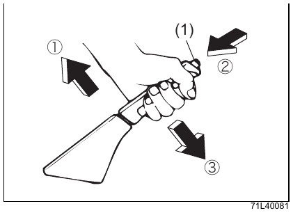{ .center-image }

| Обозначение | Описание |
| --- | --- |
| (1) | Кнопка рычага стояночного тормоза |
| 1 | Потяните рычаг вверх |
| 2 | Нажмите кнопку |
| 3 | Полностью опустите рычаг |

!!! danger "Внимание"
    После отпускания стояночного тормоза убедитесь, что контрольная лампа тормозной системы на комбинации приборов погасла. Если ехать с затянутым стояночным тормозом, тормозные механизмы могут перегреться, и тормоза могут перестать работать.

    См. также: [предупреждающая лампа тормозной системы](03-before-driving.md#контрольная-лампа-тормозной-системы-красная).

!!! warning "Осторожно"
    При затянутом стояночном тормозе система удержания на подъёме не работает.

    См. также: [система удержания на подъёме](#система-удержания-на-подъёме).

#### При парковке

Полностью потяните рычаг стояночного тормоза вверх, не нажимая кнопку (1).

#### При отпускании

- Слегка потяните рычаг вверх (1), нажмите кнопку (1) на конце рычага (2) и полностью опустите рычаг вниз (3).
- При трогании на подъёме оставьте стояночный тормоз затянутым, правой ногой осторожно нажмите педаль акселератора и, почувствовав, что автомобиль начинает двигаться, отпустите стояночный тормоз.

#### Зуммер предупреждения о неотпущенном стояночном тормозе

Если начать движение, не отпустив стояночный тормоз, зуммер в салоне будет звучать непрерывно.

- Во время работы предупреждающего зуммера на многофункциональном информационном дисплее отображается сообщение.

  См. также: [сообщения многофункционального информационного дисплея](03-before-driving.md#сообщения-многофункционального-информационного-дисплея).

## Рычаг переключения передач

### Управление рычагом переключения передач

!!! tip "Оборудование по типу автомобиля"
    Автомобили с механической коробкой передач.

При переключении передач полностью нажимайте педаль сцепления.

- Для защиты от ошибочного переключения невозможно напрямую перейти с 5-й передачи на `R` (задний ход). Сначала переведите рычаг в положение `N` (нейтраль), затем включите `R`.

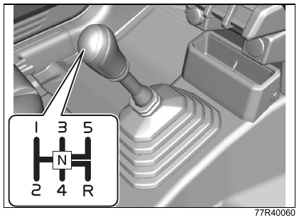{ .center-image }

!!! info "Примечание"
    Перед включением `R` (заднего хода) полностью остановите автомобиль. Если включить задний ход до полной остановки, трансмиссия может быть повреждена.

    На подъёме не удерживайте автомобиль на месте частым использованием сцепления. Это может привести к перегреву сцепления, ускоренному износу, неисправности или аварии. На подъёме не балансируйте автомобиль сцеплением. При остановке на подъёме или в пробке используйте стояночный тормоз вместе с педалью тормоза.

#### Предельная скорость при переключении вниз

Чтобы не допустить чрезмерного повышения оборотов двигателя, переключайтесь на пониженную передачу только при скорости не выше указанной в таблицах.

##### Jimny

Единица измерения: км/ч.

| Переключение вниз | Положение рычага раздаточной коробки `2H`, `4H` | Положение рычага раздаточной коробки `4L` |
| --- | ---: | ---: |
| 2-я → 1-я | 10 | 5 |
| 3-я → 2-я | 50 | 25 |
| 4-я → 3-я | 75 | 35 |
| 5-я → 4-я | 125 | 60 |

##### Jimny Sierra

Единица измерения: км/ч.

| Переключение вниз | Положение рычага раздаточной коробки `2H`, `4H` | Положение рычага раздаточной коробки `4L` |
| --- | ---: | ---: |
| 2-я → 1-я | 20 | 10 |
| 3-я → 2-я | 80 | 40 |
| 4-я → 3-я | 115 | 55 |
| 5-я → 4-я | 160 | 80 |

!!! info "Примечание"
    ※ В зависимости от условий движения и комплектации автомобиля указанная предельная скорость может быть недостижима.

!!! warning "Осторожно"
    Не переключайтесь на пониженную передачу при скорости выше указанной предельной скорости. Обороты двигателя могут стать слишком высокими, что может привести к неисправности двигателя, трансмиссии или раздаточной коробки.

## Автомобиль с автоматической коробкой передач

### Управление селектором передач

!!! tip "Оборудование по типу автомобиля"
    Автомобили с автоматической коробкой передач.

#### Назначение положений селектора

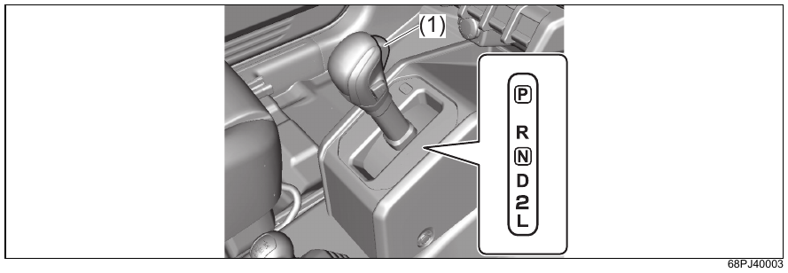{ .center-image }

| Обозначение | Описание |
| --- | --- |
| (1) | Кнопка селектора |

| Положение | Назначение |
| --- | --- |
| `P` Парковка | Положение для парковки, запуска и остановки двигателя. Задние ведущие колёса фиксируются. |
| `R` Задний ход | Положение для движения задним ходом. В салоне звучит предупреждающий зуммер, сообщая водителю, что селектор находится в положении `R`. |
| `N` Нейтраль | Положение, в котором тяга двигателя не передаётся на колёса. Двигатель можно запустить, но для безопасности запускайте двигатель в положении `P`. |
| `D` Движение | Обычное положение для движения. Передачи переключаются автоматически в зависимости от скорости автомобиля и степени нажатия педали акселератора. |
| `2` Вторая | Положение для использования торможения двигателем. Передача автоматически переключается между 1-й и 2-й. Используйте это положение, например при движении по уклону. |
| `L` Пониженная | Положение для сильного торможения двигателем. Используйте это положение, например при движении по крутому спуску. |

#### Как перемещать селектор

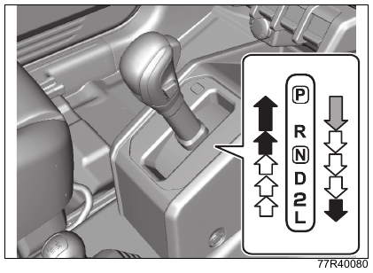{ .center-image }

| Обозначение на схеме | Как перемещать селектор |
| --- | --- |
|  | Нажмите педаль тормоза и перемещайте селектор, удерживая кнопку селектора нажатой. |
|  | Перемещайте селектор, не нажимая кнопку. |
|  | Перемещайте селектор, удерживая кнопку нажатой. |

!!! warning "Осторожно"
    В зависимости от посадки водителя и переднего пассажира колено или другая часть тела может задеть селектор и переместить его.

!!! info "Примечание"
    Перед включением `R` полностью остановите автомобиль. Если автомобиль движется, это может привести к неисправности трансмиссии. Для защиты трансмиссии при скорости движения вперёд примерно 10 км/ч и выше переключение не выполняется, селектор остаётся в нейтрали.

!!! tip "Подсказка"
    Для операций, отмеченных на схеме белыми стрелками вверх и вниз, приучитесь перемещать селектор без нажатия кнопки. Если всегда нажимать кнопку при перемещении селектора, можно ошибочно перевести его в положение `P`, `R`, `D` или `L`.

    С помощью настройки можно включить голосовую подсказку системы помощи водителю при изменении положения селектора.

    См. также: [режим настроек](08-service-data.md#режим-настроек).

#### Система блокировки селектора

Система блокировки селектора предотвращает ошибочное перемещение селектора при начале движения.

- Селектор можно вывести из положения `P` только когда выключатель двигателя находится в положении `ON` и нажата педаль тормоза.
- Когда выключатель двигателя находится в положении `ACC` или `LOCK` (`OFF`), селектор нельзя вывести из положения `P`, даже если нажата педаль тормоза.
- Не нажимайте кнопку селектора до нажатия педали тормоза. Блокировка селектора может не сняться.
- Если при положении выключателя двигателя `ON` и нажатой педали тормоза селектор не удаётся вывести из положения `P`, выполните процедуру из раздела [снятие блокировки селектора](#снятие-блокировки-селектора). В этом случае возможна неисправность системы блокировки селектора. Незамедлительно обратитесь для проверки к дилеру Suzuki или в авторизованный сервис Suzuki.

!!! danger "Внимание"
    Если пролить напиток на подвижную часть селектора или внутрь попадёт посторонний предмет, при продолжении эксплуатации система блокировки селектора может перестать нормально работать. Как можно скорее обратитесь для проверки к дилеру Suzuki или в авторизованный сервис Suzuki.

!!! warning "Осторожно"
    При начале движения перемещайте селектор, твёрдо удерживая педаль тормоза нажатой.

#### Снятие блокировки селектора

Если из-за неисправности системы блокировки селектора, разряда свинцово-кислотной аккумуляторной батареи или другой причины селектор нельзя вывести из положения `P`, снимите блокировку следующим способом.

1. Для безопасности надёжно затяните стояночный тормоз и удерживайте педаль тормоза нажатой.
2. Нажимая кнопку снятия блокировки на панели селектора, переместите селектор.

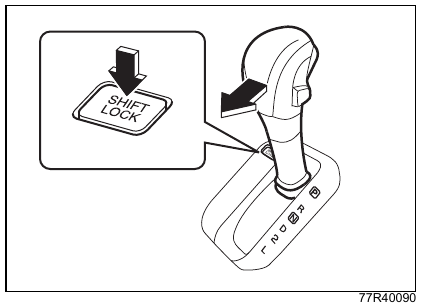{ .center-image }

#### Выключатель повышающей передачи O/D

- При каждом нажатии выключателя состояние попеременно меняется между `ON` и `OFF`.
- В положении `OFF` на комбинации приборов отображается индикация `O/D OFF`.
- При запуске двигателя выключатель повышающей передачи `O/D` автоматически возвращается в состояние `ON`.

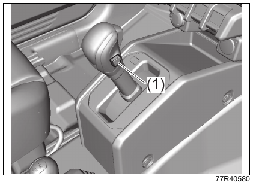{ .center-image }

| Обозначение | Описание |
| --- | --- |
| (1) | Выключатель повышающей передачи `O/D` |

##### Когда выключатель находится в положении ON

Это положение подходит для обычного движения.

- Когда селектор находится в положении `D`, коробка автоматически переключается между 1-й и 4-й передачами, улучшая топливную экономичность и снижая шум.

!!! tip "Подсказка"
    Даже когда выключатель находится в положении `ON`, при низкой температуре масла автоматической коробки передач или охлаждающей жидкости коробка передач может не переключаться на 4-ю передачу.

##### Когда выключатель находится в положении OFF

Это положение подходит для движения по уклонам и горным дорогам.

- Когда селектор находится в положении `D`, коробка автоматически переключается между 1-й и 3-й передачами.
- На спуске создаётся лёгкое торможение двигателем.
- На подъёме и на горной дороге обороты двигателя изменяются меньше, поэтому автомобиль движется плавнее.

#### Индикация O/D OFF

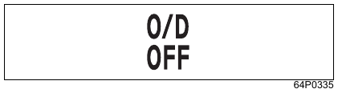{ .center-image }

Эта индикация находится на комбинации приборов.

- Она отображается, когда выключатель повышающей передачи `O/D` находится в положении `OFF`.

См. также: [индикатор отключения повышающей передачи O/D](03-before-driving.md#индикатор-отключения-повышающей-передачи-od).

### Особенности автомобиля с автоматической коробкой передач

На автомобиле с автоматической коробкой передач не нужно работать сцеплением и переключать передачи вручную, поэтому управлять автомобилем проще. При этом у автомобиля с автоматической коробкой передач есть характерные особенности и меры предосторожности.

#### Учитывайте ползучий ход

Когда двигатель запущен, автомобиль стоит, а селектор находится не в положении `P` или `N`, автомобиль медленно движется даже без нажатия педали акселератора. Это называется ползучим ходом.

- Ползучий ход не работает в следующих случаях:
    - нажата педаль тормоза;
    - затянут стояночный тормоз.

!!! warning "Осторожно"
    Когда селектор находится не в положении `P` или `N`, твёрдо удерживайте педаль тормоза нажатой.

    Сразу после запуска двигателя и при работе кондиционера ползучий ход может стать сильнее. Особенно тщательно удерживайте педаль тормоза нажатой.

!!! tip "Подсказка"
    Когда горит контрольная лампа трансмиссии, ползучий ход может не работать.

    См. также: [предупреждающие лампы](01-quick-guide.md#предупреждающие-лампы) и [контрольная лампа трансмиссии](03-before-driving.md#контрольная-лампа-трансмиссии).

#### Принудительное переключение на пониженную передачу

Если во время движения, кроме движения на низкой скорости, полностью нажать педаль акселератора, коробка автоматически переключится на пониженную передачу, обороты двигателя повысятся, и автомобиль сможет резко ускориться. Это называется принудительным переключением на пониженную передачу.

- Если нужно выполнить обгон, полностью нажмите педаль акселератора. Коробка переключится вниз, и автомобиль получит более сильное ускорение.

!!! warning "Осторожно"
    При обычном ускорении нажимайте педаль акселератора плавно. Если нажать педаль полностью, может произойти принудительное переключение на пониженную передачу и неожиданно резкое ускорение.

#### Управление переключением передач на подъёмах и спусках

Эта функция работает, когда селектор находится в положении `D`.

- Если система определяет движение на подъёме, коробка переключается вниз и поддерживает более высокие обороты двигателя, чтобы автомобиль двигался плавно при меньшем изменении положения педали акселератора.
- Если система определяет движение на спуске, коробка переключается вниз и создаётся торможение двигателем.

#### Блокировка извлечения ключа

!!! tip "Оборудование по типу автомобиля"
    Автомобили без системы бесключевого запуска кнопкой.

Для защиты от ошибочных действий ключ можно вынуть только при выполнении следующих условий. Эта функция называется блокировкой извлечения ключа.

- Селектор находится в положении `P`.
- Кнопка селектора отпущена.

См. также: [когда вынимаете ключ](#когда-вынимаете-ключ).

### При движении на автомобиле с автоматической коробкой передач

#### Контрольная лампа трансмиссии

!!! tip "Оборудование по типу автомобиля"
    В зависимости от комплектации.

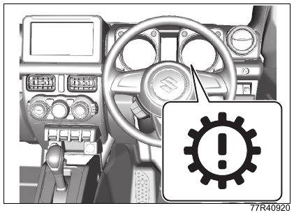{ .center-image }

Лампа находится на комбинации приборов.

- Если в системе автоматической коробки передач есть неисправность, лампа загорается при положении выключателя двигателя `ON`.

См. также: [предупреждающие лампы](01-quick-guide.md#предупреждающие-лампы).

#### Зуммер предупреждения о положении R

Когда двигатель работает и селектор переводится в положение `R`, в салоне звучит предупреждающий зуммер. Он сообщает водителю, что селектор находится в положении `R`.

!!! tip "Подсказка"
    Зуммер предупреждения о положении `R` не предназначен для предупреждения людей снаружи автомобиля о движении задним ходом.

#### Не перепутайте педали

Чтобы не перепутать педали, перед запуском двигателя нажмите ногой педаль акселератора и педаль тормоза и проверьте их расположение.

!!! danger "Внимание"
    Если перепутать педаль акселератора и педаль тормоза, это может привести к неожиданной аварии.

!!! info "Примечание"
    Не нажимайте педаль акселератора и педаль тормоза одновременно. Это может повредить трансмиссию или привести к её перегреву.

#### Нажимайте педаль тормоза правой ногой

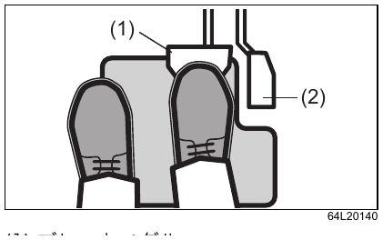{ .center-image }

| Обозначение | Описание |
| --- | --- |
| (1) | Педаль тормоза |
| (2) | Педаль акселератора |

Левой ногой невозможно выполнять торможение надлежащим образом. Приучитесь нажимать педаль тормоза правой ногой.

#### Когда перемещаете селектор

- При многократном переключении между движением вперёд и назад можно забыть, что селектор находится в положении `R`. После движения задним ходом сразу переводите селектор из положения `R` в положение `N`.
- При развороте с несколькими переключениями между движением вперёд и назад перемещайте селектор только после полной остановки автомобиля.

!!! warning "Осторожно"
    Не перемещайте селектор при нажатой педали акселератора. Автомобиль может резко тронуться и стать причиной аварии.

#### Проверяйте положение селектора визуально

Перед запуском двигателя и перед выходом из автомобиля убедитесь, что селектор находится в положении `P`. Перед движением вперёд убедитесь, что он находится в положении `D`, а перед движением назад - в положении `R`.

#### Когда выходите из автомобиля

{ .center-image }

!!! danger "Внимание"
    Не выходите из автомобиля при работающем двигателе. Если селектор случайно окажется не в положении `P`, автомобиль может самопроизвольно начать движение.

    Кроме того, при посадке в автомобиль можно по ошибке переместить селектор или нажать педаль акселератора, что может привести к неожиданному резкому троганию.

### Как управлять автомобилем с автоматической коробкой передач

Также прочитайте раздел [управление селектором передач](#управление-селектором-передач) и соблюдайте правильный порядок действий.

#### Когда садитесь за руль

1. Отрегулируйте сиденье и рулевое колесо так, чтобы можно было уверенно нажимать педали и удобно управлять рулевым колесом.

    См. также: [передние сиденья](03-before-driving.md#передние-сиденья) и [регулировка рулевой колонки по высоте](03-before-driving.md#регулировка-рулевой-колонки-по-высоте).

2. Правой ногой проверьте расположение педали акселератора (2) и педали тормоза (1).

{ .center-image }

| Обозначение | Описание |
| --- | --- |
| (1) | Педаль тормоза |
| (2) | Педаль акселератора |

#### Запуск двигателя

Подробный порядок запуска двигателя см. в разделе [запуск двигателя](#запуск-двигателя).

1. Надёжно затяните стояночный тормоз.
2. Убедитесь, что селектор находится в положении `P`.

{ .center-image }

!!! info "Примечание"
    Двигатель можно запустить и при положении селектора `N`, но для безопасности запускайте двигатель в положении `P`.

3. Нажмите педаль тормоза правой ногой.
4. Запустите двигатель.

!!! warning "Осторожно"
    На автомобилях с системой бесключевого запуска кнопкой двигатель может не запуститься, если выключатель двигателя нажат недостаточно уверенно. Если двигатель не работает, автомобиль не начнёт движение даже при переводе селектора в положение `R` или `D`.

    Если в такой ситуации попытаться тронуться, на уклоне автомобиль может покатиться в непредвиденном направлении и стать причиной аварии. При запуске двигателя уверенно нажимайте выключатель двигателя и проверяйте запуск по звуку двигателя, контрольным лампам и другим признакам.

#### Трогание

##### Обычное трогание

1. Надёжно нажмите педаль тормоза правой ногой.
2. Для движения вперёд переведите селектор в положение `D`, для движения назад - в положение `R`, затем визуально проверьте положение селектора. Убедитесь, что на комбинации приборов индикация положения селектора показывает `D` или `R`.
3. Отпустите стояночный тормоз и убедитесь, что на комбинации приборов погасла контрольная лампа тормозной системы.
4. Медленно отпустите педаль тормоза, затем плавно и осторожно нажмите педаль акселератора и троньтесь.

##### Трогание на крутом подъёме

1. Выполните пункты 1-2 из обычного порядка трогания.
2. Медленно уберите правую ногу с педали тормоза и осторожно нажмите педаль акселератора.
3. Почувствовав, что автомобиль начинает двигаться, отпустите рычаг стояночного тормоза и троньтесь.

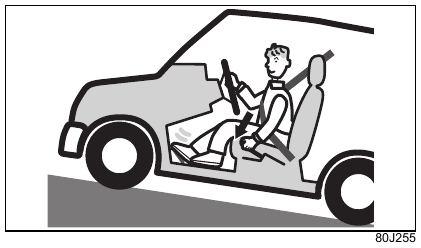{ .center-image }

!!! tip "Подсказка"
    Система удержания на подъёме помогает примерно 2 секунды не допустить откатывания автомобиля назад при трогании на крутом подъёме.

    Если стояночный тормоз затянут, система удержания на подъёме не работает.

    См. также: [система удержания на подъёме](#система-удержания-на-подъёме).

#### Движение

##### Обычное движение

Если после трогания селектор находится в положении `D`, коробка передач автоматически переключается в зависимости от скорости автомобиля и степени нажатия педали акселератора.

!!! warning "Осторожно"
    Кроме экстренных случаев, не переводите селектор в положение `N` во время движения. Торможение двигателем полностью пропадёт, что может привести к неожиданной аварии.

##### Резкое ускорение

Если нужно выполнить обгон, полностью нажмите педаль акселератора. Коробка передач выполнит принудительное переключение на пониженную передачу, и автомобиль получит сильное ускорение.

##### Движение на подъёме

Если при движении на подъёме в положении `D` сильнее нажимать педаль акселератора, чтобы поддерживать скорость, коробка передач может выполнить принудительное переключение на пониженную передачу, а обороты двигателя резко возрастут.

##### Движение на спуске

При движении на спуске в положении `D` торможение двигателем может быть слабым, и скорость может стать слишком высокой.

- В зависимости от крутизны спуска заранее переведите селектор в положение `2` и используйте торможение двигателем.
- На крутом спуске, когда требуется сильное торможение двигателем, переведите селектор в положение `L`.

!!! danger "Внимание"
    На крутом или длинном спуске обязательно используйте торможение двигателем. Если постоянно держать педаль тормоза нажатой, тормозная система может перегреться, и тормоза могут перестать работать.

!!! tip "Подсказка"
    Система помощи при спуске помогает поддерживать постоянную скорость на крутом спуске.

    См. также: [система помощи при спуске](#система-помощи-при-спуске).

- Если при движении в положении `D` выключить повышающую передачу выключателем `O/D`, на подъёме автомобиль будет двигаться плавнее с меньшим изменением оборотов двигателя, а на спуске появится лёгкое торможение двигателем.

См. также: [выключатель повышающей передачи O/D](#выключатель-повышающей-передачи-od).

#### Временная остановка

1. Остановите автомобиль, оставив селектор в положении движения, и твёрдо удерживайте педаль тормоза нажатой.

    - При временной остановке на крутом уклоне при необходимости затяните стояночный тормоз.
    - Если остановка может затянуться, переведите селектор в положение `N`.

2. Перед повторным троганием визуально проверьте положение селектора и убедитесь, что стояночный тормоз отпущен.

!!! danger "Внимание"
    Во время временной остановки не увеличивайте обороты двигателя без нагрузки. Если селектор случайно окажется не в положении `P` или `N`, автомобиль может резко тронуться и стать причиной аварии.

!!! info "Примечание"
    На подъёме не удерживайте автомобиль на месте педалью акселератора. Рабочая жидкость автоматической коробки передач может перегреться, что приведёт к неисправности.

#### Стоянка

1. Полностью остановите автомобиль.
2. Удерживая педаль тормоза нажатой, надёжно затяните стояночный тормоз.
3. Переведите селектор в положение `P`, остановите двигатель, затем медленно отпустите педаль тормоза.

    - Визуально убедитесь, что селектор находится в положении `P` и что на комбинации приборов индикация положения селектора показывает `P`.

{ .center-image }

!!! danger "Внимание"
    При стоянке обязательно переведите селектор в положение `P`, а затем остановите двигатель. В положениях, отличных от `P`, блокировка переключения не работает, и ошибочное действие может привести к неожиданной аварии.

!!! tip "Подсказка"
    Если перевести селектор в положение `P` и остановить двигатель до затягивания стояночного тормоза, после повторного запуска двигателя при попытке вывести селектор из положения `P` ход рычага может стать тяжёлым, а также могут появиться непривычный звук или толчок. Это не является неисправностью.

4. Верните выключатель двигателя в положение `LOCK` (`OFF`).

См. также: [когда переводите выключатель двигателя в LOCK](#когда-переводите-выключатель-двигателя-в-lock).

#### Движение задним ходом

##### Правильная посадка за рулём

При движении задним ходом водитель обычно поворачивает корпус, из-за чего нажимать педали становится труднее. Управляйте автомобилем в такой позе, чтобы можно было уверенно нажимать педаль тормоза и педаль акселератора.

##### Когда многократно двигаетесь вперёд и назад

При заезде в гараж и других манёврах с повторным движением вперёд и назад полностью остановите автомобиль, а затем выполняйте следующее действие для движения вперёд или назад.

!!! tip "Подсказка"
    При многократном переключении между движением вперёд и назад можно забыть, что селектор был переведён в положение `R`. После движения задним ходом сразу переводите селектор из положения `R` в положение `N`.

#### На что ещё обратить внимание

##### Когда нужно немного переместить автомобиль

Даже при небольшом перемещении автомобиля примите правильную посадку за рулём, чтобы можно было уверенно нажимать педаль тормоза и педаль акселератора.

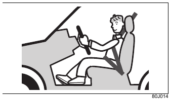{ .center-image }

!!! danger "Внимание"
    На уклоне не допускайте качения назад по инерции, когда селектор находится в положении движения вперёд (`D`, `2`, `L`), и не допускайте качения вперёд по инерции, когда селектор находится в положении заднего хода (`R`).

    Двигатель может заглохнуть, эффективность тормозов может снизиться, рулевое колесо может стать тяжёлым, что создаёт риск неожиданной аварии. Кроме того, это может привести к неисправности.

##### Когда останавливаете автомобиль

!!! info "Примечание"
    Не переводите селектор в положение `P`, если автомобиль хотя бы немного движется. Это может привести к неисправности трансмиссии.

## Автомобиль с приводом 4WD

### Переключение 2WD/4WD

Также прочитайте раздел [при управлении автомобилем 4WD](02-safety.md#если-управляете-автомобилем-4wd), чтобы понимать особенности подключаемого полного привода и меры предосторожности при его использовании.

Система подключаемого полного привода 4WD позволяет рычагом раздаточной коробки переключаться между 2WD (привод на два колеса) и 4WD (привод на четыре колеса).

Переключение между 2WD и 4WD выполняется пневматическими муфтами включения передних ступиц (1). Эти муфты используют разрежение двигателя для подключения привода передних колёс, поэтому при остановленном двигателе не работают.

После перемещения рычага раздаточной коробки до срабатывания пневматических муфт проходит несколько секунд.

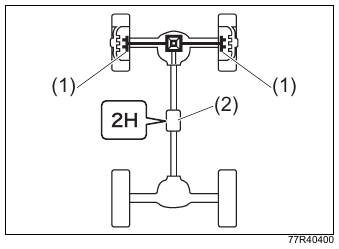{ .center-image }

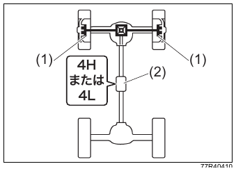{ .center-image }

| Обозначение | Описание |
| --- | --- |
| (1) | Пневматическая муфта включения передней ступицы |
| (2) | Раздаточная коробка |

!!! tip "Подсказка"
    Если при движении в режиме 2WD передние колёса получили сильный удар, например при проезде крупной неровности, при последующем движении из пневматических муфт включения передних ступиц может появиться посторонний звук.

    В этом случае остановите автомобиль, один раз переведите рычаг раздаточной коробки в положение `4H`, а затем снова переведите его в положение `2H`.

#### Работа рычага раздаточной коробки и индикатор

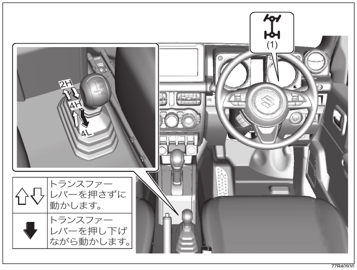{ .center-image }

| Обозначение | Описание |
| --- | --- |
| (1) | Индикатор 4WD |

| Положение рычага раздаточной коробки | Режим привода | Индикатор 4WD | Описание |
| --- | --- | --- | --- |
| `2H` | 2WD | — | Положение для движения по обычным и скоростным дорогам. Обычно используйте это положение. |
| `4H` | 4WD, высокая передача | 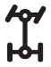 | Положение для движения по плохим дорогам, песку, заснеженным и другим скользким покрытиям. |
| `4L` | 4WD, пониженная передача |  | Положение для крутых подъёмов и спусков, песка, грязи и других условий, где требуется особенно большая тяга. |

!!! warning "Осторожно"
    Если при включённом 4WD резко поворачивать на крутом повороте, в узком проезде или на парковке, усилие на рулевом колесе увеличивается, может возникнуть эффект торможения в крутом повороте ([※](#tight-corner-braking-note)) и появиться риск неожиданной аварии. Кроме того, это может повредить элементы привода.

    ※ Эффект торможения в крутом повороте возникает при резком повороте в режиме жёсткой связи привода, когда система не может компенсировать разницу вращения передних и задних колёс. По ощущению автомобиль ведёт себя так, как будто включились тормоза.

!!! info "Примечание"
    Не двигайтесь в режиме 4WD по сухой асфальтированной дороге. По мокрой асфальтированной дороге также по возможности избегайте движения в режиме 4WD.

    На покрытии, где шины плохо проскальзывают, невозможно погасить разницу вращения передних и задних колёс, из-за чего могут возникнуть следующие явления:

    - на элементы привода действует чрезмерная нагрузка, что может привести к повреждению;
    - шины быстрее изнашиваются;
    - рулевое колесо становится тяжёлым;
    - в повороте возникает ощущение, будто автомобиль тормозит.

    Если во время переключения рычага раздаточной коробки вернуть его в исходное положение, элементы привода могут быть повреждены.

!!! tip "Подсказка"
    При переключении привода в положение `4L` для увеличения тяги на комбинации приборов загорается индикатор `ESP® OFF`, а стабилизация курсовой устойчивости и управление тягой за счёт ограничения мощности двигателя отключаются.

    См. также: [эксплуатация ESP®](#эксплуатация-esp).

    При этом ABS и тормозная функция имитации самоблокирующегося дифференциала ([※](#brake-lsd-traction-control-note)) продолжают работать. Если эта функция срабатывает при трогании или ускорении, на комбинации приборов быстро мигает индикатор работы `ESP®`.

    При срабатывании тормозной функции имитации самоблокирующегося дифференциала могут появляться звук и вибрация от работы тормозов. Это не является неисправностью.

    При переключении привода в положение `4L` звучит зуммер в салоне, загораются индикатор `DSBS II OFF` системы поддержки торможения с двумя датчиками и индикатор `OFF` функции предотвращения схода с полосы, а системы помощи водителю Suzuki Safety Support отключаются.

    При переключении привода из положения `4L` в `4H` звучит зуммер в салоне, индикатор `DSBS II OFF` системы поддержки торможения с двумя датчиками и индикатор `OFF` функции предотвращения схода с полосы гаснут, а системы помощи водителю Suzuki Safety Support автоматически возвращаются в работу.

    ※ Тормозная функция имитации самоблокирующегося дифференциала помогает сохранить тягу на противоположном ведущем колесе, когда на скользкой дороге одно из ведущих колёс буксует. Для этого система притормаживает буксующее колесо.

#### Переключение рычага раздаточной коробки

!!! info "Примечание"
    Если степень износа шин заметно отличается между четырьмя колёсами, это может отрицательно повлиять на элементы привода или сделать переключение режимов привода невозможным.

    Чтобы предотвратить неравномерный износ шин, выполняйте перестановку колёс. См. [перестановка колёс](06-care.md#перестановка-колёс).

!!! tip "Подсказка"
    При низкой температуре, когда система переключения привода или коробка передач ещё не прогрелись, рычаг может перемещаться с большим усилием, переключение может быть затруднено или может возникать шум шестерён.

    Если режим привода не переключается, немного проедьте и повторите операцию.

    При использовании круиз-контроля не перемещайте рычаг раздаточной коробки: пневматические муфты включения передних ступиц не сработают, и режим привода не переключится.

##### Переключение между 2H и 4H

Переключаться между `2H` и `4H` можно как на остановленном автомобиле, так и во время движения. Если автомобиль движется, скорость должна быть не выше 100 км/ч. Установите рулевое колесо в положение прямолинейного движения, отпустите педаль акселератора и переместите рычаг раздаточной коробки.

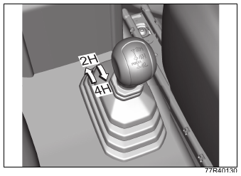{ .center-image }

!!! danger "Внимание"
    Не выполняйте переключение в повороте или на снегу, если колёса пробуксовывают. Автомобиль может резко сместиться в неожиданном направлении. Кроме того, это может повредить элементы привода.

!!! warning "Осторожно"
    Если переключаете режим привода во время движения, выполняйте операцию с особой осторожностью, чтобы не мешать безопасному управлению автомобилем.

!!! tip "Подсказка"
    После перемещения рычага раздаточной коробки из положения `2H` в `4H` убедитесь, что индикатор 4WD загорелся.

    После перемещения рычага раздаточной коробки из положения `4H` в `2H` убедитесь, что индикатор 4WD погас.

    Если после переключения индикатор 4WD продолжает мигать, убедившись в безопасности впереди и сзади, плавно ускорьтесь или замедлитесь. Также можно остановиться и немного проехать назад.

    Если рулевое колесо повернуто или педаль акселератора нажата, переключение может не выполниться.

    Если на остановленном автомобиле при переключении из `2H` в `4H` рычаг перемещается тяжело и положение включается с трудом, выполните переключение во время медленного движения.

    Если при переключении из `2H` в `4H` во время движения рычаг перемещается тяжело или появляется шум шестерён, снизьте скорость либо остановитесь и повторите операцию.

    Если при переключении из `2H` в `4H` во время движения рычаг перемещается тяжело, установите рулевое колесо в положение прямолинейного движения, немного проедьте и повторите операцию.

    При переключении из `2H` в `4H` или из `4H` в `2H` пневматические муфты включения передних ступиц срабатывают с использованием разрежения двигателя, поэтому кондиционер может остановиться на несколько секунд. Это не является неисправностью.

    Если при остановленном двигателе переместить рычаг из `2H` в `4H` или из `4H` в `2H`, после запуска двигателя индикатор 4WD может мигать. Это не является неисправностью. При остановленном двигателе пневматические муфты включения передних ступиц не работают; после запуска двигателя и фактического переключения режима привода индикатор 4WD погаснет.

##### Переключение из 4H в 4L

Переключение из `4H` в `4L` возможно только на остановленном автомобиле. При перемещении рычага раздаточной коробки должны быть выполнены следующие условия.

1. Полностью остановите автомобиль.
2. Подготовьте коробку передач:

    - **Автомобили с механической коробкой передач:** переведите рычаг переключения передач в положение `N` (нейтраль) и полностью нажмите педаль сцепления.
    - **Автомобили с автоматической коробкой передач:** переведите селектор в положение `N`.

3. Нажимая рычаг раздаточной коробки вниз, переведите его в положение `4L`.

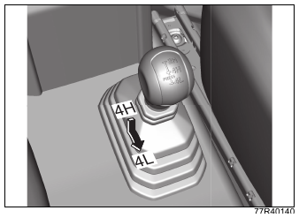{ .center-image }

!!! danger "Внимание"
    Если нужно остановить двигатель до завершения переключения в `4L`, выполните следующую процедуру:

    1. Сильно нажмите педаль тормоза.
    2. Остановите двигатель.

    Продолжайте удерживать педаль тормоза нажатой до повторного запуска двигателя.

    На автомобиле с механической коробкой передач колёса могут не зафиксироваться даже при включении 1-й передачи или `R` (задний ход). На автомобиле с автоматической коробкой передач колёса могут не зафиксироваться даже при переводе селектора в положение `P`.

    Если двигатель уже был остановлен, снова запустите двигатель, медленно проедьте вперёд или назад и убедитесь, что режим привода переключился.

!!! warning "Осторожно"
    Не перемещайте рычаг раздаточной коробки во время движения.

    Не перемещайте рычаг раздаточной коробки в повороте или на снегу, если задние колёса пробуксовывают.

!!! tip "Подсказка"
    При переключении из `4H` в `4L` рычаг раздаточной коробки может перемещаться тяжело. Уверенно доведите рычаг до положения `4L`.

    При переключении из `4H` в `4L` звучит зуммер в салоне и перестаёт работать ESP®: противобуксовочная система и система стабилизации. Зуммер не означает, что переключение в `4L` завершено, поэтому даже после сигнала уверенно доведите рычаг раздаточной коробки до положения `4L`.

    При низкой температуре, когда система переключения привода или коробка передач ещё не прогрелись, переключение в `4L` может не завершиться. Особенно на автомобилях с автоматической коробкой передач при низкой температуре переключение может быть затруднено. В этом случае повторите операцию:

    1. Полностью остановите автомобиль.
    2. Подготовьте коробку передач:

        - **Автомобили с механической коробкой передач:** переведите рычаг переключения передач в положение `N` (нейтраль).
        - **Автомобили с автоматической коробкой передач:** переведите селектор в положение `N`.

    3. Сильно нажмите педаль тормоза и удерживайте её нажатой до завершения операции.
    4. Отпустите стояночный тормоз.
    5. Остановите двигатель.
    6. Нажимая рычаг раздаточной коробки вниз, переведите его в положение `4L`.
    7. Снова запустите двигатель.
    8. Медленно проедьте вперёд или назад и убедитесь, что автомобиль движется.

    При низкой температуре некоторое время после начала движения рычаг раздаточной коробки может перемещаться тяжело или может появляться шум шестерён. Особенно на автомобилях с автоматической коробкой передач сразу после запуска двигателя при низкой температуре рычаг может перемещаться тяжело при переключении из `4H` в `4L`. В этом случае переведите рычаг в `4H` или `2H`, немного проедьте и повторите операцию.

##### Переключение из 4L в 4H

Переключение из `4L` в `4H` возможно только на остановленном автомобиле. При перемещении рычага раздаточной коробки должны быть выполнены следующие условия.

1. Полностью остановите автомобиль.
2. Подготовьте коробку передач:

    - **Автомобили с механической коробкой передач:** переведите рычаг переключения передач в положение `N` (нейтраль) и полностью нажмите педаль сцепления.
    - **Автомобили с автоматической коробкой передач:** переведите селектор в положение `N`.

3. Переведите рычаг раздаточной коробки в положение `4H`.

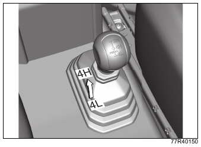{ .center-image }

## ESP®

### Эксплуатация ESP®

ESP® ([※](#esp-abbreviation-note)) объединяет управление ABS, системой помощи при торможении, противобуксовочной системой, системой стабилизации и другими функциями, чтобы помогать сохранять устойчивость автомобиля.

!!! info "Примечание"
    ※ ESP® - сокращение от Electronic Stability Program, «электронная система стабилизации». Это зарегистрированный товарный знак Mercedes-Benz Group AG.

#### Антиблокировочная система ABS

См. раздел [ABS](#abs).

#### Система помощи при торможении

Работает так же, как система помощи при торможении в ABS.

#### Противобуксовочная система

При трогании или ускорении на скользкой дороге система помогает предотвратить чрезмерную пробуксовку ведущих колёс, управляя тормозами и мощностью двигателя, чтобы сохранить подходящую тягу.

#### Система стабилизации

При резком повороте рулевого колеса или при движении в повороте на скользкой дороге система помогает подавлять занос и поддерживать устойчивость автомобиля.

!!! danger "Внимание"
    Всегда оценивайте дорожную обстановку и соблюдайте безопасный стиль вождения. Возможности ESP® ограничены.

!!! warning "Осторожно"
    Соблюдайте перечисленные ниже требования. Если их не соблюдать, ESP® может работать неправильно или срабатывать ошибочно.

    - Поддерживайте давление в шинах на заданном уровне. См. [давление воздуха в шинах](08-service-data.md#давление-воздуха-в-шинах).
    - При замене шин устанавливайте на все четыре колеса шины указанного размера, одной марки и с одинаковым рисунком протектора.
    - Не используйте шины с заметно разной степенью износа.
    - Не изменяйте подвеску или тормоза, например высоту автомобиля или жёсткость подвески.
    - Не ездите при сильно изношенных или неисправных элементах подвески или тормозов.
    - Не изменяйте двигатель, например выпускную систему.
    - Не устанавливайте LSD (самоблокирующийся дифференциал) или подобные доработки, кроме оригинального аксессуара Suzuki LSD.

    При установке цепей противоскольжения или неоригинального запасного колеса ESP® может работать неправильно.

!!! tip "Подсказка"
    В следующих случаях временно может быть слышен звук электродвигателя или щелчок. Это звук проверки системы, он не является неисправностью:

    - когда выключатель двигателя переведён в положение `ON`;
    - когда выключатель двигателя переведён в положение `ON` при нажатой педали тормоза и затем педаль тормоза отпущена впервые;
    - при запуске двигателя;
    - при первом трогании после запуска двигателя.

    Если ESP® срабатывает при высоких оборотах двигателя, можно почувствовать изменение оборотов или вибрацию кузова. Это не является неисправностью.

### Индикатор работы ESP®

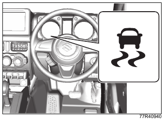{ .center-image }

Индикатор расположен на комбинации приборов.

См. также: [контрольные лампы и индикаторы](01-quick-guide.md#контрольные-лампы-и-индикаторы).

- Если в электронной системе управления ESP® есть неисправность, при положении выключателя двигателя `ON` индикатор загорается. Пока он горит, обратитесь для проверки к дилеру Suzuki или в авторизованный сервис Suzuki. В этом состоянии:
    - не работают противобуксовочная система, система стабилизации, [система помощи при спуске](#система-помощи-при-спуске), [системы помощи водителю Suzuki Safety Support](#системы-помощи-водителю-suzuki-safety-support) и [система автоматической остановки двигателя](#система-автоматической-остановки-двигателя-на-холостом-ходу);
    - [система удержания на подъёме](#система-удержания-на-подъёме) также может не работать;
    - ABS продолжает работать;
    - система помощи при торможении может не работать в зависимости от характера неисправности.
- В следующих ситуациях индикатор часто мигает с интервалом 0,2 секунды:
    - при трогании или ускорении работает противобуксовочная система;
    - на спуске работает [система помощи при спуске](#система-помощи-при-спуске);
    - при резком повороте рулевого колеса или в повороте работает система стабилизации.
- Если система исправна, при переводе выключателя двигателя в положение `ON` индикатор загорается примерно на 2 секунды, а затем гаснет.

!!! warning "Осторожно"
    Если индикатор часто мигает, автомобиль находится на скользкой дороге и может застрять или уйти в занос. Управляйте автомобилем особенно осторожно.

!!! tip "Подсказка"
    Пока индикатор горит постоянно, противобуксовочная система и система стабилизации не работают, но ABS продолжает работать.

### Выключатель ESP® OFF

В следующих случаях нажмите и удерживайте выключатель `ESP® OFF`, пока на комбинации приборов не загорится индикатор `ESP® OFF`. Противобуксовочная система и система стабилизации перестанут работать.

- При выезде из застревания и в подобных ситуациях, когда противобуксовочная система может мешать освобождению автомобиля.

Если выполнить одно из следующих действий, индикатор `ESP® OFF` погаснет, а противобуксовочная система и система стабилизации снова смогут работать:

- ещё раз нажать выключатель `ESP® OFF`;
- превысить скорость примерно 30 км/ч;
- один раз остановить двигатель и снова запустить его.

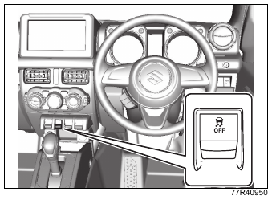{ .center-image }

После выезда из застревания и при возвращении к обычному движению ещё раз нажмите выключатель `ESP® OFF`, погасите индикатор `ESP® OFF` и верните систему в исходное состояние.

!!! tip "Подсказка"
    В целях безопасности ABS и система помощи при торможении не отключаются даже при нажатии выключателя `ESP® OFF`.

    Когда скорость автомобиля превышает 30 км/ч, ESP® и противобуксовочная система автоматически возвращаются в рабочее состояние. Поэтому выключателем можно только временно остановить их работу.

    При отключении ESP® звучит зуммер в салоне, загораются индикатор `DSBS II OFF` системы поддержки торможения с двумя датчиками и индикатор `OFF` функции предотвращения схода с полосы, а системы помощи водителю Suzuki Safety Support отключаются.

    См. также: [системы помощи водителю Suzuki Safety Support](#системы-помощи-водителю-suzuki-safety-support).

    Когда рычаг раздаточной коробки находится в положении `4L`, длительным нажатием выключателя `ESP® OFF` можно отключить систему удержания на подъёме.

    См. также: [отключение системы удержания на подъёме](#отключение-системы-удержания-на-подъёме).

### Индикатор ESP® OFF

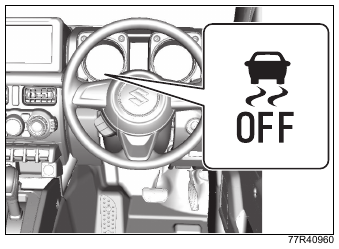{ .center-image }

Индикатор расположен на комбинации приборов.

См. также: [контрольные лампы и индикаторы](01-quick-guide.md#контрольные-лампы-и-индикаторы).

- При положении выключателя двигателя `ON` индикатор загорается, если нажать и удерживать выключатель `ESP® OFF`.
    - Пока индикатор горит, противобуксовочная система и система стабилизации не работают.
- Если система исправна, при переводе выключателя двигателя в положение `ON` индикатор загорается примерно на 2 секунды, а затем гаснет.

!!! tip "Подсказка"
    При переключении привода в положение `4L` для увеличения тяги на комбинации приборов загорается индикатор `ESP® OFF`, а стабилизация курсовой устойчивости и управление тягой за счёт ограничения мощности двигателя отключаются.

    См. также: [эксплуатация ESP®](#эксплуатация-esp).

    При срабатывании тормозной функции имитации самоблокирующегося дифференциала ([※](#brake-lsd-traction-control-note-esp-off)) могут появляться звук и вибрация от работы тормозов. Это не является неисправностью.

    При переключении привода в положение `4L` звучит зуммер в салоне, загораются индикатор `DSBS II OFF` системы поддержки торможения с двумя датчиками и индикатор `OFF` функции предотвращения схода с полосы, а системы помощи водителю Suzuki Safety Support отключаются.

    При переключении привода из положения `4L` в `4H` звучит зуммер в салоне, индикатор `DSBS II OFF` системы поддержки торможения с двумя датчиками и индикатор `OFF` функции предотвращения схода с полосы гаснут, а системы помощи водителю Suzuki Safety Support автоматически возвращаются в работу.

    ※ Тормозная функция имитации самоблокирующегося дифференциала помогает сохранить тягу на противоположном ведущем колесе, когда на скользкой дороге одно из ведущих колёс буксует. Для этого система притормаживает буксующее колесо.

### ABS

#### Что такое ABS

ABS - сокращение от английского Antilock Brake System, то есть «антиблокировочная тормозная система». ABS автоматически предотвращает блокировку колёс при торможении и помогает сохранить устойчивость автомобиля и возможность рулевого управления.

!!! danger "Внимание"
    Всегда оценивайте дорожную обстановку и соблюдайте безопасный стиль вождения. Возможности ABS ограничены.

    ABS не сможет помочь, если превышен предел сцепления шин с дорогой или возникло аквапланирование.

    Аквапланирование - это потеря контакта шин с дорогой из-за водяной плёнки между шиной и покрытием, например при движении на высокой скорости в дождь.

#### О тормозном пути

ABS не предназначена для сокращения тормозного пути.

!!! warning "Осторожно"
    При резком торможении или торможении на скользкой дороге тормозной путь примерно такой же, как у автомобиля без ABS.

    В следующих ситуациях тормозной путь может быть больше, чем у автомобиля без ABS. Снижайте скорость и держите достаточную дистанцию:

    - на неровной дороге, булыжнике и других плохих покрытиях;
    - на гравии и свежем снегу;
    - при переезде ступеньки, например стыка дорожного полотна;
    - при проезде по металлическим плитам, например крышкам люков;
    - при установленных цепях противоскольжения.

    При экстренном торможении не нажимайте педаль тормоза прерывисто. Нажмите педаль тормоза сразу и сильно. Прерывистое торможение увеличивает тормозной путь.

    Прерывистое торможение - это способ торможения, при котором педаль тормоза несколько раз нажимают короткими движениями.

    В зависимости от состояния дороги ABS не работает примерно ниже 10 км/ч.

#### Вибрация и звуки при работе ABS

Если сильно нажать педаль тормоза, можно почувствовать частую вибрацию педали тормоза, рулевого колеса или кузова. Это связано с работой ABS и не является неисправностью. Продолжайте сильно удерживать педаль тормоза нажатой.

!!! tip "Подсказка"
    Сразу после запуска двигателя и начала движения временно может быть слышен звук электродвигателя. Это звук проверки системы, он не является неисправностью.

#### О шинах

!!! danger "Внимание"
    ABS определяет скорость вращения каждого колеса датчиками. При замене шин устанавливайте на все четыре колеса шины указанного размера, одного производителя, одной марки и с одинаковым рисунком протектора. Не используйте шины с заметно разной степенью износа.

    Если система не сможет точно определить скорость вращения колёс, ABS не сможет нормально работать, что может привести к неожиданной аварии.

#### Когда ABS может сработать при торможении

ABS может сработать при торможении и в следующих ситуациях.

| Условие | Пример |
| --- | --- |
| Движение по скользкому покрытию | 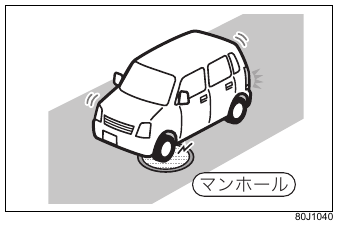 |
| Движение по скользкому покрытию | 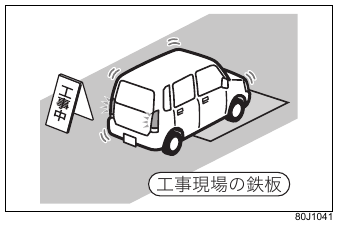 |
| Движение по скользкому покрытию | 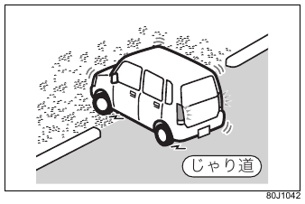 |
| Переезд ступеньки, например стыка дорожного полотна |  |
| Переезд ступеньки, например стыка дорожного полотна |  |
| Движение по плохой дороге |  |
| Движение по плохой дороге |  |

### Предупреждающая лампа ABS

{ .center-image }

Лампа расположена на комбинации приборов.

- Если в электронной системе управления ABS есть неисправность, лампа загорается при положении выключателя двигателя `ON`.

См. также: [предупреждающие лампы](01-quick-guide.md#предупреждающие-лампы).

### Система помощи при торможении

Эта система помогает увеличить усилие торможения. При резком торможении она сокращает время до полного проявления эффективности ABS.

- Если не нажать педаль тормоза достаточно сильно, система помощи при торможении не сработает.
- Система помощи при торможении не может превысить исходные возможности тормозной системы.

### Сигнал экстренного торможения ESS

ESS - сокращение от Emergency Stop Signal, «сигнал экстренного торможения». Если выполнены все условия ниже, при работе ESS аварийная световая сигнализация мигает быстрее обычного и предупреждает водителей сзади. Одновременно на комбинации приборов мигают индикаторы указателей поворота.

- В момент резкого нажатия педали тормоза скорость автомобиля составляет примерно 55 км/ч или выше.
- ABS работает или торможение настолько резкое, что ABS должна сработать.

{ .center-image }

- Иллюстрация приведена как типовой пример. Фактический вид зависит от типа автомобиля.

ESS прекращает работу в следующих случаях:

- скорость автомобиля достаточно снизилась;
- педаль тормоза отпущена;
- ABS перестала работать;
- выключатель аварийной световой сигнализации переведён в положение `ON`.

!!! danger "Внимание"
    ESS предупреждает водителей сзади при резком торможении во время движения и помогает снизить риск попутного столкновения, но не предотвращает все такие столкновения. При замедлении и остановке избегайте ненужного резкого торможения и всегда соблюдайте безопасный стиль вождения.

!!! tip "Подсказка"
    Функцию ESS отключить нельзя.

    Управление выключателем аварийной световой сигнализации имеет приоритет над работой ESS.

    Если при движении по скользкой дороге или при переезде ступеньки, например стыка дорожного полотна, ABS сработала только на мгновение, ESS может не включиться.

### Система удержания на подъёме

Система удержания на подъёме помогает плавно тронуться на подъёме: при переносе ноги с педали тормоза на педаль акселератора она временно, примерно на 2 секунды, удерживает автомобиль от откатывания назад.

- Система удержания на подъёме не предназначена для удержания автомобиля на склоне на месте.
- Если в системе есть неисправность, на комбинации приборов загорается индикатор работы ESP®, и система удержания на подъёме может не работать. Обратитесь для проверки к дилеру Suzuki или в авторизованный сервис Suzuki.

{ .center-image }

См. также: [индикатор работы ESP®](#индикатор-работы-esp).

!!! danger "Внимание"
    Всегда оценивайте дорожную обстановку, при необходимости нажимайте педаль тормоза и соблюдайте безопасный стиль вождения. Возможности системы удержания на подъёме ограничены.

    На очень крутом подъёме, на обледеневшей дороге, в грязи или при большой массе груза автомобиль при трогании может откатиться назад.

    Если система удержания на подъёме сработает на очень крутом подъёме, на обледеневшей дороге или в грязи, колёса могут заблокироваться, и автомобиль может стать неуправляемым.

    После отпускания педали тормоза сразу начинайте трогание. Если после отпускания педали тормоза прошло больше 2 секунд, система удержания на подъёме отключится, и на уклоне автомобиль может покатиться под собственным весом, что создаёт риск неожиданной аварии. Кроме того, двигатель может заглохнуть; при этом для нажатия педали тормоза потребуется большее усилие, рулевое колесо станет тяжелее, и это может привести к аварии или неисправности.

#### Условия работы системы удержания на подъёме

Система удержания на подъёме предотвращает откатывание автомобиля примерно на 2 секунды после отпускания педали тормоза, если выполнены все условия ниже.

- Рычаг переключения передач или селектор находится в положении движения вперёд или назад.
- Стояночный тормоз отпущен.
- Направление движения совпадает с подъёмом.

На автомобиле с автоматической коробкой передач система удержания на подъёме также работает при повторном запуске двигателя после автоматической остановки, даже если перечисленные выше условия не выполнены.

См. также: [система автоматической остановки двигателя](#система-автоматической-остановки-двигателя-на-холостом-ходу).

!!! tip "Подсказка"
    Во время работы системы из моторного отсека может быть слышен звук, но это не является неисправностью.

    Возможные признаки работы системы:

    - из моторного отсека слышен звук;
    - педаль тормоза может стать твёрдой и не нажиматься глубже.

#### Отключение системы удержания на подъёме

При движении на очень крутом подъёме, на обледеневшей дороге, в грязи и подобных условиях можно нажать и удерживать выключатель `ESP® OFF`. На многофункциональном информационном дисплее появится сообщение, и система удержания на подъёме перейдёт в отключённое состояние.

Чтобы отменить отключение системы удержания на подъёме, ещё раз нажмите и удерживайте выключатель `ESP® OFF`.

{ .center-image }

Сообщение: «Система удержания на подъёме отключена».

!!! tip "Подсказка"
    Отключение системы удержания на подъёме доступно, когда рычаг раздаточной коробки находится в положении `4L`.

    Если система удержания на подъёме отключена и рычаг раздаточной коробки перевести из положения `4L` в `4H`, отключение системы удержания на подъёме отменяется.

### Система помощи при спуске

Система помощи при спуске помогает двигаться на крутом спуске, где торможения двигателем недостаточно для замедления. Система с помощью ESP® поддерживает постоянную низкую скорость.

!!! danger "Внимание"
    Не полагайтесь на систему помощи при спуске чрезмерно. На очень крутом спуске, на обледеневшей дороге, в грязи или при большой массе груза система может не удерживать постоянную низкую скорость, что создаёт риск неожиданной аварии. При необходимости нажимайте педаль тормоза и соблюдайте безопасный стиль вождения.

!!! tip "Подсказка"
    На скользком спуске, например на снегу, система помощи при спуске позволяет меньше отвлекаться на педали тормоза и акселератора и сосредоточиться на рулевом управлении.

#### Работа системы помощи при спуске

##### Готовность

1. Подготовьте коробку передач:

    - **Автомобили с механической коробкой передач:** переведите рычаг переключения передач в любое положение, кроме `N` (нейтраль).
    - **Автомобили с автоматической коробкой передач:** переведите селектор в положение `R`, `D`, `2` или `L`.

2. Включите систему в зависимости от положения рычага раздаточной коробки:

    - Если рычаг раздаточной коробки находится в положении `4H`, при скорости примерно 10 км/ч или ниже нажмите выключатель системы помощи при спуске (1).
    - Если рычаг раздаточной коробки находится в положении `4L`, при скорости примерно 5 км/ч или ниже нажмите выключатель системы помощи при спуске (1).

    На комбинации приборов загорится индикатор системы помощи при спуске, и система перейдёт в состояние готовности.

См. также: [индикатор системы помощи при спуске](#индикатор-системы-помощи-при-спуске).

{ .center-image }

| Обозначение | Описание |
| --- | --- |
| (1) | Выключатель системы помощи при спуске |

##### Работа

Когда рычаг раздаточной коробки находится в положении `4H`, педаль акселератора не нажата и скорость автомобиля превышает примерно 10 км/ч, тормоза включаются автоматически и поддерживают скорость около 10 км/ч.

Когда рычаг раздаточной коробки находится в положении `4L`, педаль акселератора не нажата и скорость автомобиля превышает примерно 5 км/ч, тормоза включаются автоматически и поддерживают скорость около 5 км/ч.

- Когда система помощи при спуске автоматически включает тормоза, индикатор работы ESP® часто мигает. Одновременно загораются стоп-сигналы.
- Если скорость автомобиля станет примерно 35 км/ч или выше, индикатор системы помощи при спуске начнёт мигать, и система автоматически прекратит работу. Когда скорость снизится примерно до 25 км/ч или ниже, индикатор снова загорится постоянно, и система вернётся в состояние готовности.

!!! warning "Осторожно"
    При длительном непрерывном использовании тормозная система может перегреться. В этом случае для защиты системы индикатор системы помощи при спуске начнёт мигать, и система автоматически прекратит работу. Нажмите педаль тормоза и остановитесь в безопасном месте.

    Когда через некоторое время температура тормозной системы снизится, индикатор системы помощи при спуске перестанет мигать и загорится постоянно, а система вернётся в состояние готовности.

!!! tip "Подсказка"
    На автомобиле с механической коробкой передач система помощи при спуске может работать и при положении рычага `N` (нейтраль), но торможение двигателем в этом случае не действует. Переводите рычаг переключения передач в любое положение, кроме `N` (нейтраль).

    На автомобиле с автоматической коробкой передач система помощи при спуске может работать и при положении селектора `N`, но торможение двигателем в этом случае не действует. Переводите селектор в положение `R`, `D`, `2` или `L`.

    Чтобы включить систему помощи при спуске, нажмите её выключатель и убедитесь, что индикатор системы помощи при спуске загорелся.

    Во время работы системы из моторного отсека может быть слышен звук, но это не является неисправностью.

##### Отключение системы

Чтобы отключить систему, ещё раз нажмите выключатель системы помощи при спуске (1) и убедитесь, что индикатор системы помощи при спуске погас.

### Индикатор системы помощи при спуске

{ .center-image }

Индикатор расположен на комбинации приборов.

- Когда выключатель двигателя находится в положении `ON`, при нажатии выключателя системы помощи при спуске индикатор загорается, если система перешла в состояние готовности. Если индикатор мигает, система помощи при спуске не работает. Проверьте, выполнены ли условия работы:
    - **автомобили с механической коробкой передач:** рычаг переключения передач находится не в положении `N` (нейтраль);
    - **автомобили с автоматической коробкой передач:** селектор находится в положении `R`, `D`, `2` или `L`;
    - рычаг раздаточной коробки находится в положении `4H` или `4L`;
    - скорость автомобиля не выше 25 км/ч;
    - тормозная система не перегрета.
- Если система исправна, при переводе выключателя двигателя в положение `ON` индикатор загорается примерно на 2 секунды, а затем гаснет.
- В следующих случаях возможна неисправность системы. Обратитесь для проверки к дилеру Suzuki или в авторизованный сервис Suzuki:
    - индикатор не загорается при переводе выключателя двигателя в положение `ON`;
    - индикатор не гаснет примерно через 2 секунды после перевода выключателя двигателя в положение `ON`;
    - при положении выключателя двигателя `ON` индикатор не загорается и не мигает при нажатии выключателя системы помощи при спуске.

## Системы помощи водителю Suzuki Safety Support

Системы помощи водителю Suzuki Safety Support помогают водителю и делают поездку безопаснее и комфортнее.

#### О Suzuki Safety Support

Suzuki Safety Support рассчитана на то, что водитель сам ведёт автомобиль безопасно. Система предназначена для снижения тяжести последствий аварий и уменьшения нагрузки на водителя.

У системы есть ограничения по распознаванию и управлению. Не полагайтесь на неё чрезмерно: водитель всегда обязан самостоятельно оценивать обстановку вокруг автомобиля и соблюдать безопасный стиль вождения.

#### Для безопасного использования

!!! danger "Внимание"
    Не полагайтесь на систему чрезмерно. Водитель всегда обязан самостоятельно оценивать обстановку вокруг автомобиля и соблюдать безопасный стиль вождения.

    Система работает не во всех ситуациях, а её помощь ограничена. Если полагаться на систему или передавать ей ответственность за безопасность, это может привести к неожиданной аварии, тяжёлым травмам или смерти.

    Не проверяйте работу системы самостоятельно. В зависимости от объекта и условий система может не сработать должным образом, что может привести к неожиданной аварии.

    Если управление требует внимания или в системе возникла неисправность, водитель предупреждается сообщением и предупреждающим зуммером. Если на дисплее появляется предупреждающее сообщение, следуйте указаниям на экране.

!!! tip "Подсказка"
    Из-за внешнего шума или звука аудиосистемы предупреждающий зуммер может быть плохо слышен. Кроме того, в зависимости от дорожного покрытия работу системы можно почувствовать не всегда.

#### Когда нужно отключить систему

В перечисленных ниже случаях отключайте систему. Иначе она может работать неправильно, что может привести к неожиданной аварии, тяжёлым травмам или смерти.

- Автомобиль наклонён из-за перегруза или прокола шины.
- Автомобиль буксируют.
- Автомобиль перевозят на грузовике, судне, поезде и т. п.
- Автомобиль поднят на подъёмнике, а колёса вращаются.
- При проверке используется шасси-динамометр, свободные ролики и т. п.
- Выполняется движение по бездорожью или спортивное вождение.
- Используется автоматическая мойка.
- Из-за удара по датчику или зоне вокруг датчика направление датчика сместилось либо датчик деформирован.
- Установлено оборудование, закрывающее датчики или фары.
- Установлены временное запасное колесо, комплект для временного ремонта шины, цепи противоскольжения и т. п.
- Остаточная глубина протектора недостаточна или давление воздуха в шинах ниже нормы.
- Установлены шины размера, не указанного производителем.
- Автомобиль движется нестабильно из-за аварии, неисправности и т. п.

Распознавание системой автомобилей впереди, препятствий, линий разметки и дорожных знаков ограничено областью обзора. Кроме того, после попадания объекта в область обзора до начала управления или предупреждения может пройти несколько секунд.

#### Системы помощи водителю

В Suzuki Safety Support входят следующие функции:

- [система поддержки торможения с двумя датчиками DSBS II](#система-поддержки-торможения-с-двумя-датчиками-dsbs-ii);
- [предотвращение ошибочного начала движения](#предотвращение-ошибочного-начала-движения);
- [функция предотвращения схода с полосы](#предотвращение-схода-с-полосы);
- [уведомление о начале движения](#уведомление-о-начале-движения);
- [система автоматического дальнего света](#система-автоматического-дальнего-света);
- [распознавание дорожных знаков](#распознавание-дорожных-знаков);
- [адаптивный круиз-контроль](#адаптивный-круиз-контроль) (в зависимости от комплектации);
- [адаптивный круиз-контроль с функцией следования во всём диапазоне скоростей](#адаптивный-круиз-контроль-с-функцией-следования-во-всём-диапазоне-скоростей) (в зависимости от комплектации);
- [парковочные датчики](#парковочные-датчики);
- [система помощи при торможении на малой скорости при движении вперёд и назад](#поддержка-торможения-на-малой-скорости-при-движении-вперёд-и-назад) (в зависимости от комплектации);
- [предотвращение ошибочного начала движения назад](#предотвращение-ошибочного-начала-движения-назад) (в зависимости от комплектации).

Также прочитайте:

- [при прохождении технического осмотра](02-safety.md#при-прохождении-технического-осмотра);
- [если автомобиль буксируют](07-emergency.md#если-автомобиль-буксируют-эвакуатором);
- [передняя камера, передний радар и ультразвуковые датчики](#передняя-камера-передний-радар-и-ультразвуковые-датчики);
- [выключатель OFF системы поддержки торможения с двумя датчиками DSBS II](#выключатель-off-системы-поддержки-торможения-с-двумя-датчиками-dsbs-ii);
- [выключатель OFF функции предотвращения схода с полосы](#выключатель-off-предотвращения-схода-с-полосы);
- [выключатель OFF зуммера парковочных датчиков](#выключатель-отключения-зуммера-парковочных-датчиков).

#### Если точная скорость вращения шин не определяется

Если давление воздуха в шинах не соответствует норме и точная скорость вращения шин не определяется, перечисленные ниже функции могут работать неправильно. Это может привести к неожиданной аварии или неисправности.

Если точную скорость вращения шин определить невозможно, например потому что давление воздуха не удаётся привести к норме, отключите систему поддержки торможения с двумя датчиками DSBS II.

См. также: [выключатель OFF системы поддержки торможения с двумя датчиками DSBS II](#выключатель-off-системы-поддержки-торможения-с-двумя-датчиками-dsbs-ii).

- Система поддержки торможения с двумя датчиками DSBS II.
- Предотвращение ошибочного начала движения (в зависимости от комплектации).
- Предотвращение схода с полосы.
- Адаптивный круиз-контроль (в зависимости от комплектации).
- Адаптивный круиз-контроль с функцией следования во всём диапазоне скоростей (в зависимости от комплектации).
- Система помощи при торможении на малой скорости при движении вперёд и назад (в зависимости от комплектации).
- Предотвращение ошибочного начала движения назад (в зависимости от комплектации).

!!! tip "Подсказка"
    При переключении рычага раздаточной коробки в положение `4L` загораются индикатор `DSBS II OFF` системы поддержки торможения с двумя датчиками и индикатор `OFF` функции предотвращения схода с полосы, а системы помощи водителю Suzuki Safety Support отключаются.

    См. также: [работа рычага раздаточной коробки и индикатор](#работа-рычага-раздаточной-коробки-и-индикатор).

### Передняя камера, передний радар и ультразвуковые датчики

Система распознаёт информацию, необходимую для работы, с помощью нескольких датчиков.

#### Датчики, распознающие обстановку вокруг автомобиля

##### Спереди

{ .center-image }

| Обозначение | Описание |
| --- | --- |
| (1) | Передняя камера |
| (2) | Передний радар |
| (3) | Ультразвуковой датчик |

##### Сзади

{ .center-image }

| Обозначение | Описание |
| --- | --- |
| (3) | Ультразвуковой датчик |

#### Чтобы предотвратить неисправность или ошибочную работу передней камеры

!!! danger "Внимание"
    Соблюдайте перечисленные ниже требования. Если их не соблюдать, передняя камера может работать неправильно, что может привести к неожиданной аварии, тяжёлым травмам или смерти.

- При замене передних стеклоочистителей или щёток используйте указанные детали. Подробнее уточняйте у дилера Suzuki или в авторизованном сервисе Suzuki.
- Не кладите и не устанавливайте предметы, которые могут закрыть обзор передней камеры.
- Всегда поддерживайте ветровое стекло чистым:
    - если снаружи ветрового стекла есть грязь, масляная плёнка, капли воды, снег и т. п., удалите их;
    - даже если на ветровое стекло нанесено водоотталкивающее покрытие, при появлении капель воды перед передней камерой удалите их стеклоочистителями;
    - если загрязнилась зона крепления передней камеры с внутренней стороны ветрового стекла, обратитесь к дилеру Suzuki или в авторизованный сервис Suzuki.
- Не наклеивайте наклейки, включая прозрачные, на участок ветрового стекла перед передней камерой, показанный на рисунке.

{ .center-image }

| Обозначение | Описание |
| --- | --- |
| (1) | Примерно 15 см |
| (2) | Примерно 30 см |

- Если стеклоочиститель не удаляет капли воды с участка ветрового стекла перед передней камерой должным образом, замените резинку или щётку стеклоочистителя.
- Если на ветровом стекле появились царапины или трещины, не оставляйте их без ремонта: замените стекло. После замены ветрового стекла требуется повторная регулировка передней камеры. Подробнее обратитесь к дилеру Suzuki или в авторизованный сервис Suzuki.
- Не допускайте попадания жидкости на переднюю камеру.
- Не направляйте на переднюю камеру сильный свет.
- Не загрязняйте и не царапайте объектив передней камеры. При очистке внутренней стороны ветрового стекла следите, чтобы очиститель стекла не попал на объектив. Не касайтесь объектива. Если объектив загрязнён или повреждён, обратитесь к дилеру Suzuki или в авторизованный сервис Suzuki.
- Не подвергайте переднюю камеру сильным ударам.
- Не изменяйте положение или направление установки передней камеры и не снимайте её.
- Не разбирайте переднюю камеру.
- Не изменяйте внутреннее зеркало, детали вокруг передней камеры и потолок.
- Не устанавливайте на капот, переднюю решётку или передний бампер аксессуары, которые могут закрыть обзор передней камеры. Подробнее обратитесь к дилеру Suzuki или в авторизованный сервис Suzuki.
- При перевозке на крыше длинного груза, например доски для серфинга, следите, чтобы он не закрывал обзор передней камеры.
- Не изменяйте фары и другие световые приборы.

#### О зоне крепления передней камеры на ветровом стекле

Если система определит, что ветровое стекло может запотеть, обогреватель автоматически включит устранение запотевания вокруг передней камеры. Если при очистке или обслуживании нужно прикоснуться к зоне вокруг передней камеры, дождитесь, пока ветровое стекло достаточно остынет. Иначе можно получить ожог.

#### Чтобы предотвратить неисправность или ошибочную работу переднего радара

!!! danger "Внимание"
    Соблюдайте перечисленные ниже требования. Если их не соблюдать, передний радар может работать неправильно, что может привести к неожиданной аварии, тяжёлым травмам или смерти.

- Всегда поддерживайте передний радар и переднюю решётку перед радаром в чистоте.
- Если на передней поверхности переднего радара или на передней и задней поверхностях передней решётки перед радаром есть грязь, капли воды, снег, полиэтиленовый пакет или подобный предмет, удалите их. Это относится в том числе к прозрачным, полупрозрачным, цветным и металлизированным материалам.
- При очистке используйте мягкую ткань, чтобы не поцарапать передний радар или передний бампер в зоне перед радаром.

{ .center-image }

| Обозначение | Описание |
| --- | --- |
| (1) | Передний бампер, зона перед радаром |
| (2) | Передний радар |

- Не устанавливайте аксессуары и не наклеивайте наклейки, включая прозрачные, вокруг переднего радара и передней решётки перед радаром.
- Избегайте ударов в зоне переднего радара. Если удар пришёлся на передний радар, переднюю решётку или передний бампер, обязательно обратитесь для проверки к дилеру Suzuki или в авторизованный сервис Suzuki.
- Не разбирайте передний радар.
- Не изменяйте и не окрашивайте передний радар и переднюю решётку перед радаром. Не заменяйте их деталями, отличными от оригинальных.
- В следующих случаях требуется повторная регулировка переднего радара. Подробнее обратитесь к дилеру Suzuki или в авторизованный сервис Suzuki:
    - передний радар был заменён;
    - передний бампер или передняя решётка были заменены.

#### Чтобы предотвратить неисправность или ошибочную работу ультразвуковых датчиков

!!! danger "Внимание"
    Соблюдайте перечисленные ниже требования. Если их не соблюдать, ультразвуковые датчики могут работать неправильно, что может привести к неожиданной аварии, тяжёлым травмам или смерти.

- Всегда поддерживайте поверхности ультразвуковых датчиков чистыми.
- Если на поверхности ультразвуковых датчиков есть грязь, капли воды, снег, полиэтиленовый пакет и т. п., удалите их. При очистке используйте мягкую ткань, чтобы не поцарапать датчики.
- Не устанавливайте аксессуары и не наклеивайте наклейки, включая прозрачные, вокруг ультразвуковых датчиков. На передние ультразвуковые датчики наклеена оригинальная защитная плёнка. Не снимайте её и не наклеивайте заново.
- Избегайте ударов в зоне ультразвуковых датчиков. Если удар пришёлся на ультразвуковой датчик, переднюю решётку, передний бампер или задний бампер, обязательно обратитесь для проверки к дилеру Suzuki или в авторизованный сервис Suzuki.
- Не изменяйте положение или направление установки ультразвуковых датчиков и не снимайте их.
- Не разбирайте ультразвуковые датчики.
- Не изменяйте и не окрашивайте ультразвуковые датчики и специальные крышки ультразвуковых датчиков. Не заменяйте их деталями, отличными от оригинальных.
- При использовании мойки высокого давления не направляйте сопло прямо на ультразвуковые датчики.
- При использовании пароочистителя не подносите пар слишком близко к ультразвуковым датчикам.
- В следующих случаях требуется измерение угла установки и инициализация ультразвуковых датчиков. Подробнее обратитесь к дилеру Suzuki или в авторизованный сервис Suzuki:
    - ультразвуковые датчики снимались, устанавливались или заменялись;
    - передний бампер, передняя решётка или задний бампер были заменены.

#### Когда передняя камера и передний радар могут работать неправильно

Передняя камера и передний радар могут работать неправильно в следующих случаях:

- автомобиль доработан так, что изменилась его высота или наклон;
- ветровое стекло загрязнено, запотело, треснуло или повреждено;
- передняя камера или передний радар имеют крайне низкую или крайне высокую температуру;
- на поверхности перед датчиком есть грязь, капли дождя, снег, насекомые, мусор и т. п.;
- плохая погода: туман, снег, песчаная буря, сильный дождь и т. п.;
- впереди поднимаются вода, снег, пыль, пар или дым;
- в тёмном месте, например ночью или в тоннеле, фары не включены;
- линзы фар загрязнены, и свет стал слабым;
- нарушена регулировка света фар;
- фары неисправны;
- в переднюю камеру попадает свет фар встречного автомобиля, солнце, отражённый свет и т. п.;
- яркость резко меняется;
- автомобиль движется рядом с телебашней, радиостанцией, электростанцией, автомобилем с радаром или другим источником сильных радиоволн или помех;
- щётка стеклоочистителя закрывает обзор датчика.
- Вокруг есть объекты, отражающие радиоволны радара:
    - тоннель;
    - ферменный мост;
    - гравийная дорога;
    - заснеженная дорога с колеями;
    - стена;
    - крупный грузовик;
    - крышка люка;
    - ограждение;
    - стальная плита.
- Вокруг есть ступеньки или выступающие предметы.
- Распознаваемый автомобиль имеет очень малую ширину, например сверхмалое транспортное средство.
- Передняя или задняя площадь распознаваемого автомобиля мала, например у порожнего грузовика.
- Передняя или задняя часть распознаваемого автомобиля расположена низко, например у низкорамного прицепа.

{ .center-image }

- Дорожный просвет распознаваемого автомобиля очень большой.

{ .center-image }

- Груз выступает за пределы кузова распознаваемого автомобиля.
- Часть распознаваемого автомобиля закрыта тканью или другим материалом, и открытого металла мало.
- Распознаваемый автомобиль имеет особую форму, например трактор или мотоцикл с боковой коляской.
- Расстояние до распознаваемого автомобиля стало крайне малым.
- Положение распознаваемого автомобиля смещено.
- На распознаваемом автомобиле много снега, грязи и т. п.
- Автомобиль движется по следующим дорогам:
    - крутой поворот или извилистая дорога;
    - резкий подъём или спуск и другие дороги с изменением уклона;
    - дорога с боковым уклоном;
    - дорога с глубокими колеями;
    - неухоженная плохая дорога;
    - дорога с большим количеством неровностей и ступенек.
- Рулевое управление нестабильно.
- Положение автомобиля в полосе непостоянно.
- Компоненты системы, тормозной системы или связанные с ними детали чрезмерно холодные, перегретые, мокрые и т. п.
- Нарушена регулировка углов установки колёс.
- Автомобиль движется по скользкому покрытию: обледеневшей дороге, заснеженной дороге, гравию и т. п.
- Автомобиль движется по траектории, отличающейся от формы поворота.
- Скорость входа в поворот слишком высокая.
- Автомобиль въезжает на парковку, в гараж, автомобильный лифт или выезжает оттуда.
- Автомобиль движется по парковке.
- Автомобиль движется в месте, где препятствия могут нависать над автомобилем: густая трава, свисающие ветки, занавесы и т. п.
- Дует сильный ветер.

#### Когда линии полосы могут не распознаваться

- Ширина полосы крайне мала или крайне велика.
- Автомобиль только что перестроился или только что проехал перекрёсток.
- Автомобиль движется по полосе, ограниченной из-за дорожных работ, или по временной полосе.
- Рядом есть линии, похожие конструкции, рисунки или тени.
- Линии разметки плохо видны или автомобиль движется по мокрой дороге.
- Линии разметки нанесены на бордюр или подобную поверхность.
- Автомобиль движется по ярко отражающему покрытию, например бетонной дороге.
- На одной полосе есть несколько белых линий.

#### Когда часть систем или все системы не работают

- Обнаружена неисправность в этой системе или связанных системах, например тормозной системе или рулевом управлении.
- Работают системы безопасности, например ESP®.
- Системы безопасности, например ESP®, отключены.

#### Звуки работы тормозов и изменение ощущения педали

- При срабатывании тормозов может быть слышен звук их работы или может измениться ощущение при нажатии педали тормоза. Это не является неисправностью.
- Во время торможения, вызванного управлением системы, педаль тормоза может казаться твёрже, чем ожидает водитель, или может уходить глубже. В обоих случаях педаль можно нажать сильнее. При необходимости увеличьте усилие на педали тормоза.

#### Когда ультразвуковые датчики могут работать неправильно

- На ультразвуковых датчиках есть капли воды, лёд, снег, грязь и т. п.
- Часть ультразвукового датчика замёрзла.
- Автомобиль стоит под палящим солнцем или находится на сильном холоде.
- Температура воздуха вокруг резко изменилась.
- Автомобиль движется по неровной дороге, уклону, гравию или траве.
- Рядом есть источники ультразвука: сигнал другого автомобиля, звук двигателя мотоцикла, звук пневматического тормоза крупного автомобиля, звук тормозов, датчик обнаружения автомобиля, ультразвуковой датчик другого автомобиля и т. п.
- Поблизости есть источники ультразвука, например автомойка, автосервис или строительная площадка.
- Идёт сильный дождь или на датчики попали брызги воды.
- Препятствие подошло слишком близко к ультразвуковому датчику.
- Пешеход плохо отражает ультразвук.
- В зоне обнаружения есть объект, который не перпендикулярен земле, не расположен под прямым углом к направлению движения автомобиля, имеет неровную или волнистую поверхность.
- Дует сильный ветер.
- Плохая погода: туман, снег, песчаная буря и т. п.
- Между объектом и автомобилем есть другой объект, который не может быть обнаружен.
- Объект вклинился или выскочил сбоку автомобиля.
- Из-за столкновения или другого воздействия направление ультразвукового датчика сместилось.
- Рядом с ультразвуковыми датчиками установлен буксирный крюк, защита бампера, накладка бампера, крепление для велосипеда, снегоуборочное оборудование и т. п.
- Автомобиль движется нестабильно из-за аварии или неисправности.
- Используются цепи противоскольжения, временное запасное колесо или комплект для временного ремонта шины.
- Автомобиль движется по узкой дороге.
- Автомобиль движется в сторону занавеса, флага, шторы, свисающих веток или шлагбаума.
- На дороге есть колеи или ямы.
- Автомобиль движется по металлической крышке водоотводного канала, например решётке.
- Автомобиль движется по крутому подъёму или спуску.
- На затопленной дороге вода покрыла ультразвуковые датчики.
- Автомобиль движется к высокому бордюру или бордюру под прямым углом.
- Автомобиль движется рядом с колонной, например двутавровой балкой, на многоуровневой парковке или строительной площадке.

#### Обращение с подвеской

Если высота автомобиля или его наклон изменятся, датчики могут неправильно распознавать объекты, и система может работать неправильно. Это опасно. Не изменяйте подвеску.

#### Обращение с радаром

Обращение с передним радаром и радарным датчиком соответствует требованиям закона о радиосвязи. Маркировка, нанесённая на датчик, подтверждает это, поэтому не стирайте её.

Запрещается разбирать или изменять изделие: за это может быть предусмотрена ответственность. Используйте систему только на территории Японии.

#### Временная остановка или неисправность передней камеры, переднего радара и ультразвуковых датчиков

Если состояние соответствует таблице ниже, система временно остановлена или неисправна. В зависимости от причины временной остановки или неисправности схема индикации может отличаться.

| Индикатор или сообщение | Временная остановка системы | Неисправность |
| --- | --- | --- |
| Индикатор `DSBS II OFF` системы поддержки торможения с двумя датчиками | Горит | Горит |
| Индикатор `OFF` функции предотвращения схода с полосы | Горит | Горит |
| Индикатор адаптивного круиз-контроля | Горит | Горит |
| Предупреждающая лампа системы автоматического дальнего света | Горит | Горит |
| Индикатор `OFF` распознавания дорожных знаков | Горит | Горит |
| Индикатор работы парковочных датчиков | Горит | Горит |
| Главная предупреждающая лампа | Мигает | Мигает |
| Сообщение о временной остановке системы DSBS II | Отображается «Система DSBS II временно остановлена» | Не отображается |
| Сообщение о необходимости проверки системы DSBS II | Не отображается | Отображается «Требуется проверка системы DSBS II» |
| Сообщение о временной остановке системы ультразвуковых датчиков | Отображается «Система ультразвуковых датчиков временно остановлена» | Не отображается |
| Сообщение о необходимости проверки системы ультразвуковых датчиков | Не отображается | Отображается «Требуется проверка системы ультразвуковых датчиков» |
| Сообщение об очистке парковочных датчиков | Отображается «Очистите парковочные датчики» | Не отображается |
| Сообщение о необходимости проверки системы парковочных датчиков | Не отображается | Отображается «Требуется проверка системы парковочных датчиков» |

Такие сообщения могут отображаться также в следующих случаях:

- автомобиль движется по тёмной дороге без уличного освещения;
- автомобиль движется по уклону с резким изменением крутизны;
- автомобиль собирается остановиться в гараже;
- автомобиль медленно приближается передним ходом к однотонной стене;
- автомобиль медленно приближается передним ходом к рольставне или стене с горизонтальными полосами.

Если система DSBS II временно остановлена или неисправна, останавливаются следующие функции:

- система поддержки торможения с двумя датчиками DSBS II;
- предотвращение ошибочного начала движения (в зависимости от комплектации);
- функция предотвращения схода с полосы;
- уведомление о начале движения;
- система автоматического дальнего света;
- адаптивный круиз-контроль (в зависимости от комплектации);
- адаптивный круиз-контроль с функцией следования во всём диапазоне скоростей (в зависимости от комплектации);
- распознавание дорожных знаков.

Если система ультразвуковых датчиков временно остановлена или неисправна, останавливаются следующие функции:

- система помощи при торможении на малой скорости при движении вперёд и назад;
- предотвращение ошибочного начала движения назад (в зависимости от комплектации);
- парковочные датчики.

#### Временная остановка ультразвуковых датчиков

Ультразвуковые датчики временно останавливаются в следующих случаях. Когда ситуация улучшится, временная остановка датчиков будет отменена.

- На ультразвуковой датчик налип посторонний материал: грязь, снег, лёд и т. п.
- Напряжение свинцово-кислотной аккумуляторной батареи временно вышло за допустимый диапазон.

#### Неисправность ультразвуковых датчиков

При неисправности система останавливается до перевода выключателя двигателя в положение `LOCK` (`OFF`).

Остановитесь в безопасном месте, переведите выключатель двигателя в положение `LOCK` (`OFF`) и остановите двигатель. После повторного запуска двигателя убедитесь, что сообщения «Требуется проверка системы ультразвуковых датчиков» и «Требуется проверка системы парковочных датчиков» больше не отображаются.

- Если после повторного запуска двигателя сообщения «Требуется проверка системы ультразвуковых датчиков» или «Требуется проверка системы парковочных датчиков» продолжают отображаться, либо горит индикатор работы парковочных датчиков и предполагается неисправность, возможна неисправность ультразвуковых датчиков. Обратитесь к дилеру Suzuki или в авторизованный сервис Suzuki.

!!! tip "Подсказка"
    Если отображаются сообщения «Требуется проверка системы ультразвуковых датчиков» или «Требуется проверка системы парковочных датчиков», либо горит индикатор работы парковочных датчиков и предполагается неисправность, система останавливается, но обычному движению это не мешает.

#### Когда ультразвуковой датчик обнаружил посторонний материал

Если ультразвуковой датчик обнаружил грязь, снег, лёд или другой посторонний материал, налипший на датчик, на многофункциональном информационном дисплее отображается сообщение, показанное ниже. После удаления налипшего материала система возвращается к нормальной работе. Пока посторонний материал обнаруживается, ультразвуковой датчик временно остановлен.

Если сообщение отображается, хотя постороннего материала нет, возможна неисправность датчика. Обратитесь к дилеру Suzuki или в авторизованный сервис Suzuki.

{ .center-image }

Сообщение: «Очистите парковочные датчики».

| Обозначение | Описание |
| --- | --- |
| ※ | Отображается участок датчика, где обнаружен посторонний материал |

#### Временная остановка системы

Системы Suzuki Safety Support временно останавливаются в следующих случаях. Когда ситуация улучшится, временная остановка системы будет отменена.

| Отображаемое сообщение | Причина | Что делать |
| --- | --- | --- |
| «Система DSBS II временно остановлена» | Функции системы временно остановлены, потому что: - временно остановилась система, связанная с Suzuki Safety Support; - напряжение свинцово-кислотной аккумуляторной батареи временно вышло за допустимый диапазон; - автоматическая корректировка системы временно недостаточна. | До устранения причины продолжайте движение, внимательно контролируя обстановку вокруг автомобиля.  Если сообщение не исчезает длительное время, обратитесь к дилеру Suzuki или в авторизованный сервис Suzuki. |
| «Передняя камера временно остановлена (вне температурного диапазона)» | Функции системы временно остановлены, потому что передняя камера стала слишком холодной или слишком горячей. | До устранения причины продолжайте движение, внимательно контролируя обстановку вокруг автомобиля.  Если сообщение не исчезает длительное время, обратитесь к дилеру Suzuki или в авторизованный сервис Suzuki.  Если передняя камера перегрелась, например после стоянки под палящим солнцем, охладите зону вокруг камеры кондиционером.  Если передняя камера переохладилась, например после стоянки на сильном морозе, прогрейте зону вокруг камеры отопителем. |
| «Передняя камера временно остановлена (плохая видимость)» | Функции системы временно остановлены из-за плохой видимости передней камеры. Возможные причины: - сильный дождь, метель, туман и другая плохая погода; - грязь или налипшие предметы на ветровом стекле перед передней камерой; - запотевание ветрового стекла перед передней камерой. | Удалите грязь и налипшие предметы с ветрового стекла с помощью стеклоочистителя. См. [переключатель стеклоочистителя и омывателя](03-before-driving.md#переключатель-стеклоочистителя-и-омывателя).  Удалите запотевание ветрового стекла с помощью климатической системы. См. [регулятор выбора воздуховодов](05-equipment.md#регулятор-выбора-воздуховодов) и [выключатель обдува ветрового стекла](05-equipment.md#выключатель-обдува-ветрового-стекла).  Закройте капот, снимите наклейку или устраните другую причину, закрывающую обзор камеры. |
| «Передний радар временно остановлен (грязь)» | Функции системы временно остановлены из-за плохого состояния переднего радара. Возможная причина: грязь, масляная плёнка, капли дождя и т. п. вокруг переднего радара. | Мягкой тканью удалите грязь, масляную плёнку, капли дождя и т. п. вокруг переднего радара. |
| «Передний радар временно остановлен (вне температурного диапазона)» | Функции системы временно остановлены, потому что передний радар стал слишком холодным или слишком горячим. | До устранения причины продолжайте движение, внимательно контролируя обстановку вокруг автомобиля.  Если сообщение не исчезает длительное время, обратитесь к дилеру Suzuki или в авторизованный сервис Suzuki. |
| «Передний радар временно остановлен (идёт регулировка направления)» | Функции системы временно остановлены из-за неправильного угла переднего радара. | Если сообщение не исчезает длительное время, обратитесь к дилеру Suzuki или в авторизованный сервис Suzuki.  Проверьте, нет ли налипших предметов на переднем радаре и передней решётке в зоне перед радаром. Если есть, удалите их. |
| «Система ультразвуковых датчиков временно остановлена» | Функции системы временно остановлены, потому что: - временно остановилась система, связанная с поддержкой торможения на малой скорости при движении вперёд и назад, предотвращением ошибочного начала движения или предотвращением ошибочного начала движения назад; - напряжение свинцово-кислотной аккумуляторной батареи временно вышло за допустимый диапазон. | До устранения причины продолжайте движение, внимательно контролируя обстановку вокруг автомобиля.  Если сообщение не исчезает длительное время, обратитесь к дилеру Suzuki или в авторизованный сервис Suzuki. |
| «Очистите парковочные датчики» ([※1](#safety-support-temporary-stop-note-1)) | Функции системы временно остановлены, потому что: - временно остановилась система, связанная с парковочными датчиками; - напряжение свинцово-кислотной аккумуляторной батареи временно вышло за допустимый диапазон; - на ультразвуковой датчик налипла грязь, снег, лёд и т. п. | Мягкой тканью удалите грязь, снег, лёд и т. п. с ультразвуковых датчиков.  До устранения причины продолжайте движение, внимательно контролируя обстановку вокруг автомобиля.  Если сообщение не исчезает длительное время, обратитесь к дилеру Suzuki или в авторизованный сервис Suzuki. |

!!! info "Примечание"
    ※1 Временно остановленный участок датчика мигает.

### Система поддержки торможения с двумя датчиками DSBS II

Система с помощью датчиков распознаёт объекты на траектории движения. Если система считает, что вероятность столкновения высокая, она предупреждает водителя и побуждает выполнить манёвр уклонения. Если вероятность столкновения становится ещё выше, система автоматически включает торможение, помогая избежать столкновения или снизить тяжесть его последствий.

При необходимости можно включать и выключать систему поддержки торможения с двумя датчиками DSBS II, а также изменять момент предупреждения.

См. также: [выключатель OFF системы поддержки торможения с двумя датчиками DSBS II](#выключатель-off-системы-поддержки-торможения-с-двумя-датчиками-dsbs-ii) и [изменение настроек системы поддержки торможения с двумя датчиками DSBS II](#изменение-настроек-системы-поддержки-торможения-с-двумя-датчиками-dsbs-ii).

#### Безопасное использование DSBS II

!!! danger "Внимание"
    Ответственность за безопасное управление автомобилем несёт водитель. Всегда контролируйте обстановку вокруг автомобиля и ведите автомобиль безопасно.

    Никогда не используйте систему поддержки торможения с двумя датчиками DSBS II вместо обычного торможения. Система не способна предотвратить столкновение или снизить тяжесть его последствий во всех ситуациях. Если полагаться на систему или передавать ей ответственность за безопасность, это может привести к неожиданной аварии, тяжёлым травмам или смерти.

Система поддержки торможения с двумя датчиками DSBS II предназначена для помощи в предотвращении столкновения или снижении его последствий, но её эффективность зависит от разных условий. Она не может всегда работать одинаково. Прочитайте раздел [для безопасного использования](#для-безопасного-использования) и не полагайтесь на систему чрезмерно.

#### Когда отключать DSBS II

О случаях, когда систему поддержки торможения с двумя датчиками DSBS II нужно отключить, см. раздел [когда нужно отключить систему](#когда-нужно-отключить-систему).

#### Распознаваемые объекты системы

Система распознаёт перечисленные ниже объекты. Набор объектов зависит от конкретной функции.

- автомобили;
- велосипеды ([※](#dsbs-recognized-rider-note));
- пешеходов;
- мотоциклы ([※](#dsbs-recognized-rider-note)).

※ Только когда на велосипеде или мотоцикле находится человек.

#### Список функций

##### Предупреждение о фронтальном столкновении

Если система считает, что вероятность столкновения высокая, прерывисто звучит зуммер, а индикация в комбинации приборов побуждает водителя выполнить манёвр уклонения.

На многофункциональном информационном дисплее отображаются значок и сообщение.

{ .center-image }

Сообщение: «Система поддержки торможения с двумя датчиками».

Если система считает, что педаль акселератора нажата сильно, на многофункциональном информационном дисплее отображаются значок и сообщение.

{ .center-image }

Сообщение: «Нажата педаль акселератора».

##### Помощь при торможении для снижения последствий фронтального столкновения

Если система считает, что вероятность столкновения высокая, она увеличивает тормозное усилие, которого не хватает при торможении водителем.

##### Торможение для снижения последствий столкновения

Если система считает, что вероятность столкновения высокая, она автоматически включает тормоза, помогая избежать столкновения или снизить тяжесть его последствий.

##### Помощь в предотвращении столкновения на перекрёстке при повороте

В перечисленных ниже ситуациях, если система считает, что вероятность столкновения высокая, она помогает водителю предупреждением о фронтальном столкновении и торможением для снижения последствий столкновения.

В зависимости от формы перекрёстка система может поддерживать водителя неправильно.

- При повороте направо на перекрёстке, когда автомобиль пересекает траекторию встречного автомобиля.

{ .center-image }

- При повороте направо или налево, когда система обнаруживает пешехода или велосипед, пересекающего дорогу со встречного направления.

{ .center-image }

##### Помощь в предотвращении столкновения на перекрёстке с автомобилем сбоку

На перекрёстках и в похожих местах, если система считает, что вероятность столкновения с автомобилем, приближающимся сбоку, высокая, она помогает водителю предупреждением о фронтальном столкновении и торможением для снижения последствий столкновения.

В зависимости от формы перекрёстка система может поддерживать водителя неправильно.

{ .center-image }

#### О торможении для снижения последствий столкновения

!!! danger "Внимание"
    Когда срабатывает торможение для снижения последствий столкновения, включается сильное торможение.

    Торможение для снижения последствий столкновения не удерживает автомобиль в остановленном состоянии. Если автомобиль остановился в результате работы системы, водитель должен при необходимости быстро нажать педаль тормоза, чтобы удерживать автомобиль на месте.

    Удержание тормозов после работы системы не выполняется в перечисленных ниже ситуациях. В зависимости от обстановки водитель должен быстро нажать педаль тормоза самостоятельно.

    - Нажата педаль акселератора. Система определяет намерение начать движение и снимает удержание тормозов.
    - Автомобиль остановлен функцией поддержки предотвращения столкновения на перекрёстке. Эта функция не удерживает тормоза после остановки.
    - Автомобиль остановлен на крутом уклоне, и система определила, что удержание тормозов невозможно.

    Торможение для снижения последствий столкновения может не сработать в зависимости от действий водителя. Если водитель сильно нажимает педаль акселератора или поворачивает рулевое колесо, система может расценить это как манёвр уклонения, и торможение не сработает либо будет отменено.

    Если водитель нажимает педаль тормоза, система может расценить это как манёвр уклонения, поэтому начало торможения для снижения последствий столкновения может задержаться.

#### Условия срабатывания функций DSBS II

Система срабатывает, когда DSBS II включена и система считает, что вероятность столкновения с объектом впереди высокая.

Однако система не срабатывает в перечисленных ниже случаях:

- некоторое время после отсоединения и повторного подключения клемм аккумуляторной батареи, пока автомобиль не проедет некоторое расстояние;
- рычаг селектора находится в положении `R`;
- горит индикатор отключения ESP®; при этом предупреждение о фронтальном столкновении продолжает работать.

##### Предупреждение о фронтальном столкновении

| Объект | Скорость автомобиля | Относительная скорость |
| --- | --- | --- |
| Автомобиль впереди, стоящий автомобиль | Примерно 5-180 км/ч | Примерно 5-180 км/ч |
| Встречный автомобиль | Примерно 30-180 км/ч | Примерно 80-220 км/ч |
| Велосипед | Примерно 5-80 км/ч | Примерно 5-80 км/ч |
| Пешеход | Примерно 5-80 км/ч | Примерно 5-80 км/ч |
| Мотоцикл впереди, стоящий мотоцикл | Примерно 5-180 км/ч | Примерно 5-80 км/ч |

Если во время предупреждения о столкновении резко или значительно повернуть рулевое колесо, предупреждение может быть отменено.

##### Помощь при торможении для снижения последствий фронтального столкновения

| Объект | Скорость автомобиля | Относительная скорость |
| --- | --- | --- |
| Автомобиль впереди, стоящий автомобиль | Примерно 30-180 км/ч | Примерно 10-180 км/ч |
| Велосипед | Примерно 30-80 км/ч | Примерно 30-80 км/ч |
| Пешеход | Примерно 30-80 км/ч | Примерно 30-80 км/ч |
| Мотоцикл впереди, стоящий мотоцикл | Примерно 30-180 км/ч | Примерно 10-80 км/ч |

##### Торможение для снижения последствий столкновения

| Объект | Скорость автомобиля | Относительная скорость |
| --- | --- | --- |
| Автомобиль впереди, стоящий автомобиль | Примерно 5-180 км/ч | Примерно 5-180 км/ч |
| Встречный автомобиль | Примерно 30-180 км/ч | Примерно 80-220 км/ч |
| Велосипед | Примерно 5-80 км/ч | Примерно 5-80 км/ч |
| Пешеход | Примерно 5-80 км/ч | Примерно 5-80 км/ч |
| Мотоцикл впереди, стоящий мотоцикл | Примерно 5-180 км/ч | Примерно 5-80 км/ч |

Если во время работы торможения для снижения последствий столкновения выполнить перечисленные ниже действия, работа системы может быть отменена:

- сильно нажать педаль акселератора;
- резко или значительно повернуть рулевое колесо.

##### Помощь в предотвращении столкновения на перекрёстке при повороте

Если указатель поворота не мигает, поддержка при повороте на перекрёстке для встречного автомобиля не работает.

| Объект | Скорость автомобиля | Скорость встречного объекта | Относительная скорость |
| --- | --- | --- | --- |
| Встречный автомобиль | Примерно 5-40 км/ч | Примерно 5-75 км/ч | Примерно 10-115 км/ч |
| Пешеход | Примерно 5-30 км/ч | - | Примерно 5-40 км/ч |
| Велосипед | Примерно 5-30 км/ч | - | Примерно 5-50 км/ч |
| Встречный мотоцикл | Примерно 5-40 км/ч | Примерно 5-75 км/ч | Примерно 10-115 км/ч |

##### Помощь в предотвращении столкновения на перекрёстке с автомобилем сбоку

| Объект | Скорость автомобиля | Скорость другого автомобиля | Относительная скорость |
| --- | --- | --- | --- |
| Автомобиль сбоку | Примерно 5-60 км/ч | Не выше скорости вашего автомобиля Примерно 40 км/ч или ниже | Примерно 5-60 км/ч |

#### Какие объекты распознаёт система

!!! tip "Подсказка"
    Система распознаёт объекты по размеру, контуру, движению и другим признакам. В зависимости от яркости окружающей обстановки, движения, положения и угла объекта система может не распознать его и работать неправильно.

    На рисунке показаны примеры объектов, которые система распознаёт.

    { .center-image }

#### Когда система может сработать, хотя вероятность столкновения невысока

!!! tip "Подсказка"
    В перечисленных ниже ситуациях система может решить, что вероятность столкновения высокая, и сработать.

    - Автомобиль проходит совсем рядом с объектом, который система может распознать, или с похожим предметом.
    - Автомобиль меняет полосу и обгоняет объект, который система может распознать, или похожий предмет.
    - Автомобиль быстро приближается к объекту.
    - Автомобиль приближается к объекту или предмету у края дороги: ограждению, столбу, дереву, стене и т. п.
    - У входа в поворот рядом с дорогой находится такой объект или другой предмет.

    { .center-image }

    - Перед автомобилем находится рисунок или разметка, которые трудно отличить от объекта.
    - Автомобиль обгоняет объект, который меняет полосу, поворачивает направо или налево.

    { .center-image }

    - Автомобиль разъезжается с объектом, который ожидает поворота направо или налево.

    { .center-image }

    - Объект остановился перед тем, как попасть на траекторию движения автомобиля.
    - Автомобиль движется под объектами над дорогой, например дорожными знаками или рекламными щитами.

    { .center-image }

!!! tip "Подсказка"
    Система может сработать также в перечисленных ниже ситуациях.

    - Автомобиль приближается к открывающейся или закрывающейся штанге ворот, например на пункте электронной оплаты проезда `ETC` или на парковке.
    - При повороте направо или налево встречный автомобиль, встречный мотоцикл, пешеход или велосипед пересекает дорогу перед автомобилем.
    - При повороте направо или налево автомобиль собирается проехать перед встречным автомобилем, встречным мотоциклом, пешеходом или велосипедом.
    - При повороте направо или налево встречный автомобиль, встречный мотоцикл, пешеход или велосипед останавливается перед тем, как попасть на траекторию движения автомобиля.
    - При повороте направо на перекрёстке встречный автомобиль поворачивает направо или налево.

    { .center-image }

    - Водитель поворачивает рулевое колесо так, что автомобиль приближается к траектории встречного автомобиля.
    - Над дорогой или под дорогой движется объект.

    { .center-image }

#### Когда система может работать неправильно

!!! tip "Подсказка"
    В перечисленных ниже ситуациях передние датчики могут не распознать объект, и система может работать неправильно.

    - Объект приближается к автомобилю.
    - Автомобиль или объект движется нестабильно.
    - Объект резко меняет движение: резко поворачивает, ускоряется, замедляется и т. п.
    - Автомобиль быстро приближается к объекту.
    - Объект находится рядом со стеной, забором, ограждением, люком, металлической плитой на дороге, другим автомобилем и т. п.
    - Объект находится под конструкцией над дорогой.
    - Часть объекта закрыта другим предметом: крупным багажом, зонтом, ограждением и т. п.
    - Несколько объектов накладываются друг на друга.
    - Объект отражает сильный свет, например солнечный.
    - Объект белого цвета и выглядит чрезмерно ярким.
    - Цвет или яркость объекта сливается с фоном.
    - Объект вклинивается или внезапно выскакивает.
    - Автомобиль приближается к автомобилю впереди, который стоит под углом.
    - Объектом является детский велосипед, велосипед с крупным грузом, велосипед с двумя и более людьми либо велосипед особой формы, например с детским сиденьем или тандемный велосипед.
    - Рост пешехода или размер велосипеда примерно 1 м или меньше либо примерно 2 м или больше.
    - Общий контур пешехода или велосипеда неясен, например из-за дождевика или длинной юбки.
    - Пешеход наклонился вперёд или присел.
    - Пешеход или велосипед движется быстро.
    - Пешеход толкает детскую коляску, инвалидную коляску, велосипед и т. п.
    - Объект сливается с фоном из-за слабого освещения, например утром или вечером, либо из-за темноты ночью или в тоннеле.
    - После запуска двигателя и начала движения прошло мало времени.
    - Автомобиль выполняет поворот направо или налево либо прошло несколько секунд после такого поворота.
    - Автомобиль движется по кривой либо прошло несколько секунд после выхода из поворота.
    - При повороте направо встречный автомобиль движется по полосе, удалённой на три полосы или больше от полосы движения вашего автомобиля.
    - При повороте направо направление вашего автомобиля сильно отклонено от направления прямо на встречную полосу.

    { .center-image }

    - При повороте направо или налево пешеход пересекает дорогу, приближаясь прямо с того же направления, что и ваш автомобиль.

    { .center-image }

    - На перекрёстке сбоку приближается длинный автомобиль, например крупный грузовик или тягач с прицепом.

#### Выключатель OFF системы поддержки торможения с двумя датчиками DSBS II

Выключателем можно остановить работу системы поддержки торможения с двумя датчиками DSBS II, предотвращения ошибочного начала движения, системы помощи при торможении на малой скорости при движении вперёд и назад, а также предотвращения ошибочного начала движения назад. Перед выполнением операции остановите автомобиль в безопасном месте.

- Чтобы остановить функции, удерживайте выключатель `OFF` системы поддержки торможения с двумя датчиками DSBS II (2), пока в комбинации приборов не загорится индикатор `OFF` системы поддержки торможения с двумя датчиками DSBS II (1).
- Чтобы вернуть функции в работу, снова нажмите выключатель `OFF` системы поддержки торможения с двумя датчиками DSBS II и убедитесь, что индикатор `OFF` системы поддержки торможения с двумя датчиками DSBS II погас.
- При каждой остановке двигателя вручную функции возвращаются в работу, а индикатор `OFF` системы поддержки торможения с двумя датчиками DSBS II гаснет.
- При каждом нажатии выключателя `OFF` системы поддержки торможения с двумя датчиками DSBS II звучит зуммер в салоне, сообщая о переключении режима работы.

{ .center-image }

| Обозначение | Описание |
| --- | --- |
| (1) | Индикатор `OFF` системы поддержки торможения с двумя датчиками DSBS II |
| (2) | Выключатель `OFF` системы поддержки торможения с двумя датчиками DSBS II |

Когда система отключена, загорается индикатор `OFF` системы поддержки торможения с двумя датчиками DSBS II, а на многофункциональном информационном дисплее отображается сообщение.

См. также: [список сообщений многофункционального информационного дисплея](03-before-driving.md#список-сообщений-многофункционального-информационного-дисплея).

#### Изменение настроек системы поддержки торможения с двумя датчиками DSBS II

Настройки системы поддержки торможения с двумя датчиками DSBS II можно изменить в режиме настроек.

См. также: [режим настроек](08-service-data.md#режим-настроек).

При работе адаптивного круиз-контроля предупреждение о столкновении срабатывает в ранний момент независимо от пользовательских настроек.

!!! tip "Оборудование по типу автомобиля"
    Набор изменяемых пунктов зависит от комплектации автомобиля.

### Предотвращение ошибочного начала движения

!!! tip "Оборудование по типу автомобиля"
    Функция устанавливается в зависимости от комплектации автомобиля.

Если при движении на малой скорости педаль акселератора нажата сильно и система считает, что есть вероятность столкновения, либо если при остановке или движении на малой скорости в пределах примерно 3 м перед автомобилем обнаружено препятствие, например стена, и педаль акселератора нажата сильно, система ограничивает мощность двигателя и подавляет ускорение. После отмены работы функции ограниченная мощность двигателя возвращается постепенно.

Во время работы функции прерывисто звучит зуммер, а водитель предупреждается следующим способом:

- на многофункциональном информационном дисплее отображаются значок и сообщение.

См. также: [список сообщений многофункционального информационного дисплея](03-before-driving.md#список-сообщений-многофункционального-информационного-дисплея).

При необходимости функцию предотвращения ошибочного начала движения можно включить или выключить.

См. также: [выключатель OFF системы поддержки торможения с двумя датчиками DSBS II](#выключатель-off-системы-поддержки-торможения-с-двумя-датчиками-dsbs-ii).

Функция предотвращения ошибочного начала движения предназначена для помощи водителю в безопасном управлении и для снижения тяжести последствий столкновения, но её возможности распознавания и управления ограничены. В зависимости от обстановки функция может не сработать. Не полагайтесь на неё и всегда ведите автомобиль безопасно.

Не проверяйте работу функции самостоятельно. В зависимости от обстановки функция может не сработать, что может привести к неожиданной аварии.

Функция предотвращения ошибочного начала движения не удерживает автомобиль на месте. Если функция сработает на крутом подъёме, автомобиль может покатиться назад под собственным весом, что может привести к неожиданной аварии.

Если водитель поворачивает рулевое колесо, система может расценить это как манёвр уклонения. В этом случае функция предотвращения ошибочного начала движения может не сработать либо её работа может быть отменена.

#### Условия срабатывания функции предотвращения ошибочного начала движения

Функция срабатывает, когда она включена и система считает, что вероятность столкновения с объектом впереди высокая.

##### Передняя камера и передний радар

| Объект | Скорость автомобиля | Относительная скорость |
| --- | --- | --- |
| Автомобиль впереди, стоящий автомобиль | Примерно 0-15 км/ч | Примерно 0-15 км/ч |
| Велосипед | Примерно 0-15 км/ч | Примерно 0-15 км/ч |
| Пешеход | Примерно 0-15 км/ч | Примерно 0-15 км/ч |

##### Ультразвуковые датчики

| Параметр | Условие |
| --- | --- |
| Скорость автомобиля | Примерно 0-10 км/ч |

Если во время работы функции выполнить перечисленные ниже действия, работа будет отменена:

- отпустить педаль акселератора;
- резко или значительно повернуть рулевое колесо (для передней камеры и переднего радара).

Если передняя камера и передний радар либо ультразвуковые датчики временно остановлены или неисправны, функция предотвращения ошибочного начала движения работает по условиям исправного датчика.

#### Когда функция не срабатывает

Функция предотвращения ошибочного начала движения не срабатывает в перечисленных ниже случаях:

- двигатель остановлен;
- прошло всего несколько секунд после перевода выключателя двигателя в положение `ON`;
- после отсоединения и повторного подключения клемм аккумуляторной батареи автомобиль ещё не проехал некоторое расстояние;
- рычаг селектора находится в положении, при котором функция не работает:
    - для передней камеры и переднего радара: положение `R`;
    - для ультразвуковых датчиков: положения `P`, `R`, `N`;
- система поддержки торможения с двумя датчиками DSBS II отключена;
- работают указатели поворота;
- включена аварийная световая сигнализация (для ультразвуковых датчиков);
- автомобиль находится на крутом уклоне;
- препятствие не удаётся распознать;
- при обнаружении неисправности не работает передняя камера и передний радар, ультразвуковые датчики либо оба вида датчиков.

#### Когда функция может работать неправильно

Функция предотвращения ошибочного начала движения может работать неправильно в перечисленных ниже случаях.

Если передняя камера и передний радар либо ультразвуковые датчики работают неправильно, см. также:

- [когда передняя камера и передний радар могут работать неправильно](#когда-передняя-камера-и-передний-радар-могут-работать-неправильно);
- [когда ультразвуковые датчики могут работать неправильно](#когда-ультразвуковые-датчики-могут-работать-неправильно).

- Водитель поворачивает рулевое колесо.
- Препятствие высокое и его верхняя часть выступает, например дорожный знак.
- Препятствие низкое, например бордюр.
- Автомобиль движется по участку с наклонённой поверхностью.
- Рядом есть источник ультразвука: звуковой сигнал другого автомобиля, звук двигателя мотоцикла, пневматических тормозов крупного автомобиля, тормозов, датчик обнаружения автомобиля, ультразвуковой датчик другого автомобиля и т. п.
- Поблизости есть источники ультразвука, например автомойка, станция обслуживания или строительная площадка.
- В зону распознавания передней камеры и переднего радара либо ультразвуковых датчиков попала только часть препятствия, например часть стены.

{ .center-image }

#### Когда функция может сработать без необходимости

В перечисленных ниже ситуациях передняя камера и передний радар либо ультразвуковые датчики могут определить объект как препятствие с вероятностью столкновения, и функция предотвращения ошибочного начала движения может сработать.

- Автомобиль движется по месту, где уклон дорожного покрытия резко меняется.

{ .center-image }

- По направлению движения находятся шлагбаум на парковке, шлагбаум железнодорожного переезда, дорожный знак и т. п.
- Рядом есть свисающее рекламное полотнище, флаги у магазина, придорожные деревья и т. п.
- Препятствие низкое, например бордюр.
- Автомобиль движется по плохой дороге с высокой густой травой.

{ .center-image }

- Из-за изменения подвески и подобных работ изменилось положение автомобиля или высота бампера.
- Автомобиль въезжает в узкое место.
- Автомобиль останавливается очень близко к препятствию впереди.
- Используется шасси-динамометр, свободные ролики и т. п.
- Автомобиль сильно наклонён вперёд из-за тяжёлого груза.
- Передняя часть автомобиля сильно наклонена при погрузке на судно, автовоз и т. п.
- На переднюю камеру, передний радар или ультразвуковые датчики налип посторонний материал: грязь, снег, лёд и т. п. Удалите его.
- Рядом есть источник ультразвука: звуковой сигнал другого автомобиля, звук двигателя мотоцикла, пневматических тормозов крупного автомобиля, тормозов, датчик обнаружения автомобиля, ультразвуковой датчик другого автомобиля и т. п.
- Перед автомобилем есть препятствие, а автомобиль переезжает неровность, ступеньку и т. п.
- На дорожном покрытии есть ступенька, бордюр, выступ и т. п.
- Автомобиль движется по металлической крышке, например решётке водоотводного канала, или по гравийной дороге.

#### Если функция сработала на железнодорожном переезде

Если функция предотвращения ошибочного начала движения определила шлагбаум как препятствие и автомобиль оказался заблокирован на переезде, выполните одно из действий ниже, чтобы отменить или остановить работу функции, и быстро выезжайте с переезда.

- Отпустите педаль акселератора, затем снова нажмите её.
- Нажмите и удерживайте выключатель `OFF` системы поддержки торможения с двумя датчиками DSBS II, чтобы выключить функцию предотвращения ошибочного начала движения.

См. также: [выключатель OFF системы поддержки торможения с двумя датчиками DSBS II](#выключатель-off-системы-поддержки-торможения-с-двумя-датчиками-dsbs-ii).

!!! danger "Внимание"
    Не въезжайте на железнодорожный переезд перед самым опусканием шлагбаума. Если на переезде сработает функция предотвращения ошибочного начала движения, предотвращение ошибочного начала движения назад, система поддержки торможения с двумя датчиками DSBS II или система помощи при торможении на малой скорости при движении вперёд и назад, это может привести к неожиданной аварии.

    См. также: [если автомобиль не может двигаться на железнодорожном переезде](07-emergency.md#если-автомобиль-не-может-двигаться-на-железнодорожном-переезде).

### Предотвращение схода с полосы

#### Основные функции

Система предупреждает о возможности схода с полосы или траектории движения, а также оказывает частичную рулевую поддержку, чтобы избежать схода с полосы или траектории движения.

Система распознаёт полосу или траекторию движения передней камерой и передним радаром.

В этом разделе под траекторией движения понимаются граница асфальта с травой или грунтом, бордюр, ограждение и другие подобные конструкции.

#### Предупреждение о сходе с полосы

Если автомобиль может выйти за пределы полосы или траектории движения, система привлекает внимание водителя индикацией на дисплее, предупреждающим зуммером или вибрацией рулевого колеса.

{ .center-image }

Проверьте дорожную обстановку, осторожно поверните рулевое колесо и верните автомобиль ближе к центру полосы или траектории движения.

#### Функция предотвращения схода с полосы

Если автомобиль может выйти за пределы полосы или траектории движения, система оказывает частичную рулевую поддержку, необходимую для предотвращения схода.

{ .center-image }

Если водитель не управляет рулевым колесом либо продолжает движение, не удерживая рулевое колесо достаточно надёжно, система в течение определённого времени предупреждает водителя индикацией на дисплее и предупреждающим зуммером.

#### Предупреждение о неустойчивом движении

Если автомобиль движется неустойчиво, система сообщает водителю о необходимости отдохнуть с помощью индикации на дисплее и предупреждающего зуммера.

{ .center-image }

Сообщение: «Внимание: неустойчивое движение».

#### Перед использованием функции предотвращения схода с полосы

!!! danger "Внимание"
    Не полагайтесь чрезмерно на функцию предотвращения схода с полосы.

    Функция предотвращения схода с полосы не является устройством автоматического управления и не снижает необходимость следить за дорогой впереди. Водитель всегда обязан самостоятельно контролировать обстановку вокруг автомобиля, корректировать траекторию рулевым управлением и вести автомобиль безопасно. При усталости, например после длительного вождения, своевременно отдыхайте.

    Неправильное управление или недостаточное внимание к дороге может привести к неожиданной аварии.

#### Условия срабатывания функций предотвращения схода с полосы

!!! tip "Подсказка"
    Предупреждение о сходе с полосы и функция предотвращения схода с полосы работают при выполнении всех перечисленных ниже условий.

    - Скорость автомобиля примерно 50 км/ч или выше.
    - Если рядом с полосой движения распознан автомобиль, мотоцикл, велосипед или пешеход, система может работать при скорости примерно 40 км/ч или выше.
    - Если объектом является конструкция, например бордюр или ограждение, система работает при скорости примерно 35 км/ч или выше, когда в режиме настроек включена поддержка на малой скорости.
    - Система распознаёт полосу или траекторию движения. Если полоса или траектория движения распознана только с одной стороны, система работает только в распознанном направлении.
    - Ширина полосы примерно 3 м или больше.
    - Рычаг указателей поворота не используется.
    - Автомобиль не движется по крутому повороту.
    - Нет ускорения или замедления выше установленного уровня.
    - Водитель не прикладывает к рулевому колесу усилие, соответствующее перестроению.

    Предупреждение о неустойчивом движении работает при выполнении всех перечисленных ниже условий.

    - Скорость автомобиля примерно 50 км/ч или выше.
    - Ширина полосы примерно 3 м или больше.

#### Временное отключение функций

!!! tip "Подсказка"
    Если условия срабатывания перестают выполняться, функция временно отключается. Когда условия снова выполняются, функция автоматически возвращается в работу.

    См. также: [условия срабатывания функций предотвращения схода с полосы](#условия-срабатывания-функций-предотвращения-схода-с-полосы).

#### О работе предупреждения и функции предотвращения схода с полосы

!!! tip "Подсказка"
    В зависимости от скорости автомобиля, состояния дорожного покрытия, степени схода с полосы и других условий водитель может не почувствовать работу функции предотвращения схода с полосы либо функция может не сработать.

    Даже если в режиме настроек выбрана вибрация, в зависимости от ситуации может прозвучать предупреждающий зуммер.

    Если траектория движения видна нечётко или не является прямолинейной, предупреждение о сходе и функция предотвращения схода с траектории движения могут не сработать.

    Если система определит, что водитель намеренно объезжает пешехода или припаркованный автомобиль, предупреждение и рулевая поддержка могут не сработать.

    Рулевую поддержку, создаваемую функцией предотвращения схода с полосы, можно скорректировать действиями водителя на рулевом колесе.

#### Предупреждение о движении без удержания рулевого колеса

!!! tip "Подсказка"
    В перечисленных ниже ситуациях система предупреждает водителя предупреждающим зуммером и индикацией в комбинации приборов. При использовании системы всегда крепко держите рулевое колесо независимо от предупреждений.

    На дисплее отображаются сообщение и значок с напоминанием управлять рулевым колесом.

    { .center-image }

    Сообщение: «Сход с полосы повторяется. Управляйте рулевым колесом».

    Предупреждение отображается, когда во время рулевой поддержки функции предотвращения схода с полосы водитель не управляет рулевым колесом либо система определяет, что водитель держит рулевое колесо недостаточно надёжно.

    С увеличением количества срабатываний поддержки рулевого управления продолжительность предупреждающего зуммера становится больше. Даже если система определила, что водитель начал управлять рулевым колесом, зуммер продолжает звучать некоторое время.

#### О предупреждении о неустойчивом движении

Если автомобиль движется неустойчиво, система побуждает водителя отдохнуть предупреждающим зуммером и индикацией в комбинации приборов.

На дисплее отображаются сообщение и значок.

{ .center-image }

Сообщение: «Внимание: неустойчивое движение».

В зависимости от состояния автомобиля и дорожного покрытия предупреждение о неустойчивом движении может не выполняться.

#### Выключатель OFF функции предотвращения схода с полосы

Выключателем можно остановить функцию предотвращения схода с полосы, предупреждение о сходе с полосы и предупреждение о неустойчивом движении.

- Чтобы остановить функции, удерживайте выключатель `OFF` функции предотвращения схода с полосы (2), пока в комбинации приборов не загорится индикатор `OFF` функции предотвращения схода с полосы (1).
- Чтобы вернуть функции в работу, снова нажмите выключатель `OFF` функции предотвращения схода с полосы и убедитесь, что индикатор `OFF` функции предотвращения схода с полосы погас.
- При каждом нажатии выключателя `OFF` функции предотвращения схода с полосы звучит зуммер в салоне, сообщая о переключении режима работы.

{ .center-image }

| Обозначение | Описание |
| --- | --- |
| (1) | Индикатор `OFF` функции предотвращения схода с полосы |
| (2) | Выключатель `OFF` функции предотвращения схода с полосы |

!!! tip "Подсказка"
    Даже если остановить двигатель и снова запустить его, функции не возвращаются в состояние готовности автоматически. Сохраняется состояние работы, которое было до перевода выключателя двигателя в положение `LOCK` (`OFF`).

#### Изменение настроек функции предотвращения схода с полосы

Настройки функции предотвращения схода с полосы можно изменить в режиме настроек.

См. также: [режим настроек](08-service-data.md#режим-настроек).

#### Когда функцию предотвращения схода с полосы использовать нельзя

В перечисленных ниже ситуациях отключайте систему. Иначе это может привести к неожиданной аварии.

- Систему необходимо отключить.

См. также: [когда нужно отключить систему](#когда-нужно-отключить-систему).

#### Когда функции могут работать неправильно

В перечисленных ниже ситуациях функции могут работать неправильно и автомобиль может выйти за пределы полосы. Водитель всегда обязан самостоятельно контролировать обстановку вокруг автомобиля, не полагаться чрезмерно на эту функцию и корректировать траекторию рулевым управлением.

- Граница асфальта с травой или грунтом, бордюр, ограждение или другая подобная конструкция нечёткая либо не прямолинейная.
- На автомобиль действует боковой ветер или поток воздуха от движения окружающих автомобилей.
- Полоса движения может не распознаваться.

См. также: [когда линии полосы могут не распознаваться](#когда-линии-полосы-могут-не-распознаваться).

- Датчики могут работать неправильно.

См. также: [когда передняя камера и передний радар могут работать неправильно](#когда-передняя-камера-и-передний-радар-могут-работать-неправильно).

- Часть системы или вся система не работает.

См. также: [когда часть систем или все системы не работают](#когда-часть-систем-или-все-системы-не-работают).

#### Индикация на дисплее и состояние работы системы

Состояние рулевой поддержки функции предотвращения схода с полосы и предупреждения о сходе с полосы отображается на дисплее.

| Индикатор | Индикация полосы | Индикатор поддержки рулевого управления | Состояние |
| --- | --- | --- | --- |
|  Жёлтый, горит | Не горит | Не горит | Система не работает |
| Не горит |  Белый, контур | Не горит | Система не распознаёт полосу |
| Не горит |  Белый | Не горит | Система распознаёт полосу |
|  Жёлтый, мигает |  Жёлтый, мигает | Не горит | Работает предупреждение о сходе с полосы относительно стороны, где мигает индикация |
|  Зелёный |  Зелёный |  Зелёный | Работает функция предотвращения схода с полосы со стороны, где горит индикация |
|  Жёлтый, мигает |  Жёлтый, мигает |  Зелёный | Работают предупреждение о сходе с полосы и функция предотвращения схода с полосы со стороны, где мигает индикация |
|  Жёлтый, горит | Не горит | Не горит | Система временно остановлена или обнаружила неисправность |

### Уведомление о начале движения

Функция уведомления о начале движения сообщает водителю звуковым сигналом и индикацией на многофункциональном информационном дисплее, если после начала движения автомобиля впереди или после переключения светофора на зелёный ваш автомобиль продолжает стоять.

#### Уведомление о начале движения автомобиля впереди

Если автомобиль остановился вслед за автомобилем впереди, а автомобиль впереди начал движение, но ваш автомобиль продолжает стоять, система уведомляет водителя.

{ .center-image }

| Обозначение | Описание |
| --- | --- |
| (1) | Автомобиль впереди |
| (2) | Ваш автомобиль |

#### Уведомление о переключении светофора

Если автомобиль остановлен перед светофором, а сигнал переключился на зелёный, включая зелёную стрелку в направлении, совпадающем с указателем поворота, но автомобиль продолжает стоять, система уведомляет водителя.

{ .center-image }

| Обозначение | Описание |
| --- | --- |
| (1) | Зелёный сигнал |
| (2) | Ваш автомобиль |

#### Условия работы уведомления о начале движения

!!! tip "Подсказка"
    Функция работает при выполнении одного из перечисленных ниже условий.

    - На автомобиле с автоматической коробкой передач селектор находится не в положении `P` или `R`, автомобиль остановлен с нажатой педалью тормоза; либо селектор находится в положении `N` и автомобиль остановлен.
    - На автомобиле с механической коробкой передач рычаг переключения передач находится не в положении `R` (задний ход), автомобиль остановлен с нажатой педалью тормоза; либо рычаг находится в положении `N` (нейтраль) и автомобиль остановлен.
    - Адаптивный круиз-контроль работает и автомобиль удерживается остановленным.

#### Когда уведомление о начале движения может не сработать

В перечисленных ниже ситуациях передняя камера и передний радар могут не распознать объект, и система может работать неправильно.

- Автомобиль впереди является мотоциклом, велосипедом и т. п.
- Светофор не удаётся правильно распознать из-за автомобиля, дерева, дорожного знака и т. п.
- Водитель сильно повернул рулевое колесо для поворота направо, налево, перестроения и т. п.
- Система распознала несколько разных светофоров.
- Рядом с автомобилем впереди находится пешеход.
- Другие ситуации.

См. также: [когда передняя камера и передний радар могут работать неправильно](#когда-передняя-камера-и-передний-радар-могут-работать-неправильно) и [когда часть систем или все системы не работают](#когда-часть-систем-или-все-системы-не-работают).

#### Когда система может уведомить, хотя автомобиль впереди не начал движение

В перечисленных ниже ситуациях система может определить, что автомобиль впереди начал движение, и сработать.

- Во время остановки без автомобиля впереди система распознала как автомобиль впереди транспортное средство за перекрёстком или транспортное средство, пересекающее дорогу перед вашим автомобилем.
- Между вашим автомобилем и автомобилем впереди вклинился или проехал другой автомобиль.
- Другие ситуации.

См. также: [когда передняя камера и передний радар могут работать неправильно](#когда-передняя-камера-и-передний-радар-могут-работать-неправильно) и [когда часть систем или все системы не работают](#когда-часть-систем-или-все-системы-не-работают).

#### Когда система может уведомить, хотя светофор не переключился на зелёный

В перечисленных ниже ситуациях система может определить, что сигнал переключился на зелёный, и сработать.

- Система распознала как светофор объект, который не является светофором: дорожный знак, рекламный щит и т. п.
- Светофор для пешеходов или велосипедов по форме похож на автомобильный светофор.
- Другие ситуации.

См. также: [когда передняя камера и передний радар могут работать неправильно](#когда-передняя-камера-и-передний-радар-могут-работать-неправильно).

#### Изменение настроек уведомления о начале движения

Настройки уведомления о начале движения можно изменить в режиме настроек.

См. также: [режим настроек](08-service-data.md#режим-настроек).

### Система автоматического дальнего света

Система автоматического дальнего света с помощью передней камеры, установленной в верхней части ветрового стекла, оценивает яркость огней автомобилей впереди, уличного освещения и других источников света и автоматически переключает фары между дальним и ближним светом.

#### Для безопасного использования

!!! danger "Внимание"
    Не полагайтесь чрезмерно на систему автоматического дальнего света. Водитель всегда обязан самостоятельно контролировать обстановку вокруг автомобиля, вести автомобиль безопасно и при необходимости вручную переключать дальний и ближний свет.

#### Чтобы предотвратить ошибочную работу системы автоматического дальнего света

Если систему необходимо отключить, см. раздел [когда нужно отключить систему](#когда-нужно-отключить-систему).

#### Схема работы

##### Когда впереди нет автомобиля и нет встречного автомобиля

Фары переключаются на дальний свет. В комбинации приборов загораются зелёный индикатор работы системы автоматического дальнего света и синий индикатор дальнего света.

{ .center-image }

##### Когда впереди есть автомобиль или встречный автомобиль

Фары переключаются на ближний свет. В комбинации приборов горит только зелёный индикатор работы системы автоматического дальнего света.

{ .center-image }

##### Когда впереди снова нет автомобиля и встречного автомобиля

Фары снова автоматически переключаются на дальний свет. В комбинации приборов загораются зелёный индикатор работы системы автоматического дальнего света и синий индикатор дальнего света.

{ .center-image }

#### Как использовать систему автоматического дальнего света

Когда выключатель двигателя находится в положении `ON`, поверните ручку переключателя освещения в положение `AUTO`. Если фары включены, а рычаг находится в положении ближнего света (среднее положение: рычаг потянули на себя и он автоматически вернулся), система автоматического дальнего света начинает работать, и в комбинации приборов загорается зелёный индикатор её работы.

См. также: [переключатель освещения](03-before-driving.md#переключатель-освещения).

{ .center-image }

Если потянуть рычаг на себя и отпустить либо перевести переключатель освещения или рычаг в положение, отличное от указанного выше, система выключится, а зелёный индикатор работы системы автоматического дальнего света в комбинации приборов погаснет.

#### Условия автоматического переключения дальнего и ближнего света

Дальний свет включается при выполнении всех перечисленных ниже условий:

- скорость автомобиля примерно 30 км/ч или выше;
- впереди автомобиля темно;
- впереди нет автомобилей с включёнными фонарями;
- вдоль дороги впереди мало света от уличных фонарей и подобных источников.

Ближний свет включается при выполнении любого из перечисленных ниже условий:

- скорость автомобиля примерно 25 км/ч или ниже;
- впереди автомобиля светло;
- автомобиль впереди включил фонари;
- вдоль дороги впереди много света от уличных фонарей и подобных источников.

#### О распознавании передней камерой

В перечисленных ниже ситуациях дальний свет может не переключиться на ближний автоматически:

- автомобиль вклинивается перед вами;
- другой автомобиль пересекает дорогу впереди;
- автомобиль впереди периодически пропадает из поля зрения из-за непрерывных поворотов, разделительной полосы, придорожных деревьев и т. п.;
- автомобиль впереди приближается с удалённой полосы;
- автомобиль впереди движется далеко;
- автомобиль впереди едет без включённых огней;
- яркость огней автомобиля впереди низкая;
- автомобиль впереди отражает сильный свет, например свет фар вашего автомобиля;
- датчики могут работать неправильно.

См. также: [когда передняя камера и передний радар могут работать неправильно](#когда-передняя-камера-и-передний-радар-могут-работать-неправильно).

Из-за освещения уличных фонарей, светофоров, рекламы и т. п., а также из-за отражающих объектов, например дорожных знаков, вывесок и световозвращателей, дальний свет может переключиться на ближний либо ближний свет может продолжать гореть.

Момент переключения дальнего и ближнего света может меняться по следующим причинам:

- яркость огней автомобиля впереди;
- движение и направление автомобиля впереди;
- расстояние до автомобиля впереди;
- у автомобиля впереди горит только один фонарь;
- автомобиль впереди является мотоциклом;
- состояние дороги: уклон, поворот, дорожное покрытие и т. п.;
- количество пассажиров и масса багажа.

Переключение дальнего и ближнего света может происходить не так, как ожидает водитель.

Лёгкие транспортные средства, например велосипеды, система может не распознать.

!!! tip "Подсказка"
    В перечисленных ниже ситуациях окружающая освещённость может распознаваться неточно. В результате дальний свет может мешать пешеходам, автомобилям впереди и другим участникам движения либо ближний свет может продолжать гореть. В таких случаях переключайте дальний и ближний свет вручную.

    - Рядом есть источники света, похожие на фары или задние фонари.
    - Фонари автомобиля впереди не включены, загрязнены, изменили цвет или имеют смещённую регулировку направления света.
    - Дальний и ближний свет часто переключаются.
    - Включение дальнего света кажется неподходящим либо может мешать другим водителям или пешеходам поблизости.
    - Систему необходимо отключить.
    - Датчики могут работать неправильно.

    См. также: [когда нужно отключить систему](#когда-нужно-отключить-систему) и [когда передняя камера и передний радар могут работать неправильно](#когда-передняя-камера-и-передний-радар-могут-работать-неправильно).

#### Изменение настроек системы автоматического дальнего света

Настройки системы автоматического дальнего света можно изменить в режиме настроек.

См. также: [режим настроек](08-service-data.md#режим-настроек).

#### Переход на ручное управление

##### Переключение на дальний свет

Переведите рычаг в положение дальнего света фар.

{ .center-image }

Чтобы снова вернуться к системе автоматического дальнего света, верните рычаг в исходное положение.

##### Переключение на ближний свет

Если потянуть рычаг на себя и отпустить либо перевести ручку переключателя освещения из положения `AUTO` в другое положение, система автоматического дальнего света выключится, а зелёный индикатор её работы в комбинации приборов погаснет.

{ .center-image }

Чтобы снова вернуться к системе автоматического дальнего света, снова потяните рычаг на себя и отпустите либо поверните ручку переключателя освещения в положение `AUTO`.

### Распознавание дорожных знаков

Передняя камера распознаёт во время движения определённые дорожные знаки и сигналы, отображает их в комбинации приборов и сообщает о них водителю.

#### Для безопасного использования

!!! danger "Внимание"
    Ответственность за безопасное управление автомобилем несёт водитель. Не полагайтесь чрезмерно на систему: водитель всегда обязан самостоятельно контролировать обстановку вокруг автомобиля и вести автомобиль безопасно.

    Распознавание дорожных знаков помогает водителю, сообщая информацию о дорожных знаках и сигналах, но область помощи ограничена. Водитель всегда должен соблюдать дорожные знаки и самостоятельно выполнять правильные действия при управлении.

#### Когда распознавание дорожных знаков использовать нельзя

Если систему необходимо отключить, см. раздел [когда нужно отключить систему](#когда-нужно-отключить-систему).

#### Функция отображения

Передняя камера распознаёт дорожные знаки во время движения и выводит их на многофункциональный информационный дисплей.

Можно отображать несколько дорожных знаков. В зависимости от состояния многофункционального информационного дисплея количество отображаемых знаков может быть ограничено.

#### Условия работы функции отображения

!!! tip "Подсказка"
    Дорожные знаки отображаются на многофункциональном информационном дисплее, когда система распознаёт дорожный знак.

    В зависимости от окружающей обстановки и состояния автомобиля отображение дорожного знака может запаздывать.

    На многофункциональном информационном дисплее отображается не более трёх дорожных знаков.

    Отображение дорожного знака исчезает в перечисленных ниже ситуациях.

    - После отображения знака ограничения максимальной скорости, запрета выезда на встречную полосу или запрета разворота автомобиль проехал установленное расстояние.
    - Включён указатель поворота, и автомобиль повернул направо или налево.
    - Рычаг селектора находится в положении `R`.
    - Система распознала дополнительный знак, обозначающий конец зоны ограничения.

Если при отображении знака ограничения максимальной скорости перевести выключатель двигателя в положение `LOCK` (`OFF`), после повторного запуска двигателя будет отображён тот же знак, что и перед остановкой двигателя.

#### Когда функция отображения может работать неправильно

В перечисленных ниже ситуациях система может неправильно распознать знак, и правильный знак может не отображаться.

- Знак загрязнён, выцвел, наклонён или погнут.
- Контраст электронного знака низкий.
- Весь знак или его часть закрыта деревом, столбом и т. п.
- У передней камеры мало времени для распознавания знака.
- Состояние движения, например поворот или перестроение, определено неправильно.
- Знак находится сразу после разветвления автомагистрали или на соседней полосе перед слиянием.
- На задней части автомобиля впереди наклеена наклейка.
- Система распознала знак, похожий на поддерживаемый дорожный знак.
- В область распознавания передней камеры попал знак ограничения скорости на боковой дороге.
- Автомобиль движется по круговому перекрёстку.
- Система распознала знак, предназначенный для грузовых автомобилей и подобных транспортных средств.
- Другие ситуации.

См. также: [когда передняя камера и передний радар могут работать неправильно](#когда-передняя-камера-и-передний-радар-могут-работать-неправильно) и [когда часть систем или все системы не работают](#когда-часть-систем-или-все-системы-не-работают).

#### Функция предупреждения

В перечисленных ниже ситуациях дорожный знак на многофункциональном информационном дисплее выделяется, либо звучит зуммер.

- Предупреждение о превышении скорости: скорость автомобиля превышает отображаемое на дисплее ограничение максимальной скорости на установленную величину.
- Предупреждение о въезде в запрещённую зону: система распознала знак «Въезд запрещён» и определила, что автомобиль въехал в зону, куда въезд запрещён.
- Предупреждение о красном сигнале: система распознала красный сигнал и определила, что водитель может не заметить сигнал и въехать на перекрёсток.

#### Условия работы функции предупреждения

Предупреждение о превышении скорости работает при выполнении всех перечисленных ниже условий:

- отображается знак ограничения максимальной скорости;
- скорость автомобиля превышает отображаемое на дисплее ограничение максимальной скорости на установленную величину.

Предупреждение о въезде в запрещённую зону работает при выполнении всех перечисленных ниже условий:

- система распознаёт два или более знака «Въезд запрещён»;
- автомобиль проезжает между знаками «Въезд запрещён».

Предупреждение о красном сигнале работает при выполнении всех перечисленных ниже условий:

- система распознаёт светофор или дорожную разметку;
- скорость автомобиля примерно 20-70 км/ч;
- нет замедления выше установленного уровня;
- рычаг указателей поворота не используется;
- водитель не поворачивает рулевое колесо сильнее установленного уровня;
- впереди нет автомобиля.

#### Когда функция предупреждения может работать неправильно

Помимо ситуаций, перечисленных для функции отображения, в перечисленных ниже случаях система может не сработать, хотя есть основание для предупреждения.

- Светофор работает в мигающем режиме.
- Часть светящейся секции закрыта козырьком светофора.
- Светящуюся секцию трудно увидеть из-за жалюзийного светофора.
- Разметка на дороге, например стоп-линия, закрыта автомобилем впереди.
- Разметка на дороге, например стоп-линия, стёрлась.
- Светофор является стрелочным.
- Светофор расположен далеко от стоп-линии.
- Расстояние между перекрёстками небольшое.

Помимо ситуаций, перечисленных для функции отображения, в перечисленных ниже случаях система может сработать, хотя основания для предупреждения нет.

- Вокруг много знаков или светофоров.
- Знак имеет необычный размер.
- Система распознала знак или светофор на боковой дороге, в месте разветвления или в другом месте, не относящемся к полосе движения вашего автомобиля.
- Рядом есть рисунок, источник света или разметка, которые трудно отличить от знака, светофора или дорожной разметки, являющихся объектом работы системы.
- Горит жёлтый сигнал светофора.
- Светофор является стрелочным.
- Есть предупредительный светофор.

#### Типы дорожных знаков и сигналов, отображаемых на дисплее

Система отображает перечисленные ниже дорожные знаки и сигналы. Однако нестандартные дорожные знаки и новые дорожные знаки могут не отображаться.

| Индикация на многофункциональном информационном дисплее | Отображаемое содержание |
| --- | --- |
|  | Ограничение максимальной скорости |
|  | Запрет выезда на встречную полосу |
|  | Въезд запрещён |
|  | Разворот запрещён |
|  | Обязательная остановка |
|  | Красный сигнал |

#### Изменение настроек распознавания дорожных знаков

Настройки распознавания дорожных знаков можно изменить в режиме настроек.

См. также: [режим настроек](08-service-data.md#режим-настроек).

### Адаптивный круиз-контроль

!!! tip "Оборудование по типу автомобиля"
    Система устанавливается в зависимости от комплектации автомобиля.

Передний радар и передняя камера определяют наличие автомобиля впереди и расстояние до него. Система управляет автомобилем так, чтобы поддерживать подходящую дистанцию до автомобиля впереди. Расстояние до автомобиля впереди также можно выбрать с помощью выключателя настройки дистанции.

Используйте систему на автомагистралях и автомобильных дорогах.

#### Для безопасного использования адаптивного круиз-контроля

!!! danger "Внимание"
    Ответственность за безопасное управление автомобилем несёт водитель. Не полагайтесь чрезмерно на систему: водитель всегда обязан самостоятельно контролировать обстановку вокруг автомобиля и вести автомобиль безопасно.

    Адаптивный круиз-контроль помогает выполнять часть действий водителя и снижает нагрузку при управлении, но область помощи ограничена.

    Прочитайте раздел [когда адаптивный круиз-контроль может работать неправильно](#ограничения-поддержки-системы) и не полагайтесь на систему чрезмерно.

    Устанавливайте заданную скорость с учётом ограничения скорости, потока транспорта, дорожных условий и погоды. Водитель обязан самостоятельно проверять заданную скорость.

    Даже если система работает нормально, ситуация с автомобилем впереди, которую видит водитель, может отличаться от ситуации, распознанной системой. Поэтому водитель обязан самостоятельно внимательно следить за дорогой, оценивать опасность и обеспечивать безопасность. Если полагаться на систему или передавать ей ответственность за безопасность, это может привести к неожиданной аварии, тяжёлым травмам или смерти.

#### Ограничения поддержки системы

!!! danger "Внимание"
    Поддержка системы ограничена. Учитывайте перечисленные ниже особенности. Если чрезмерно полагаться на систему, это может привести к неожиданной аварии, тяжёлым травмам или смерти.

    Адаптивный круиз-контроль распознаёт только дистанцию между вашим автомобилем и автомобилем впереди. Он не предотвращает отвлечённое или невнимательное управление и не помогает при плохой видимости. Водитель обязан следить за обстановкой вокруг автомобиля не только во время движения.

    Адаптивный круиз-контроль оценивает, подходит ли дистанция между вашим автомобилем и автомобилем впереди, но не выполняет другие оценки. Поэтому водитель обязан самостоятельно оценивать безопасность, в том числе наличие опасности.

    Адаптивный круиз-контроль не предотвращает наезд на автомобиль впереди. Если есть опасность, водитель обязан самостоятельно обеспечить безопасность.

#### Когда адаптивный круиз-контроль использовать нельзя

!!! danger "Внимание"
    В перечисленных ниже ситуациях не используйте адаптивный круиз-контроль. Система может не обеспечить правильное управление, что может привести к неожиданной аварии, тяжёлым травмам или смерти.

    - При движении по дороге, где есть пешеходы или велосипедисты.
    - При движении по въезду или съезду с автомагистрали либо автомобильной дороги.
    - Если часто звучит предупреждение об опасном сближении.
    - Если есть вероятность неправильной работы датчиков. См. [когда передняя камера и передний радар могут работать неправильно](#когда-передняя-камера-и-передний-радар-могут-работать-неправильно).
    - Если систему нужно отключить. См. [когда нужно отключить систему](#когда-нужно-отключить-систему).
    - На дороге с интенсивным движением, где часто приходится ускоряться и замедляться. Автомобиль может не двигаться с подходящей для дорожной обстановки скоростью.
    - На скользкой дороге, например покрытой льдом или снегом. Шины могут пробуксовывать, и водитель может потерять контроль над автомобилем.
    - При буксировке автомобиля или при движении с буксируемым прицепом.
    - Если из-за аварии или неисправности автомобиль не может двигаться прямо.
    - На крутом спуске. Автомобиль может превысить заданную скорость; кроме того, при движении за автомобилем впереди система может не обеспечить достаточное замедление, и автомобиль может приблизиться к нему слишком сильно.
    - На дороге, где крутые подъёмы и спуски часто сменяют друг друга. Передняя камера и передний радар могут не обнаружить автомобиль впереди, и ваш автомобиль может приблизиться к нему слишком сильно.

{ .center-image }

!!! tip "Подсказка"
    Во время работы адаптивного круиз-контроля может быть слышен звук, связанный с работой тормозов. Это не является неисправностью.

#### Основные функции

{ .center-image }

##### Движение с постоянной скоростью

Если автомобиля впереди нет, автомобиль движется с постоянной скоростью, заданной водителем.

При движении на спуске, если автомобиль превышает заданную скорость, индикация заданной скорости переключается на индикацию превышения скорости.

{ .center-image }

##### Замедление и движение за автомобилем впереди

Если появляется автомобиль, который движется медленнее заданной скорости, система обнаруживает его и автоматически замедляет ваш автомобиль. Если требуется более сильное замедление, включаются тормоза; при этом загораются стоп-сигналы.

Автомобиль движется за автомобилем впереди с дистанцией, заданной водителем. Если при приближении к автомобилю впереди система не может обеспечить достаточное замедление, звучит предупреждение об опасном сближении.

##### Ускорение

Если медленно движущийся автомобиль впереди исчезает, система ускоряет автомобиль до заданной скорости и возвращает движение с постоянной скоростью.

#### Компоненты системы

##### Индикация в комбинации приборов

{ .center-image }

| Обозначение | Элемент |
| --- | --- |
| (A) | Многофункциональный информационный дисплей |
| (B) | Заданная скорость |
| (C) | Индикатор |

##### Выключатели управления

{ .center-image }

| Обозначение | Элемент |
| --- | --- |
| (1) | Выключатель систем помощи водителю |
| (2) | Переключатель `RES + / -` |
| (3) | Выключатель отмены |
| (4) | Выключатель настройки дистанции |

#### Установка скорости

1. Педалью акселератора разгонитесь или замедлитесь до нужной скорости, примерно 30 км/ч или выше.
2. Нажмите выключатель систем помощи водителю, чтобы задать скорость. На многофункциональном информационном дисплее отобразится заданная скорость. После отпускания выключателя автомобиль сможет двигаться с постоянной скоростью, соответствующей скорости в момент отпускания.

{ .center-image }

#### Изменение заданной скорости

##### Изменение скорости переключателем

Чтобы изменить заданную скорость, перемещайте переключатель `RES + / -` в положение `RES +` или `-`, пока не отобразится нужная скорость.

{ .center-image }

| Обозначение | Операция |
| --- | --- |
| (1) | Увеличить скорость |
| (2) | Уменьшить скорость |

Заданная скорость изменяется следующим образом:

- короткое нажатие: на 1 км/ч при каждом перемещении переключателя;
- удержание: на 5 км/ч, пока переключатель удерживается.

Шаг изменения заданной скорости можно изменить в режиме настроек.

См. также: [режим настроек](08-service-data.md#режим-настроек).

##### Увеличение заданной скорости педалью акселератора

1. Нажимайте педаль акселератора, пока автомобиль не достигнет скорости, которую нужно задать.
2. Переместите переключатель `RES + / -` в положение `RES +`.

#### Отключение и возобновление работы системы

Чтобы отключить управление, нажмите выключатель отмены или выключатель систем помощи водителю. Управление также отключается при нажатии педали тормоза.

{ .center-image }

Чтобы возобновить управление, нажмите выключатель систем помощи водителю или переместите переключатель `RES + / -` в положение `RES +`.

#### Изменение дистанции до автомобиля впереди

При каждом нажатии выключателя дистанция до автомобиля впереди переключается в указанном ниже порядке. Если система обнаруживает автомобиль впереди, также отображается отметка автомобиля впереди (A).

{ .center-image }

| Дистанция, номер на рисунке | Ориентировочная дистанция при скорости 100 км/ч |
| --- | --- |
| Длинная (1) | Примерно 70 м |
| Средняя (2) | Примерно 60 м |
| Короткая (3) | Примерно 45 м |
| Минимальная (4) | Примерно 30 м |

Фактическая дистанция увеличивается или уменьшается в зависимости от скорости автомобиля.

#### Условия задания скорости, ускорение и автоматическое отключение

!!! tip "Подсказка"
    **Условия задания скорости**

    - Скорость можно задать, когда рычаг переключения передач находится в положении 3-й передачи или выше.
    - Скорость можно задать примерно от 30 км/ч и выше.

    **Ускорение после задания скорости**

    Как и при обычном движении, автомобиль можно ускорять педалью акселератора. После ускорения скорость возвращается к заданной. Однако при движении за автомобилем впереди скорость может быть ниже заданной, чтобы сохранять дистанцию до автомобиля впереди.

    **Автоматическое отключение адаптивного круиз-контроля**

    Адаптивный круиз-контроль автоматически отключается в перечисленных ниже случаях:

    - скорость автомобиля составляет примерно 30 км/ч или ниже;
    - сработало автоматическое торможение или ограничение мощности системы Suzuki Safety Support, например системы поддержки торможения с двумя датчиками DSBS II;
    - включён стояночный тормоз;
    - часть систем или все системы не работают. См. [когда часть систем или все системы не работают](#когда-часть-систем-или-все-системы-не-работают).

#### Предупреждающие сообщения и зуммер адаптивного круиз-контроля

См. также: [для безопасного использования адаптивного круиз-контроля](#для-безопасного-использования-адаптивного-круиз-контроля).

#### Автомобили впереди, которые датчики могут не обнаружить правильно

В перечисленных ниже ситуациях, если замедление системы недостаточно, нажмите педаль тормоза. Если требуется ускорение, нажмите педаль акселератора с учётом дорожной обстановки.

Датчики могут не обнаружить автомобиль правильно, и предупреждение об опасном сближении также может не сработать.

См. также: [предупреждение об опасном сближении](#предупреждение-об-опасном-сближении).

- Автомобиль, который перестраивается перед вами или уходит из вашей полосы, меняет полосу слишком быстро или слишком медленно.
- Ваш автомобиль меняет полосу движения.
- Автомобиль впереди движется с низкой скоростью.
- В той же полосе стоит автомобиль.
- В той же полосе движется мотоцикл.

#### Ситуации, в которых система может работать неправильно

В перечисленных ниже ситуациях при необходимости замедляйте автомобиль педалью тормоза, а в отдельных случаях управляйте педалью акселератора.

Датчики могут не обнаружить автомобиль правильно, и система может работать неправильно.

- Автомобиль впереди резко затормозил.
- При движении в заторе и подобных условиях автомобиль перестроился на малой скорости.

#### Предупреждение об опасном сближении

Если во время движения за автомобилем впереди, например при перестроении другого автомобиля перед вами, система приближается к автомобилю впереди в ситуации, когда достаточное замедление невозможно, мигающая индикация и зуммер предупреждают водителя. В этом случае нажмите педаль тормоза или выполните другое необходимое действие, чтобы обеспечить безопасную дистанцию.

##### Когда предупреждение не подаётся

Даже если дистанция до автомобиля впереди мала, в перечисленных ниже случаях предупреждение может не подаваться.

- Скорость автомобиля впереди такая же, как у вашего автомобиля, или выше.
- Автомобиль впереди движется с очень низкой скоростью.
- Сразу после задания скорости.
- При нажатой педали акселератора.

#### Функция снижения скорости в повороте

Когда система распознаёт поворот, она начинает снижать скорость автомобиля. После завершения поворота снижение скорости прекращается.

В зависимости от ситуации автомобиль возвращается к заданной скорости. Если из-за перестроения другого автомобиля перед вами приоритет получает движение за автомобилем впереди, снижение скорости в повороте также прекращается.

{ .center-image }

!!! tip "Подсказка"
    **Когда функция снижения скорости в повороте может не работать**

    В перечисленных ниже ситуациях функция может не сработать.

    - Автомобиль движется по плавному повороту.
    - Водитель нажимает педаль акселератора.
    - Автомобиль движется по очень короткому повороту.

    **Изменение настроек функции снижения скорости в повороте**

    Настройки функции можно изменить в режиме настроек.

    См. также: [режим настроек](08-service-data.md#режим-настроек).

#### Помощь при перестроении

Если при движении со скоростью примерно 80 км/ч или выше водитель перестраивается на полосу для обгона, система по сигналу указателя поворота ускоряет автомобиль до заданной скорости и помогает выполнить обгон.

Если при движении со скоростью примерно 80 км/ч или выше водитель перестраивается за автомобилем, который движется медленнее вашего автомобиля, система по сигналу указателя поворота плавно замедляет автомобиль и помогает выполнить перестроение.

#### Изменение настроек адаптивного круиз-контроля

Настройки адаптивного круиз-контроля можно изменить в режиме настроек.

См. также: [режим настроек](08-service-data.md#режим-настроек).

#### Сообщения адаптивного круиз-контроля

Если есть информация, которую нужно сообщить водителю, например о неисправности системы, в комбинации приборов или на многофункциональном информационном дисплее отображается предупреждающая лампа или сообщение.

- В зависимости от типа сообщения одновременно может мигать главная предупреждающая лампа в комбинации приборов или звучать зуммер в салоне.
- Если отображается сообщение, следуйте его указаниям.

Если не удаётся задать скорость адаптивного круиз-контроля, могут отображаться следующие сообщения.

| Сообщение | Главная предупреждающая лампа | Зуммер | Причина и действия |
| --- | --- | --- | --- |
|  «Система ACC недоступна. Включите систему ESP» | Не горит | Короткие прерывистые сигналы | Скорость нельзя задать, потому что ESP® выключена. Включите ESP®. См. [когда часть систем или все системы не работают](#когда-часть-систем-или-все-системы-не-работают). |
|  «Систему ACC использовать нельзя» | Не горит | Короткие прерывистые сигналы | Скорость нельзя задать по другой причине. Следуя описанию, задайте скорость ещё раз. См. [условия задания скорости, ускорение и автоматическое отключение](#условия-задания-скорости-ускорение-и-автоматическое-отключение). |

#### Индикация и состояние работы системы

В таблице показано состояние работы адаптивного круиз-контроля.

| Индикатор | Заданная скорость | Настройка дистанции | Автомобиль впереди | Состояние |
| --- | --- | --- | --- | --- |
|  Белый |  Не горит / белый |  Белый | Не горит | Ожидание |
|  Зелёный |  Зелёный |  Синий | Не горит | Движение с постоянной скоростью / ускорение |
|  Зелёный |  Зелёный |  Синий |  Горит | Замедление / движение за автомобилем впереди |
|  Зелёный |  Белый |  Белый |  Серый | Удержание остановки / ускорение педалью акселератора |
|  Зелёный |  Зелёный |  Мигает жёлтым |  Мигает жёлтым | Работает предупреждение об опасном сближении |
|  Жёлтый |  Не горит / белый | Не горит | Не горит | Система временно приостановлена |
|  Жёлтый | Не горит | Не горит | Не горит | Неисправность системы |

### Адаптивный круиз-контроль с функцией следования во всём диапазоне скоростей

!!! tip "Оборудование по типу автомобиля"
    Система устанавливается в зависимости от комплектации автомобиля.

Передний радар и передняя камера определяют наличие автомобиля впереди и расстояние до него. Система управляет автомобилем так, чтобы поддерживать подходящую дистанцию до автомобиля впереди. Расстояние до автомобиля впереди также можно выбрать с помощью выключателя настройки дистанции.

Используйте систему на автомагистралях и автомобильных дорогах.

#### Для безопасного использования адаптивного круиз-контроля с функцией следования во всём диапазоне скоростей

!!! danger "Внимание"
    Ответственность за безопасное управление автомобилем несёт водитель. Не полагайтесь чрезмерно на систему: водитель всегда обязан самостоятельно контролировать обстановку вокруг автомобиля и вести автомобиль безопасно.

    Адаптивный круиз-контроль помогает выполнять часть действий водителя и снижает нагрузку при управлении, но область помощи ограничена.

    Прочитайте раздел [ситуации, в которых система с функцией следования во всём диапазоне скоростей может работать неправильно](#ситуации-в-которых-система-с-функцией-следования-во-всём-диапазоне-скоростей-может-работать-неправильно) и не полагайтесь на систему чрезмерно.

    Устанавливайте заданную скорость с учётом ограничения скорости, потока транспорта, дорожных условий и погоды. Водитель обязан самостоятельно проверять заданную скорость.

    Даже если система работает нормально, ситуация с автомобилем впереди, которую видит водитель, может отличаться от ситуации, распознанной системой. Поэтому водитель обязан самостоятельно внимательно следить за дорогой, оценивать опасность и обеспечивать безопасность. Если полагаться на систему или передавать ей ответственность за безопасность, это может привести к неожиданной аварии, тяжёлым травмам или смерти.

#### Ограничения поддержки системы с функцией следования во всём диапазоне скоростей

!!! danger "Внимание"
    Поддержка системы ограничена. Учитывайте перечисленные ниже особенности. Если чрезмерно полагаться на систему, это может привести к неожиданной аварии, тяжёлым травмам или смерти.

    Адаптивный круиз-контроль распознаёт только дистанцию между вашим автомобилем и автомобилем впереди. Он не предотвращает отвлечённое или невнимательное управление и не помогает при плохой видимости. Водитель обязан следить за обстановкой вокруг автомобиля не только во время движения.

    Адаптивный круиз-контроль оценивает, подходит ли дистанция между вашим автомобилем и автомобилем впереди, но не выполняет другие оценки. Поэтому водитель обязан самостоятельно оценивать безопасность, в том числе наличие опасности.

    Адаптивный круиз-контроль не предотвращает наезд на автомобиль впереди. Если есть опасность, водитель обязан самостоятельно обеспечить безопасность.

#### Когда адаптивный круиз-контроль с функцией следования во всём диапазоне скоростей использовать нельзя

!!! danger "Внимание"
    В перечисленных ниже ситуациях не используйте адаптивный круиз-контроль. Система может не обеспечить правильное управление, что может привести к неожиданной аварии, тяжёлым травмам или смерти.

    - При движении по дороге, где есть пешеходы или велосипедисты.
    - При движении по въезду или съезду с автомагистрали либо автомобильной дороги.
    - Если часто звучит предупреждение об опасном сближении.
    - Если есть вероятность неправильной работы датчиков. См. [когда передняя камера и передний радар могут работать неправильно](#когда-передняя-камера-и-передний-радар-могут-работать-неправильно).
    - Если систему нужно отключить. См. [когда нужно отключить систему](#когда-нужно-отключить-систему).
    - На дороге с интенсивным движением, где часто приходится ускоряться и замедляться. Автомобиль может не двигаться с подходящей для дорожной обстановки скоростью.
    - На скользкой дороге, например покрытой льдом или снегом. Шины могут пробуксовывать, и водитель может потерять контроль над автомобилем.
    - При буксировке автомобиля или при движении с буксируемым прицепом.
    - Если из-за аварии или неисправности автомобиль не может двигаться прямо.
    - На крутом спуске. Автомобиль может превысить заданную скорость; кроме того, при движении за автомобилем впереди система может не обеспечить достаточное замедление, и автомобиль может приблизиться к нему слишком сильно.
    - На дороге, где крутые подъёмы и спуски часто сменяют друг друга. Передняя камера и передний радар могут не обнаружить автомобиль впереди, и ваш автомобиль может приблизиться к нему слишком сильно.

{ .center-image }

!!! tip "Подсказка"
    Во время работы адаптивного круиз-контроля может быть слышен звук, связанный с работой тормозов. Это не является неисправностью.

#### Основные функции адаптивного круиз-контроля с функцией следования во всём диапазоне скоростей

{ .center-image }

##### Движение с постоянной скоростью

Если автомобиля впереди нет, автомобиль движется с постоянной скоростью, заданной водителем.

При движении на спуске, если автомобиль превышает заданную скорость, индикация заданной скорости переключается на индикацию превышения скорости.

{ .center-image }

##### Замедление и движение за автомобилем впереди

Если появляется автомобиль, который движется медленнее заданной скорости, система обнаруживает его и автоматически замедляет ваш автомобиль. Если требуется более сильное замедление, включаются тормоза; при этом загораются стоп-сигналы.

Автомобиль движется за автомобилем впереди с дистанцией, заданной водителем. Если при приближении к автомобилю впереди система не может обеспечить достаточное замедление, звучит предупреждение об опасном сближении.

##### Ускорение

Если медленно движущийся автомобиль впереди исчезает, система ускоряет автомобиль до заданной скорости и возвращает движение с постоянной скоростью.

##### Остановка при следовании

Если автомобиль впереди останавливается, ваш автомобиль останавливается вслед за ним. Однако система не удерживает автомобиль в остановленном состоянии, поэтому после остановки сразу нажмите педаль тормоза.

#### Компоненты системы с функцией следования во всём диапазоне скоростей

##### Индикация в комбинации приборов

{ .center-image }

| Обозначение | Элемент |
| --- | --- |
| (A) | Многофункциональный информационный дисплей |
| (B) | Заданная скорость |
| (C) | Индикатор |

##### Выключатели управления

{ .center-image }

| Обозначение | Элемент |
| --- | --- |
| (1) | Выключатель систем помощи водителю |
| (2) | Переключатель `RES + / -` |
| (3) | Выключатель отмены |
| (4) | Выключатель настройки дистанции |

#### Установка скорости для системы с функцией следования во всём диапазоне скоростей

1. Педалью акселератора разгонитесь или замедлитесь до нужной скорости, примерно 30 км/ч или выше.
2. Нажмите выключатель систем помощи водителю, чтобы задать скорость. На многофункциональном информационном дисплее отобразится заданная скорость. После отпускания выключателя автомобиль сможет двигаться с постоянной скоростью, соответствующей скорости в момент отпускания.

{ .center-image }

Если нажать выключатель систем помощи водителю при скорости примерно 30 км/ч или ниже, заданная скорость будет установлена на 30 км/ч.

#### Изменение заданной скорости для системы с функцией следования во всём диапазоне скоростей

##### Изменение скорости переключателем

Чтобы изменить заданную скорость, перемещайте переключатель `RES + / -` в положение `RES +` или `-`, пока не отобразится нужная скорость.

{ .center-image }

| Обозначение | Операция |
| --- | --- |
| (1) | Увеличить скорость |
| (2) | Уменьшить скорость |

Заданная скорость изменяется следующим образом:

- короткое нажатие: на 1 км/ч при каждом перемещении переключателя;
- удержание: на 5 км/ч, пока переключатель удерживается.

Шаг изменения заданной скорости можно изменить в режиме настроек.

См. также: [режим настроек](08-service-data.md#режим-настроек).

##### Увеличение заданной скорости педалью акселератора

1. Нажимайте педаль акселератора, пока автомобиль не достигнет скорости, которую нужно задать.
2. Переместите переключатель `RES + / -` в положение `RES +`.

#### Отключение и возобновление работы системы с функцией следования во всём диапазоне скоростей

Чтобы отключить управление, нажмите выключатель отмены или выключатель систем помощи водителю. Управление также отключается при нажатии педали тормоза.

{ .center-image }

Чтобы возобновить управление, нажмите выключатель систем помощи водителю или переместите переключатель `RES + / -` в положение `RES +`.

#### Изменение дистанции до автомобиля впереди для системы с функцией следования во всём диапазоне скоростей

При каждом нажатии выключателя дистанция до автомобиля впереди переключается в указанном ниже порядке. Если система обнаруживает автомобиль впереди, также отображается отметка автомобиля впереди (A).

{ .center-image }

| Дистанция, номер на рисунке | Ориентировочная дистанция при скорости 100 км/ч |
| --- | --- |
| Длинная (1) | Примерно 70 м |
| Средняя (2) | Примерно 60 м |
| Короткая (3) | Примерно 45 м |
| Минимальная (4) | Примерно 30 м |

Фактическая дистанция увеличивается или уменьшается в зависимости от скорости автомобиля.

#### Условия задания скорости, ускорение и автоматическое отключение системы с функцией следования во всём диапазоне скоростей

!!! tip "Подсказка"
    **Условия задания скорости**

    - Скорость можно задать, когда рычаг селектора находится в положении `D`.
    - Нужную заданную скорость можно установить примерно от 30 км/ч и выше. Если скорость автомобиля ниже примерно 30 км/ч, заданная скорость устанавливается примерно на 30 км/ч.

    **Ускорение после задания скорости**

    Как и при обычном движении, автомобиль можно ускорять педалью акселератора. После ускорения скорость возвращается к заданной. Однако при движении за автомобилем впереди скорость может быть ниже заданной, чтобы сохранять дистанцию до автомобиля впереди.

    **Автоматическое отключение адаптивного круиз-контроля с функцией следования во всём диапазоне скоростей**

    Адаптивный круиз-контроль с функцией следования во всём диапазоне скоростей автоматически отключается в перечисленных ниже случаях:

    - сработало автоматическое торможение или ограничение мощности системы Suzuki Safety Support, например системы поддержки торможения с двумя датчиками DSBS II;
    - включён стояночный тормоз;
    - автомобиль остановился;
    - часть систем или все системы не работают. См. [когда часть систем или все системы не работают](#когда-часть-систем-или-все-системы-не-работают).

#### Предупреждающие сообщения и зуммер системы с функцией следования во всём диапазоне скоростей

См. также: [для безопасного использования адаптивного круиз-контроля с функцией следования во всём диапазоне скоростей](#для-безопасного-использования-адаптивного-круиз-контроля-с-функцией-следования-во-всём-диапазоне-скоростей).

#### Автомобили впереди, которые датчики системы с функцией следования во всём диапазоне скоростей могут не обнаружить правильно

В перечисленных ниже ситуациях, если замедление системы недостаточно, нажмите педаль тормоза. Если требуется ускорение, нажмите педаль акселератора с учётом дорожной обстановки.

Датчики могут не обнаружить автомобиль правильно, и предупреждение об опасном сближении также может не сработать.

См. также: [предупреждение об опасном сближении для системы с функцией следования во всём диапазоне скоростей](#предупреждение-об-опасном-сближении-для-системы-с-функцией-следования-во-всём-диапазоне-скоростей).

- Автомобиль, который перестраивается перед вами или уходит из вашей полосы, меняет полосу слишком быстро или слишком медленно.
- Ваш автомобиль меняет полосу движения.
- Автомобиль впереди движется с низкой скоростью.
- В той же полосе стоит автомобиль.
- В той же полосе движется мотоцикл.

#### Ситуации, в которых система с функцией следования во всём диапазоне скоростей может работать неправильно

В перечисленных ниже ситуациях при необходимости замедляйте автомобиль педалью тормоза, а в отдельных случаях управляйте педалью акселератора.

Датчики могут не обнаружить автомобиль правильно, и система может работать неправильно.

- Автомобиль впереди резко затормозил.
- При движении в заторе и подобных условиях автомобиль перестроился на малой скорости.

#### Предупреждение об опасном сближении для системы с функцией следования во всём диапазоне скоростей

Если во время движения за автомобилем впереди, например при перестроении другого автомобиля перед вами, система приближается к автомобилю впереди в ситуации, когда достаточное замедление невозможно, мигающая индикация и зуммер предупреждают водителя. В этом случае нажмите педаль тормоза или выполните другое необходимое действие, чтобы обеспечить безопасную дистанцию.

##### Когда предупреждение не подаётся

Даже если дистанция до автомобиля впереди мала, в перечисленных ниже случаях предупреждение может не подаваться.

- Скорость автомобиля впереди такая же, как у вашего автомобиля, или выше.
- Автомобиль впереди движется с очень низкой скоростью.
- Сразу после задания скорости.
- При нажатой педали акселератора.

#### Функция снижения скорости в повороте для системы с функцией следования во всём диапазоне скоростей

Когда система распознаёт поворот, она начинает снижать скорость автомобиля. После завершения поворота снижение скорости прекращается.

В зависимости от ситуации автомобиль возвращается к заданной скорости. Если из-за перестроения другого автомобиля перед вами приоритет получает движение за автомобилем впереди, снижение скорости в повороте также прекращается.

{ .center-image }

!!! tip "Подсказка"
    **Когда функция снижения скорости в повороте может не работать**

    В перечисленных ниже ситуациях функция может не сработать.

    - Автомобиль движется по плавному повороту.
    - Водитель нажимает педаль акселератора.
    - Автомобиль движется по очень короткому повороту.

    **Изменение настроек функции снижения скорости в повороте**

    Настройки функции можно изменить в режиме настроек.

    См. также: [режим настроек](08-service-data.md#режим-настроек).

#### Помощь при перестроении для системы с функцией следования во всём диапазоне скоростей

Если при движении со скоростью примерно 80 км/ч или выше водитель перестраивается на полосу для обгона, система по сигналу указателя поворота ускоряет автомобиль до заданной скорости и помогает выполнить обгон.

Если при движении со скоростью примерно 80 км/ч или выше водитель перестраивается за автомобилем, который движется медленнее вашего автомобиля, система по сигналу указателя поворота плавно замедляет автомобиль и помогает выполнить перестроение.

#### Изменение настроек адаптивного круиз-контроля с функцией следования во всём диапазоне скоростей

Настройки адаптивного круиз-контроля можно изменить в режиме настроек.

См. также: [режим настроек](08-service-data.md#режим-настроек).

#### Сообщения адаптивного круиз-контроля с функцией следования во всём диапазоне скоростей

Если есть информация, которую нужно сообщить водителю, например о неисправности системы, в комбинации приборов или на многофункциональном информационном дисплее отображается предупреждающая лампа или сообщение.

- В зависимости от типа сообщения одновременно может мигать главная предупреждающая лампа в комбинации приборов или звучать зуммер в салоне.
- Если отображается сообщение, следуйте его указаниям.

Если не удаётся задать скорость адаптивного круиз-контроля с функцией следования во всём диапазоне скоростей, могут отображаться следующие сообщения.

| Сообщение | Главная предупреждающая лампа | Зуммер | Причина и действия |
| --- | --- | --- | --- |
|  «Система ACC недоступна. Переведите селектор в диапазон D» | Не горит | Короткие прерывистые сигналы | Скорость нельзя задать, потому что селектор находится не в положении `D`. Переведите селектор в положение `D` и задайте скорость. См. [условия задания скорости, ускорение и автоматическое отключение системы с функцией следования во всём диапазоне скоростей](#условия-задания-скорости-ускорение-и-автоматическое-отключение-системы-с-функцией-следования-во-всём-диапазоне-скоростей). |
|  «Система ACC недоступна. Включите ESP» | Не горит | Короткие прерывистые сигналы | Скорость нельзя задать, потому что ESP® выключена. Включите ESP®. См. [когда часть систем или все системы не работают](#когда-часть-систем-или-все-системы-не-работают). |
|  «Систему ACC использовать нельзя» | Не горит | Короткие прерывистые сигналы | Скорость нельзя задать по другой причине. Следуя описанию, задайте скорость ещё раз. См. [условия задания скорости, ускорение и автоматическое отключение системы с функцией следования во всём диапазоне скоростей](#условия-задания-скорости-ускорение-и-автоматическое-отключение-системы-с-функцией-следования-во-всём-диапазоне-скоростей). |

Если адаптивный круиз-контроль с функцией следования во всём диапазоне скоростей отключился автоматически, могут отображаться следующие сообщения.

| Сообщение | Главная предупреждающая лампа | Зуммер | Причина и действия |
| --- | --- | --- | --- |
| «Нажмите педаль тормоза» | Не горит | Непрерывный сигнал | Система автоматически отключилась, потому что автомобиль следовал за автомобилем впереди до 0 км/ч и стоял 2 секунды или дольше. |
| «Нажмите педаль тормоза» | Не горит | Непрерывный сигнал | Если система отключилась автоматически по другой причине, устраните причину и возобновите управление. См. [отключение и возобновление работы системы с функцией следования во всём диапазоне скоростей](#отключение-и-возобновление-работы-системы-с-функцией-следования-во-всём-диапазоне-скоростей) и [условия задания скорости, ускорение и автоматическое отключение системы с функцией следования во всём диапазоне скоростей](#условия-задания-скорости-ускорение-и-автоматическое-отключение-системы-с-функцией-следования-во-всём-диапазоне-скоростей). |

#### Индикация и состояние работы системы с функцией следования во всём диапазоне скоростей

В таблице показано состояние работы адаптивного круиз-контроля.

| Индикатор | Заданная скорость | Настройка дистанции | Автомобиль впереди | Состояние |
| --- | --- | --- | --- | --- |
|  Белый |  Не горит / белый |  Белый | Не горит | Ожидание |
|  Зелёный |  Зелёный |  Синий | Не горит | Движение с постоянной скоростью / ускорение |
|  Зелёный |  Зелёный |  Синий |  Горит | Замедление / движение за автомобилем впереди |
|  Зелёный |  Белый |  Белый |  Серый | Удержание остановки / ускорение педалью акселератора |
|  Зелёный |  Зелёный |  Мигает жёлтым |  Мигает жёлтым | Работает предупреждение об опасном сближении |
|  Жёлтый |  Не горит / белый | Не горит | Не горит | Система временно приостановлена |
|  Жёлтый | Не горит | Не горит | Не горит | Неисправность системы |

### Парковочные датчики

Ультразвуковые датчики, установленные в бамперах, обнаруживают препятствия впереди и позади автомобиля.

{ .center-image }

{ .center-image }

| Обозначение | Элемент |
| --- | --- |
| (1) | Ультразвуковой датчик, передний центральный датчик |
| (2) | Ультразвуковой датчик, передний угловой датчик |
| (3) | Ультразвуковой датчик, задний центральный датчик |
| (4) | Ультразвуковой датчик, задний угловой датчик |

Если на индикаторе положения селектора в комбинации приборов отображается `R`, `N`, `D`, `2` или `L` (для автомобиля с автоматической коробкой передач), при остановке или движении с малой скоростью система обнаруживает препятствия, например стену, а передний зуммер в салоне звучит в зависимости от расстояния до препятствия.

| Ориентировочное расстояние | Звук зуммера |
| --- | --- |
| Спереди: 60-100 см, только центральный датчик Сзади: 60-150 см, только центральный датчик | Длинные прерывистые сигналы |
| 45-60 см | Прерывистые сигналы |
| 35-45 см | Короткие прерывистые сигналы |
| 35 см или меньше | Непрерывный сигнал |

В зависимости от расстояния до обнаруженного препятствия индикация на многофункциональном информационном дисплее переключается, как показано ниже; индикатор работы парковочных датчиков также мигает.

См. также: [индикатор работы парковочных датчиков](03-before-driving.md#индикатор-работы-парковочных-датчиков).

| Ориентировочное расстояние | Многофункциональный информационный дисплей |
| --- | --- |
| Спереди: 60-100 см, только центральный датчик Сзади: 60-150 см, только центральный датчик |  |
| 45-60 см |  |
| 35-45 см |  |
| 35 см или меньше |  |

!!! danger "Внимание"
    Парковочные датчики не освобождают водителя от обязанности быть внимательным. Используйте их только как вспомогательную систему.

    У парковочных датчиков есть ограничения по зоне обнаружения и рабочей скорости. Всегда проверяйте безопасность вокруг автомобиля непосредственно глазами и по зеркалам, двигайтесь медленно. Если полагаться только на парковочные датчики, это может привести к неожиданной аварии.

!!! warning "Осторожно"
    Если звучит сигнал, отличный от указанного в таблице, возможна неисправность парковочных датчиков. Обратитесь к дилеру Suzuki или в авторизованный сервис Suzuki.

    На передние ультразвуковые датчики наклеена оригинальная защитная плёнка. Не снимайте её и не наклеивайте заново.

    Если индикатор выключателя отключения зуммера парковочных датчиков не загорается, возможна неисправность парковочных датчиков. Обратитесь к дилеру Suzuki или в авторизованный сервис Suzuki.

    См. также: [выключатель отключения зуммера парковочных датчиков](#выключатель-отключения-зуммера-парковочных-датчиков).

!!! tip "Подсказка"
    После обнаружения препятствия до отображения индикации проходит некоторое время.

    Если одновременно обнаружено несколько препятствий, звучание зуммера в салоне соответствует ближайшему препятствию.

    Даже в местах, где препятствие обычно обнаруживается и звучит зуммер, в зависимости от ситуации зуммер может не сработать.

    Если во время работы парковочных датчиков обнаружено препятствие, индикатор работы парковочных датчиков мигает.

    См. также: [индикатор работы парковочных датчиков](03-before-driving.md#индикатор-работы-парковочных-датчиков).

#### Ориентировочная зона обнаружения

{ .center-image }

- Зона непосредственно рядом с датчиком и прямо под ним не обнаруживается.
- Дальность обнаружения ультразвуковых угловых датчиков составляет примерно до 60 см.
- Дальность обнаружения ультразвуковых центральных датчиков составляет примерно 60-100 см спереди и примерно 60-150 см сзади.

#### Когда парковочные датчики не работают

В перечисленных ниже случаях парковочные датчики не работают.

- В течение нескольких секунд сразу после перевода выключателя двигателя в положение `ON`.
- Автомобиль с автоматической коробкой передач:
  - селектор находится в положении `P`;
  - положение селектора не совпадает с индикацией положения селектора в комбинации приборов либо отображается `-`.
- Автомобиль с механической коробкой передач:
  - рычаг переключения передач находится не в положении `R` (задний ход), и стояночный тормоз включён.
- Даже если рычаг переключения передач переведён в положение `R` (задний ход), индикатор `R` не загорается.
- Препятствие не может быть обнаружено.
- Парковочные датчики временно остановлены или неисправны. См. [временная остановка или неисправность передней камеры, переднего радара и ультразвуковых датчиков](#временная-остановка-или-неисправность-передней-камеры-переднего-радара-и-ультразвуковых-датчиков).

#### Когда парковочные датчики могут работать неправильно

В перечисленных ниже случаях парковочные датчики могут работать неправильно.

Если ультразвуковые датчики могут работать неправильно, см. [когда ультразвуковые датчики могут работать неправильно](#когда-ультразвуковые-датчики-могут-работать-неправильно).

- Автомобиль припаркован на наклонной поверхности.

#### Когда парковочные датчики могут сработать

В перечисленных ниже случаях парковочные датчики могут сработать.

- Автомобиль движется по участку, где уклон дороги резко меняется.

{ .center-image }

- Есть висящее полотно, рекламный флаг у магазина, придорожное дерево и т. п.
- Есть низкое препятствие, например бордюрный камень.
- Положение кузова или высота бампера изменены, например из-за доработки подвески.
- Автомобиль въезжает в узкое место.
- Используется шасси-динамометр, свободные ролики и т. п.
- В автомобиле находится тяжёлый груз, из-за чего автомобиль заметно наклонён.
- Автомобиль сильно наклонён при погрузке на судно, автовоз и т. п.
- На область ультразвукового датчика налипла грязь, снег, лёд или другой посторонний материал. Удалите посторонний материал.
- Рядом есть источник ультразвука: звуковой сигнал другого автомобиля, двигатель мотоцикла, пневматический тормоз крупного автомобиля, звук тормозов, датчик обнаружения автомобиля, ультразвуковой датчик другого автомобиля и т. п.
- На дороге есть ступенька, бордюр, выступ и т. п.
- Автомобиль движется по металлической решётке над водостоком или по гравийной дороге.

#### Выключатель отключения зуммера парковочных датчиков

Если при обнаружении препятствия звучит зуммер парковочных датчиков, нажатием выключателя можно временно остановить зуммер.

Индикатор выключателя отключения зуммера парковочных датчиков (1) гаснет, когда зуммер временно остановлен.

{ .center-image }

!!! tip "Оборудование по типу автомобиля"
    На рисунке показан типовой пример. Фактическое расположение зависит от типа автомобиля.

Если выполнено одно из перечисленных ниже условий, временно остановленный зуммер парковочных датчиков снова начинает звучать.

- Снова нажат выключатель отключения зуммера парковочных датчиков.
- Автомобиль с механической коробкой передач:
  - при движении назад рычаг переключения передач переведён из положения, отличного от `R` (задний ход), в положение `R`;
  - при положении рычага, отличном от `R`, отпущен стояночный тормоз.
- Автомобиль с автоматической коробкой передач:
  - при движении назад селектор переведён из положения, отличного от `R`, в положение `R`;
  - при движении вперёд селектор переведён из положения, отличного от `N`, `D`, `2` или `L`, в положение `N`, `D`, `2` или `L`.

!!! tip "Подсказка"
    В зависимости от обстановки, если во время временного отключения зуммера парковочных датчиков обнаружено препятствие, зуммер может снова сработать.

### Система помощи при торможении на малой скорости при движении вперёд и назад

!!! tip "Оборудование по типу автомобиля"
    Система устанавливается в зависимости от комплектации автомобиля.

Система помощи при торможении на малой скорости при движении вперёд и назад обнаруживает препятствия на траектории движения с помощью ультразвуковых датчиков, когда автомобиль движется со скоростью примерно 10 км/ч или ниже. Если система определяет высокую вероятность столкновения, она предупреждает водителя и автоматически включает тормоза, чтобы помочь снизить тяжесть последствий столкновения.

При необходимости функцию помощи при торможении на малой скорости при движении вперёд и назад можно включать и отключать.

См. также: [выключатель OFF системы поддержки торможения с двумя датчиками DSBS II](#выключатель-off-системы-поддержки-торможения-с-двумя-датчиками-dsbs-ii).

#### Помощь при торможении на малой скорости при движении вперёд

Помощь при торможении на малой скорости при движении вперёд работает, когда селектор находится не в положении `P` или `R`, а автомобиль движется со скоростью примерно 10 км/ч или ниже. Если система с помощью ультразвуковых датчиков определяет, что столкновения с препятствием перед автомобилем, например со стеной, избежать невозможно, она автоматически включает сильное торможение, чтобы помочь избежать столкновения или снизить тяжесть его последствий.

#### Помощь при торможении при движении назад

Помощь при торможении при движении назад работает, когда селектор находится в положении `R`, а автомобиль движется назад со скоростью примерно 10 км/ч или ниже. Если система с помощью ультразвуковых датчиков определяет, что столкновения с препятствием позади автомобиля, например со стеной, избежать невозможно, она автоматически включает сильное торможение, чтобы помочь избежать столкновения или снизить тяжесть его последствий.

!!! danger "Внимание"
    Возможности обнаружения препятствий и управления торможением у помощи при торможении на малой скорости при движении вперёд и помощи при торможении при движении назад ограничены. В зависимости от обстановки системы могут не сработать. Не полагайтесь на эти системы и всегда ведите автомобиль безопасно.

    Не проверяйте работу помощи при торможении на малой скорости при движении вперёд и помощи при торможении при движении назад самостоятельно. В зависимости от обстановки системы могут не сработать, что может привести к неожиданной аварии.

    При срабатывании помощи при торможении на малой скорости при движении вперёд или помощи при торможении при движении назад включается сильное торможение. Перед поездкой убедитесь, что все пассажиры правильно пристегнули ремни безопасности.

!!! tip "Подсказка"
    Если во время работы помощи при торможении на малой скорости при движении вперёд или помощи при торможении при движении назад препятствие вышло из зоны обнаружения ультразвуковых датчиков либо водитель выполнил действие для уклонения, например повернул рулевое колесо, работа системы может быть прекращена.

    Если во время работы помощи при торможении на малой скорости при движении вперёд перевести селектор в положение `P` или `R`, работа системы прекращается.

    Если во время работы помощи при торможении при движении назад перевести селектор из положения `R` в другое положение, работа системы прекращается.

#### Схема работы

##### Помощь при торможении на малой скорости при движении вперёд

{ .center-image }

##### Помощь при торможении при движении назад

{ .center-image }

Примечания к схемам:

- **※1** Зуммер парковочных датчиков. В зависимости от скорости помощь при торможении на малой скорости при движении вперёд или помощь при торможении при движении назад может сработать до того, как начнут работать парковочные датчики и зазвучит зуммер.
- **※2** После остановки автомобиля автоматическим торможением для снижения последствий столкновения зуммер помощи при торможении на малой скорости при движении вперёд или помощи при торможении при движении назад продолжает звучать, пока торможение не прекратится.

#### Когда система помощи при торможении на малой скорости не работает

В перечисленных ниже случаях помощь при торможении на малой скорости при движении вперёд и помощь при торможении при движении назад не работают.

- Двигатель остановлен, кроме случаев автоматической остановки двигателя.
- В течение нескольких секунд сразу после перевода выключателя двигателя в положение `ON`.
- Помощь при торможении на малой скорости при движении вперёд не работает, если селектор находится в положении `P` или `R`.
- Помощь при торможении при движении назад не работает, если селектор находится в положении `P`, `N`, `D`, `2` или `L`.
- Система поддержки торможения с двумя датчиками DSBS II остановлена одним из следующих выключателей:
  - [выключатель OFF системы поддержки торможения с двумя датчиками DSBS II](#выключатель-off-системы-поддержки-торможения-с-двумя-датчиками-dsbs-ii);
  - [выключатель ESP® OFF](#выключатель-esp-off).
- Препятствие не может быть обнаружено.
- Ультразвуковой датчик временно остановлен или неисправен. См. [временная остановка или неисправность передней камеры, переднего радара и ультразвуковых датчиков](#временная-остановка-или-неисправность-передней-камеры-переднего-радара-и-ультразвуковых-датчиков).
- Сработала система ESP®.

#### Когда система помощи при торможении на малой скорости может работать неправильно

В перечисленных ниже случаях помощь при торможении на малой скорости при движении вперёд и помощь при торможении при движении назад могут работать неправильно.

- На поверхность датчика налипла грязь, снег, лёд или другой посторонний материал. Удалите посторонний материал.
- Плохая погода: сильный дождь, густой туман, метель и т. п.

{ .center-image }

- Задний обзор ухудшен из-за выхлопных газов автомобиля, брызг воды или снега, водяного пара, песка, дыма и т. п.
- Датчик закрыт наклейкой, аксессуаром и т. п.
- Установлены неоригинальные детали или электрическое оборудование, например буксирный крюк, номерной знак с подсветкой, противотуманная фара, угловой указатель, антенна радиостанции и т. п.
- Между препятствием и автомобилем находится объект, который не может быть обнаружен.
- Препятствие вклинивается сбоку или внезапно появляется.
- После столкновения изменилось направление ультразвукового датчика.
- Вблизи ультразвукового датчика установлены буксирный крюк, защита бампера, накладка бампера, крепление для велосипеда, снегоуборочное оборудование и т. п.
- Из-за аварии или неисправности автомобиль движется неустойчиво.
- Используются цепи противоскольжения, временное запасное колесо или комплект для экстренного ремонта шины.
- Автомобиль движется по узкой дороге.
- Автомобиль движется в сторону висящего полотна, флага, шторы, свисающей ветки или шлагбаума.
- На дороге есть колеи или ямы.
- Автомобиль движется по металлической крышке, например решётке водостока.
- Автомобиль движется по крутому подъёму или спуску.
- На затопленной дороге вода попадает на ультразвуковой датчик.
- Автомобиль движется к высокому бордюру или бордюру с прямым углом.
- Автомобиль движется рядом со стойкой, например двутавровой балкой, на многоярусной парковке, строительной площадке и т. п.
- Положение кузова или высота бампера изменены, например из-за доработки подвески.
- После столкновения изменилось направление установки ультразвукового датчика.
- Установлены цепи противоскольжения или шины неуказанного размера.
- Автомобиль наклонён, например при переезде через ступеньку.
- Из-за жары или холода область рядом с датчиком сильно нагрета или сильно охлаждена.
- Влажность чрезвычайно высокая или низкая.
- Автомобиль движется по неровной дороге, склону, гравийной дороге или траве.
- Автомобиль сильно наклонён.

{ .center-image }

- Рядом есть источник ультразвука: звуковой сигнал другого автомобиля, двигатель мотоцикла, пневматический тормоз крупного автомобиля, звук тормозов, датчик обнаружения автомобиля, ультразвуковой датчик другого автомобиля и т. п.
- Поблизости находится место, где возникает ультразвук, например автомойка, автосервис или строительная площадка.
- Препятствие слишком близко подошло к ультразвуковому датчику.
- Автомобиль направлен к препятствию под углом, и отражённая волна не возвращается к датчику.
- Препятствие, например стена, расположено не перпендикулярно к автомобилю.

{ .center-image }

- Стена не перпендикулярна земле, имеет неровности, непрерывный волнистый рисунок либо является рольставней или воротами такого типа.
- От стены выступает стойка, труба или другой элемент.
- Объект хорошо поглощает звуковые волны: человек, пористый материал, снежная стена и т. п.

{ .center-image }

- Объект движется: пешеход, велосипед, животное и т. п.
- Препятствие внезапно появляется в направлении движения.
- Ультразвуковые датчики могут не обнаружить следующие препятствия:
  - столбчатые препятствия, например дорожные знаки и фонарные столбы;
  - низкие препятствия, например ограждения;
  - небольшие препятствия либо тонкие препятствия, например цепи и тросы;
  - заборы с тонкой сеткой.
- После движения по луже или после мойки тормоза намокли, и эффективность торможения снизилась.
- Нажата педаль тормоза или выполняется руление.
- Автомобиль движется по наклонной поверхности.
- В направлении движения несколько препятствий накладываются друг на друга.
- В зоне обнаружения ультразвукового датчика находится только часть препятствия, например часть стены.

{ .center-image }

#### Когда система помощи при торможении на малой скорости может сработать

В перечисленных ниже ситуациях ультразвуковые датчики могут определить объект как препятствие с вероятностью столкновения, и помощь при торможении на малой скорости при движении вперёд или помощь при торможении при движении назад может сработать.

- Автомобиль движется по участку, где уклон дороги резко меняется.

{ .center-image }

- В направлении движения есть парковочный шлагбаум, дорожный шлагбаум, вывеска и т. п.
- Есть висящее полотно, рекламный флаг у магазина, придорожное дерево и т. п.
- Есть низкое препятствие, например бордюрный камень.
- Автомобиль движется по плохой дороге, например через густую траву.

{ .center-image }

- Положение кузова или высота бампера изменены, например из-за доработки подвески.
- Автомобиль въезжает в узкое место.
- Автомобиль останавливается непосредственно рядом с препятствием.
- Используется шасси-динамометр, свободные ролики и т. п.
- В автомобиле находится тяжёлый груз, из-за чего задняя часть автомобиля заметно наклонена.
- Автомобиль сильно наклонён при погрузке на судно, автовоз и т. п.
- Рядом есть источник ультразвука: звуковой сигнал другого автомобиля, двигатель мотоцикла, пневматический тормоз крупного автомобиля, звук тормозов, датчик обнаружения автомобиля, ультразвуковой датчик другого автомобиля и т. п.
- В направлении движения есть препятствие, и автомобиль переезжает неровность, ступеньку и т. п.
- На дороге есть ступенька, бордюр, колесный упор, выступ и т. п.
- Автомобиль движется по металлической крышке, например решётке водостока, или по гравийной дороге.
- Автомобиль толкают, когда селектор находится в положении `N`.

### Предотвращение ошибочного начала движения назад

!!! tip "Оборудование по типу автомобиля"
    Система устанавливается в зависимости от комплектации автомобиля.

Функция предотвращения ошибочного начала движения назад работает, когда автомобиль остановлен или движется назад со скоростью примерно 10 км/ч или ниже. Если система обнаруживает препятствие, например стену, примерно в пределах 3 м позади автомобиля от края кузова, она автоматически ограничивает рост мощности двигателя при резком и сильном нажатии педали акселератора, чтобы снизить тяжесть последствий столкновения. Когда функция отключается, ограниченная мощность двигателя постепенно возвращается.

Во время работы функция сообщает об этом следующими способами:

- на многофункциональном информационном дисплее отображается сообщение. См. [список сообщений многофункционального информационного дисплея](03-before-driving.md#список-сообщений-многофункционального-информационного-дисплея);
- зуммер в салоне звучит прерывисто.

{ .center-image }

При необходимости функцию предотвращения ошибочного начала движения назад можно включать и отключать.

См. также: [выключатель OFF системы поддержки торможения с двумя датчиками DSBS II](#выключатель-off-системы-поддержки-торможения-с-двумя-датчиками-dsbs-ii).

!!! danger "Внимание"
    Функция предотвращения ошибочного начала движения назад предназначена для помощи водителю при безопасном управлении и снижения тяжести последствий столкновения, но её возможности обнаружения препятствий и управления ограничены. В зависимости от обстановки функция может не сработать. Не полагайтесь на неё и всегда ведите автомобиль безопасно.

    Не проверяйте работу функции предотвращения ошибочного начала движения назад самостоятельно. В зависимости от обстановки функция может не сработать, что может привести к неожиданной аварии.

    Функция предотвращения ошибочного начала движения назад не удерживает автомобиль в остановленном состоянии. Если функция сработает при движении назад на крутом подъёме, автомобиль может скатиться вниз под собственной массой, что может привести к неожиданной аварии.

!!! tip "Подсказка"
    Если задние колёса упираются в противооткатный упор, бордюр и т. п., столкновение легче предотвратить.

    Если во время работы функции предотвращения ошибочного начала движения назад перевести селектор из положения `R` в другое положение, функция прекращает работу.

#### Когда функция предотвращения ошибочного начала движения назад не работает

В перечисленных ниже случаях функция предотвращения ошибочного начала движения назад не работает.

- Двигатель остановлен.
- В течение нескольких секунд сразу после перевода выключателя двигателя в положение `ON`.
- Селектор находится в положении `P`, `N`, `D`, `2` или `L`.
- Система поддержки торможения с двумя датчиками DSBS II остановлена выключателем [OFF системы поддержки торможения с двумя датчиками DSBS II](#выключатель-off-системы-поддержки-торможения-с-двумя-датчиками-dsbs-ii).
- Автомобиль находится на крутом уклоне.
- Препятствие не может быть обнаружено.
- Ультразвуковой датчик временно остановлен или неисправен. См. [временная остановка или неисправность передней камеры, переднего радара и ультразвуковых датчиков](#временная-остановка-или-неисправность-передней-камеры-переднего-радара-и-ультразвуковых-датчиков).

#### Когда функция предотвращения ошибочного начала движения назад может работать неправильно

В перечисленных ниже случаях функция предотвращения ошибочного начала движения назад может работать неправильно.

Если ультразвуковые датчики могут работать неправильно, см. [когда ультразвуковые датчики могут работать неправильно](#когда-ультразвуковые-датчики-могут-работать-неправильно).

- После движения по луже или после мойки тормоза намокли, и эффективность торможения снизилась.
- Выполняется руление.
- Препятствие высокое и верхняя часть выступает, например дорожный знак.
- Есть низкое препятствие, например бордюрный камень.
- Автомобиль движется по наклонной поверхности.
- Рядом есть источник ультразвука: звуковой сигнал другого автомобиля, двигатель мотоцикла, пневматический тормоз крупного автомобиля, звук тормозов, датчик обнаружения автомобиля, ультразвуковой датчик другого автомобиля и т. п.
- Поблизости находится место, где возникает ультразвук, например автомойка, автосервис или строительная площадка.
- В зоне обнаружения ультразвукового датчика находится только часть препятствия, например часть стены.

{ .center-image }

#### Когда функция предотвращения ошибочного начала движения назад может сработать

В перечисленных ниже ситуациях ультразвуковые датчики могут определить объект как препятствие с вероятностью столкновения, и функция предотвращения ошибочного начала движения назад может сработать.

- Автомобиль движется по участку, где уклон дороги резко меняется.

{ .center-image }

- В направлении движения есть парковочный шлагбаум, дорожный шлагбаум, вывеска и т. п.
- Есть висящее полотно, рекламный флаг у магазина, придорожное дерево и т. п.
- Есть низкое препятствие, например бордюрный камень.
- Автомобиль движется по плохой дороге, например через густую траву.

{ .center-image }

- Положение кузова или высота бампера изменены, например из-за доработки подвески.
- Автомобиль въезжает в узкое место.
- Автомобиль останавливается непосредственно рядом с препятствием позади автомобиля.
- Используется шасси-динамометр, свободные ролики и т. п.
- В автомобиле находится тяжёлый груз, из-за чего задняя часть автомобиля заметно наклонена.
- Задняя часть автомобиля сильно наклонена при погрузке на судно, автовоз и т. п.
- На область ультразвукового датчика налипла грязь, снег, лёд или другой посторонний материал. Удалите посторонний материал.
- Рядом есть источник ультразвука: звуковой сигнал другого автомобиля, двигатель мотоцикла, пневматический тормоз крупного автомобиля, звук тормозов, датчик обнаружения автомобиля, ультразвуковой датчик другого автомобиля и т. п.
- Позади автомобиля есть препятствие, и автомобиль переезжает неровность, ступеньку и т. п.
- На дороге есть ступенька, бордюр, выступ и т. п.
- Автомобиль движется по металлической крышке, например решётке водостока, или по гравийной дороге.

#### Если функция сработала на железнодорожном переезде

Если функция предотвращения ошибочного начала движения назад определила шлагбаум как препятствие и автомобиль оказался заблокирован на переезде, выполните одно из действий ниже, чтобы отменить работу функции, и быстро выезжайте с переезда.

- Один раз отпустите педаль акселератора и снова быстро нажмите её.
- Удерживайте выключатель `OFF` системы поддержки торможения с двумя датчиками DSBS II.

См. также: [выключатель OFF системы поддержки торможения с двумя датчиками DSBS II](#выключатель-off-системы-поддержки-торможения-с-двумя-датчиками-dsbs-ii).

!!! danger "Внимание"
    Не въезжайте на железнодорожный переезд перед самым опусканием шлагбаума. Если на переезде сработает система помощи при торможении на малой скорости при движении вперёд и назад, функция предотвращения ошибочного начала движения или функция предотвращения ошибочного начала движения назад, это может привести к неожиданной аварии.

    См. также: [если автомобиль не может двигаться на железнодорожном переезде](07-emergency.md#если-автомобиль-не-может-двигаться-на-железнодорожном-переезде).

## Камера заднего вида

!!! tip "Оборудование по типу автомобиля"
    Система устанавливается в зависимости от комплектации автомобиля.

Когда выключатель двигателя находится в положении `ON`, при переводе селектора или рычага переключения передач в положение `R` изображение с камеры заднего вида (1) выводится на экран.

{ .center-image }

!!! danger "Внимание"
    Камера заднего вида не освобождает водителя от обязанности быть внимательным. Используйте её только как вспомогательную систему.

    Зона, отображаемая на экране, ограничена; люди и препятствия могут не отображаться. Проверяйте безопасность позади автомобиля и вокруг него непосредственно глазами и по зеркалам, двигайтесь медленно. Если смотреть только на экран, это может привести к неожиданной аварии.

    Камера является точным устройством: не подвергайте её сильным ударам, не разбирайте и не изменяйте её. Не удаляйте налипшую и затвердевшую грязь или замёрзший снег с камеры горячей водой, палкой и т. п. Это может привести к повреждению, пожару или неисправности.

!!! info "Примечание"
    Не используйте камеру заднего вида длительное время при остановленном двигателе. Это может привести к разряду свинцово-кислотной аккумуляторной батареи.

#### Как пользоваться камерой заднего вида

1. Переведите выключатель двигателя в положение `ON`.

   См. также: [запуск двигателя](#запуск-двигателя).

2. Переведите селектор или рычаг переключения передач в положение `R`.

   Изображение позади автомобиля автоматически выводится на экран. Если перевести селектор или рычаг переключения передач из положения `R` в другое положение, экран вернётся к прежней индикации.

   См. также: [управление селектором передач](#управление-селектором-передач) и [управление рычагом переключения передач](#управление-рычагом-переключения-передач).

{ .center-image }

!!! tip "Оборудование по типу автомобиля"
    На рисунке показан типовой пример. Фактическое расположение зависит от типа автомобиля.

!!! tip "Подсказка"
    Изображение камеры заднего вида выводится с приоритетом перед любым другим экраном. Однако если селектор или рычаг переключения передач находится не в положении `R`, изображение не выводится.

    Камера заднего вида работает даже при выключенном экране или остановленном выводе звука.

#### Зона и особенности изображения на экране

На экран навигационной системы выводится зона, показанная на рисунках ниже. Однако объекты рядом с задним бампером или под бампером не отображаются.

{ .center-image }

{ .center-image }

| Обозначение | Описание |
| --- | --- |
| (1) | Ориентировочная зона обзора |

- Область выше камеры не отображается. У высокого препятствия, например дорожного знака с выступающей верхней частью, верхнюю часть нельзя проверить на экране.
- Ощущение расстояния по изображению камеры заднего вида отличается от фактического расстояния.
- Если в зоне, отображаемой на экране, есть препятствие, например припаркованный автомобиль, расстояние на экране может отличаться от фактического.
- Изображение сзади выводится с зеркальным отражением влево и вправо, как при просмотре через внутрисалонное или наружные зеркала.
- Камера заднего вида установлена со смещением относительно центра автомобиля, поэтому изображение позади автомобиля может отображаться немного смещённым от центра.
- Цвета изображения камеры заднего вида могут немного отличаться от фактических.
- Если на изображении есть движущийся объект, может появляться остаточное изображение.

В перечисленных ниже случаях изображение камеры заднего вида может быть плохо видно, но это не является неисправностью.

- Ночью, в дождь или в тёмном месте.
- В жару или мороз, когда область рядом с камерой горячая или холодная, а также при высокой влажности, например во время дождя. Объектив камеры может запотеть.
- Когда в камеру попадает сильный прямой свет. На изображении могут появляться белые вертикальные линии и т. п.
- При освещении люминесцентными лампами и т. п. На изображении может появляться мерцание.
- При низкой наружной температуре. Экран может стать тёмным.
- Если автомобиль долго стоит с работающим двигателем. На изображении может появляться шум.
- Если объектив камеры загрязнён либо на нём есть снег или капли воды.

См. также: [если изображение камеры заднего вида плохое](#если-изображение-камеры-заднего-вида-плохое).

#### Как читать изображение на экране

На экране вместе с изображением позади автомобиля отображаются ориентировочные линии и другие указатели.

{ .center-image }

- Ориентировочные линии отображаются относительно поверхности дороги, поэтому по ним нельзя определить расстояние до припаркованных автомобилей и других препятствий рядом с автомобилем.
- Трапециевидные ориентировочные линии расстояния и ширины автомобиля на экране служат только для справки. Фактические интервалы по расстоянию и ширине могут отличаться.
- Если подвеска доработана или установлены шины нештатного размера, ориентировочные линии могут отображаться неправильно.
- Ориентировочные линии показаны в таблице ниже.

| Обозначение | Название | Цвет | Что показывает |
| --- | --- | --- | --- |
| (1) | Ориентировочная линия ширины автомобиля | Фиолетовый | Положение немного за пределами ширины автомобиля, включая выступ наружных зеркал. |
| (2) | Ориентировочная линия расстояния | Голубой | Положение примерно в 2 м позади центра задней кромки бампера. |
| (3) | Ориентировочная линия расстояния | Жёлтый | Положение примерно в 1 м позади центра задней кромки бампера. |
| (4) | Ориентировочная линия расстояния | Красный | Положение примерно в 0,5 м позади центра задней кромки бампера. |
| (5) | Ориентировочная линия заднего края автомобиля | Оранжевый | Положение заднего края автомобиля, включая запасное колесо. |

#### Погрешность ориентировочных линий расстояния

Положение и расстояние, которые показывают ориентировочные линии на экране, меняются в зависимости от количества пассажиров, загрузки автомобиля, уклона и состояния дороги. При движении обязательно проверяйте безопасность вокруг автомобиля непосредственно.

##### Если в направлении движения есть подъём

Ориентировочные линии расстояния на экране расположены ближе, чем фактическое расстояние.

{ .center-image }

| Обозначение | Описание |
| --- | --- |
| (1) | Место, на которое указывает красная ориентировочная линия расстояния: примерно 0,5 м. |
| (2) | Место, на которое указывает жёлтая ориентировочная линия расстояния: примерно 1,0 м. |
| (3) | Место, на которое указывает голубая ориентировочная линия расстояния: примерно 2,0 м. |

##### Если в направлении движения есть спуск

Ориентировочные линии расстояния на экране расположены дальше, чем фактическое расстояние.

{ .center-image }

| Обозначение | Описание |
| --- | --- |
| (1) | Место, на которое указывает красная ориентировочная линия расстояния: примерно 0,5 м. |
| (2) | Место, на которое указывает жёлтая ориентировочная линия расстояния: примерно 1,0 м. |
| (3) | Место, на которое указывает голубая ориентировочная линия расстояния: примерно 2,0 м. |

##### Если рядом есть объёмное препятствие

Если рядом есть объёмное препятствие, расстояние может отображаться иначе, чем фактическое.

{ .center-image }

| Обозначение | Описание |
| --- | --- |
| (1) | Ориентировочная линия ширины автомобиля |

#### Если появились такие признаки

!!! warning "Осторожно"
    Если камера или область рядом с ней получила удар, изображение на экране может отображаться неправильно. Обратитесь для проверки в авторизованный сервис Suzuki.

!!! info "Примечание"
    При разборке камеры может нарушиться её водонепроницаемость и возникнуть неисправность. Не снимайте, не разбирайте и не изменяйте камеру.

#### Если кажется, что возникла неисправность

##### Если изображение камеры заднего вида плохое

- Если объектив камеры загрязнён, изображение может быть плохо видно. Если на объективе есть капли воды, снег, грязь и т. п., промойте его водой и протрите мягкой тканью. При сильном загрязнении или попадании воска на объектив используйте нейтральное моющее средство.

  См. также: [уход за камерой заднего вида](06-care.md#уход-за-камерой-заднего-вида).

- Если сильный отражённый солнечный свет или яркий свет фар идущего сзади автомобиля попадает прямо в камеру, на изображении могут появляться белые вертикальные линии и изображение может быть плохо видно. Это не является неисправностью.

##### Если изображение или ориентировочные линии смещены

В перечисленных ниже случаях изображение или ориентировочные линии могут смещаться, но это не является неисправностью.

- Автомобиль наклонён из-за количества пассажиров, багажа и т. п.
