# 5. Использование оборудования

## Структура главы

| Раздел | Страница |
| --- | --- |
| [Основное оборудование](#основное-оборудование) | 5-2 |
| [Лючок топливного бака](#лючок-топливного-бака) | 5-2 |
| [Капот](#капот) | 5-3 |
| [Солнцезащитные козырьки](#солнцезащитные-козырьки) | 5-5 |
| [Освещение салона](#освещение-салона) | 5-7 |
| [Места для хранения в панели приборов](#места-для-хранения-в-панели-приборов) | 5-9 |
| [Подстаканники центральной консоли](#подстаканники-центральной-консоли) | 5-10 |
| [Другое оборудование](#другое-оборудование) | 5-11 |
| [Кондиционер и отопитель](#кондиционер-и-отопитель) | 5-17 |
| [Воздуховоды кондиционера и отопителя](#воздуховоды-кондиционера-и-отопителя) | 5-17 |
| [Кондиционер с ручным управлением](#кондиционер-с-ручным-управлением) | 5-19 |
| [Автоматическая климатическая система](#автоматическая-климатическая-система) | 5-24 |
| [Выключатель обогрева заднего стекла](#выключатель-обогрева-заднего-стекла) | 5-31 |
| [Как эффективно пользоваться кондиционером](#как-эффективно-пользоваться-кондиционером) | 5-32 |
| [Аудиосистема](#аудиосистема) | 5-35 |
| [Антенна](#антенна) | 5-35 |
| [Функции аудиосистемы](#функции-аудиосистемы) | 5-36 |
| [Переключатели аудиосистемы на рулевом колесе](#переключатели-аудиосистемы-на-рулевом-колесе) | 5-36 |

## Основное оборудование

### Лючок топливного бака

См. также: [при заправке](02-safety.md#при-заправке).

!!! danger "Внимание"
    Обязательно соблюдайте следующие меры:

    - остановите двигатель;
    - во время заправки закройте двери и окна;
    - бензин легко воспламеняется, поэтому курение и любой открытый огонь строго запрещены.

#### Лючок топливного бака

Лючок топливного бака находится в задней части автомобиля со стороны водителя.

- Чтобы открыть лючок, потяните вверх рычаг открывания лючка топливного бака (1), расположенный в ногах водителя.
- Чтобы закрыть лючок, прижмите его рукой.

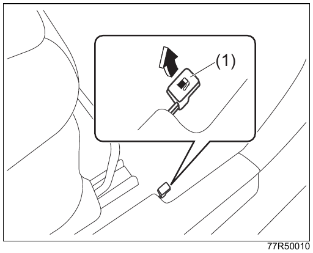{ .center-image }

| Обозначение | Описание |
| --- | --- |
| (1) | Рычаг открывания лючка топливного бака |

#### Крышка топливного бака

- Чтобы открыть крышку, медленно поверните её против часовой стрелки.
- Чтобы закрыть крышку, поворачивайте её по часовой стрелке до двух и более щелчков.

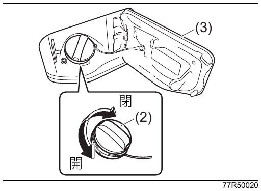{ .center-image }

| Обозначение | Описание |
| --- | --- |
| (2) | Крышка топливного бака |
| (3) | Лючок топливного бака |

!!! danger "Внимание"
    - Ослабляйте крышку топливного бака медленно. Когда звук выходящего воздуха прекратится, снимите крышку. Если открыть крышку резко, давление в топливном баке может быстро выйти и топливо может выплеснуться.
    - Не проливайте топливо. Если топливо пролилось, сразу вытрите его мягкой тканью. Иначе возможен пожар или другая неожиданная авария. Если оставить пролитое топливо на кузове, оно может вызвать пятна, изменение цвета и растрескивание лакокрасочного покрытия.
    - После заправки закройте крышку топливного бака до двух и более щелчков. Если крышка закрыта неплотно, топливо может вытечь или возникнуть пожар.
    - Используйте только указанную оригинальную крышку топливного бака Suzuki. При использовании другой крышки возможно подтекание топлива.

#### Держатель крышки

Держатель расположен на внутренней стороне лючка топливного бака (3).

- Во время заправки, чтобы снятая крышка (2) не касалась кузова, вставьте паз на конце крышки (5) в держатель крышки (4).

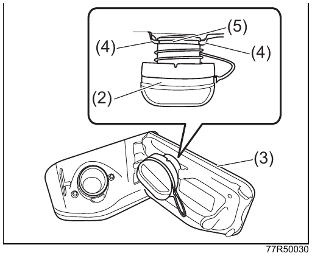{ .center-image }

| Обозначение | Описание |
| --- | --- |
| (2) | Крышка топливного бака |
| (3) | Лючок топливного бака |
| (4) | Держатель крышки |
| (5) | Паз на конце крышки |

### Капот

!!! danger "Внимание"
    - Не позволяйте детям открывать и закрывать капот. Капот тяжёлый, поэтому ребёнок может получить травму. Кроме того, в моторном отсеке высокая температура, и есть риск ожога.
    - Когда капот открыт, не подпускайте к автомобилю детей.
    - Не оставляйте в моторном отсеке инструменты, ветошь и другие предметы, использованные при проверке или очистке. Это может стать причиной неисправности, а поскольку моторный отсек сильно нагревается, также привести к возгоранию автомобиля.
    - Не приближайтесь к движущемуся приводному ремню и вентилятору охлаждения радиатора. Если в них попадут руки, волосы, одежда и т. п., можно получить травму.

#### Как открыть

1.  Потяните рычаг открывания капота (1), расположенный в ногах водителя. Передний край капота немного приподнимется.

    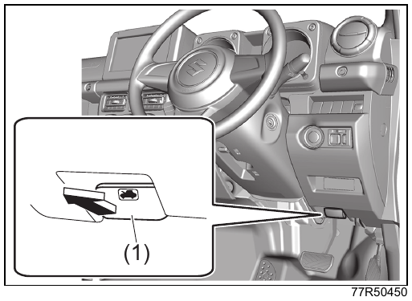{ .center-image }

    | Обозначение | Описание |
    | --- | --- |
    | (1) | Рычаг открывания капота |

2.  Через образовавшийся зазор найдите рычаг фиксатора (2). Вставьте руку в зазор, нажмите рычаг фиксатора влево и поднимите капот.

    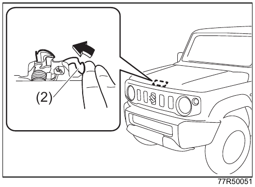{ .center-image }

    | Обозначение | Описание |
    | --- | --- |
    | (2) | Рычаг фиксатора капота |

    !!! warning "Осторожно"
        Во время работы двигателя и сразу после его остановки капот, рычаг фиксатора и детали рядом с ними могут быть горячими. Перед тем как нажимать рычаг фиксатора, убедитесь, что он не горячий.

    !!! info "Примечание"
        Не открывайте капот при поднятых рычагах стеклоочистителей. Можно повредить рычаги стеклоочистителей или капот.

3.  Зафиксируйте капот.

    - Снимите упор капота (3) с держателя на кузове и вставьте его в отверстие крепления (4) на капоте.

    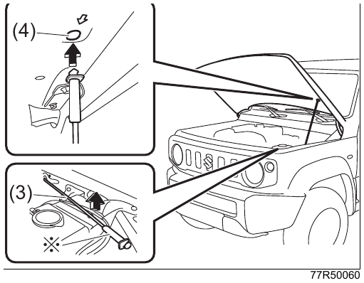{ .center-image }

    | Обозначение | Описание |
    | --- | --- |
    | (3) | Упор капота |
    | (4) | Отверстие крепления |

    !!! warning "Осторожно"
        - Во время работы двигателя и сразу после его остановки упор капота может быть горячим. Перед тем как брать упор, убедитесь, что он не горячий.
        - Надёжно вставляйте упор в отверстие крепления. Если упор выйдет из отверстия, капот может прижать часть тела.
        - Из-за порыва ветра упор может выйти из отверстия крепления. Будьте особенно осторожны в ветреную погоду.

    !!! info "Примечание"
        Когда снимаете упор с держателя, держите его за место, отмеченное на рисунке символом `※`.

#### Как закрыть

1.  Поддерживая капот одной рукой, выньте упор и закрепите его в исходном держателе.
2.  Закройте капот.

    - Медленно опустите капот примерно до высоты 20 см, затем отпустите его.

    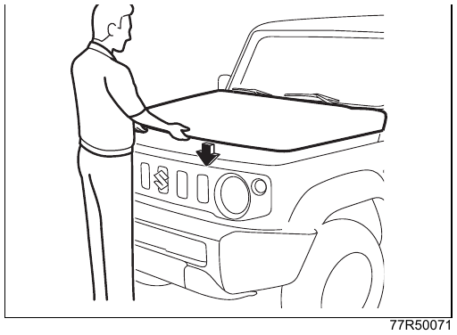{ .center-image }

!!! danger "Внимание"
    Если капот закрыт не полностью, он может открыться во время движения и привести к неожиданной аварии. Убедитесь, что капот полностью закрыт.

!!! warning "Осторожно"
    При закрывании капота следите, чтобы не защемить руки и другие части тела. Не нажимайте на капот слишком сильно: на нём могут остаться вмятины.

### Солнцезащитные козырьки

Пользуйтесь солнцезащитными козырьками, когда мешает солнечный свет. Если солнечный свет попадает сбоку, снимите козырёк с крючка и поверните его в сторону.

#### Держатель билетов

!!! tip "Оборудование по типу автомобиля"
    Держатель билетов есть не на всех автомобилях.

Держатель расположен на обратной стороне солнцезащитного козырька. В него можно вставлять, например, билет платной дороги.

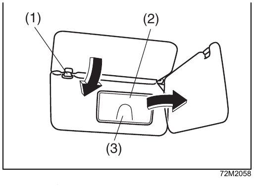{ .center-image }

| Обозначение | Описание |
| --- | --- |
| (1) | Крючок |
| (2) | Крышка зеркала |
| (3) | Держатель билетов |

!!! info "Примечание"
    Если автомобиль стоит под палящим солнцем, не оставляйте пластиковые карты в держателе билетов и похожих местах. Из-за высокой температуры в салоне карта может деформироваться или растрескаться.

    См. также: [не оставляйте в салоне зажигалки и очки](02-safety.md#не-оставляйте-в-салоне-зажигалки-и-очки).

#### Косметическое зеркало

!!! tip "Оборудование по типу автомобиля"
    Косметическое зеркало есть не на всех автомобилях.

Косметическое зеркало находится под крышкой зеркала.

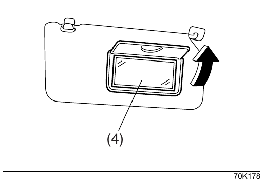{ .center-image }

| Обозначение | Описание |
| --- | --- |
| (4) | Косметическое зеркало |

!!! danger "Внимание"
    - Не пользуйтесь косметическим зеркалом во время движения. Невнимательность к дороге может привести к неожиданной аварии.
    - При использовании косметического зеркала не приближайтесь к месту установки подушки безопасности SRS и не опирайтесь на него. При срабатывании подушки безопасности SRS можно получить сильный удар.

### Освещение салона

#### Передний плафон освещения салона

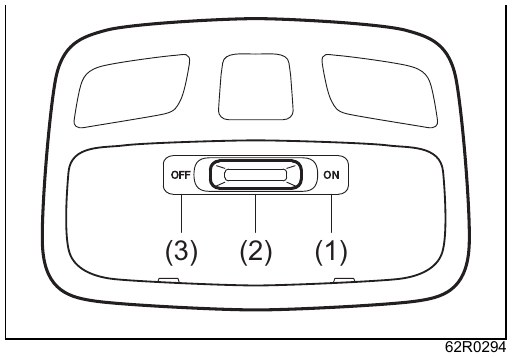{ .center-image }

#### Плафон освещения багажного отделения

!!! tip "Оборудование по типу автомобиля"
    Плафон освещения багажного отделения есть не на всех автомобилях.

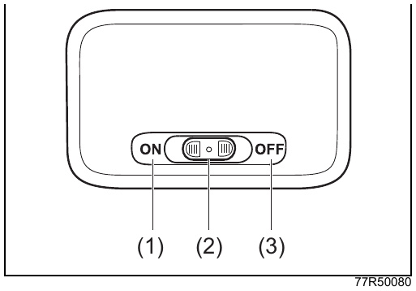{ .center-image }

| Обозначение | Положение |
| --- | --- |
| (1) | `ON` |
| (2) | `DOOR` |
| (3) | `OFF` |

!!! info "Примечание"
    Не оставляйте освещение салона включённым надолго при остановленном двигателе. Это может привести к разряду свинцово-кислотного аккумулятора.

!!! tip "Подсказка"
    Для защиты свинцово-кислотного аккумулятора освещение салона автоматически выключается, если одновременно выполняются следующие условия:

    - выключатель двигателя находится в положении `LOCK` (`OFF`);
    - выключатель освещения салона находится в положении `DOOR`;
    - освещение оставалось включённым 15 минут.

    Если выключатель освещения салона находится в положении `DOOR`, освещение салона загорается или мигает при следующих операциях:

    - запирание и отпирание дверей системой дистанционного управления;
    - запирание и отпирание дверей кнопкой запроса на автомобилях с системой запуска двигателя без ключа.

    См. также: [функция обратной связи](03-before-driving.md#подтверждение-запирания-и-отпирания).

    Если выключатель освещения салона находится в положении `ON`, освещение продолжает гореть и в течение 15 минут не выполняется никаких действий с автомобилем, освещение выключается автоматически.

#### Положения выключателя

| Положение выключателя | Автомобиль без системы запуска двигателя без ключа | Автомобиль с системой запуска двигателя без ключа |
| --- | --- | --- |
| `ON` | Горит независимо от открывания и закрывания дверей. | Горит независимо от открывания и закрывания дверей. |
| `DOOR` | Загорается при открывании любой двери.  После закрывания всех дверей горит примерно 15 секунд, затем плавно гаснет.  Если все двери закрыты, при вынимании ключа из выключателя двигателя загорается примерно на 15 секунд, затем плавно гаснет.  Даже во время горения освещение плавно гаснет, если вставить ключ в выключатель двигателя, запереть двери ключом или рычажком блокировки двери водителя либо запереть двери системой дистанционного управления. | Загорается при открывании любой двери.  После закрывания всех дверей горит примерно 15 секунд, затем плавно гаснет.  Если все двери закрыты, при переводе выключателя двигателя из положения `ON` в положение `LOCK` (`OFF`) загорается примерно на 15 секунд, затем плавно гаснет.  Даже во время горения освещение плавно гаснет, если перевести выключатель двигателя в положение `ACC` или `ON`, запереть двери ключом или рычажком блокировки двери водителя либо запереть двери системой дистанционного управления или кнопкой запроса. |
| `OFF` | Не горит независимо от открывания и закрывания дверей. | Не горит независимо от открывания и закрывания дверей. |

### Места для хранения в панели приборов

Используйте эти места для хранения личных вещей и мелких предметов.

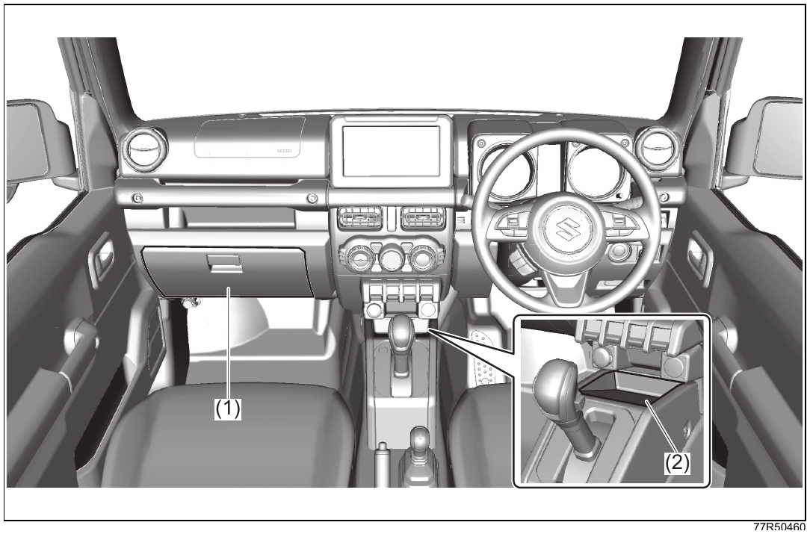{ .center-image }

| Обозначение | Описание |
| --- | --- |
| (1) | Перчаточный ящик |
| (2) | Лоток центральной консоли |

!!! info "Примечание"
    На рисунке показан типовой пример. Фактическое исполнение зависит от типа автомобиля.

!!! danger "Внимание"
    Если у места для хранения нет крышки, не кладите туда предметы, которые могут выкатиться во время движения. Если предмет попадёт под педаль тормоза или акселератора, педалью нельзя будет управлять надёжно, что может привести к аварии.

!!! warning "Осторожно"
    Если у места для хранения есть крышка, не двигайтесь с открытой крышкой и не открывайте её во время движения. При торможении, ускорении или столкновении тело может удариться о крышку, а предметы внутри могут вылететь наружу.

!!! tip "Подсказка"
    Если положить пульт дистанционного управления в одно из мест для хранения в панели приборов, он может не распознаваться. Это относится к автомобилям с системой запуска двигателя без ключа.

#### Обращение с местами для хранения с крышкой

##### Перчаточный ящик

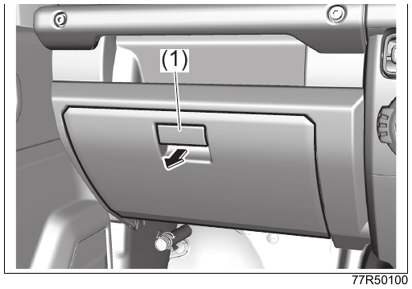{ .center-image }

- Чтобы открыть крышку, потяните рычаг (1) на себя.
- Чтобы закрыть крышку, закройте её надёжно до щелчка.

| Обозначение | Описание |
| --- | --- |
| (1) | Рычаг перчаточного ящика |

### Подстаканники центральной консоли

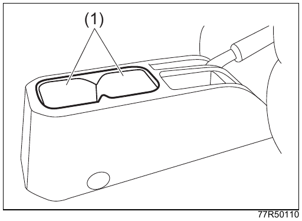{ .center-image }

| Обозначение | Описание |
| --- | --- |
| (1) | Подстаканники центральной консоли |

!!! danger "Внимание"
    - Следите, чтобы напитки не проливались, например закрывайте их крышкой. Если пролить горячий напиток, можно получить ожог. Если напиток попадёт на перечисленные ниже детали, это может стать причиной пожара или неисправности, а также нарушить нормальную работу системы подушек безопасности SRS:
        - проводка и электрические компоненты под полом;
        - подвижные элементы, например рычаг переключения передач, селектор или замок ремня безопасности.
    - Не кладите в подстаканники центральной консоли ничего, кроме банок, стаканов или картонных упаковок с напитками. Во время движения предмет может упасть, причинить травму или помешать управлению автомобилем.

!!! tip "Подсказка"
    Если положить пульт дистанционного управления в подстаканник центральной консоли, он может не распознаваться. Это относится к автомобилям с системой запуска двигателя без ключа.

### Другое оборудование

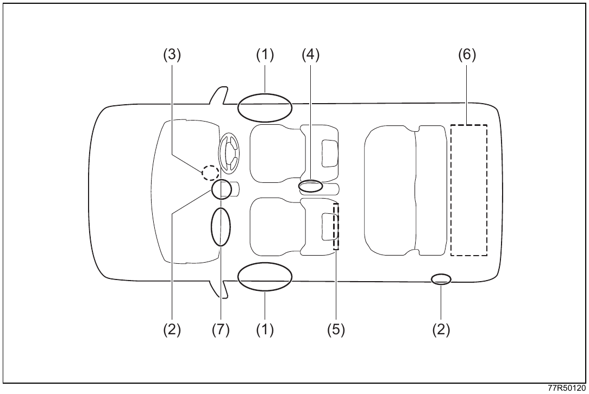{ .center-image }

| Обозначение | Описание |
| --- | --- |
| (1) | [Дверные карманы](#дверные-карманы) |
| (2) | [Розетки питания 12 В](#розетки-питания-12-в) / [USB-разъём](#usb-разъём) |
| (3) | [Площадка для левой ноги](#площадка-для-левой-ноги) |
| (4) | [Кармашек центральной консоли](#кармашек-центральной-консоли) |
| (5) | [Кармашек на спинке сиденья переднего пассажира](#кармашек-на-спинке-сиденья-переднего-пассажира) |
| (6) | [Багажный ящик](#багажный-ящик) |
| (7) | [Поручень для посадки и высадки переднего пассажира](#поручень-для-посадки-и-высадки-переднего-пассажира) |

!!! info "Примечание"
    Если положить пульт дистанционного управления в дверной карман или багажный ящик, он может не распознаваться. Это относится к автомобилям с системой запуска двигателя без ключа.

    На рисунке показан типовой пример. Фактическое исполнение зависит от типа автомобиля.

#### Дверные карманы

Используйте дверные карманы для хранения личных вещей и мелких предметов.

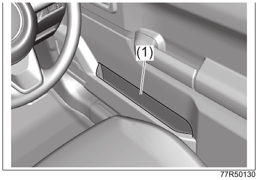{ .center-image }

| Обозначение | Описание |
| --- | --- |
| (1) | Дверной карман |

#### Розетки питания 12 В

Когда выключатель двигателя находится в положении `ACC` или `ON`, розетки можно использовать как источник питания для электрических устройств. Подключаемые устройства должны быть рассчитаны на питание 12 В, ток до 10 А и мощность до 120 Вт.

- Чтобы воспользоваться розеткой, откройте крышку (1).

##### Панель приборов

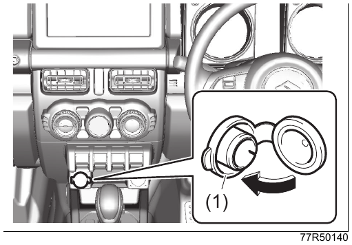{ .center-image }

##### Багажное отделение

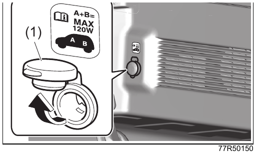{ .center-image }

| Обозначение | Описание |
| --- | --- |
| (1) | Крышка розетки |

!!! info "Примечание"
    На рисунках показаны типовые примеры. Фактическое исполнение зависит от типа автомобиля.

!!! danger "Внимание"
    Когда розетка не используется, закрывайте крышку. Если внутрь розетки попадёт посторонний предмет, это может привести к неисправности или короткому замыканию.

!!! info "Примечание"
    - Общая номинальная мощность розеток на панели приборов и в багажном отделении - до 120 Вт. Если использовать электрические устройства с мощностью выше номинальной, может перегореть предохранитель.
    - Длительное использование розетки при остановленном двигателе может привести к разряду свинцово-кислотного аккумулятора. Даже при работающем двигателе длительное использование розетки на холостом ходу может привести к разряду аккумулятора.
    - Если при выключателе двигателя в положении `LOCK` (`OFF`) питание аудиоустройства не отключается или система дистанционного управления не работает, причиной может быть устройство, подключённое к розетке питания 12 В. Отсоедините устройство от розетки и проверьте, изменилась ли ситуация. Если ситуация не изменилась, обратитесь к дилеру Suzuki или представителю Suzuki.

#### USB-разъём

!!! tip "Оборудование по типу автомобиля"
    USB-разъём есть не на всех автомобилях.

Открыв крышку (1), можно с помощью соединительного кабеля (приобретается отдельно) подключить USB-устройство, смартфон и т. п. к мультимедийной системе с дисплеем.

- Описание функций смотрите в руководстве, прилагаемом к установленной мультимедийной системе с дисплеем.

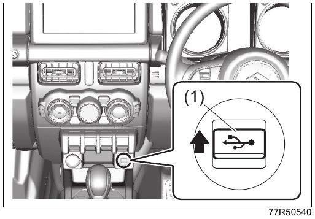{ .center-image }

| Обозначение | Описание |
| --- | --- |
| (1) | Крышка USB-разъёма |

!!! warning "Осторожно"
    Если внутрь разъёма попадёт посторонний предмет, это может привести к неисправности или короткому замыканию. Когда USB-разъём не используется, закрывайте крышку.

#### Площадка для левой ноги

!!! tip "Оборудование по типу автомобиля"
    Площадка для левой ноги есть не на всех автомобилях.

Используйте её как опору для левой ноги.

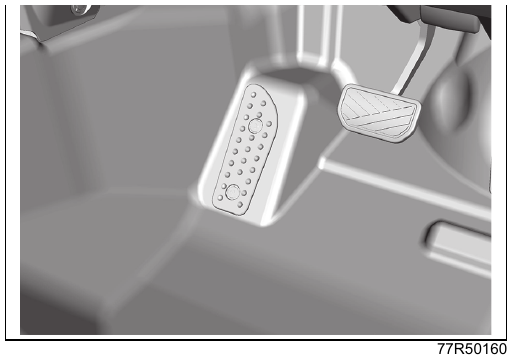{ .center-image }

#### Кармашек центральной консоли

Используйте кармашек центральной консоли для хранения мелких предметов.

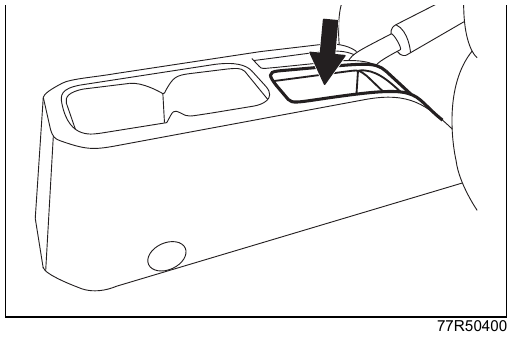{ .center-image }

#### Кармашек на спинке сиденья переднего пассажира

Используйте его для хранения журналов, ручной клади и т. п.

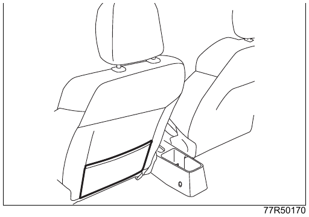{ .center-image }

#### Багажный ящик

!!! tip "Оборудование по типу автомобиля"
    Багажный ящик есть не на всех автомобилях.

Багажный ящик находится в багажном отделении.

- Используйте его для хранения личных вещей и мелких предметов.

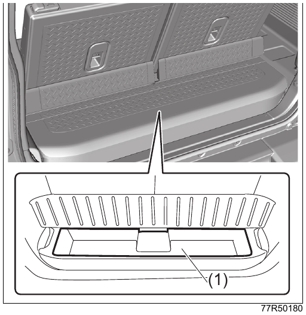{ .center-image }

| Обозначение | Описание |
| --- | --- |
| (1) | Багажный ящик |

!!! warning "Осторожно"
    - Не складывайте багаж на багажный ящик выше спинки заднего сиденья. Это не только ухудшает обзор назад: при резком торможении и в похожих ситуациях багаж может вылететь вперёд и ударить пассажиров.

      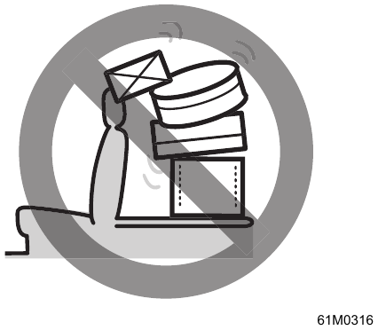{ .center-image }

    - При закрывании двери багажного отделения укладывайте багаж так, чтобы он не касался двери. Иначе дверь или багаж могут быть повреждены.

!!! info "Примечание"
    Если поднять спинку сиденья, когда на створке багажного ящика (2) лежит багаж, багажный ящик может быть повреждён. Если на створке лежит тяжёлый багаж, уберите его перед тем, как поднимать спинку.

    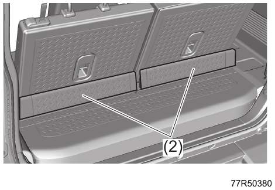{ .center-image }

    | Обозначение | Описание |
    | --- | --- |
    | (2) | Створка багажного ящика |

##### Как снять

Поднимите две ручки (3) багажного ящика.

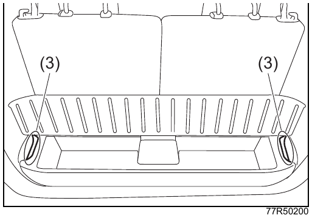{ .center-image }

| Обозначение | Описание |
| --- | --- |
| (3) | Ручки багажного ящика |

##### Как установить

Вставьте четыре фиксатора багажного ящика (4) в ответные части на кузове.

После установки слегка пошевелите багажный ящик и убедитесь, что он надёжно закреплён.

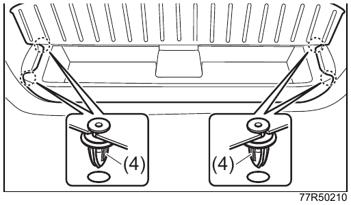{ .center-image }

| Обозначение | Описание |
| --- | --- |
| (4) | Фиксаторы багажного ящика |

#### Поручень для посадки и высадки переднего пассажира

Используйте поручень при посадке и высадке переднего пассажира.

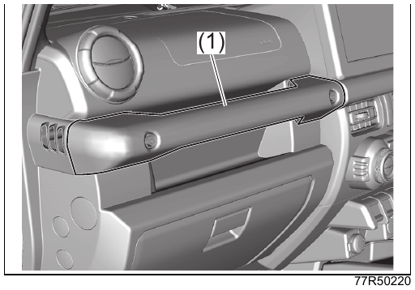{ .center-image }

| Обозначение | Описание |
| --- | --- |
| (1) | Поручень для посадки и высадки переднего пассажира |

!!! danger "Внимание"
    Не кладите предметы между панелью приборов со стороны переднего пассажира и поручнем для посадки и высадки. При срабатывании подушки безопасности SRS переднего пассажира предмет может отлететь в сторону пассажира и привести к тяжёлой травме.

## Кондиционер и отопитель

### Воздуховоды кондиционера и отопителя

!!! info "Примечание"
    На рисунке показан типовой пример. Фактическое исполнение зависит от типа автомобиля.

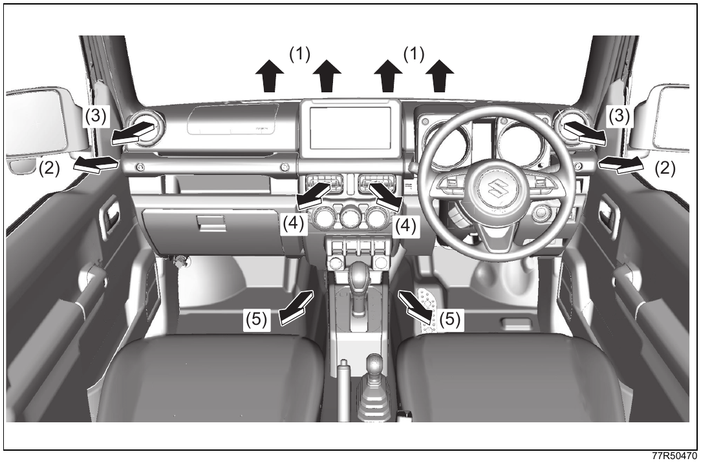{ .center-image }

| Обозначение | Описание |
| --- | --- |
| (1) | Воздуховоды обдува ветрового стекла |
| (2) | Боковые воздуховоды обдува стекол |
| (3) | Боковые воздуховоды |
| (4) | Центральные воздуховоды |
| (5) | Воздуховоды в ноги |

- У центральных воздуховодов (4) направление потока воздуха можно регулировать, перемещая ручку (6) влево-вправо или жалюзи (7) вверх-вниз.
- У боковых воздуховодов (3) направление потока воздуха можно регулировать, нажав на участок со стрелкой (8), а затем перемещая открывшиеся жалюзи (9) вверх-вниз или поворачивая их.
- Боковые воздуховоды можно открывать и закрывать.

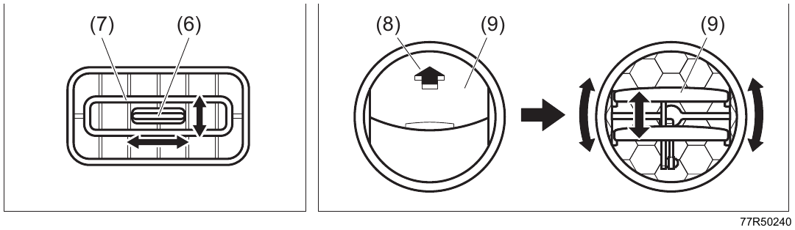{ .center-image }

| Обозначение | Описание |
| --- | --- |
| (6) | Ручка центрального воздуховода |
| (7) | Жалюзи центрального воздуховода |
| (8) | Участок для открывания бокового воздуховода |
| (9) | Жалюзи бокового воздуховода |

!!! warning "Осторожно"
    Длительное воздействие тёплого воздуха из кондиционера или отопителя может привести к низкотемпературному ожогу. Особенно следите, чтобы тёплый воздух из воздуховодов в ноги долго не попадал на детей, пожилых людей, людей с чувствительной кожей, а также на спящих пассажиров.

!!! tip "Подсказка"
    Если запотело стекло двери водителя или переднего пассажира, направьте боковой воздуховод так, чтобы воздух попадал прямо на стекло. Так запотевание исчезнет быстрее.

### Кондиционер с ручным управлением

!!! tip "Оборудование по типу автомобиля"
    Кондиционер с ручным управлением есть не на всех автомобилях.

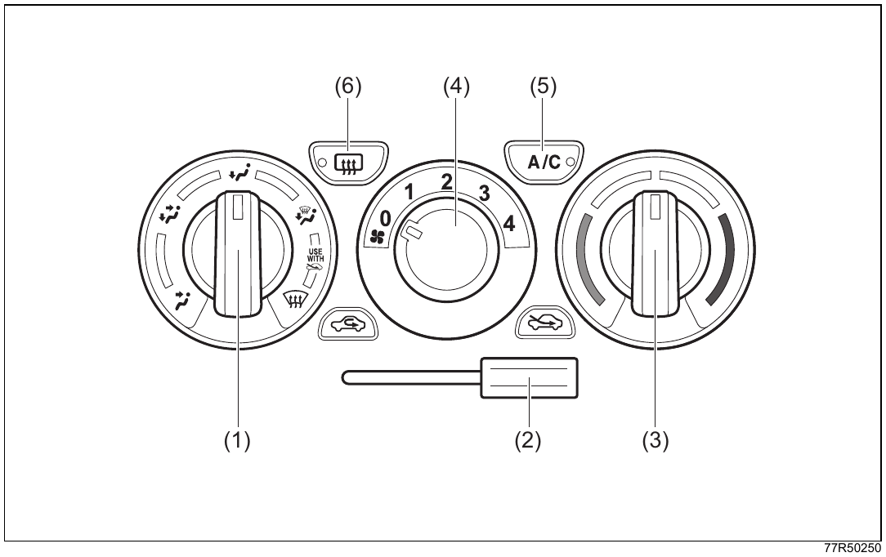{ .center-image }

| Обозначение | Название | Назначение |
| --- | --- | --- |
| (1) | Регулятор выбора воздуховодов | Используется для переключения воздуховодов. |
| (2) | Рычаг переключения рециркуляции и подачи наружного воздуха | Используется для переключения между рециркуляцией воздуха в салоне и подачей наружного воздуха. |
| (3) | Регулятор температуры | Используется для регулировки температуры. |
| (4) | Регулятор вентилятора | Используется для регулировки скорости потока воздуха. |
| (5) | Выключатель кондиционера | Используется для включения и выключения кондиционера: охлаждения и осушения воздуха. |
| (6) | Выключатель обогрева заднего стекла | Используется для удаления запотевания со стекла двери багажного отделения. |

!!! info "Примечание"
    О выключателе обогрева заднего стекла (6) см. раздел [выключатель обогрева заднего стекла](#выключатель-обогрева-заднего-стекла).

#### Как пользоваться регуляторами, выключателями и рычагом

##### Регулятор выбора воздуховодов

Поворачивайте регулятор выбора воздуховодов влево или вправо в зависимости от нужного режима.

| Назначение | Положение регулятора | Направление потока воздуха |
| --- | --- | --- |
| Направить воздух на верхнюю часть тела |  | 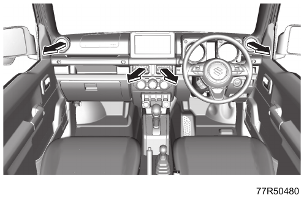 |
| Направить воздух на верхнюю часть тела и в ноги |  | 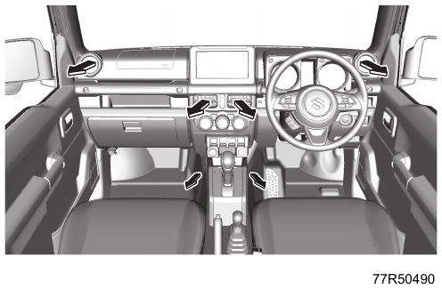 |
| Направить воздух в ноги |  | 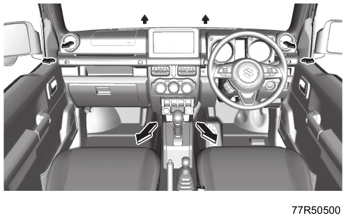 |
| Направить воздух в ноги и убрать запотевание со стекол | 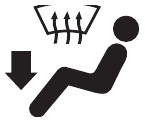 | 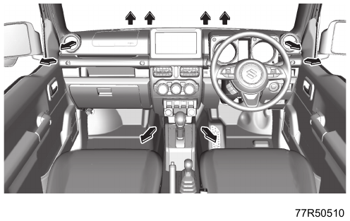 |
| Убрать запотевание со стекол |  | 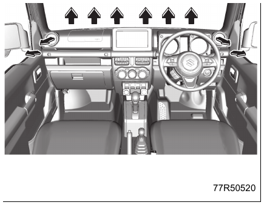 |

!!! tip "Подсказка"
    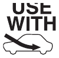{ .center-image }

    Эта маркировка подсказывает, как эффективнее убрать запотевание со стекол. Установите регулятор выбора воздуховодов в положение обдува ног и стекол или в положение обдува стекол, а рычаг переключения рециркуляции и подачи наружного воздуха переведите в положение подачи наружного воздуха.

    Если запотело стекло двери водителя или переднего пассажира, направьте боковой воздуховод так, чтобы воздух попадал прямо на стекло. Так запотевание исчезнет быстрее.

##### Рычаг переключения рециркуляции и подачи наружного воздуха

Если перевести рычаг влево, включается рециркуляция воздуха в салоне. Если перевести рычаг вправо, включается подача наружного воздуха.

| Положение | Состояние |
| --- | --- |
|  Подача наружного воздуха | В салон поступает наружный воздух.  Обычно используйте это положение. |
|  Рециркуляция воздуха в салоне | Воздух циркулирует внутри салона.  Используйте это положение, когда наружный воздух загрязнён, например в тоннеле или пробке, а также когда нужно быстрее охладить или прогреть салон. |

!!! tip "Подсказка"
    - При длительной рециркуляции стекла легче запотевают.
    - Чтобы в системе кондиционера меньше накапливались и появлялись неприятные запахи, при длительной стоянке рекомендуется оставлять режим подачи наружного воздуха.

##### Регулятор температуры

Если поворачивать регулятор температуры по часовой стрелке, температура повышается. Если поворачивать его против часовой стрелки, температура понижается.

##### Обогрев ног с прохладным воздухом к верхней части тела

Если регулятор выбора воздуховодов установлен в положение подачи воздуха к верхней части тела и в ноги, а регулятор температуры находится в среднем положении, включается режим обогрева ног с прохладным воздухом к верхней части тела.

- В ноги подаётся тёплый воздух, а к верхней части тела подаётся воздух сравнительно низкой температуры.
- Если включить кондиционер, разница температур станет больше и режим будет эффективнее.

##### Регулятор вентилятора

Поворачивайте регулятор вентилятора, чтобы изменить скорость потока воздуха.

| Положение регулятора | `0` | `1 2 3 4` |
| --- | --- | --- |
| Поток воздуха | Остановлен | От слабого до сильного |

!!! info "Примечание"
    Во время длительной остановки или в пробке уменьшайте скорость вентилятора, чтобы защитить свинцово-кислотную аккумуляторную батарею.

##### Выключатель кондиционера

Запустите двигатель, поверните регулятор вентилятора из положения остановки по часовой стрелке и нажмите выключатель кондиционера. Из воздуховодов начнёт выходить осушенный воздух, а индикатор в выключателе загорится.

Чтобы выключить кондиционер, нажмите выключатель ещё раз.

##### Отопление с осушением воздуха

Если во время отопления включить кондиционер, из воздуховодов будет выходить осушенный тёплый воздух. Это делает отопление более комфортным.

!!! tip "Подсказка"
    - Для защиты системы кондиционер выключается, когда температура воздуха, проходящего через испаритель, опускается примерно до 0 °C. Поэтому при подаче наружного воздуха и наружной температуре около 0 °C кондиционер может не включаться.
    - При включённом кондиционере из воздуховодов на короткое время может выходить белый туман. Это происходит из-за резкого охлаждения влажного воздуха и не является неисправностью.

##### Во время автоматической остановки двигателя

Во время автоматической остановки двигателя кондиционер переключается в режим вентиляции.

!!! tip "Подсказка"
    - Сразу после начала движения или в пробке холодный воздух может не успеть накопиться в достаточном количестве. Эффективность работы также зависит от наружной температуры и настроек кондиционера.
    - Если из-за автоматической остановки двигателя охлаждение или отопление стало недостаточным, нажмите [выключатель `OFF` системы автоматической остановки двигателя](04-driving.md#выключатель-off-системы-автоматической-остановки-двигателя) и выключите систему автоматической остановки двигателя. Двигатель автоматически запустится, и эффективность охлаждения или отопления восстановится.
    - Если во время автоматической остановки двигателя запотело ветровое стекло или стекло двери водителя либо переднего пассажира, нажмите [выключатель `OFF` системы автоматической остановки двигателя](04-driving.md#выключатель-off-системы-автоматической-остановки-двигателя), чтобы выключить систему автоматической остановки двигателя, и установите регулятор выбора воздуховодов в положение обдува стекол.

### Автоматическая климатическая система

!!! tip "Оборудование по типу автомобиля"
    Автоматическая климатическая система есть не на всех автомобилях.

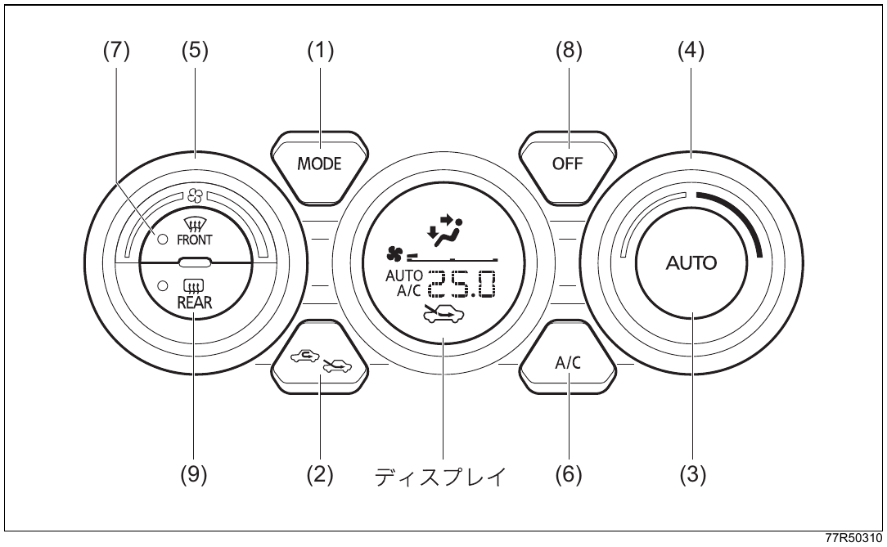{ .center-image }

| Обозначение | Название | Назначение |
| --- | --- | --- |
| (1) | Переключатель режима воздуховодов | Используется для переключения воздуховодов. |
| (2) | Переключатель рециркуляции и подачи наружного воздуха | Используется для переключения между рециркуляцией воздуха в салоне и подачей наружного воздуха. |
| (3) | Кнопка автоматического режима | Включает автоматическое управление скоростью вентилятора, воздуховодами, рециркуляцией и подачей наружного воздуха. |
| (4) | Регулятор температуры | Регулирует температуру. Поворотный регулятор. |
| (5) | Регулятор вентилятора | Регулирует скорость потока воздуха. Поворотный регулятор. |
| (6) | Выключатель кондиционера | Используется для включения и выключения охлаждения и осушения воздуха. |
| (7) | Выключатель обдува ветрового стекла | Используется для удаления запотевания со стекол. |
| (8) | Выключатель `OFF` | Используется для остановки вентилятора и кондиционера. |
| (9) | Выключатель обогрева заднего стекла | Используется для удаления запотевания со стекла двери багажного отделения. На автомобилях с обогревом наружных зеркал заднего вида при включении обогрева заднего стекла одновременно включается обогрев зеркал. |

!!! info "Примечание"
    О выключателе обогрева заднего стекла (9) см. раздел [выключатель обогрева заднего стекла](#выключатель-обогрева-заднего-стекла).

#### Как пользоваться автоматической климатической системой

##### Обычное использование в автоматическом режиме

Нажмите кнопку автоматического режима (3), затем поверните регулятор температуры (4) влево или вправо и задайте нужную температуру. После этого функции климатической системы будут управляться автоматически.

Положение обдува ветрового стекла автоматически не включается. См. также: [кнопка автоматического режима](#кнопка-автоматического-режима).

1. Запустите двигатель и нажмите кнопку автоматического режима (3). На дисплее появится примерная индикация, показанная ниже.

    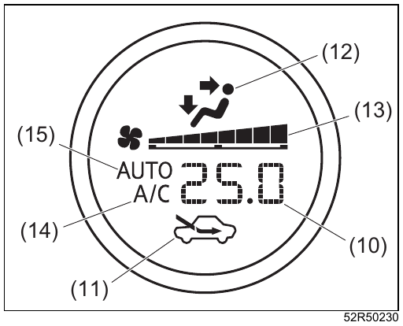{ .center-image }

    | Обозначение | Описание |
    | --- | --- |
    | (10) | Заданная температура |
    | (11) | Индикация рециркуляции и подачи наружного воздуха |
    | (12) | Воздуховоды |
    | (13) | Скорость вентилятора |
    | (14) | Индикация кондиционера |
    | (15) | Индикация автоматического режима |

    Если запотело ветровое стекло или стекло двери водителя либо переднего пассажира, нажмите выключатель обдува ветрового стекла (7) либо переключатель режима воздуховодов (1) и выберите положение обдува ног и стекол.

    См. также: [переключатель режима воздуховодов](#переключатель-режима-воздуховодов), [выключатель обдува ветрового стекла](#выключатель-обдува-ветрового-стекла).

2. Поверните регулятор температуры (4) влево или вправо и задайте нужную температуру. Доступные значения: `LO`, от 18 °C до 32 °C и `HI`; шаг установки составляет 0,5 °C.

    !!! tip "Подсказка"
        Устанавливайте температуру, ориентируясь на 25 °C. В зависимости от наружной температуры фактическая температура в салоне может не достичь заданного значения.

3. Нажмите выключатель кондиционера (6), чтобы включить или выключить охлаждение и осушение воздуха.

    !!! tip "Подсказка"
        Когда охлаждение и осушение воздуха не нужны, выключайте кондиционер. Это снижает нагрузку на двигатель и помогает уменьшить расход топлива.

4. Чтобы остановить работу климатической системы, нажмите выключатель `OFF` (8).

!!! tip "Подсказка"
    - После остановки двигателя заданная температура сохраняется в памяти.
    - Если во время автоматического режима повернуть регулятор вентилятора (5) или нажать переключатель режима воздуховодов (1), выбранная функция получит приоритет, а индикация автоматического режима погаснет. Остальные функции продолжат управляться автоматически.
    - Если во время автоматического режима нажать выключатель обдува ветрового стекла (7), индикация автоматического режима погаснет, скорость вентилятора увеличится, включится подача наружного воздуха и начнёт работать кондиционер. При низкой наружной температуре кондиционер может не включиться.
    - Если наружная температура низкая и двигатель холодный либо наружная температура высокая, некоторое время поток воздуха может быть небольшим, чтобы в салон не подавался слишком холодный или слишком горячий воздух.
    - Если при выключателе двигателя в положении `ON` индикация автоматического режима мигает, возможна неисправность системы. Обратитесь для проверки к дилеру Suzuki или представителю Suzuki.

##### Использование в ручном режиме

Управляйте переключателями и регуляторами в соответствии с нужными условиями.

- Даже во время автоматического режима выбранная вручную функция получает приоритет, а остальные функции продолжают управляться автоматически.
- Чтобы вернуть все функции в автоматический режим, нажмите кнопку автоматического режима (3).
- Чтобы остановить работу климатической системы, нажмите выключатель `OFF` (8).

##### Во время автоматической остановки двигателя

- Во время автоматической остановки двигателя климатическая система переключается в режим вентиляции.
- Изменив настройки, можно поменять работу кондиционера во время автоматической остановки двигателя. См. также: [режим настроек](08-service-data.md#режим-настроек).

!!! tip "Подсказка"
    - Сразу после начала движения или в пробке холодный воздух может не успеть накопиться в достаточном количестве. Эффективность работы также зависит от наружной температуры и настроек кондиционера.
    - Если из-за автоматической остановки двигателя охлаждение или отопление стало недостаточным, нажмите [выключатель `OFF` системы автоматической остановки двигателя](04-driving.md#выключатель-off-системы-автоматической-остановки-двигателя) и выключите систему автоматической остановки двигателя. Двигатель автоматически запустится, и эффективность охлаждения или отопления восстановится.
    - Если во время автоматической остановки двигателя запотело ветровое стекло или стекло двери водителя либо переднего пассажира, нажмите выключатель обдува ветрового стекла (7). Двигатель автоматически запустится, и включится обдув ветрового стекла.

    См. также: [система автоматической остановки двигателя на холостом ходу](04-driving.md#система-автоматической-остановки-двигателя-на-холостом-ходу), [выключатель обдува ветрового стекла](#выключатель-обдува-ветрового-стекла).

#### Переключатель режима воздуховодов

При каждом нажатии переключателя режима воздуховодов (1) меняются воздуховоды, а вместе с ними меняется индикация на дисплее.

| Назначение | Индикация на дисплее | Воздуховоды |
| --- | --- | --- |
| Направить воздух на верхнюю часть тела |  |  |
| Направить воздух на верхнюю часть тела и в ноги | 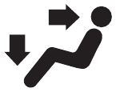 |  |
| Направить воздух в ноги |  |  |
| Направить воздух в ноги и убрать запотевание со стекол | 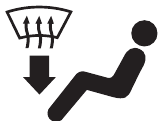 |  |

!!! tip "Подсказка"
    Если запотело стекло двери водителя или переднего пассажира, направьте боковой воздуховод так, чтобы воздух попадал прямо на стекло. Так запотевание исчезнет быстрее.

#### Переключатель рециркуляции и подачи наружного воздуха

При каждом нажатии переключателя рециркуляции и подачи наружного воздуха (2) система попеременно переключается между рециркуляцией воздуха в салоне и подачей наружного воздуха. Индикация на дисплее также меняется.

| Индикация | Состояние |
| --- | --- |
|  Подача наружного воздуха | В салон поступает наружный воздух.  Обычно используйте это положение. |
|  Рециркуляция воздуха в салоне | Воздух циркулирует внутри салона.  Используйте это положение, когда наружный воздух загрязнён, например в тоннеле или пробке, а также когда нужно быстрее охладить или прогреть салон. |

- При длительной рециркуляции стекла легче запотевают.
- Из-за разницы температур наружного и салонного воздуха система может зафиксироваться в режиме подачи наружного воздуха или рециркуляции. При необходимости нажмите переключатель и смените режим вручную.
- Чтобы в системе кондиционера меньше накапливались и появлялись неприятные запахи, при длительной стоянке рекомендуется оставлять режим подачи наружного воздуха.

#### Кнопка автоматического режима

При нажатии кнопки автоматического режима (3) на дисплее появляется индикация `AUTO`, и система автоматически управляет следующими функциями:

- скоростью вентилятора;
- переключением воздуховодов;
- рециркуляцией и подачей наружного воздуха.

##### Автоматическое управление рециркуляцией и подачей наружного воздуха

Если вручную выбрана рециркуляция, при нажатии кнопки автоматического режима рециркуляция останется включённой и не перейдёт под автоматическое управление. Чтобы вернуть переключение рециркуляции и подачи наружного воздуха в автоматический режим, выполните следующие действия.

1. Нажмите переключатель рециркуляции и подачи наружного воздуха (2) или выключатель обдува ветрового стекла (7), чтобы включить подачу наружного воздуха.
2. Нажмите кнопку автоматического режима.

##### Обогрев ног с прохладным воздухом к верхней части тела

Во время автоматического режима, когда на дисплее показан режим подачи воздуха к верхней части тела и в ноги, включается обогрев ног с прохладным воздухом к верхней части тела.

{ .center-image }

- В ноги подаётся тёплый воздух, а к верхней части тела подаётся воздух сравнительно низкой температуры.
- Если включить кондиционер, разница температур станет больше и режим будет эффективнее.

#### Регулятор температуры

Поворачивайте регулятор температуры (4) влево или вправо, чтобы изменить заданную температуру в диапазоне `LO`, от 18 °C до 32 °C и `HI`. Заданная температура отображается на дисплее.

- Чтобы повысить температуру, поверните регулятор вправо и задайте нужное значение.
- Чтобы понизить температуру, поверните регулятор влево и задайте нужное значение.
- Если при 18 °C повернуть регулятор влево, на дисплее появится `LO` и включится максимальное охлаждение. Если при 32 °C повернуть регулятор вправо, на дисплее появится `HI` и включится максимальное отопление.

!!! tip "Подсказка"
    Когда на дисплее отображается `LO` или `HI`, скорость вентилятора может резко стать максимальной или температура воздуха из воздуховодов может быстро измениться. Это не является неисправностью.

#### Регулятор вентилятора

Поворачивайте регулятор вентилятора (5), чтобы изменить скорость потока воздуха. Скорость вентилятора отображается на дисплее.

- Чтобы увеличить скорость вентилятора, поверните регулятор вправо.
- Чтобы уменьшить скорость вентилятора, поверните регулятор влево.
- Чтобы остановить вентилятор, нажмите выключатель `OFF` (8).

#### Выключатель кондиционера

Выключателем кондиционера можно пользоваться во время работы вентилятора.

- При каждом нажатии выключателя кондиционера (6) кондиционер, то есть охлаждение и осушение воздуха, попеременно включается и выключается. Индикация на дисплее также меняется.

##### Отопление с осушением воздуха

Если во время отопления включить кондиционер, из воздуховодов будет выходить осушенный тёплый воздух. Это делает отопление более комфортным.

!!! tip "Подсказка"
    - Для защиты системы кондиционер выключается, когда температура воздуха, проходящего через испаритель, опускается примерно до 0 °C. Поэтому при подаче наружного воздуха и наружной температуре около 0 °C кондиционер может не включаться.
    - При включённом кондиционере из воздуховодов на короткое время может выходить белый туман. Это происходит из-за резкого охлаждения влажного воздуха и не является неисправностью.

#### Выключатель обдува ветрового стекла

При нажатии выключателя обдува ветрового стекла (7) кондиционер включается автоматически, а поток воздуха переключается на удаление запотевания со стекол. Одновременно загорается индикатор в выключателе и меняется индикация на дисплее.

Если нажать выключатель ещё раз, система вернётся к режиму, который был включён перед нажатием выключателя обдува ветрового стекла. При автоматическом управлении состояние воздуховодов, рециркуляции и подачи наружного воздуха, а также скорость вентилятора могут измениться.

- Если была включена рециркуляция, система переключится на подачу наружного воздуха.
- Скорость вентилятора автоматически увеличится. При необходимости её можно изменить регулятором вентилятора.
- Если кондиционер не нужен, нажмите выключатель кондиционера и выключите его.

| Назначение | Индикация на дисплее | Воздуховоды |
| --- | --- | --- |
| Убрать запотевание со стекол | 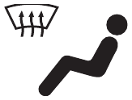 |  |

!!! tip "Подсказка"
    - При переключении на рециркуляцию запотевание уходит медленнее.
    - Если установить слишком низкую температуру, на наружной стороне стекол может появиться влага.
    - Если установить более высокую температуру, запотевание исчезнет быстрее.
    - При низкой наружной температуре кондиционер может не включаться.
    - Индикатор в выключателе горит, когда воздуховоды находятся в положении обдува ветрового стекла, даже если вентилятор или кондиционер выключены.
    - Если запотело стекло двери водителя или переднего пассажира, направьте боковой воздуховод так, чтобы воздух попадал прямо на стекло. Так запотевание исчезнет быстрее.

#### Выключатель `OFF`

При нажатии выключателя `OFF` (8) вентилятор останавливается, и кондиционер также выключается.

### Выключатель обогрева заднего стекла

Выключателем обогрева заднего стекла можно пользоваться, когда двигатель работает, а также во время автоматической остановки двигателя системой автоматической остановки двигателя на холостом ходу. Он удаляет запотевание с внутренней стороны стекла двери багажного отделения.

На автомобилях с обогревом наружных зеркал заднего вида одновременно нагреваются наружные зеркала, и с них удаляется запотевание.

См. также: [система автоматической остановки двигателя на холостом ходу](04-driving.md#система-автоматической-остановки-двигателя-на-холостом-ходу), [выключатель обогрева наружных зеркал](03-before-driving.md#выключатель-обогрева-наружных-зеркал).

#### Автомобиль с кондиционером с ручным управлением

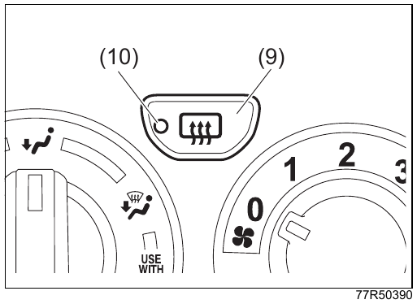{ .center-image }

#### Автомобиль с автоматической климатической системой

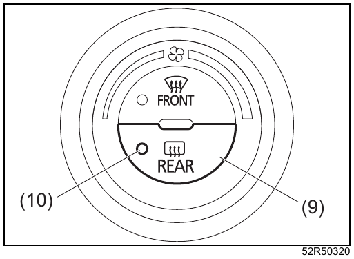{ .center-image }

| Обозначение | Описание |
| --- | --- |
| (9) | Выключатель обогрева заднего стекла |
| (10) | Индикатор в выключателе |

- При нажатии выключателя стекло двери багажного отделения нагревается, а индикатор (10) в выключателе обогрева заднего стекла (9) загорается. При повторном нажатии выключатель выключается.
- После непрерывной работы примерно в течение 15 минут выключатель автоматически выключается.
- Если во время работы перевести выключатель двигателя в положение `ACC` или `LOCK` (`OFF`), после повторного запуска двигателя выключатель автоматически не включится.

!!! info "Примечание"
    - Чтобы защитить свинцово-кислотную аккумуляторную батарею, выключайте обогрев сразу после удаления запотевания со стекла. Не используйте обогрев заднего стекла, чтобы растопить снег или высушить дождевую воду.
    - Когда протираете внутреннюю сторону стекла двери багажного отделения, используйте мягкую ткань, смоченную водой, и протирайте вдоль нитей обогрева, чтобы не повредить нагревательные нити и выводы.

!!! tip "Подсказка"
    При остановленном двигателе выключатель не включается. Исключение: автоматическая остановка двигателя системой автоматической остановки двигателя на холостом ходу.

### Как эффективно пользоваться кондиционером

#### Датчики температуры

!!! tip "Оборудование по типу автомобиля"
    Датчики температуры используются на автомобилях с автоматической климатической системой.

Автоматическая климатическая система определяет окружающие условия по датчику солнечного излучения (1), датчику температуры воздуха в салоне (2), датчику наружной температуры и другим датчикам, а затем управляет работой системы автоматически.

##### Датчик солнечного излучения

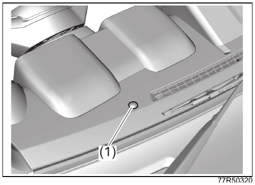{ .center-image }

##### Датчик температуры воздуха в салоне

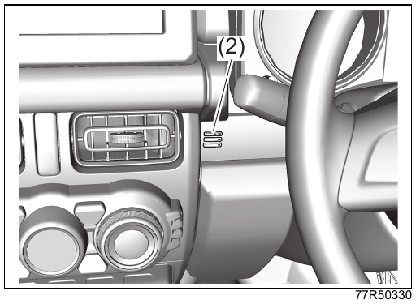{ .center-image }

| Обозначение | Описание |
| --- | --- |
| (1) | Датчик солнечного излучения |
| (2) | Датчик температуры воздуха в салоне |

!!! tip "Подсказка"
    Не кладите предметы на датчик солнечного излучения или рядом с ним и не оставляйте на нём очиститель стекол или другие чистящие средства. Не закрывайте датчик температуры воздуха в салоне наклейками и другими предметами. Чувствительность датчиков снизится, и автоматическое управление будет работать неправильно.

#### При заправке хладагента кондиционера

Для кондиционера обязательно используйте хладагент HFO-1234yf (`R-1234yf`).

- Для заправки хладагента обратитесь к дилеру Suzuki или представителю Suzuki.
- Если охлаждение стало хуже, обратитесь для проверки к дилеру Suzuki или представителю Suzuki.

#### Если кондиционер долго не используется

Примерно один раз в месяц включайте кондиционер, чтобы хладагент циркулировал по системе. В хладагенте содержится масло, необходимое для смазки деталей кондиционера. Регулярная циркуляция помогает предотвратить недостаток смазки и сохранить работоспособность системы.

#### Если автомобиль долго стоял под палящим солнцем

После длительной стоянки под палящим солнцем температура в салоне становится высокой. Откройте двери или окна, проветрите салон и включите охлаждение.

#### Очистка и замена салонного фильтра

Для комфортной работы кондиционера в системе установлен салонный фильтр. Регулярно очищайте и заменяйте его.

| Условия эксплуатации | Периодичность очистки | Периодичность замены |
| --- | --- | --- |
| Холодные регионы, районы с большим количеством пыли | Каждые 5 000 км или каждые 6 месяцев | При каждом техническом осмотре |
| Прочие регионы | Каждые 10 000 км или каждые 12 месяцев | При каждом техническом осмотре |

!!! tip "Подсказка"
    - При очистке или замене салонного фильтра можно повредить детали салона. Рекомендуется выполнять очистку или замену у дилера Suzuki или представителя Suzuki. Работа платная.
    - Новый салонный фильтр можно приобрести у дилера Suzuki или представителя Suzuki.

##### Снятие салонного фильтра

1. Откройте перчаточный ящик. Поднимите его нижний край вверх, чтобы освободить участки зацепления, показанные пунктиром, и потяните перчаточный ящик в направлении стрелки. Для установки выполните действия в обратном порядке.

    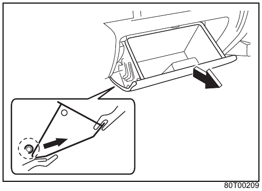{ .center-image }

2. Нажмите фиксатор (2) держателя (1) в направлении стрелки, выведите зацеп (3) из корпуса и снимите держатель (1).

    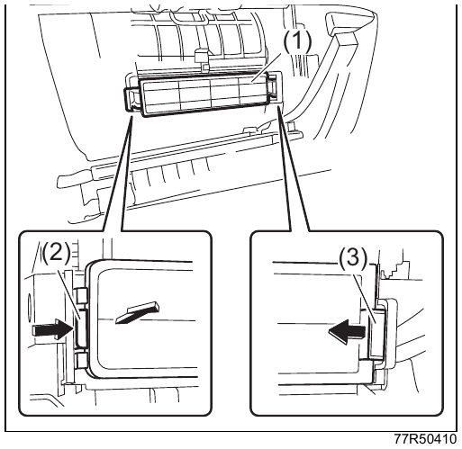{ .center-image }

    | Обозначение | Описание |
    | --- | --- |
    | (1) | Держатель |
    | (2) | Фиксатор |
    | (3) | Зацеп |

    !!! info "Примечание"
        Если приложить к держателю чрезмерное усилие, его зацеп может сломаться. Снимайте держатель осторожно, следя за зацепом.

    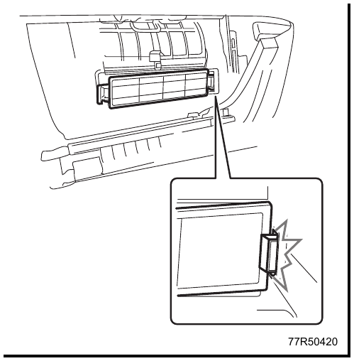{ .center-image }

3. Выньте салонный фильтр (4).

    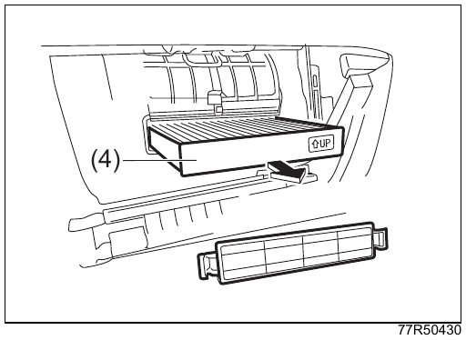{ .center-image }

    | Обозначение | Описание |
    | --- | --- |
    | (4) | Салонный фильтр |

##### Установка салонного фильтра

1. Вставьте салонный фильтр так, чтобы стрелка метки направления установки (1) была направлена вверх.
2. Зацепите правый зацеп (2) держателя за корпус и установите держатель.

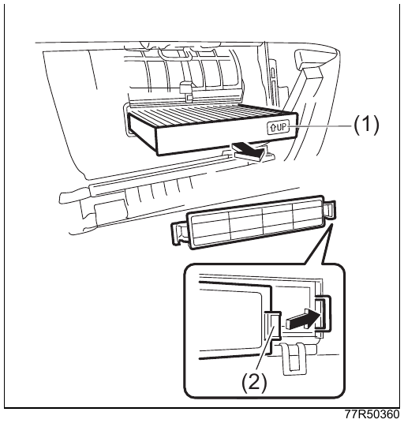{ .center-image }

| Обозначение | Описание |
| --- | --- |
| (1) | Метка направления установки |
| (2) | Правый зацеп держателя |

## Аудиосистема

### Антенна

!!! tip "Подсказка"
    Во время движения условия приёма радиосигнала постоянно меняются. В местах плотной застройки и похожих условиях устойчивый приём может быть невозможен.

#### Крышная антенна

Антенна расположена справа в задней части автомобиля.

##### Регулировка антенны

Антенну можно установить в одно из трёх положений: (1), (2) или (3).

- Регулируйте положение антенны рукой.
- При прослушивании радио зафиксируйте антенну в положении (2). Если антенна отведена в положение (1) или (3), радиоприём может быть нарушен.

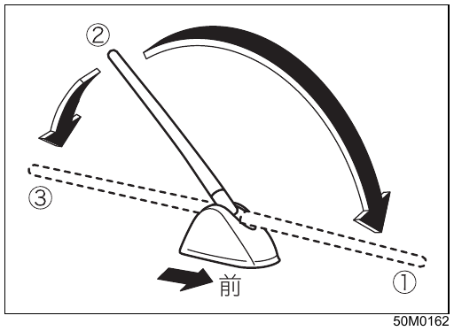{ .center-image }

| Обозначение | Описание |
| --- | --- |
| (1) | Положение антенны 1 |
| (2) | Положение антенны 2 |
| (3) | Положение антенны 3 |

!!! info "Примечание"
    Если антенна может задеть потолок гаража или другое препятствие, вручную отведите её в положение (1) или (3).

##### Снятие и установка антенны

- Чтобы снять антенну, поверните её (1) против часовой стрелки.
- Чтобы снова установить антенну, рукой вверните её в основание (2) и надёжно затяните.

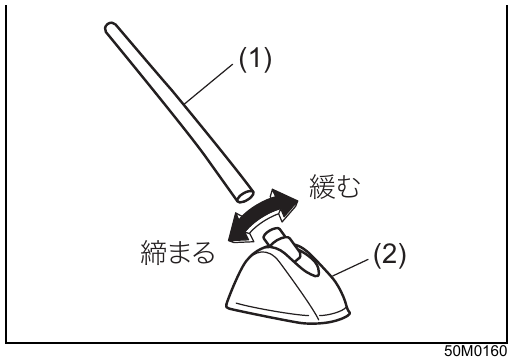{ .center-image }

| Обозначение | Описание |
| --- | --- |
| (1) | Антенна |
| (2) | Основание антенны |

!!! info "Примечание"
    Снимайте антенну в следующих случаях, иначе её можно повредить:

    - при использовании автоматической мойки;
    - при установке чехла на кузов;
    - при длительной стоянке во время снегопада.

### Функции аудиосистемы

#### Слушайте с громкостью, не мешающей безопасному вождению

- Если во время прослушивания музыки или радио пользоваться мобильным телефоном в салоне или рядом с автомобилем, из динамиков может быть слышен шум. Это не является неисправностью.
- Если на аудиосистему воздействуют посторонние радиосигналы, она может работать неправильно.
- О функциях аудиосистемы см. руководство по эксплуатации, прилагаемое к аудиосистеме.

!!! danger "Внимание"
    Не управляйте аудиосистемой во время движения. Отвлечение от управления автомобилем может привести к неожиданной аварии.

!!! info "Примечание"
    Длительное использование аудиосистемы при остановленном двигателе может привести к разряду свинцово-кислотной аккумуляторной батареи.

### Переключатели аудиосистемы на рулевом колесе

!!! tip "Оборудование по типу автомобиля"
    Переключатели аудиосистемы на рулевом колесе есть не на всех автомобилях.

Когда выключатель двигателя находится в положении `ACC` или `ON`, аудиосистемой можно управлять с рулевого колеса.

!!! tip "Подсказка"
    В зависимости от установленной аудиосистемы функции переключателей на рулевом колесе могут отличаться от описанных здесь. См. руководство по эксплуатации, прилагаемое к аудиосистеме.

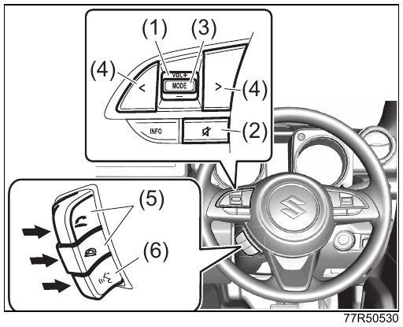{ .center-image }

| Обозначение | Описание |
| --- | --- |
| (1) | Регулятор громкости |
| (2) | Кнопка приглушения звука |
| (3) | Переключатель режима |
| (4) | Переключатель выбора радиостанции или композиции |
| (5) | Кнопка ответа и завершения вызова |
| (6) | Кнопка голосового управления |

#### Регулятор громкости (1)

Регулирует громкость.

- Чтобы увеличить громкость, переместите регулятор в сторону `+`.
- Чтобы уменьшить громкость, переместите регулятор в сторону `-`.
- Чтобы регулировать громкость непрерывно, переместите регулятор в сторону `+` или `-` и удерживайте его.

#### Кнопка приглушения звука (2)

В зависимости от используемого устройства кнопка работает следующим образом.

| Режим | Действие кнопки |
| --- | --- |
| Радио | Приглушает звук или возвращает прежнюю громкость. |
| Воспроизведение музыки | Приглушает звук музыки или возвращает прежнюю громкость. |

#### Переключатель режима (3)

При каждом нажатии переключателя режим аудиосистемы, например радио, меняется по порядку.

- В зависимости от установленной аудиосистемы, если питание устройства выключено, нажатие переключателя может включить питание.

#### Переключатель выбора радиостанции или композиции (4)

При каждом нажатии переключателя можно, в зависимости от текущего режима, выбирать радиостанцию, следующую или предыдущую композицию и другие элементы воспроизведения.

#### Кнопка ответа и завершения вызова (5)

##### Функция громкой связи

Используется с устройствами, поддерживающими громкую связь. Для использования функции требуется настройка под конкретное устройство. См. руководство по эксплуатации, прилагаемое к устройству.

#### Кнопка голосового управления (6)

##### Функция распознавания голоса

Используется с устройствами, поддерживающими распознавание голоса. Для использования функции требуется настройка под конкретное устройство. См. руководство по эксплуатации, прилагаемое к аудиосистеме.
