# 6. Уход за автомобилем

## Содержание главы

| Раздел | Страница |
| --- | --- |
| [Уход за кузовом](#уход-за-кузовом) | 6-2 |
| [Уход за салоном](#уход-за-салоном) | 6-5 |
| [Замена шин](#замена-шин) | 6-7 |
| [Замена элемента питания пульта дистанционного управления](#замена-элемента-питания-пульта-дистанционного-управления) | 6-9 |
| [Замена резинок щёток стеклоочистителей](#замена-резинок-щёток-стеклоочистителей) | 6-13 |
| [Долив жидкости стеклоомывателя](#долив-жидкости-стеклоомывателя) | 6-16 |
| [Подготовка к зимнему сезону](#подготовка-к-зимнему-сезону) | 6-17 |
| [Перед поездкой в холодную погоду](#перед-поездкой-в-холодную-погоду) | 6-18 |
| [Движение по снежной дороге](#движение-по-снежной-дороге) | 6-20 |
| [Стоянка в холодную погоду](#стоянка-в-холодную-погоду) | 6-21 |
| [Установка цепей противоскольжения](#установка-цепей-противоскольжения) | 6-23 |

## Уход и обслуживание

### Уход за кузовом

#### Чтобы лакокрасочное покрытие оставалось в хорошем состоянии

Чтобы автомобиль долго сохранял аккуратный внешний вид, регулярно ухаживайте за кузовом.

- По возможности ставьте автомобиль на хранение в хорошо проветриваемый гараж или под навес.
- В следующих случаях возможны коррозия и изменение цвета лакокрасочного покрытия. Как можно скорее вымойте автомобиль:
    - после движения по прибрежной местности или по дорогам, обработанным противогололёдными реагентами. Особенно тщательно промойте днище и ходовую часть;
    - если на кузов попали птичий помёт, останки насекомых, древесная смола, металлическая пыль, сажа, каменноугольная смола или кислотный дождь;
    - если кузов сильно загрязнён пылью или грязью.
- Наносите воск примерно раз в месяц или когда вода перестаёт хорошо скатываться с кузова. Способ нанесения указан в инструкции на упаковке воска.
- Сколы от камней и царапины могут стать причиной коррозии. Если вы обнаружили такие повреждения, как можно скорее устраните их.

!!! tip "Подсказка"
    При нанесении воска не используйте его на неокрашенных пластиковых деталях. Если воск попадёт на такие детали, они могут побелеть или покрыться пятнами.

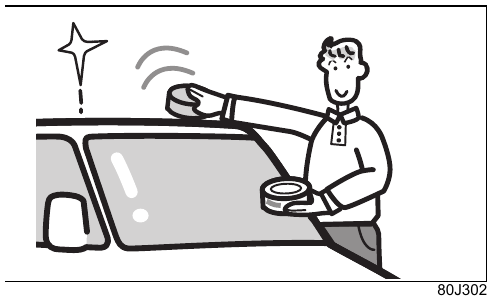{ .center-image }

!!! info "Примечание"
    Для ремонта повреждений лакокрасочного покрытия обратитесь к дилеру Suzuki или представителю Suzuki. При использовании неподходящей краски покрытие может отслоиться.

#### При мойке автомобиля

!!! warning "Осторожно"
    - При мойке днища и ходовой части соблюдайте осторожность, чтобы не получить травму.
    - После мойки эффективность тормозов может снизиться. См. [после движения по воде или мойки проверьте тормоза](02-safety.md#после-движения-по-воде-или-мойки-проверьте-тормоза).

!!! info "Примечание"
    - Не лейте воду в моторный отсек. Это может привести к затруднённому запуску двигателя или неисправности электрических компонентов.
    - Во время мойки или нанесения воска не опирайтесь на кузов и не нажимайте на него с силой. Кузов может деформироваться.

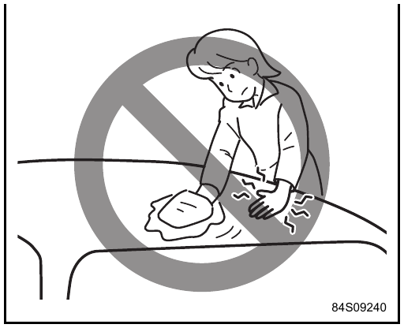{ .center-image }

#### Если моете автомобиль вручную

1. Обильно смачивая кузов водой, смойте грязь мягкой губкой, замшей или другим мягким материалом.
2. Сильно загрязнённые места вымойте нейтральным моющим средством, затем тщательно смойте средство чистой водой.
3. Хорошо вытрите воду мягкой тканью, чтобы на кузове не осталось следов капель.

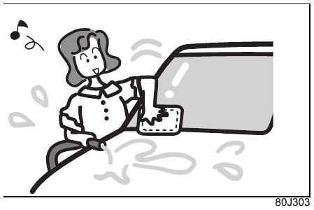{ .center-image }

#### При использовании автоматической мойки

!!! warning "Осторожно"
    Если автоматическая мойка не требует положения селектора `P` или полной остановки автомобиля, например в мойке конвейерного типа, выключите поддержку торможения на малой скорости при движении вперёд и назад переключателем `OFF` системы поддержки торможения с двумя датчиками DSBS II.

    Иначе поддержка торможения на малой скорости при движении вперёд и назад может неожиданно сработать и привести к аварии.

!!! info "Примечание"
    - Сложите дверные зеркала и снимите крышную антенну. Они могут зацепиться за элементы мойки и получить повреждения.
    - В некоторых автоматических мойках щётки могут оставить царапины, ухудшить блеск покрытия или ускорить его старение.

#### При использовании мойки высокого давления

Держите моечную насадку на достаточном расстоянии от кузова.

!!! info "Примечание"
    - Если поднести моечную насадку слишком близко к кузову или направить струю в отверстия бамперов и других деталей, кузов и детали могут деформироваться или получить повреждения.
    - Если направить струю на стёкла дверей, зоны вокруг дверей и другие открывающиеся элементы, вода может попасть в салон.

#### Уход за ветровым стеклом

Если на стекле появилась масляная плёнка и стеклоочистители оставляют непротёртые участки, удалите загрязнение очистителем стекла.

#### Уход за алюминиевыми колёсными дисками

!!! tip "Оборудование по типу автомобиля"
    Относится к автомобилям с алюминиевыми колёсными дисками.

Прочитайте раздел [если моете автомобиль вручную](#если-моете-автомобиль-вручную).

!!! info "Примечание"
    - Не используйте кислотные или щелочные моющие средства, а также очистители с нефтяными растворителями. Это может вызвать пятна, изменение цвета, растрескивание покрытия и повреждение центральных колпачков.
    - Не используйте жёсткие щётки и мыло с песком. Это может поцарапать диски.

#### Уход за камерой заднего вида

!!! tip "Оборудование по типу автомобиля"
    Относится к автомобилям с камерой заднего вида.

Промойте линзу водой и вытрите мягкой тканью. Если загрязнение сильное, используйте нейтральное моющее средство.

!!! info "Примечание"
    - Не протирайте камеру спиртом, бензином, растворителем и другими подобными средствами. Это может вызвать изменение цвета.
    - Линза камеры имеет твёрдое покрытие, чтобы уменьшить риск появления царапин, однако обращаться с ней нужно осторожно. Не используйте щётки для мойки и похожие приспособления. Иначе изображение с камеры заднего вида может стать плохо различимым.

### Уход за салоном

- Песок и пыль удаляйте пылесосом либо вытирайте мягкой тканью, хорошо отжатой после смачивания водой или тёплой водой. Если оставить песок и пыль на поверхности, они могут поцарапать отделку.
- Если на отделку попал жидкий ароматизатор, сок или другая жидкость, сразу вытрите её бумажной салфеткой или мягкой тканью. Если оставить жидкость на поверхности, возможны пятна, изменение цвета и растрескивание.

!!! danger "Внимание"
    Если вода попадёт на аудиосистему, переключатели, проводку и электрические компоненты под напольным покрытием, это может привести к пожару, неисправности или нарушению работы подушек безопасности SRS.

    При уходе за салоном не лейте воду внутрь автомобиля. Если вода попала в салон или в салоне пролили напиток, как можно скорее обратитесь к дилеру Suzuki или представителю Suzuki для проверки.

!!! info "Примечание"
    Не используйте средства по уходу, содержащие следующие компоненты. Они могут вызвать пятна, изменение цвета, деформацию или снижение прочности материалов:

    - растворители: бензин, разбавитель, средство для удаления наклеек и подобные вещества;
    - кислотные или щелочные моющие средства;
    - отбеливатели и красители.

    Также соблюдайте следующие правила:

    - не используйте средства с силиконом для очистки кондиционера, аудиосистемы, переключателей и участков вокруг них. Если силикон попадёт на эти компоненты, возможна неисправность;
    - не оставляйте на длительное время окрашенные кожаные изделия, мех, винил и подобные материалы. Это может вызвать изменение цвета или повреждение отделки.

!!! tip "Подсказка"
    Жидкий ароматизатор рекомендуется закреплять так, чтобы он не пролился. Также можно использовать твёрдый ароматизатор.

#### Уход за тканью, искусственной кожей и пластиковыми деталями

1. Слегка смочите мягкую ткань водным раствором нейтрального моющего средства и удалите загрязнение.
2. Мягкой тканью, смоченной чистой водой, удалите остатки моющего средства.
3. Вытрите остатки влаги и высушите поверхность в хорошо проветриваемом месте в тени.

#### Уход за натуральной кожей

!!! tip "Оборудование по типу автомобиля"
    Относится к автомобилям с отделкой из натуральной кожи.

1. Слегка смочите мягкую ткань раствором нейтрального моющего средства для шерсти и удалите загрязнение.

    Соотношение: нейтральное средство для шерсти и вода — `1:20`.

2. Хорошо отожмите мягкую ткань, смоченную чистой водой, и удалите остатки моющего средства.

    !!! info "Примечание"
        Остатки моющего средства могут повредить натуральную кожу.

3. Вытрите поверхность сухой мягкой тканью и высушите её в хорошо проветриваемом месте в тени.

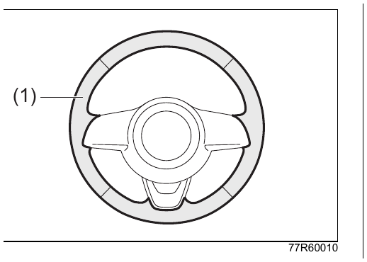{ .center-image }

| Обозначение | Описание |
| --- | --- |
| (1) | Участок из натуральной кожи |

!!! info "Примечание"
    Олеиновая кислота, содержащаяся в косметических лосьонах, кремах для рук и подобных средствах, может вызвать изменение цвета и пятна. Если крем для рук или подобное средство попало на кожаную часть рулевого колеса, сразу вытрите его бумажной салфеткой или мягкой тканью, затем выполните описанный выше уход.

!!! tip "Подсказка"
    - Чтобы внешний вид натуральной кожи сохранялся дольше, ухаживайте за ней регулярно, примерно два раза в год.
    - Если на кожу попала вода, сразу вытрите её бумажной салфеткой или мягкой тканью. Если оставить кожу влажной, она может затвердеть и сесть.
    - При стоянке под прямым солнцем используйте солнцезащитный экран или другое средство защиты. Длительное воздействие прямых солнечных лучей может вызвать выцветание и усадку кожи.
    - Натуральная кожа может иметь неодинаковую фактуру поверхности и естественные следы. Это не влияет на свойства кожи как материала.

#### Уход за внутренней стороной ветрового стекла

При очистке внутренней стороны ветрового стекла защитите линзу передней камеры от попадания пыли, очистителя стекла и других веществ. Не прикасайтесь к линзе.

#### Уход за внутренней стороной стекла задней двери

Чтобы не повредить нити обогрева и выводы, протирайте стекло мягкой тканью, смоченной водой, вдоль нитей обогрева.

### Замена шин

#### Перестановка колёс

Чтобы предотвратить неравномерный износ шин и продлить срок их службы, выполняйте перестановку колёс примерно каждые 5000 км.

Если выполняете перестановку штатным домкратом, используйте запасное колесо и меняйте колёса по одному. См. [подъём автомобиля домкратом](07-emergency.md#подъём-автомобиля-домкратом).

##### Если запасное колесо включается в перестановку

Для шин без заданного направления вращения используйте схему ниже.

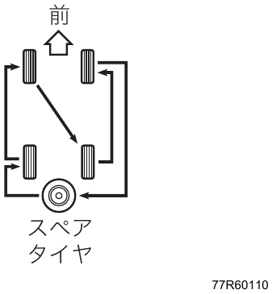{ .center-image }

Для шин с заданным направлением вращения схема зависит от того, в какую сторону должно вращаться запасное колесо.

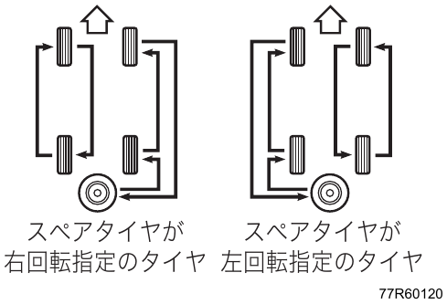{ .center-image }

!!! warning "Осторожно"
    При перестановке шин с заданным направлением вращения не меняйте направление их вращения на обратное. Это может отрицательно повлиять на движение автомобиля.

##### Если запасное колесо не включается в перестановку

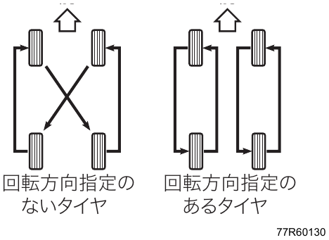{ .center-image }

!!! warning "Осторожно"
    - Если размер, марка или рисунок протектора запасного колеса отличаются от остальных четырёх колёс, не включайте запасное колесо в перестановку. В этом случае запасное колесо является временным аварийным колесом для использования при проколе. См. [при замене шин](#при-замене-шин).
    - При перестановке шин с заданным направлением вращения не меняйте направление их вращения на обратное. Это может отрицательно повлиять на движение автомобиля.

!!! tip "Подсказка"
    На боковине шины с заданным направлением вращения нанесены надпись `ROTATION` и стрелка, показывающая направление вращения.

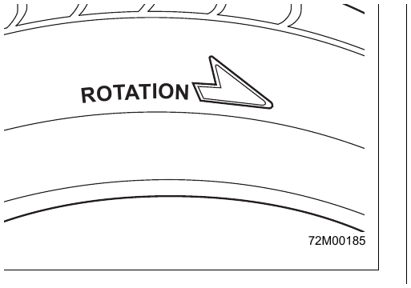{ .center-image }

На рисунке показан типовой пример шины.

#### При замене шин

- Размер и давление воздуха в шинах зависят от комплектации автомобиля. Проверяйте их по табличке давления воздуха в шинах, расположенной в проёме двери водителя.
- Если во время движения ощущается вибрация рулевого колеса или кузова, проверьте балансировку шин.
- Перед установкой проверьте износ шин. Если появился индикатор износа, то есть участок с глубиной канавки 1,6 мм, и часть канавки исчезла, замените шину новой.

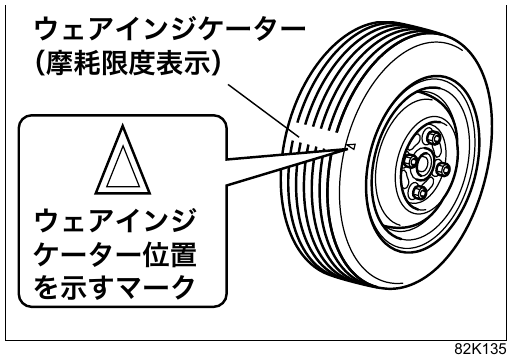{ .center-image }

!!! danger "Внимание"
    Устанавливайте на все четыре колеса шины указанного размера, одной марки и с одинаковым рисунком протектора. Не используйте шины с заметно разной степенью износа.

    Иначе может ухудшиться расход топлива и устойчивость автомобиля, а также возникнуть неожиданная авария или неисправность. Для зимних шин действует то же правило.

    Если система не сможет точно определить скорость вращения колёс, следующие функции могут работать неправильно:

    - ABS;
    - сигнализация экстренного торможения ESS;
    - ESP®;
    - часть функций Suzuki Safety Support.

    См. также: [если точная скорость вращения шин не определяется](04-driving.md#если-точная-скорость-вращения-шин-не-определяется).

### Замена элемента питания пульта дистанционного управления

!!! danger "Внимание"
    Следите, чтобы дети случайно не проглотили элемент питания или снятые детали.

!!! info "Примечание"
    Чтобы не допустить неисправности, соблюдайте следующие правила:

    - не меняйте элемент питания мокрыми руками;
    - не прикасайтесь к выводам и электронным компонентам, кроме элемента питания;
    - не изгибайте выводы;
    - не допускайте попадания масла и посторонних веществ.

    Если меняете элемент питания самостоятельно, перед работой прикоснитесь к металлической детали, чтобы снять статическое электричество с тела и одежды. Иначе статическое электричество может повредить пульт.

!!! tip "Подсказка"
    - При замене элемента питания можно повредить пульт. Рекомендуется обратиться для платной замены к дилеру Suzuki или представителю Suzuki.
    - Если меняете элемент питания самостоятельно, приобретите его у дилера Suzuki, в магазине электроники, хозяйственном магазине или другом подходящем магазине.

#### Автомобили без системы бесключевого запуска кнопкой

| Параметр | Значение |
| --- | --- |
| Используемый элемент питания | Литиевый элемент питания `CR1616` |

1. Снимите крышку ключа (1).

    Винт (2) снимайте крестовой отвёрткой подходящего размера.

    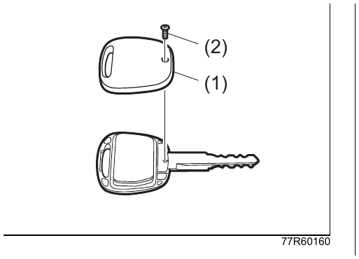{ .center-image }

    | Обозначение | Описание |
    | --- | --- |
    | (1) | Крышка ключа |
    | (2) | Винт |

    !!! info "Примечание"
        Если использовать отвёртку, не подходящую по размеру или форме винта, можно повредить головку винта.

2. Снимите внутренний блок (3) и разделите его.

    Поверните внутренний блок кнопкой (4) вниз.

    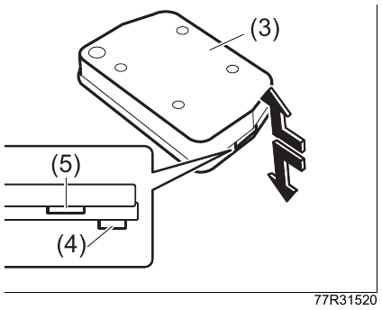{ .center-image }

    | Обозначение | Описание |
    | --- | --- |
    | (3) | Внутренний блок |
    | (4) | Кнопка |
    | (5) | Вырез |

    !!! info "Примечание"
        Работая отвёрткой, не повредите внутренний блок.

3. Замените элемент питания.

    Выньте старый элемент питания.

    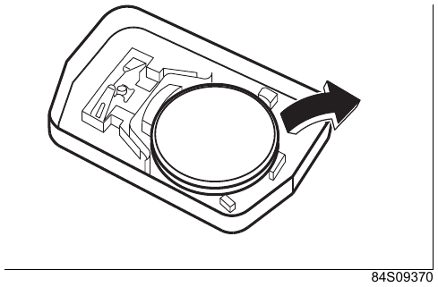{ .center-image }

    Установите новый элемент питания отрицательным полюсом вверх.

    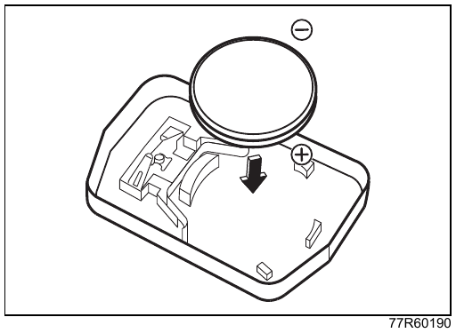{ .center-image }

4. Соберите внутренний блок.

    Плотно соедините крышку и корпус.

    Если детали внутреннего блока разъединились, соберите их, ориентируясь по рисунку ниже. При установке совместите выступ выключателя (a) с пазом корпуса (b).

    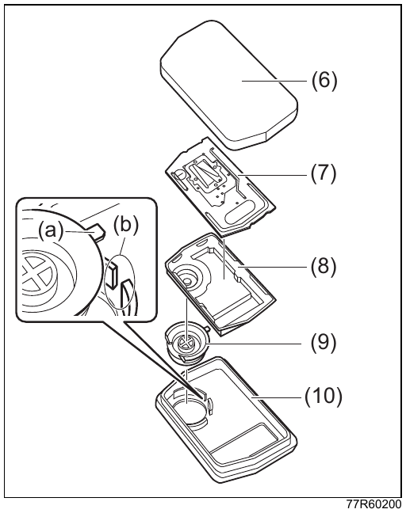{ .center-image }

    | Обозначение | Описание |
    | --- | --- |
    | (6) | Крышка |
    | (7) | Печатная плата |
    | (8) | Резиновая накладка |
    | (9) | Выключатель |
    | (10) | Корпус |

5. Установите крышку ключа.

    Сначала совместите переднюю часть крышки, как показано на рисунке.

    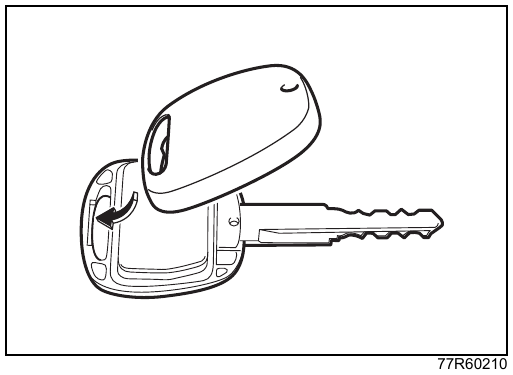{ .center-image }

    Надёжно затяните винт.

6. Убедитесь, что ключ с дистанционным управлением работает нормально.

#### Автомобили с системой бесключевого запуска кнопкой

| Параметр | Значение |
| --- | --- |
| Используемый элемент питания | Литиевый элемент питания `CR2032` |

1. Выньте механический ключ из пульта дистанционного управления.

    См. [ключи](03-before-driving.md#ключи).

2. Разделите корпус пульта дистанционного управления.

    Нажимая на паз (1) с левой стороны пульта, разделите корпус на верхнюю и нижнюю части.

    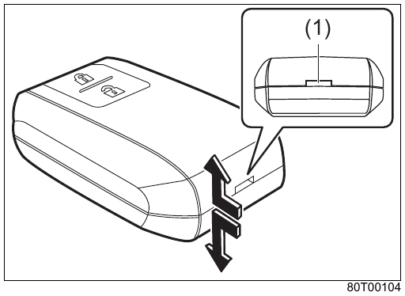{ .center-image }

    | Обозначение | Описание |
    | --- | --- |
    | (1) | Паз |

3. Замените элемент питания.

    Выньте старый элемент питания и установите новый положительным полюсом вверх.

    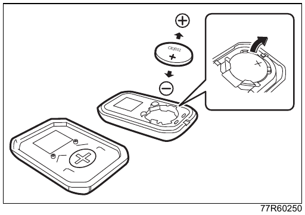{ .center-image }

4. Соберите корпус.

    Плотно соедините половины корпуса так, чтобы зазор по линии стыка был равномерным.

5. Уберите механический ключ обратно в пульт.

6. Убедитесь, что пульт дистанционного управления работает нормально.

#### Сброс предупреждения о разряде элемента питания пульта

Если до замены элемента питания на дисплее отображалось предупреждение о его разряде, после замены выполните сброс предупреждения.

Для этого дважды или более раз заприте и отоприте двери системой бесключевого доступа.

См. также:

- [система бесключевого доступа](03-before-driving.md#система-бесключевого-доступа);
- [предупреждение о разряде элемента питания пульта дистанционного управления](03-before-driving.md#список-сообщений-многофункционального-информационного-дисплея).

!!! tip "Подсказка"
    Если запасной пульт дистанционного управления исправен и его элемент питания не разряжен, предупреждение можно сбросить и с помощью запасного пульта, выполнив указанную выше операцию.

### Замена резинок щёток стеклоочистителей

!!! info "Примечание"
    - Рекомендуется использовать оригинальные резинки щёток стеклоочистителей Suzuki.
    - Если резинка повреждена, стекло может очищаться плохо или на нём могут появиться царапины. Регулярно проверяйте состояние резинок и заменяйте их при повреждении.
    - При замене не допускайте удара рычага или щётки стеклоочистителя по стеклу. Стекло может треснуть или поцарапаться.

#### Передние стеклоочистители

1. Поднимите рычаг стеклоочистителя.

    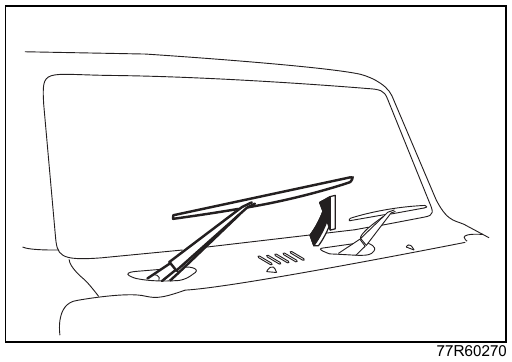{ .center-image }

2. Нажимая на фиксатор, снимите щётку с рычага стеклоочистителя.

    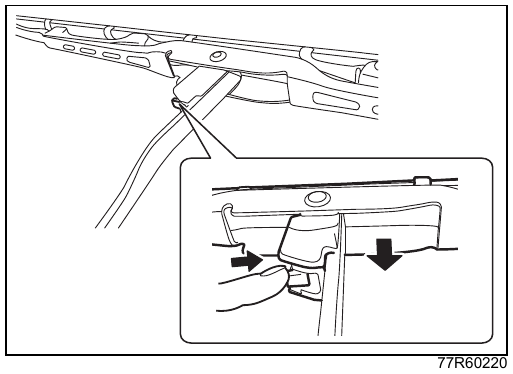{ .center-image }

3. Потяните резинку щётки, пока стопор (1) резинки не выйдет из зацепления с выступом (2), затем выньте резинку из щётки. После этого выньте из резинки держатели (3).

    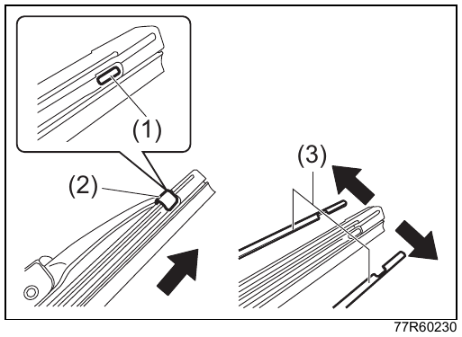{ .center-image }

    | Обозначение | Описание |
    | --- | --- |
    | (1) | Стопор |
    | (2) | Выступ |
    | (3) | Держатель |

4. Установите держатели в новую резинку щётки.

    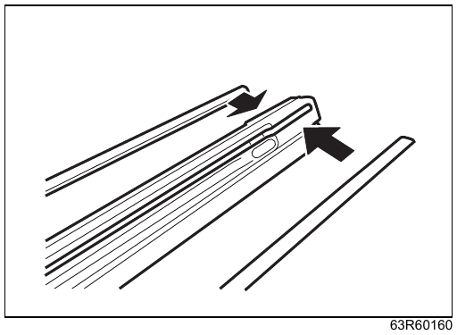{ .center-image }

    Держатели устанавливайте с изгибом в направлении, показанном на рисунке.

    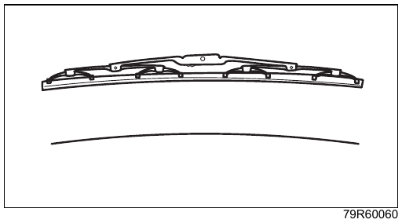{ .center-image }

5. Вставьте резинку в щётку со стороны, где нет стопора.

    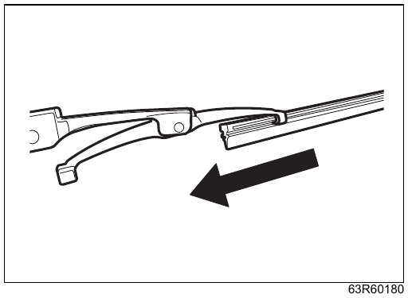{ .center-image }

    !!! info "Примечание"
        Устанавливайте резинку так, чтобы сторона со стопором (1) была со стороны водителя. Иначе во время работы стеклоочистителя резинка может сместиться.

    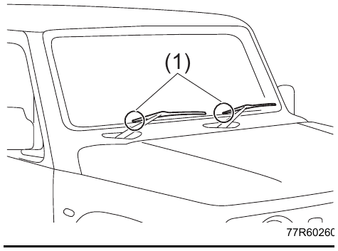{ .center-image }

6. Вдавите выступ (2) щётки в стопор (1) резинки и надёжно зафиксируйте резинку.

    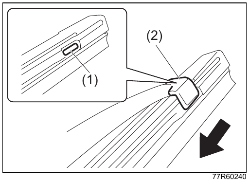{ .center-image }

    | Обозначение | Описание |
    | --- | --- |
    | (1) | Стопор |
    | (2) | Выступ |

7. Установите щётку на рычаг в порядке, обратном снятию. Убедитесь, что щётка надёжно зафиксирована на рычаге.

8. Опустите рычаг стеклоочистителя.

#### Задний стеклоочиститель

1. Немного поднимите рычаг стеклоочистителя и, нажимая на фиксатор (1) со стороны резинки щётки, снимите щётку с рычага.

    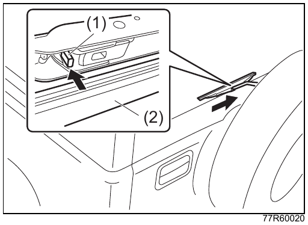{ .center-image }

    | Обозначение | Описание |
    | --- | --- |
    | (1) | Фиксатор |
    | (2) | Резинка щётки |

    !!! tip "Подсказка"
        После снятия щётки медленно опустите рычаг стеклоочистителя.

2. Потяните резинку щётки, пока стопор (3) резинки не выйдет из зацепления с выступом (4), затем выньте резинку из щётки. После этого выньте из резинки держатели (5).

    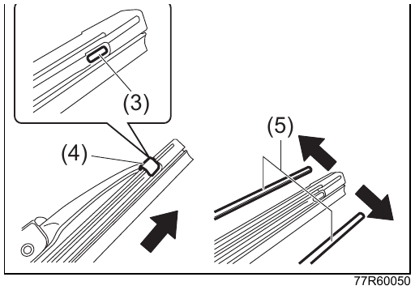{ .center-image }

    | Обозначение | Описание |
    | --- | --- |
    | (3) | Стопор |
    | (4) | Выступ |
    | (5) | Держатель |

3. Установите держатели в новую резинку щётки.

    { .center-image }

    Держатели устанавливайте с изгибом в направлении, показанном на рисунке.

    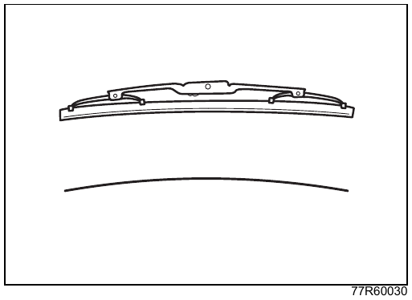{ .center-image }

4. Вставьте резинку в щётку со стороны, где нет стопора.

    { .center-image }

    Устанавливайте резинку так, чтобы сторона со стопором была обращена внутрь. Иначе во время работы стеклоочистителя резинка может сместиться.

5. Вдавите выступ (4) щётки в стопор (3) резинки и надёжно зафиксируйте резинку.

    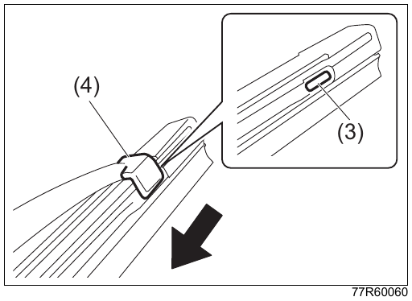{ .center-image }

    | Обозначение | Описание |
    | --- | --- |
    | (3) | Стопор |
    | (4) | Выступ |

6. Установите щётку на рычаг в порядке, обратном снятию. Убедитесь, что щётка надёжно зафиксирована на рычаге, затем опустите рычаг стеклоочистителя.

### Долив жидкости стеклоомывателя

Если жидкости стеклоомывателя недостаточно, откройте крышку бачка стеклоомывателя (1) и долейте жидкость.

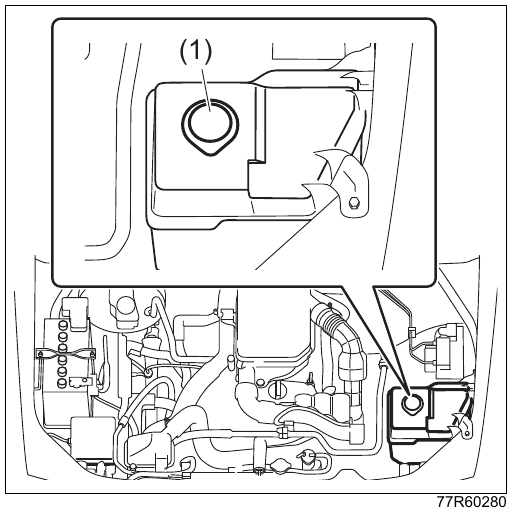{ .center-image }

| Обозначение | Описание |
| --- | --- |
| (1) | Крышка бачка стеклоомывателя |

На рисунке показан типовой пример. Расположение может отличаться в зависимости от комплектации автомобиля.

!!! danger "Внимание"
    Жидкость стеклоомывателя содержит спирт. Если она попадёт на двигатель или другие горячие детали, возможно возгорание.

    Не доливайте жидкость стеклоомывателя, когда двигатель горячий или работает.

!!! warning "Осторожно"
    Перед использованием жидкости стеклоомывателя внимательно прочитайте меры предосторожности на её упаковке.

!!! info "Примечание"
    - Если пользоваться стеклоомывателем при пустом бачке, может повредиться насос.
    - Если отверстие в крышке засорено, жидкость может подаваться плохо. Если струя жидкости стала слабой, проверьте и это отверстие.
    - Не заливайте вместо жидкости стеклоомывателя мыльный раствор и подобные жидкости. На лакокрасочном покрытии могут появиться пятна.
    - Не доливайте только воду. Зимой она может замёрзнуть, и стеклоомыватель перестанет работать.

!!! tip "Подсказка"
    Температура замерзания оригинальной жидкости стеклоомывателя Suzuki Ecstar зависит от степени разбавления. Подбирайте пропорцию по минимальной температуре в регионе эксплуатации автомобиля.

    См. [жидкость стеклоомывателя](#жидкость-стеклоомывателя).

## Эксплуатация в холодную погоду

### Подготовка к зимнему сезону

#### Жидкость стеклоомывателя

Чтобы жидкость не замерзала, разбавляйте её в пропорции, соответствующей температуре наружного воздуха.

Для оригинальной жидкости стеклоомывателя Suzuki Ecstar используйте следующие ориентиры.

| Условия эксплуатации | Пропорция разбавления | Температура замерзания |
| --- | --- | --- |
| Обычные условия | 1 часть концентрата на 3 части воды | Около -5 °C |
| Зима в тёплом регионе | 1 часть концентрата на 2 части воды | Около -9 °C |
| Зима в холодном регионе | 1 часть концентрата на 1 часть воды | Около -15 °C |
| Зима в очень холодном регионе | Без разбавления | Около -40 °C |

Пропорции зависят от используемой жидкости стеклоомывателя. Ориентируйтесь на температуру замерзания, указанную на упаковке конкретной жидкости.

#### Свинцово-кислотная аккумуляторная батарея

Проверьте уровень электролита и плотность электролита аккумуляторной батареи. В холодную погоду её ёмкость снижается, поэтому ослабленная аккумуляторная батарея может затруднить запуск двигателя.

См. [проверка уровня электролита аккумуляторной батареи](02-safety.md#проверяйте-уровень-жидкости-свинцово-кислотного-аккумулятора).

#### Охлаждающая жидкость

Чтобы предотвратить коррозию внутри двигателя и замерзание, используйте охлаждающую жидкость указанного типа.

См. также:

- [сервисные данные](08-service-data.md#сервисные-данные);
- сервисную книжку, раздел ежедневной проверки.

!!! tip "Подсказка"
    Проверку концентрации и замену охлаждающей жидкости поручайте дилеру Suzuki или представителю Suzuki.

#### Зимние щётки стеклоочистителей

Зимние щётки стеклоочистителей, предназначенные для снежных регионов, имеют металлические части, закрытые резиной, чтобы на них меньше налипал снег. На штатных щётках при снегопаде снег может налипать, и стекло будет очищаться хуже. При необходимости замените щётки на зимние.

!!! tip "Подсказка"
    - На высокой скорости зимние щётки могут очищать стекло хуже обычных щёток. В таком случае снизьте скорость.
    - В сезон без снега рекомендуется использовать обычные щётки стеклоочистителей.
    - Рекомендуется использовать оригинальные зимние щётки стеклоочистителей Suzuki. Неоригинальные щётки могут работать неправильно.

#### Зимние шины, цепи противоскольжения и противооткатные упоры

Эти принадлежности нужны для движения по заснеженным и обледеневшим дорогам.

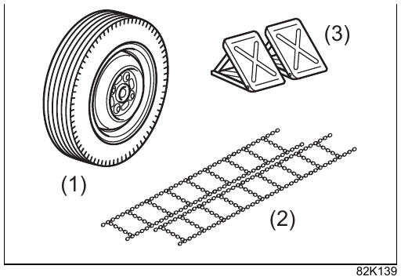{ .center-image }

| Обозначение | Описание |
| --- | --- |
| (1) | Зимняя шина, приобретается отдельно |
| (2) | Цепь противоскольжения, приобретается отдельно |
| (3) | Противооткатный упор, приобретается отдельно |

### Перед поездкой в холодную погоду

#### Снег на крыше

Перед началом движения удалите снег с крыши. Во время движения он может упасть на стекло и ухудшить обзор.

Для автомобилей с Suzuki Safety Support: если на ветровом стекле есть снег, иней или подобные загрязнения, передняя камера DSBS II может работать неправильно.

См. [передняя камера, передний радар и ультразвуковые датчики](04-driving.md#передняя-камера-передний-радар-и-ультразвуковые-датчики).

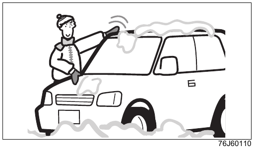{ .center-image }

#### Если стеклоочистители примёрзли

Полейте стекло тёплой водой и растопите лёд. После этого вытрите воду, чтобы она не замёрзла снова. Если включать примёрзшие стеклоочистители с усилием, можно повредить резинку щётки или сам стеклоочиститель.

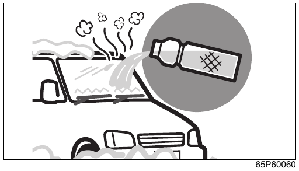{ .center-image }

#### Снег и иней на стёклах

Используйте пластиковый скребок (1). Он позволяет удалить снег и иней, не поцарапав стекло.

Для автомобилей с Suzuki Safety Support: если на ветровом стекле есть снег, иней или подобные загрязнения, передняя камера DSBS II может работать неправильно.

См. [передняя камера, передний радар и ультразвуковые датчики](04-driving.md#передняя-камера-передний-радар-и-ультразвуковые-датчики).

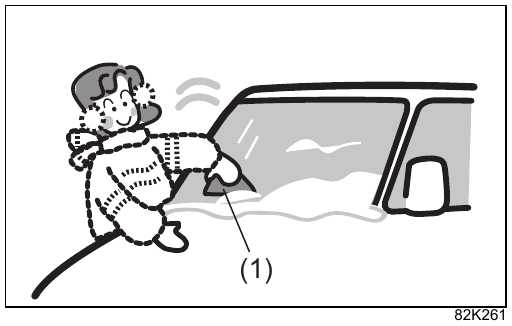{ .center-image }

| Обозначение | Описание |
| --- | --- |
| (1) | Пластиковый скребок |

#### Если наружные зеркала замёрзли

Полейте зеркало тёплой водой и растопите лёд. После этого вытрите воду, чтобы она не замёрзла снова. Не пытайтесь с усилием перемещать примёрзшее зеркало, иначе возможна неисправность.

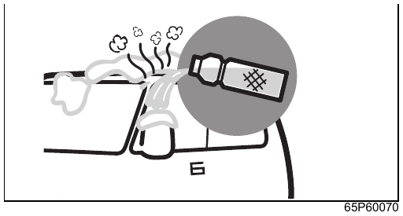{ .center-image }

!!! info "Примечание"
    - Если автомобиль оснащён переключателем складывания наружных зеркал, сначала убедитесь, что зеркало можно переместить рукой, и только после этого пользуйтесь переключателем. Повторные попытки двигать примёрзшее зеркало переключателем могут привести к неисправности.

      См. [переключатель складывания наружных зеркал](03-before-driving.md#переключатель-складывания-наружных-зеркал).

    - Если автомобиль оснащён дистанционным складыванием наружных зеркал, в сильный мороз, когда зеркала могут примёрзнуть, отключите эту функцию. Повторные попытки автоматического складывания примёрзших зеркал могут привести к неисправности.

      См. [дистанционное складывание наружных зеркал](03-before-driving.md#дистанционное-складывание-наружных-зеркал).

#### Если двери примерзли

Полейте дверь тёплой водой, не направляя воду в замочную скважину. Когда дверь откроется, вытрите воду. Не пытайтесь открыть примерзшую дверь с усилием: можно оторвать или повредить резиновые уплотнители вокруг двери.

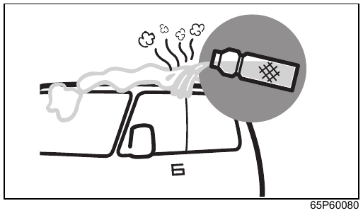{ .center-image }

#### Снег на обуви

Перед посадкой в автомобиль хорошо стряхните снег с обуви. Если садиться с налипшим снегом, ноги могут скользить по педалям, а влажность в салоне повысится, из-за чего стёкла будут быстрее запотевать.

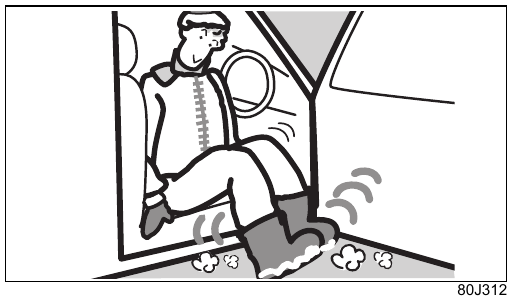{ .center-image }

### Движение по снежной дороге

#### На снегу и льду двигайтесь медленно

!!! warning "Осторожно"
    Снижайте скорость и избегайте резких действий: резкого трогания, резкого ускорения, резкого торможения, резкого поворота рулевого колеса и резкого торможения двигателем.

    На снегу и льду дорога скользкая, поэтому резкое управление может привести к заносу и аварии.

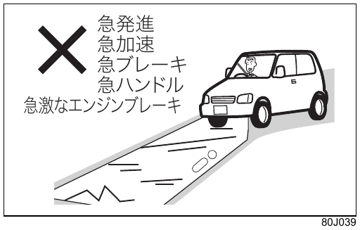{ .center-image }

#### Проверка эффективности тормозов

Снег и лёд, попавшие на тормозные механизмы, могут замёрзнуть, из-за чего эффективность тормозов снизится.

- Убедитесь, что вокруг безопасно, затем на малой скорости несколько раз нажмите педаль тормоза и проверьте эффективность тормозов.
- Если тормоза работают плохо, двигайтесь медленно и несколько раз слегка нажмите педаль тормоза, пока эффективность не восстановится. Так тормозные механизмы просохнут.

#### Установка зимних шин и цепей противоскольжения

На заснеженных и обледеневших дорогах устанавливайте зимние шины или цепи противоскольжения.

При установке соблюдайте местные правила региона, в котором движется автомобиль.

См. также:

- [при замене шин](#при-замене-шин);
- [установка цепей противоскольжения](#установка-цепей-противоскольжения).

#### Удаление снега с внутренней стороны крыльев

При движении по снегу снег может налипать на внутреннюю сторону крыльев, задевать шины и ухудшать поворот рулевого колеса.

Периодически останавливайте автомобиль и проверяйте внутреннюю сторону крыльев. Если налипли комья снега, удалите их осторожно, чтобы не повредить соседние детали.

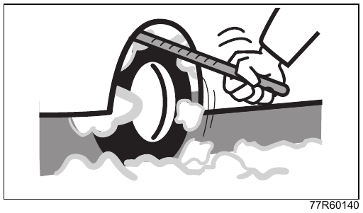{ .center-image }

### Стоянка в холодную погоду

#### Стояночный тормоз

Если стояночный тормоз замёрзнет, его нельзя будет отпустить.

При длительной стоянке не включайте стояночный тормоз. Вместо этого установите противооткатные упоры, приобретаемые отдельно.

- На автомобиле с механической коробкой передач включите передачу `R` или `1`.
- На автомобиле с автоматической коробкой передач переведите селектор в положение `P`.

#### После движения по дороге с противогололёдными реагентами

Как можно скорее смойте реагенты с автомобиля. Особенно тщательно промойте днище и ходовую часть. Если оставить реагенты на автомобиле, может появиться коррозия.

Чтобы детали не замёрзли, после мойки вытрите воду вокруг дверей и на других участках.

- При мойке не направляйте воду в замочные скважины дверей. Если замок замёрзнет, дверь нельзя будет отпереть.
- Особенно тщательно вытирайте воду с резиновых деталей вокруг дверей. Если они замёрзнут, дверь может не открыться.

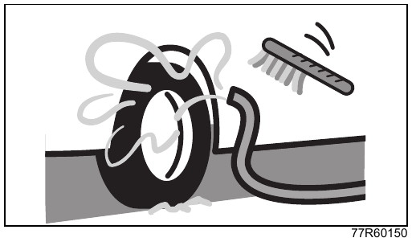{ .center-image }

#### При стоянке на открытом воздухе

Если на ветровом стекле есть снег или иней, система поддержки торможения с двумя датчиками DSBS II может работать неправильно.

!!! info "Примечание"
    - Не ставьте автомобиль под карнизами крыш и под деревьями. Снег или ледяные глыбы, падающие сверху, могут помять крышу автомобиля.
    - Если автомобиль оснащён крышной антенной, при длительной стоянке во время снегопада снимите антенну.

      См. [снятие и установка антенны](05-equipment.md#снятие-и-установка-антенны).

    - При стоянке поднимайте рычаги стеклоочистителей. Под тяжестью снега рычаги могут деформироваться, а резинки щёток могут примёрзнуть к стеклу.

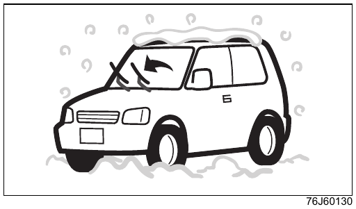{ .center-image }

#### Если вокруг выпускной трубы лежит снег

!!! danger "Внимание"
    Не запускайте двигатель, если выпускная труба засыпана снегом.

    Отработавшие газы могут попасть в салон и вызвать отравление угарным газом.

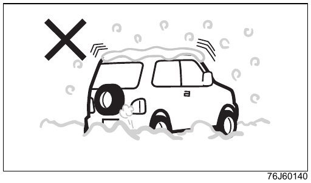{ .center-image }

### Установка цепей противоскольжения

#### Цепи противоскольжения

Используйте оригинальные цепи противоскольжения Suzuki, подходящие для этого автомобиля. Чтобы подобрать подходящие цепи, обратитесь к дилеру Suzuki или представителю Suzuki.

!!! danger "Внимание"
    - Не устанавливайте цепи, которые не подходят для этого автомобиля. Иначе можно повредить тормозные трубки или кузов.
    - Если во время движения появился необычный звук, немедленно остановитесь и проверьте цепи. Если цепь порвалась или частично соскочила и ударяет по кузову, можно повредить тормозные трубки или кузов.

!!! warning "Осторожно"
    - При движении с цепями противоскольжения ради безопасности и для защиты цепей снижайте скорость до 30 км/ч или меньше. Избегайте резкого трогания, резкого ускорения, резкого торможения, резкого поворота рулевого колеса, резкого торможения двигателем, а также наезда на выступы и ямы.
    - При установленных цепях противоскольжения скорость вращения шин может определяться неправильно. Из-за этого могут работать неправильно следующие системы:

      - ABS;
      - сигнализация экстренного торможения ESS;
      - ESP®;
      - часть функций Suzuki Safety Support.

      См. [если точная скорость вращения шин не определяется](04-driving.md#если-точная-скорость-вращения-шин-не-определяется).

!!! info "Примечание"
    Не ездите с цепями противоскольжения по очищенной от снега асфальтированной дороге. Это может повредить дорожное покрытие и ускорить износ цепей.

#### Перед установкой цепей противоскольжения

##### Цепи противоскольжения устанавливаются на задние колёса

Этот автомобиль имеет полный привод на базе заднего привода. Не устанавливайте цепи на передние колёса.

##### Устанавливайте цепи в безопасном месте, подходящем для подъёма домкратом

Прочитайте пункты 1 и 2 раздела [подготовка к замене шины](07-emergency.md#подготовка-к-замене-шины).

#### Установка цепей противоскольжения

Внимательно прочитайте инструкцию, прилагаемую к цепям противоскольжения.

!!! info "Примечание"
    На автомобилях с алюминиевыми колёсными дисками цепи противоскольжения могут поцарапать диск.
