# 7. В экстренной ситуации

## Содержание главы

| Раздел | Тема | Страница |
| --- | --- | --- |
| Что делать при возникновении неисправности | [Если автомобиль неисправен](#если-автомобиль-неисправен) | 7-2 |
| Что делать при возникновении неисправности | [Сигнальный факел](#сигнальный-факел) | 7-5 |
| Что делать при возникновении неисправности | [Буксировка тросом](#буксировка-тросом) | 7-5 |
| Что делать при возникновении неисправности | [Если автомобиль оказался в воде](#если-автомобиль-оказался-в-воде) | 7-9 |
| Что делать при возникновении неисправности | [Если произошла авария](#если-произошла-авария) | 7-10 |
| Что делать при возникновении неисправности | [Экстренный вызов Suzuki Helpnet®](#система-экстренного-вызова-suzuki-helpnet) | 7-11 |
| Что делать при возникновении неисправности | [Места хранения инструмента и домкрата](#место-хранения-инструмента-и-домкрата) | 7-17 |
| Прокол колеса | [Запасное колесо](#запасное-колесо) | 7-18 |
| Прокол колеса | [Подготовка к замене шины](#подготовка-к-замене-шины) | 7-24 |
| Прокол колеса | [Подъём автомобиля домкратом](#подъём-автомобиля-домкратом) | 7-25 |
| Прокол колеса | [Снятие и установка колеса](#снятие-и-установка-колеса) | 7-28 |
| Прокол колеса | [После замены колеса](#после-замены-колеса) | 7-30 |
| Разряд аккумулятора | [Что такое разряд свинцово-кислотной аккумуляторной батареи](#что-такое-разряд-свинцово-кислотной-аккумуляторной-батареи) | 7-31 |
| Разряд аккумулятора | [Если аккумуляторная батарея разряжена](#если-аккумуляторная-батарея-разряжена) | 7-31 |
| Разряд аккумулятора | [Как предотвратить разряд аккумуляторной батареи](#как-предотвратить-разряд-аккумуляторной-батареи) | 7-33 |
| Перегрев двигателя | [Что такое перегрев](#что-такое-перегрев) | 7-34 |
| Перегрев двигателя | [Если двигатель перегрелся](#если-двигатель-перегрелся) | 7-34 |
| Перегоревший предохранитель | [Если перегорел предохранитель](#если-перегорел-предохранитель) | 7-35 |
| Перегоревший предохранитель | [Проверка и замена предохранителя](#проверка-и-замена-предохранителя) | 7-39 |
| Перегоревшая лампа | [Проверка ламп](#проверка-ламп) | 7-40 |
| Перегоревшая лампа | [При замене лампы](#при-замене-лампы) | 7-40 |

## Что делать при возникновении неисправности

### Если автомобиль неисправен

#### Куда обращаться при неисправности

Свяжитесь с дилером Suzuki или представителем Suzuki, у которого приобретали автомобиль. Контакты представителей Suzuki и JAF указаны в отдельной книжке «Suzuki 4-wheel service network».

#### Держите в автомобиле знак аварийной остановки

На случай неисправности держите в автомобиле знак аварийной остановки, приобретаемый отдельно. На автомагистралях и дорогах для автомобилей закон требует устанавливать знак аварийной остановки позади автомобиля.

#### Если автомобиль неисправен на дороге

Остановите автомобиль на обочине или в другом безопасном месте и включите аварийную сигнализацию. При необходимости предупредите других водителей знаком аварийной остановки, приобретаемым отдельно, или сигнальным факелом.

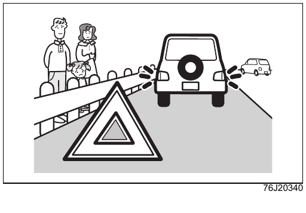{ .center-image }

Все пассажиры должны выйти из автомобиля и быстро перейти в безопасное место, например за ограждение.

#### Если автомобиль не может двигаться на железнодорожном переезде

Если автомобиль застрял на железнодорожном переезде, например из-за съезда колеса с покрытия, немедленно нажмите кнопку экстренной остановки на переезде.

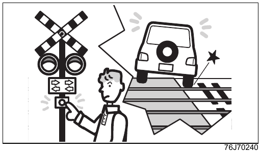{ .center-image }

Если вы не знаете, где находится кнопка экстренной остановки, подайте сигнал поезду сигнальным факелом.

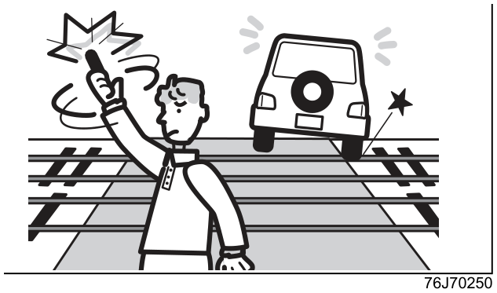{ .center-image }

#### Если нужно немного переместить заглохший автомобиль

Если автомобиль заглох на переезде, перекрёстке или в другом месте и не может двигаться, попросите находящихся рядом людей оттолкать автомобиль в безопасное место.

При этом выполните следующие действия:

- на автомобиле с механической коробкой передач переведите рычаг переключения передач в положение `N` (нейтраль);
- на автомобиле с автоматической коробкой передач переведите селектор в положение `N`.

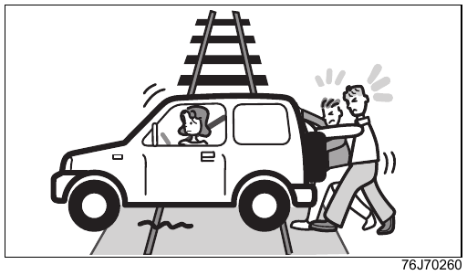{ .center-image }

!!! tip "Подсказка"
    - На автомобилях с механической и автоматической коробкой передач нельзя переместить автомобиль, удерживая выключатель двигателя в положении `START` и проворачивая стартер.
    - На автомобиле с автоматической коробкой передач, если при положении выключателя двигателя `ON` и нажатой педали тормоза селектор не выводится из положения `P`, снимите блокировку селектора по процедуре из раздела [снятие блокировки селектора](04-driving.md#снятие-блокировки-селектора).

#### Если автомобиль буксируют эвакуатором

- При буксировке эвакуатором поднимайте все четыре колеса либо задние колёса.

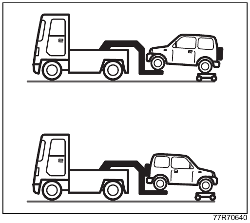{ .center-image }

- Если автомобиль буксируют с поднятыми только задними колёсами, перед буксировкой обязательно переключите привод в режим `2WD`, чтобы обеспечить безопасность и защитить трансмиссию.

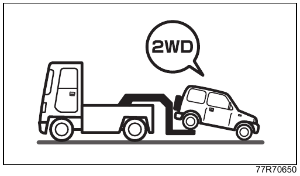{ .center-image }

- Для перемещения неисправного автомобиля также можно использовать автомобильный транспортёр.
- Если двигатель работает, но автомобиль не движется, или слышен необычный шум, возможна неисправность трансмиссии.

Перед буксировкой свяжитесь с дилером Suzuki или представителем Suzuki.

!!! danger "Внимание"
    - При буксировке автомобиля с Suzuki Safety Support выключите систему поддержки торможения с двумя датчиками DSBS II переключателем `DSBS II OFF`. Иначе DSBS II может внезапно сработать и привести к неожиданной аварии.

      См. [система поддержки торможения с двумя датчиками DSBS II](04-driving.md#система-поддержки-торможения-с-двумя-датчиками-dsbs-ii).

    - Не буксируйте автомобиль в режиме `4WD`, если на тележке находятся только передние или только задние колёса и эти колёса не могут вращаться. Автомобиль может неожиданно соскочить с тележки, а трансмиссия может получить повреждения.

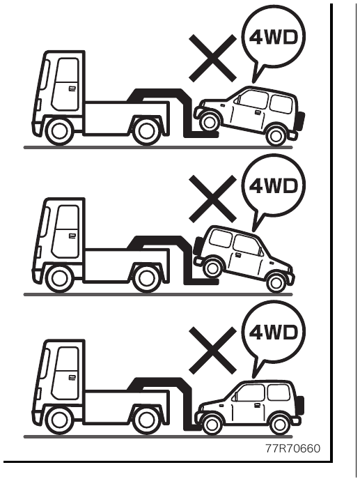{ .center-image }

!!! info "Примечание"
    Если буксировать автомобиль эвакуатором с подъёмом кузова, как показано на рисунке, можно повредить бампер или кузов.

    Не используйте эвакуатор с подъёмом кузова.

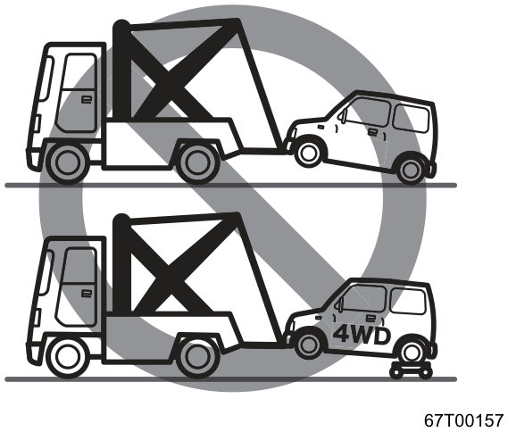{ .center-image }

### Сигнальный факел

- Сигнальный факел закреплён в держателе слева в ногах переднего пассажира.
- После зажигания факел горит примерно 5 минут. Используйте его как аварийный сигнал при неисправности в опасном месте, например на железнодорожном переезде или автомагистрали.
- Способ использования указан на сигнальном факеле. Заранее внимательно прочитайте инструкцию на факеле.
- Замените факел новым до окончания срока годности, указанного на корпусе. Сигнальный факел можно приобрести у дилера Suzuki или представителя Suzuki.

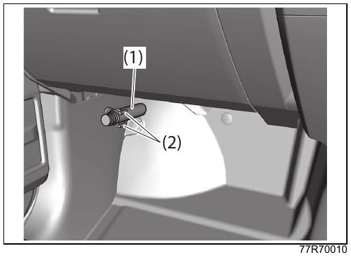{ .center-image }

| Обозначение | Описание |
| --- | --- |
| (1) | Сигнальный факел |
| (2) | Держатель |

!!! danger "Внимание"
    - Не позволяйте детям трогать сигнальный факел. Возможны ожоги, пожар и другие неожиданные происшествия.
    - Всегда храните факел в держателе.
    - При зажигании не направляйте конец факела на лицо или тело. Возможны ожоги.
    - Не используйте факел рядом с бензином и другими горючими материалами. Это может привести к пожару.
    - Если использовать сигнальный факел в плохо проветриваемом месте, например в тоннеле, дым может ухудшить видимость. В тоннеле подавайте сигнал аварийной сигнализацией.

### Буксировка тросом

#### Куда крепить трос

Крепите трос к буксировочному крюку.

##### Спереди

Буксировочный крюк (1) находится под передним бампером со стороны переднего пассажира.

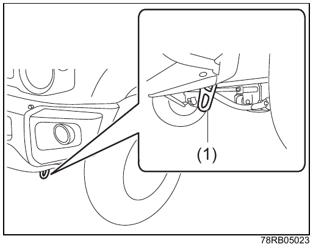{ .center-image }

| Обозначение | Описание |
| --- | --- |
| (1) | Буксировочный крюк |

!!! info "Примечание"
    Крюк, отмеченный символом `※` под передним бампером со стороны водителя, предназначен для крепления автомобиля при перевозке. Не используйте его для буксировки. Можно повредить крюк для перевозки или кузов.

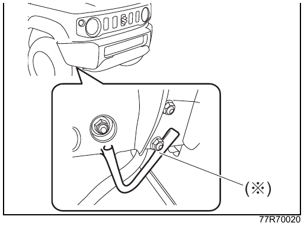{ .center-image }

На рисунке показан типовой пример. Расположение может отличаться в зависимости от комплектации автомобиля.

##### Сзади

На задней части автомобиля буксировочный крюк (1) расположен под задним бампером.

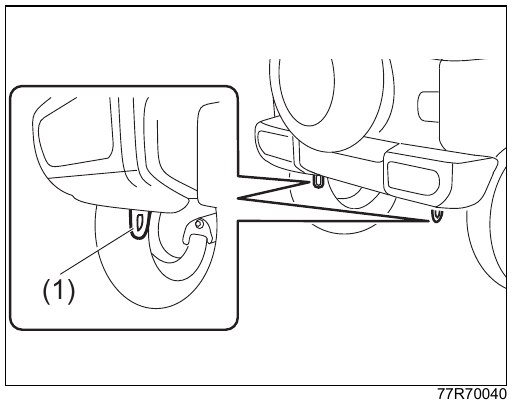{ .center-image }

| Обозначение | Описание |
| --- | --- |
| (1) | Буксировочный крюк |

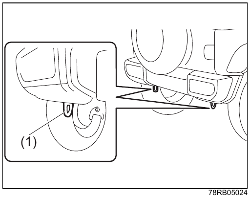{ .center-image }

| Обозначение | Описание |
| --- | --- |
| (1) | Буксировочный крюк |

!!! warning "Осторожно"
    На этом автомобиле нельзя буксировать другой автомобиль. Иначе можно повредить автомобиль.

    При буксировке этого автомобиля избегайте резкого трогания и резких манёвров. Из-за рывков буксировочный крюк, буксировочный трос или кузов могут получить повреждения.

##### Крюки для крепления при перевозке

На рисунке показан типовой пример. Расположение может отличаться в зависимости от комплектации автомобиля.

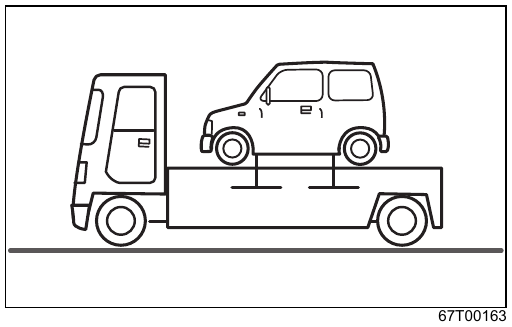{ .center-image }

Крюк, отмеченный символом `※` под передним бампером со стороны водителя, предназначен только для крепления автомобиля при перевозке. Сзади для крепления при перевозке используется крюк под задним бампером.

!!! info "Примечание"
    Если автомобиль крепят тросами при перевозке, ориентируйтесь на рисунок.

    Не натягивайте тросы чрезмерно. Слишком сильное натяжение может повредить автомобиль.

#### Порядок буксировки тросом

1. Закрепите буксировочный трос на буксировочном крюке. По возможности крепите трос на одной стороне автомобилей и располагайте его горизонтально.

    Если при буксировке трос может повредить бампер, заранее снимите бампер.

2. Закрепите в середине троса белую ткань размером не менее 30 см × 30 см.

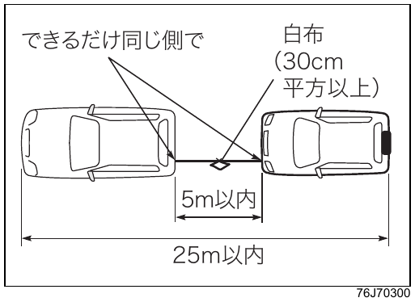{ .center-image }

| Обозначение | Требование |
| --- | --- |
| Расстояние между автомобилями | Не более 5 м |
| Общая длина сцепки | Не более 25 м |
| Метка на тросе | Белая ткань размером не менее 30 см × 30 см |

3. Не выключайте двигатель.

    Если двигатель не запускается, переведите выключатель двигателя в положение, отличное от `LOCK` или `OFF`, и слегка поверните рулевое колесо влево и вправо, чтобы убедиться, что блокировка рулевого управления снята.

    На автомобилях с Suzuki Safety Support при положении выключателя двигателя `ON` выключите систему поддержки торможения с двумя датчиками DSBS II переключателем `DSBS II OFF`.

    Перед буксировкой переведите рычаг раздаточной коробки в положение `2WD`.

!!! warning "Осторожно"
    При движении автомобиля с неработающим двигателем соблюдайте следующие меры предосторожности.

    - Не переводите выключатель двигателя в положение `LOCK` или `OFF`. Рулевое колесо заблокируется, и управлять автомобилем станет невозможно.
    - Усилитель тормозов не работает. Нажимайте педаль тормоза сильнее обычного.
    - Усилитель рулевого управления не работает. Рулевое колесо станет заметно тяжелее.

!!! info "Примечание"
    Если из-за неисправности или разряда свинцово-кислотной аккумуляторной батареи невозможно снять блокировку рулевого управления, буксировка тросом невозможна.

4. На автомобиле с механической коробкой передач переведите рычаг переключения передач в положение `N` (нейтраль). На автомобиле с автоматической коробкой передач переведите селектор в положение `N`.

    Если селектор автоматической коробки передач невозможно перевести в положение `N`, буксировка тросом невозможна. Обратитесь к дилеру Suzuki, представителю Suzuki или в службу дорожной помощи JAF.

    Если при положении выключателя двигателя `ON` и нажатой педали тормоза селектор не выводится из положения `P` из-за неисправности или разряда свинцово-кислотной аккумуляторной батареи, выполните процедуру из раздела [снятие блокировки селектора](04-driving.md#снятие-блокировки-селектора).

5. Во время буксировки следите, чтобы трос оставался натянутым. Наблюдайте за стоп-сигналами автомобиля впереди и не допускайте наезда на него.

    Чтобы предупредить водителей сзади, на буксируемом автомобиле включите аварийную сигнализацию.

!!! danger "Внимание"
    На длинном или крутом спуске не буксируйте автомобиль тросом. Обратитесь к эвакуатору.

    При буксировке тросом тормоза перегреваются, потому что торможение двигателем не работает. Это может снизить эффективность торможения.

!!! info "Примечание"
    - Водитель буксирующего автомобиля должен двигаться плавно, без рывков.
    - Если автомобиль с автоматической коробкой передач всё же необходимо буксировать тросом, скорость буксировки должна быть не выше 30 км/ч, а расстояние буксировки - не более 30 км.

### Если автомобиль оказался в воде

Если автомобиль попал в воду, действуйте спокойно.

1. Отстегните ремень безопасности.

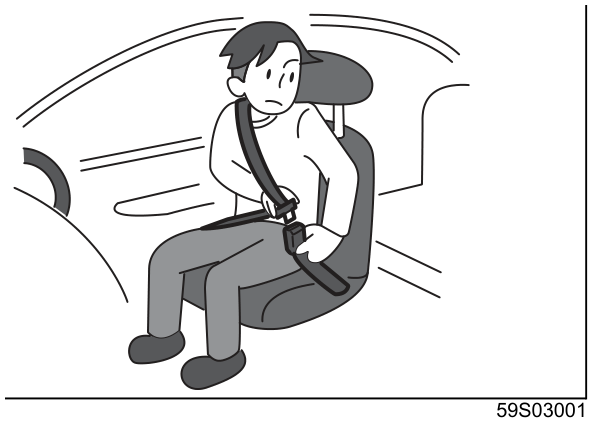{ .center-image }

2. Если дверь открывается, откройте её и выберитесь из автомобиля.

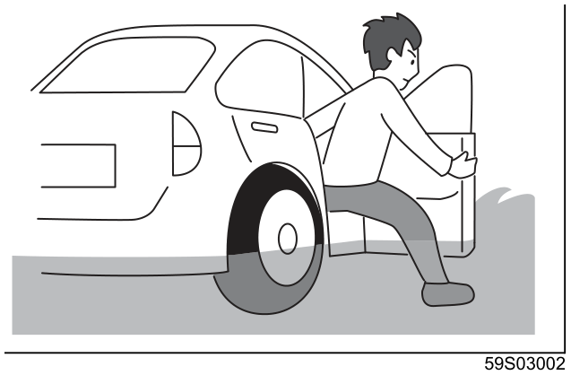{ .center-image }

3. Если дверь не открывается, опустите стекло переключателем стеклоподъёмника и выберитесь через окно.

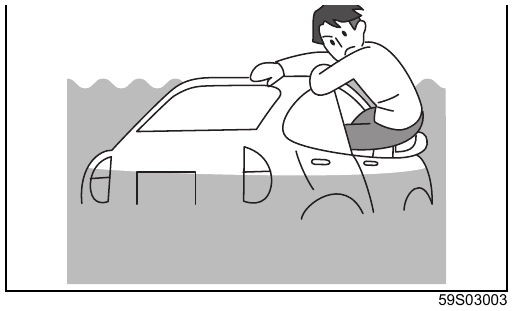{ .center-image }

4. Если переключатель стеклоподъёмника не опускает стекло, не паникуйте. Подождите, пока уровень воды внутри и снаружи автомобиля сравняется и давление на дверь уменьшится, затем откройте дверь и выберитесь из автомобиля.

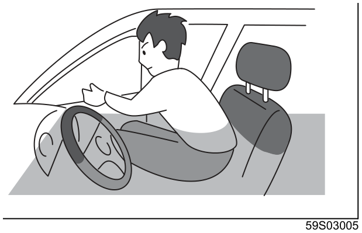{ .center-image }

!!! info "Примечание"
    - После попадания автомобиля в воду стеклоподъёмники со временем перестают работать. Выбирайтесь как можно быстрее.
    - Стёкла передних дверей и задней двери можно разбить аварийным молотком для выхода из автомобиля, который приобретается отдельно. Ветровое стекло разбить таким молотком нельзя, потому что оно изготовлено из многослойного стекла.
    - В зависимости от положения сиденья и телосложения пассажира выбраться через окно может быть невозможно.

!!! tip "Подсказка"
    - Если уровень воды снаружи и внутри автомобиля сильно отличается, выбирайтесь через окно.
    - Если уровень воды снаружи и внутри автомобиля примерно одинаковый, откройте дверь и выберитесь из автомобиля.

### Если произошла авария

1. Переместите автомобиль в безопасное место, чтобы не создавать помех другим автомобилям, и остановите двигатель.
2. Окажите первую помощь пострадавшим. Если есть травма головы, не перемещайте пострадавшего без крайней необходимости. Перемещайте его только если это нужно, чтобы предотвратить вторичную аварию.
3. Сообщите в полицию место аварии, обстоятельства и наличие пострадавших, затем следуйте указаниям полиции.
4. Запишите данные другой стороны и обстоятельства аварии.
5. Свяжитесь с дилером Suzuki, представителем Suzuki и страховой компанией.

!!! warning "Осторожно"
    Даже если внешних травм нет, как можно скорее обратитесь к врачу.

#### Не двигайтесь на повреждённом автомобиле

Если автомобиль повреждён, даже незначительно, перед дальнейшей поездкой обратитесь к дилеру Suzuki или представителю Suzuki и как можно скорее выполните проверку и ремонт.

В зависимости от характера повреждения возможны пожар автомобиля или неисправность.

### Система экстренного вызова Suzuki (Helpnet®)

!!! tip "Оборудование по типу автомобиля"
    Система экстренного вызова Suzuki устанавливается в зависимости от комплектации автомобиля.

Система экстренного вызова Suzuki автоматически отправляет сообщение при срабатывании подушек безопасности в аварии или при сильном ударе сзади. Кроме того, при нажатии кнопки `SOS` система передаёт оператору Helpnet® сведения об автомобиле, включая состояние автомобиля и данные о местоположении, и помогает связаться с экстренными службами: полицией, пожарной службой или медицинской службой.

!!! danger "Внимание"
    - Если у вас установлен кардиостимулятор, имплантируемый кардиовертер-дефибриллятор `ICD` или другое медицинское электрическое устройство, перед использованием системы экстренного вызова Suzuki уточните у производителя медицинского устройства, может ли система повлиять на его работу. За подробностями обратитесь к дилеру Suzuki или представителю Suzuki.
    - Если после экстренного вызова вы ожидаете помощь, примите меры, чтобы избежать вторичной аварии, например столкновения с автомобилем сзади. Все люди должны выйти из автомобиля и как можно быстрее перейти в безопасное место, например за ограждение.

!!! info "Примечание"
    - Система экстренного вызова Suzuki использует сервис Helpnet® и помогает связаться при аварии, внезапном ухудшении самочувствия и других экстренных ситуациях.
    - Система экстренного вызова Suzuki не работает, если услуга заранее не подключена.
    - Фактическое местоположение автомобиля и координаты, переданные в Helpnet®, могут отличаться.
    - `Helpnet®` является зарегистрированным товарным знаком компании Japan Emergency Call Service Co., Ltd.
    - Бортовое коммуникационное устройство автомобиля содержит свободное программное обеспечение и программное обеспечение с открытым исходным кодом. Сведения о лицензиях и исходный код доступны по адресу: `https://www.denso-ten.com/support/source/oem/sg1/`.

#### Как пользоваться системой экстренного вызова Suzuki (Helpnet®)

!!! danger "Внимание"
    Используйте систему экстренного вызова Suzuki (Helpnet®), только остановив автомобиль в безопасном месте. Управление кнопкой `SOS` во время движения может привести к аварии.

Система экстренного вызова Suzuki (Helpnet®) имеет две функции: автоматический экстренный вызов при серьёзной аварии `D-Call Net®` и ручной вызов кнопкой `SOS`.

Кнопка `SOS` (1), крышка (5) и микрофон (2) находятся позади переднего плафона освещения салона.

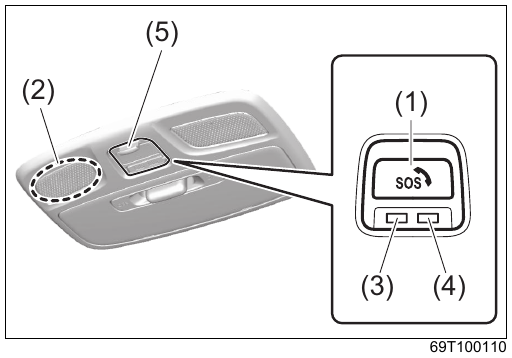{ .center-image }

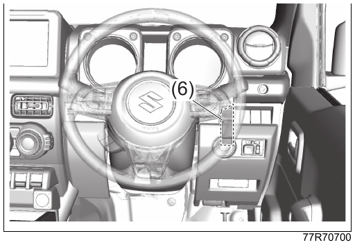{ .center-image }

| Обозначение | Описание |
| --- | --- |
| (1) | Кнопка `SOS` |
| (2) | Микрофон |
| (3) | Зелёный индикатор |
| (4) | Красный индикатор |
| (5) | Крышка |
| (6) | Динамик |

##### Автоматический экстренный вызов при серьёзной аварии (D-Call Net®)

Когда выключатель двигателя находится в положении `ON`, система экстренного вызова Suzuki (Helpnet®) готова к работе.

Если автомобиль распознаёт столкновение, при котором сработали подушки безопасности, он отправляет сигнал `SOS` и начинает подключение к Helpnet®. При подключении в Helpnet® передаются сведения об автомобиле, включая состояние автомобиля и данные о местоположении. Зелёный индикатор (3) начинает мигать, и через микрофон (2) устанавливается голосовая связь с оператором Helpnet®.

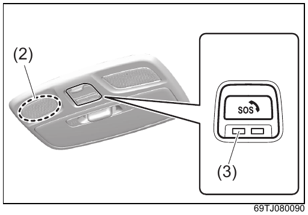{ .center-image }

`D-Call Net®` является зарегистрированным товарным знаком сертифицированной некоммерческой организации Emergency Medical Network of Helicopter and Hospital (HEM-Net).

!!! tip "Подсказка"
    - Система автоматически выполняет вызов и в тех случаях, когда подушки безопасности сработали не при аварии. В такой ситуации попросите оператора Helpnet® завершить вызов.
    - Если нужно сообщить в полицию или пожарную службу, оператор Helpnet® поможет связаться с нужной службой.
    - После завершения разговора система переходит в режим ожидания обратного вызова. Если Helpnet® позвонит в автомобиль, вызов будет принят автоматически и разговор начнётся снова. Когда режим ожидания обратного вызова закончится, экстренный вызов завершится.

##### Кнопка SOS (ручной вызов)

Когда выключатель двигателя находится в положении `ON`, система экстренного вызова Suzuki (Helpnet®) готова к работе.

В экстренной ситуации, например при аварии или внезапном ухудшении самочувствия, откройте крышку (5), нажмите кнопку `SOS` (1) и отпустите её. При подключении в Helpnet® передаются сведения об автомобиле, включая состояние автомобиля и данные о местоположении. Зелёный индикатор (3) начинает мигать, и через микрофон (2) устанавливается голосовая связь с оператором Helpnet®.

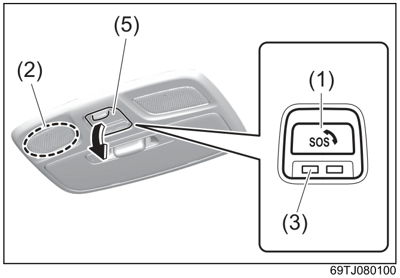{ .center-image }

!!! info "Примечание"
    Обратитесь к дилеру Suzuki или представителю Suzuki в следующих случаях:

    - при переводе выключателя двигателя в положение `ON` красный и зелёный индикаторы не загораются;
    - мигает только красный индикатор.

    Если красный индикатор продолжает гореть, переместите автомобиль в место с лучшим приёмом радиосигнала. Если после этого красный индикатор не сменится зелёным, обратитесь к дилеру Suzuki или представителю Suzuki.

#### Меры предосторожности при использовании системы экстренного вызова Suzuki (Helpnet®)

!!! warning "Осторожно"
    В систему встроено коммуникационное оборудование. Не устанавливайте аксессуары и не кладите предметы на верхнюю часть панели приборов. Иначе данные о местоположении автомобиля могут передаваться неточно, а связь с оператором может работать хуже.

- При разговоре направляйте голос к встроенному микрофону рядом с кнопкой `SOS`.
- Система экстренного вызова Suzuki использует сеть передачи данных, аналогичную сети мобильной связи. Система может быть недоступна в тоннеле, под землёй, в крытой парковке, в горной местности, в местах со слабым сигналом, вне зоны приёма, а также при перегрузке телефонной сети или ограничении исходящих вызовов.
- Экстренные службы определяют автомобиль по его местоположению, модели, цвету, регистрационному номеру и другим данным. Если цвет автомобиля или регистрационный номер изменены, экстренным службам может быть сложнее найти автомобиль, и прибытие помощи может задержаться. Сообщите оператору цвет автомобиля и регистрационный номер.
- После ручного вызова верните крышку кнопки `SOS` в исходное положение.
- По вопросам подключения услуги обратитесь к дилеру Suzuki или представителю Suzuki.
- После завершения разговора система переходит в режим ожидания обратного вызова. Если Helpnet® позвонит в автомобиль, вызов будет принят автоматически и разговор начнётся снова. Когда режим ожидания обратного вызова закончится, экстренный вызов завершится.

!!! info "Примечание"
    - При разговоре с оператором через кнопку `SOS` используйте систему при выключателе двигателя в положении `ON` и работающем двигателе. Если долго держать выключатель двигателя в положении `ON` при остановленном двигателе, свинцово-кислотная аккумуляторная батарея может разрядиться.
    - Громкость разговора с оператором не регулируется.
    - Не нажимайте кнопку `SOS`, если нет экстренной ситуации. После начала ручного вызова завершить разговор со стороны автомобиля нельзя. Если вызов был сделан ошибочно, попросите оператора Helpnet® завершить разговор.
    - С момента начала экстренного вызова до завершения разговора звук аудиосистемы автоматически приглушается, чтобы разговор с оператором имел приоритет.

##### Встроенный элемент питания системы

Автоматический экстренный вызов при серьёзной аварии (D-Call Net®) использует встроенный элемент питания системы.

Если мигает красный индикатор кнопки `SOS`, встроенный элемент питания может быть разряжен и требовать замены. Для безопасности рекомендуется заменить его. По вопросу замены встроенного элемента питания обратитесь к дилеру Suzuki или представителю Suzuki.

##### Индикаторы в кнопке SOS

Зелёный индикатор (5) и красный индикатор (2) в кнопке `SOS` (1) показывают состояние системы экстренного вызова Suzuki (Helpnet®) и состояние разговора с оператором.

| Зелёный индикатор | Красный индикатор | Состояние | Описание |
| --- | --- | --- | --- |
| Горит | Горит | Начало запуска системы | При переводе выключателя двигателя в положение `ON` начинается запуск системы. Оба индикатора горят примерно 5 секунд. |
| Горит | Не горит | Вызов возможен | Запуск системы завершён, экстренный вызов возможен. |
| Не горит | Горит | Запуск системы / вне зоны обслуживания | До завершения запуска системы требуется примерно 30 секунд. Если связь плохая и экстренный вызов невозможен, переместите автомобиль в место с лучшим приёмом. |
| Мигает примерно каждые 0,5 с | Не горит | Экстренный вызов выполняется | Система выполняет экстренный вызов, находится в режиме ожидания обратного вызова или идёт разговор после обратного вызова. |
| Не горит | Мигает примерно каждые 0,5 с | Неисправность системы | Экстренный вызов невозможен из-за неисправности системы. Обратитесь к дилеру Suzuki или представителю Suzuki. |
| Не горит | Мигает примерно каждые 0,5 с | Неудачный экстренный вызов | Примерно через 10 секунд индикация изменится. Повторите экстренный вызов. |
| Не горит | Не горит | Услуга не подключена | Экстренный вызов невозможен, потому что услуга экстренного вызова Suzuki не подключена. Обратитесь к дилеру Suzuki или представителю Suzuki. |
| Не горит | Не горит | Неисправность системы | Экстренный вызов невозможен из-за неисправности системы. Обратитесь к дилеру Suzuki или представителю Suzuki. |

!!! info "Примечание"
    После завершения разговора с Helpnet® система может автоматически принять входящий обратный вызов от Helpnet® и снова начать разговор.

!!! warning "Осторожно"
    Если мигает только красный индикатор либо красный и зелёный индикаторы долго продолжают гореть, возможна неисправность системы. По состоянию индикаторов обратитесь к дилеру Suzuki или представителю Suzuki.

!!! tip "Подсказка"
    При неисправности системы на многофункциональном информационном дисплее в комбинации приборов отображается сообщение. См. [сообщения многофункционального информационного дисплея](03-before-driving.md#список-сообщений-многофункционального-информационного-дисплея).

### Место хранения инструмента и домкрата

Инструмент и домкрат хранятся под ковриком багажного отделения.

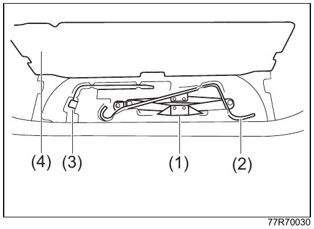{ .center-image }

| Обозначение | Описание |
| --- | --- |
| (1) | Домкрат |
| (2) | Рукоятка домкрата |
| (3) | Колёсный ключ |
| (4) | Коврик багажного отделения |

- После использования уберите инструмент и домкрат на штатные места.
- Перед укладкой полностью сложите домкрат.

## Прокол шины

### Запасное колесо

Запасное колесо установлено снаружи на задней двери.

!!! warning "Осторожно"
    - Регулярно проверяйте давление воздуха и износ запасного колеса. Использование запасного колеса с недостаточным давлением или с изношенной шиной может привести к непредвиденной аварии.
    - Если размер, марка, рисунок протектора или размер колёсного диска запасного колеса отличаются от остальных четырёх колёс, запасное колесо является временным аварийным колесом для использования при проколе. Сразу отремонтируйте или замените проколотую шину и как можно скорее установите на все четыре колеса одинаковые шины. См. [при замене шин](06-care.md#при-замене-шин).

#### Jimny

##### Снятие запасного колеса

1. Снимите кожух запасного колеса (1).

    Одну колпачковую гайку, удерживающую кожух, отверните колёсным ключом (2) против часовой стрелки.

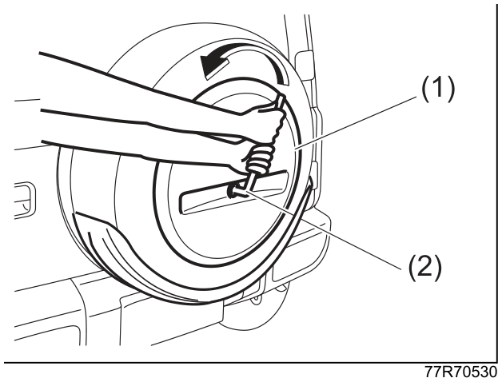{ .center-image }

| Обозначение | Описание |
| --- | --- |
| (1) | Кожух запасного колеса |
| (2) | Колёсный ключ |

2. Снимите кронштейн (3).

    Три гайки, удерживающие кронштейн, отверните колёсным ключом (2) против часовой стрелки.

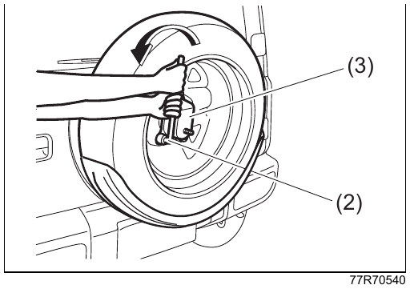{ .center-image }

| Обозначение | Описание |
| --- | --- |
| (2) | Колёсный ключ |
| (3) | Кронштейн |

3. Крепко удерживая запасное колесо и нижний кожух (4) двумя руками, снимите их с автомобиля.

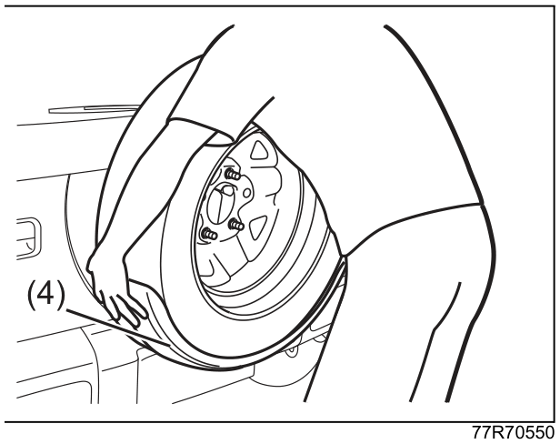{ .center-image }

| Обозначение | Описание |
| --- | --- |
| (4) | Нижний кожух |

!!! info "Примечание"
    Осторожно опускайте запасное колесо и нижний кожух на землю. Если уронить их с высоты, нижний кожух и другие детали могут быть повреждены.

##### Установка запасного колеса

!!! warning "Осторожно"
    Не устанавливайте колесо с алюминиевым диском на место хранения запасного колеса. Оно может быть повреждено или упасть.

    Проколотое колесо с алюминиевым диском временно храните в багажном отделении.

1. Установите нижний кожух (4) на запасное колесо.

    | Шаг | Действие |
    | --- | --- |
    | 1 | Положите запасное колесо на землю лицевой стороной диска вверх. |
    | 2 | Установите нижний кожух со стороны, противоположной вентилю шины (12), как показано на рисунке, чтобы кожух не касался вентиля. |
    | 3 | Вставьте два выступа (5) нижнего кожуха в отверстия диска, как показано на рисунке. |

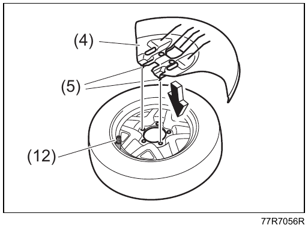{ .center-image }

| Обозначение | Описание |
| --- | --- |
| (4) | Нижний кожух |
| (5) | Выступы нижнего кожуха |
| (12) | Вентиль шины |

2. Вставьте колёсный ключ (2) в держатель запасного колеса (6), чтобы откинуть верхний болт (7) держателя на себя.

    | Шаг | Действие |
    | --- | --- |
    | 1 | Откиньте подвижную верхнюю часть держателя на себя так, чтобы верхний болт (7) был направлен горизонтально назад, и вставьте колёсный ключ в отверстие трубы (a). |
    | 2 | Вставьте колёсный ключ через отверстие трубы и дальше в заднее отверстие (b), чтобы зафиксировать подвижную верхнюю часть держателя. Головка колёсного ключа должна быть направлена вниз. |

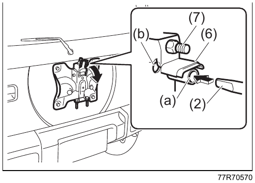{ .center-image }

| Обозначение | Описание |
| --- | --- |
| (2) | Колёсный ключ |
| (6) | Держатель запасного колеса |
| (7) | Верхний болт держателя |
| (a) | Отверстие трубы |
| (b) | Заднее отверстие |

!!! info "Примечание"
    Если вставить колёсный ключ слишком глубоко, можно поцарапать кузов.

!!! tip "Подсказка"
    Если вставить колёсный ключ не головкой вниз, он будет мешать установке запасного колеса.

3. Крепко удерживая запасное колесо и нижний кожух двумя руками, совместите верхний болт держателя с одним отверстием диска, как показано на рисунке.

    Чтобы колесо не выпало, слегка наверните гайку (8). После этого выньте колёсный ключ.

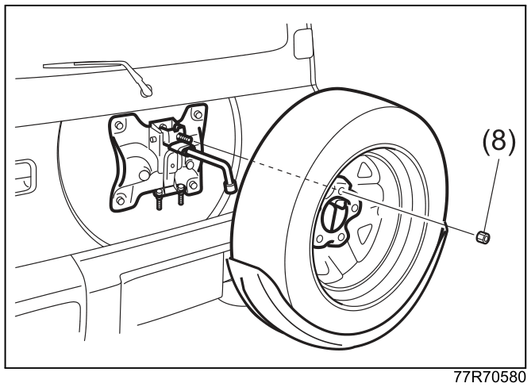{ .center-image }

| Обозначение | Описание |
| --- | --- |
| (8) | Гайка |

4. Потяните нижнюю часть колеса на себя и вверх, поднимите U-образный болт (9) и вставьте его в два нижних отверстия диска.

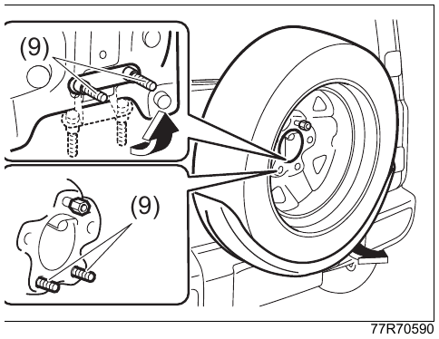{ .center-image }

| Обозначение | Описание |
| --- | --- |
| (9) | U-образный болт |

!!! warning "Осторожно"
    Следите, чтобы не защемить пальцы или другие части тела между запасным колесом и кузовом.

5. Установите кронштейн (10).

    | Шаг | Действие |
    | --- | --- |
    | 1 | Снимите гайку, которую временно навернули на шаге 3, и установите кронштейн, как показано на рисунке. |
    | 2 | Равномерно и надёжно затяните три гайки (8) колёсным ключом. Момент затяжки: 56 Н·м (571 кгс·см). Ориентировочное усилие на конце рукоятки колёсного ключа: 221 Н (22,5 кгс). |
    | 3 | Убедитесь, что гайки надёжно затянуты. |

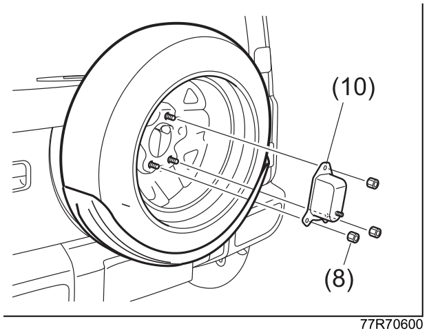{ .center-image }

| Обозначение | Описание |
| --- | --- |
| (8) | Гайка |
| (10) | Кронштейн |

6. Установите кожух запасного колеса (1).

    | Шаг | Действие |
    | --- | --- |
    | 1 | Совместите отверстие кожуха запасного колеса с болтом кронштейна (10), чтобы отверстие кожуха было расположено ниже центра, как показано на рисунке. |
    | 2 | Надёжно затяните одну колпачковую гайку (11) колёсным ключом. Момент затяжки: 29 Н·м (296 кгс·см). Ориентировочное усилие на конце рукоятки колёсного ключа: 114 Н (11,6 кгс). |

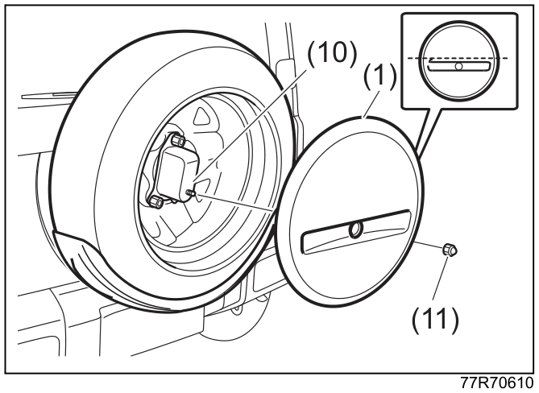{ .center-image }

| Обозначение | Описание |
| --- | --- |
| (1) | Кожух запасного колеса |
| (10) | Кронштейн |
| (11) | Колпачковая гайка |

!!! info "Примечание"
    Не затягивайте колпачковую гайку чрезмерно. Можно повредить кожух запасного колеса.

#### Jimny Sierra

##### Снятие запасного колеса

1. Снимите кожух запасного колеса (1).

    Одну колпачковую гайку, удерживающую кожух, отверните колёсным ключом (2) против часовой стрелки.

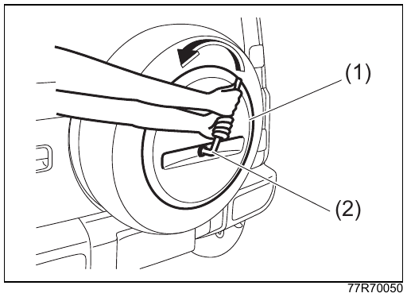{ .center-image }

| Обозначение | Описание |
| --- | --- |
| (1) | Кожух запасного колеса |
| (2) | Колёсный ключ |

2. Отверните три колпачковые гайки.

    Используйте колёсный ключ (2) и отворачивайте гайки против часовой стрелки.

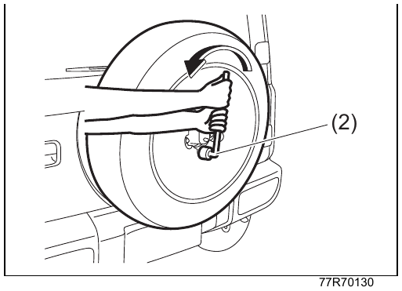{ .center-image }

| Обозначение | Описание |
| --- | --- |
| (2) | Колёсный ключ |

3. Крепко удерживая запасное колесо двумя руками, снимите его.

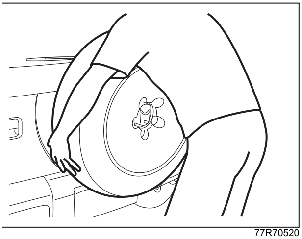{ .center-image }

!!! info "Примечание"
    Осторожно опускайте запасное колесо на землю.

##### Установка запасного колеса

1. Проверьте ориентацию кронштейна (3), установленного на держателе запасного колеса (4).

    Сторона с маркировкой `195` должна быть сверху.

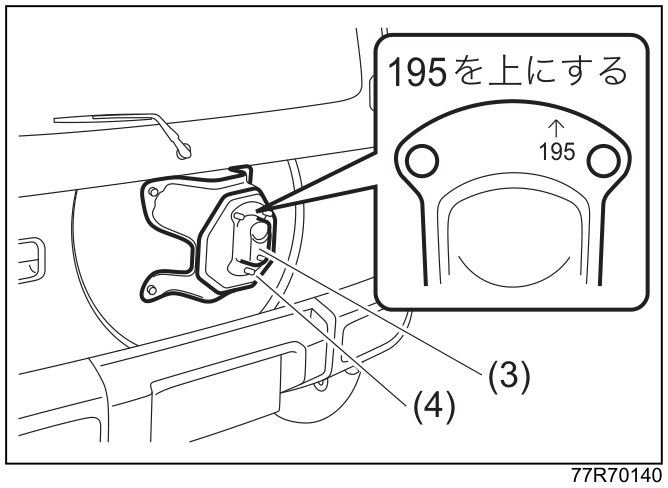{ .center-image }

| Обозначение | Описание |
| --- | --- |
| (3) | Кронштейн |
| (4) | Держатель запасного колеса |

!!! tip "Подсказка"
    Если установить кронштейн вверх ногами, колпачковую гайку крепления кожуха запасного колеса невозможно будет надёжно затянуть.

2. Установите запасное колесо на держатель (4).

    | Шаг | Действие |
    | --- | --- |
    | 1 | Крепко удерживая колесо двумя руками, совместите три отверстия диска с болтами держателя (4). |
    | 2 | Равномерно и надёжно затяните три колпачковые гайки (5) колёсным ключом. Момент затяжки: 80 Н·м (816 кгс·см). Ориентировочное усилие на конце рукоятки колёсного ключа: 316 Н (32,2 кгс). |
    | 3 | Убедитесь, что гайки надёжно затянуты. |

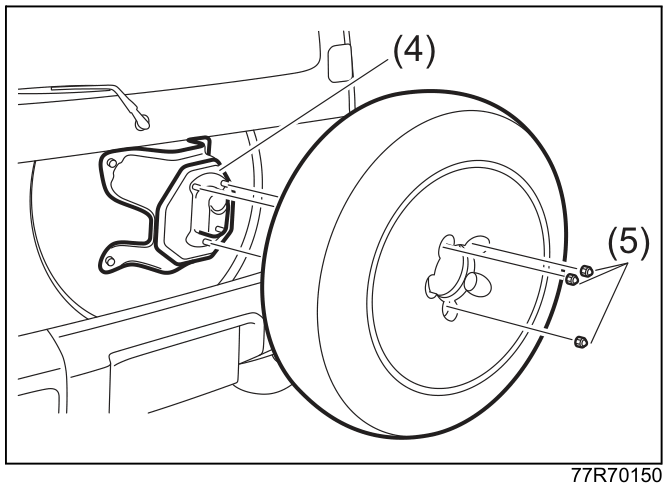{ .center-image }

| Обозначение | Описание |
| --- | --- |
| (4) | Держатель запасного колеса |
| (5) | Колпачковая гайка |

3. Установите кожух запасного колеса (1).

    | Шаг | Действие |
    | --- | --- |
    | 1 | Совместите отверстие кожуха запасного колеса с болтом кронштейна (3), чтобы отверстие кожуха было расположено ниже центра, как показано на рисунке. |
    | 2 | Надёжно затяните одну колпачковую гайку (5) колёсным ключом. Момент затяжки: 29 Н·м (296 кгс·см). Ориентировочное усилие на конце рукоятки колёсного ключа: 114 Н (11,6 кгс). |

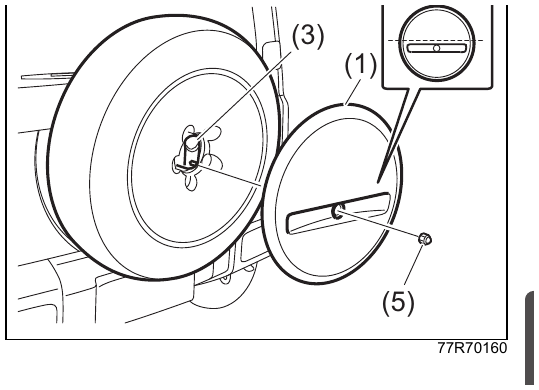{ .center-image }

| Обозначение | Описание |
| --- | --- |
| (1) | Кожух запасного колеса |
| (3) | Кронштейн |
| (5) | Колпачковая гайка |

!!! info "Примечание"
    Не затягивайте колпачковую гайку чрезмерно. Можно повредить кожух запасного колеса.

### Подготовка к замене шины

1. Чтобы предупредить других водителей, включите аварийную сигнализацию. Переместите автомобиль в место, где он не мешает движению других автомобилей, где можно безопасно работать, а покрытие твёрдое и ровное.
2. Надёжно затяните стояночный тормоз.

    - На автомобиле с механической коробкой передач остановите двигатель и переведите рычаг переключения передач в положение `R` или на 1-ю передачу.
    - На автомобиле с автоматической коробкой передач переведите селектор в положение `P` и остановите двигатель.

    При необходимости установите знак аварийной остановки, приобретаемый отдельно.

3. Установите противооткатные упоры (1), приобретаемые отдельно, спереди и сзади колеса, расположенного по диагонали от заменяемого колеса (2).

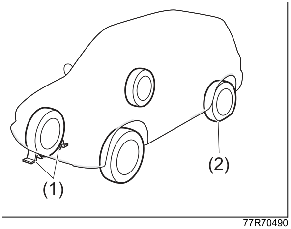{ .center-image }

| Обозначение | Описание |
| --- | --- |
| (1) | Противооткатные упоры |
| (2) | Заменяемое колесо |

4. Достаньте инструмент и домкрат, затем снимите запасное колесо. Если в автомобиле есть пассажиры или находится тяжёлый багаж, высадите пассажиров и выгрузите тяжёлый багаж.

    Чтобы при случайном срыве домкрата не защемить ноги, положите снятое запасное колесо под кузов рядом с заменяемым колесом.

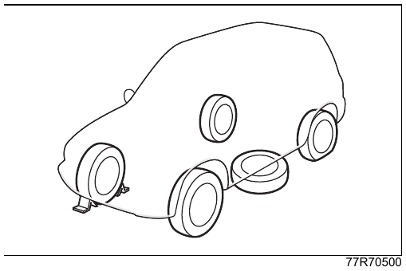{ .center-image }

!!! tip "Подсказка"
    Если кладёте запасное колесо на землю лицевой стороной диска вверх, диск будет труднее поцарапать.

5. Колёсным ключом (3) ослабьте пять колёсных гаек против часовой стрелки так, чтобы их можно было легко повернуть рукой.

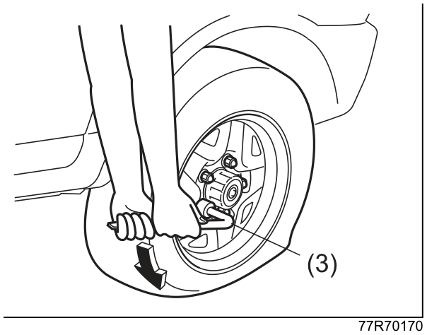{ .center-image }

| Обозначение | Описание |
| --- | --- |
| (3) | Колёсный ключ |

На рисунке показан типовой пример. В зависимости от типа автомобиля вид может отличаться.

### Подъём автомобиля домкратом

Перед подъёмом автомобиля домкратом надёжно затяните стояночный тормоз.

- На автомобиле с механической коробкой передач остановите двигатель и переведите рычаг переключения передач в положение `R` или на 1-ю передачу.
- На автомобиле с автоматической коробкой передач переведите селектор в положение `P` и остановите двигатель.

!!! danger "Внимание"
    Если домкрат сорвётся, человека может зажать, что приведёт к тяжёлой травме, а автомобиль может начать движение и вызвать неожиданную аварию. При подъёме автомобиля домкратом соблюдайте следующие требования.

    - Поднимайте автомобиль домкратом только на твёрдом и ровном покрытии.
    - Используйте домкрат только для замены колеса или ремонта прокола.
    - Используйте только домкрат, входящий в комплект этого автомобиля. Не используйте домкрат от другого автомобиля и не используйте домкрат этого автомобиля для другого автомобиля.
    - Устанавливайте домкрат только в указанную точку. При установке в другое место домкрат может сорваться или автомобиль может получить повреждения.
    - Не поднимайте автомобиль выше, чем необходимо.
    - Когда автомобиль поднят домкратом, не залезайте под автомобиль, не запускайте двигатель и не раскачивайте автомобиль.
    - При подъёме автомобиля не подкладывайте предметы сверху или снизу домкрата.
    - Не используйте несколько домкратов, чтобы одновременно поднять несколько колёс.

1. Поверните рукой место крепления рукоятки домкрата по часовой стрелке, раздвигая домкрат, и слегка уприте отверстие в верхней части домкрата в выступ на рычаге подвески.

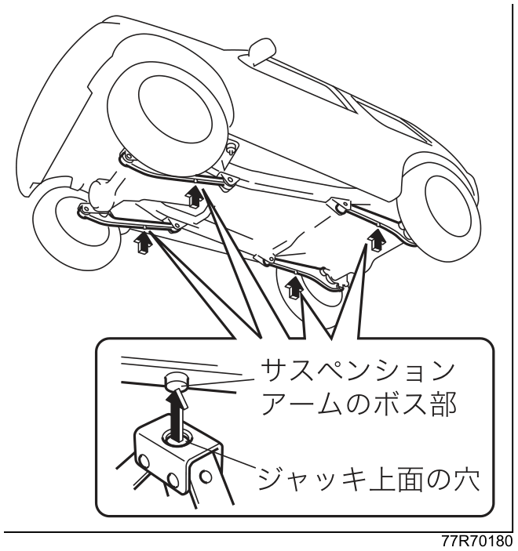{ .center-image }

2. Слегка покачайте верхнюю часть домкрата и убедитесь, что отверстие в верхней части домкрата вошло в выступ на рычаге подвески.
3. Установите рукоятку домкрата на домкрат, как показано на следующем рисунке.

4. Вращая рукоятку домкрата (1), осторожно поднимайте автомобиль, пока колесо слегка не оторвётся от земли.

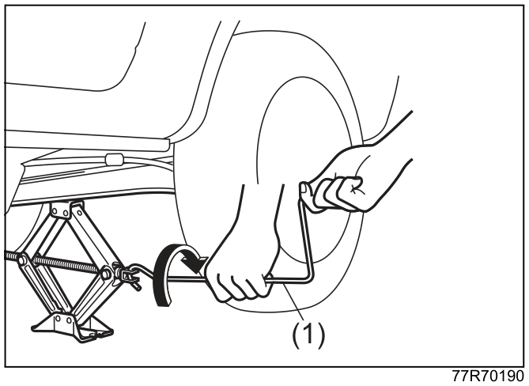{ .center-image }

| Обозначение | Описание |
| --- | --- |
| (1) | Рукоятка домкрата |

На рисунке показан типовой пример. В зависимости от типа автомобиля вид может отличаться.

#### При использовании гаражного домкрата

Указанные места установки гаражного домкрата и жёстких опор, приобретаемых отдельно, показаны на рисунке. За подробной информацией обратитесь к дилеру Suzuki или в авторизованный сервис Suzuki.

На рисунке показан типовой пример. В зависимости от типа автомобиля вид может отличаться.

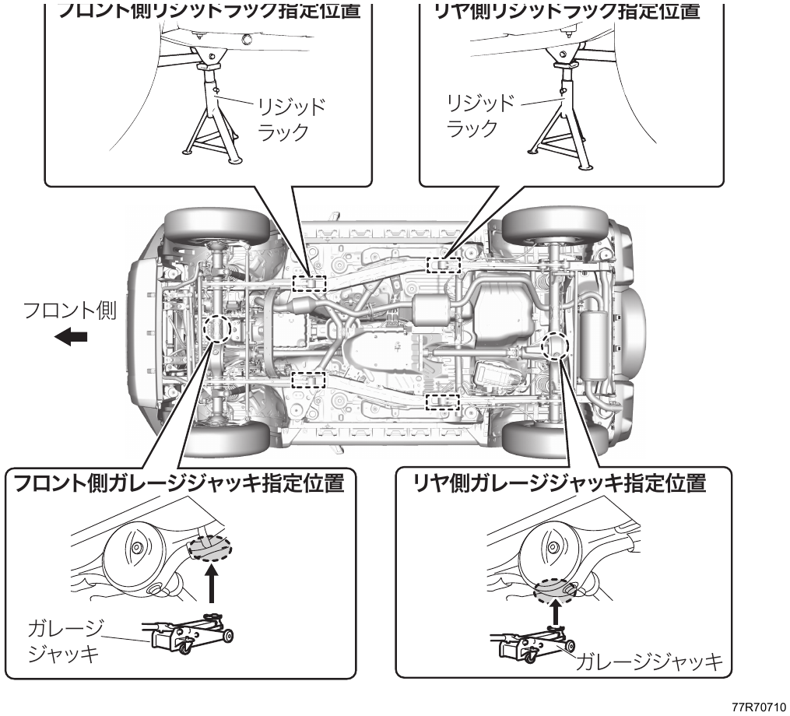{ .center-image }

!!! danger "Внимание"
    Чтобы не повредить автомобиль и не допустить неожиданной аварии, соблюдайте следующие требования.

    - Всегда устанавливайте гаражный домкрат в указанные на рисунке места.
    - Если нужно удерживать поднятый автомобиль, обязательно переставьте его на жёсткие опоры.
    - Если поднимаете только переднюю или только заднюю часть автомобиля, обязательно установите противооткатные упоры, приобретаемые отдельно, спереди и сзади колёс, остающихся на земле.

### Снятие и установка колеса

1. Отверните колёсные гайки и снимите колесо. Снятое колесо положите под кузов.

!!! warning "Осторожно"
    Сразу после движения колёса, колёсные гайки и детали тормозной системы могут быть горячими. Чтобы не получить ожог, не прикасайтесь к ним сразу после остановки.

!!! tip "Подсказка"
    Если кладёте колесо на землю лицевой стороной диска вверх, диск будет труднее поцарапать.

2. При замене заднего колеса на Jimny переставьте центральный колпак (1).

    | Операция | Действие |
    | --- | --- |
    | Снятие | Нажмите на колпак со стороны внутренней поверхности колеса и вытолкните его наружу. |
    | Установка | Вставьте колпак со стороны внутренней поверхности колеса и вдавите его на место. |

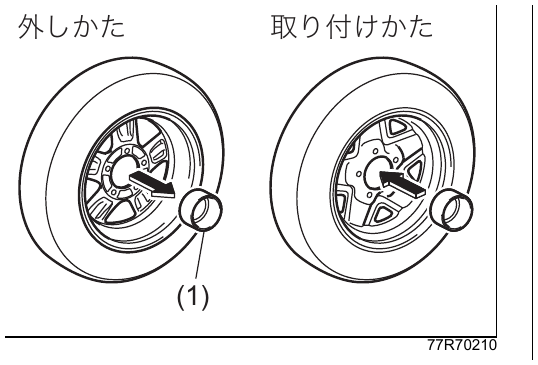{ .center-image }

| Обозначение | Описание |
| --- | --- |
| (1) | Центральный колпак |

На рисунке показан типовой пример. В зависимости от типа автомобиля вид может отличаться.

3. Удалите грязь и посторонние предметы со следующих мест:

    - привалочная поверхность устанавливаемого колеса (2);
    - привалочная поверхность со стороны автомобиля, поверхность ступицы (3);
    - резьбовая часть шпилек и колёсных гаек (4);
    - коническая поверхность колёсной гайки (5);
    - коническая поверхность отверстия колеса (6).

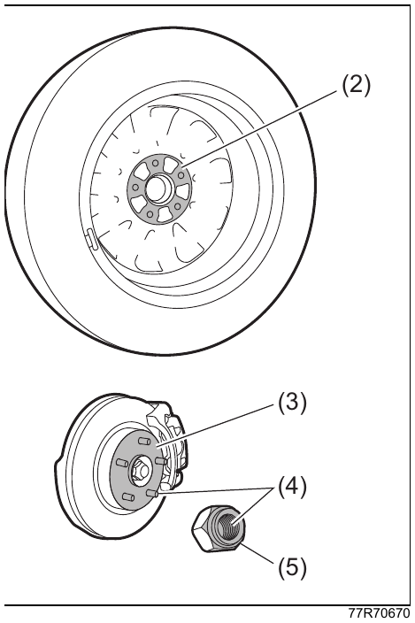{ .center-image }

| Обозначение | Описание |
| --- | --- |
| (2) | Привалочная поверхность устанавливаемого колеса |
| (3) | Привалочная поверхность со стороны автомобиля, поверхность ступицы |
| (4) | Резьбовая часть шпилек и колёсных гаек |
| (5) | Коническая поверхность колёсной гайки |
| (6) | Коническая поверхность отверстия колеса |

На рисунке показан типовой пример. В зависимости от типа автомобиля вид может отличаться.

Если на резьбе шпилек или гаек, а также в отверстиях колеса есть замятия, трещины или другие повреждения, обратитесь для проверки к дилеру Suzuki или в авторизованный сервис Suzuki.

!!! danger "Внимание"
    Если на указанных выше поверхностях останутся грязь, посторонние предметы, замятия или трещины, во время движения колёсные гайки могут ослабнуть.

    Не наносите масло или смазку на гайки и шпильки. Гайки можно затянуть сильнее нормы, из-за чего шпильки могут сломаться.

4. Заворачивайте колёсные гайки рукой по часовой стрелке, пока коническая поверхность гайки (5) слегка не коснётся конической поверхности отверстия колеса (6).

Автомобили со стальными колёсами:

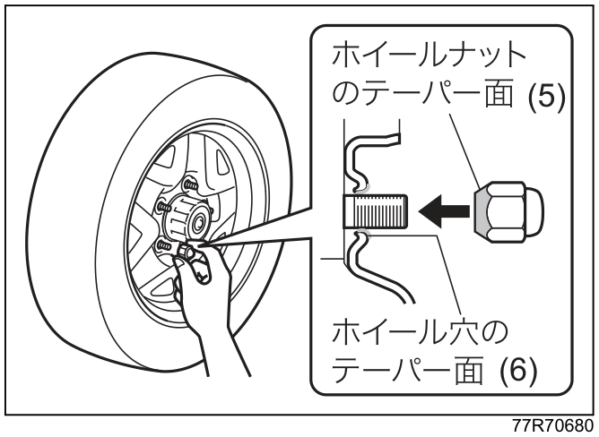{ .center-image }

Автомобили с алюминиевыми колёсами:

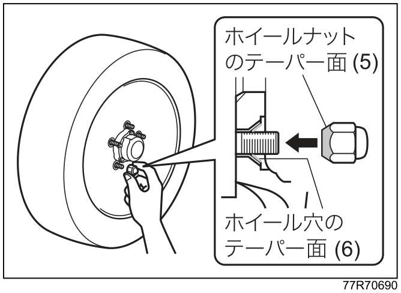{ .center-image }

На рисунках показаны типовые примеры. В зависимости от типа автомобиля вид может отличаться.

5. Уберите колесо, лежащее под кузовом, и опустите домкрат, пока установленное колесо не коснётся земли.

6. Колёсным ключом затяните колёсные гайки в показанной на рисунке последовательности, выполняя затяжку за 2-3 прохода.

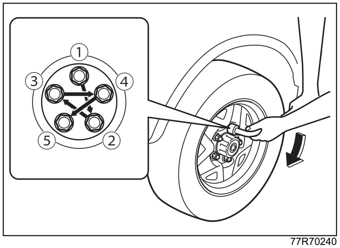{ .center-image }

Момент затяжки: 100 Н·м (1020 кгс·см)

Ориентировочное усилие на конце рукоятки колёсного ключа: 390 Н (40 кгс).

Убедитесь, что все колёсные гайки надёжно затянуты.

!!! danger "Внимание"
    Если колёсные гайки затянуты ненадёжно, шпильки и детали тормозной системы могут быть повреждены, а колесо может отсоединиться во время движения. Это может привести к неожиданной аварии. Если колесо заменяли без динамометрического ключа, приобретаемого отдельно, как можно скорее обратитесь к дилеру Suzuki или в авторизованный сервис Suzuki для проверки момента затяжки.

    Не вставайте на колёсный ключ ногой и не удлиняйте его трубой или другим предметом. Гайки можно затянуть сильнее нормы, из-за чего шпильки могут быть повреждены, а это может привести к неожиданной аварии.

!!! tip "Подсказка"
    Для затяжки с указанным моментом рекомендуется использовать динамометрический ключ, приобретаемый отдельно.

#### После замены колеса

- Уберите инструмент и домкрат в предусмотренные места хранения.
- На автомобилях Jimny со стальными колёсами и на Jimny Sierra установите колесо с проколотой шиной на держатель запасного колеса.
- На автомобилях Jimny с алюминиевыми колёсами штатное колесо с проколотой шиной нельзя установить на держатель запасного колеса. Временно разместите его в багажном отделении.
- После небольшого пробега после замены колеса проверьте, не ослабли ли колёсные гайки.
- На автомобилях с алюминиевыми колёсами примерно через 1000 км после замены колеса проверьте, не ослабли ли колёсные гайки.
- Если после замены колеса вы почувствуете необычную вибрацию кузова или другие отклонения, немедленно остановитесь в безопасном месте и обратитесь к дилеру Suzuki или в авторизованный сервис Suzuki.

## Разряд аккумулятора

### Что такое разряд свинцово-кислотной аккумуляторной батареи

Свинцово-кислотная аккумуляторная батарея разряжена в следующих случаях:

- при попытке запуска двигателя стартер не вращается либо вращается слишком медленно, и двигатель не запускается;
- фары светят очень тускло или звуковой сигнал звучит слабо.

### Если аккумуляторная батарея разряжена

Если есть пусковые провода и другой автомобиль с исправной 12-вольтовой аккумуляторной батареей, двигатель можно запустить от внешнего источника.

1. Подсоедините первый пусковой провод в порядке `1` -> `2`.

    | Порядок | Куда подсоединять |
    | --- | --- |
    | 1 | К положительной клемме автомобиля с разряженной батареей |
    | 2 | К положительной клемме автомобиля с исправной батареей |

    Jimny:

    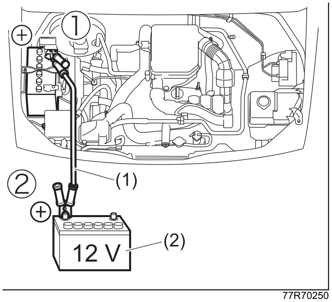{ .center-image }

    Jimny Sierra:

    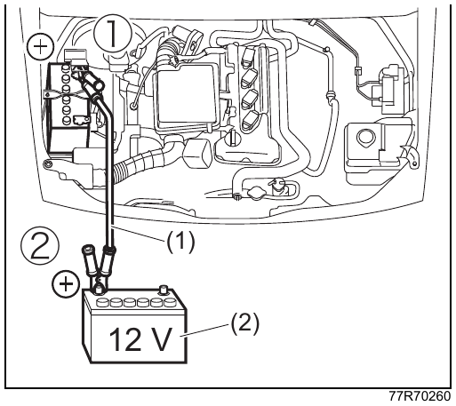{ .center-image }

    | Обозначение | Описание |
    | --- | --- |
    | (1) | Пусковой провод |
    | (2) | Аккумуляторная батарея исправного автомобиля |

2. Подсоедините второй пусковой провод в порядке `3` -> `4`.

    | Порядок | Куда подсоединять |
    | --- | --- |
    | 3 | К отрицательной клемме автомобиля с исправной батареей |
    | 4 | На автомобиле с разряженной батареей: у Jimny - к верхней части кронштейна генератора; у Jimny Sierra - к передней части головки блока цилиндров в верхней части двигателя. |

    Jimny:

    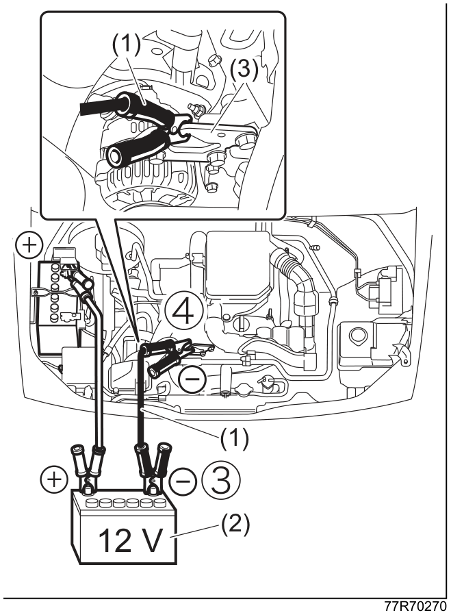{ .center-image }

    | Обозначение | Описание |
    | --- | --- |
    | (1) | Пусковой провод |
    | (2) | Аккумуляторная батарея исправного автомобиля |
    | (3) | Кронштейн генератора |

    Jimny Sierra:

    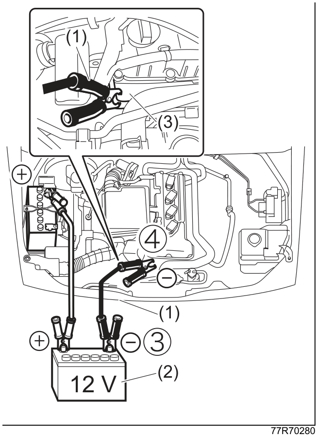{ .center-image }

    | Обозначение | Описание |
    | --- | --- |
    | (1) | Пусковой провод |
    | (2) | Аккумуляторная батарея исправного автомобиля |
    | (3) | Передняя часть головки блока цилиндров двигателя |

3. Запустите двигатель автомобиля с исправной батареей и поддерживайте немного повышенную частоту вращения двигателя.
4. Запустите двигатель автомобиля с разряженной батареей.
5. Отсоедините пусковые провода в порядке, обратном подключению.
6. Обратитесь к ближайшему дилеру Suzuki или в авторизованный сервис Suzuki, чтобы полностью зарядить аккумуляторную батарею.

!!! danger "Внимание"
    Свинцово-кислотная аккумуляторная батарея выделяет водород. При контакте с огнём или искрами водород может взорваться. Соблюдайте следующие требования.

    - Перед зарядкой батареи или подключением пусковых проводов обязательно проверьте уровень электролита. Если уровень электролита находится на нижней метке (2) или ниже, зарядка может привести к перегреву и взрыву батареи. Кроме того, срок службы батареи может сократиться. Перед зарядкой долейте жидкость для аккумуляторов до верхней метки (1).

      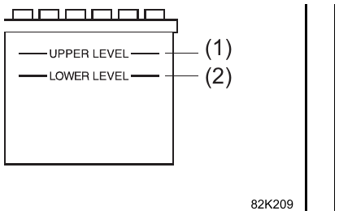{ .center-image }

      | Обозначение | Описание |
      | --- | --- |
      | (1) | Верхняя метка |
      | (2) | Нижняя метка |

    - Заряжайте батарею в хорошо проветриваемом месте, вдали от открытого огня. Перед зарядкой снимите все пробки батареи.
    - При подключении точки `4` не соединяйте провод с отрицательной клеммой автомобиля с разряженной батареей. Искра может воспламенить водород и вызвать взрыв. Подсоединяйте провод вдали от батареи: у Jimny - к верхней части кронштейна генератора; у Jimny Sierra - к передней части головки блока цилиндров в верхней части двигателя.
    - Не протирайте батарею сухой тканью. Статическое электричество может вызвать воспламенение.
    - Электролит батареи - разбавленная серная кислота. При попадании в глаза или на кожу он может привести к тяжёлым травмам, в том числе к потере зрения. Если электролит попал на тело, немедленно промойте место большим количеством чистой воды и обратитесь к врачу.

!!! warning "Осторожно"
    Надёжно подсоединяйте пусковые провода. Если при запуске двигателя провод отсоединится из-за вибрации, его может затянуть в приводной ремень или охлаждающий вентилятор.

    Чтобы предотвратить короткое замыкание, не допускайте контакта зажимов положительного провода с любыми частями, кроме положительных клемм аккумуляторных батарей. Не касайтесь ими отрицательных клемм, кузова, кронштейнов и других металлических деталей.

    Автомобиль с автоматической коробкой передач нельзя запускать толканием. Автомобиль с механической коробкой передач также не запускайте толканием из соображений безопасности.

### Как предотвратить разряд аккумуляторной батареи

- Не реже одного раза в месяц проезжайте непрерывно не менее 30 минут, чтобы батарея зарядилась.
- Не оставляйте фары включёнными при остановленном двигателе и не пользуйтесь аудиосистемой долгое время при остановленном двигателе.
- Если во время пробки или длительной стоянки двигатель долго работает на холостом ходу, по возможности избегайте использования электрооборудования.

См. также: [проверка уровня жидкости свинцово-кислотного аккумулятора](02-safety.md#проверяйте-уровень-жидкости-свинцово-кислотного-аккумулятора).

## Перегрев двигателя

### Что такое перегрев

Перегрев - это состояние, при котором система охлаждения, включая радиатор, не успевает охлаждать двигатель и не может поддерживать нормальную температуру охлаждающей жидкости.

Двигатель перегрелся в следующих случаях:

- из моторного отсека поднимается пар;
- мощность двигателя резко снизилась;
- температура охлаждающей жидкости двигателя стала чрезмерно высокой, и на панели приборов загорелась контрольная лампа температуры охлаждающей жидкости.

См. также: [контрольная лампа температуры охлаждающей жидкости](03-before-driving.md#контрольная-лампа-температуры-охлаждающей-жидкости-красная).

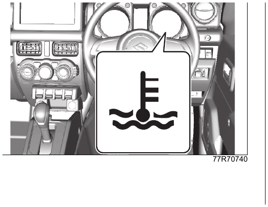{ .center-image }

### Если двигатель перегрелся

1. Остановите автомобиль в безопасном месте.

    При необходимости установите знак аварийной остановки, приобретаемый отдельно.

2. Оставьте двигатель работающим, откройте капот и улучшите вентиляцию моторного отсека.

    Если из моторного отсека поднимается пар, не открывайте капот и переходите к следующему шагу.

    См. также: [капот](05-equipment.md#капот).

!!! danger "Внимание"
    Если из моторного отсека поднимается пар, не открывайте капот. Пар или горячая вода могут вырваться наружу и вызвать ожоги.

3. Проверьте работу охлаждающего вентилятора радиатора. Дождитесь, пока контрольная лампа температуры охлаждающей жидкости погаснет, и остановите двигатель.

    Если охлаждающий вентилятор радиатора не работает или контрольная лампа температуры охлаждающей жидкости не гаснет, немедленно остановите двигатель и обратитесь к дилеру Suzuki или в авторизованный сервис Suzuki.

4. После того как двигатель достаточно остынет, проверьте уровень охлаждающей жидкости и наличие утечек из шлангов и других мест.

!!! danger "Внимание"
    Снимайте крышку радиатора только после того, как двигатель достаточно остынет. Если двигатель горячий, охлаждающая жидкость находится под давлением, поэтому пар или горячая вода могут вырваться наружу и вызвать ожоги.

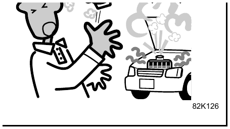{ .center-image }

5. Если уровень охлаждающей жидкости недостаточный, долейте жидкость.

    - При наличии утечки или другой неисправности обратитесь к дилеру Suzuki или в авторизованный сервис Suzuki.
    - Если охлаждающей жидкости нет и пришлось временно долить только воду, как можно скорее обратитесь к дилеру Suzuki или в авторизованный сервис Suzuki для проверки или замены охлаждающей жидкости.

## Перегоревший предохранитель

### Если перегорел предохранитель

Если электрооборудование не работает или лампа не загорается при исправной лампе накаливания, возможен перегоревший предохранитель.

- Предохранители расположены в моторном отсеке и в ногах переднего пассажира, внутри панели приборов.
- В зависимости от комплектации предохранитель может отсутствовать в указанном месте. Также предохранитель может быть установлен, даже если соответствующего оборудования нет.

#### Предохранители в моторном отсеке

Jimny:

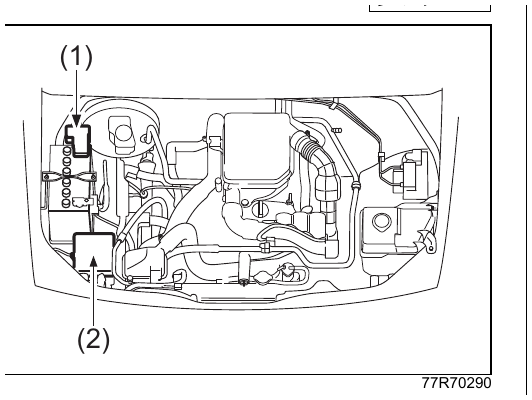{ .center-image }

Jimny Sierra:

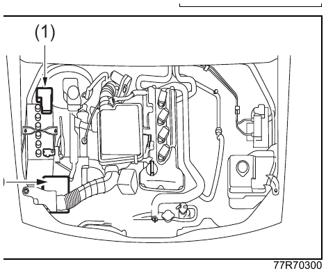{ .center-image }

| Обозначение | Описание |
| --- | --- |
| (1) | Главный блок предохранителей |
| (2) | Блок реле |

#### Предохранители в блоке реле

Таблица предохранителей находится на внутренней стороне крышки блока.

Чтобы снять блок реле, сначала отсоедините фиксатор (3) со стороны наружного борта автомобиля, затем слегка приподнимите крышку блока и снимите её, потянув внутрь.

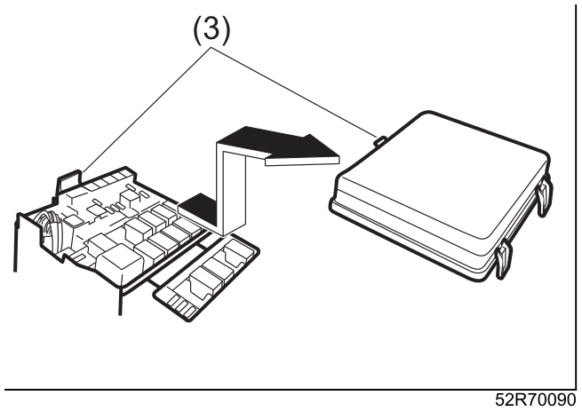{ .center-image }

| Обозначение | Описание |
| --- | --- |
| (3) | Фиксатор |

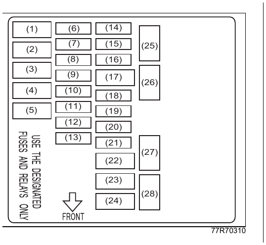{ .center-image }

В таблице указано основное оборудование, за которое отвечает каждый предохранитель.

| Позиция | Маркировка | Номинал | Назначение |
| --- | --- | --- | --- |
| 1 | IGN | 50 A | Выключатель двигателя |
| 2 | ABS MOT | 40 A | Электродвигатель ABS |
| 3 | - | - | - |
| 4 | BLW | 30 A | Вентилятор отопителя и вентиляции |
| 5 | ST | 30 A | Стартер |
| 6 | H/L CLNR | 30 A | Омыватель фар |
| 7 | H/L R | 15 A | Правая фара |
| 8 | H/L L | 15 A | Левая фара |
| 9 | ABS SOL | 25 A | Соленоид ABS |
| 10 | DCDC1 | 30 A | Преобразователь постоянного тока № 1 |
| 11 | IG COIL | 15 A / 20 A (3) | Катушка зажигания |
| 12 | H/L HI | 25 A | Фары |
| 13 | B/U | 30 A | Резервное питание |
| 14 | DCDC2 | 30 A | Преобразователь постоянного тока № 2 |
| 15 | FI | 15 A | Система впрыска топлива |
| 16 | T/M | 15 A | - |
| 17 | IGN2 | 50 A | Выключатель двигателя |
| 18 | CPRSR | 10 A | Компрессор |
| 19 | 4WD | 10 A | Система полного привода |
| 20 | FR FOG | 20 A | Противотуманные фары |
| 21 | - | - | - |
| 22 | P/S | 40 A | Усилитель рулевого управления |
| 23 | RDTR | 30 A | Вентилятор радиатора (1) |
| 24 | RDTR | 40 A | Вентилятор радиатора (2) |
| 25 | T/M2 | 15 A | Трансмиссия |
| 26 | ST SIG | 5 A | Контроллер двигателя |
| 27 | H/L HI L | 15 A | Левая фара дальнего света |
| 28 | H/L HI R | 15 A | Правая фара дальнего света |

(1) Jimny. (2) Jimny Sierra. (3) Jimny с механической коробкой передач.

#### Предохранители в ногах переднего пассажира

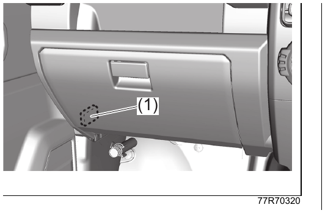{ .center-image }

| Обозначение | Описание |
| --- | --- |
| (1) | Предохранители в ногах переднего пассажира |

Таблица предохранителей находится на крышке блока предохранителей.

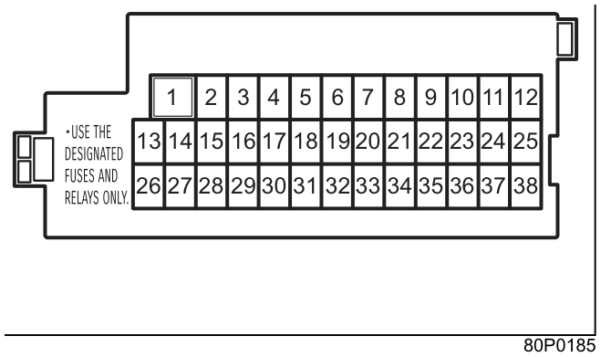{ .center-image }

В таблице указано основное оборудование, за которое отвечает каждый предохранитель.

| Позиция | Маркировка | Номинал | Назначение |
| --- | --- | --- | --- |
| 1 | P/W | 30 A | Электростеклоподъёмники |
| 2 | MTR | 10 A | Комбинация приборов |
| 3 | IG | 15 A | Зажигание |
| 4 | IG1 SIG2 | 5 A | Усилитель рулевого управления |
| 5 | SHIFT | 20 A | - |
| 6 | CHG | 10 A | - |
| 7 | STL2 | 10 A | Блокировка рулевого управления |
| 8 | D/L | 20 A | Замки дверей |
| 9 | STL | 15 A | Блокировка рулевого управления |
| 10 | HAZ | 10 A | Аварийная сигнализация |
| 11 | A-STOP | 5 A | - |
| 12 | RR FOG | 10 A | - |
| 13 | ABS | 5 A | ABS/ESP® |
| 14 | S/H | 15 A | Подогрев сидений |
| 15 | IG1 SIG3 | 5 A | - |
| 16 | DOME2 | 10 A | Освещение салона |
| 17 | DOME | 5 A | Комбинация приборов |
| 18 | RADIO | 15 A | Радио |
| 19 | CONT | 5 A | Контроллер шлюза |
| 20 | KEY2 | 5 A | Выключатель двигателя |
| 21 | P/W T | 20 A | Таймер электростеклоподъёмников |
| 22 | KEY | 5 A | Выключатель двигателя |
| 23 | HORN | 15 A | Звуковой сигнал |
| 24 | TAIL L | 5 A | Левый задний габаритный фонарь |
| 25 | TAIL | 10 A | Правый задний габаритный фонарь |
| 26 | A/B | 10 A | Подушки безопасности SRS |
| 27 | IG1 SIG | 10 A | BCM |
| 28 | BACK | 10 A | Фонарь заднего хода |
| 29 | ACC3 | 5 A | Радио |
| 30 | RR DEF | 20 A | Обогрев заднего стекла |
| 31 | MRR HTR | 10 A | Обогрев зеркал |
| 32 | ACC2 | 15 A | Розетка электропитания |
| 33 | ACC | 5 A | Преобразователь постоянного тока |
| 34 | WIP | 10 A | Задний стеклоочиститель |
| 35 | IG2 SIG | 5 A | Вентилятор отопителя и вентиляции |
| 36 | WASH | 15 A | Электродвигатель омывателя |
| 37 | FR WIP | 25 A | Передний стеклоочиститель |
| 38 | STOP | 10 A | Стоп-сигналы |

!!! info "Примечание"
    Если снимали или заменяли предохранитель `P/W T`, выполните инициализацию защиты от защемления.

    См. также: [инициализация защиты от защемления](03-before-driving.md#инициализация-защиты-от-защемления).

#### Предохранители в ногах водителя

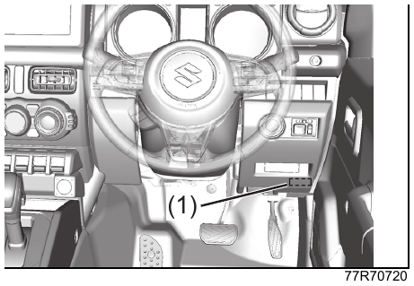{ .center-image }

| Обозначение | Описание |
| --- | --- |
| (1) | Предохранители в ногах водителя |

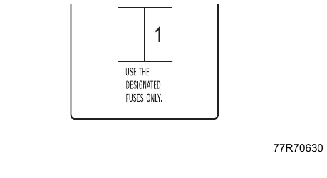{ .center-image }

В таблице указано основное оборудование, за которое отвечает предохранитель.

| Позиция | Маркировка | Номинал | Назначение |
| --- | --- | --- | --- |
| 1 | IG1 SIG4 | 10 A | DSBS II |

### Проверка и замена предохранителя

Для проверки и замены предохранителей требуется съёмник для низкопрофильных предохранителей, приобретаемый отдельно, и запасные предохранители, приобретаемые отдельно. По вопросам проверки и замены обратитесь к дилеру Suzuki или в авторизованный сервис Suzuki.

#### Порядок проверки и замены

1. Переведите выключатель двигателя в положение `LOCK (OFF)`.
2. Если проверяете предохранители в блоке реле моторного отсека, снимите крышку блока.
3. По признакам неисправности определите по таблице предохранитель, который нужно проверить. Вставьте съёмник в предохранитель, вытяните предохранитель и проверьте, не перегорел ли он.
4. Если предохранитель перегорел, замените его предохранителем такого же номинала.

    Если заменённый предохранитель сразу перегорает снова, возможна неисправность электрической системы. Обратитесь для проверки к дилеру Suzuki или в авторизованный сервис Suzuki.

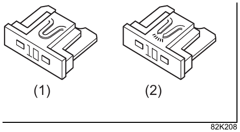{ .center-image }

| Обозначение | Описание |
| --- | --- |
| (1) | Пример исправного предохранителя |
| (2) | Пример перегоревшего предохранителя |

!!! danger "Внимание"
    Заменяйте предохранитель только предохранителем такого же размера и такого же номинала. Если использовать предохранитель другого размера, предохранитель большего номинала, проволоку, фольгу и подобные предметы, проводка может перегореть или может возникнуть пожар.

## Перегоревшая лампа

### Проверка ламп

Включите или заставьте мигать фары, фонари, указатели поворота и аварийную сигнализацию, чтобы проверить, нет ли перегоревших ламп.

!!! tip "Подсказка"
    - Стоп-сигналы проверяйте с помощником или по отражению от стены.
    - Если индикатор указателей поворота на панели приборов начал мигать необычно быстро, возможно, перегорела лампа указателя поворота или аварийной сигнализации.

### Помутнение внутренней поверхности рассеивателей фар и фонарей

После движения в дождь или мойки автомобиля внутренняя поверхность рассеивателей фар, задних комбинированных фонарей и других световых приборов может запотевать или покрываться конденсатом. Это временное явление, возникающее из-за разницы температур внутри и снаружи фонаря, как запотевание окон в дождливую погоду.

Также на кромке рассеивателя могут появляться капли воды, из-за чего кажется, что вода попала внутрь фонаря. Это временное явление, вызванное водой на внешней поверхности фонаря.

Такие явления не влияют на работу световых приборов.

Если внутри фонаря скапливается вода или на внутренней поверхности рассеивателя есть крупные капли воды, обратитесь к дилеру Suzuki или в авторизованный сервис Suzuki.

### При замене лампы

Если лампа перегорела, замените её лампой той же мощности и того же типа.

Сведения о мощности и типе ламп см. в разделе [мощность ламп](#мощность-ламп).

Если после замены лампа не загорается или сразу перегорает снова, возможна неисправность электрической системы. Обратитесь для проверки к дилеру Suzuki или в авторизованный сервис Suzuki.

#### Расположение ламп

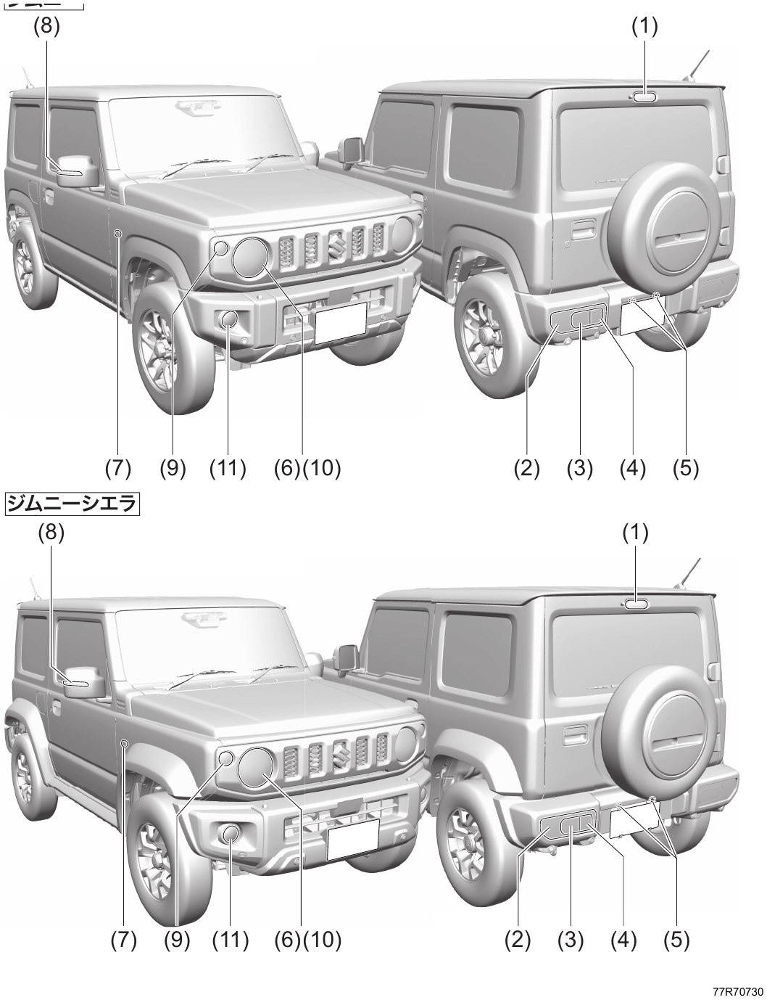{ .center-image }

В зависимости от типа автомобиля на рисунке может быть показано оборудование, отсутствующее на вашем автомобиле.

#### Мощность ламп

| Номер | Наименование | Мощность и тип |
| --- | --- | --- |
| (1) | Верхний стоп-сигнал | LED (1) |
| (2) | Стоп-сигнал / задний габаритный фонарь | 21 W / 5 W (W21/5W) (2) |
| (3) | Задний указатель поворота / аварийная сигнализация | 21 W (WY21W) (2) |
| (4) | Фонарь заднего хода | 21 W (W21W) (2) |
| (5) | Фонарь освещения номерного знака | 5 W (W5W) (2) |
| (6) | Фара, автомобиль с галогенными фарами | 60/55 W (H4) |
| (6) | Фара, автомобиль со светодиодными фарами | LED (1) |
| (7) | Боковой указатель поворота / аварийная сигнализация, крыло | 5 W (1) |
| (8) | Боковой указатель поворота / аварийная сигнализация, наружное зеркало | LED (1) |
| (9) | Передний указатель поворота / аварийная сигнализация | 21 W (W21W) (2) |
| (10) | Габаритный фонарь, автомобиль с галогенными фарами | 5 W (W5W) (2) |
| (10) | Габаритный фонарь, автомобиль со светодиодными фарами | LED (1) |
| (11) | Передняя противотуманная фара | 19 W (H16) |

(1) Неразборный световой прибор: заменить только лампу нельзя, заменяется световой прибор в сборе. Для проверки и замены обратитесь к дилеру Suzuki или в авторизованный сервис Suzuki.

(2) Лампа с клиновым цоколем.

!!! warning "Осторожно"
    При замене лампы соблюдайте следующие требования. Иначе возможна неожиданная авария, ожог или травма.

    - Остановите автомобиль в безопасном ровном месте и надёжно затяните стояночный тормоз.
    - Остановите двигатель, выключите все световые приборы и приступайте к работе только после того, как двигатель, выпускная система и лампы достаточно остынут. Иначе можно получить ожог.
    - Галогенные лампы заполнены газом под высоким давлением, поэтому обращайтесь с ними особенно осторожно. Если лампа разобьётся, осколки стекла могут разлететься и травмировать вас.
    - Чтобы не поранить руки или предплечья о детали автомобиля, надевайте одежду с длинными рукавами и перчатки.

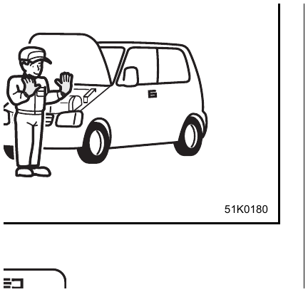{ .center-image }

!!! info "Примечание"
    При работе с галогенной лампой надевайте чистые перчатки без следов масла и смазки. Во время работы лампа сильно нагревается. Если держать её голыми руками и оставить на стекле масло или другие загрязнения, лампа может преждевременно перегореть из-за перегрева.

#### Неразборные световые приборы

Следующие световые приборы неразборные, поэтому заменить только лампу нельзя. Заменяется световой прибор в сборе. Для проверки и замены обратитесь к дилеру Suzuki или в авторизованный сервис Suzuki.

- светодиодные фары;
- габаритные фонари на автомобилях со светодиодными фарами;
- указатели поворота / аварийная сигнализация на крыльях или наружных зеркалах;
- верхний стоп-сигнал;
- передний плафон и плафон багажного отделения.

#### Галогенная фара

!!! tip "Оборудование по типу автомобиля"
    Для автомобилей с галогенными фарами.

1. Откройте капот.

    См. также: [капот](05-equipment.md#капот).

2. Снимите разъём (1), крепко взявшись за корпус разъёма и потянув его прямо назад по направлению к задней части автомобиля. Снимите резиновый кожух (2), потянув за язычок (3).

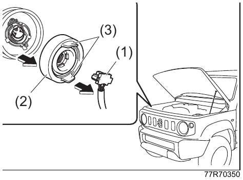{ .center-image }

| Обозначение | Описание |
| --- | --- |
| (1) | Разъём |
| (2) | Резиновый кожух |
| (3) | Язычок |

3. Нажимая на пружинный фиксатор (4), сдвиньте его в направлении стрелки и снимите с удерживающего крючка (5).

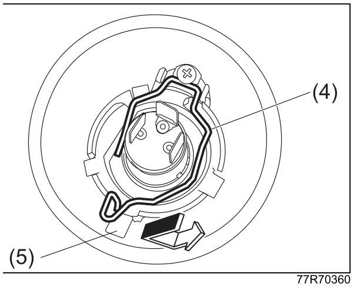{ .center-image }

| Обозначение | Описание |
| --- | --- |
| (4) | Пружинный фиксатор |
| (5) | Удерживающий крючок |

!!! tip "Подсказка"
    Положение пружинного фиксатора можно также проверить спереди автомобиля через отверстие (6) рядом с лампой.

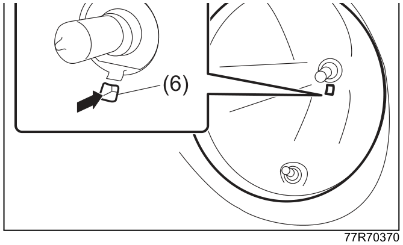{ .center-image }

| Обозначение | Описание |
| --- | --- |
| (6) | Проверочное отверстие |

4. Снимите лампу. После замены установите детали в порядке, обратном снятию.

#### Передняя противотуманная фара

!!! tip "Оборудование по типу автомобиля"
    Для автомобилей с передними противотуманными фарами.

1. Освободите место для замены.

    - Запустите двигатель и поверните рулевое колесо до упора в ту же сторону, где находится заменяемая лампа.
    - Остановите двигатель.

2. Частично снимите подкрылок.

    Три фиксатора (1) подкрылка снимите плоской отвёрткой, приобретаемой отдельно.

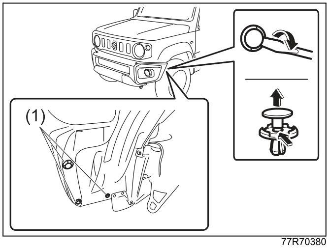{ .center-image }

| Обозначение | Описание |
| --- | --- |
| (1) | Фиксатор |

3. Отогните подкрылок и изнутри снимите лампу, затем замените её новой.

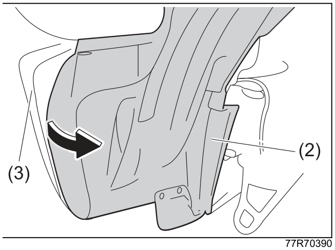{ .center-image }

| Обозначение | Описание |
| --- | --- |
| (2) | Подкрылок |
| (3) | Бампер |

    - Снимите разъём (4), нажимая на фиксатор.
    - После снятия разъёма поверните лампу с патроном в сборе (5) против часовой стрелки и снимите её.

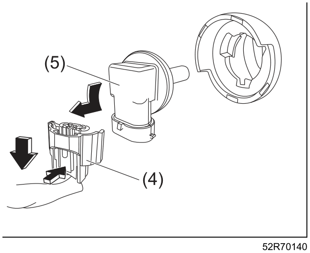{ .center-image }

| Обозначение | Описание |
| --- | --- |
| (4) | Разъём |
| (5) | Лампа с патроном в сборе |

4. После замены установите детали в порядке, обратном снятию.

    Подкрылок заведите на внутреннюю сторону бампера.

#### Габаритный фонарь

##### Автомобили с галогенными фарами

1. Откройте капот и замените лампу со стороны моторного отсека.

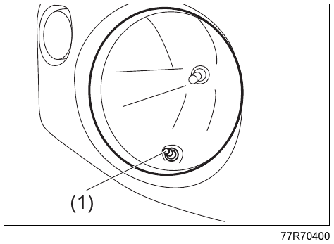{ .center-image }

| Обозначение | Описание |
| --- | --- |
| (1) | Габаритный фонарь |

2. Поверните лампу с патроном в сборе (2) против часовой стрелки и снимите её.

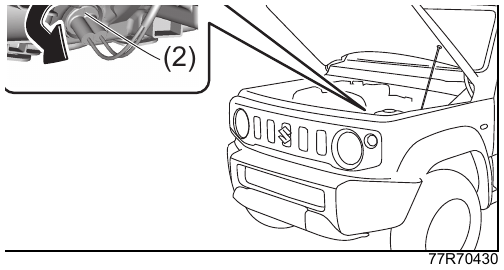{ .center-image }

| Обозначение | Описание |
| --- | --- |
| (2) | Лампа с патроном в сборе |

3. Снимайте и устанавливайте лампу, как показано на рисунке.

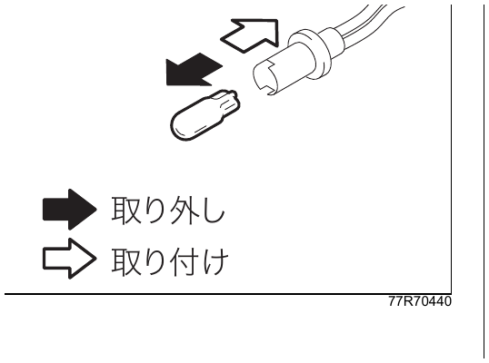{ .center-image }

4. После замены установите детали в порядке, обратном снятию.

#### Передний указатель поворота / аварийная сигнализация {#передний-указатель-поворота-аварийная-сигнализация}

1. Откройте капот и замените лампу со стороны моторного отсека.

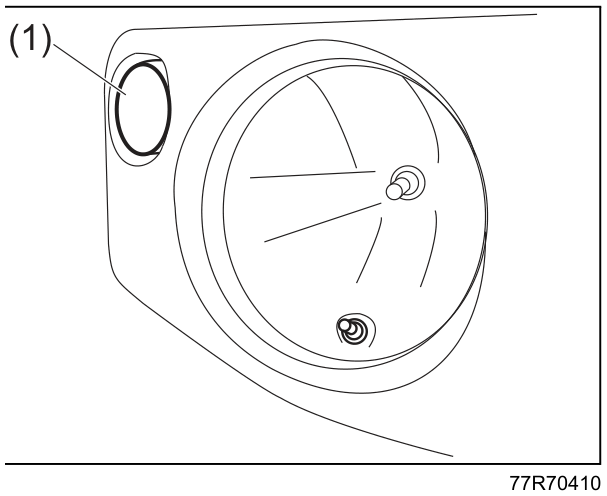{ .center-image }

| Обозначение | Описание |
| --- | --- |
| (1) | Передний указатель поворота / аварийная сигнализация |

2. Снимите разъём (2), нажимая на фиксатор. После снятия разъёма поверните лампу с патроном в сборе (3) против часовой стрелки и снимите её.

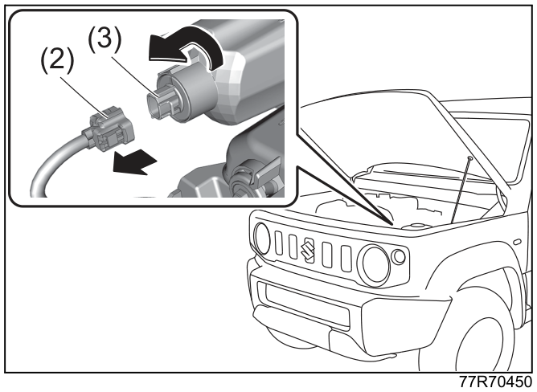{ .center-image }

| Обозначение | Описание |
| --- | --- |
| (2) | Разъём |
| (3) | Лампа с патроном в сборе |

3. Снимайте и устанавливайте лампу, как показано на рисунке.

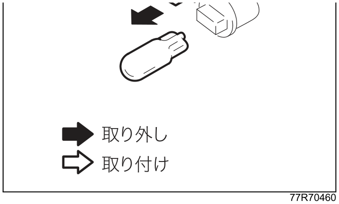{ .center-image }

4. После замены установите детали в порядке, обратном снятию.

#### Задний комбинированный фонарь

1. Снимите четыре фиксатора (1), расположенные за задним бампером, плоской отвёрткой или другим подходящим инструментом, приобретаемым отдельно. Затем снимите крышку (2).

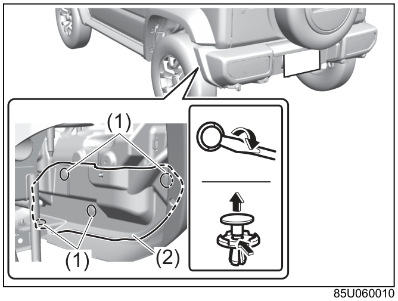{ .center-image }

| Обозначение | Описание |
| --- | --- |
| (1) | Фиксатор |
| (2) | Крышка |

2. Снимите три гайки (3) гаечным ключом или другим подходящим инструментом, приобретаемым отдельно. Затем, нажимая на фиксаторы (a) в направлении стрелок, потяните корпус фонаря прямо назад и снимите его.

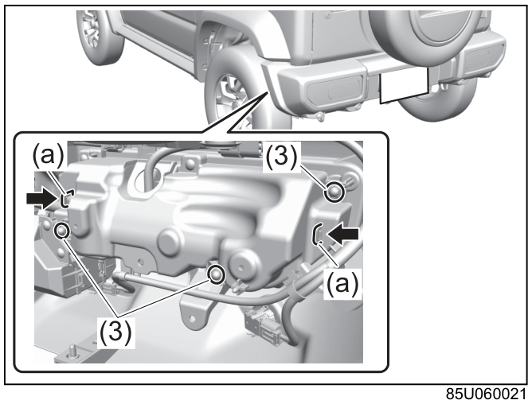{ .center-image }

| Обозначение | Описание |
| --- | --- |
| (3) | Гайка |
| (a) | Фиксатор |

3. Поверните лампу с патроном в сборе (3) против часовой стрелки и снимите её.

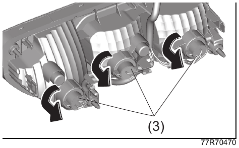{ .center-image }

| Обозначение | Описание |
| --- | --- |
| (3) | Лампа с патроном в сборе |

4. Снимайте и устанавливайте лампу, как показано на рисунке.

{ .center-image }

5. После замены установите детали в порядке, обратном снятию.

#### Фонарь освещения номерного знака

1. Поверните рассеиватель (1) против часовой стрелки и снимите его, затем замените лампу.

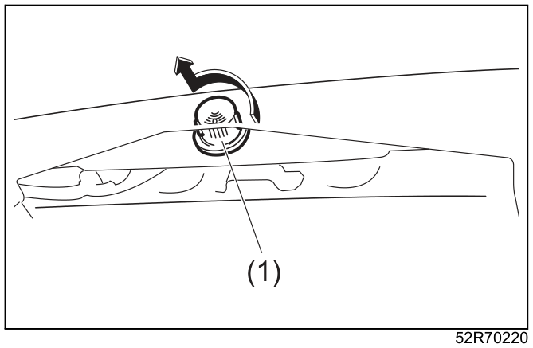{ .center-image }

| Обозначение | Описание |
| --- | --- |
| (1) | Рассеиватель |

2. Снимайте и устанавливайте лампу, как показано на рисунке.

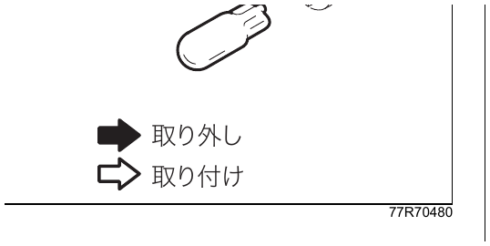{ .center-image }

3. После замены установите детали в порядке, обратном снятию.
