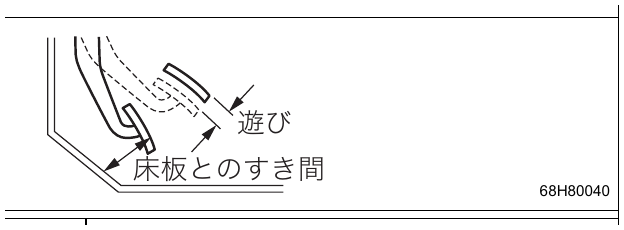
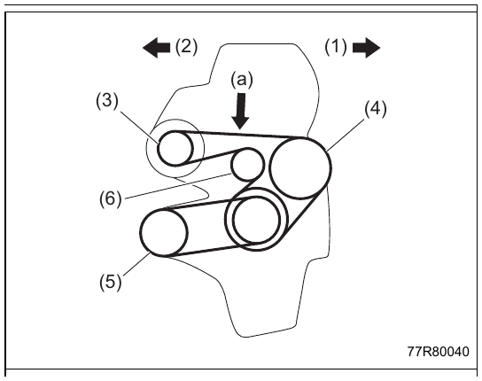
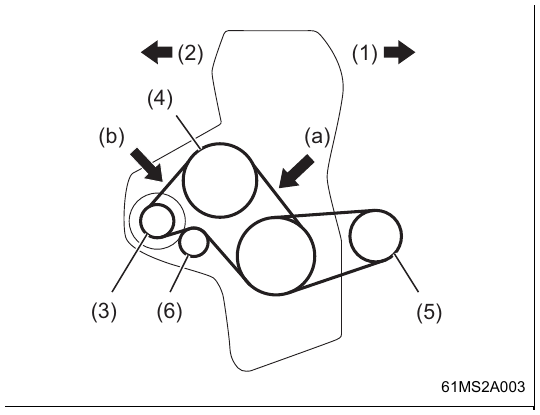
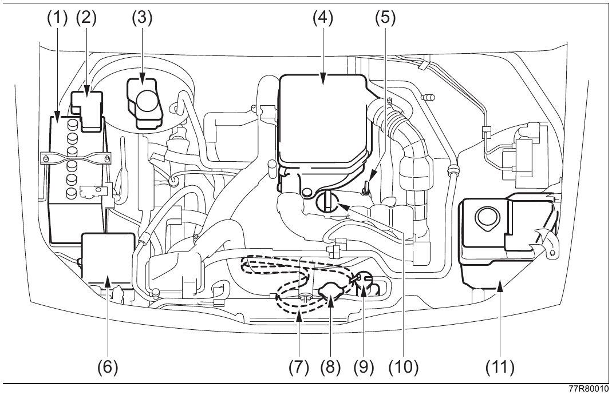
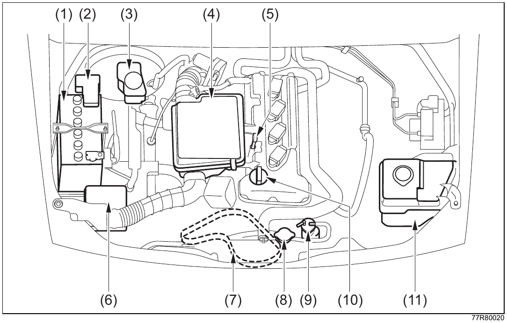
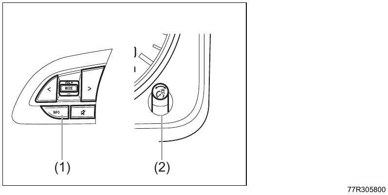

# 8. Сервисные данные

## Структура главы

| Раздел | Страница |
| --- | --- |
| [Сервисные данные](#сервисные-данные) | 8-1 |
| [Загляните в моторный отсек](#загляните-в-моторный-отсек) | 8-6 |
| [Функции, которые необходимо инициализировать](#функции-которые-необходимо-инициализировать) | 8-8 |
| [Настраиваемые функции](#настраиваемые-функции) | 8-8 |
| [Режим настроек](#режим-настроек) | 8-9 |
| [Список пунктов режима настроек](#список-пунктов-режима-настроек) | 8-10 |

## Сервисные данные

!!! info "Примечание"
    Указанные в таблицах объёмы являются ориентировочными. Фактический объём при замене может отличаться.

### Топливо, масла и рабочие жидкости

| Узел | Параметр | Значение |
| --- | --- | --- |
| Топливо | Тип топлива | Неэтилированный регулярный бензин |
| Топливный бак | Вместимость | 40 л |
| Моторное масло | Рекомендуемая марка для Jimny | Suzuki ECSTAR F SN 5W-30 Suzuki ECSTAR F SN 5W-30 S |
| Моторное масло | Рекомендуемая марка для Jimny Sierra | Suzuki ECSTAR F SN 0W-16 Plus Suzuki ECSTAR F SN 0W-20 Suzuki ECSTAR F SN 5W-30 Suzuki ECSTAR F SN 5W-30 S |
| Моторное масло | Объём при замене масла, Jimny | 2,6 л |
| Моторное масло | Объём при замене масла и фильтра, Jimny | 2,8 л |
| Моторное масло | Объём при замене масла, Jimny Sierra | 3,4 л |
| Моторное масло | Объём при замене масла и фильтра, Jimny Sierra | 3,6 л |
| Механическая коробка передач | Масло | Suzuki 4 Wheel Gear Oil 75W Synthetic |
| Механическая коробка передач | Объём | 1,2 л |
| Автоматическая коробка передач | Рабочая жидкость | Suzuki ATF 3317 |
| Автоматическая коробка передач | Объём, Jimny | 5,4 л |
| Автоматическая коробка передач | Объём, Jimny Sierra | 5,7 л |
| Раздаточная коробка | Масло | Suzuki 4 Wheel Gear Oil 75W Synthetic |
| Раздаточная коробка | Объём | 1,21 л |
| Дифференциалы | Масло | Suzuki 4 Wheel Super Gear Oil 75W-85 Synthetic |
| Передний дифференциал | Объём | 1,6 л |
| Задний дифференциал | Объём | 1,3 л |

См. также: [спецификация и вязкость моторного масла](02-safety.md#спецификация-и-вязкость-моторного-масла). Для Jimny Sierra масло 0W-16 относится к маслам с улучшенными показателями расхода топлива.

Периодичность замены масел и рабочих жидкостей, а также стандартную концентрацию охлаждающей жидкости смотрите в сервисной книжке.

!!! warning "Осторожно"
    Не используйте рабочую жидкость автоматической коробки передач, трансмиссионное масло или тормозную жидкость, не указанные в таблицах. Неподходящая жидкость или масло могут привести к неисправности коробки передач. Для доливки или замены обратитесь к дилеру Suzuki или в авторизованный сервис Suzuki.

### Охлаждающая жидкость, омыватель и тормозная жидкость

| Узел | Параметр | Значение |
| --- | --- | --- |
| Система охлаждения | Охлаждающая жидкость | Оригинальная охлаждающая жидкость Suzuki Super Long Life Coolant, синяя |
| Система охлаждения | Объём, Jimny с механической коробкой передач | 4,8 л |
| Система охлаждения | Объём, Jimny с автоматической коробкой передач | 4,6 л |
| Система охлаждения | Объём, Jimny Sierra с механической коробкой передач | 4,8 л |
| Система охлаждения | Объём, Jimny Sierra с автоматической коробкой передач | 4,8 л |
| Омыватель стекла | Жидкость | Suzuki ECSTAR Window Washer Fluid |
| Омыватель стекла | Вместимость бачка | 4,0 л |
| Тормозная система | Тормозная жидкость | Оригинальная тормозная жидкость Suzuki DOT-3 |
| Гидропривод сцепления | Рабочая жидкость | Оригинальная тормозная жидкость Suzuki DOT-3 |

!!! info "Примечание"
    На автомобилях с омывателем фар омыватель стекла и омыватель фар используют общий бачок.

!!! warning "Осторожно"
    Не доливайте тормозную жидкость, не указанную в таблице.

### Свечи зажигания и аккумулятор

| Узел | Модель | Значение |
| --- | --- | --- |
| Свечи зажигания | Jimny | NGK ILKR7J8, иридиевая |
| Свечи зажигания | Jimny Sierra | DENSO ZXU20PR11 |
| Зазор электродов свечи | Jimny | 0,7-0,8 мм |
| Зазор электродов свечи | Jimny Sierra | 1,0-1,1 мм |
| Свинцово-кислотная аккумуляторная батарея | Все модели | N-55 |

### Тормоза и стояночный тормоз

| Узел | Параметр | Значение |
| --- | --- | --- |
| Передний дисковый тормоз | Толщина нового диска | 10,0 мм |
| Передний дисковый тормоз | Предельная толщина диска | 8,0 мм |
| Задний барабанный тормоз | Внутренний диаметр нового барабана | 220 мм |
| Задний барабанный тормоз | Предельный внутренний диаметр барабана | 222 мм |
| Педаль тормоза | Свободный ход | 1-8 мм |
| Педаль тормоза | Зазор до пола при усилии 300 Н (31 кгс) | 95 мм или больше |
| Рычаг стояночного тормоза | Ход при усилии 200 Н (20 кгс) | 4-9 щелчков |

!!! info "Примечание"
    Если тормозной диск или барабан достиг предельного размера, его необходимо заменить. Для проверки требуется разборка и измерение микрометром или штангенциркулем. Обратитесь к дилеру Suzuki или в авторизованный сервис Suzuki.

### Педаль сцепления

| Параметр | Значение |
| --- | --- |
| Свободный ход | 0-10 мм |
| Зазор до пола при выключенном сцеплении | 103-116 мм |

{ .center-image }

| Надпись на рисунке | Значение |
| --- | --- |
| Верхняя надпись у стрелок | Свободный ход |
| Нижняя надпись у пола | Зазор до пола |

### Приводной ремень

#### Jimny

Прогиб проверяют при нажатии на ремень усилием 100 Н (10 кгс).

{ .center-image }

| Обозначение | Значение |
| --- | --- |
| (1) | Правая сторона автомобиля |
| (2) | Левая сторона автомобиля |
| (3) | Генератор |
| (4) | Водяной насос |
| (5) | Компрессор кондиционера |
| (6) | Натяжной ролик |
| (a), новый ремень | 7,3-8,1 мм |
| (a), повторно натянутый ремень | 9,1-10,3 мм |

#### Jimny Sierra

Прогиб проверяют при нажатии на ремень усилием 100 Н (10 кгс).

{ .center-image }

| Обозначение | Значение |
| --- | --- |
| (1) | Правая сторона автомобиля |
| (2) | Левая сторона автомобиля |
| (3) | Генератор |
| (4) | Водяной насос |
| (5) | Компрессор кондиционера |
| (6) | Направляющий ролик |
| (a), новый ремень | 4,8-5,9 мм |
| (a), повторно натянутый ремень | 7,2-8,2 мм |
| (b), новый ремень | 3,5-4,4 мм |
| (b), повторно натянутый ремень | 5,4-6,2 мм |

### Рулевое колесо и шины

| Узел | Параметр | Значение |
| --- | --- | --- |
| Рулевое колесо | Свободный ход по наружному ободу | 0-30 мм |
| Шины | Перестановка колёс | Через каждые 5 000 км |

### Лампы салона

| Лампа | Мощность |
| --- | --- |
| Передний плафон салона | Светодиод |
| Плафон багажного отделения | Светодиод |

!!! info "Примечание"
    Эти светильники неразборные, поэтому отдельно заменить только лампу нельзя. При неисправности заменяется светильник в сборе. Для проверки или замены обратитесь к дилеру Suzuki или в авторизованный сервис Suzuki.

### Шины и колёса

Размер шин и давление воздуха зависят от типа автомобиля. Проверяйте их по наклейке с давлением воздуха в шинах, расположенной в проёме двери водителя.

#### Давление воздуха в шинах

| Модель | Размер шин | Передние колёса | Задние колёса |
| --- | --- | --- | --- |
| Jimny | 175/80R16 91S | 160 кПа (1,6 кгс/см²) | 180 кПа (1,8 кгс/см²) |
| Jimny Sierra | 195/80R15 96S | 180 кПа (1,8 кгс/см²) | 180 кПа (1,8 кгс/см²) |

#### Размеры колёс

| Модель | Размер шин | Стальной диск | Алюминиевый диск | Вылет | PCD |
| --- | --- | --- | --- | --- | --- |
| Jimny | 175/80R16 91S | 16 x 5 1/2J | 16 x 5 1/2J | 22 мм | 139,7 мм |
| Jimny Sierra | 195/80R15 96S | 15 x 5 1/2JJ | 15 x 5 1/2J | 5 мм | 139,7 мм |

#### Цепи противоскольжения

Устанавливайте оригинальные цепи противоскольжения Suzuki, подходящие для этого автомобиля. По вопросам применимых цепей противоскольжения обратитесь к дилеру Suzuki или в авторизованный сервис Suzuki.

## Загляните в моторный отсек

Иллюстрации являются примерами. В зависимости от типа автомобиля расположение деталей может отличаться.

### Jimny

{ .center-image }

### Jimny Sierra

{ .center-image }

Жирным в оригинальном руководстве выделены некоторые детали, требующие ежедневной проверки. Подробнее смотрите сервисную книжку.

| Обозначение | Деталь |
| --- | --- |
| (1) | Свинцово-кислотная аккумуляторная батарея |
| (2) | Главный блок предохранителей |
| (3) | Бачок тормозной жидкости |
| (4) | Воздушный фильтр |
| (5) | Щуп уровня моторного масла |
| (6) | Блок реле |
| (7) | Приводной ремень |
| (8) | Крышка радиатора |
| (9) | Расширительный бачок охлаждающей жидкости |
| (10) | Крышка маслозаливной горловины двигателя |
| (11) | Бачок омывателя |

## Функции, которые необходимо инициализировать

| Функция | Когда требуется инициализация | См. также |
| --- | --- | --- |
| Электростеклоподъёмник, защита от защемления | После отсоединения клеммы свинцово-кислотной аккумуляторной батареи, снятия или замены предохранителя и в подобных случаях | [инициализация защиты от защемления](03-before-driving.md#инициализация-защиты-от-защемления), [проверка и замена предохранителя](07-emergency.md#проверка-и-замена-предохранителя) |

## Настраиваемые функции

Некоторые функции можно изменить из режима настроек многофункционального информационного дисплея. Для параметров, отмеченных звёздочкой, обратитесь к дилеру Suzuki или в авторизованный сервис Suzuki.

| Функция | Настройка | Заводское значение | Возможное изменение | См. также |
| --- | --- | --- | --- | --- |
| Система бесключевого запуска кнопкой * | Работа каждого пульта дистанционного управления | Включена | Отключена | [система бесключевого запуска кнопкой](04-driving.md#система-бесключевого-запуска-кнопкой) |
| Система бесключевого запуска кнопкой * | Однократный зуммер предупреждения о выходе пульта из зоны обнаружения | Отключён | Включён | [предупреждение о выносе пульта дистанционного управления из автомобиля](04-driving.md#предупреждение-о-выносе-пульта-дистанционного-управления-из-автомобиля) |
| Подтверждение запирания и отпирания * | Подтверждение аварийной сигнализацией и салонным освещением | Аварийная сигнализация и салонное освещение | Только салонное освещение | [подтверждение запирания и отпирания](03-before-driving.md#подтверждение-запирания-и-отпирания) |
| Подтверждение запирания и отпирания * | Подтверждение наружным зуммером | Включено | Отключено | [подтверждение запирания и отпирания](03-before-driving.md#подтверждение-запирания-и-отпирания) |
| Дистанционное складывание наружных зеркал | Складывание при запирании дверей и раскладывание при переключении питания | Включено | Отключено | [дистанционное складывание наружных зеркал](03-before-driving.md#дистанционное-складывание-наружных-зеркал) |
| Система автоматического дальнего света | Автоматическое переключение дальнего и ближнего света | Включено | Отключено | [изменение настроек системы автоматического дальнего света](04-driving.md#изменение-настроек-системы-автоматического-дальнего-света) |

## Режим настроек

### Переход в режим настроек

1. Нажмите и удерживайте информационный переключатель (1) или ручку переключения индикации (2). Весь многофункциональный информационный дисплей перейдёт в режим настроек.

   Перейти в режим настроек можно, когда выключатель двигателя находится в положении `ON` и автомобиль остановлен. Во время движения режим настроек недоступен.

   { .center-image }

   | Обозначение | Деталь |
   | --- | --- |
   | (1) | Информационный переключатель |
   | (2) | Ручка переключения индикации |

   !!! info "Примечание"
       Если перейти в режим настроек во время отображения одного из перечисленных ниже показателей, текущее значение этого показателя будет сброшено. Перед входом в режим настроек коротко нажмите информационный переключатель (1) или поверните ручку переключения индикации (2) влево или вправо, чтобы вывести другой экран:

       - средний расход топлива;
       - средняя скорость;
       - суммарное время движения;
       - суммарное время автоматической остановки двигателя;
       - суммарная сэкономленная масса топлива.

       См. также: [переключение отображения](03-before-driving.md#переключение-отображения).

2. Поворачивайте ручку переключения индикации (2) влево или вправо, выберите нужный экран настроек и коротко нажмите ручку для подтверждения.

### Выход из режима настроек

1. Ручкой переключения индикации (2) выберите `Назад` на верхнем уровне режима настроек.
2. Дисплей вернётся к прежнему экрану, а режим настроек завершится.

Режим настроек также завершается, если перевести выключатель двигателя в положение `ACC` или `LOCK` (`OFF`) либо начать движение.

### Список пунктов режима настроек

Отображаемые пункты зависят от комплектации и установленных опций автомобиля.

В колонке «На дисплее» приведены японские надписи из меню автомобиля и варианты выбора, чтобы их можно было сверить с экраном.

| Группа | Пункт | На дисплее | Возможные настройки |
| --- | --- | --- | --- |
| Настройки DSBS II | Момент предупреждения | `DSBS設定 → 警報タイミング` `早い / 標準 / 遅い` | Рано / стандартно / поздно |
| Настройки DSBS II | Помощь на малой скорости | `DSBS設定 → 低車速支援` `ON / OFF` | `ON` / `OFF` |
| Настройки предотвращения схода с полосы | Способ предупреждения | `LDP設定 → 警報手段` `振動 / ブザー` | Вибрация / зуммер |
| Настройки предотвращения схода с полосы | Момент предупреждения | `LDP設定 → 警報タイミング` `早い / 標準` | Рано / стандартно |
| Настройки предотвращения схода с полосы | Предупреждение о вилянии | `LDP設定 → ふらつき警報` `ON / OFF` | `ON` / `OFF` |
| Настройки адаптивного круиз-контроля | Ускорение | `ACC設定 → 加速度設定` `弱 / 中 / 強` | Слабое / среднее / сильное |
| Настройки адаптивного круиз-контроля | Изменение скорости коротким нажатием | `ACC設定 → 速度設定（短押し）` `1km/h / 5km/h / 10km/h` | 1 км/ч / 5 км/ч / 10 км/ч |
| Настройки адаптивного круиз-контроля | Изменение скорости удержанием | `ACC設定 → 速度設定（長押し）` `1km/h / 5km/h / 10km/h` | 1 км/ч / 5 км/ч / 10 км/ч |
| Настройки адаптивного круиз-контроля | Ограничение скорости в повороте | `ACC設定 → カーブ速度抑制` `OFF / 弱 / 中 / 強` | `OFF` / слабое / среднее / сильное |
| Настройки распознавания дорожных знаков | Распознавание знаков | `標識認識設定 → 標識認識` `ON / OFF` | `ON` / `OFF` |
| Настройки распознавания дорожных знаков | Способ предупреждения о превышении скорости по знаку | `標識認識設定 → 速度標識超過注意喚起手段` `注意喚起なし / 表示 / 表示とブザー` | Без предупреждения / индикация / индикация и зуммер |
| Настройки распознавания дорожных знаков | Способ предупреждения по другим знакам | `標識認識設定 → その他注意喚起手段` `注意喚起なし / 表示 / 表示とブザー` | Без предупреждения / индикация / индикация и зуммер |
| Настройки распознавания дорожных знаков | Порог предупреждения о превышении скорости | `標識認識設定 → 速度超過注意喚起車速` `+2km/h / +5km/h / +10km/h` | +2 км/ч / +5 км/ч / +10 км/ч |
| Настройки уведомления о начале движения | Автомобиль впереди | `発進お知らせ設定 → 先行車` `ON / OFF` | `ON` / `OFF` |
| Настройки уведомления о начале движения | Светофор | `発進お知らせ設定 → 信号` `ON / OFF` | `ON` / `OFF` |
| Настройки уведомления о начале движения | Момент уведомления | `発進お知らせ設定 → 告知タイミング` `早い / 標準 / 遅い` | Рано / стандартно / поздно |
| Настройки замков дверей | Наружный зуммер | `ドアロック設定 → 車外ブザー設定` `ON / OFF` | `ON` / `OFF` |
| Настройки освещения | Система автоматического дальнего света | `ライト設定 → ハイビームアシスト設定` `ON / OFF` | `ON` / `OFF` |
| Настройки климатической системы при автоматической остановке двигателя | Режим работы | `IS空調設定` `標準 / 燃費優先 / 快適優先` | Стандартно / приоритет расхода топлива / приоритет комфорта |
| Способ сброса среднего расхода топлива | Вариант сброса | `燃費リセット方法選択` `給油連動 / TRIP A連動 / 非連動` | При заправке / вместе с `TRIP A` / не связывать |
| Настройки часов, автомобили без дисплея аудиосистемы | Настройка времени | `時計設定（ディスプレイオーディオ非装備車） → 時刻設定` `3-99ページ（時刻の設定）` | См. [настройку времени](03-before-driving.md#настройка-времени) |
| Настройки часов, автомобили без дисплея аудиосистемы | Формат 12/24 ч | `時計設定（ディスプレイオーディオ非装備車） → 12h/24h表示` `12h表示 / 24h表示` | 12 ч / 24 ч |
| Настройки часов, автомобили без дисплея аудиосистемы | Настройка даты | `時計設定（ディスプレイオーディオ非装備車） → 日付調整` `3-100ページ（日付調整）` | См. [настройку даты](03-before-driving.md#настройка-даты) |
| Настройки часов, автомобили без дисплея аудиосистемы | Отображение часов | `時計設定（ディスプレイオーディオ非装備車） → 時計表示` `カレンダーON / カレンダーOFF` | Календарь включён / календарь выключен |
| Настройки часов, автомобили без дисплея аудиосистемы | Формат календаря | `時計設定（ディスプレイオーディオ非装備車） → カレンダー表示` `DD.MM.YYYY / YYYY.MM.DD / MM.DD.YYYY` | `DD.MM.YYYY` / `YYYY.MM.DD` / `MM.DD.YYYY` |
| Отображение на дисплее | История расхода топлива | `ディスプレイ表示 → 燃費履歴表示` `時間表示 / 運転サイクル表示` | По времени / по поездкам |
| Отображение на дисплее | История движения | `ディスプレイ表示 → Motion履歴表示` `表示ON / 表示OFF` | Показывать / не показывать |
| Отображение на дисплее | Время автоматической остановки двигателя и сэкономленное топливо | `ディスプレイ表示 → 時間/節約燃料表示` `表示ON / 表示OFF` | Показывать / не показывать |
| Основной экран | Расход топлива | `基本画面表示 → 燃費表示` `表示ON / 表示OFF` | Показывать / не показывать |
| Основной экран | История расхода топлива | `基本画面表示 → 燃費履歴表示` `表示ON / 表示OFF` | Показывать / не показывать |
| Основной экран | Средняя скорость / время движения | `基本画面表示 → 平均車速/走行時間表示` `表示ON / 表示OFF` | Показывать / не показывать |
| Основной экран | Суммарное время автоматической остановки двигателя / сэкономленное топливо | `基本画面表示 → 積算時間/節約燃料表示` `表示ON / 表示OFF` | Показывать / не показывать |
| Основной экран | Часы | `基本画面表示 → 時計表示` `表示ON / 表示OFF` | Показывать / не показывать |
| Основной экран | Движение | `基本画面表示 → Motion表示` `表示ON / 表示OFF` | Показывать / не показывать |
| Основной экран | Мощность / крутящий момент | `基本画面表示 → パワー/トルク表示` `表示ON / 表示OFF` | Показывать / не показывать |
| Основной экран | Педаль акселератора / тормоза | `基本画面表示 → アクセル/ブレーキ表示` `表示ON / 表示OFF` | Показывать / не показывать |
| Основной экран | Скорость автомобиля | `基本画面表示 → 車速表示` `表示ON / 表示OFF` | Показывать / не показывать |
| Анимация на дисплее | Подсказки проезда перекрёстков | `アニメーション表示 → 交差点案内表示` `割り込み表示ON / 割り込み表示OFF / 表示OFF` | Показывать поверх текущего экрана / не показывать поверх текущего экрана / не показывать |
| Анимация на дисплее | Предупреждения | `アニメーション表示 → 警告表示` `表示ON / 表示OFF` | Показывать / не показывать |
| Звук при запуске | Воспроизведение звука | `スタートアップ音設定` `ON / OFF` | `ON` / `OFF` |
| Звуки уведомлений | Громкость | `報知音設定` `音量 大 / 音量 中 / 音量 小` | Громко / средне / тихо |
| Голосовые подсказки | Голосовые уведомления | `音声案内設定 → お知らせ音声` `音量 大 / 音量 中 / 音量 小 / OFF` | Громко / средне / тихо / `OFF` |
| Голосовые подсказки | Голосовые подсказки систем помощи водителю | `音声案内設定 → 運転サポート音声` `音量 大 / 音量 中 / 音量 小 / OFF` | Громко / средне / тихо / `OFF` |
| Возврат к заводским настройкам | Сброс настроек | `工場出荷状態` `Yes / No` | Да / Нет |
