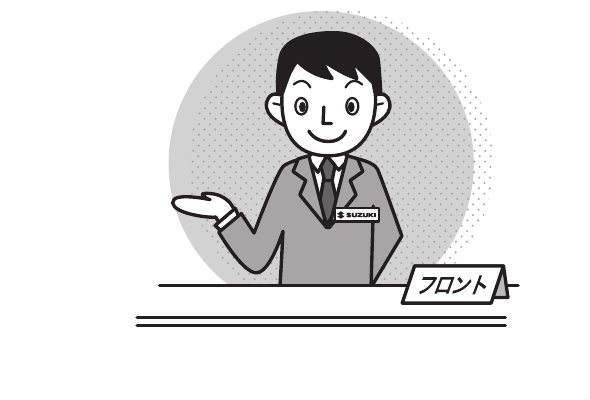

# 9. Указатель

## Указатель

Номера страниц в указателе соответствуют страницам оригинального руководства Suzuki.
Термины сгруппированы по русскому алфавиту; латинские сокращения и числовые обозначения вынесены отдельно.

### Обозначения и латиница

| Термин | Страницы |
| --- | --- |
| [ABS](04-driving.md#abs) | 4-53 |
| [ABS, антиблокировочная система, контрольная лампа](03-before-driving.md#контрольная-лампа-abs) | 3-80, 4-55 |
| [ABS, антиблокировочная система, описание системы](04-driving.md#abs) | 4-53 |
| [DSBS II, система поддержки торможения с двумя датчиками](04-driving.md#система-поддержки-торможения-с-двумя-датчиками-dsbs-ii) | 4-78 |
| [ESP](04-driving.md#esp) | 4-48 |
| [ISOFIX](03-before-driving.md#крепление-детского-удерживающего-устройства-isofix) | 3-68 |
| [USB-разъём](05-equipment.md#usb-разъём) | 5-13 |

### А

| Термин | Страницы |
| --- | --- |
| [Аварийная световая сигнализация](07-emergency.md#передний-указатель-поворота-аварийная-сигнализация) | 7-42, 7-43, 7-46 |
| [Сигнал экстренного торможения ESS](04-driving.md#сигнал-экстренного-торможения-ess) | 4-56 |
| [Автоматическая климатическая система](05-equipment.md#автоматическая-климатическая-система) | 5-24 |
| [Автоматическое отпирание дверей](03-before-driving.md#автоматическое-отпирание-дверей-при-срабатывании-подушек-безопасности-srs) | 3-17 |
| [Автоматическое повторное запирание](03-before-driving.md#автоматическое-повторное-запирание) | 3-8 |
| [Автомобиль с автоматической коробкой передач, управление](04-driving.md#автомобиль-с-автоматической-коробкой-передач) | 4-37 |
| [Автолюлька](03-before-driving.md#автолюлька) | 3-60 |
| [Адаптивный круиз-контроль](04-driving.md#адаптивный-круиз-контроль) | 4-107 |
| [Адаптивный круиз-контроль с функцией следования до полной остановки](04-driving.md#адаптивный-круиз-контроль-с-функцией-следования-во-всём-диапазоне-скоростей) | 4-117 |
| [Аквапланирование](02-safety.md#во-время-движения) | 2-23 |
| [Антенна](05-equipment.md#антенна) | 5-35 |
| [Антенна на крыше](05-equipment.md#крышная-антенна) | 5-35 |
| [Аудиосистема](05-equipment.md#аудиосистема) | 5-36 |

### Б

| Термин | Страницы |
| --- | --- |
| [Багажный ящик](05-equipment.md#багажный-ящик) | 5-14 |
| [Бензин, топливо](02-safety.md#при-заправке) | 2-32, 8-1 |
| [Бензиновый сажевый фильтр GPF](04-driving.md#бензиновый-сажевый-фильтр-gpf) | 4-16 |
| [Блокировка извлечения ключа](04-driving.md#блокировка-извлечения-ключа) | 4-34 |
| [Блокировка селектора](04-driving.md#система-блокировки-селектора) | 4-31 |
| [Буксировка](07-emergency.md#если-автомобиль-неисправен) | 7-3 |
| [Буксировка тросом](07-emergency.md#буксировка-тросом) | 7-5 |
| [Бустер](03-before-driving.md#бустер) | 2-8, 3-61 |

### В

| Термин | Страницы |
| --- | --- |
| [Вакуумный усилитель тормозов](02-safety.md#во-время-движения) | 2-26, 4-13, 7-8 |
| [Вместимость топливного бака](08-service-data.md#топливо-масла-и-рабочие-жидкости) | 8-1 |
| [Внутреннее зеркало заднего вида](03-before-driving.md#внутреннее-зеркало-заднего-вида) | 3-23 |
| [Вождение на автомобиле 4WD](02-safety.md#если-управляете-автомобилем-4wd) | 2-37, 4-42 |
| [Воздуховоды](05-equipment.md#кондиционер-и-отопитель) | 5-17 |
| [Воздуховоды кондиционера и отопителя](05-equipment.md#воздуховоды-кондиционера-и-отопителя) | 5-17 |
| [Воздушный фильтр климатической системы](05-equipment.md#как-эффективно-пользоваться-кондиционером) | 5-33 |
| [Воск](06-care.md#уход-за-кузовом) | 6-2 |
| [Выбор детского удерживающего устройства](03-before-driving.md#выбор-детского-удерживающего-устройства) | 3-59 |
| [Выключатели подогрева сидений](03-before-driving.md#выключатели-подогрева-сидений) | 3-31 |
| [Выключатель аварийной световой сигнализации](03-before-driving.md#выключатель-аварийной-сигнализации) | 3-136 |
| [Выключатель двигателя](04-driving.md#работа-выключателя-двигателя) | 4-2 |
| [Выключатель дефростера](05-equipment.md#автоматическая-климатическая-система) | 5-30 |
| [Выключатель зажигания, выключатель двигателя](04-driving.md#работа-выключателя-двигателя) | 4-2 |
| [Выключатель звукового сигнала](03-before-driving.md#выключатель-звукового-сигнала) | 3-139 |
| [Выключатель обогрева наружных зеркал](03-before-driving.md#выключатель-обогрева-наружных-зеркал) | 3-28 |
| [Выключатель обогрева стекла задней двери](05-equipment.md#выключатель-обогрева-заднего-стекла) | 5-31 |
| [Выключатель омывателя фар](03-before-driving.md#выключатель-омывателя-фар) | 3-140 |
| [Выключатель повышающей передачи O/D, индикация OFF](04-driving.md#выключатель-повышающей-передачи-od) | 4-33 |
| [Выключатель системы помощи при спуске](04-driving.md#система-помощи-при-спуске) | 4-59 |
| [Выключатель ESP OFF](04-driving.md#выключатель-esp-off) | 4-51 |
| [Выключатель OFF функции предотвращения схода с полосы](04-driving.md#выключатель-off-предотвращения-схода-с-полосы) | 4-94 |
| [Выключатель OFF системы автоматической остановки двигателя](04-driving.md#выключатель-off-системы-автоматической-остановки-двигателя) | 4-26 |

### Г

| Термин | Страницы |
| --- | --- |
| [Габаритные фонари](07-emergency.md#габаритный-фонарь) | 7-42, 7-43, 7-45 |
| [Галогенные фары](07-emergency.md#галогенная-фара) | 7-42, 7-43 |
| [Гаражный домкрат](07-emergency.md#подъём-автомобиля-домкратом) | 7-27 |
| [Главная предупреждающая лампа](03-before-driving.md#главная-предупреждающая-лампа) | 3-84 |

### Д

| Термин | Страницы |
| --- | --- |
| [Давление воздуха в шинах](08-service-data.md#давление-воздуха-в-шинах) | 8-5 |
| [Двери](03-before-driving.md#двери) | 3-13 |
| [Дверные карманы](05-equipment.md#дверные-карманы) | 5-12 |
| [Движение по снежной дороге](06-care.md#движение-по-снежной-дороге) | 6-20 |
| [Держатель билетов на солнцезащитном козырьке](05-equipment.md#солнцезащитные-козырьки) | 5-5 |
| [Детское удерживающее устройство](03-before-driving.md#выбор-детского-удерживающего-устройства) | 3-60 |
| [Дефростер, кондиционер и отопитель](05-equipment.md#кондиционер-и-отопитель) | 5-17 |
| [Дистанционное складывание наружных зеркал](03-before-driving.md#дистанционное-складывание-наружных-зеркал) | 3-26 |
| [Долив жидкости стеклоомывателя](06-care.md#долив-жидкости-стеклоомывателя) | 6-16 |
| [Дополнительные зеркала нижнего бокового обзора](03-before-driving.md#дополнительные-зеркала-нижнего-бокового-обзора) | 3-24 |
| [Верхний стоп-сигнал](07-emergency.md#мощность-ламп) | 7-42, 7-43 |

### Е

| Термин | Страницы |
| --- | --- |
| [Ежедневный осмотр](02-safety.md#подготовка-перед-выездом-проверка-автомобиля) | 2-2, 8-1 |
| [Если автомобиль застрял](02-safety.md#если-автомобиль-застрял) | 2-25 |
| [Если автомобиль неисправен](07-emergency.md#если-автомобиль-неисправен) | 7-2 |
| [Если автомобиль оказался в воде](07-emergency.md#если-автомобиль-оказался-в-воде) | 7-9 |
| [Если блокировка рулевой колонки не снимается](04-driving.md#если-блокировка-рулевой-колонки-не-снимается) | 4-4 |
| [Если звучит предупреждающий зуммер](01-quick-guide.md#предупреждающий-зуммер) | 1-23 |
| [Если отдыхаете в автомобиле](02-safety.md#во-время-стоянки) | 2-29 |
| [Если питание не переключается](04-driving.md#система-бесключевого-запуска-кнопкой) | 4-8 |
| [Если произошла авария](07-emergency.md#если-произошла-авария) | 7-10 |

### Ж

| Термин | Страницы |
| --- | --- |
| [Жёсткие опоры](07-emergency.md#подъём-автомобиля-домкратом) | 7-27 |
| [Жидкость стеклоомывателя](06-care.md#жидкость-стеклоомывателя) | 6-16, 6-17, 8-2, 8-6, 8-7 |

### З

| Термин | Страницы |
| --- | --- |
| [Заглохший двигатель](07-emergency.md#если-автомобиль-неисправен) | 7-3 |
| [Задние сиденья](03-before-driving.md#задние-сиденья) | 3-32 |
| [Задний комбинированный фонарь](07-emergency.md#задний-комбинированный-фонарь) | 7-47 |
| [Замена наружных ламп](07-emergency.md#при-замене-лампы) | 7-40 |
| [Замена резинок щёток стеклоочистителей](06-care.md#замена-резинок-щёток-стеклоочистителей) | 6-13 |
| [Замена элемента питания пульта](06-care.md#замена-элемента-питания-пульта-дистанционного-управления) | 6-9 |
| [Замена элемента питания пульта дистанционного управления](06-care.md#замена-элемента-питания-пульта-дистанционного-управления) | 6-9 |
| [Запас хода](03-before-driving.md#запас-хода) | 3-106 |
| [Запасное колесо](07-emergency.md#запасное-колесо) | 7-18 |
| [Заправка топливом](02-safety.md#при-заправке) | 2-30, 5-2, 8-1 |
| [Затопленный участок дороги](02-safety.md#не-ездите-по-затопленным-местам-и-глубоким-лужам) | 2-24 |
| [Защита от запирания пульта в автомобиле](03-before-driving.md#защита-от-запирания-пульта-в-автомобиле) | 3-12 |
| [Защита от защемления](03-before-driving.md#защита-от-защемления) | 3-21 |
| [Зеркало с противоослепляющим режимом](03-before-driving.md#зеркало-с-противоослепляющим-режимом) | 3-23 |
| [Зимние шины](06-care.md#перед-поездкой-в-холодную-погоду) | 6-18 |
| [Зимние щётки стеклоочистителей](06-care.md#зимние-щётки-стеклоочистителей) | 6-18 |
| [Знак аварийной остановки](07-emergency.md#держите-в-автомобиле-знак-аварийной-остановки) | 7-2 |
| [Зуммер предупреждения о выключателе двигателя, оставленном в ACC](04-driving.md#зуммер-предупреждения-о-выключателе-двигателя-оставленном-в-acc) | 4-16 |
| [Зуммер предупреждения о выносе пульта из автомобиля](04-driving.md#предупреждение-о-выносе-пульта-дистанционного-управления-из-автомобиля) | 4-8, 4-13 |
| [Зуммер предупреждения о забытом ключе](04-driving.md#зуммер-предупреждения-о-забытом-ключе) | 4-15 |
| [Зуммер предупреждения о невыключенном освещении](03-before-driving.md#зуммер-предупреждения-о-невыключенном-освещении) | 3-132 |
| [Зуммер предупреждения о неотпущенном стояночном тормозе](04-driving.md#зуммер-предупреждения-о-неотпущенном-стояночном-тормозе) | 4-28 |
| [Зуммер предупреждения о несработавшей блокировке рулевой колонки](04-driving.md#зуммер-предупреждения-о-несработавшей-блокировке-рулевой-колонки) | 4-16 |
| [Зуммер предупреждения о несработавшей наружной кнопке](03-before-driving.md#предупреждающий-зуммер-наружной-кнопки) | 3-12 |
| [Зуммер предупреждения о ремне безопасности](03-before-driving.md#предупреждающий-зуммер-ремня-безопасности) | 3-38 |

### И

| Термин | Страницы |
| --- | --- |
| [Индикатор автоматической остановки двигателя](03-before-driving.md#индикатор-системы-автоматической-остановки-двигателя) | 3-94 |
| [Индикатор адаптивного круиз-контроля](03-before-driving.md#индикатор-адаптивного-круиз-контроля) | 3-92 |
| [Индикатор включённого наружного освещения](03-before-driving.md#индикатор-включённого-наружного-освещения) | 3-87 |
| [Индикатор дальнего света фар](03-before-driving.md#индикатор-дальнего-света-фар) | 3-87 |
| [Индикатор низкой температуры охлаждающей жидкости](03-before-driving.md#индикатор-низкой-температуры-охлаждающей-жидкости-синий) | 3-89 |
| [Индикатор охранной сигнализации](03-before-driving.md#индикатор-охранной-сигнализации) | 3-19, 3-93 |
| [Индикатор передних противотуманных фар](03-before-driving.md#индикатор-передних-противотуманных-фар) | 3-93 |
| [Индикатор работы автоматического подруливания](03-before-driving.md#индикатор-работы-автоматического-подруливания) | 3-92 |
| [Индикатор работы парковочных датчиков](03-before-driving.md#индикатор-работы-парковочных-датчиков) | 3-95 |
| [Индикатор работы функции предотвращения схода с полосы](03-before-driving.md#индикатор-работы-предотвращения-схода-с-полосы) | 3-91 |
| [Индикатор работы системы автоматического дальнего света](03-before-driving.md#индикатор-работы-системы-автоматического-дальнего-света) | 3-94 |
| [Индикатор работы ESP](03-before-driving.md#индикатор-работы-esp) | 3-88, 4-50 |
| [Индикатор системы помощи при спуске](04-driving.md#индикатор-системы-помощи-при-спуске) | 3-94, 4-61 |
| [Индикатор указателей поворота](03-before-driving.md#индикатор-указателей-поворота) | 3-87 |
| [Индикатор 4WD](03-before-driving.md#индикатор-4wd) | 3-88, 4-43 |
| [Индикатор ESP OFF](03-before-driving.md#индикатор-esp-off) | 3-89, 4-52 |
| [Индикатор O/D OFF](03-before-driving.md#индикатор-отключения-повышающей-передачи-od) | 3-93 |
| [Индикатор OFF предотвращения схода с полосы](03-before-driving.md#индикатор-отключения-предотвращения-схода-с-полосы) | 3-91 |
| [Индикатор OFF распознавания дорожных знаков](03-before-driving.md#индикатор-отключения-распознавания-дорожных-знаков) | 3-92 |
| [Индикатор OFF системы автоматической остановки двигателя](03-before-driving.md#индикатор-отключения-системы-автоматической-остановки-двигателя) | 3-95 |
| [Индикатор OFF DSBS II](03-before-driving.md#индикатор-отключения-системы-поддержки-торможения-с-двумя-датчиками-dsbs-ii) | 3-90 |
| [Индикатор R (задний ход)](03-before-driving.md#индикатор-r-задний-ход) | 3-96 |
| [Индикаторы](01-quick-guide.md#контрольные-лампы-и-индикаторы) | 1-20 |
| [Индикация положения селектора](03-before-driving.md#положение-селектора) | 3-111 |
| [Инструмент](07-emergency.md#место-хранения-инструмента-и-домкрата) | 7-17 |
| [Информационный переключатель](03-before-driving.md#информационный-переключатель) | 3-74 |

### К

| Термин | Страницы |
| --- | --- |
| [Как остановить двигатель](04-driving.md#остановка-двигателя) | 4-13 |
| [Как читать контрольные лампы и индикаторы](03-before-driving.md#контрольные-лампы-и-индикаторы) | 3-75 |
| [Как читать показания приборов](03-before-driving.md#как-читать-показания-приборов) | 3-72 |
| [Камера заднего вида](04-driving.md#камера-заднего-вида) | 4-141 |
| [Капот](05-equipment.md#капот) | 5-3 |
| [Кармашек на спинке сиденья переднего пассажира](05-equipment.md#кармашек-на-спинке-сиденья-переднего-пассажира) | 5-14 |
| [Кармашек центральной консоли](05-equipment.md#кармашек-центральной-консоли) | 5-9 |
| [Ключ зажигания](03-before-driving.md#ключи) | 3-2 |
| [Ключи](03-before-driving.md#ключи) | 3-2 |
| [Когда останавливаете двигатель](04-driving.md#остановка-двигателя) | 4-13 |
| [Когда перевозите детей](02-safety.md#если-перевозите-детей) | 2-6 |
| [Комплекс систем помощи водителю Suzuki Safety Support](04-driving.md#системы-помощи-водителю-suzuki-safety-support) | 4-62 |
| [Кондиционер с ручным управлением](05-equipment.md#кондиционер-с-ручным-управлением) | 5-19 |
| [Контрольная лампа бензинового сажевого фильтра GPF](03-before-driving.md#контрольная-лампа-бензинового-сажевого-фильтра-gpf) | 3-86, 4-17 |
| [Контрольная лампа давления масла](03-before-driving.md#контрольная-лампа-давления-масла) | 3-82 |
| [Контрольная лампа двигателя](03-before-driving.md#контрольная-лампа-двигателя) | 3-80 |
| [Контрольная лампа задних ремней безопасности](03-before-driving.md#контрольная-лампа-задних-ремней-безопасности) | 3-77 |
| [Контрольная лампа зарядки](03-before-driving.md#контрольная-лампа-зарядки) | 3-82 |
| [Контрольная лампа иммобилайзера](03-before-driving.md#контрольная-лампа-иммобилайзера) | 3-83, 4-5 |
| [Контрольная лампа низкого уровня топлива](03-before-driving.md#контрольная-лампа-низкого-уровня-топлива) | 3-79 |
| [Контрольная лампа открытой двери или капота](03-before-driving.md#контрольная-лампа-открытой-двери-или-капота) | 3-84 |
| [Контрольная лампа передних ремней безопасности](03-before-driving.md#контрольная-лампа-передних-ремней-безопасности) | 3-76 |
| [Контрольная лампа подушек безопасности SRS](03-before-driving.md#контрольная-лампа-подушек-безопасности-srs) | 3-45, 3-58, 3-78 |
| [Контрольная лампа ремня безопасности](03-before-driving.md#контрольные-лампы-и-индикаторы) | 3-76, 3-77 |
| [Контрольная лампа системы автоматического дальнего света](03-before-driving.md#контрольная-лампа-системы-автоматического-дальнего-света) | 3-85 |
| [Контрольная лампа температуры охлаждающей жидкости](03-before-driving.md#контрольные-лампы-и-индикаторы) | 3-85 |
| [Контрольная лампа тормозной системы](03-before-driving.md#контрольные-лампы-и-индикаторы) | 3-75 |
| [Контрольная лампа трансмиссии](03-before-driving.md#контрольная-лампа-трансмиссии) | 3-83 |
| [Контрольная лампа электроусилителя рулевого управления](03-before-driving.md#контрольная-лампа-электроусилителя-рулевого-управления) | 3-81 |
| [Контрольная лампа GPF](04-driving.md#предупреждающая-лампа-gpf) | 4-17 |
| [Контрольные лампы](01-quick-guide.md#предупреждающие-лампы) | 1-17 |
| [Корректор фар](03-before-driving.md#корректор-фар) | 3-134 |
| [Косметическое зеркало](05-equipment.md#косметическое-зеркало) | 5-6 |
| [Крепление детского удерживающего устройства ремнём безопасности](03-before-driving.md#крепление-детского-удерживающего-устройства-ремнём-безопасности) | 3-66 |
| [Крепления для детского удерживающего устройства ISOFIX](03-before-driving.md#крепление-детского-удерживающего-устройства-isofix) | 3-68 |
| [Крышка радиатора](07-emergency.md#что-такое-перегрев) | 7-34, 8-6, 8-7 |
| [Крышка топливного бака](05-equipment.md#крышка-топливного-бака) | 5-2 |

### Л

| Термин | Страницы |
| --- | --- |
| [Лючок топливного бака](05-equipment.md#лючок-топливного-бака) | 5-2 |

### М

| Термин | Страницы |
| --- | --- |
| [Мгновенный расход топлива](03-before-driving.md#мгновенный-расход-топлива) | 3-105 |
| [Меры предосторожности во время движения](02-safety.md#во-время-движения) | 2-19 |
| [Места для хранения в панели приборов](05-equipment.md#места-для-хранения-в-панели-приборов) | 5-9 |
| [Многофункциональный информационный дисплей](03-before-driving.md#многофункциональный-информационный-дисплей) | 3-97 |
| [Многофункциональный информационный дисплей в комбинации приборов](03-before-driving.md#многофункциональный-информационный-дисплей) | 3-97 |
| [Мобильный телефон](02-safety.md#во-время-движения) | 2-20 |
| [Мойка автомобиля](06-care.md#уход-за-кузовом) | 6-2 |
| [Моторное масло](01-quick-guide.md#моторное-масло) | 2-44, 2-45, 3-82, 8-1 |
| [Моторный отсек](08-service-data.md#загляните-в-моторный-отсек) | 8-6 |
| [Мощность ламп салона](08-service-data.md#лампы-салона) | 8-4 |
| [Мощность наружных ламп](07-emergency.md#мощность-ламп) | 7-42 |

### Н

| Термин | Страницы |
| --- | --- |
| [Наружная кнопка](03-before-driving.md#пульт-дистанционного-управления) | 3-10 |
| [Наружные зеркала](03-before-driving.md#наружные-зеркала) | 3-23 |
| [Настройка климатической системы при автоматической остановке двигателя](04-driving.md#настройка-климатической-системы-при-автоматической-остановке-двигателя) | 4-27 |
| [Начальные настройки](08-service-data.md#функции-которые-необходимо-инициализировать) | 8-8 |
| [Неразборные световые приборы](07-emergency.md#неразборные-световые-приборы) | 7-43 |
| [Номерная пластина ключа](03-before-driving.md#номерная-пластина-ключа) | 3-4 |

### О

| Термин | Страницы |
| --- | --- |
| [Обдув стекла, дефростер](05-equipment.md#кондиционер-и-отопитель) | 5-17, 5-30 |
| [Обледеневшая дорога](06-care.md#движение-по-снежной-дороге) | 6-20 |
| [Обогрев стекла задней двери](05-equipment.md#выключатель-обогрева-заднего-стекла) | 5-31 |
| [Обязательно к прочтению: безопасность вождения](02-safety.md#2-обязательно-к-прочтению-безопасность-вождения) | 2-2 |
| [Ограничитель усилия ремня безопасности, передние сиденья](03-before-driving.md#ограничители-усилия-ремней-безопасности-передние-сиденья-и-боковые-места-заднего-сиденья) | 3-45 |
| [Одометр](03-before-driving.md#одометр) | 3-112 |
| [Отображение работы педали акселератора и тормоза](03-before-driving.md#отображение-работы-педали-акселератора-и-тормоза) | 3-109 |
| [Отопитель, кондиционер](05-equipment.md#кондиционер-и-отопитель) | 5-17 |
| [Охлаждающая жидкость, заправочный объём](08-service-data.md#охлаждающая-жидкость-омыватель-и-тормозная-жидкость) | 8-2 |
| [Охлаждающая жидкость, эксплуатация в холодную погоду](06-care.md#охлаждающая-жидкость) | 6-17 |
| [Охранная сигнализация](03-before-driving.md#охранная-сигнализация) | 3-17 |

### П

| Термин | Страницы |
| --- | --- |
| [Парковочные датчики](04-driving.md#парковочные-датчики) | 4-127 |
| [Перегоревший предохранитель](07-emergency.md#перегоревший-предохранитель) | 7-35 |
| [Перегрев двигателя](07-emergency.md#перегрев-двигателя) | 7-34 |
| [Перед выездом](02-safety.md#подготовка-перед-выездом-проверка-автомобиля) | 2-2 |
| [Передние противотуманные фары](07-emergency.md#передняя-противотуманная-фара) | 7-42, 7-44 |
| [Передние сиденья](03-before-driving.md#передние-сиденья) | 3-29 |
| [Передний плафон салона](05-equipment.md#освещение-салона) | 5-7, 8-4 |
| [Передний радар](04-driving.md#передняя-камера-передний-радар-и-ультразвуковые-датчики) | 4-64 |
| [Передняя камера](04-driving.md#передняя-камера-передний-радар-и-ультразвуковые-датчики) | 4-64 |
| [Переключатели аудиосистемы на рулевом колесе](05-equipment.md#переключатели-аудиосистемы-на-рулевом-колесе) | 5-36 |
| [Переключатель заднего стеклоочистителя и омывателя](03-before-driving.md#переключатель-стеклоочистителя-и-омывателя) | 3-138 |
| [Переключатель освещения](03-before-driving.md#переключатель-освещения) | 3-129 |
| [Переключатель переднего стеклоочистителя и омывателя](03-before-driving.md#переключатель-стеклоочистителя-и-омывателя) | 3-138 |
| [Переключатель противотуманных фар](03-before-driving.md#переключатель-передних-противотуманных-фар) | 3-134 |
| [Переключатель регулировки наружных зеркал](03-before-driving.md#переключатель-регулировки-наружных-зеркал) | 3-23 |
| [Переключатель складывания наружных зеркал](03-before-driving.md#переключатель-складывания-наружных-зеркал) | 3-25 |
| [Переключатель стеклоочистителей](03-before-driving.md#переключатель-стеклоочистителя-и-омывателя) | 3-137 |
| [Переключатель стеклоочистителя и омывателя](03-before-driving.md#переключатель-стеклоочистителя-и-омывателя) | 3-137 |
| [Переключатель указателей поворота](03-before-driving.md#переключатель-указателей-поворота) | 3-136 |
| [Переключение питания](04-driving.md#переключение-питания) | 4-7 |
| [Перестановка колёс](06-care.md#перестановка-колёс) | 6-7 |
| [Перчаточный ящик](05-equipment.md#перчаточный-ящик) | 5-10 |
| [Плафон багажного отделения](05-equipment.md#освещение-салона) | 5-7, 8-4 |
| [Площадка для левой ноги](05-equipment.md#площадка-для-левой-ноги) | 5-14 |
| [Повышающая передача O/D, описание](04-driving.md#выключатель-повышающей-передачи-od) | 4-32 |
| [Подача наружного воздуха, кондиционер и отопитель](05-equipment.md#кондиционер-с-ручным-управлением) | 5-21, 5-28 |
| [Подголовники задних сидений](03-before-driving.md#подголовники-задних-сидений) | 3-32 |
| [Подголовники передних сидений](03-before-driving.md#передние-сиденья) | 3-30 |
| [Подготовка к замене шины](07-emergency.md#подготовка-к-замене-шины) | 7-24 |
| [Система помощи при торможении на малой скорости при движении вперёд и назад](04-driving.md#поддержка-торможения-на-малой-скорости-при-движении-вперёд-и-назад) | 4-131 |
| [Помощь при торможении при движении вперёд на малой скорости](04-driving.md#поддержка-торможения-на-малой-скорости-при-движении-вперёд-и-назад) | 4-131 |
| [Помощь при торможении при движении назад](04-driving.md#поддержка-торможения-при-движении-назад) | 4-131 |
| [Подключаемый полный привод 4WD](04-driving.md#переключение-2wd4wd) | 4-42 |
| [Подсветка выключателя двигателя](04-driving.md#подсветка-выключателя-двигателя) | 4-9 |
| [Подстаканники центральной консоли](05-equipment.md#подстаканники-центральной-консоли) | 5-10 |
| [Подтверждение запирания и отпирания](03-before-driving.md#подтверждение-запирания-и-отпирания) | 3-7 |
| [Подъём домкратом при проколе шины](07-emergency.md#подъём-автомобиля-домкратом) | 7-25 |
| [Подъём домкратом при установке цепей противоскольжения](06-care.md#установка-цепей-противоскольжения) | 6-23 |
| [Ползучий ход](02-safety.md#если-управляете-автомобилем-с-автоматической-коробкой-передач) | 2-32, 4-33 |
| [Полностью разложенные сиденья](03-before-driving.md#полностью-разложенные-сиденья) | 3-35 |
| [Положение R (задний ход), предупреждающий зуммер](02-safety.md#если-управляете-автомобилем-с-автоматической-коробкой-передач) | 2-32, 4-35 |
| [Поручень для посадки и высадки переднего пассажира](05-equipment.md#поручень-для-посадки-и-высадки-переднего-пассажира) | 5-16 |
| [После замены колеса](07-emergency.md#после-замены-колеса) | 7-30 |
| [Предельная скорость при переключении вниз](04-driving.md#предельная-скорость-при-переключении-вниз) | 4-29 |
| [Преднатяжитель ремня безопасности](03-before-driving.md#преднатяжители-ремней-безопасности-передние-сиденья) | 3-44 |
| [Предотвращение ошибочного начала движения](04-driving.md#предотвращение-ошибочного-начала-движения) | 4-87 |
| [Предотвращение ошибочного начала движения назад](04-driving.md#предотвращение-ошибочного-начала-движения-назад) | 4-137 |
| [Предупреждение о выносе пульта из автомобиля](04-driving.md#предупреждение-о-выносе-пульта-дистанционного-управления-из-автомобиля) | 4-9 |
| [Предупреждение о неразблокированной рулевой колонке](04-driving.md#предупреждение-о-неразблокированной-рулевой-колонке) | 4-4 |
| [Преодоление водных преград](02-safety.md#если-управляете-автомобилем-4wd) | 2-38 |
| [При замене шин](06-care.md#при-замене-шин) | 6-8 |
| [При парковке](04-driving.md#при-парковке) | 2-27, 4-40, 6-21 |
| [При сильном боковом ветре](02-safety.md#во-время-движения) | 2-22 |
| [Принудительное переключение вниз](04-driving.md#принудительное-переключение-вниз) | 4-34, 4-39 |
| [Проверка ламп](07-emergency.md#проверка-ламп) | 7-40 |
| [Прогрев двигателя](02-safety.md#экологичное-вождение) | 2-46 |
| [Прокол шины, замена колеса](07-emergency.md#прокол-шины) | 7-24 |
| [Противогололёдные реагенты](06-care.md#стоянка-в-холодную-погоду) | 6-21 |
| [Противооткатные упоры](02-safety.md#во-время-стоянки) | 2-28, 6-18 |
| [Противотуманные фары](07-emergency.md#передняя-противотуманная-фара) | 7-42, 7-44 |
| [Пульт дистанционного управления](03-before-driving.md#пульт-дистанционного-управления) | 3-8 |
| [Пусковые провода](07-emergency.md#если-аккумуляторная-батарея-разряжена) | 7-31 |

### Р

| Термин | Страницы |
| --- | --- |
| [Размер колёс](08-service-data.md#размеры-колёс) | 8-5 |
| [Разряд аккумуляторной батареи](07-emergency.md#если-аккумуляторная-батарея-разряжена) | 7-31 |
| [Разряд свинцово-кислотной аккумуляторной батареи](07-emergency.md#что-такое-разряд-свинцово-кислотной-аккумуляторной-батареи) | 7-31 |
| [Распознавание дорожных знаков](04-driving.md#распознавание-дорожных-знаков) | 4-103 |
| [Расположение ламп](07-emergency.md#расположение-ламп) | 7-41 |
| [Регулировка рулевой колонки по высоте](03-before-driving.md#регулировка-рулевой-колонки-по-высоте) | 3-28 |
| [Регулировка яркости](03-before-driving.md#регулировка-яркости) | 3-73 |
| [Регулировка яркости комбинации приборов](03-before-driving.md#регулировка-яркости) | 3-73 |
| [Режим настроек](08-service-data.md#режим-настроек) | 8-9 |
| [Ремни безопасности](03-before-driving.md#ремни-безопасности) | 3-37 |
| [Рециркуляция воздуха, кондиционер и отопитель](05-equipment.md#кондиционер-с-ручным-управлением) | 5-21, 5-28 |
| [Розетка питания 12 В](05-equipment.md#розетки-питания-12-в) | 5-12 |
| [Рычаг переключения передач](04-driving.md#рычаг-переключения-передач) | 4-28 |
| [Рычаг продольной регулировки сиденья](03-before-driving.md#передние-сиденья) | 3-29 |
| [Рычаг раздаточной коробки](04-driving.md#переключение-2wd4wd) | 4-43 |
| [Рычаг регулировки наклона спинки](03-before-driving.md#передние-сиденья) | 3-29 |

### С

| Термин | Страницы |
| --- | --- |
| [Салонное освещение](05-equipment.md#освещение-салона) | 5-7, 8-4 |
| [Светодиодные фары](07-emergency.md#неразборные-световые-приборы) | 7-42, 7-43 |
| [Свинцово-кислотная аккумуляторная батарея](06-care.md#свинцово-кислотная-аккумуляторная-батарея) | 6-17, 8-2 |
| [Свинцово-кислотная аккумуляторная батарея, меры предосторожности](02-safety.md#проверяйте-уровень-жидкости-свинцово-кислотного-аккумулятора) | 2-4 |
| [Селектор автоматической коробки передач](04-driving.md#управление-селектором-передач) | 4-30 |
| [Сигнальный факел](07-emergency.md#сигнальный-факел) | 7-5 |
| [Сиденья](03-before-driving.md#передние-сиденья) | 3-29, 3-32 |
| [Система автоматического выключения освещения](03-before-driving.md#система-автоматического-выключения-освещения) | 3-132 |
| [Система автоматического дальнего света](04-driving.md#система-автоматического-дальнего-света) | 4-99 |
| [Система автоматической остановки двигателя](04-driving.md#система-автоматической-остановки-двигателя-на-холостом-ходу) | 4-17 |
| [Система бесключевого доступа](03-before-driving.md#система-бесключевого-доступа) | 3-5 |
| [Система бесключевого запуска кнопкой](04-driving.md#система-бесключевого-запуска-кнопкой) | 4-6 |
| [Система запуска с выжатым сцеплением](04-driving.md#система-запуска-с-выжатым-сцеплением) | 4-11 |
| [Система иммобилайзера](04-driving.md#система-иммобилайзера) | 4-4 |
| [Система помощи при спуске](04-driving.md#система-помощи-при-спуске) | 4-59 |
| [Система подушек безопасности SRS](02-safety.md#если-автомобиль-оснащён-подушками-безопасности-srs) | 2-34, 3-46 |
| [Система удержания на подъёме](04-driving.md#система-удержания-на-подъёме) | 4-57 |
| [Система экстренного вызова Suzuki](07-emergency.md#система-экстренного-вызова-suzuki-helpnet) | 7-11 |
| [Снятие и установка колеса](07-emergency.md#снятие-и-установка-колеса) | 7-28 |
| [Солнцезащитный козырёк](05-equipment.md#солнцезащитные-козырьки) | 5-5 |
| [Сообщения многофункционального информационного дисплея](03-before-driving.md#сообщения-многофункционального-информационного-дисплея) | 3-113 |
| [Спидометр](03-before-driving.md#спидометр) | 3-73 |
| [Средний расход топлива](03-before-driving.md#средний-расход-топлива) | 3-105 |
| [Средний расход топлива за одну поездку](03-before-driving.md#средний-расход-топлива) | 3-105 |
| [Средний расход топлива за 5 минут](03-before-driving.md#средний-расход-топлива) | 3-105 |
| [Средняя скорость](03-before-driving.md#средняя-скорость) | 3-107 |
| [Средняя скорость за 5 минут](03-before-driving.md#средняя-скорость) | 3-107 |
| [Стеклоочистители, эксплуатация в холодную погоду](06-care.md#перед-поездкой-в-холодную-погоду) | 6-18, 6-22 |
| [Стояночный тормоз, управление](04-driving.md#стояночный-тормоз) | 4-27 |
| [Стояночный тормоз, эксплуатация в холодную погоду](06-care.md#стояночный-тормоз) | 6-21 |
| [Суммарное количество сэкономленного топлива](03-before-driving.md#суммарное-время-автоматической-остановки-двигателя-и-сэкономленное-топливо) | 3-108 |
| [Суммарное время автоматической остановки двигателя](03-before-driving.md#суммарное-время-автоматической-остановки-двигателя-и-сэкономленное-топливо) | 3-108 |
| [Суммарное время движения](03-before-driving.md#суммарное-время-движения) | 3-107 |
| [Счётчик поездки](03-before-driving.md#счётчик-поездки) | 3-112 |

### Т

| Термин | Страницы |
| --- | --- |
| [Тахометр](03-before-driving.md#тахометр) | 3-73 |
| [Топливо](08-service-data.md#топливо-масла-и-рабочие-жидкости) | 2-32, 8-1 |
| [Торможение двигателем](02-safety.md#во-время-движения) | 2-22 |
| [Тормоза, тормозная жидкость](08-service-data.md#охлаждающая-жидкость-омыватель-и-тормозная-жидкость) | 8-2 |

### У

| Термин | Страницы |
| --- | --- |
| [Уведомление о начале движения](04-driving.md#уведомление-о-начале-движения) | 4-97 |
| [Указатели поворота](07-emergency.md#передний-указатель-поворота-аварийная-сигнализация) | 7-42, 7-43, 7-46 |
| [Указатели поворота и аварийная световая сигнализация](07-emergency.md#передний-указатель-поворота-аварийная-сигнализация) | 7-43, 7-46 |
| [Указатель уровня топлива](03-before-driving.md#указатель-уровня-топлива) | 3-73 |
| [Ультразвуковые датчики](04-driving.md#передняя-камера-передний-радар-и-ультразвуковые-датчики) | 4-64 |
| [Управление переключением передач на подъёмах и спусках](04-driving.md#управление-переключением-передач-на-подъёмах-и-спусках) | 4-34 |
| [Управление селектором передач](04-driving.md#управление-селектором-передач) | 4-30 |
| [Уход за автомобилем](06-care.md#6-уход-за-автомобилем) | 6-2 |
| [Уход за ветровым стеклом](06-care.md#уход-за-ветровым-стеклом) | 6-4 |
| [Уход за внутренней стороной стекла задней двери](06-care.md#уход-за-внутренней-стороной-стекла-задней-двери) | 6-6 |
| [Уход за кузовом](06-care.md#уход-за-кузовом) | 6-2 |
| [Уход за пластиковыми деталями](06-care.md#уход-за-тканью-искусственной-кожей-и-пластиковыми-деталями) | 6-5 |
| [Уход за салоном](06-care.md#уход-за-салоном) | 6-5 |

### Ф

| Термин | Страницы |
| --- | --- |
| [Фары](07-emergency.md#мощность-ламп) | 7-42, 7-43 |
| [Фонарь освещения номерного знака](07-emergency.md#фонарь-освещения-номерного-знака) | 7-42, 7-48 |
| [Функция предотвращения схода с полосы](04-driving.md#предотвращение-схода-с-полосы) | 4-91 |

### Ц

| Термин | Страницы |
| --- | --- |
| [Центральный замок](03-before-driving.md#двери) | 3-16 |
| [Цепи противоскольжения](06-care.md#цепи-противоскольжения) | 6-23, 8-5 |

### Ч

| Термин | Страницы |
| --- | --- |
| [Частые вопросы](01-quick-guide.md#частые-вопросы) | 1-33 |
| [Часы](03-before-driving.md#часы) | 3-99 |
| [Чехол запасного колеса](07-emergency.md#запасное-колесо) | 7-18, 7-22 |

### Э

| Термин | Страницы |
| --- | --- |
| [Экономичное вождение](02-safety.md#экологичное-вождение) | 2-46 |
| [Экран завершения поездки](03-before-driving.md#экран-завершения-поездки) | 3-110 |
| [Эксплуатация автомобиля с турбонаддувом](02-safety.md#если-управляете-автомобилем-с-турбонаддувом) | 2-40 |
| [Эксплуатация в холодную погоду](06-care.md#эксплуатация-в-холодную-погоду) | 6-17 |
| [Экстренная ситуация](07-emergency.md#7-в-экстренной-ситуации) | 7-1 |
| [Электростеклоподъёмники](03-before-driving.md#электростеклоподъёмники) | 3-20 |

### Я

| Термин | Страницы |
| --- | --- |
| [Явление торможения в крутом повороте](02-safety.md#если-управляете-автомобилем-4wd) | 2-38 |

## Справочная информация

Номер документа руководства: `99011-77R41`.

### Обращения и консультации

По вопросам автомобиля, техосмотра, периодического осмотра и другого послепродажного обслуживания сначала обращайтесь к дилеру Suzuki, у которого был приобретён автомобиль, или в авторизованный сервис Suzuki.

Если обращаетесь в авторизованный сервис Suzuki, воспользуйтесь отдельной брошюрой «Сервисная сеть Suzuki для четырёхколёсных автомобилей» и свяжитесь с ближайшим сервисом.

Чтобы обращение было обработано точно и быстро, заранее подготовьте свидетельство о регистрации автомобиля и проверьте следующие сведения:

{ .center-image }

| Что подготовить | Сведения |
| --- | --- |
| (1) | Модель автомобиля, номер кузова, номер регистрационного знака и т. п. |
| (2) | Дата покупки |
| (3) | Пробег |
| (4) | Содержание обращения |
| (5) | Адрес, имя и телефонный номер владельца |
